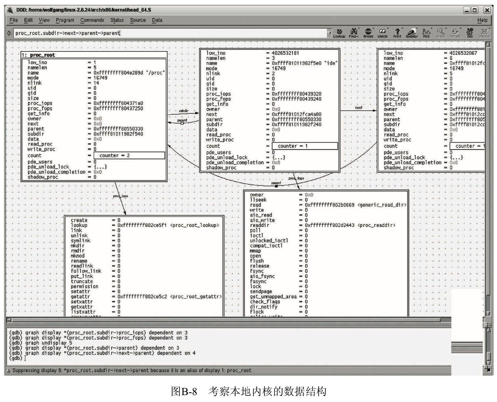

不仅要阅读**静态的源代码**, 还需要在**内核运行时**密切观察, 以跟踪其内部的动态过程.

对**普通的 C 语言程序**, 程序员很清楚如何做到这一点. 使用**编译器生成的调试信息**和**一个外部调试器**, 就可以**逐行单步跟踪程序的执行**(或者, 如果需要, 可以**逐行汇编跟踪**), 来查看和修改数据结构, 并在任一点暂停程序的控制流.

这只能借助于内核通过 ptrace 系统调用(在第 13 章讲过)提供的一些特别的特性来完成.

与**普通的 C 程序不同**, 内核本身**没有**由**外部实例**提供的**运行环境**, 内核本身负责**提供用户空间程序所需的这个运行环境**. 因而, 不可能用经典方式来调试内核本身.

# GDB 和 DDD

GDB 代表`GNU debugger`, 它是**默认的 Linux 调试器**. **每个 Linux 发行版**都带有**直接可用的 GDB 二进制文件**, 可以用适当的软件包管理系统. 当然, 读者完全可以自行从 www.gnu.org 网站(或其他镜像) 取得源代码进行编译, 但本附录就不讨论这些了.

该调试器提供了非常广泛的选项, 本附录只简要概述其用法. GDB 的详细讲述, 可以参见其附带的用法指南(makeinfo 格式), 也可以用 info gdb 查看.

为**调试一个程序**(在这方面, **内核也不例外**), **编译器**必须将**特别的调试信息**集成到**二进制文件**中, 以便调试器获取二进制文件和源代码之间关系的所有必要信息.

在**gcc 编译**时必须选中`-g`选项,  如下所示:

```
gcc -g test.c -o test
```

因为包含了**调试符号**, 导致生成的可执行文件长度增长颇多.

在**内核编译**期间也必须启用`-g`. 在**早期版本**中, 该选项必须以`CFLAGS_KERNEL`的名目进入到主 Makefile. 但在内核版本 2.5 开发期间, **内核配置**进入了一个**独立的选项**, `Kernel hacking->Compile
the kernel with debug info`, 用于设置该选项. 同一菜单中, 还包括了`Compile the kernel with frame pointers`选项, 也应该被选中, 因为它用于**限制活动记录或栈帧**(参见附录 C), 能够向调试器提供有用信息.

GDB 能够完成下列工作.

- **逐行**跟踪程序执行, 可以按**源代码逐行**执行或按**汇编语句逐行**执行.
- 确定程序中使用的**所有符号类型**.
- 显示或操作**符号的当前值**.
- **反引用**程序中的**指针**或访问随机的**存储单元**, 以**读取**或**修改**其值.
- 设置**断点**, 使得程序在执行到源代码中给定位置时暂停, 同时启用调试器.
- 设置**条件断点**, 在给定条件满足时暂停程序执行. 例如, 当某个变量的值设置为预定义值时.

具体可用的内核调试选项, 取决于所使用的方法.  用于执行这些操作的命令语法都易学易记, 因为都是基于 C 语言的. 这在 GDB 文档中解释得很好.

类似于大多数 UNIX 工具, GDB 也是**基于文本**的. 这有优点也有缺点, 特别是, 在文本界面下, **无法**通过**图形指针可视化显示**数据结构之间的关系. 同样, GDB 的源代码视图也不怎么理想, 因为它只能显示很短一段源代码.

DDD 是**Data Display Debugger**的简称, 开发该调试器是为了改进 GDB 的这些不足, 现在所有流行的发行版都包含了 DDD. 作为**X11**下的一个**图形化工具**, 它弥补了 GDB 的不足. DDD 是 GDB 的一个用户界面,  因而也支持 GDB 的所有特性. 因为在 DDD 中也可用直接输入所有的 GDB 命令, 所有选项都是可用的, 不仅仅是那些直接集成到图形用户界面中的特性.

DDD 软件包带有很好的使用指南, 特别地, 其用户界面非常直观, 因此本附录不解释如何使用 它.

# 本地内核

**proc 文件系统**包含了一个文件, 名为**kcore**. 其中包含了**内核当前状态的映像**, 格式为**ELF 内存转储格式**(参见附录 E). 因为 GDB 内存转储文件是可以**读取和处理**的, 因而可以**与内核及其调试符号联用**, 来可视化显示数据结构并读取其**内部状态**. GDB 内存转储文件通常用于用户空间程序的事后分 析, 以查明其崩溃原因.

必须用内核映像(包含调试符号)的名称和 kcore 文件的名称作为参数来调用 DDD:

```
ddd /home/wolfgang/linux-2.6.24/vmlinux /proc/kcore
```

很显然, 尽管不能对运行内核设置断点或类似项, DDD 很适于考察系统的数据结构, 如图 B-8 所示.



首先从内核中定义为**全局变量**的**数据结构实例**开始. 输入`graph display proc_root`, 即告知 DDD 显示`fs/proc_root.c`中声明的`proc_dir_entry 类型`的实例`proc_root`. 通过双击, 可以打开与该数据结构关联的其他实例.

>如果指针没有类型信息(对于标准双链表, 经常是这样), 可以在 GDB 的输入栏指定 C 语言风格的类型转换.

如果要使 DDD 检测**指向同一内存区**的**指针**, 并将箭头重定向到该结构的一个现存表示, 而不是重 新插入一个新的图示, 则需要启用`Data->Detect Aliases`选项. 在前一个例子中就是这样, parent 指针都(正确地)指向了同一个数据元素. 请注意, 在 DDD 以这种模式运作时, 速度会慢很多.

内存转储文件在由调试器处理时, 内核通常不会修改转储文件, 因而 GDB 不会注意到内核内存某些 值的改变, 改变必须通过 kcore 文件才能传播. 如果内存的内容与用户的修改相关, 该用户必须用 core /proc/kcore 显式重新加载内存转储文件. DDD 会自动将修改的值以黄色背景显示, 使之易于识别.

# KGDB

两台通过网络或串行电缆连接的机器, 提供了一个更好的调试环境, 此时可用的选项几乎与调试普通应用程序相同. KGDB 补丁在内核中安装一段简短的存根代码, 向在第二台系统上运行的调试器提供了一个接口. 因为 GDB 支持**远程调试**, 内核可以利用这种调试形式, 来提供断点、单步跟踪等特性.

KGDB 没有包含在内核版本 2.6.24 中, 但经过多年努力, 在读者阅读本书时, 它应该已经包含在内核版本 2.6.26 中了. 如果需要对旧版本的内核提供 KGDB 支持, 还有相关的补丁可用.

在获得一个具备 KGDB 支持的内核后, 配置中包含了新的菜单项`Kernel hacking->KGDB : kernel debugging with remote gdb`, 该选项必须启用. 如果使用串行接口进行数据传输, 必须对 特定硬件进行正确设置. 当然, 内核二进制映像还应该包含调试符号.  14

因为在撰写本书时, KGDB 仍然处于比较激烈的演化过程中, 对于如何将 gdb 连接到一个运行中 的内核, 读者可以参考 Documentation/DocBook/kgdb.html(可以用 make htmldocs 生成).