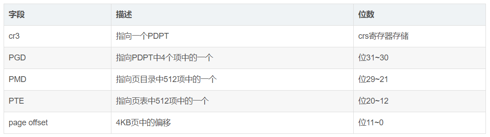
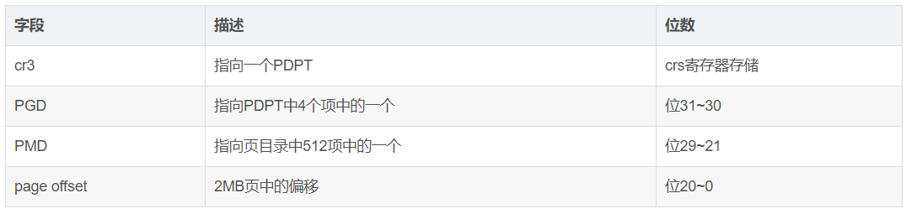
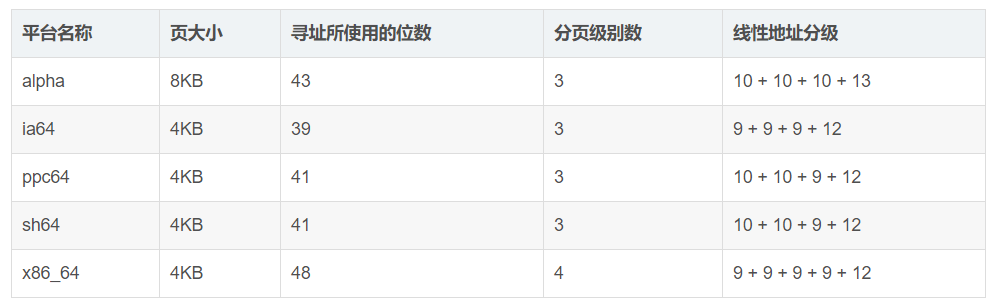

系统 32 位和 64 位应该指的是地址线位数, 但是不是物理地址总线地址, 而应该是虚拟地址. 对于 Linux 而言, 就是线性地址宽度(没有使用分段机制, 以及开启分页机制).

64 位的内核不是意味着就有 64 根地址线(虚拟地址). 因为没必要, 实际不需要那么大内存. 假设你有 38 位地址线(虚拟地址), 可以寻址到 2048G 的内存, 也按照 3:1 划分, 那么内核态就有 512G 范围, 你的 512G 物理内存可以一次性的全部映射到内核空间, 根本不需要高端内存.

Intel 32 位有四种, 32-bit(4KB 页大小和 4MB 页大小)和 PAE(4KB 页大小和 2MB 页大小).

然而, 大型服务器需要大于 4GB 的 RAM 来同时运行数以钱计的进程, 所以必须扩展 32 位 80x86 架构所支持的 RAM 容量.

Intel 通过在它的处理器上把管脚数从 32 增加到 36 满足这样的需要, 从 Pentinum Pro 开始, Intel 所有处理器的寻址能力可达到 2\^36=64GB, 但是只有引入一种新的分页机制才能把 32 位现行地址转换为 36 位物理地址才能使用所增加的物理地址.

从 Pentinum Pro 处理器开始, Intel 引入一种叫做物理地址扩展(Physical Address Extension,  PAE)的机制.

从 Pentium 模型开始, 80x86 微处理器引入了扩展分页(externded paging), 也叫页大小扩展[Page Size Extension], 它允许页框大小为 4MB 而不是 4KB. 扩展分页用于把大段连续的线性地址转换成相应的物理地址, 在这种情况下, 内核可以不用中间页表进行地址转换, 从而节省内存并保留 TLB 项.

> Linux 没有采用 4MB 页大小

正如前面所述, 通过设置页目录项的 Page Size 标志启用扩展分页功能. 在这种情况下, 分页单元把 32 位线性地址分成两个字段:
Directory: 最高 10 位.
Offfset: 其余 22 位.

扩展分页和正常分页的页目录项基本相同, 除了
- Page Size 标志必须被设置.
- 20 位物理地址字段只有最高 10 位是有意义的. 这是因为每一个物理地址都是在以 4MB 为边界的地方开始的, 故这个地址的最低 22 位为 0.

通过设置 cr4 处理器寄存器的 PSE 标志能使扩展分页与常规分页共存

Intel 为了支持 PAE 改变了分页机制

- 64GB 的 RAM 被分成了 2\^24 个页框,页表项的物理地址字段从 20 位扩展到了 24 位.因为**PAE 页表项**必须包含 12 个标志位(4K 页大小, 偏移 offset 位数需要 12 位)和 24 个物理地址位(因为页框是 2\^24 个, 所以需要 24 位物理地址位),总数之和为 36,**页表项大小从 32 位扩展到了 64 位**,结果,一个 4KB 的页表项包含 512 个表项而不是 1024 个表项

- 引入一个页目录指针表(Page Directory Pointer Table, PDPT)的页表新级别,它由 4 个 64 位表项组成.

- cr3 控制寄存器包含一个 27 位的页目录指针表(PDPT)基地址字段.因为 PDPT 存放在 RAM 的前 4GB 中,并在 32 字节(2^5)的倍数上对其, 因此 27 位足以表示这种表的基地址

- 当把线性地址映射到 4KB 的页时(页目录项中的 PS 标准清 0), 32 位线性地址将按照如下方式解释

当把现行地址映射到 2MB 的页时(页目录项中的 PS 标志置为 1), 32 位线性地址按照如下方式解释

总之, 一旦 cr3 被设置, 就可能寻址高达 4GB RAM, 如果我们期望堆更多的 RAM 进行寻址, 就必须在 cr3 中放置一个新值, 或改变 PDPT 的内容.

但是 PAE 的主要问题是线性地址仍然是 32 位长,　这就需要内核黑客用同一线性地址映射不同的 RAM 区. 很显然, PAE 并没有扩大进程的线性地址空间, 因为它只处理物理地址. 此外, 只有内核能够修改进程的页表, 所以在用户态下运行的程序不可能使用大于 4GB 的物理地址空间. 另一方面, PAE 允许内核使用容量高达 64GB 的 RAM, 从而显著的增加系统中的进程数目.

正常来说, 对于 32 位的系统两级页表已经足够了, 但是对于 64 位系统的计算机, 这远远不够.

首先假设一个大小为 4KB 的标准页.因为 1KB 覆盖 210 个地址的范围,4KB 覆盖 212 个地址,所以 offset 字段需要 12 位.这样线性地址空间就剩下 64-12=52 位分配给页中间表 Table 和页目录表 Directory.如果我们现在决定仅仅使用 64 位中的 48 位来寻址(这个限制其实已经足够了,2^48=256TB,即可达到 256TB 的寻址空间).剩下的 48-12=36 位被分配给 Table 和 Directory 字段.即使我们现在决定位两个字段各预留 18 位,那么每个进程的页目录和页表都包含 218 个项, 即超过 256000 个项.

基于这个原因, 所有 64 位处理器的硬件分页系统都使用了额外的分页级别.使用的级别取决于处理器的类型

注: ia64 是 intel 的一门高端技术, 不与 x86_64 系统兼容; IA-32e Paging 机制下线性地址映射到 4KB 的页

当然, 如果没有开启分页, 线性地址就是物理地址.

### 不同架构的分页机制

> 对于不同的体系结构, Linux 采用的四级页表目录的大小有所不同: 对于 i386 而言, 仅采用二级页表, 即页上层目录和页中层目录长度为 0; 对于启用 PAE 的 i386, 采用了三级页表, 即页上层目录长度为 0; 对于 64 位体系结构, 可以采用三级或四级页表, 具体选择由硬件决定.

对于没有启用物理地址扩展的 32 位系统, 两级页表已经足够了. 从本质上说 Linux 通过使"页上级目录"位和"页中间目录"位全为 0, 彻底取消了页上级目录和页中间目录字段. 不过, 页上级目录和页中间目录在指针序列中的位置被保留, 以便同样的代码在 32 位系统和 64 位系统下都能使用. 内核为页上级目录和页中间目录保留了一个位置, 这是通过把它们的页目录项数设置为 1, 并把这两个目录项映射到页全局目录的一个合适的目录项而实现的.

启用了物理地址扩展的 32 位系统使用了三级页表. Linux 的页全局目录对应 80x86 的页目录指针表(PDPT), 取消了页上级目录, 页中间目录对应 80x86 的页目录, Linux 的页表对应 80x86 的页表.

最终, 64 位系统使用三级还是四级分页取决于硬件对线性地址的位的划分.

### 线性地址转换成物理地址

地址转换过程有了上述的基本知识, 就很好理解四级页表模式下如何将虚拟地址转化为逻辑地址了. 基本过程如下:

1. 从 CR3 寄存器中读取页目录所在物理页面的基址(即所谓的页目录基址), 从线性地址的第一部分获取页目录项的索引, 两者相加得到页目录项的物理地址.

2. 第一次读取内存得到 pgd_t 结构的目录项, 从中取出物理页基址取出(具体位数与平台相关, 如果是 32 系统, 则为 20 位), 即页上级页目录的物理基地址.

3. 从线性地址的第二部分中取出页上级目录项的索引, 与页上级目录基地址相加得到页上级目录项的物理地址.

4. 第二次读取内存得到 pud_t 结构的目录项, 从中取出页中间目录的物理基地址.

5. 从线性地址的第三部分中取出页中间目录项的索引, 与页中间目录基址相加得到页中间目录项的物理地址.

6. 第三次读取内存得到 pmd_t 结构的目录项, 从中取出页表的物理基地址.

7. 从线性地址的第四部分中取出页表项的索引, 与页表基址相加得到页表项的物理地址.

8. 第四次读取内存得到 pte_t 结构的目录项, 从中取出物理页的基地址.

9. 从线性地址的第五部分中取出物理页内偏移量, 与物理页基址相加得到最终的物理地址.

10. 第五次读取内存得到最终要访问的数据.

整个过程是比较机械的, 每次转换先获取物理页基地址, 再从线性地址中获取索引, 合成物理地址后再访问内存. 不管是页表还是要访问的数据都是以页为单 位存放在主存中的, 因此每次访问内存时都要先获得基址, 再通过索引(或偏移)在页内访问数据, 因此可以将线性地址看作是若干个索引的集合.

参照: http://blog.csdn.net/gatieme/article/details/52402967