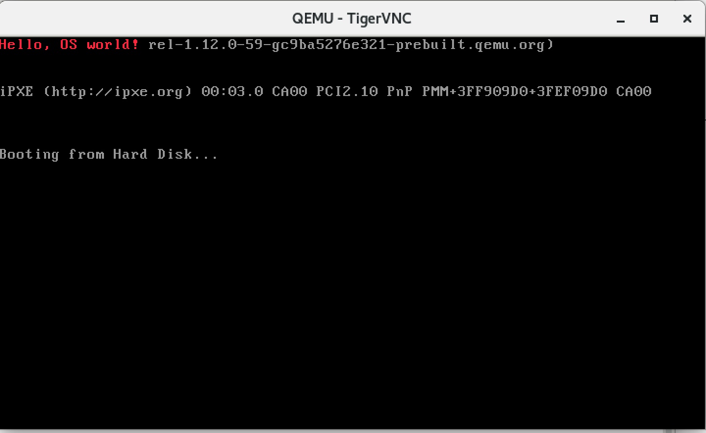

代码 1.1 chapter1/a/boot.asm

```asm
	org	07c00h			    ; 告诉编译器程序加载到 7c00 处
	mov	ax, cs
	mov	ds, ax
	mov	es, ax
	call	DispStr			; 调用显示字符串例程
	jmp	$			        ; 无限循环
DispStr:
	mov	ax, BootMessage
	mov	bp, ax			    ; ES:BP = 串地址
	mov	cx, 16			    ; CX = 串长度
	mov	ax, 01301h		    ; AH = 13,  AL = 01h
	mov	bx, 000ch		    ; 页号为 0(BH = 0) 黑底红字(BL = 0Ch,高亮)
	mov	dl, 0
	int	10h			        ; 10h 号中断
	ret
BootMessage:		db	"Hello, OS world!"
times 	510-($-$$)	db	0	; 填充剩下的空间, 使生成的二进制代码恰好为 512 字节
dw 	0xaa55				    ; 结束标志
```

把这段代码用 NASM 编译一下:

```
nasm boot.asm -o boot
```

我们就得到了一个**512 字节的 boot**, 让我们使用**软盘绝对扇区读写工具**将这个文件写到**一张空白软盘**的**第一个扇区**.

在 Linux 下可以这样做

```
# 创建软盘映像
# dd if=/dev/zero of=floppy.img bs=512 count=2880

# 将内容放到第一个扇区
# dd if=boot of=floppy.img bs=512 count=1 conv=notrunc

# 启动虚拟机
# qemu -fda floppy.img

# 当然也可直接从 boot 启动
# qemu -fda boot
```

建议在 Linux 图形环境下操作, 然后 VNC 进去就能看到



在 Windows 下可以这样做(7):

```
rawrite2.exe -f boot -d A
```

好了, 你的第一个"操作系统"就已经完成了. 这张软盘已经是一张引导盘了. 把它放到你的软驱中重新启动计算机, 从软盘引导, 你看到了什么?计算机显示出你的字符串了！红色的"Hello,OSworld!", 多么奇妙啊, 你的"操作系统"在运行了！如果使用虚拟机比如 Bochs 的话(下文中将会有关于 Bochs 的详细介绍), 你应该能看到如图 1.1 所示的画面(8).
