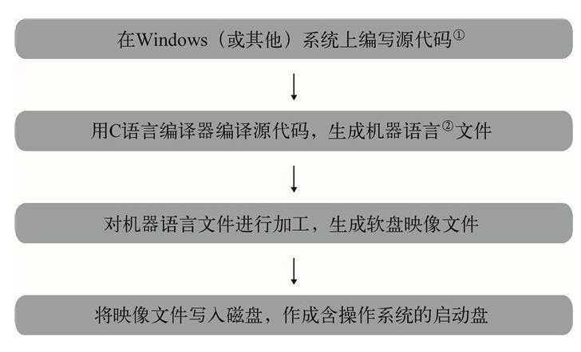
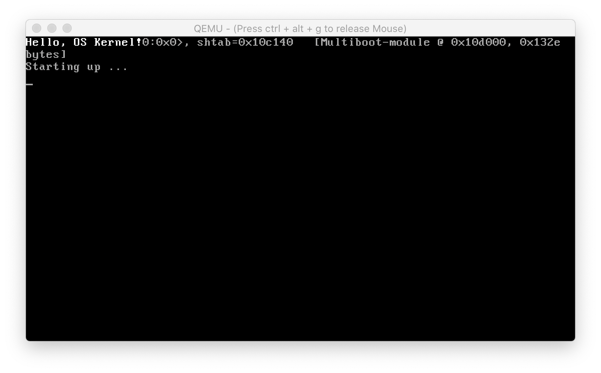

从本章开始, 我们就要开始进入实战阶段了.

我们先简单的解释一下之前的 Makefile 和 ld 链接脚本的一些字段, 如果你已经掌握了, 那大致浏览下就可以跳过这段文字了.

# Makefile 脚本

先来看**Makefile**中关于**gcc 编译参数**的这一行:

```makefile
C_FLAGS = -c -Wall -m32 -ggdb -gstabs+ -nostdinc -fno-builtin -fno-stack-protector -I include
```

我们只解释以下重要的几个参数:

- `-m32` 是生成**32 位代码**, 这样的话我们的开发环境也可以使用 64 位的 Linux 系统.

- `-ggdb` 和`-gstabs+` 是添加相关的**调试信息**, 调试对后期的排错很重要.

- `-nostdinc` 是**不包含 C 语言的标准库**里的头文件. 因为那些库函数都是在特定操作系统平台之上的实现, 而我们要做的正是实现这样一个平台, 所以想用 C 语言库的话就需要自己实现.

- `-fno-builtin` 是要求**gcc 不主动使用自己的内建函数**, 除非显式声明. gcc 有很多**内建函数**用来**替换**一些 C 语言的**库函数**以提升效率, 比如把只有一个字符串参数的 printf 函数替换为 puts 函数.

- `-fno-stack-protector` 是不使用栈保护等检测.

接着是**ld 链接命令的参数**:

```makefile
LD_FLAGS = -T scripts/kernel.ld -m elf_i386 -nostdlib
```

- `-T scripts/kernel.ld` 是**使用我们自己的链接器脚本**.

- `-m elf\_i386` 是生成**i386 平台**下的**ELF 格式**的可执行文件, 这是 Linux 下的可执行文件格式.

- `-nostdlib` 是**不链接 C 语言的标准库**, 原因上文已经交代过了.

# ld 脚本

接下来讨论链接器脚本.

我们知道**一个可执行的文件**大致由**代码段**和**数据段**组成, 但是操作系统怎么正确加载它呢?事实上**可执行文件**有义务向**操作系统**提供**代码段**和**数据段位置等信息**, 以便**操作系统**正确**找到**它的**代码段**和**数据段**并加载执行. 通常这个信息被**统一组织**放置在**可执行文件的头部区域**.

不同的操作系统中自然就设计了不同的组织方式, 比如 Linux 常见的 ELF(Executable and Linkable Format, 可执行链接格式)格式, windows 下常见的 PE(Portable Executable, 可移植的可执行文件)格式都是.

注: 其实 Linux 下的 ELF 格式和 Windows 下的 PE 格式都是 COFF(Common Object File Format, 通用对象文件格式)格式的一个变种.

而**ld**支持**很多种链接格式**, 我们可以在**参数里指定**. 那**为何选择 ELF 格式**呢?原因很简单, 因为**GRUB**可以检测识别出**ELF 格式**的**可执行文件**, 并且能**找到**相关的**代码段**和**数据段**的位置信息, 从而正确的把我们的**内核加载到正确的位置**上去.

# 符合 Multiboot 标准

看懂了这个 Makefile 和链接器脚本, 我们就向成功迈出了一大步了. 大家还记得上一章谈过的**GRUB Multiboot 标准**吗?只要**按照标准**生成规范的**Multiboot 引导信息**, 同时使用**标准的 ELF 格式**, **GRUB**就能**把我们的内核正确的加载和执行**了.

说了这么多, 现在大家对计算机从加电到执行我们的内核的过程有概念了吧?如果感觉还是很模糊也不要紧, 毕竟第一次接触这些东西难免需要时间消化. 随着我们研究的展开, 相信你会越来越清晰的.

# 启动镜像的制作

我们希望能够做到把含有操作系统的 CD-ROM 或软盘插入电脑, 或者将操作系统装入硬盘后, 只要打开电源开关就能自动运行.

为了开发这样的操作系统, 我们准备按照如下的步骤来进行.



>
>1. 源码程序, 为了生成机器码所写的程序代码. 可通过**编译器编译**成**机器语言**.
>2. CPU 能够直接理解的语言, 由二进制的 0 和 1 构成. 其实源代码也是由 0 和 1 构成的.

也就是说, 所谓**开发操作系统**, 就是想办法**制作一张**"`含有操作系统的, 能够自动启动的磁盘`".

这里出现的"**映像文件**"一词, 简单地说就是**软盘的备份数据**. 我们想要把**特定的内容写入磁盘**可不是拿块磁铁来在磁盘上晃晃就可以的.

所以我们要**先做出备份数据**, 然后将这些备份数据**写入磁盘**, 这样才能做出符合我们要求的磁盘. **软盘的总容量**是**1440KB**, 所以作为**备份数据的映像文件**也恰好是**1440KB**. 一旦我们掌握了制作磁盘映像的方法, 就可以按自己的想法制作任意内容的磁盘了.

## 软盘镜像

解决了理论上的问题之后, 我们来解决一个现实的问题. 这个问题是, 这个**小内核**放在哪里?虚拟机是它运行的场所, 那么**虚拟磁盘**自然就是安放内核的选择了. 不过我们这次**不选择硬盘**, 而是选择已经几乎消失殆尽的**1.44MB 的软盘**. 为什么?说实话是因为比较简单.

在 Linux 下制作一个**1.44MB 软盘**的技术太简单了, 甚至**dd 命令**也可以做一个出来.

制作软盘映像:

```
dd if=/dev/zero of=diska.img bs=512 count=2880
```

不过在这个**软盘镜像**上安装一个**GRUB**稍有难度, 所以大家直接可以使用我提供的已经**安装好了 GRUB！！！的软盘镜像**.

大家准备好镜像了吗?OK！万事俱备, 只欠代码了. 让我们开始最激动人心的探索吧!

## 文件系统

抱歉, 我又得打断一下. 因为必须引入一个新的术语名词——**文件系统**. 什么是文件系统呢?其实简单的说, 这里所谓的文件系统指的是**操作系统**用于明确**磁盘或分区**上的**文件存储的方法和数据结构**, 即在磁盘上组织文件的方法. 如果把这个**1.44MB 的软盘**可以看做一个**巨大的数组**, 那么**每个数组成员**都是**一个扇区**, 拥有 512 字节的存储单元. 现在需要**往这个软盘上写入文件**, 那么自然需要一套合适的管理规则, 否则的话岂不是全乱套了?就和这篇文档一样, 不同的章节被划分在不同的位置, 同时在最前面有所有章节的目录, 这就是一种对信息的组织方式, 文件系统也不过是这么一套组织策略罢了.

考虑到兼容因素, 自然是选择目前使用的比较广泛的文件系统了, 这样的话也便于我们对软盘里面存储的文件进行管理操作. 那么使用什么文件系统呢?**软盘**一般使用的是`FAT12`文件系统, 所以我们也就不标新立异了.

**GRUB 支持**从**很多常见的文件系统！！！** 中去**读取和载入！！！内核文件**, 当然也包括我们使用的`FAT12`格式.

我们在**自己开发**使用的 Linux 系统上很容易就可以**挂载和读写这个虚拟软盘**里的文件, 这给开发带来了极大的便利. 我们经常做的事就是**拷贝编译好的内核进去**, 然后在虚拟机运行.

另外**这个虚拟软盘文件**里还有**GRUB**和**它的配置文件**, 我提供的软盘镜像里安装的是一个**很早的 GRUB 版本**, 它的配置文件简单到一看就懂. 所以大家完全可以自己看着修改.

注: 其实也没有什么需要改的, 主要是 GRUB 载入的内核文件名. 我的内核名叫做`hx_kernel`, 如果你嫌麻烦, 和我叫一个名字就不用修改 GRUB 配置了.

# 内核的入口和初始化

前期的铺垫到这里就告一段落了, 下面我们开始编码工作吧.

**代码从什么函数开始执行**呢?

如果你记忆力足够好的话你会记得**ld 链接脚本**里面的一行文字:

```
ENTRY(start)
```

这就意味着我们告诉了 ld 链接器**入口函数是 start**, 所以代码从 start 函数开始.

## boot.s 入口代码

大家先来一起围观下入口部分的代码全貌:

```asm
; ----------------------------------------------------------------
;
;   boot.s -- 内核从这里开始
;
; ----------------------------------------------------------------

; Multiboot 魔数, 由规范决定的
MBOOT_HEADER_MAGIC  equ     0x1BADB002

; 0 号位表示所有的引导模块将按页(4KB)边界对齐
MBOOT_PAGE_ALIGN    equ     1 << 0

; 1 号位通过 Multiboot 信息结构的 mem_* 域包括可用内存的信息
; (告诉 GRUB 把内存空间的信息包含在 Multiboot 信息结构中)
MBOOT_MEM_INFO      equ     1 << 1

; 定义我们使用的 Multiboot 的标记
MBOOT_HEADER_FLAGS  equ     MBOOT_PAGE_ALIGN | MBOOT_MEM_INFO

; 域 checksum 是一个 32 位的无符号值, 当与其他的 magic 域(也就是 magic 和 flags)
; 相加时, 要求其结果必须是 32 位的无符号值 0 (即 magic+flags+checksum = 0)
MBOOT_CHECKSUM      equ     -(MBOOT_HEADER_MAGIC+MBOOT_HEADER_FLAGS)

; 符合 Multiboot 规范的 OS 映象需要这样一个 magic Multiboot 头
; Multiboot 头的分布必须如下表所示:
; ----------------------------------------------------------
; 偏移量  类型  域名        备注
;
;   0     u32   magic       必需
;   4     u32   flags       必需
;   8     u32   checksum    必需
;
; 我们只使用到这些就够了, 更多的详细说明请参阅 GNU 相关文档
;-----------------------------------------------------------

;-----------------------------------------------------------------------------

[BITS 32]   ; 所有代码以 32-bit 的方式编译
section .text   ; 代码段从这里开始

; 在代码段的起始位置设置符合 Multiboot 规范的标记

dd MBOOT_HEADER_MAGIC   ; GRUB 会通过这个魔数判断该映像是否支持
dd MBOOT_HEADER_FLAGS   ; GRUB 的一些加载时选项, 其详细注释在定义处
dd MBOOT_CHECKSUM       ; 检测数值, 其含义在定义处

[GLOBAL start]      ; 向外部声明内核代码入口, 此处提供该声明给链接器
[GLOBAL glb_mboot_ptr]  ; 向外部声明 struct multiboot * 变量
[EXTERN kern_entry]     ; 声明内核 C 代码的入口函数

start:
    cli              ; 此时还没有设置好保护模式的中断处理, 要关闭中断
                    ; 所以必须关闭中断
    mov esp, STACK_TOP       ; 设置内核栈地址
    mov ebp, 0       ; 帧指针修改为 0
    and esp, 0FFFFFFF0H  ; 栈地址按照 16 字节对齐
    mov [glb_mboot_ptr], ebx ; 将 ebx 中存储的指针存入全局变量
    call kern_entry      ; 调用内核入口函数
stop:
    hlt              ; 停机指令, 可以降低 CPU 功耗
    jmp stop         ; 到这里结束, 关机什么的后面再说

;-----------------------------------------------------------------------------

section .bss             ; 未初始化的数据段从这里开始
stack:
    resb 32768       ; 这里作为内核栈
glb_mboot_ptr:           ; 全局的 multiboot 结构体指针
    resb 4

STACK_TOP equ $-stack-1      ; 内核栈顶, $ 符指代是当前地址

;-----------------------------------------------------------------------------
```

我们简单的介绍下这段代码做的事情.

首先是一些宏定义, 定义了**Multiboot 标准的魔数和几个标识**, **GRUB**会**读取这些信息**以判断我们的意图.

真正的代码是从**39 行以后**开始的, 首先我们在代码段的入口位置之前**定义**了几个**Multiboot 规范**要求的**配置信息**, 其实也就是**3 个 4 字节变量**. 我们通过这几个变量告诉了 GRUB 我们要求它提供可用内存的信息, 而且要求**内核**中**所有的段**在内存里按照**4KB 进行对齐**.

紧接着就是我们内核的**入口函数 start**了, 入口代码很短, 主要做的是**关闭中断**, **传参数**(按照协议, **GRUB**把一些**计算机硬件**和我们**内核文件相关的信息**放在了一个结构体中, 并且将这个结构体指针放在了**ebx 寄存器**中)并且**调用内核的入口函数**. 等到**这个函数返回**之后, 内核就进入了一个**死循环**了.

如果你理解起来感到很困难, 那就结合 Multiboot 标准的相关规范仔细阅读, 这个过程是必须的.

## 内核的入口函数

OK, 理解了上面这两段代码, 我们暂时的告别汇编, 用 C 语言来实现内核的入口函数.

```cpp
// init/entry.c
int kern_entry()
{
    return 0;
}
```

还有一个在后面需要用到的头文件, 主要是**几个宏**和**一些类型的重定义**. 代码如下:

```cpp
// include/types.h
#ifndef INCLUDE_TYPES_H_
#define INCLUDE_TYPES_H_

#ifndef NULL
    #define NULL 0
#endif

#ifndef TRUE
    #define TRUE  1
    #define FALSE 0
#endif

typedef unsigned int   uint32_t;
typedef          int   int32_t;
typedef unsigned short uint16_t;
typedef          short int16_t;
typedef unsigned char  uint8_t;
typedef          char  int8_t;

#endif  // INCLUDE_TYPES_H_
```

## GRUB 载入内核时 CPU 状态

最后我再列出当 GRUB 载入我们的内核时, CPU 的一些状态信息:

1.  `CS` 指向基地址为 `0x00000000`, 限长为`4G – 1`的代码段描述符.

2.  DS, SS, ES, FS 和 GS 指向基地址为 0x00000000, 限长为`4G–1`的数据段描述符.

3.  A20 地址线已经打开.

4.  页机制被禁止.

5.  中断被禁止.

6.  EAX = 0x2BADB002

7.  系统信息和启动信息块的线性地址保存在 EBX 中(相当于一个指针).

# 目录结构

准备好了这一切之后, 再把之前完成的软盘镜像放在 Makefile 文件的同级目录下, 现在目录结构是这样的:

```
.
|-- boot
|   `-- boot.s
|-- floppy.img
|-- include
|   `-- types.h
|-- init
|   |-- entry.c
|-- Makefile
`-- scripts
    `-- kernel.ld

4 directories, 6 files
```

# 编译并运行内核

我们直接执行 make 命令编译代码, 没有意外的话会生成一个叫做 hx\_kernel 的文件, 并且自动挂载软盘镜像把这个文件复制进去.

注: 如果在挂载这一步出错, 请在自己系统的/mnt 目录下建立一个叫做 kernel 的目录, 当然你也可以修改 Makefile 文件.

最后我们来运行它, 使用下面的命令即可运行:

```
make qemu
```

很简单吧, 这样我们的内核就在 qemu 虚拟机里执行了. 首先显示的是 GRUB 菜单, 但是我们的内核载入之后就在也没有动静了, 因为我们什么代码也没有写.

有点失望是不是?别急, 下一章过后, 我们就可以自如的在屏幕上显示字符了. 有点迫不及待了?那我就先透露一点吧, 按照如下代码修改 kern\_entry 函数:

```cpp
#include "types.h"

int kern_entry()
{
    uint8_t *input = (uint8_t *)0xB8000;
    uint8_t color = (0 << 4) | (15 & 0x0F);

    *input++ = 'H'; *input++ = color;
    *input++ = 'e'; *input++ = color;
    *input++ = 'l'; *input++ = color;
    *input++ = 'l'; *input++ = color;
    *input++ = 'o'; *input++ = color;
    *input++ = ','; *input++ = color;
    *input++ = ' '; *input++ = color;
    *input++ = 'O'; *input++ = color;
    *input++ = 'S'; *input++ = color;
    *input++ = ' '; *input++ = color;
    *input++ = 'K'; *input++ = color;
    *input++ = 'e'; *input++ = color;
    *input++ = 'r'; *input++ = color;
    *input++ = 'n'; *input++ = color;
    *input++ = 'e'; *input++ = color;
    *input++ = 'l'; *input++ = color;
    *input++ = '!'; *input++ = color;

    return 0;
}
```

现在我们编译并且启动虚拟机, 就能看到了第一阶段的成果, 屏幕上华丽丽的输出了"Hello,
OS World!"的字样.



至于代码是什么意思大家先不用纠结, 下一章将详细探究.

辛苦了这么久, 终于看到一点点成功了. 有没有一点小兴奋呢?下一章我们将完全的实现对屏幕的字符输出控制, 并且有机会的话我将把这个小内核运行在物理机上, 和大家一起体验一下物理机运行的感觉.

真正的好戏从下一章开始, 别走开哦.