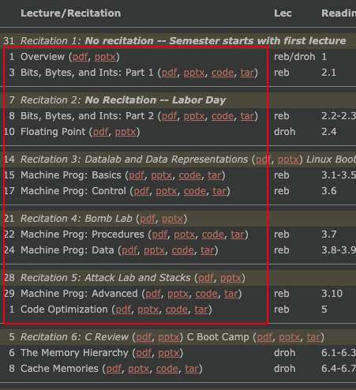

# 1. 书籍介绍

《Computer System A Programmer's Perspective》

本质上并不是操作系统书籍, 它会让你对整个计算机系统有一个组织体系上的认识. CMU 导论的教材.

中文名《深入理解计算机系统》, 是汇编+计组+操作系统+计网等的一个大杂烩. 它不会在某一个知识点给你非常深入的讲解.

这书大而全, 确实是衔接计算机系统各个领域的很好教材.

但是有些章节其实写的中规中矩, 或者明显有更好的替代品, 我简单写一些, 这里统一以最新的第三版为主, 且我的标准是更贴近现代系统和工业界实践:

* 必读的章节: 1, 2, 3, 5, 7 相当于本书的特色.
* 选读的章节: 8, 9, 可以配合操作系统相关课程一起学习.
* 有更好替代书籍的章节: 4, 6: 这两章应该看更专业的书, 比如《量化研究方法》, 也可以对比着看.

第三部分(10, 11, 12): 网络, IO 和并行并发相关都有更全面的书籍, 比如 richard stevens 的书.

介绍:
1. https://www.zhihu.com/question/20402534/answer/1670374116
2. https://www.zhihu.com/question/20402534/answer/124950081

学习笔记: https://www.zhihu.com/question/20402534/answer/968724043

英文原著高于翻译版本. 英文版本和中文版本对着这读

## 1.1. homework

书上的练习题一定要配合着阅读做完. 课本自带了练习题的答案, 当然除此之外还有家庭作业, 大家可以根据自己的能力, 选做一些家庭作业的题.

《CSAPP》(第三版)答案合集: https://blog.csdn.net/swy_swy_swy/article/details/105313825

附件有家庭作业答案.

练习题大家一定要好好做. 这个是帮助大家理解书本知识最好的方法, csapp 里面的练习题设计的都非常好. 做练习题的时候就会知道自己哪几个知识点不熟悉, 然后回头再看, 在独立完成练习题, 效果是最好的,

# 2. 课程

## 2.1. CMU

CMU 的经典课程:

课程主页: http://www.cs.cmu.edu/~./213/schedule.html, CMU15-213 的课程主页, 有 ppt, 代码还有录像, 主讲人就是这本书的作者

> 没有 cmu 账号无法下载视频

下图显示了 213 这门课在整个课程体系中的重要性, 它是众多课程的先修要求.

至于 15213 的先修课程则是 122 使用, C0 语言教学(C 语言的一个子集): [15-122 S16](http://www.cs.cmu.edu/~rjsimmon/15122-s16/schedule.html).

如果没有编程基础则可先修 15112, 使用 Python 教学: [15-112 Schedule (Fall 16)](http://www.cs.cmu.edu/~112/schedule.html).

## Fall 2015 课程

Fall 2015 的课程主页: http://www.cs.cmu.edu/afs/cs/academic/class/15213-f15/www/schedule.html

精校的中英字幕, 不过没有习题课的字幕: https://www.bilibili.com/video/BV1iW411d7hd, 注意看评论中信息

习题课视频: https://www.bilibili.com/video/BV1yy4y117YN, 纯英文字幕

原始视频包含习题课: https://www.bilibili.com/video/av12977597/, 不过字幕并不是很好

## 1.2. 实验实践

这本书的精华我个人觉得就在于 cmu 精心设计的几个实验. 如果大家能认真做完这些实验, 真的会收获非常多, 不仅是对计算机知识的提示, 对于编程能力, debug 能力, 动手能力都有非常大的帮助.

下面简单介绍一下这几个实验.

* dadaLab, 要求大家用限制好的位运算完成它要求的操作
* bombLab, 要求大家根据提示阅读汇编代码, 输入对应的正确输入拆掉炸弹, 如果输入错误炸弹就会爆炸整个实验就会失败. 这个实验的整体设定和难度安排都非常有意思, 强烈建议大家必做
* attackLab, 要求大家利用缓冲区溢出, 来进行攻击模拟当黑客的感觉, 同时可以学会如何预防这些攻击手段
* cacheLab, 要求大家模拟实现一个 cache 和对矩阵转置进行优化, 如何能够写出一个满分的代码, 非常有挑战性
* shellLab, 要求大家实现一个简易的 shell 程序. 这个实验需要考虑信号并发会出现的一些问题.
* mallocLab 需要大家实现一个 malloc 程序. 帮助大家理解内存分配和管理
* proxyLab 要求写一个支持 HTML 的多线程 Server. 可以帮助熟悉 Unix 网络编程与多线程的控制与同步.

可以去 cmu 的官网下载和实现这些实验: http://csapp.cs.cmu.edu/3e/labs.html

csapp 全 8 个实验的记录: https://www.zhihu.com/column/c_1325107476128473088

## 2.2. 南京大学

计算机系统基础

这门课的教材就是 csapp 的压缩改良本土化版本. 不过它的架构是用的 IA-32

课程链接: https://www.icourse163.org/course/NJU-1001625001

课程实验: https://nju-projectn.github.io/ics-pa-gitbook/ics2019/

## 2.3. 上交

计算机组成与系统结构

课程: https://www.icourse163.org/course/SJTU-1206676848

相应的 csapp 学习网站, 有 slides 和 homework: https://ipads.se.sjtu.edu.cn/courses/ics/schedule.shtml

## 国人自发讲解

1. 整书讲解

视频链接: https://www.bilibili.com/video/BV1cD4y1D7uR

整理的文稿: https://blog.csdn.net/qq_29051413/category_11036795.html

2.

https://www.bilibili.com/video/BV1mp4y1a7X4

# 学习方法

书籍: 强烈建议直接入手英文版. 当然也可以英文版本和中文版本对照读.

课程: cmu 2015 fall

实验资料: http://csapp.cs.cmu.edu/3e/labs.html

课程主页: http://www.cs.cmu.edu/afs/cs/academic/class/15213-f15/www/schedule.html

学习顺序: 按照 schedule 往下走

1. 先看视频, 每节课写个学习记录(不求详尽), 再看书内容(中英对照)对齐; 对照看下那两个国人整理的视频, 就当复习了;

2. 节后如果有习题, 做一下习题; 对照下答案; 最后看下习题课的讲解视频

3. 如果有实验, 完成实验; 对照其他人的