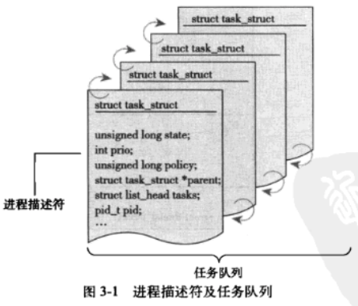
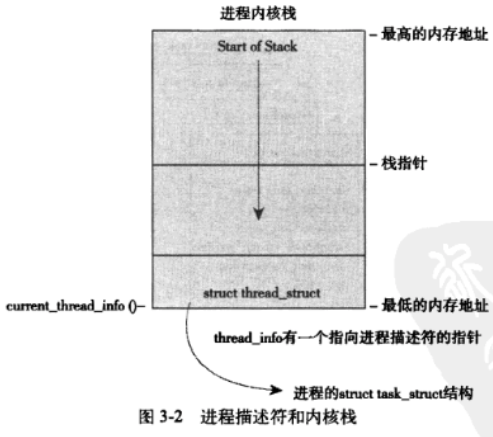
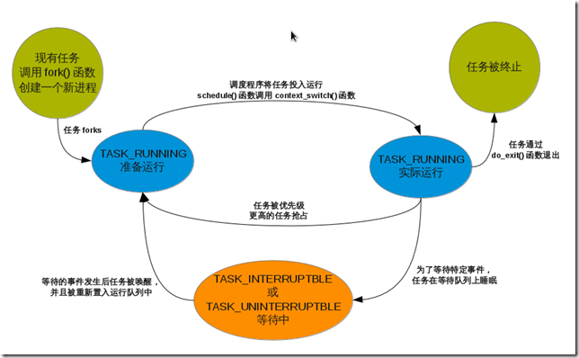

<!-- @import "[TOC]" {cmd="toc" depthFrom=1 depthTo=6 orderedList=false} -->

<!-- code_chunk_output -->

- [1. 进程和线程](#1-进程和线程)
- [2. 进程描述符及任务结构](#2-进程描述符及任务结构)
  - [2.1. 进程描述符的分配](#21-进程描述符的分配)
  - [2.2. 进程描述符的存放](#22-进程描述符的存放)
  - [2.3. 进程状态和生命周期](#23-进程状态和生命周期)
  - [2.4. 进程上下文](#24-进程上下文)
  - [2.5. 进程家族树](#25-进程家族树)
- [3. 进程创建](#3-进程创建)
  - [3.1. 写时拷贝](#31-写时拷贝)
  - [3.2. fork()](#32-fork)
  - [3.3. 线程创建](#33-线程创建)
  - [3.4. 内核线程](#34-内核线程)
- [4. 进程终止](#4-进程终止)
  - [4.1. 删除进程描述符](#41-删除进程描述符)
  - [4.2. 孤儿进程](#42-孤儿进程)

<!-- /code_chunk_output -->

# 1. 进程和线程

进程就是处于运行时状态的程序. 进程不仅仅局限于一段可执行程序代码(unix 称为代码段, text section), 通常还要包含其他资源, 像打开的文件、挂起的信号、内核内部数据、处理器状态, 一个或多个具有内存映射的内存地址空间及一个或多个执行线程(thread of execution), 以及用来存放全局变量的数据段等.

执行线程, 简称线程(thread), 是在**进程中活动的对象**. 每个线程都拥有一个独立的程序计数器、进程栈和一组进程寄存器. 线程机制提供了在**同一个程序**内**共享内存地址空间运行**的一组线程. 还可以**共享打开的文件和其他资源**.

Windows 或 Solaris 有专门的机制, 它们把线程称作轻量级进程(lighweight process).

Linux 内核的角度, 并没有线程的概念. 所有线程都当进程来实现, 也是 task_struct, 线程仅仅被视为一个与其他进程共享某些资源的进程. 内核调度的对象是线程, 而不是进程. Linux 中线程只不过是一种特殊的进程.

所以下面只讨论进程, 只有当线程与进程存在不一样的地方时才提一下线程.

进程提供了两种虚拟机制:

* 虚拟处理器, 让进程觉得自己独享处理器;

* 虚拟内存, 让进城觉得自己拥有整个系统的所有内存资源.

线程之间可以共享虚拟内存, 但每个线程都拥有各自的虚拟处理器.

程序本身不是进程, 进程是处于执行器的程序以及相关的资源的总称. 多个不同的进程可以执行同一个程序; 两个或两个以上并存的进程还可以共享许多比如打开的文件、地址空间之类的资源.

# 2. 进程描述符及任务结构

内核将进程存放在叫做任务队列(task list)的双向循环链表中. 链表中每一个项类型都是 task_struct, 即进程描述符(process descriptor).

进程描述符中包含的数据能完整地描述一个正在执行的程序: 它打开的文件, 进程的地址空间, 挂起的信号, 进程的状态, 和其他更多信息.



## 2.1. 进程描述符的分配

Linux 通过 slab 分配器分配 `task_struct` 结构, 这样能达到对象复用和缓存着色(cache coloring)的目的.

2.6 内核以前, 各个进程的 `task_struct` 存放在他们内核栈的尾端. 目的是为了让一些寄存器较少的硬件体系结构(比如 x86)只要通过栈指针就能计算它的位置, 而避免使用额外的寄存器专门记录.

而现在, 由于使用 slab 分配器动态生成 task_struct, 所以只需要在栈底(向下增长的栈)或栈顶(向上增长的栈)创建一个新的结构 struct thread_info, 其中的 task 指向该任务实际 task_struct 的指针.

```cpp
struct thread_info {
	struct task_struct 	*task;
	struct exec_domain	*exec_domain;
	__u32			flags;
	__u32			status;
	__u32			cpu;
	int			preempt_count;
	mm_segment_t		addr_limit;
	struct restart_block	restart_block;
	void			*sysenter_return;
	int			uaccess_err;
}
```



## 2.2. 进程描述符的存放

内核通过一个唯一的进程标识符(process identification value)或 PID 标识. PID 是一个数, 表示为 pid_t 隐含类型, 实际上就是一个 int 类型. 最大值默认为 32768 (short int 的最大值), 表示系统中允许同时存在的进程的最大数目, 可以修改 `/proc/sys/kernel/pid_max`.

> 隐含类型是指数据类型的物理表示是未知的或不相关的.

多数代码直接操作 task_struct 的. 通过 current 宏找到当前运行中的进程, 要求速度要很快. 有些硬件体系结构有一个专门寄存器存放当前 task_struct 的指针, 用于加速; x86 寄存器比较少, 只能在内核栈的尾端创建 thread_info, 计算偏移间接查找.

x86 上, current 将栈指针的后 13 个有效位屏蔽掉, 用来计算出 thread_info 的偏移. 通过 current_thread_info() 来实现. 汇编如下:

```
movl $-8192, %eax
andl %esp, %eax
```

这里假定栈大小是 8KB.

`current_thread_info()->task`

而 PowerPC 上使用了单独的寄存器.

## 2.3. 进程状态和生命周期

进程在创建它的时候开始存活. 通常调用 fork(), 通过复制一个现有进程来创建一个全新进程. 调用结束时, 在返回点这个相同位置上, 父进程恢复执行, 子进程开始执行. fork() 系统调用从内核返回两次: 一次回到父进程, 另一次回到新产生的子进程.

> 实际上由 clone() 系统调用实现

通常, 创建新进程是为了执行新程序. 调用 exec() 这组函数, 创建新的地址空间, 并将新的程序载入其中.

最后, 通过 exit() 退出执行. 终结进程并将其占用的资源释放掉. 进程退出会被设置成僵死状态, 直到父进程调用 wait() 或 waitpid().

task_struct 中的 state 表示进程的当前状态. 必然处于五种状态之一.

* TASK_RUNNING(运行). 进程是可执行的: 要么正在执行, 或者在运行队列中等待执行. 进程在用户空间中唯一可能的状态.

* TASK_INTERRUPTIBLE(可中断). 进程正在睡眠(即它被阻塞), 等待某些条件的达成. 一旦条件达成, 内核会将进程状态设置为运行; 也会因为接收到信号而提前被唤醒.

* TASK_UNINTERRUPTIBLE(不可中断). 对信号不响应. 这就是 ps 的 D 状态而又不能被杀死的原因.

* __TASK_TRACED. 被其他进程跟踪的进程, 例如通过 ptrace 对调试程序进行跟踪.

* __TASK_STOPPED(停止). 进程停止运行. 进程没有投入运行也不能投入运行. 通常在接收到 SIGSTOP、SIGTSTP、SIGTTIN、SIGTTOU 等信号时候. 此外, 调试期间接收到任何信号, 也会进入该状态.

各状态之间的转化构成了进程的整个生命周期:



## 2.4. 进程上下文

一个程序在用户空间运行, 执行系统调用或触发了某个异常, 陷入内核空间. 此时, 称内核 "代表进程执行" 并处于进程上下文中.

除非被调度了, 否则退出内核时候, 程序恢复在用户空间继续执行.

## 2.5. 进程家族树

Linux 中所有进程都是 PID 为 1 的 init 进程的后代. 内核在系统启动的最后阶段启动 init 进程. 该进程会读取系统初始化脚本(init script)并执行其他的相关程序, 最终完成系统启动的整个过程.

系统中每个进程必有一个父进程, 即 parent 指针指向; 每个进程可以拥有多个子进程, 即 children 子进程链表.

init 进程的 task_struct 是通过 init_task 静态分配的.

这种继承体系, 可以从系统的任何一个进程出发查找到任意指定的其他进程.

任务队列是一个双向循环链表. 可以通过链表方式来获取链表上的下一个进程.

# 3. 进程创建

众多操作系统都提供了产生(spawn)进程的机制. 首先在新的地址空间里面创建进程, 读入可执行文件, 最后开始执行.

Unix 采用了不同的实现方式, 将上述步骤分解到两个单独的函数中执行: `fork()`和`exec()`. 效果等同其他系统中单一函数.

* fork() 通过拷贝当前进程创建一个子进程. 父子进程的区别仅仅在于 PID(每个进程唯一)、PPID(父进程的进程号)和某些资源的统计量(比如, 挂起的信号);

* exec() 读取可执行文件并将其载入地址空间开始运行.

## 3.1. 写时拷贝

传统 fork() 直接把所有资源复制给新进程. 简单且效率低, 因为数据可能并不共享; 最坏情况是, 新进程立马执行新的映像, 所有拷贝都前功尽弃.

Linux 的 fork() 是**写时拷贝(copy-on-write)页**实现. 并不复制整个进程地址空间, 而让父子进程共享同一个拷贝. 只有在需要写入时候, 数据才会被复制. 页根本不会被写入的时候(比如, fork()后立即调用 exec()), 就无须复制了.

fork() 实际开销就是复制父进程的页表并给子进程创建唯一的进程描述符.

## 3.2. fork()

fork()、vfork()和 __clone() 库函数都根据**各自的参数标志**调用 clone(), 然后由 clone() 调用 do_fork().

do_fork() 调用 copy_process():

1. 调用 dup_task_struct() 为新进程创建一个内核栈、thread_info 结构和 task_struct, 这些值和当前进程的值相同. 此时, 父子描述符完全相同;

2. 检查确保当前用户的进程数目没有超过限制;

3. 与父进程区分. 很多成员清 0 或设置为初始值. 那些要改的, 主要是统计信息, 多数未被修改;

4. 子进程状态被置为 TASK_UNINTERRUPTIBLE, 以保证它不会投入运行;

5. 调用 copy_flags() 更新 flags;

6. 调用 alloc_pid() 分配新的 PID;

7. 根据参数标志, 拷贝或共享打开的文件、文件系统信息、信号处理函数、进程地址空间和命名空间等资源;

8. 扫尾并返回一个指向子进程的指针.

回到 do_fork(), copy_process() 成功返回, 子进程被唤醒并让其投入运行.

内核**让子进程首先执行**, 因为一般子进程都会马上调用 exec(), 可以避免写时拷贝的额外开销, 如果父进程首先执行, 有可能会开始向地址空间写入.

vfork()和 fork(): vfork()不会拷贝父进程的页表项.

## 3.3. 线程创建

和创建普通进程类似, 只不过调用 clone() 时需要传递一些参数标志来指明需要共享的资源:

```cpp
clone(CLONE_VM | CLONE_FS | CLONE_FILES | CLONE_SIGHAND, 0);
```

这个与 fork() 差不多, 只是父子共享地址空间、文件系统资源、文件描述符和信号处理程序. 换个说法, **新建的进程**和**它的父进程**就是**线程**.

fork():

```cpp
clone(SIGCHLD, 0);
```

vfork():

```cpp
clone(CLONE_VFORK | CLONE_VM | SIGCHLD, 0);
```

所有 clone() 参数都在 `include/uapi/linux/sched.h` 中

<table>
 <caption><b><br>clone()参数标志</br></b></caption>
    <tr>
        <th>标志</th>
        <th>含义</th>
    </tr>
    <tr>
        <td>CLONE_FILES</td>
        <td>父子进程共享打开的文件</td>
    </tr>
    <tr>
        <td>CLONE_FS</td>
        <td>父子进程共享文件系统信息</td>
    </tr>
    <tr>
        <td>CLONE_IDLETASK</td>
        <td>将 PID 设置为 0(仅供 idle 进程使用)</td>
    </tr>
    <tr>
        <td>CLONE_NEWNS</td>
        <td>为子进程创建新的命名空间</td>
    </tr>
    <tr>
        <td>CLONE_PARENT</td>
        <td>指定子进程与父进程拥有同一个父进程</td>
    </tr>
    <tr>
        <td>CLONE_PTRACE</td>
        <td>继续调试子进程</td>
    </tr>
    <tr>
        <td>CLONE_SETTID</td>
        <td>将 TID 回写到用户空间</td>
    </tr>
    <tr>
        <td>CLONE_SETTLS</td>
        <td>为子进程创建新的 TLS</td>
    </tr>
    <tr>
        <td>CLONE_SIGHAND</td>
        <td>父子进程共享信号处理函数及被阻断的信号</td>
    </tr>
    <tr>
        <td>CLONE_SYSVSEM</td>
        <td>父子进程共享 System V SEM_UNDO 语义</td>
    </tr>
    <tr>
        <td>CLONE_THREAD</td>
        <td>父子进程放入相同的线程组</td>
    </tr>
    <tr>
        <td>CLONE_VFORK</td>
        <td>调用 vfork(), 父进程准备睡眠等待子进程将其唤醒</td>
    </tr>
    <tr>
        <td>CLONE_UNTRACED</td>
        <td>防止跟踪进程在子进程上强制执行 CLONE_PTRACE</td>
    </tr>
    <tr>
        <td>CLONE_STOP</td>
        <td>以 TASK_STOPPED 状态开始进程</td>
    </tr>
    <tr>
        <td>CLONE_SETTLS</td>
        <td>为子进程创建新的 TLS(thread-local storage)</td>
    </tr>
    <tr>
        <td>CLONE_CHILD_CLEARTID</td>
        <td>清除子进程的 TID</td>
    </tr>
    <tr>
        <td>CLONE_CHILD_SETTID</td>
        <td>设置子进程的 TID</td>
    </tr>
    <tr>
        <td>CLONE_PARENT_SETTID</td>
        <td>设置父进程的 TID</td>
    </tr>
    <tr>
        <td>CLONE_VM</td>
        <td>父子进程共享地址空间</td>
    </tr>
</table>

## 3.4. 内核线程

内核线程(kernel thread), 独立运行在内核空间的**标准进程**.

内核线程和普通进程的区别: 内核线程没有独立的地址空间(指向地址空间的 mm 被设置为 NULL), 只能在内核空间运行, 从来不切换到用户空间.

> 这与之前提到的 Linux 内核是个单内核有关.

# 4. 进程终止

进程终止时, 内核必须**释放它占用的资源**并**告知父进程**.

* 一般, 进程的析构是自身引起的. 它发生在进程调用 exit() 系统调用时, 可以显式调用, 也可隐式从某个程序的主函数返回(比如 C 语言编译器会在 main() 函数的返回点后面放置调用 exit() 的代码).

* 当进程接收到它既不能处理又不能忽略的信号或者异常时, 还可能被动地终止.

大部分都是靠 do_exit() 来完成:

1. task_struct 的标志成员设置为 PF_EXITING;

2. 调用 del_timer_sync() 删除任一内核定时器. 根据返回结果, 确保没有定时器在排队, 也没有定时器处理程序在运行;

3. 调用 exit_mm() 释放进程占用的 mm_struct, 如果没有别的进程使用它们(即这个地址空间没有被共享), 就彻底释放它们;

4. 调用 sem_exit(), 使进程离开等待 IPC 信号的队列(如果进程在排队等候的话);

5. 调用 exit_files() 和 exit_fs(), 释放进程占用的文件描述符和文件系统资源(如果引用计数为零);

6. 将 task_struct 中的 exit_code 设置为进程的返回值, 供父进程随时检索;

7. 调用 exit_notify() 向父进程发送信号, 并将进程状态(exit_state)设置为 EXIT_ZOMBIE;

8. 调用 schedule() 切换到新进程. 因为 EXIT_ZOMBIE 状态的进程不会再被调度, 所以这是进程所执行的最后一段代码.

do_exit() 永不返回.

至此, 与进程关联的所有资源都被释放掉了(假设该进程是这些资源的唯一使用者), 还占用的所有内存就是内核栈、thread_info 结构和 task_struct 结构等, 这些是由父进程来释放.

进程不可被调度运行(实际上也没有地址空间让它运行)并且处理 EXIT_ZOMBIE 退出状态.

此时进程存在的唯一目的就是向父进程提供信息.

## 4.1. 删除进程描述符

进程终止的清理工作和进程描述符的删除是分开执行的.

wait() 族函数是通过唯一的系统调用 wait4() 实现. 标准动作是挂起调用它的进程, 直到其中一个子进程退出, 此时函数会返回该子进程的 PID. 此外, 调用该函数提供的指针会包含子函数退出时的退出代码.

最终需要释放进程描述符时, release_task() 会被调用:

1. 从 pidhash 上删除该进程, 同时从任务列表中删除该进程;

2. 释放僵死进程所使用的所有剩余资源, 并进行最终统计和记录;

3. 如果这个进程是线程组最后一个进程, 并且领头进程已经死掉, 则通知僵死的领头进程的父进程;

4. put_task_struct() 释放进程内核栈和 thread_info 结构所占的页, 并释放 task_struct 所占用的 slab 高速缓存.

## 4.2. 孤儿进程

父进程在子进程之前退出, 必须有机制保证子进程能找到新的父亲, 否则便成为孤儿进程, 永远处于僵死状态且消耗内存.

解决方法: 给子进程在当前线程组中找一个线程作为父亲, 如果不行, 让 init 成为父进程.

子进程 do_exit() 时调用 exit_notify(), 里面会调用 forget_original_parent()->find_new_reaper() 执行寻父过程.

