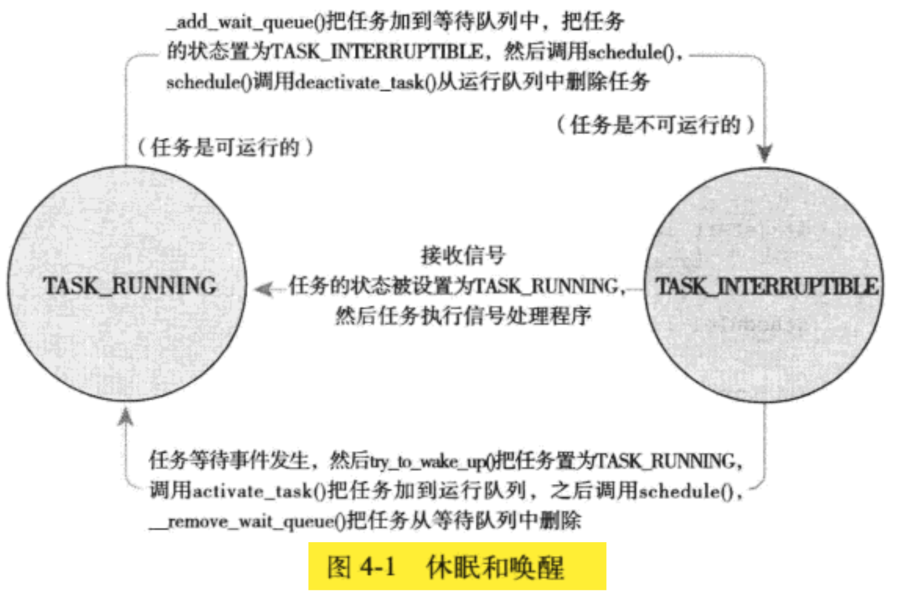

<!-- @import "[TOC]" {cmd="toc" depthFrom=1 depthTo=6 orderedList=false} -->

<!-- code_chunk_output -->

- [1. 多任务系统](#1-多任务系统)
- [2. 什么是调度程序](#2-什么是调度程序)
- [3. Linux 的进程调度](#3-linux-的进程调度)
- [4. 调度策略](#4-调度策略)
  - [4.1. IO 消耗型和 CPU 消耗型进程](#41-io-消耗型和-cpu-消耗型进程)
  - [4.2. 进程优先级](#42-进程优先级)
  - [4.3. 时间片](#43-时间片)
  - [4.4. 调度程序的活动](#44-调度程序的活动)
- [5. Linux 调度算法](#5-linux-调度算法)
  - [5.1. 调度器类](#51-调度器类)
  - [5.2. Unix 系统中的进程调度](#52-unix-系统中的进程调度)
  - [5.3. 公平调度](#53-公平调度)
- [6. Linux 调度的实现](#6-linux-调度的实现)
  - [6.1. 时间记账](#61-时间记账)
    - [6.1.1. 调度器实体结构](#611-调度器实体结构)
    - [6.1.2. 虚拟运行时间](#612-虚拟运行时间)
  - [6.2. 进程选择](#62-进程选择)
    - [6.2.1. 挑选下一个任务](#621-挑选下一个任务)
    - [6.2.2. 向树中加入进程](#622-向树中加入进程)
    - [6.2.3. 从树中删除进程](#623-从树中删除进程)
  - [6.3. 调度器入口](#63-调度器入口)
  - [睡眠和唤醒](#睡眠和唤醒)
    - [等待队列](#等待队列)
    - [唤醒](#唤醒)
  - [抢占和上下文切换](#抢占和上下文切换)
    - [用户抢占](#用户抢占)
    - [内核抢占](#内核抢占)
- [实时调度策略](#实时调度策略)

<!-- /code_chunk_output -->

# 1. 多任务系统

多任务系统分为两类: 非抢占式多任务(cooperative multitasking)和抢占式多任务(preemptive multitasking).

Linux 提供了抢占式的多任务模式. 此模式, 由调度程序决定什么时候停止一个进程的运行, 以便其他进程能得到执行机会. 这个**强制的挂起动作**就是**抢占**(preemption). 进程被抢占前能运行的时间是预先设置好的, 即进程的**时间片**(timeslice). 多数系统对程序采用了**动态时间片计算方式**, 并引入了**可配置的计算策略**. 不过, Linux 的 "公平" 调度程序没有采用时间片.

非抢占多任务模式下, 除非进程自己主动停止运行, 否则会一直执行. 进程**主动挂起自己**的操作叫做**让步**(yielding). 缺点很明显: 调度程序无法对每个进程执行时间做出统一规定, 所以进程占用的时间可能超预期; 一个决不让步的悬挂进程可能使系统崩溃. 目前, 基本没有系统采用这种模式.

Unix 一开始就采用了抢占式多任务.

# 2. 什么是调度程序

调度程序负责决定将**哪个进程投入运行**、**何时运行**以及**运行多长时间**. 同时, 为获得**更好的用户体验**, 运行中的进程还可以立即**被其他**更紧急的进程**打断**.

总之, 调度是一个平衡的过程. 一方面, 保证各个运行的进程能够最大限度的使用 CPU(即尽量少的切换进程); 另一方面, 保证各个进程能公平使用 CPU(即防止一个进程长时间独占 CPU).

# 3. Linux 的进程调度

1991 年 Linux 第 1 版到 2.4 内核, 调度程序都很简陋.

2.5 版本采用 O(1) 调度程序. 静态时间片算法和针对每一处理器的运行队列. 在**数以十计**(不是数以百计)的多处理器环境下表现出近乎完美的性能和可扩展性. 但对于**响应时间敏感的程序**先天不足. 这种程序被称为**交互进程**. 所以在大服务器工作很理想, 但是对有很多交互程序运行的桌面系统上表现不佳.

2.6 内核为提高对交互程序的调度性能, 引入了新的调度算法. 最著名的是 "反转楼梯最后期限调度算法" (Rotating Staircase Deadline Scheduler, RSDL), 该算法吸取了队列理论, 将公平调度概念引入了 Linux 调度程序. 最终替代了 O(1), 被称为 "完全公平调度算法", 简称 CFS.

# 4. 调度策略

## 4.1. IO 消耗型和 CPU 消耗型进程

进程可以被分为这两种:

* I/O 消耗型: 大部分时间用来**提交 I/O 请求**或者**等待 I/O 请求**. 进程经常处于**可运行状态**, 但通常**只运行短短一会儿**, 因为它在**等待更多的 I/O 请求**时**最后总会阻塞**(这里所说的 I/O 是指任何类型的可阻塞资源, 比如键盘输入或网络 I/O). 举例, 多数用户图形程序(GUI)属于 I/O 密集型, 即便它们从不读取或写入磁盘, 它们也在多数时间等待来自鼠标或者键盘的用户交互操作.

* CPU 消耗型: 大多数时间用来**执行代码**. 除非被抢占, 否则一直不停运行, 因为它们没有太多 I/O 需求. 但是, 因为它们不属于 I/O 驱动类型, 所以从系统响应速度考虑, 调度器不应该经常让它们运行. 调度策略往往是尽量**降低它们的调度频率**, 而**延长其运行时间**. 极端例子就是无限循环地执行, 比如大量数学计算的程序(sshkeygen 或 MATLAB).

这种划分并非绝对. 进程可以同时展示这两种行为: 比如, X Window 服务; 还有可以是 I/O 消耗型, 但属于处理器消耗型活动的范围, 典型如字处理器, 其通常**等待键盘输入**, 但在**任一时刻**可能又粘住处理器**疯狂**进行**拼写检查或宏计算**.

调度程序通常在这两个矛盾的目标中间寻找平衡: **进程响应迅速**(响应时间短)和**最大系统利用率**(高吞吐量). Linux 为保证交互式应用和桌面系统的性能, 所以优化了进程的响应时间, 更倾向于优先调度 I/O 消耗型进程.

## 4.2. 进程优先级

调度算法中最基本的一类就是基于优先级的调度.

* 通常做法是(并未被 Linux 完全采用)**优先级高**的进程**先运行**; **相同优先级**的进程按**轮转方式**进行调度.

* **多数系统**中, **优先级高**的**时间片也比较长**.

调度程序总是选择**时间片未用尽**且**优先级高**的运行. 所以用户可以通过设置优先级来影响系统的调度.

Linux 采用了两种不同的优先级范围.

第一种是用**nice 值**. 范围是 `-20 ~ +19`, 默认为 0; **越大的 nice 值**是**更低的优先级**. nice 值是所有 Unix 系统中的标准化的概念, 只是不同 Unix 系统对 nice 值的使用不同(调度算法不同). 比如, Mac OS X 中 nice 值意味着进程的时间片的绝对值; Linux 中 nice 值代表**时间片的比例**. 通过 `perf -el` 中的 NI 列是进程对应的 nice 值.

```
# ps -el
F S   UID     PID    PPID  C PRI  NI ADDR SZ WCHAN  TTY          TIME CMD
4 S     0       1       0  0  80   0 - 45978 do_epo ?        00:00:02 systemd
1 S     0       2       0  0  80   0 -     0 -      ?        00:00:00 kthreadd
1 I     0       3       2  0  60 -20 -     0 -      ?        00:00:00 rcu_gp
1 I     0       4       2  0  60 -20 -     0 -      ?        00:00:00 rcu_par_gp
1 I     0       6       2  0  60 -20 -     0 -      ?        00:00:00 kworker/0:0H-events_highpri
1 R     0       8       2  0  80   0 -     0 -      ?        00:00:00 kworker/u256:0-events_unbound
```

第二种是**实时优先级**. 范围是 `0 ~ 99`. 与 nice 值意义相反, **越高的实时优先级**数值意味着**优先级越高**. **任何实时进程**的优先级都高于**普通进程**, 所以**实时优先级和 nice 优先级互不相交**. Linux 的实时优先级实现参考了 Unix  相关标准, 特别是 `POSIX.1b`. 多数 Unix 系统也提供了类似机制. 通过下面命令查看, 对应列显示 "-", 说明它不是实时进程.

```
# ps -eo state,uid,pid,ppid,rtprio,time,comm
S   UID     PID    PPID RTPRIO     TIME COMMAND
S     0       1       0      - 00:00:02 systemd
S     0       2       0      - 00:00:00 kthreadd
S     0      12       2     99 00:00:00 migration/0
S     0      13       2     99 00:00:00 watchdog/0
S     0      14       2      - 00:00:00 cpuhp/0
S     0      15       2      - 00:00:00 cpuhp/1
S     0      16       2     99 00:00:00 watchdog/1
S     0      17       2     99 00:00:00 migration/1
S     0      18       2      - 00:00:00 ksoftirqd/1
I     0      20       2      - 00:00:00 kworker/1:0H-events_highpri
S     0      40       2     99 00:00:00 watchdogd
I     0      41       2      - 00:00:00 kworker/0:1H-kblockd
S     0      62       2      - 00:00:00 kswapd0
S     0     156       2     50 00:00:00 irq/24-pciehp
```

## 4.3. 时间片

时间片是一个**数值**, 表明进程在**被抢占之前**所能**持续运行的时间**. 时间片过长会影响系统交互, 让人觉得系统无法并发执行应用程序; 时间片过短会增大进程切换的耗时. I/O 消耗型不需要长的时间片; CPU 消耗型则希望越长越好(cache 命中更高).

> Linux 中叫做 **时间片**(time slice). 其他系统中, 也被称为 **量子**(quantum) 或 **处理器片**(processor slice).

因为交互进程, **很多系统**的默认时间片很短, 如 10 ms.

但 Linux 的 CFS 调度器并**不是直接分配时间片**给进程, 而是将处理器的**使用比例**划分给进程. 这个比例受到进程 nice 值影响.

* **多数系统**, 是否将一个进程立即投入运行(即抢占当前进程), 完全由**进程优先级**和**是否有时间片**决定;

* **Linux** 的 **CFS** 调度器, 抢占时机取决于**新的可执行程序消耗了多少处理器使用比**:

    * 如果消耗的使用比**比当前进程小**, 则新进程立即投入运行, 抢占当前进程;

    * 否则, 推迟其运行.

## 4.4. 调度程序的活动

假设两个进程:

* 文字编辑程序: **I/O 消耗型**. 大部分时间在等待用户的键盘输入, 用户希望按下键就马上响应;

* 视频编辑程序: **CPU 消耗型**. 除了开始从磁盘读原始数据流和最后将视频输出外, 其他时间都在视频编码, 但所花时间不是关注的主要问题.

理想情况下, 对于文字编辑程序, 有两个目标:

1. 更多处理器时间, 不是因为它需要更多的 CPU 时间(它不需要), 而因为它属于交互式应用;

2. 文本编辑器能在被唤醒时(即用户打字时)抢占视频解码程序, 从而快速响应.

**多数操作系统**上, 给文本编辑器比视频解码程序**更高的优先级**和**更多的时间片**.

Linux 采用不同方法, **不再**分配**给定的优先级和时间片**, 而是分配一个给定的处理器**使用比**. 假设只有这两个进程, 且 **nice 值相同**, 那么处理器的使用比都将是 50%, 即平分处理器时间. 但因为文本编辑器将更多时间用户等待用户输入, 因此它肯定不会用到处理器的 50%; 同时视频编码程序肯定很容易用到超过 50% 的处理器时间.

关键在于, 当**文本编辑器程序被唤醒时**将发生什么. 首要目标确保在**用户输入发生时立即运行**. 上面场景中, 一旦文本编辑器被唤醒, CFS 注意到给它的处理器使用比是 50%, 但是其实它却用的很少, CFS 为兑现让所有进程公平分享处理器的承诺, 会立刻抢占视频编码程序. 文本编辑器运行后, 立即处理了用户的按键输入后, 又一次睡眠等待下一次输入. 因为文本编辑器并没有消费掉承诺的 50% 处理器使用比, 因此 CFS 总是毫不犹豫让文本编辑器抢占.`

# 5. Linux 调度算法

## 5.1. 调度器类

Linux 调度器是以模块方式提供的, 目的是允许**不同类型的进程**可以**针对性选择调度算法**.

这种模块化结构被称为调度器类(scheduler classes), 它允许多种不同的可动态添加的调度算法并存, 调度属于自己范畴的进程. 每个调度器都有一个优先级, **按照优先级顺序遍历调度类**, 拥有一个可执行进程的最高优先级的调度器类胜出, 去选择调度器类下面要执行的那一个程序.

完全公平调度(CFS)是一个针对**普通进程**的调度类, Linux 中称为 `SCHED_NORMAL`(在 POSIX 中称为 `SCHED_OTHER`), 也是下面讨论的重点.

## 5.2. Unix 系统中的进程调度

先看下传统 Unix 的调度过程. 现代进程调度器有两个通用概念: **进程优先级**和**时间片**(前面提到). 高优先级进程运行更频繁, 而且(多数系统上)有更多时间片. 但是往往有一些问题

第一个问题, 若要将 nice 值映射到时间片, 就需要将 nice 单位值对应到处理器的**绝对时间**. 但这样将导致**进程切换无法最优化进行**.

第二个问题, 涉及到**相对 nice 值**. nice 值是 0 对应时间片 100ms, nice 值是 1 对应时间片 95ms, 差别微乎其微. 但是 nice 值 18 对应时间片 10ms 和 nice 值 19 时间片是 5ms, 前者是后者的**两倍处理器时间**. 不过 nice 值通常使用**相对值**(在原值上增减, 而不是绝对值操作), 即 nice 值增减很大程度取决于其 nice **初始值**.

第三个问题, nice 值对应的**绝对时间片**必须在内核的测试范围内. 多数系统中, **时间片**必须是**定时器节拍的整数倍**. 这会引发几个问题. 首先, 最小时间片必然是定时器节拍的整数倍, 即 10ms 或 1ms 的倍数; 其次, 系统定时器限制了两个时间片的差异: 连续的 nice 值映射到的时间片, 其差别范围多至 10ms 或少则 1ms; 最后, 时间片还会随着定时器节拍变化. (定时器节拍见 11 章, 这正是**引入 CFS 的唯一原因**).

第四个问题, 基于优先级的调度器为了优化交互任务而唤醒相关进程. 为了进程能更快投入运行提升要唤醒的进程的优先级, 即使时间片已经用尽. 确实提升交互性能, 但一些例外可能发生, 某些特殊的睡眠/唤醒用例会打破公平原则, 获得更多处理器时间.

将 nice 值呈**几何增加**而非算数, **解决第二个问题**; 采用新的度量机制将 nice 值到时间片的映射与定时器节拍分离, 解决第三个问题. 但都回避了实质问题, 即分配绝对的时间片引发的**固定的切换频率**. CFS 摒弃时间片而是分配给进程一个处理器使用比重, 从而确保了进程调度中能有恒定的公平性, 切换频率在不断变动.

## 5.3. 公平调度

CFS 的出发点基于一个简单的理念: **进程调度的效果**应如同系统具备一个**理想中的完美多任务处理器**. 在这个系统中:

1. **每个进程**将能获得 `1/n` 的处理器时间(n 是进程数);

2. 调度给它们**无限小的时间周期**;

3. 所以在**任何可测量周期**内, **每个进程**有**同样多的运行时间**.

举例, 两个运行进程,

* **标准 Unix 调度模型**中, 先运行其中一个 5 ms, 然后再运行另外一个 5 ms. 但它们**任何一个运行时**都将占有 100% 的处理器;
* **理想情况**下, **完美的多任务处理器模型**: 能在 10ms 内**同时运行多个进程**, 它们**各自使用**处理器 1/n 的能力.

上面模型不现实:

1. 无法在**一个处理器**上**同时运行多个进程**;

2. 每个进程运行**无限小的周期**也不高效: 切换的消耗; 缓存的失效.

CFS 允许每个进程运行一段时间、循环轮转、**选择运行最少**的进程作为下一个运行进程, 而**不采用**分配给**每个进程时间片**的做法, CFS 在所有可运行进程总数基础上计算一个进程应该运行多久, 而不是依赖 nice 值计算时间片. nice 值在 CFS 中被作为进程处理器运行比的权重.

**每个进程**都按其**权重**在**全部可运行进程**中所占**比例**的 "时间片" 来运行, 为计算准确的时间片, CFS 为完美多任务中的**无限小调度周期**的近似值设立了一个目标. 这个目标称为 "目标延迟", **越小**的**调度周期**将带来**越好的交互性**, 同时也**更接近完美的多任务**. 但必须承受**更高的切换代价**和**更差的系统总吞吐能力**. 假定目标延迟值是 20ms, 那两个相同优先级的可运行任务则每个在被其他进程抢占前运行 10ms; 4 个进程每个只能运行 5ms; 20 个进程每个仅 1ms.

当可运行任务数量趋于无限时, 处理器使用比和时间片都将趋于 0. 所以 CFS 引入**每个进程**获得的**时间片底线**, 被称为**最小粒度**. 默认情况下值为 1ms.

> 所以可运行进程非常多的话, CFS 并非完美的公平调度, 因为时间片无法突破最小粒度.

# 6. Linux 调度的实现

CFS 调度算法的实现. 特别关注四个组成部分:

* 时间记账

* 进程选择

* 调度器入口

* 睡眠和唤醒

## 6.1. 时间记账

所有调度器都必须对进程运行时间记账.

多数 Unix 系统, 分配了一个时间片. 当每次系统时钟节拍发生时, 时间片都会被减少一个节拍周期. 当减少到 0, 会被另一个进程抢占.

CFS 没有时间片概念, 但也要维护每个进程运行的时间记账, 因为要确保每个进程只在公平分配给它的处理器时间内运行.

### 6.1.1. 调度器实体结构

CFS 使用调度器实体结构追踪进程运行记账:

```cpp
struct sched_entity {
	struct load_weight	load;
	struct rb_node		run_node;
	struct list_head	group_node;
	unsigned int		on_rq;
	u64			exec_start;
	u64			sum_exec_runtime;
	u64			vruntime;
	u64			prev_sum_exec_runtime;
	u64			last_wakeup;
	u64			avg_overlap;
	u64			nr_migrations;
	u64			start_runtime;
	u64			avg_wakeup;
	......
}
```

这会作为进程描述符 struct task_struct 的成员变量 se.

### 6.1.2. 虚拟运行时间

vruntime 变量存放进程的**虚拟运行时间**, 这个的计算是经过所有可运行进程总数的标准化(或者说是被加权的). 以 ns 为单位的, 所以和定时器节拍不再相关.

虚拟运行时间可以帮助逼近 CFS 模型追求的 "理想多任务处理器", 当然如果真有那么一个理想多处理器, 就可以不需要 vruntime. 因为优先级相同的所有进程的虚拟运行时间都是相同的 -- 所有任务都将接收到相等的处理器份额. 但是因为处理器无法实现完美的多任务, 它必须依次运行每个任务. 所以 CFS 使用 vruntime 变量记录一个程序到底运行了多长时间以及它还应该在运行多久.

`update_curr()` 实现该记账功能. 由系统定时器周期性调用, 无论进程处于可运行态, 还是被堵塞处于不可运行态. 这样, vruntime 可以准确地测量给定进程的运行时间, 并且可以知道谁应该是下一个可运行的进程.

```cpp
static void update_curr(struct cfs_rq *cfs_rq)
{
	struct sched_entity *curr = cfs_rq->curr;
	u64 now = rq_of(cfs_rq)->clock;
	unsigned long delta_exec;

	if (unlikely(!curr))
		return;
	/* 获得从最后一次修改负载后当前任务所占用的运行总时间(32 位系统上这不会溢出) */
	delta_exec = (unsigned long)(now - curr->exec_start);
	if (!delta_exec)
		return;
	__update_curr(cfs_rq, curr, delta_exec);
	curr->exec_start = now;

	if (entity_is_task(curr)) {
		struct task_struct *curtask = task_of(curr);
		trace_sched_stat_runtime(curtask, delta_exec, curr->vruntime);
		cpuacct_charge(curtask, delta_exec);
		account_group_exec_runtime(curtask, delta_exec);
	}
}
```

计算了当前进程的执行时间, 并存放在变量 delta_exec 中. 由 `__update_curr()` 再根据当**前可运行进程总数**对运行时间进行**加权计算**, 最终将上述权重值与当前运行进程的 vruntime 相加.

```cpp
/* 更新当前任务的运行时统计数据, 跳过不在调度类中的当前任务 */
static inline void __update_curr(struct cfs_rq *cfs_rq, struct sched_entity *curr, unsigned long delta_exec)
{
	unsigned long delta_exec_weighted;

	schedstat_set(curr->exec_max, max((u64)delta_exec, curr->exec_max));

	curr->sum_exec_runtime += delta_exec;
	schedstat_add(cfs_rq, exec_clock, delta_exec);
	delta_exec_weighted = calc_delta_fair(delta_exec, curr);

	curr->vruntime += delta_exec_weighted;
	update_min_vruntime(cfs_rq);
}
```

## 6.2. 进程选择

如果有一个完美的多任务处理器, 所有可运行进程的 vruntime 值将一致. 因为没有完美的多任务处理器, 因此 CFS 试图利用一个简单规则去平衡进程的虚拟运行时间: 当 CFS 需要选择下一个运行进程时, 它会挑一个具有最小 vruntime 的进程.

CFS 使用红黑树来组织可运行进程队列, 并利用其迅速找到最小 vruntime 的进程. Linux 中, 红黑树被称为 rbtree, 自平衡二叉搜索树. 第 6 章具体讨论. 红黑树是一种以树节点形式存储的数据, 这些数据都会对应一个键值. 可以通过键值来快速检索节点上的数据(重要的是, 通过键值检索到对应节点的速度与整个树的节点规模呈指数比关系).

### 6.2.1. 挑选下一个任务

假设, 已经有一个红黑树存储了系统中所有的可运行进程, 节点的键值就是可运行进程的虚拟运行时间. CFS 取下一个进程: vruntime 最小的那个, 它对应的便是在树中最左侧的叶子节点. 即, 从树的根节点沿着左边的子节点向下找, 一直找到叶子节点即可.

通过 `__pick_next_entity()` 实现:

```

```

### 6.2.2. 向树中加入进程

触发时机: 进程变成可运行状态(被唤醒)或者通过 fork() 调用第一次创建进程时.

通过 `enqueue_entity()` 实现:

```

```

### 6.2.3. 从树中删除进程

触发时机: 进程阻塞(变成不可运行状态)或者终止时(结束运行):

通过 `dequeue_entity()` 实现:

```

```

## 6.3. 调度器入口

入口点函数: schedule(). 选择哪个进程可以运行, 何时将其投入运行.

通过 pick_next_task(), 以优先级为序, 从高到低, **依次**检查**每个调度类**, 并从最高优先级的调度类中, 选择最高优先级的进程.

```cpp
/* 挑选最高优先级的任务 */
static inline struct task_struct *pick_next_task(struct rq *rq)
{
	const struct sched_class *class;
	struct task_struct *p;

	/* 优化: 如果所有任务都在公平类中, 那就直接调用 */
	if (likely(rq->nr_running == rq->cfs.nr_running)) {
		p = fair_sched_class.pick_next_task(rq);
		if (likely(p))
			return p;
	}
	class = sched_class_highest;
	for( ; ; ) {
		p = class->pick_next_task(rq);
		if (p)
			return p;
		/* 永远不会为 NULL, 因为 idle 类总是返回非 NULL 的 p */
		class = class->next;
	}
}
```

系统中运行的绝大多数进程都是普通进程, 所以对这个场景进行加速: 所有的可运行进程都是 CFS 类的.

CFS 类的 pick_next_task() 会调用 pick_next_entity(), 进而调用前面的 __pick_next_entity().

## 睡眠和唤醒

休眠(被阻塞)的进程处于一个特殊的不可执行状态. 如果没有这种特殊状态, 调度程序可能会选出一个本不愿被执行的进程, 更糟的是, 休眠就必须以轮询的方式实现了.

进程休眠的原因很多, 但肯定是为了等待一些事件, 比如 I/O、某个硬件事件(等待键盘输入等)、在尝试获取一个已被占用的内核信号量时可能被迫进入休眠. 无论哪种情况, 内核的操作都是相同的:  进程将自己标记为休眠状态; 从可执行红黑树中移除, 放入等待队列; 调用 schedule() 选择和执行一个其他进程. 唤醒过程刚好相反: 进程被标记为可执行状态; 从等待队列移到可执行红黑树.

第 3 章讨论过, 休眠有两个进程状态: TASK_UNINTERRUPTIBLE 和 TASK_INTERRUPTIBLE. 唯一区别在于前一个忽略信号, 后一个如果接受到信号会被提前唤醒并响应该信号. 两种状态的进程都在同一个等待队列上, 不能运行.

### 等待队列

休眠通过等待队列进行处理. 等待队列是进程组成的简单链表. 内核用 wake_queue_head_t 代表等待队列. 等待队列可以通过 DECLARE_WAITQUEUE() 静态创建, 也可以由 init_waitqueue_head() 动态创建.

休眠, 以前使用过一些简单的接口. 但那些接口会带来竞争条件: 可能导致判断条件为真后, 进程却开始了休眠, 这样进程就无限休眠了. 所以, 内核中休眠的推荐操作就比较复杂:

```cpp
/* q 是休眠的等待队列 */
DEFINE_WAIT(wait);

add_wait_queue(q, &wait);
while (!condition) { /* condition 是在等待的事件 */
	prepare_to_wait(&q, &wait, TASK_INTERRUPTIBLE);
	if (signal_pengding(current))
		/* 对信号进行处理的代码 */
	schedule();
}
finish_wait(&q, &wait);
```

1. 调用 DEFINE_WAIT() 创建一个等待队列的项;

2. 调用 add_wait_queue() 将自己加入到队列中. 该队列在进程等待的条件满足时唤醒它. 当然可以在其他地方编写相关代码, 在事件发生时, 对等待队列执行 wake_up() 操作;

3. prepare_to_wait() 将进程状态设为 TASK_INTERRUPTIBLE 或 TASK_UNINTERRUPTIBLE. 而且如果有必要将进程加回到等待队列,

4. 如果状态被设置成 TASK_INTERRUPTIBLE, 则信号唤醒进程. 这就是所谓的伪唤醒(唤醒不是因为事件的发生), 因此检查并处理信号;

5. 当进程被唤醒时, 它会再次检查条件是否为真. 是酒退出循环; 否则再次调用 schedule();

6. 条件满足后, 进程将自己设置为 TASK_RUNNING 并调用 finish_wait() 将自己移出等待队列.

inotify_read() 负责从通知文件描述符中读取信息, 它的实现是等待队列的一个典型用法:

```cpp

```

### 唤醒

唤醒操作通过 wake_up() 进行, 它会唤醒指定的等待队列上的所有进程.


## 抢占和上下文切换

上下文切换, 即从一个可执行进程切换到另一个可执行进程. 由 context_switch() 负责处理. 每当一个新进程被选出来准备投入运行的时候, schedule() 就会调用这个函数. 主要完成两项基本工作:

1. 调用 switch_mm(), 负责将**虚拟内存**从一个进程映射切换到新进程中;

2. 调用 switch_to(), 负责从上一个进程的**处理器状态**切换到新进程的处理器状态. 包括保存、恢复栈信息和寄存器信息, 还有其他任何与体系结构相关的状态信息, 都必须以每个进程为对象今次那个管理和保存.



内核提供了一个 need_resched 标志表明是否需要重新执行一次调度. 当某个进程应该被抢占时, scheduler_tick() 就会设置这个标志; 当一个优先级高的进程进入可执行状态的时候, try_to_wake_up() 也会设置这个标志, 内核检查该标志, 确认其被设置, 调用 schedule() 切换到一个新的进程. 这个标志对内核来说是一个信息, 它表示有其他进程应当被运行了, 要尽快调用调度程序.

<table>
 <caption><b><br>表 4-1 用于访问和操作 need_resched 的函数</br></b></caption>
    <tr>
        <th>函数</th>
        <th>目的</th>
    </tr>
    <tr>
        <td>set_tsk_need_resched()</td>
        <td>设置指定进程中的 need_resched 标志</td>
    </tr>
    <tr>
        <td>clear_tsk_need_resched()</td>
        <td>清除指定进程中的 need_resched 标志</td>
    </tr>
    <tr>
        <td>need_resched()</td>
        <td>检查 need_resched 标志的值, 如果被设置就返回 true, 否则返回 false</td>
    </tr>
</table>

在返回用户空间以及从中断返回的时候, 内核也会检查 need_resched 标志. 如果已被设置, 内核会在继续执行之前调用调度程序.

每个进程都包含一个 need_resched 标志, 因为访问进程描述符中的数据比一个全局变量要快(current 宏很快并且描述符通常都在高速缓存中). 2.2 以前内核中, 该标志曾经是一个全局变量. 2.2 到 2.4 内核在 task_struct 中. 2.6 中, 被移到了 thread_info 结构体中, 用一个特别的标志变量中的一位来表示.

### 用户抢占

在内核**返回用户空间**时候, 它知道自己是**安全的**, 因为它可以**继续去执行当前进程**, 那它当然可以再去选择一个新的进程去执行. 所以, 内核无论是中断还是系统调用返回, 都会检查 need_resched 标志, 会调用 schedule() 选择一个其他进程.

用户抢占发生在:

* 从系统调用返回用户空间时;

* 从中断处理程序返回用户空间时.

### 内核抢占

与其他大部分的 Unix 变体不同, Linux 完整地支持内核抢占.

在不支持内核抢占的内核中, 内核代码可以一直执行直到完成. 即, 调度程序没有办法在一个内核级的任务正在执行的时候重新调度. 2.6 内核中: 只要重新调度是安全的, 内核可以在任何时间抢占正在执行的任务.

什么时候重新调度是安全的呢? 只要没有持有锁, 内核就可以进行抢占.

为支持内核抢占的第一处变动, 为每个进程的 thread_info 引入 preempt_count 计数器. 初始值为 0, 每当使用锁加 1, 释放锁减 1. 数值为 0, 内核就可以执行抢占.

从**中断**返回**内核空间**时候, 内核会检查 need_resched 和 preempt_count 的值:

* need_resched 被设置, 并且 preempt_count 为 0, 说明有一个更重要的任务需要执行并且可以安全地抢占, 那调度程序就会被调用;

* preempt_count 不为 0, 说明当前任务持有锁, 所以抢占是不安全的. 这时, 内核就会像通常那样直接从中断返回当前执行进程. 释放锁的代码可能会检查这两个值然后调用调度程序.

如果内核中的进程被阻塞, 或者它显式地调用了 schedule(), 内核抢占也会显式地发生. 这种形式的内核抢占都是支持的

内核抢占发生在:

* 中断处理程序正在执行, 且返回内核空间之前;

* 内核代码再一次具有可抢占性的时候;

* 内核中任务显式调用 schedule();

* 内核中任务阻塞, 同样会导致调用 schedule().

# 实时调度策略


