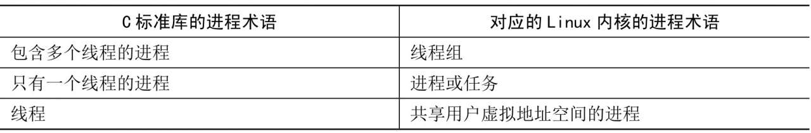
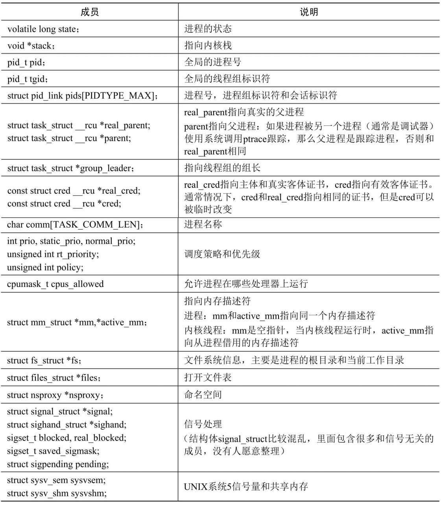

Linux 内核把进程称为任务 (task)​, 进程的虚拟地址空间分为用户虚拟地址空间和内核虚拟地址空间, 所有进程共享内核虚拟地址空间, 每个进程有独立的用户虚拟地址空间.

进程有两种特殊形式: 没有用户虚拟地址空间的进程称为内核线程, 共享用户虚拟地址空间的进程称为用户线程, 通常在不会引起混淆的情况下把用户线程简称为线程. 共享同一个用户虚拟地址空间的所有用户线程组成一个线程组.

C 标准库的进程术语和 Linux 内核的进程术语的对应关系如表 2.1 所示.

进程术语的对应关系:

结构体 task_struct 是进程描述符, 其主要成员如表 2.2 所示.

进程描述符 task struct 的主要成员:

