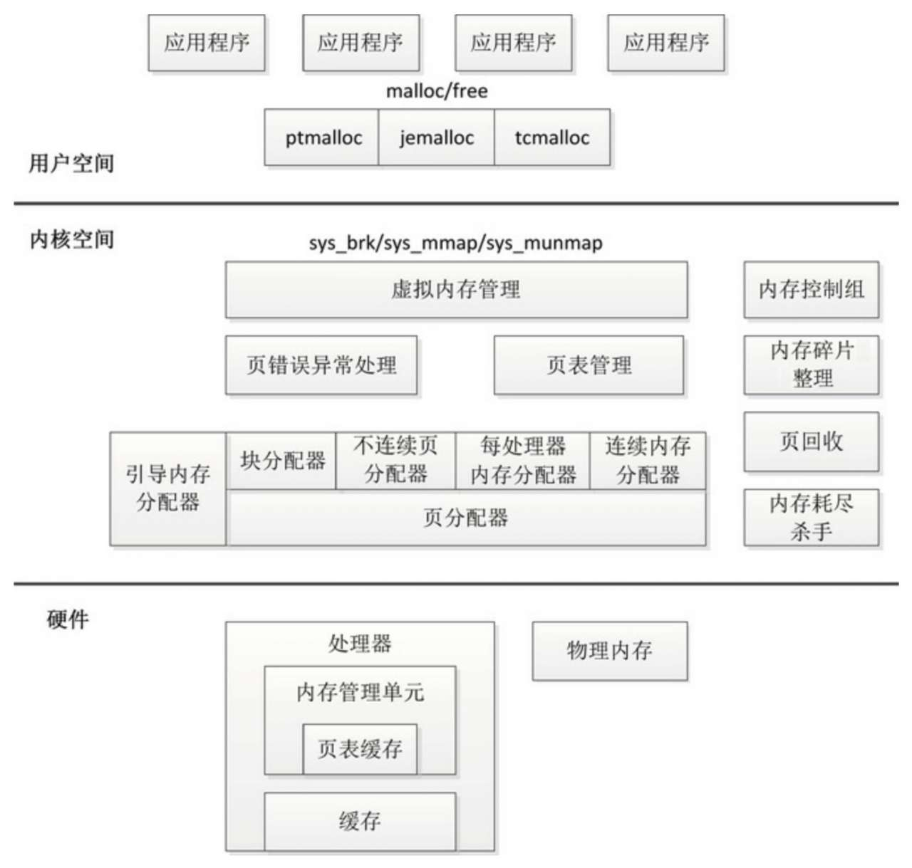

<!-- @import "[TOC]" {cmd="toc" depthFrom=1 depthTo=6 orderedList=false} -->

<!-- code_chunk_output -->

- [1. 内存管理架构](#1-内存管理架构)
- [2. 用户空间](#2-用户空间)
- [3. 内核空间](#3-内核空间)
  - [3.1. 内核空间的基本功能](#31-内核空间的基本功能)
  - [3.2. 内核空间的扩展功能](#32-内核空间的扩展功能)
- [4. 硬件层面](#4-硬件层面)

<!-- /code_chunk_output -->

# 1. 内存管理架构

内存管理子系统的架构如图, 分为**用户空间**、**内核空间**和**硬件** 3 个层面.

# 2. 用户空间

应用程序使用 `malloc()` 申请内存, 使用 `free()` 释放内存.

`malloc()` 和 `free()` 是 **glibc 库**的**内存分配器 ptmalloc** 提供的接口, ptmalloc 使用**系统调用** `brk` 或 `mmap` 向内核**以页为单位**申请内存, 然后**划分**成**小内存块**分配给应用程序.

**用户空间**的**内存分配器**, 除了 glibc 库的 ptmalloc, 还有谷歌公司的 tcmalloc 和 FreeBSD 的 jemalloc.

# 3. 内核空间

## 3.1. 内核空间的基本功能

**虚拟内存管理**负责从进程的**虚拟地址空间**分配**虚拟页**, `sys_brk` 用来**扩大或收缩堆**, `sys_mmap` 用来**在内存映射区域分配虚拟页**, `sys_munmap` 用来释放虚拟页.

内核使用**延迟分配物理内存**的策略, 进程第一次**访问虚拟页**的时候, 触发**页错误异常**, 页错误异常处理程序从**页分配器**申请**物理页**, 在**进程的页表**中把虚拟页映射到物理页.

页分配器负责分配物理页, 当前使用的页分配器是**伙伴分配器**.

内核空间提供了把**页**划分成**小内存块**分配的**块分配器**, 提供分配内存的接口 `kmalloc()` 和释放内存的接口 `kfree()`, 支持 3 种块分配器: **SLAB** 分配器、**SLUB** 分配器和 **SLOB** 分配器.

在**内核初始化**的过程中, 页分配器还没准备好, 需要使用临时的**引导内存分配器**分配内存.

## 3.2. 内核空间的扩展功能

**不连续页分配器**提供了分配内存的接口 **vmalloc** 和释放内存的接口 **vfree**, 在内存碎片化的时候, 申请连续物理页的成功率很低, 可以申请**不连续的物理页**, 映射到**连续的虚拟页**, 即虚拟地址连续而物理地址不连续.

**每处理器内存分配器**用来为**每处理器变量**分配内存.

**连续内存分配器**(`Contiguous Memory Allocator`, CMA) 用来给**驱动**程序**预留**一段连续的内存, 当**驱动程序不用**的时候, 可以给**进程**使用; 当驱动程序需要使用的时候, 把进程占用的内存通过**回收**或**迁移**的方式让出来, 给驱动程序使用.

**内存控制组**用来控制进程占用的内存资源.

当**内存碎片化**的时候, 找不到连续的物理页, **内存碎片整理**("memory compaction"的意译, 直译为"内存紧缩") 通过**迁移**的方式得到连续的物理页.

在**内存不足**的时候, **页回收**负责回收物理页, 对于**没有后备存储设备**支持的**匿名页**, 把数据换出到**交换区**, 然后释放物理页; 对于**有后备存储设备**支持的**文件页**, 把数据**写回存储设备**, 然后释放物理页. 如果**页回收失败**, 使用最后一招: **内存耗尽杀手**(`OOM killer`, `Out-of-Memory killer`) , 选择进程杀掉.

# 4. 硬件层面

处理器包含一个称为**内存管理单元**(`Memory Management Unit`, MMU) 的部件, 负责把虚拟地址转换成物理地址.

内存管理单元包含一个称为**页表缓存**(`Translation Lookaside Buffer`, TLB) 的部件, 保存**最近使用过的页表映射**, 避免每次把虚拟地址转换成物理地址都需要查询内存中的页表.

为了解决处理器的执行速度和内存的访问速度不匹配的问题, 在**处理器**和**内存**之间增加了**缓存**. 缓存通常分为一级缓存和二级缓存, 为了支持并行地取指令和取数据, 一级缓存分为数据缓存和指令缓存.

