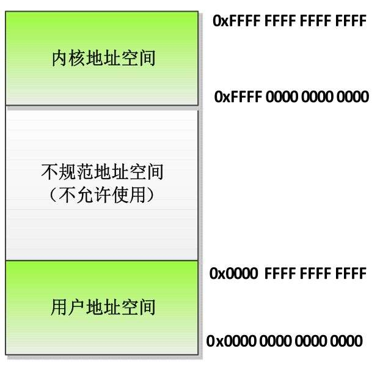
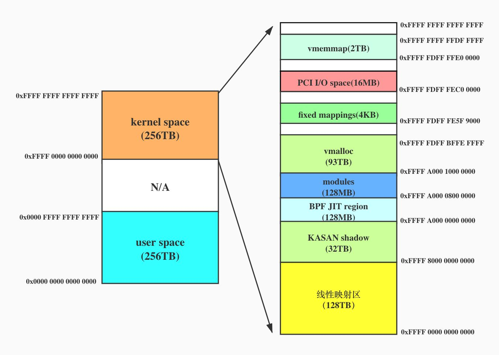
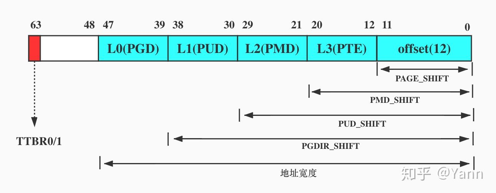

<!-- @import "[TOC]" {cmd="toc" depthFrom=1 depthTo=6 orderedList=false} -->

<!-- code_chunk_output -->

- [1. 相关背景](#1-相关背景)
- [2. 新内核变动](#2-新内核变动)
- [3. 虚拟地址空间](#3-虚拟地址空间)
- [4. 地址空间定义](#4-地址空间定义)
- [5. 虚拟地址宽度](#5-虚拟地址宽度)
- [6. 功能信息](#6-功能信息)
- [7. 寄存器 TTBR0 和 TTBR1](#7-寄存器-ttbr0-和-ttbr1)

<!-- /code_chunk_output -->

# 1. 相关背景

**64 位处理器**的**虚拟地址**已经**支持**到了**64 bit**, 但是 **64 位处理器**的**物理地址总线实际位宽**并**没有达到 64bit**, 常用的地址线宽有 **39 bit** 和 **48 bit**, 最新的 ARMv8.2 架构也已经可以**支持到 52bit**了. 那为什么没有支持到 64bit 呢? 以常用的 **48bit 地址线宽**举例, 其最大寻址能力是 `2^48` bytes(即 **256TB 内存**), 对于当今的个人电脑或服务器来说都是足够用的. 再加上**增加地址总线的宽度**会给**芯片设计**上带来不小的难度, 所以并没有一步到位搞成 64bit.

本文主要介绍 ARM64 位处理器地址空间的布局. 前文已提到**地址总线宽度(物理地址**)有 39bit、48bit 以及 52bit, 且 64 位处理器又支持**3 级**或**4 级页表**, **页大小**也可以配置成 **4KB**或**64KB**, 组合起来的话情况太多, 本文为了简化, 就基于最常用组合展开叙述: **48bit 地址总线**(物理地址), **4 级页表**, **页面大小 4KB**. 且不包括 ARM64 虚拟化模式和安全模式下的情况.

# 2. 新内核变动

`4.x` 的内核的**内核空间**的**线性映射区**位于**内核空间**的**高地址处**的 **128 TB**, 且当前的博客和一些书籍也都还是这样介绍.

可翻了翻 kernel 的 `Documentation/arch/arm64/memory.rst` 或者 `Documentation/translations/zh_CN/arch/arm64/memory.txt` 文档, 发现**最新的 kernel**已将**这 128TB** 移到了内核空间的**最低地址处**了. 具体是 2019 年 8 月的一个 commit, 如下:

```
commit 14c127c957c1c6070647c171e72f06e0db275ebf
Author: Steve Capper <steve.capper@arm.com>
Date:   Wed Aug 7 16:55:14 2019 +0100

    arm64: mm: Flip kernel VA space

    In order to allow for a KASAN shadow that changes size at boot time, one
    must fix the KASAN_SHADOW_END for both 48 & 52-bit VAs and "grow" the
    start address. Also, it is highly desirable to maintain the same
    function addresses in the kernel .text between VA sizes. Both of these
    requirements necessitate us to flip the kernel address space halves s.t.
    the direct linear map occupies the lower addresses.

    This patch puts the direct linear map in the lower addresses of the
    kernel VA range and everything else in the higher ranges.
```

本文基于目前 mainline 的内核版本 v5.9-rc2 展开叙述

# 3. 虚拟地址空间

因为目前应用程序没有那么大的内存需求, 所以 ARM64 处理器**不支持**完全的**64 位虚拟地址**, 实际支持情况如下.

(1) **虚拟地址**的**最大宽度**是 **48** 位, 如图 3.2 所示.

* **内核虚拟地址**在 64 位地址空间的**顶部**, 高 16 位是全 1, 范围是 `[0xFFFF0000 0000 0000, 0xFFFF FFFF FFFF FFFF]`;

  > 有效位是低 48 位, (高 16 位全 1, 是保留位)

* **用户虚拟地址**在 64 位地址空间的**底部**, 高 16 位是全 0, 范围是`[0x0000 0000 00000000, 0x0000 FFFF FFFF FFFF]`;

  > 有效位是低 48 位, (高 16 位全 0, 是保留位)

* **高 16 位**是**全 1** 或**全 0** 的地址称为**规范的地址**, 两者之间是**不规范地址空间**, 不允许使用.

ARM64 内核/用户虚拟地址空间划分:



(2) 如果处理器实现了 ARMv8.2 标准的**大虚拟地址**(`Large Virtual Address`, **LVA**) 支持, 并且**页长度**是 **64KB**, 那么**虚拟地址**的**最大宽度**是**52 位**.

(3) 可以为虚拟地址配置比最大宽度小的宽度, 并且可以为内核虚拟地址和用户虚拟地址配置不同的宽度. 转换控制寄存器(Translation Control Register) `TCR_EL1`的字段 T0SZ 定义了必须是全 0 的最高位的数量, 字段 T1SZ 定义了必须是全 1 的最高位的数量, 用户虚拟地址的宽度是(`64-TCR_EL1.T0SZ`) , 内核虚拟地址的宽度是(`64-TCR_EL1.T1SZ`) .

# 4. 地址空间定义

下面是 ARM64 位处理器使用**48 位虚拟地址**, **4 级页表**, **页面大小 4KB**时的 layout:

```
  Start			End			Size		Use
  -----------------------------------------------------------------------
  0000000000000000	0000ffffffffffff	 256TB		user
  ffff000000000000	ffff7fffffffffff	 128TB		kernel logical memory map
 [ffff600000000000	ffff7fffffffffff]	  32TB		[kasan shadow region]
  ffff800000000000	ffff800007ffffff	 128MB		bpf jit region
  ffff800008000000	ffff80000fffffff	 128MB		modules
  ffff800010000000	fffffbffefffffff	 124TB		vmalloc
  fffffbfff0000000	fffffbfffdffffff	 224MB		fixed mappings (top down)
  fffffbfffe000000	fffffbfffe7fffff	   8MB		[guard region]
  fffffbfffe800000	fffffbffff7fffff	  16MB		PCI I/O space
  fffffbffff800000	fffffbffffffffff	   8MB		[guard region]
  fffffc0000000000	fffffdffffffffff	   2TB		vmemmap
  fffffe0000000000	ffffffffffffffff	   2TB		[guard region]
```

注: 以上 layout 来自内核文档 `Documentation/arch/arm64/memory.rst`. **x86**的位于 `Documentation/arch/x86/x86_64/mm.rst`

为了直观点, 画了幅图:

<div align='center'>

</div>

# 5. 虚拟地址宽度

在编译 ARM64 架构的 Linux 内核时, 可以选择虚拟地址宽度.

(1) 如果选择页长度 **4KB**, **默认**的**虚拟地址宽度**是 **39 位**.

(2) 如果选择页长度 **16KB**, 默认的**虚拟地址宽度**是 **47 位**.

(3) 如果选择页长度 **64KB**, 默认的虚拟地址宽度是 **42 位**.

(4) 可以选择 **48 位**虚拟地址.

# 6. 功能信息

在 ARM64 架构的 Linux 内核中, **内核虚拟地址**和**用户虚拟地址**的**宽度相同**.

**所有进程共享内核虚拟地址空间**, **每个进程**有**独立**的**用户虚拟地址空间**, **同一个线程组**的用户线程**共享用户虚拟地址空间**, **内核线程没有用户虚拟地址空间**.

# 7. 寄存器 TTBR0 和 TTBR1

本文讲到了内核地址空间和用户地址空间, 这就不得不提一下 ARM64 相关的两个寄存器 TTBR0 和 TTBR1. 它们的功能类似于 X86 里的 CR3 寄存器用来存放进程的 1 级页表(PGD)的基地址. 但不同的是 ARM64 使用了两个寄存器分别存放用户空间和内核空间的 1 级页表基地址.

我们知道所有进程的内核地址空间的页表是共用一套的, 所以 TTBR1 中的内容不会改变, 永远等于`init_mm->swapper_pg_dir`. 但各个进程的用户空间的页表各自独立, 那么 TTBR0 中的内容则等于各自进程的`task_struct->mm_struct->pgd`

最后提一下, 处理器如何知道什么时候访问 TTBR0, 什么时候访问 TTBR1 呢? ARMv8 手册中有提到, 当 CPU 访问地址时, 若地址的第 63bit 为 1 则自动使用 **TTBR1**, 为 0 则使用 **TTBR0**.


