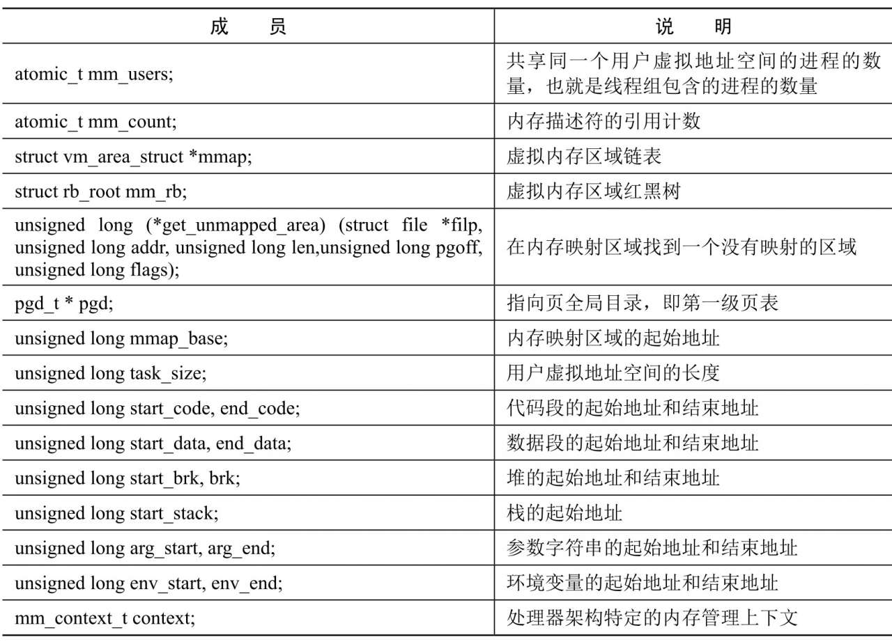
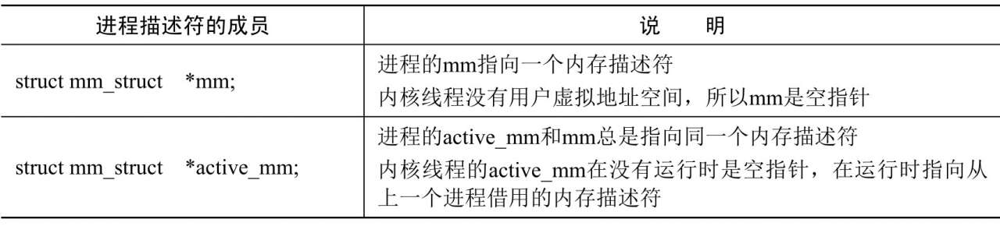
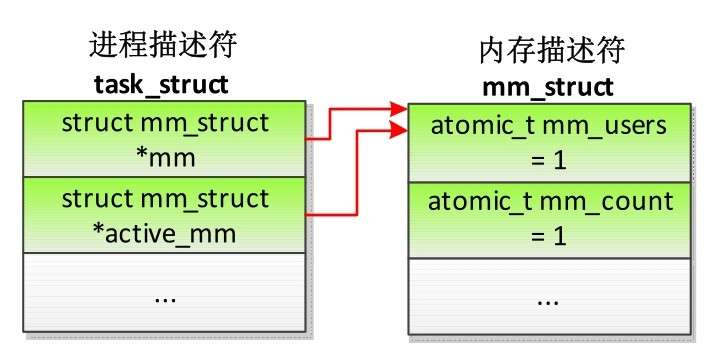
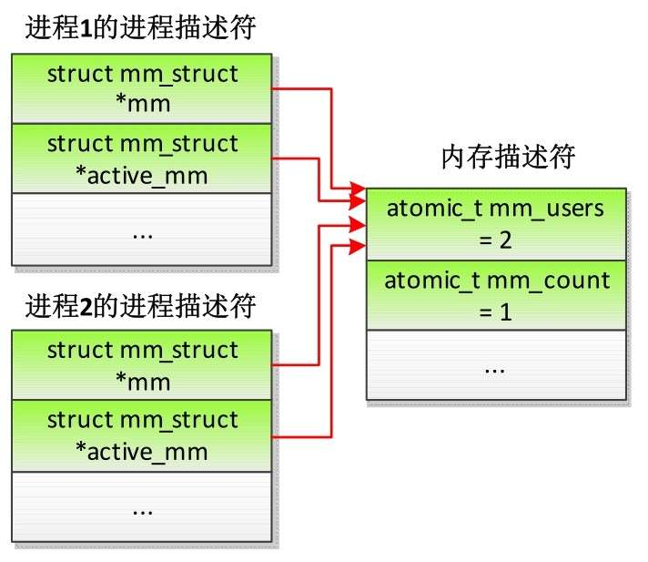
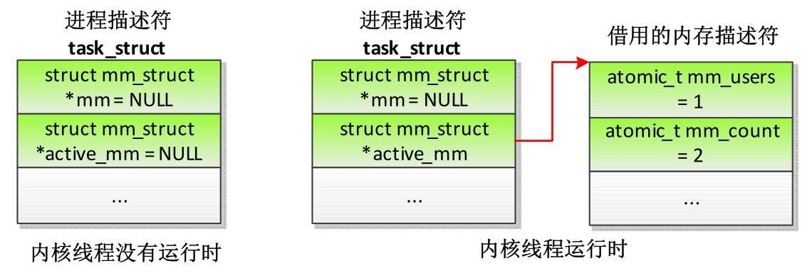
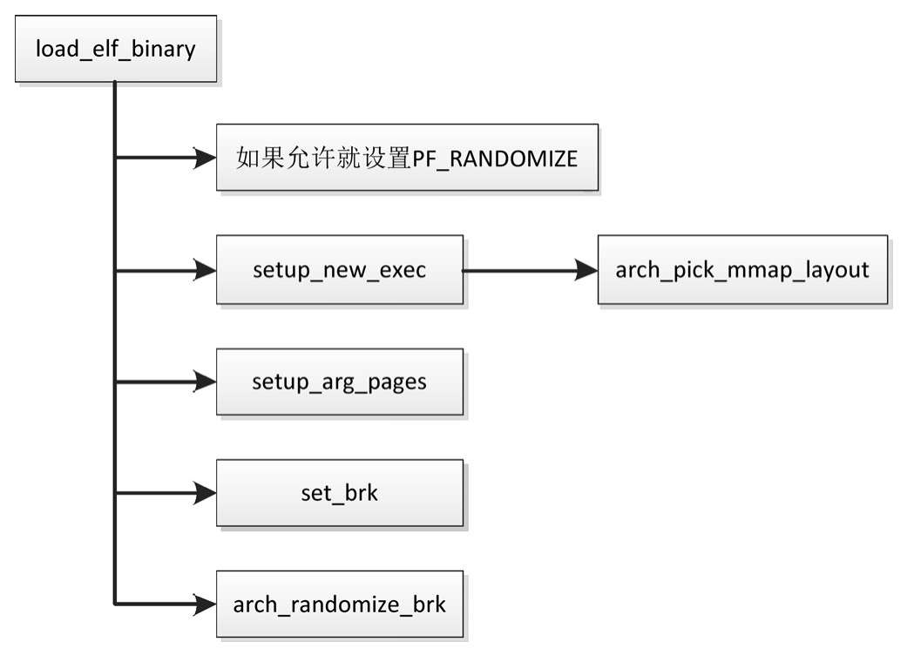

进程的用户虚拟地址空间的起始地址是 0, 长度是 TASK_SIZE, 由每种处理器架构定义自己的宏 TASK_SIZE. ARM64 架构定义的宏 TASK_SIZE 如下所示.

(1) 32 位用户空间程序: TASK_SIZE 的值是 TASK_SIZE_32, 即 0x100000000, 等于 4GB.

(2) 64 位用户空间程序: `TASK_SIZE` 的值是 `TASK_SIZE_64`, 即 `2VA_BITS` 字节, VA_BITS 是编译内核时选择的虚拟地址位数.

```cpp
// arch/arm64/include/asm/memory.h
#define VA_BITS          (CONFIG_ARM64_VA_BITS)
#define TASK_SIZE_64     (UL(1) << VA_BITS)
#ifdef CONFIG_COMPAT    /* 支持执行 32 位用户空间程序 */
#define TASK_SIZE_32     UL(0x100000000)
/* test_thread_flag(TIF_32BIT)判断用户空间程序是不是 32 位 */
#define TASK_SIZE       (test_thread_flag(TIF_32BIT) ? \
		TASK_SIZE_32 : TASK_SIZE_64)
#define TASK_SIZE_OF(tsk)  (test_tsk_thread_flag(tsk, TIF_32BIT) ? \
		TASK_SIZE_32 : TASK_SIZE_64)
#else
#define TASK_SIZE    TASK_SIZE_64
#endif /* CONFIG_COMPAT */
```

进程的用户虚拟地址空间包含以下区域.

(1) 代码段、数据段和未初始化数据段.

(2) 动态库的代码段、数据段和未初始化数据段.

(3) 存放动态生成的数据的堆.

(4) 存放局部变量和实现函数调用的栈.

(5) 存放在栈底部的环境变量和参数字符串.

(6) 把文件区间映射到虚拟地址空间的内存映射区域.

内核使用内存描述符 mm_struct 描述进程的用户虚拟地址空间, 内存描述符的主要成员如表 3.1 所示.

内存描述符的主要成员:



进程描述符(task_struct) 中和内存描述符相关的成员如表 3.2 所示.

表 3.2 进程描述符中和内存描述符相关的成员:



如果进程不属于线程组, 那么进程描述符和内存描述符的关系如图 3.3 所示, 进程描述符的成员 mm 和 `active_mm` 都指向同一个内存描述符, 内存描述符的成员 `mm_users` 是 1、成员 `mm_count` 是 1.

图 3.3 进程的进程描述符和内存描述符的关系



如果两个进程属于同一个线程组, 那么进程描述符和内存描述符的关系如图 3.4 所示, 每个进程的进程描述符的成员 mm 和 active_mm 都指向同一个内存描述符, 内存描述符的成员 mm_users 是 2、成员 `mm_count` 是 1.

图 3.4 线程组的进程描述符和内存描述符的关系



内核线程的进程描述符和内存描述符的关系如图 3.5 所示, 内核线程没有用户虚拟地址空间, 当内核线程没有运行的时候, 进程描述符的成员 mm 和 active_mm 都是空指针; 当内核线程运行的时候, 借用上一个进程的内存描述符, 在被借用进程的用户虚拟地址空间的上方运行, 进程描述符的成员 active_mm 指向借用的内存描述符, 假设被借用的内存描述符所属的进程不属于线程组, 那么内存描述符的成员 mm_users 不变, 仍然是 1, 成员 `mm_count` 加 1 变成 2.

图 3.5 内核线程的进程描述符和内存描述符的关系



为了使缓冲区溢出攻击更加困难, 内核支持为内存映射区域、栈和堆选择随机的起始地址. 进程是否使用虚拟地址空间随机化的功能, 由以下两个因素共同决定.

(1) 进程描述符的成员 personality(个性化) 是否设置 ADDR_NO_RANDOMIZE.

(2) 全局变量 randomize_va_space:0 表示关闭虚拟地址空间随机化, 1 表示使内存映射区域和栈的起始地址随机化, 2 表示使内存映射区域、栈和堆的起始地址随机化. 可以通过文件 "`/proc/sys/kernel/randomize_va_space`" 修改.

```cpp
// mm/memory.c
int randomize_va_space __read_mostly =
#ifdef CONFIG_COMPAT_BRK
		1;
#else
		2;
#endif
```

为了使旧的应用程序(基于 libc5) 正常运行, 默认打开配置宏 CONFIG_COMPAT_BRK, 禁止堆随机化. 所以默认配置是使内存映射区域和栈的起始地址随机化.

栈通常自顶向下增长, 当前只有惠普公司的 PA-RISC 处理器的栈是自底向上增长. 栈的起始地址是 STACK_TOP, 默认启用栈随机化, 需要把起始地址减去一个随机值. STACK_TOP 是每种处理器架构自定义的宏, ARM64 架构定义的 STACK_TOP 如下所示: 如果是 64 位用户空间程序, STACK_TOP 的值是 TASK_SIZE_64; 如果是 32 位用户空间程序, STACK_TOP 的值是异常向量的基准地址 0xFFFF0000.

```cpp
// arch/arm64/include/asm/processor.h
#define STACK_TOP_MAX         TASK_SIZE_64
#ifdef CONFIG_COMPAT  /* 支持执行 32 位用户空间程序 */
#define AARCH32_VECTORS_BASE  0xffff0000
#define STACK_TOP   (test_thread_flag(TIF_32BIT) ? \
		AARCH32_VECTORS_BASE : STACK_TOP_MAX)
#else
#define STACK_TOP    STACK_TOP_MAX
#endif /* CONFIG_COMPAT */
```

内存映射区域的起始地址是内存描述符的成员 mmap_base. 如图 3.6 所示, 用户虚拟地址空间有两种布局, 区别是内存映射区域的起始位置和增长方向不同.

图 3.6 用户虚拟地址空间的两种布局:


(1) 传统布局: 内存映射区域自底向上增长, 起始地址是 TASK_UNMAPPED_BASE, 每种处理器架构都要定义这个宏, ARM64 架构定义为 TASK_SIZE/4. 默认启用内存映射区域随机化, 需要把起始地址加上一个随机值. 传统布局的缺点是堆的最大长度受到限制, 在 32 位系统中影响比较大, 但是在 64 位系统中这不是问题.

(2) 新布局: 内存映射区域自顶向下增长, 起始地址是(STACK_TOP − 栈的最大长度 − 间隙) . 默认启用内存映射区域随机化, 需要把起始地址减去一个随机值.

当进程调用 execve 以装载 ELF 文件的时候, 函数 load_elf_binary 将会创建进程的用户虚拟地址空间. 函数 load_elf_binary 创建用户虚拟地址空间的过程如图 3.7 所示.

图 3.7 装载 ELF 文件时创建虚拟地址空间



如果没有给进程描述符的成员 personality 设置标志位 ADDR_NO_RANDOMIZE(该标志位表示禁止虚拟地址空间随机化) , 并且全局变量 randomize_va_space 是非零值, 那么给进程设置标志 PF_RANDOMIZE, 允许虚拟地址空间随机化.

各种处理器架构自定义的函数 `arch_pick_mmap_layout` 负责选择内存映射区域的布局. ARM64 架构定义的函数 `arch_pick_mmap_layout` 如下:

```cpp
// arch/arm64/mm/mmap.c
1   void arch_pick_mmap_layout(struct mm_struct *mm)
2   {
3    unsigned long random_factor = 0UL;
4
5    if (current->flags & PF_RANDOMIZE)
6         random_factor = arch_mmap_rnd();
7
8    if (mmap_is_legacy()) {
9         mm->mmap_base = TASK_UNMAPPED_BASE + random_factor;
10        mm->get_unmapped_area = arch_get_unmapped_area;
11    } else {
12        mm->mmap_base = mmap_base(random_factor);
13        mm->get_unmapped_area = arch_get_unmapped_area_topdown;
14    }
15   }
16
17   static int mmap_is_legacy(void)
18   {
19    if (current->personality & ADDR_COMPAT_LAYOUT)
20         return 1;
21
22    if (rlimit(RLIMIT_STACK) == RLIM_INFINITY)
23         return 1;
24
25    return sysctl_legacy_va_layout;
26   }
```

第 8~10 行代码, 如果给进程描述符的成员 personality 设置标志位 ADDR_COMPAT_LAYOUT 表示使用传统的虚拟地址空间布局, 或者用户栈可以无限增长, 或者通过文件 "`/proc/sys/vm/legacy_va_layout`" 指定, 那么使用传统的自底向上增长的布局, 内存映射区域的起始地址是 TASK_UNMAPPED_BASE 加上随机值, 分配未映射区域的函数是 arch_get_unmapped_area.

第 11~13 行代码, 如果使用自顶向下增长的布局, 那么分配未映射区域的函数是 arch_get_unmapped_area_topdown, 内存映射区域的起始地址的计算方法如下:

```cpp
// arch/arm64/include/asm/elf.h
#ifdef CONFIG_COMPAT
#define STACK_RND_MASK         (test_thread_flag(TIF_32BIT) ? \
				0x7ff >> (PAGE_SHIFT - 12) : \
				0x3ffff >> (PAGE_SHIFT - 12))
#else
#define STACK_RND_MASK         (0x3ffff >> (PAGE_SHIFT - 12))
#endif
arch/arm64/mm/mmap.c
#define MIN_GAP (SZ_128M + ((STACK_RND_MASK << PAGE_SHIFT) + 1))
#define MAX_GAP (STACK_TOP/6*5)
static unsigned long mmap_base(unsigned long rnd)
{
	unsigned long gap = rlimit(RLIMIT_STACK);
	if (gap < MIN_GAP)
	gap = MIN_GAP;
	else if (gap > MAX_GAP)
	gap = MAX_GAP;
	return PAGE_ALIGN(STACK_TOP - gap - rnd);
}
```

先计算内存映射区域的起始地址和栈顶的间隙: 初始值取用户栈的最大长度, 限定不能小于"128MB + 栈的最大随机偏移值+ 1", 确保用户栈最大可以达到 128MB; 限定不能超过 `STACK_TOP` 的 `5/6`. 内存映射区域的起始地址等于"STACK_TOP−间隙−随机值", 然后向下对齐到页长度.

回到函数 load_elf_binary: 函数 setup_arg_pages 把栈顶设置为 STACK_TOP 减去随机值, 然后把环境变量和参数从临时栈移到最终的用户栈; 函数 set_brk 设置堆的起始地址, 如果启用堆随机化, 把堆的起始地址加上随机值.

```cpp
// fs/binfmt_elf.c
static int load_elf_binary(struct linux_binprm *bprm)
{
	...
	retval = setup_arg_pages(bprm, randomize_stack_top(STACK_TOP),
			executable_stack);
	...
	retval = set_brk(elf_bss, elf_brk, bss_prot);
	...
	if ((current->flags & PF_RANDOMIZE) && (randomize_va_space > 1)) {
	current->mm->brk = current->mm->start_brk =
		arch_randomize_brk(current->mm);
	}
	...
}
```

