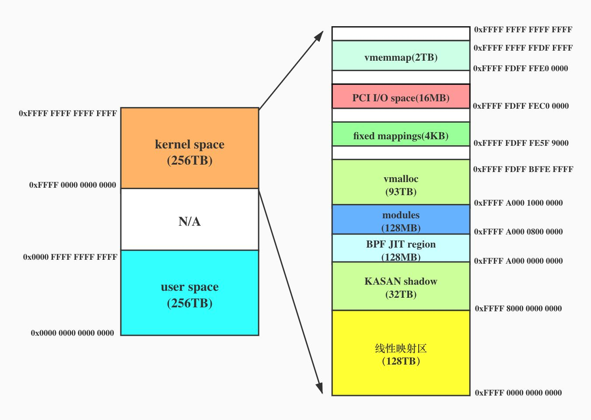
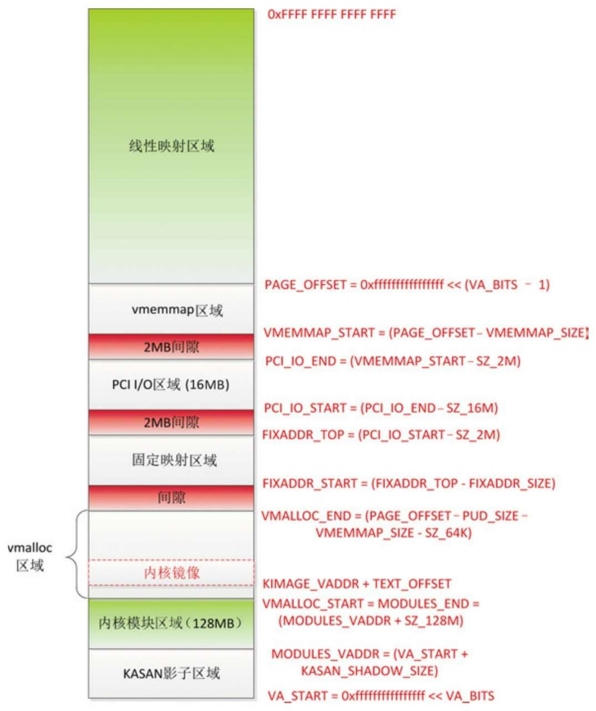

<!-- @import "[TOC]" {cmd="toc" depthFrom=1 depthTo=6 orderedList=false} -->

<!-- code_chunk_output -->

- [1. 整体布局](#1-整体布局)
- [2. 区域详解](#2-区域详解)
  - [2.1. 线性映射区](#21-线性映射区)
  - [2.2. vmemmap 区域](#22-vmemmap-区域)
  - [2.3. PCI I/O 区域](#23-pci-io-区域)
  - [2.4. 固定映射区](#24-固定映射区)
  - [2.5. vmalloc 区域](#25-vmalloc-区域)
  - [2.6. 内核模块区域](#26-内核模块区域)
  - [2.7. KASAN 影子区域](#27-kasan-影子区域)

<!-- /code_chunk_output -->

# 1. 整体布局

下面是 ARM64 位处理器使用 **48 位虚拟地址**, **4 级页表**, **页面大小 4KB**时的 layout:

```
  Start			End			Size		Use
  -----------------------------------------------------------------------
  0000000000000000	0000ffffffffffff	 256TB		user
  ffff000000000000	ffff7fffffffffff	 128TB		kernel logical memory map
 [ffff600000000000	ffff7fffffffffff]	  32TB		[kasan shadow region]
  ffff800000000000	ffff800007ffffff	 128MB		bpf jit region
  ffff800008000000	ffff80000fffffff	 128MB		modules
  ffff800010000000	fffffbffefffffff	 124TB		vmalloc
  fffffbfff0000000	fffffbfffdffffff	 224MB		fixed mappings (top down)
  fffffbfffe000000	fffffbfffe7fffff	   8MB		[guard region]
  fffffbfffe800000	fffffbffff7fffff	  16MB		PCI I/O space
  fffffbffff800000	fffffbffffffffff	   8MB		[guard region]
  fffffc0000000000	fffffdffffffffff	   2TB		vmemmap
  fffffe0000000000	ffffffffffffffff	   2TB		[guard region]
```

注: 以上 layout 来自内核文档 `Documentation/arm64/memory.rst`. **x86**的位于 `Documentation/x86/x86_64/mm.rst`

为了直观点, 画了幅图:



ARM64 架构的内核地址空间布局(注意图中**宏的定义**):



# 2. 区域详解

内核中划分的这么多区域, 且都有自己对应的地址与大小, 这些地址和大小在 kernel 中哪里定义着呢?具体位于: `arch/arm64/include/asm/memory.h`.

> x86 定义在 `arch/x86/include/asm/` 目录下文件.

以下是从中截取的片段, 部分解释在下面

```cpp
#define PAGE_OFFSET             (_PAGE_OFFSET(VA_BITS))
#define KIMAGE_VADDR            (MODULES_END)
#define BPF_JIT_REGION_START    (KASAN_SHADOW_END)
#define BPF_JIT_REGION_SIZE     (SZ_128M)
#define BPF_JIT_REGION_END      (BPF_JIT_REGION_START + BPF_JIT_REGION_SIZE)
#define MODULES_END             (MODULES_VADDR + MODULES_VSIZE)
.....
```

## 2.1. 线性映射区

(1) **线性映射区域**: **所有物理内存！！！映射部分**, 通过**页表项**将物理页映射到 `PAGE_OFFSET` 开始的这个虚拟地址, 所以也叫**物理内存映射区域**.

> 从 memory block 中分配的内存还是会被页表映射到线性映射区, 只是不让 buddy 管理了而已, 也就是说 memory block 中预留了 memory, 其实还是会有 struct page

称为线性映射区域的原因是**虚拟地址**和**物理地址**是**线性关系**:

`虚拟地址 = ((物理地址 − PHYS_OFFSET) + PAGE_OFFSET)`, 其中 `PHYS_OFFSET` 是**内存的起始物理地址**, ARM 中 `PHYS_OFFSET` 是 0, 所以`虚拟地址 = 物理地址 + PAGE_OFFSET`.

范围是 `[PAGE_OFFSET, 2^64−1]`, 起始位置是 `PAGE_OFFSET =(0xFFFF FFFF FFFF FFFF << (VA_BITS-1))`, **长度**是**内核虚拟地址空间的一半**.

PAGE_OFFSET: **内核线性映射区**的**起始地址**, 大小为 128TB.

> `[a, b]` 是左闭右闭, `[a, b)` 是左闭右开.

## 2.2. vmemmap 区域

(2) **vmemmap 区域**: 内核使用 `struct page` 描述一个物理页, 内存的**所有物理页**对应**一个 struct page 结构体数组**. 如果内存的**物理地址！！！空间不连续**, 存在很多空洞, 称为**稀疏内存**. vmemmap 区域是**稀疏内存**的 **page 结构体数组**的**虚拟地址空间**.

范围是 `[VMEMMAP_START, PAGE_OFFSET)`, 长度是 `VMEMMAP_SIZE =(线性映射区域的长度 / 页长度 * page 结构体的长度上限)`.

`VMEMMAP_START`: 定义了 vmemmap 区域的起始地址(是线性地址), 大小 2TB. **sparsemem 内存模型**中用来存放所有`struct page`的**虚拟地址空间**. 这个地址开始存放 struct page 数组.

> 存放的不是 page 物理页, 而是 struct page 结构体 metadata. 页帧 page 大小肯定是 4K, struct page 也代表了一个物理页帧 page, 但它也可能关联了多个物理页帧 page, 里面有相关的 order 属性.

```cpp
#define __pa(x) ((unsigned long)(x)-PAGE_OFFSET)//内核逻辑地址转换为物理地址

// 内核虚拟地址转成 struct page, 这里就使用了 mem_map
#define virt_to_page(kaddr) (mem_map + (__pa(kaddr) >> PAGE_SHIFT))
// 遍历所有 struct page
struct page *p = virt_to_page(0);
struct page tmp_p;
for (i = 0; i < nr_pages; i++) {
    p = p[i];
}
```

## 2.3. PCI I/O 区域

> ARM 应该没有啊, x86 是 64KB

(3) **PCI I/O 区域**: 外围组件互联(Peripheral Component Interconnect, PCI) 是一种总线标准, PCI I/O 区域是 PCI 设备的 **I/O 地址空间**.

范围是 `[PCI_IO_START, PCI_IO_END)`, 长度是 **16MB**, **结束地址**是 `PCI_IO_END = (VMEMMAP_START − 2MB)`.

## 2.4. 固定映射区

(4) **固定映射区域**: 固定地址是**编译时**的特殊虚拟地址, 编译的时候是**一个常量**, 在**内核初始化**的时候映射到物理地址, **dtb** 上电映射就在这个区域中.

范围是 `[FIXADDR_START, FIXADDR_TOP)`, 长度是 `FIXADDR_SIZE`, 结束地址是 `FIXADDR_TOP = (PCI_IO_START − 2MB)`.

## 2.5. vmalloc 区域

(5) **vmalloc 区域**: vmalloc 区域是函数 vmalloc 使用的虚拟地址空间, 内核使用 vmalloc 分配**虚拟地址连续**但**物理地址不连续**的内存.

范围是 `[VMALLOC_START, VMALLOC_END)`, 起始地址是 `VMALLOC_START`, 等于**内核模块区域的结束地址**, 结束地址是 `VMALLOC_END = (PAGE_OFFSET − PUD_SIZE − VMEMMAP_SIZE − 64KB)`, 其中 **PUD_SIZE** 是**页上级目录表项**映射的地址空间的长度.

`VMALLOC_START`: 定义了 vmalloc 区域的起始地址, 大小约等于 93TB. 记得之前 ARM32 可以通过 bootargs 去控制 vmalloc 区域的大小, 不知道 64 还有没. 但是有没有也没所谓了, 毕竟 64 位的处理器上虚拟地址空间已不像 32 位处理器那么紧张.

**内核镜像**在 vmalloc 区域, 起始虚拟地址是 `(KIMAGE_VADDR + TEXT_OFFSET)`, 其中 `KIMAGE_VADDR` 是内核镜像的虚拟地址的**基准值**, 等于**内核模块区域的结束地址** `MODULES_END`; `TEXT_OFFSET` 是内存中的内核镜像相对内存起始位置的偏移.

`KIMAGE_VADDR`: 定义了内核镜像的链接地址, 通过其定义 "`#define KIMAGE_VADDR (MODULES_END)`" 看出它正好位于 modules 区域的结尾处, 即 vmalloc 区域的起始地址. `vmlinux.ld.S` 文件设置链接地址时会用到它, `start_kernel->paging_init->map_kernel` 会将内核镜像的各个段依次映射到该区域.

## 2.6. 内核模块区域

(6) **内核模块区域**: 内核模块区域是内核模块使用的虚拟地址空间.

范围是 `[MODULES_VADDR,MODULES_END)`, 长度是**128MB**, 起始地址是 `MODULES_VADDR = (内核虚拟地址空间的起始地址 + KASAN 影子区域的长度)`.

## 2.7. KASAN 影子区域

(7) **KASAN 影子区域**的起始地址是内核虚拟地址空间的起始地址, 长度是内核虚拟地址空间长度的 1/8.

内核地址消毒剂(`Kernel Address SANitizer`, **KASAN**) 是一个**动态的内存错误检查工具**. 它为发现释放后使用和越界访问这两类缺陷提供了快速和综合的解决方案.

`KASAN_SHADOW_START`: **KASAN 影子内存**的**起始虚拟地址**, 大小为 32TB. 为什么是 32TB 呢?因为 KASAN 通常使用`1:8`或`1:16`比例的内存来做**影子内存**, 分别对应大小为 `256TB/8=32TB` 或 `256TB/16=16TB`, 这里表示的是 `1:8` 的情况所以是 32TB.