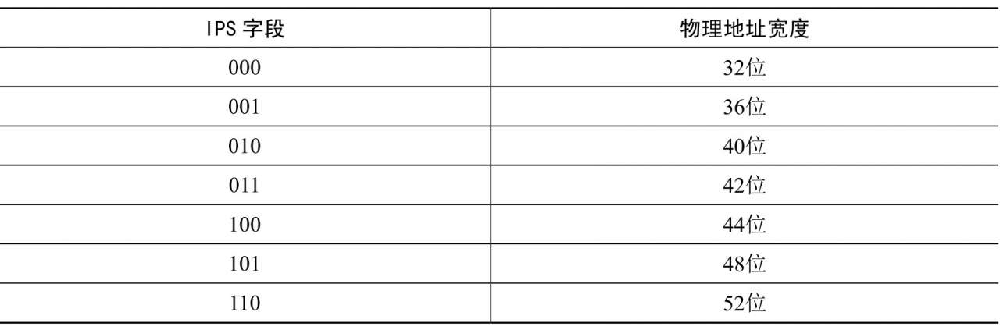

物理地址是**处理器**在**系统总线**上看到的地址. 使用**精简指令集**(Reduced Instruction Set Computer, RISC)的处理器通常只实现一个物理地址空间, 外围设备和物理内存使用统一的物理地址空间. 有些处理器架构把分配给外围设备的物理地址区域称为设备内存.

处理器通过外围设备控制器的寄存器访问外围设备, 寄存器分为控制寄存器、状态寄存器和数据寄存器三大类, 外围设备的寄存器通常被连续地编址. 处理器对外围设备寄存器的编址方式有两种.

(1) I/O 映射方式(`I/O-mapped`): 英特尔的 x86 处理器为外围设备专门实现了一个单独的地址空间, 称为"I/O 地址空间"或"I/O 端口空间", 处理器通过专门的 I/O 指令(如 x86 的 in 和 out 指令)来访问这一空间中的地址单元.

(2) 内存映射方式(`memory-mapped`): 使用精简指令集的处理器通常只实现一个物理地址空间, 外围设备和物理内存使用统一的物理地址空间, 处理器可以像访问一个内存单元那样访问外围设备, 不需要提供专门的 I/O 指令.

程序只能通过虚拟地址访问外设寄存器, 内核提供了以下函数来把外设寄存器的物理地址映射到虚拟地址空间.

(1) 函数 `ioremap()` 把外设寄存器的物理地址映射到内核虚拟地址空间.

```cpp

```

(2) 函数 `io_remap_pfn_range()` 把外设寄存器的物理地址映射到进程的用户虚拟地址空间.

```cpp

```

除了 SPARC 处理器以外, 在其他处理器架构中函数 `io_remap_pfn_range()` 和函数 `remap_pfn_range()` 等价. 函数 `remap_pfn_range()` 用于把内存的物理页映射到进程的用户虚拟地址空间.

内核提供了函数 `iounmap()`, 它用来删除函数 `ioremap()` 创建的映射.

```cpp
void iounmap(void *addr);
```

ARM64 架构的实现 ARM64 架构定义了两种内存类型.

(1) 正常内存(Normal Memory): 包括物理内存和只读存储器(ROM).

(2) 设备内存(Device Memory): 指分配给外围设备寄存器的物理地址区域.

对于正常内存, 可以设置共享属性和缓存属性. 共享属性用来定义一个位置是否可以被多个核共享, 分为不可共享、内部共享和外部共享. 不可共享是指只被处理器的一个核使用, 内部共享是指一个处理器的所有核共享或者多个处理器共享, 外部共享是指处理器和其他观察者(比如图形处理单元或 DMA 控制器)共享. 缓存属性用来定义访问时是否通过处理器的缓存.

设备内存的共享属性总是外部共享, 缓存属性总是不可缓存(即必须绕过处理器的缓存).

ARM64 架构根据 3 种属性把设备内存分为 4 种类型.

(1) Device-nGnRnE, 这种类型限制最严格.

(2) Device-nGnRE.

(3) Device-nGRE.

(4) Device-GRE, 这种类型限制最少.

3 种属性分别如下.

(1) 聚集属性: G 表示聚集(Gathering), nG 表示不聚集(non Gathering).

聚集属性决定对内存区域的多个访问是否可以被合并为一个总线事务. 如果地址被标记为"不聚集", 那么必须按照程序里面的地址和长度访问. 如果地址被标记为"聚集", 处理器可以把两个"写一个字节"的访问合并成一个"写两个字节"的访问, 可以把对相同内存位置的多个访问合并, 例如读相同位置两次, 处理器只需要读一次, 为两条指令返回相同的结果.

(2) 重排序属性: R 表示重排序(Re-ordering), nR 表示不重排序(non Re-ordering).

这个属性决定对相同设备的多个访问是否可以重新排序. 如果地址被标记为"不重排序", 那么对同一个块的访问总是按照程序顺序执行.

(3) 早期写确认属性: E 表示早期写确认(Early Write Acknowledgement),nE 表示不执行早期写确认(non Early Write Acknowledgement).

这个属性决定是否允许处理器和从属设备之间的中间写缓冲区发送"写完成"确认. 如果地址被标记为"不执行早期写确认", 那么必须由外围设备发送"写完成"确认. 如果地址被标记为"早期写确认", 那么允许写缓冲区在外围设备收到数据之前发送"写完成"确认.

# 物理地址宽度

目前 ARM64 处理器支持的最大物理地址宽度是 48 位, 如果实现了 ARMv8.2 标准的大物理地址(Large Physical Address, LPA)支持, 并且页长度是 64KB, 那么物理地址的最大宽度是 52 位.

可以使用寄存器 TCR_EL1(Translation Control Register for Exception Level 1, 异常级别 1 的转换控制寄存器)的字段 IPS(Intermediate Physical Address Size, 中间物理地址长度)控制物理地址的宽度, IPS 字段的长度是 3 位, IPS 字段的值和物理地址宽度的对应关系如表 3.3 所示.

IPS 字段和物理地址宽度的对应关系:

