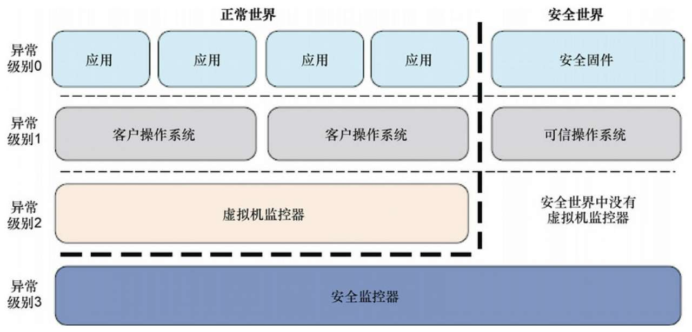
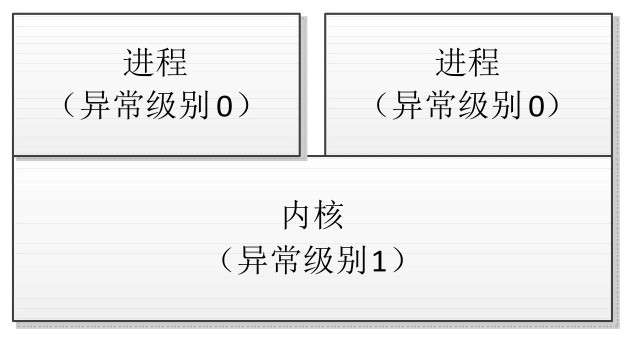
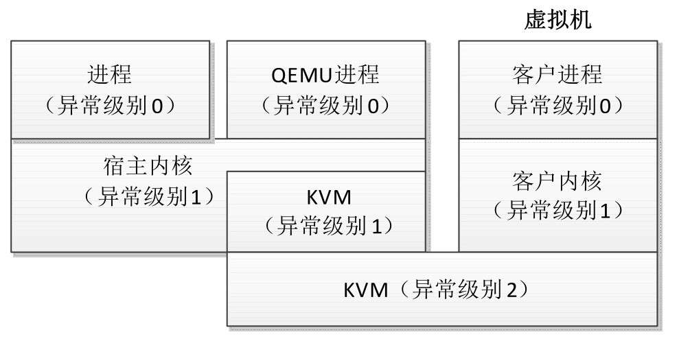
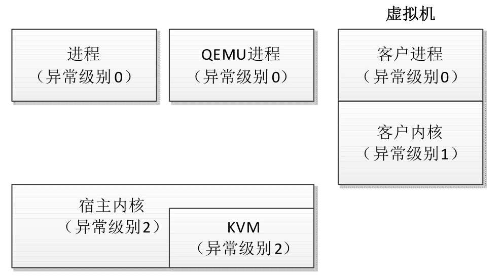

如下图所示, ARM64 处理器定义了 4 个异常级别: 0～3. 异常级别越高, 权限越高.

ARM64 处理器的异常级别:

如下图所示, 通常 ARM64 处理器在异常级别 0 执行进程, 在异常级别 1 执行内核. ARM64 处理器的异常级别 0 就是我们常说的用户模式, 异常级别 1 就是我们常说的内核模式.

普通的异常级别切换:

虚拟机是现在流行的虚拟化技术, 在计算机上创建一个虚拟机, 在虚拟机里面运行一个操作系统, 运行虚拟机的操作系统称为宿主操作系统(host OS)​, 虚拟机里面的操作系统称为客户操作系统(guest OS)​.

常用的开源虚拟机管理软件是 QEMU, QEMU 支持基于内核的虚拟机(Kernel-based Virtual Machine, KVM)​.KVM 的主要特点是直接在处理器上执行客户操作系统, 所以虚拟机的执行速度很快. KVM 是内核的一个模块, 把内核变成虚拟机监控程序. 如下图所示, 宿主操作系统中的进程在异常级别 0 运行, 内核在异常级别 1 运行, KVM 模块可以穿越异常级别 1 和 2; 客户操作系统中的进程在异常级别 0 运行, 内核在异常级别 1 运行. 在宿主操作系统的异常级别 1 和客户操作系统的异常级别 1 之间切换时, 需要 KVM 陷入异常级别 2.

支持虚拟化的异常级别切换:

如下图所示, 为了提高切换速度, ARM64 架构引入了虚拟化宿主扩展, 在异常级别 2 执行宿主操作系统的内核, 从 QEMU 切换到客户操作系统的时候, KVM 不再需要从异常级别 1 切换到异常级别 2.

支持虚拟化宿主扩展的异常级别切换:

ARM64 架构的安全扩展定义了两种安全状态: 正常世界和安全世界. 两个世界只能通过异常级别 3 的安全监控器切换. 对于虚拟化和安全扩展, 我们只需要了解. 下面重点描述常见的情况: 在异常级别 0 执行进程, 在异常级别 1 执行内核.
