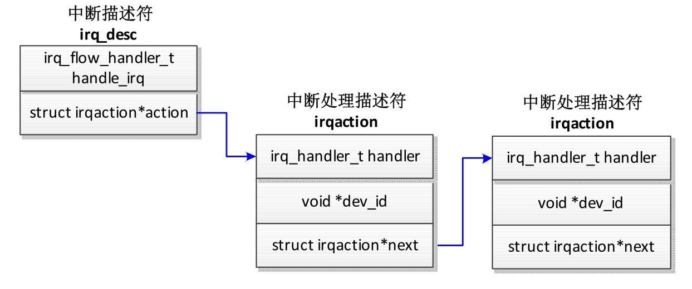
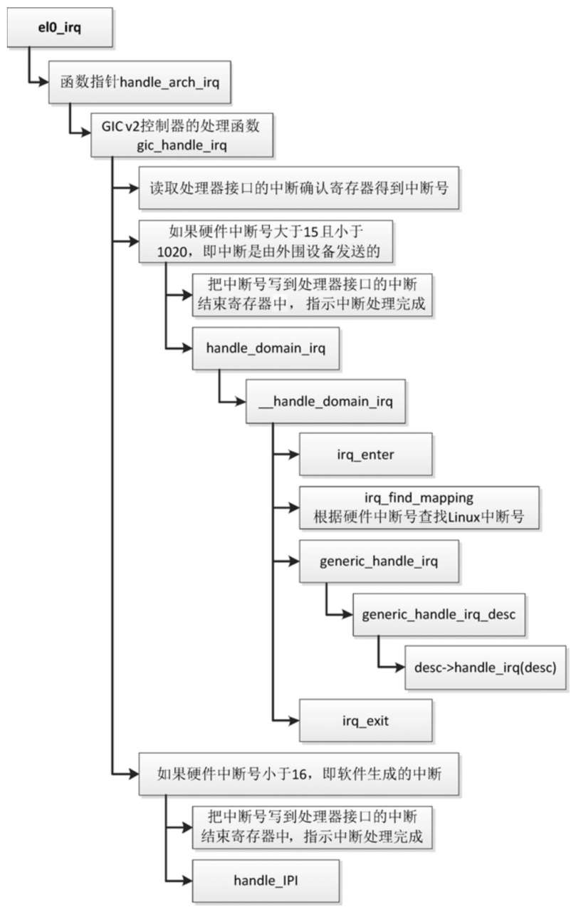

对于中断控制器的每个中断源, 向中断域添加硬件中断号到 Linux 中断号的映射时, 内核分配一个 Linux 中断号和一个中断描述符 irq_desc, 如图 4.5 所示, 中断描述符有两个层次的中断处理函数.

中断描述符:



(1) 第一层处理函数是中断描述符的成员 handle_irq().

(2) 第二层处理函数是设备驱动程序注册的处理函数. 中断描述符有一个中断处理链表 (irq_desc.action)​, 每个中断处理描述符 (irq_action) 保存设备驱动程序注册的处理函数. 因为多个设备可以共享同一个硬件中断号, 所以中断处理链表可能挂载多个中断处理描述符.

怎么存储 Linux 中断号到中断描述符的映射关系? 有两种实现方式.

(1) 如果中断编号是稀疏的 (即不连续)​, 那么使用基数树 (radix tree) 存储. 需要开启配置宏 CONFIG_SPARSE_IRQ.

(2) 如果中断编号是连续的, 那么使用数组存储.

```cpp
// kernel/irq/irqdesc.c
#ifdef CONFIG_SPARSE_IRQ
static RADIX_TREE(irq_desc_tree, GFP_KERNEL);
#else
struct irq_desc irq_desc[NR_IRQS] __cacheline_aligned_in_smp = {
        [0 ... NR_IRQS-1]  = {
            .handle_irq = handle_bad_irq,
            .depth      = 1,
            .lock       = __RAW_SPIN_LOCK_UNLOCKED(irq_desc->lock),
        }
};
#endif
```

ARM64 架构默认开启配置宏 CONFIG_SPARSE_IRQ, 使用基数树存储.

把硬件中断号映射到 Linux 中断号的时候, 根据硬件中断的类型设置中断描述符的成员 handle_irq(), 以 GIC v2 控制器为例, 函数 gic_irq_domain_map 所做的处理如下所示.

(1) 如果硬件中断号小于 32, 说明是软件生成的中断或私有外设中断, 那么把中断描述符的成员 handle_irq() 设置为函数 handle_percpu_devid_irq.

(2) 如果硬件中断号大于或等于 32, 说明是共享外设中断, 那么把中断描述符的成员 handle_irq() 设置为函数 handle_fasteoi_irq.

```cpp
irq_create_mapping() -> irq_domain_associate() -> domain->ops->map() -> gic_irq_
domain_map()
// drivers/irqchip/irq-gic.c
static int gic_irq_domain_map(struct irq_domain *d, unsigned int irq,
                        irq_hw_number_t hw)
{
        struct gic_chip_data *gic = d->host_data;
        if (hw < 32) {
            irq_set_percpu_devid(irq);
            irq_domain_set_info(d, irq, hw, &gic->chip, d->host_data,
                            handle_percpu_devid_irq, NULL, NULL);
            irq_set_status_flags(irq, IRQ_NOAUTOEN);
        } else {
            irq_domain_set_info(d, irq, hw, &gic->chip, d->host_data,
                            handle_fasteoi_irq, NULL, NULL);
            irq_set_probe(irq);
        }
        return 0;
}
```

设备驱动程序可以使用函数 request_irq() 注册中断处理函数:

```cpp
int request_irq(unsigned int irq, irq_handler_t handler, unsigned long flags, const char *name, void *dev);
```

(1) 参数 irq 是 Linux 中断号.

(2) 参数 handler 是处理函数.

(3) 参数 flags 是标志位, 可以是 0 或者以下标志位的组合.

* IRQF_SHARED: 允许多个设备共享同一个中断号.

* __IRQF_TIMER: 定时器中断.

* IRQF_PERCPU: 中断是每个处理器私有的.

* IRQF_NOBALANCING: 不允许该中断在处理器之间负载均衡.

* IRQF_NO_THREAD: 中断不能线程化.

(4) 参数 name 是设备名称.
(5) 参数 dev 是传给处理函数 (由参数 handler 指定) 的参数.

在 ARM64 架构下, 在异常级别 1 的异常向量表中, 中断的入口有 3 个.

(1) 如果处理器处在内核模式 (异常级别 1)​, 中断的入口是 el1_irq.

(2) 如果处理器正在用户模式 (异常级别 0) 下执行 64 位应用程序, 中断的入口是 el0_irq.

(3) 如果处理器正在用户模式 (异常级别 0) 下执行 32 位应用程序, 中断的入口是 el0_irq_compat.

假设处理器正在用户模式 (异常级别 0) 下执行 64 位应用程序, 中断控制器是 GIC v2 控制器, Linux 中断处理流程如图 4.6 所示.

Linux 中断处理流程:



(1) 读取处理器接口的中断确认寄存器得到中断号, 分发器里面的中断状态切换到 active.

(2) 如果硬件中断号大于 15 且小于 1020, 即中断是由外围设备发送的, 处理如下.

* 把中断号写到处理器接口的中断结束寄存器中, 指示中断处理完成, 分发器里面的中断状态从 active 切换到 inactive, 或者从 active and pending 切换到 pending.

* 调用函数 irq_enter(), 进入中断上下文.

* 调用函数 irq_find_mapping(), 根据硬件中断号查找 Linux 中断号.

* 调用中断描述符的成员 handle_irq().

* 调用函数 irq_exit(), 退出中断上下文.

(3) 如果硬件中断号小于 16, 即中断是由软件生成的, 处理如下.

* 把中断号写到处理器接口的中断结束寄存器中, 指示中断处理完成.

* 调用函数 handle_IPI() 进行处理.

函数 el0_irq 的代码如下:

```assembly
// arch/arm64/kernel/entry.S
1    .align   6
2   el0_irq:
3    kernel_entry 0
4   el0_irq_naked:
5    enable_dbg
6    …
7    irq_handler
8    …
9    b   ret_to_user
10  ENDPROC(el0_irq)
11
12   .macro   irq_handler
13   ldr_l   x1, handle_arch_irq
14   mov   x0, sp
15   irq_stack_entry
16   blr   x1
17   irq_stack_exit
18   .endm
```

第 3 行代码, 把进程的寄存器值保存到内核栈.

第 5 行代码, 开启调试异常.

第 7 行代码, irq_handler 是一个宏, 执行过程如下.

* 第 15 行代码, 从进程的内核栈切换到中断栈. 每个处理器有一个专用的中断栈:

```cpp
// arch/arm64/kernel/irq.c
DEFINE_PER_CPU(unsigned long [IRQ_STACK_SIZE/sizeof(long)], irq_stack) __aligned(16);
```

* 第 16 行代码, 调用函数指针 handle_arch_irq 指向的函数. 中断控制器在内核初始化的时候设置函数指针 handle_arch_irq, GIC v2 控制器把该函数指针设置为函数 gic_handle_irq.

* 第 17 行代码, 从中断栈切换到进程的内核栈.

第 9 行代码, 使用内核栈保存的寄存器值恢复进程的寄存器, 返回用户模式.

GIC v2 控制器的函数 gic_handle_irq 的代码如下:

```cpp
// drivers/irqchip/irq-gic.c
static void __exception_irq_entry gic_handle_irq(struct pt_regs *regs)
{
        u32 irqstat, irqnr;
        struct gic_chip_data *gic = &gic_data[0];
        void __iomem *cpu_base = gic_data_cpu_base(gic);
        do {
            irqstat = readl_relaxed(cpu_base + GIC_CPU_INTACK);
            irqnr = irqstat & GICC_IAR_INT_ID_MASK;
            if (likely(irqnr > 15 && irqnr < 1020)) {
                    if (static_key_true(&supports_deactivate))
                            writel_relaxed(irqstat, cpu_base + GIC_CPU_EOI);
                    handle_domain_irq(gic->domain, irqnr, regs);
                    continue;
            }
            if (irqnr < 16) {
                    writel_relaxed(irqstat, cpu_base + GIC_CPU_EOI);
                    if (static_key_true(&supports_deactivate))
                            writel_relaxed(irqstat, cpu_base + GIC_CPU_DEACTIVATE);
#ifdef CONFIG_SMP
                smp_rmb();
                handle_IPI(irqnr, regs);
#endif
                continue;
            }
            break;
        } while (1);
}
```

如果是私有外设中断, 那么中断描述符的成员 handle_irq() 是函数 handle_percpu_devid_irq, 其代码如下:

```cpp
// kernel/irq/chip.c
void handle_percpu_devid_irq(struct irq_desc *desc)
{
    struct irq_chip *chip = irq_desc_get_chip(desc);
    struct irqaction *action = desc->action;
    unsigned int irq = irq_desc_get_irq(desc);
    irqreturn_t res;
    …
    if (chip->irq_ack)
            chip->irq_ack(&desc->irq_data);
    if (likely(action)) {
            …
            res = action->handler(irq, raw_cpu_ptr(action->percpu_dev_id));
            …
    } else {
            …
    }
    if (chip->irq_eoi)
            chip->irq_eoi(&desc->irq_data);
}
```

如果是共享外设中断, 那么中断描述符的成员 handle_irq() 是函数 handle_fasteoi_irq, 其代码如下:

```cpp
// kernel/irq/chip.c
void handle_fasteoi_irq(struct irq_desc *desc)
{
    struct irq_chip *chip = desc->irq_data.chip;
    raw_spin_lock(&desc->lock);
    if (! irq_may_run(desc))
            goto out;
    desc->istate &= ～(IRQS_REPLAY | IRQS_WAITING);
    if (unlikely(! desc->action || irqd_irq_disabled(&desc->irq_data))) {
            desc->istate |= IRQS_PENDING;
            mask_irq(desc);
            goto out;
    }
    …
    if (desc->istate & IRQS_ONESHOT)
            mask_irq(desc);
    preflow_handler(desc);
    handle_irq_event(desc);
    cond_unmask_eoi_irq(desc, chip);
    raw_spin_unlock(&desc->lock);
    return;
out:
    if (! (chip->flags & IRQCHIP_EOI_IF_HANDLED))
            chip->irq_eoi(&desc->irq_data);
    raw_spin_unlock(&desc->lock);
}
```

调用函数 handle_irq_event, 执行设备驱动程序注册的处理函数.

函数 handle_irq_event 把主要工作委托给函数__handle_irq_event_percpu. 函数__handle_irq_event_percpu 遍历中断描述符的中断处理链表, 执行每个中断处理描述符的处理函数, 其代码如下:

```cpp
handle_irq_event()  ->  handle_irq_event_percpu()  ->  __handle_irq_event_percpu()
// kernel/irq/handle.c
irqreturn_t  __handle_irq_event_percpu(struct irq_desc *desc, unsigned int *flags)
{
        irqreturn_t retval = IRQ_NONE;
        unsigned int irq = desc->irq_data.irq;
        struct irqaction *action;
        for_each_action_of_desc(desc, action) {
            irqreturn_t res;
            …
            res = action->handler(irq, action->dev_id);
            …
            switch (res) {
            case IRQ_WAKE_THREAD:
                …
                __irq_wake_thread(desc, action);
                /* 继续往下走, 把 "action->flags" 作为生成随机数的一个因子 */
            case IRQ_HANDLED:
                *flags |= action->flags;
                break;
            default:
                break;
            }
            retval |= res;
        }
        return retval;
}
```
