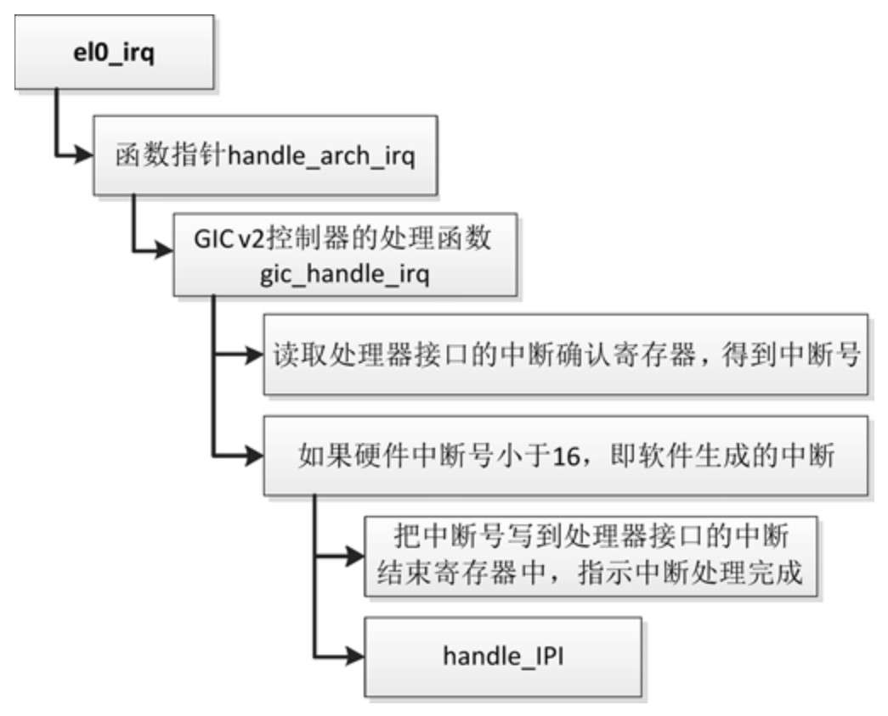

处理器间中断 (Inter-Processor Interrupt, IPI) 是一种特殊的中断, 在多处理器系统中, 一个处理器可以向其他处理器发送中断, 要求目标处理器执行某件事情.

常见的使用处理器间中断的函数如下.

(1) 在所有其他处理器上执行一个函数.

```cpp
int smp_call_function(smp_call_func_t func, void *info, int wait);
```

参数 func 是要执行的函数, 目标处理器在中断处理程序中执行该函数; 参数 info 是传给函数 func 的参数; 参数 wait 表示是否需要等待目标处理器执行完函数.

(2) 在指定的处理器上执行一个函数.

```cpp
int smp_call_function_single(int cpu, smp_call_func_t func, void *info, int wait);
```

(3) 要求指定的处理器重新调度进程.

```cpp
void smp_send_reschedule(int cpu);
```

对于 ARM64 架构的 GIC 控制器, 把处理器间中断称为软件生成的中断, 可以写分发器的寄存器 GICD_SGIR(软件生成中断寄存器, Software Generated Interrupt Register) 以生成处理器间中断.

假设处理器正在用户模式 (异常级别 0) 下执行 64 位应用程序, 中断控制器是 GIC v2 控制器, 处理处理器间中断的执行流程如图 4.7 所示.

处理处理器间中断:



函数 handle_IPI 负责处理处理器间中断, 参数 ipinr 是硬件中断号, 其代码如下:

```cpp
// arch/arm64/kernel/smp.c
void handle_IPI(int ipinr, struct pt_regs *regs)
{
    unsigned int cpu = smp_processor_id();
    struct pt_regs *old_regs = set_irq_regs(regs);
    …
    switch (ipinr) {
    case IPI_RESCHEDULE:
        scheduler_ipi();
        break;
    case IPI_CALL_FUNC:
        irq_enter();
        generic_smp_call_function_interrupt();
        irq_exit();
        break;
    case IPI_CPU_STOP:
        irq_enter();
        ipi_cpu_stop(cpu);
        irq_exit();
        break;
    case IPI_CPU_CRASH_STOP:
        if (IS_ENABLED(CONFIG_KEXEC_CORE)) {
            irq_enter();
            ipi_cpu_crash_stop(cpu, regs);
            unreachable();
        }
        break;
#ifdef CONFIG_GENERIC_CLOCKEVENTS_BROADCAST
    case IPI_TIMER:
        irq_enter();
        tick_receive_broadcast();
        irq_exit();
        break;
#endif
#ifdef CONFIG_IRQ_WORK
    case IPI_IRQ_WORK:
        irq_enter();
        irq_work_run();
        irq_exit();
        break;
#endif
#ifdef CONFIG_ARM64_ACPI_PARKING_PROTOCOL
    case IPI_WAKEUP:
        WARN_ONCE(! acpi_parking_protocol_valid(cpu),
            "CPU%u: Wake-up IPI outside the ACPI parking protocol\n",
            cpu);
        break;
#endif
    default:
        pr_crit("CPU%u: Unknown IPI message 0x%x\n", cpu, ipinr);
        break;
    }
    …
    set_irq_regs(old_regs);
}
```

目前支持 7 种处理器间中断.

(1) `IPI_RESCHEDULE`: 硬件中断号是 0, 重新调度进程, 函数 `smp_send_reschedule()` 生成的中断.

(2) `IPI_CALL_FUNC`: 硬件中断号是 1, 执行函数, 函数 `smp_call_function()` 生成的中断.

(3) `IPI_CPU_STOP`: 硬件中断号是 2, 使处理器停止, 函数 `smp_send_stop()` 生成的中断.

(4) `IPI_CPU_CRASH_STOP`: 硬件中断号是 3, 使处理器停止, 函数 `smp_send_crash_stop()` 生成的中断.

(5) `IPI_TIMER`: 硬件中断号是 4, 广播的时钟事件, 函数 `tick_broadcast()` 生成的中断.

(6) `IPI_IRQ_WORK`: 硬件中断号是 5, 在硬中断上下文中执行回调函数, 函数 `irq_work_queue()` 生成的中断.

(7) `IPI_WAKEUP`: 硬件中断号是 6, 唤醒处理器, 函数 `acpi_parking_protocol_cpu_boot()` 生成的中断.

