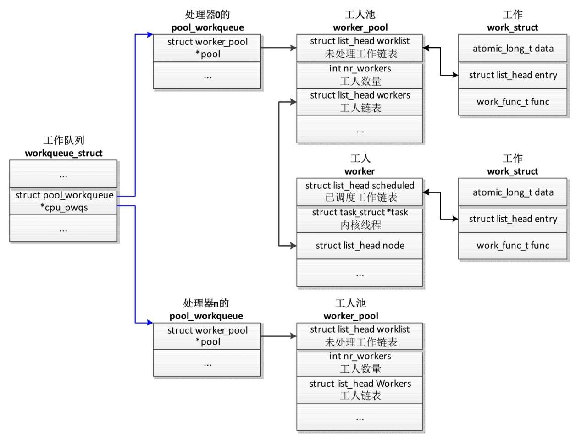
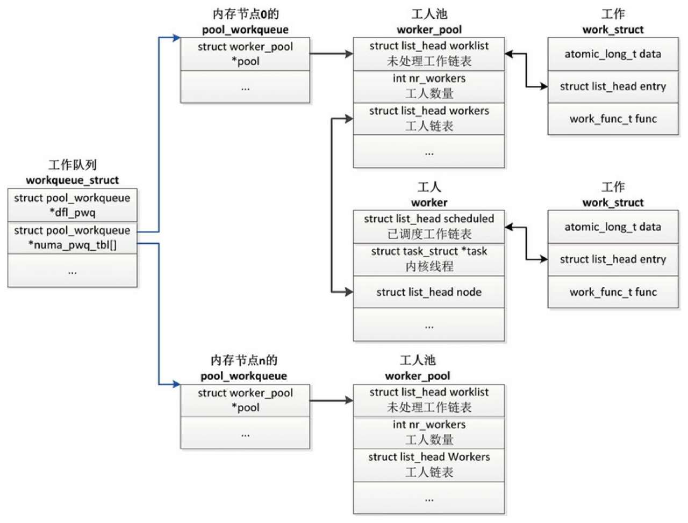

工作队列 (work queue) 是使用内核线程异步执行函数的通用机制.

工作队列是中断处理程序的一种下半部机制, 中断处理程序可以把耗时比较长并且可能睡眠的函数交给工作队列执行.

工作队列不完全是中断处理程序的下半部. 内核的很多模块需要异步执行函数, 这些模块可以创建一个内核线程来异步执行函数. 但是, 如果每个模块都创建自己的内核线程, 会造成内核线程的数量过多, 内存消耗比较大, 影响系统性能. 所以, 最好的方法是提供一种通用机制, 让这些模块把需要异步执行的函数交给工作队列执行, 共享内核线程, 节省资源.

# 编程接口

内核使用工作项保存需要异步执行的函数, 工作项的数据类型是 work_struct, 需要异步执行的函数的原型如下所示:

```cpp
typedef void(*work_func_t)(struct work_struct *work);
```

有一类工作项称为延迟工作项, 数据类型是 delayed_work. 把延迟工作项添加到工作队列中的时候, 延迟一段时间才会真正地把工作项添加到工作队列中. 延迟工作项是工作项和定时器的结合, 可以避免使用者自己创建定时器.

我们可以使用内核定义的工作队列, 也可以自己创建专用的工作队列. 内核定义了以下工作队列:

```cpp
// include/linux/workqueue.h
extern struct workqueue_struct *system_wq;
extern struct workqueue_struct *system_highpri_wq;
extern struct workqueue_struct *system_long_wq;
extern struct workqueue_struct *system_unbound_wq;
extern struct workqueue_struct *system_freezable_wq;
extern struct workqueue_struct *system_power_efficient_wq;
extern struct workqueue_struct *system_freezable_power_efficient_wq;
```

system_wq: 如果工作项的执行时间比较短, 应该使用这个工作队列. 早期的内核版本只提供了这个工作队列, 称为全局工作队列, 函数 schedule_work()和 schedule_delayed_work()使用这个工作队列.

system_highpri_wq: 高优先级的工作队列.

system_long_wq: 如果工作项的执行时间比较长, 应该使用这个工作队列.

system_unbound_wq: 这个工作队列使用的内核线程不绑定到某个特定的处理器.

system_freezable_wq: 这个工作队列可以冻结.

system_power_efficient_wq: 如果开启了工作队列模块的参数 "wq_power_efficient"​, 那么这个工作队列倾向于省电; 否则和 system_wq 相同.

system_freezable_power_efficient_wq: 这个工作队列和 system_power_efficient_wq 的区别是可以冻结.

(1)定义工作项.

定义一个静态的工作项, 参数 n 是变量名称, 参数 f 是工作项的处理函数.

```cpp
DECLARE_WORK(n, f)
```

定义一个静态的延迟工作项, 参数 n 是变量名称, 参数 f 是工作项的处理函数.

```cpp
DECLARE_DELAYED_WORK(n, f)
```

使用 DECLARE_DEFERRABLE_WORK(n, f)也可以定义一个静态的延迟工作项, 和 DECLARE_DELAYED_WORK()的区别是它使用可推迟的定时器(deferrable timer)​.

可推迟的定时器在系统忙的时候工作正常, 但是在处理器空闲的时候不会处理可推迟的定时器. 当一个不可推迟的定时器唤醒处理器的时候, 才会处理可推迟的定时器.

在运行时动态初始化工作项, 方法如下.

1)INIT_WORK(_work, _func): 初始化一个工作项, 参数_work 是工作项的地址, 参数_func 是需要异步执行的函数.

2)INIT_WORK_ONSTACK(_work, _func): 初始化一个工作项, 工作项是栈里面的局部变量, 参数_work 是工作项的地址, 参数_func 是需要异步执行的函数.

3)INIT_DELAYED_WORK(_work, _func): 初始化一个延迟工作项, 参数_work 是延迟工作项的地址, 参数_func 是需要异步执行的函数.

4)INIT_DELAYED_WORK_ONSTACK(_work, _func): 初始化一个延迟工作项, 延迟工作项是栈里面的局部变量, 参数_work 是延迟工作项的地址, 参数_func 是需要异步执行的函数.

5)INIT_DEFERRABLE_WORK(_work, _func): 初始化一个延迟工作项, 和 INIT_DELAYED_WORK()的区别是它使用可推迟的定时器.

6)INIT_DEFERRABLE_WORK_ONSTACK(_work, _func): 初始化一个延迟工作项, 延迟工作项是栈里面的局部变量, 和 INIT_DELAYED_WORK_ONSTACK()的区别是它使用可推迟的定时器.

(2)全局工作队列.

在全局工作队列中添加一个工作项.

```cpp
bool schedule_work(struct work_struct *work);
```

在全局工作队列中添加一个工作项, 并且指定执行工作项的处理器.

```cpp
bool schedule_work_on(int cpu, struct work_struct *work);
```

在全局工作队列中添加一个延迟工作项, 参数 delay 是把工作项添加到工作队列中之前等待的时间, 单位是嘀嗒(tick)​.

```cpp
bool schedule_delayed_work(struct delayed_work *dwork, unsigned long delay);
```

在全局工作队列中添加一个延迟工作项, 并且指定执行工作项的处理器.

```cpp
bool schedule_delayed_work_on(int cpu, struct delayed_work *dwork,
                        unsigned long delay);
```

冲刷全局工作队列, 确保全局工作队列中的所有工作项执行完.

```cpp
void flush_scheduled_work(void);
```

(3)专用工作队列. 分配工作队列的函数是:

```cpp
alloc_workqueue(fmt, flags, max_active, args...)
```

1)参数 fmt 是工作队列名称的格式.

2)参数 flags 是标志位, 可以是 0, 也可以是下面这些标志位的组合.

* WQ_UNBOUND: 处理工作项的内核线程不绑定到任何特定的处理器.

* WQ_FREEZABLE: 在系统挂起的时候冻结.

* WQ_MEM_RECLAIM: 在内存回收的时候可能使用这个工作队列.

* WQ_HIGHPRI: 高优先级.

* WQ_CPU_INTENSIVE: 处理器密集型.

* WQ_POWER_EFFICIENT: 省电.

3)参数 max_active 是每个处理器可以同时执行的工作项的最大数量, 0 表示使用默认值.

4)参数 args 是传给参数 fmt 的参数.

下面的函数用来分配一个有序的工作队列. 有序的工作队列在任何时刻, 按照入队的顺序只执行一个工作项.

```cpp
alloc_ordered_workqueue(fmt, flags, args...)
```

旧版本的创建工作队列的函数 create_workqueue(),create_freezable_workqueue()和 create_singlethread_workqueue()已经被废弃.

在指定的工作队列中添加一个工作项.

```cpp
bool queue_work(struct workqueue_struct *wq, struct work_struct *work);
```

在指定的工作队列中添加一个工作项, 并且指定执行工作项的处理器.

```cpp
bool queue_work(struct workqueue_struct *wq, struct work_struct *work);
```

在指定的工作队列中添加一个延迟工作项, 参数 delay 是把工作项添加到工作队列中之前等待的时间, 单位是嘀嗒(tick)​.

```cpp
bool queue_delayed_work(struct workqueue_struct *wq, struct delayed_work *dwork, unsigned long delay);
```

在指定的工作队列中添加一个延迟工作项, 并且指定执行工作项的处理器.

```cpp
bool queue_delayed_work_on(int cpu, struct workqueue_struct *wq,
            struct delayed_work *work, unsigned long delay);
```

冲刷工作队列, 确保工作队列中的所有工作项执行完.

```cpp
void flush_workqueue(struct workqueue_struct *wq);
```

销毁工作队列的函数是:

```cpp
void destroy_workqueue(struct workqueue_struct *wq);
```

(4)其他编程接口.

取消一个工作项.

```cpp
bool cancel_work(struct work_struct *work);
```

取消一个工作项, 并且等待取消操作执行完.

```cpp
bool cancel_work_sync(struct work_struct *work);
```

取消一个延迟工作项.

```cpp
bool cancel_delayed_work(struct delayed_work *dwork);
```

取消一个延迟工作项, 并且等待取消操作执行完.

```cpp
bool cancel_delayed_work_sync(struct delayed_work *dwork);
```

等待一个工作项执行完.

```cpp
bool flush_work(struct work_struct *work);
```

等待一个延迟工作项执行完.

```cpp
bool flush_delayed_work(struct delayed_work *dwork);
```

# 技术原理

首先介绍一下工作队列使用的术语.

* work: 工作, 也称为工作项.

* work queue: 工作队列, 就是工作的集合, work queue 和 work 是一对多的关系.

* worker: 工人, 一个工人对应一个内核线程, 我们把工人对应的内核线程称为工人线程.

* worker_pool: 工人池, 就是工人的集合, 工人池和工人是一对多的关系.

* pool_workqueue: 中介, 负责建立工作队列和工人池之间的关系. 工作队列和 pool_workqueue 是一对多的关系, pool_workqueue 和工人池是一对一的关系.

(1)数据结构.

工作队列分为两种.

1)绑定处理器的工作队列: 默认创建绑定处理器的工作队列, 每个工人线程绑定到一个处理器.

2)不绑定处理器的工作队列: 创建工作队列的时候需要指定标志位 WQ_UNBOUND, 工人线程不绑定到某个处理器, 可以在处理器之间迁移.

绑定处理器的工作队列的数据结构如图 4.9 所示, 工作队列在每个处理器上有一个 pool_workqueue 实例, 一个 pool_workqueue 实例对应一个工人池, 一个工人池有一条工人链表, 每个工人对应一个内核线程. 向工作队列中添加工作项的时候, 选择当前处理器的 pool_workqueue 实例, 工人池和工人线程.

绑定处理器的工作队列:



不绑定处理器的工作队列的数据结构如图 4.10 所示, 工作队列在每个内存节点上有一个 pool_workqueue 实例, 一个 pool_workqueue 实例对应一个工人池, 一个工人池有一条工人链表, 每个工人对应一个内核线程. 向工作队列中添加工作项的时候, 选择当前处理器所属的内存节点的 pool_workqueue 实例, 工人池和工人线程.

不绑定处理器的工作队列:



不绑定处理器的工作队列还有一个默认的 pool_workqueue 实例(workqueue_struct.dfl_pwq)​, 当某个处理器下线的时候, 使用默认的 pool_workqueue 实例.

工作项负责保存需要异步执行的函数, 数据类型是 work_struct, 其定义如下:

```cpp
// include/linux/workqueue.h
struct work_struct {
    atomic_long_t data;
    struct list_head entry;
    work_func_t func;
};
```

成员 func 是需要异步执行的函数, 成员 data 是传给函数 func 的参数.

成员 entry 用来把工作项添加到链表中.

延迟工作项是工作项和定时器的结合, 数据类型是 delayed_work. 把延迟工作项添加到工作队列中的时候, 延迟一段时间才会真正地把工作项添加到工作队列中.

```cpp
// include/linux/workqueue.h
struct delayed_work {
    struct work_struct work;
    struct timer_list timer;
    /* 定时器把工作项添加到工作队列时, 需要知道目标工作队列和处理器 */
    struct workqueue_struct *wq;
    int cpu;
};
```

(2)添加工作项.

函数 queue_work()用来向工作队列中添加一个工作项, 把主要工作委托给函数 queue_work_on(), 把第一个参数 "int cpu" 设置为 WORK_CPU_UNBOUND, 意思是不绑定到任何处理器, 优先选择当前处理器.

```cpp
// include/linux/workqueue.h
static inline bool queue_work(struct workqueue_struct *wq,
                        struct work_struct *work)
{
    return queue_work_on(WORK_CPU_UNBOUND, wq, work);
}
```

函数 queue_work_on 的代码如下:

```cpp
//kernel/workqueue.c
bool queue_work_on(int cpu, struct workqueue_struct *wq,
            struct work_struct *work)
{
        bool ret = false;
        unsigned long flags;
        local_irq_save(flags);
        if (! test_and_set_bit(WORK_STRUCT_PENDING_BIT, work_data_bits(work))) {
            __queue_work(cpu, wq, work);
            ret = true;
        }
        local_irq_restore(flags);
        return ret;
}
```

如果工作项没有添加过, 那么给工作项设置标志位 WORK_STRUCT_PENDING_BIT, 然后把主要工作委托给函数__queue_work().

函数__queue_work 的代码如下:

```cpp
// kernel/workqueue.c
1   static void __queue_work(int cpu, struct workqueue_struct *wq,
2                struct work_struct *work)
3   {
4    struct pool_workqueue *pwq;
5    struct worker_pool *last_pool;
6    struct list_head *worklist;
7    unsigned int work_flags;
8    unsigned int req_cpu = cpu;
9
10   …
11  retry:
12   if (req_cpu == WORK_CPU_UNBOUND)
13        cpu = wq_select_unbound_cpu(raw_smp_processor_id());
14
15   if (! (wq->flags & WQ_UNBOUND))
16        pwq = per_cpu_ptr(wq->cpu_pwqs, cpu);
17   else
18        pwq = unbound_pwq_by_node(wq, cpu_to_node(cpu));
19
20   last_pool = get_work_pool(work);
21   if (last_pool && last_pool ! = pwq->pool) {
22        struct worker *worker;
23
24        spin_lock(&last_pool->lock);
25
26        worker = find_worker_executing_work(last_pool, work);
27
28        if (worker && worker->current_pwq->wq == wq) {
29              pwq = worker->current_pwq;
30        } else {
31              spin_unlock(&last_pool->lock);
32              spin_lock(&pwq->pool->lock);
33        }
34   } else {
35        spin_lock(&pwq->pool->lock);
36   }
37
38   …
39   if (WARN_ON(! list_empty(&work->entry))) {
40        spin_unlock(&pwq->pool->lock);
41        return;
42   }
43
44   pwq->nr_in_flight[pwq->work_color]++;
45   work_flags = work_color_to_flags(pwq->work_color);
46
47   if (likely(pwq->nr_active < pwq->max_active)) {
48        …
49        pwq->nr_active++;
50        worklist = &pwq->pool->worklist;
51        if (list_empty(worklist))
52              pwq->pool->watchdog_ts = jiffies;
53   } else {
54        work_flags |= WORK_STRUCT_DELAYED;
55        worklist = &pwq->delayed_works;
56   }
57
58   insert_work(pwq, work, worklist, work_flags);
59
60   spin_unlock(&pwq->pool->lock);
61  }
```

第 15～18 行代码, 从工作队列中选择 pool_workqueue 实例. 如果是绑定处理器的工作队列, 那么选择当前处理器的 pool_workqueue 实例; 如果是不绑定处理器的工作队列, 那么选择当前处理器所属的内存节点的 pool_workqueue 实例.

第 21～33 行代码, 如果工作正在被其他 pool_workqueue 实例的工人执行, 那么还是把工作添加到那个 pool_workqueue 实例.

第 47～56 行代码, 如果 pool_workqueue 实例的未处理工作数量小于限制, 那么把工作添加到 pool_workqueue 实例对应的工人池的链表 worklist 中; 如果 pool_workqueue 实例的未处理工作数量达到限制, 那么给工作设置标志位 WORK_STRUCT_DELAYED, 并且把工作添加到 pool_workqueue 实例的链表 delayed_works 中.

第 58 行代码, 把工作添加到第 47～56 行代码选择的链表中.

(3)工人处理工作.

每个工人对应一个内核线程, 一个工人池对应一个或多个工人. 多个工人从工人池的未处理工作链表 (worker_pool.worklist) 中取工作并处理.

工人线程的处理函数是 worker_thread(), 调用函数 process_one_work()处理一个工作项.

函数 worker_thread()的代码如下:

```cpp
// kernel/workqueue.c
1   static int worker_thread(void *__worker)
2   {
3    struct worker *worker = __worker;
4    struct worker_pool *pool = worker->pool;
5
6    /* 告诉进程调度器这是一个工作队列的工人线程 */
7    worker->task->flags |= PF_WQ_WORKER;
8    woke_up:
9     spin_lock_irq(&pool->lock);
10
11    /* 我应该消亡吗?*/
12    if (unlikely(worker->flags & WORKER_DIE)) {
13         spin_unlock_irq(&pool->lock);
14         worker->task->flags &= ～PF_WQ_WORKER;
15
16         set_task_comm(worker->task, "kworker/dying");
17         ida_simple_remove(&pool->worker_ida, worker->id);
18         worker_detach_from_pool(worker, pool);
19         kfree(worker);
20         return 0;
21    }
22
23    worker_leave_idle(worker);
24   recheck:
25    if (! need_more_worker(pool))
26         goto sleep;
27
28    if (unlikely(! may_start_working(pool)) && manage_workers(worker))
29         goto recheck;
30
31    …
32    worker_clr_flags(worker, WORKER_PREP | WORKER_REBOUND);
33
34    do {
35         struct work_struct *work =
36               list_first_entry(&pool->worklist,
37                          struct work_struct, entry);
38
39         pool->watchdog_ts = jiffies;
40
41         if (likely(! (*work_data_bits(work) & WORK_STRUCT_LINKED))) {
42               /* 优化的路径, 严格地说不是必要的 */
43               process_one_work(worker, work);
44               if (unlikely(! list_empty(&worker->scheduled)))
45                    process_scheduled_works(worker);
46         } else {
47               move_linked_works(work, &worker->scheduled, NULL);
48               process_scheduled_works(worker);
49         }
50    } while (keep_working(pool));
51
52    worker_set_flags(worker, WORKER_PREP);
53   sleep:
54    worker_enter_idle(worker);
55    __set_current_state(TASK_INTERRUPTIBLE);
56    spin_unlock_irq(&pool->lock);
57    schedule();
58    goto woke_up;
59   }
```

第 12～21 行代码, 如果工人太多, 想要减少工人的数量, 那么当前工人线程退出.

第 23 行代码, 工人退出空闲状态.

第 25 行和第 26 行代码, 如果不需要本工人执行工作, 那么本工人进入空闲状态.

第 28 行代码, 如果工人池中没有空闲的工人, 那么创建一些工人备用.

第 35～37 行代码, 从工人池的链表 worklist 中取一个工作.

第 41～45 行代码, 如果是正常工作, 那么调用函数 process_one_work()执行正常工作, 然后执行工人的链表 scheduled 中的特殊工作.

第 46～48 行代码, 如果是特殊工作, 那么首先把工作添加到工人的链表 scheduled 的尾部, 然后执行工人的链表 scheduled 中的特殊工作.

第 50 行代码, 如果有工作需要处理, 并且处于运行状态的工人数量不超过 1, 那么本工人继续执行工作.

第 54～57 行代码, 工人进入空闲状态, 睡眠.

下面解释一下正常工作和特殊工作.

向工作队列中添加正常工作, 是直接添加到工人池的链表 worklist 中.

调用函数 flush_work(t)等待工作 t 执行完, 实现方法是添加一个特殊工作: 屏障工作, 执行这个屏障工作的时候就可以确定工作 t 执行完. 如果工作 t 正在被工人 p 执行, 那么把屏障工作直接添加到工人 p 的链表 scheduled 中; 如果工作 t 没有执行, 那么把屏障工作添加到工人池的链表 worklist 中, 并且给屏障工作设置标志位 WORK_STRUCT_LINKED.

函数 process_one_work()负责处理一个工作, 其代码如下:

```cpp
// kernel/workqueue.c
1   static void process_one_work(struct worker *worker, struct work_struct *work)
2   {
3    struct pool_workqueue *pwq = get_work_pwq(work);
4    struct worker_pool *pool = worker->pool;
5    bool cpu_intensive = pwq->wq->flags & WQ_CPU_INTENSIVE;
6    int work_color;
7    struct worker *collision;
8
9    …
10   collision = find_worker_executing_work(pool, work);
11   if (unlikely(collision)) {
12        move_linked_works(work, &collision->scheduled, NULL);
13        return;
14   }
15
16   …
17   hash_add(pool->busy_hash, &worker->hentry, (unsigned long)work);
18   worker->current_work = work;
19   worker->current_func = work->func;
20   worker->current_pwq = pwq;
21   work_color = get_work_color(work);
22
23   list_del_init(&work->entry);
24
25   if (unlikely(cpu_intensive))
26        worker_set_flags(worker, WORKER_CPU_INTENSIVE);
27
28   if (need_more_worker(pool))
29        wake_up_worker(pool);
30
31   set_work_pool_and_clear_pending(work, pool->id);
32
33   spin_unlock_irq(&pool->lock);
34
35   …
36   worker->current_func(work);
37   …
38
39   cond_resched_rcu_qs();
40
41   spin_lock_irq(&pool->lock);
42
43   /* 清除处理器密集状态 */
44   if (unlikely(cpu_intensive))
45        worker_clr_flags(worker, WORKER_CPU_INTENSIVE);
46
47   /* 处理完工作项, 释放 */
48   hash_del(&worker->hentry);
49   worker->current_work = NULL;
50   worker->current_func = NULL;
51   worker->current_pwq = NULL;
52   worker->desc_valid = false;
53   pwq_dec_nr_in_flight(pwq, work_color);
54  }
```

第 10～14 行代码, 一个工作不应该被多个工人并发执行. 如果一个工作正在被工人池的其他工人执行, 那么把这个工作添加到这个工人的链表 scheduled 中延后执行.

第 17 行代码, 把工人添加到工人池的散列表 busy_hash 中.

第 18～20 行代码, 工人的成员 current_work 指向当前工作, 成员 current_func 指向当前工作的处理函数, 成员 current_pwq 指向当前 pool_workqueue 实例.

第 25 行和第 26 行代码, 如果工作队列是处理器密集型的, 那么给工人设置标志位 WORKER_CPU_INTENSIVE, 工人不再被工人池动态调度.

第 28 行和第 29 行代码, 对于不绑定处理器或处理器密集型的工作队列, 唤醒更多空闲的工人处理工作.

第 36 行代码, 执行工作的处理函数.

(4)工人池动态管理工人.

工人池可以动态增加和删除工人, 算法如下.

1)工人有 3 种状态: 空闲 (idle)​, 运行(running) 和挂起(suspend)​. 空闲是指没有执行工作, 运行是指正在执行工作, 挂起是指在执行工作的过程中睡眠.

2)如果工人池中有工作需要处理, 至少保持一个处在运行状态的工人来处理.

3)如果处在运行状态的工人在执行工作的过程中进入挂起状态, 为了保证其他工作的执行, 需要唤醒空闲的工人处理工作.

4)如果有工作需要执行, 并且处在运行状态的工人数量大于 1, 会让多余的工人进入空闲状态.

5)如果没有工作需要执行, 会让所有工人进入空闲状态.

6)如果创建的工人过多, 工人池把空闲时间超过 300 秒 (IDLE_WORKER_TIMEOUT) 的工人删除.

为了跟踪工人的运行和挂起状态, 动态调整工人的数量, 工作队列使用在进程调度中加钩子函数的技巧.

1)跟踪工人从挂起进入运行状态. 唤醒工人线程的时候, 如果工人线程正在执行工作的过程中, 那么把工人池中处在运行状态的工人计数 (nr_running) 加 1. 相关代码如下:

```cpp
try_to_wake_up() -> ttwu_queue() -> ttwu_do_activate() -> ttwu_activate() -> wq_wor
ker_waking_up()
// kernel/workqueue.c
void wq_worker_waking_up(struct task_struct *task, int cpu)
{
    struct worker *worker = kthread_data(task);
    if (! (worker->flags & WORKER_NOT_RUNNING)) {
        WARN_ON_ONCE(worker->pool->cpu ! = cpu);
        atomic_inc(&worker->pool->nr_running);
    }
}
```

2)跟踪工人从运行进入挂起状态. 当一个工人睡眠的时候, 如果工人池没有工人处于运行状态, 并且工人池有工作需要执行, 那么唤醒一个空闲的工人. 相关代码如下:

```cpp
__schedule() -> wq_worker_sleeping()
// kernel/workqueue.c
struct task_struct *wq_worker_sleeping(struct task_struct *task)
{
        struct worker *worker = kthread_data(task), *to_wakeup = NULL;
        struct worker_pool *pool;
        if (worker->flags & WORKER_NOT_RUNNING)
            return NULL;
        pool = worker->pool;
        if (WARN_ON_ONCE(pool->cpu ! = raw_smp_processor_id()))
            return NULL;
        if (atomic_dec_and_test(&pool->nr_running) &&
            !list_empty(&pool->worklist))
            to_wakeup = first_idle_worker(pool);
        return to_wakeup ? to_wakeup->task : NULL;
}
```

工人池的调度思想是如果有工作需要处理, 保持一个处在运行状态的工人来处理, 不多也不少.

这种做法有个问题: 如果工作是处理器密集型的, 虽然工人没有进入挂起状态, 但是会长时间占用处理器, 让后续的工作阻塞太长时间.

为了解决这个问题, 可以在创建工作队列的时候设置标志位 WQ_CPU_INTENSIVE, 声明工作队列是处理器密集的. 当一个工人执行工作的时候, 让这个工人不受工人池动态调度, 像是进入了挂起状态, 工人池创建新的工人来执行后续的工作.

工人线程对处理器密集的特殊处理如下:

```cpp
// worker_thread() -> process_one_work()
// kernel/workqueue.c
static void process_one_work(struct worker *worker, struct work_struct *work)
{
        …
        bool cpu_intensive = pwq->wq->flags & WQ_CPU_INTENSIVE;
        …
        if (unlikely(cpu_intensive))
            worker_set_flags(worker, WORKER_CPU_INTENSIVE);
        if (need_more_worker(pool))
            wake_up_worker(pool);
        …
        worker->current_func(work);
        …
        if (unlikely(cpu_intensive))
            worker_clr_flags(worker, WORKER_CPU_INTENSIVE);
        …
}
enum {
        …
        WORKER_NOT_RUNNING= WORKER_PREP | WORKER_CPU_INTENSIVE |
                    WORKER_UNBOUND | WORKER_REBOUND,
        …
};
static inline void worker_set_flags(struct worker *worker, unsigned int flags)
{
        struct worker_pool *pool = worker->pool;
        if ((flags & WORKER_NOT_RUNNING) &&
            !(worker->flags & WORKER_NOT_RUNNING)) {
            atomic_dec(&pool->nr_running);
        }
        worker->flags |= flags;
}
static inline void worker_clr_flags(struct worker *worker, unsigned int flags)
{
        struct worker_pool *pool = worker->pool;
        unsigned int oflags = worker->flags;
        worker->flags &= ～flags;
        if ((flags & WORKER_NOT_RUNNING) && (oflags & WORKER_NOT_RUNNING))
            if (! (worker->flags & WORKER_NOT_RUNNING))
                    atomic_inc(&pool->nr_running);
}
```

可以看到, 给工人设置标志位 WORKER_CPU_INTENSIVE 的时候, 把工人池的计数 nr_running 减 1, 相当于工人进入挂起状态.
