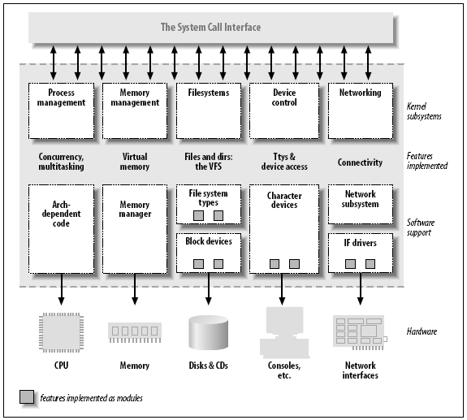

Linux 内核是由大量而且复杂的代码组成, 但是希望成为内核黑客的人需要一个入口, 通过这个入口人们就能方便参与到 Linux 内核开发而不会被内核代码的复杂性淹没. 通常, 设备驱动程序就是这个进入 Linux 内核世界的大门.

设备驱动程序在 Linux 内核扮演特殊角色. 它们是一个个独立的 "黑盒子". 使某个特定硬件响应一个定义良好的内部编程接口, 这些接口完全隐藏了设备的工作细节. 将这些调用映射到作用于实际硬件的设备特有操作上, 就是设备驱动程序的任务.

#### 设备驱动程序的作用

- 设备驱动程序的作用在于提供机制, 而不是策略.
- 区分机制和策略是 Unix 设计背后隐含的最好思想之一. 大多数编程问题都可以分为两部分: "需要提供什么功能(机制)" 和 "如何使用这些功能(策略)". 如果这个问题由程序的不同部分来处理, 甚至由不同程序处理, 这个软件更易开发及维护.
- 驱动程序设计主要考虑三个方面因素: 提供给用户尽量多的选项, 编写驱动程序所要占用的时间以及尽量保持程序简单.

---

#### 内核功能划分

如上图所示, 内核功能分为如下部分:

** 进程管理 **

负责创建和销毁进程, 并处理他们和外部世界之间的连接 (输入输出). 不同进程之间的通信(通过信号, 管道或进程间通信原语) 是整个系统的基本功能. 因此也由内核处理. 控制进程如何共享 CPU 的调度器也是进程管理一部分. 总之, 内核进程管理活动就是在单个或多个 CPU 上实现了多个进程的抽象.

** 内存管理 **

内存在有限的可用资源上为每个进程都创建了一个虚拟地址空间.

** 文件系统 **

内核在没有结构的硬件上构造结构化的文件系统, 而文件抽象在整个文件系统中广泛使用.

** 设备控制 **

几乎每个系统都最终映射在物理设备之上.

** 网络功能 **

系统负责在应用程序和网络接口之间传递数据包, 并根据网络活动控制程序的执行. 另外所有的路由和地址解析都由内核处理.

#### 可装载模块

- 内核提供的特性可在运行时扩展. 意味着, 当系统运行时, 我们可以向内核添加 / 移除功能
- 可在运行时添加到内核中的代码被称为 "模块". 每个模块由目标代码组成(没有连接成一个完整的可执行程序), 使用 insmod 程序将模块连接到正在运行的内核, 也可使用 rmmod 程序移除连接.
- 上面图中只是一些重要的模块类, 远不是完全的模块类. Linux 中越来越多的功能正被模块化.

#### 设备和模块的分类

- Linux 系统将设备分为三种基本类型, 每个模块通常实现为其中某个类: 字符模块, 块模块或网络模块.

** 字符设备 **

字符 (char) 设备是能够像字节流 (类似文件) 一样被访问的设备, 由字符设备驱动程序来实现这种特性. 字符设备驱动程序通常最少要实现 open,close,read 和 write 系统调用. 字符终端 (/dev/console) 和串口 (/dev/ttys0 以及类似设备) 就是两个字符设备. 字符设备可以通过文件系统节点来访问, 比如 / dev/tty1 和 / dev/lp0 等. 设备文件和普通文件区别在于对普通文件的访问可以前后移动访问位置, 而大多数字符设备是一个只能顺序访问的数据通道. 也存在具有数据区特性的字符设备, 访问他们可前后移动访问位置.

** 块设备 **

和字符设备类似, 块设备也是通过 / dev 目录下的文件系统节点来访问. 块设备 (例如磁盘) 上能够容纳文件系统. 多数 Unix 系统, 进行 I/O 操作时块设备每只能传输一个或多个完整的块, 而每块包含 512 块字节(或 2 的更高次幂字节的数据). 块设备和字符设备的区别在于内核内部管理数据的方式.

** 网络接口 **

网络接口由内核中的网络子系统驱动, 负责发送和接收数据包, 它不需要了解每项事务如何映射到实际传送的数据包. 许多网络连接 (尤其是使用 TCP 协议的连接) 是面向流的, 但是网络设备却围绕数据包的传输和接收而设计. 网络驱动程序不需要知道各个连接的相关信息, 它只需要处理数据包而已.

由于不是面向流的设备, 因此将网络接口映射到文件系统中的节点 (比如 / dev/tty1) 比较困难. Unix 访问网络接口的方法仍然是给他们分配一个唯一的名字(eth0), 但这个名字在文件系统中不存在对应的节点. 内核和网络设备驱动程序间的通信, 完全不同于内核和字符以及块驱动程序之间的通信, 内核调用一套和数据包传输相关的函数而不是 read,write 等.

- 一般, 某些驱动程序类型同内核用来支持某种给定类型设备的附加层一起工作. 比如, 通用串行总线 (USB) 模块, 串行模块, SCSI 模块, 等等. 每个 USB 设备由一个 USB 模块驱动, 而该 USB 模块和 USB 子系统一同工作, 但设备本身在系统中表现为一个字符设备(比如 USB 串口), 一个块设备(比如 USB 存储卡读取器), 或者一个网络设备(比如 USB 以太网接口).
- 除了设备驱动程序外, 内核中其他一些功能 (无论硬件或软件) 也都模块化. 一个常见例子是文件系统. 一个文件系统类型决定了如何在块设备上组织数据, 以表示目录和文本形成的树. 文件系统并不是设备驱动程序, 因为没有任何实际物理设备同这种信息组织方式相关联. 相反, 文件系统类型是一个软件驱动程序, 它将底层数据结构映射到高层数据结构, 决定文件名可以有多长以及在目录项中存储文件的哪些信息等. 文件系统模块必须实现访问目录和文件的最底层系统调用, 方法是将文件名和路径 (以及其他一些信息, 比如访问模式等) 映射到数据块中的数据结构中. 这种结构完全独立于在此磁盘 (或其它介质) 上传输的实际数据, 而数据的传输由块设备驱动程序负责完成.

#### 安全问题

- 系统中的安全检查都是由内核代码进行的, 如果内核有安全漏洞, 则整个系统就会有安全漏洞. 在正式发行的内核版本中, 只有授权用户才能装载模块; 也就是说, 系统调用 init_module 会检查调用进程是否具有将模块装载到内核的权利. 因此, 运行正式发行的内核, 只有超级用户才能使用特权代码.

#### 版本编号

- 任何版本相关问题, 都可参考内核源文件 Documentation/Changes 来解决.
- 对内核来说, 偶数编号的内核版本 (2.6.x) 是用于正式发行的稳定版本, 而奇数编号的版本 (2.7.x) 是开发过程中的一个快照, 它将很快被下一个开发版本更新.

#### 许可证条款

- Linux 遵循 GNU 通用许可证 (General Public License, GPL) 版本 2 开发.

- 书中所有程序可以在 ftp://ftp.ora.com/pub/examples/linux/drivers / 得到.

