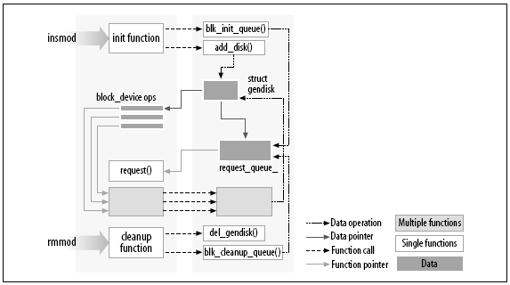

#### 设置测试系统

- 从 kernel.org 的镜像网网站获取一个"主线"内核, 并安装到自己的系统中.
- 无论内核来自哪里, 要想为 2.6.x 内核构造模块, 还必须在自己的系统中配置并构造好内核树. 因为 2.6 内核的模块要和内核源代码树中的目标文件连接, 通过这种方式, 会得到一个更健壮的模块装饰器, 但也需要这些目标文件存在于内核目录树中. 这样, 读者首先要准备一个内核源代码树, 构造一个新内核, 然后安装到自己的系统中.

#### Hello world 模块

- 下面代码是完整的"hello world"**模块**.

```
#include<linux/init.h>
#include<linux/module.h>
MODULE_LICENSE("Dual BSD/GPL")

static init hello_init(void)
{
    printk(KERN_ALERT "Hello, world\n");
    return 0;
}

static void hello_exit(void)
{
    printk(KERN_ALERT "Goodbye, curel world\n");
}

module_init(hello_init);
module_exit(hello_exit);
```
- 这个模块定义了两个函数, 其中一个在模块被装载内核时调用(hello_init), 而另一个则在模块被移除时调用(hello_exit). module_init 和 module_exit 行使用了内核的特殊宏来表示上述两个函数所扮演的角色. 另一个特殊宏(MODULE_LICENSE)用来告诉内核, 该模块采用自由许可证; 如果没有这样的声明, 内核在装载该模块时会抱怨.
- 函数 printk 在 Linux 内核中定义, 功能和标准 C 的 printf 类似. 内核需要自己单独打印输出函数, 因为它在运行时不能依赖 C 库. 模块能调用 printk 是因为在 insmod 函数装入模块后, 模块就连接到了内核, 因而可以访问内核的公用符号(包括函数和变量). 代码中的字符串 KERN_ALERT 定义了这条消息的优先级. 需要代码中显示指定高优先级原因: 具有默认优先级的消息可能不会输出在控制台上, 这依赖于内核版本, klogd 守护进程的版本以及具体的配置.
- 可以使用 insmod 和 rmmod 工具来测试这个模块, 注意只有超级用户才能加载和卸载模块.

```
% make
make[1]:Entering directory ` /usr/src/linux-2.6.10'
 CC [M] /home/ldd3/src/misc-modules/hello.o
 Building modules, stage 2.
 MODPOST
 CC /home/ldd3/src/misc-modules/hello.mod.o
 LD [M] /home/ldd3/src/misc-modules/hello.ko
make[1]: Leaving directory `/usr/src/linux-2.6.10'
% su
root# insmod ./hello.ko
Hello, world
root# rmmod hello
Goodbye cruel world
root#
```

- 为了让上面的命令正常工作, 必须已经在 makefile 能够找到的地方(这里是/usr/src/linux-2.6.10)正确配置和构造了内核树.

---

#### 核心模块与应用程序的对比

- 多数程序是从头到尾执行单个任务, 而模块却只是预先注册自己一边服务于将来的某个请求, 然后它的初始化函数就立即结束. 换句话说, 模块初始化函数的任务就是为以后调用模块函数预先做准备. 模块的退出函数将在模块被卸载之前调用. 事件驱动的应用程序和内核代码之间另一个主要不同是: 应用退出前可以不管资源的释放或其他清除工作, 但模块的退出必须撤销初始化函数做的一切. 否则, 在系统重新引导之前某些东西会残留在系统中.



- 内核编程和应用程序编程的另外一个不同在于处理错误方式不同: 应用程序开发中的段错误是无害的, 并总是可以使用调试器跟踪到源代码中的问题所在, 而一个内核错误即使不影响整个系统, 也至少会杀死当前进程.

---

#### 用户空间和内核空间

- 模块运行在所谓的内核空间中, 而应用程序运行在所谓的用户空间中.
- 操作系统必须负责程序的独立操作并保护资源不受非法访问. 这个重要任务只有在 CPU 能够保护系统软件不受应用程序破坏时才能完成.
- 所有现代处理器都具备这个能力. 选择的方法是 CPU 中实现不同的操作模式(或级别). 不同级别具有不同的功能, 较低的级别会禁止某些操作. 程序代码只能通过有限数目的"门"来从一个级别切换到另一个级别. Unix 系统设计时利用了这种硬件特性, 使用了两个这样的级别. 当前所有的处理器都至少具有两个保护级别, 而其他处理器(比如 x86 系列), 则有更多级别. 当处理器存在多个级别时, Unix 使用最高级别和最低级别. 在 Unix 中, 内核运行在最高级别(也称超级用户态), 在这个级别中可以进行所有的操作. 应用程序运行在最低级别(即用户态), 在这个级别中, 处理器控制着对硬件的直接访问以及对内存的非授权访问.
- 我们通常将运行模式称为内核空间和用户空间, 这个术语不仅说明两种模式具有不同的优先权等级, 而且还说明每个模式有自己的内存映射, 即有自己的地址空间.
- 每当应用程序执行系统调用或被硬件中断挂起时, Unix 将执行模式从用户空间切换到内核进程. 执行系统调用的内核代码运行在进程上下文中, 它代表调用进程执行操作, 因此能访问进程地址空间的所有数据. 而执行硬件中断的内核代码和进程是异步的, 与任何一个特定进程无关.
- 模块化代码在内核空间中运行, 用于扩展内核的功能. 通常, 一个驱动程序要执行先前讲的两类任务: 模块中的某些函数作为系统调用的一部分而执行, 而其他函数则负责中断处理.

#### 内核中的并发

- 大多数应用程序, 除了多线程应用之外, 通常是顺序执行的. 内核代码必须考虑: 同一时刻, 可能有许多事情正在发生.
- Linux 内核代码(包括驱动程序代码)必须是可重入的, 它必须能够同时运行在多个上下文中. 因此, 内核数据结构需要仔细设计才能保证多个线程分开执行, 访问共享数据的代码也必须避免破坏共享数据.
- 驱动程序编写人员所犯的一个常见错误时, 认为只要某段代码没有进入睡眠模式(或阻塞), 就不会产生并发问题.

#### 当前进程

- 内核代码可以通过访问全局项 current 来获取当前进程, 2.6 版本 current 不再是一个全局变量, 为了支持 SMP 系统(对称多处理器, Symmetric multiprocessor), 内核开发者设计了一种能找到运行在相关 CPU 上的当前进程的机制. 这种机制必须是快速的, 因为对 current 的访问时很频繁的. 一种不依赖于特定架构的机制通常是, 将指向特定 task_struct 结构的指针隐藏在内核中. 这种实现细节同样对其他内核子系统隐藏, 设备驱动只需要包含<linux/sched.h>头文件即可引用当前进程. 下面语句就是通过访问 Struct task_struct 的某些成员来打印当前进程的进程 ID 和命令名:

```
printk(KERN_INFO "The process is \"%s" (pid %i)\n",
        current->comm, current->pid);
```

存储在 current->comm 成员中的命令名是当前进程所执行的程序文件的基本名称(base name).

#### 其他

- 应用程序在虚拟内存中布局, 并且具有一块很大的栈空间. 当然, 栈是用来保存函数调用历史以及当前活动函数中的自动变量的. 相反, 内核具有非常小的栈, 它可能只和一个 4096 字节大小的页那样大. 我们自己的函数必须和整个内核空间调用链一同共享这个栈. 因此, 声明大的自动变量并不是一个好主意, 如果我们需要大的结构, 则应该在调用时动态分配该结构.
- 内核 API 中经常有具有两个下划线(__)的函数名称. 具有这种名称的函数通常是接口的底层组件, 应谨慎使用.
- 内核代码不能实现浮点数运算.