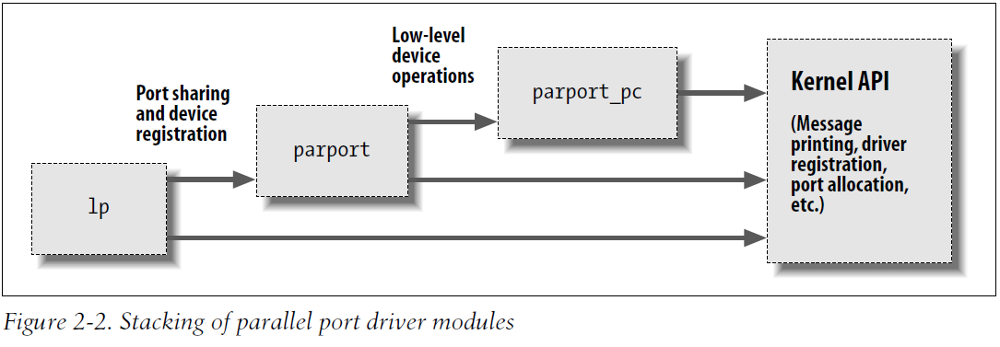

# 编译与装载

#### 编译模块

- 模块的构造过程和用户空间应用程序的构造过程有很大的不同.
- 构造内核版本, 首先应确保具备了正确版本的编译器、模块工具和其他必要的工具. 内核文档目录中的 Documentation/Changes 文件列出了需要的工具版本; 然后为自己的模块创建 makefile 则非常简单. 实际上, 对于之前的"Hello world"示例来说, 下面一行就足够:

```
obj-m := hello.o
```

- 上面的赋值语句(它利用了 GNU make 的扩展语法)说明了有一个模块需要从目标文件 hello.o 中构造, 而从该目标文件中构造的模块名称为 hello.ko.
- 如果我们构造的模块名称为 module.ko, 并且由两个源文件生成(比如 file1.c 和 file2.c), 则正确的 makefile 可如下编写:

```
obj-m := module.o
module-objs := file1.o file2.o
```

- 为了让上面这种类型的 makefile 文件正常工作, 必须在大的内核构造系统环境中调用它们.

#### 装载和卸载模块

- 构造模块之后, 下步就是将模块装入内核. insmod 就是完成这个工作. insmod 与 ld 有些类似, 它将模块的代码和数据装入内核, 然后使用内核的符号表解析模块中任何未解析的符号. 然而, 与链接器不同, 内核不会修改模块的磁盘文件, 而仅仅修改内存中的副本. insmod 可以接受一些命令行选项(参见手册), 并且可以在模块链接到内核之前给模块中的整型和字符串类型变量赋值. 因此, 一个良好设计的模块可以在装载时进行配置, 这比编译时配置为用户提供更多灵活性.
- 内核支持 insmod 实际上是依赖与定义在 kernel/module.c 中的一个系统调用. 函数 sys_init_module 给模块分配内核内存(函数 vmalloc 负责内存分配)以便装载模块, 然后, 该系统调用将模块正文复制到内存区域, 并通过内核符号表解析模块中的内核引用, 最后调用模块的初始化函数.
- 只有系统调用的名字带有 sys_前缀.
- 与 insmod 类似, modprobe 也用来将模块装载到内核. 不同在于, 它会考虑要装载的模块是否引用了一些当前内核不存在的符号. 如果有, 会在当前模块搜索路径中查找定义这些符号的其他模块, 如果找到会同时将这些模块加载到内核. 如果这时候使用 insmod, 则命令会失败, 并在系统日志记录"unresolved symbols".
- lsmod 程序列出当前装载到内核中的所有模块. 当前已装载模块的信息也可以在 sysfs 虚拟文件爱你系统的/sys/modules 下找到.

#### 版本依赖

- 在缺少 modversions 的情况下, 我们的模块代码必须要针对要链接的每个版本内核重新编译.
- 内核不会假定一个给定的模块是针对正确的内核版本进行构造的. 我们在构造时候, 可以将自己的模块和当前内核树中的一个文件(即 vermagic.o)链接; 该目标文件包含大量有关内核信息, 包含目标内核版本, 编译器版本以及一些重要配置变量的设置. 在试图装载模块时, 这些信息可以用来检查模块和正在运行的内核的兼容性. 如果有任何不匹配, 就不会装载该模块, 同时可以看到如下信息:

```
#insmod hello.ko
Error inserting './hello.ko': -1 Invalid module format
```

- 查看系统日志文件(/var/log/messages 或系统配置使用的文件)

#### 平台依赖

- 对于应用程序开发人员, 必须将程序代码和编译过的库链接并遵循参数传递原则. 而内核开发人员不同, 他们可以根据不同需求将某些寄存器指定为特定用途, 而且内核代码可以针对某个 CPU 家族的某种特定处理器进行优化, 从而充分利用目标平台的特性.

---

# 内核符号表

- insmod 使用公共内核符号来解析模块中未定义的符号. 公共内核符号表中包含了所有的全局内核项(即函数和变量)的地址, 这是实现模块化驱动程序所必需的. 当模块被装入内核后, 它所导出的任何符号都会变成内核符号表的一部分. 通常, 模块只需要实现自己的功能, 而无需导出任何符号.
- 新模块可以使用由我们自己的模块导出的符号, 这样, 我们可以在其他模块上层叠新的模块. 模块层叠技术在很多主流的内核源代码上使用. 例如, msdos 文件系统依赖于由 fat 模块导出的符号; 而每个 USB 输入设备模块层叠在 usbcore 和 input 模块之上.
- 模块层叠技术在复杂项目中非常有用. 如果以设备驱动程序的形式实现一个新的软件抽象, 则可以为硬件相关的实现提供一个"插头", 例如, video-for-linux 驱动程序组划分出了一个通用模块, 它导出的符号可供下层与具体硬件相关的驱动程序使用. 根据所安装的硬件的不同, 我们加载通用的 video 模块以及与具体硬件相关的特定模块. 另外, 并口支持以及大量可插拔设备的处理(比如 USB 内核子系统)都使用了类似的层叠方法. 下图给出了并口子系统中的层叠方式, 箭头显示了模块之间以及和内核编程接口之间的通信情况.



- modprobe 是处理层叠模块的一个实用工具. 它功能很大程度上和 insmod 类似, 但它除了装载指定模块外还同时装入指定模块所依赖的其他模块. 因此, 一个 modprobe 命令有时候相当于调用几次 insmod 命令(然而, 在从当前目录装入自己的模块时仍需要使用 insmod, 因为 modprobe 只能从标准的已安装模块目录中搜索需要装入的模块).
- Linux 内核头文件提供了一个方便的方法来管理符号对模块外部的可见性, 从而减少可能造成的名字空间污染, 并且适当隐藏信息. 如果一个模块需要向其他模块导出符号, 则应该使用下面的宏.

```
EXPORT_SYMBOL(name);
EXPORT_SYMBOL_GPL(name);
```

- 这两个宏均用于将给定的符号导出到模块外部. _GPL 版本使得要导出的模块只能被 GPL 许可证下的模块使用. 符号必须在模块文件的全局部分导出, 不能在函数中导出, 这是因为上面这两个宏将被扩展为一个特殊变量的声明, 而该变量必须是全局的. 该变量将在模块可执行文件的特殊部分(即一个"ELF 段")中保存, 在装载时, 内核通过这个段来寻找模块导出的变量(查阅<linux/module.h>获取更详细信息).

#### 模块的二进制结构

- 模块使用 ELF 二进制格式, 模块包含了几个而外的段, 普通程序或库中不会出现.
  - __ksymtab __ksymtab_gpl 和__ksymtab_gpl_future 段包含一个符号表, 包含了模块导出的所有符号.
  - __kcrctab __kcrctab_gpl 和__kcrctab_gpl_future 包含模块所有导出函数的校验和. (除非内核配置启用了版本控制特性, 否则不会建立上述段)

---

# 预备知识

- 大部分内核代码中都要包含相当数量的头文件, 以便获得函数、数据类型和变量的定义. 有几个头文件是专门用于模块的, 因此必须出现在每个可装载的模块中. 故而, 所有的模块代码中都包含下面两行代码:

```
#include <linux/module.h>
#include <linux/init.h>
```

- module.h 包含有可装载模块需要的大量符号和函数的定义. 包含 init.h 的目的是指定初始化和清除函数. 大部分模块还包括 moduleparam.h 头文件, 这样我们就可以在装载模块时向模块传递参数.
- 尽管不是严格要求, 但模块应该指定代码所使用的许可证. 为此, 我们只需要包含 MODULE_LICENSE 行:

```
MODULE_LICENSE("GPL")
```

- 内核能够识别的许可证有"GPL"(任一版本的 GNU 通用公共许可证)、"GPL v2"(GPL 版本 2)、"GPL and additional rights"(GPL 及附加权限)、"Dual BSD/GPL"(BSD/GPL 双重许可证)、"Dual MPL/GPL"(MPL/GPL 双重许可证)以及"Proprietary"(专有). 如果一个模块没有显示标记, 会被假定为专有的, 而内核装载这种模块就会被"污染". 因为内核开发者不太愿意帮助因为装载专有模块而遇到问题的用户.
- 可在模块中包含的其他描述性定义包括 MODULE_AYTHOR(描述模块作者)、MODULE_DESCRIPTION(用来说明模块作用的简短描述)、MODULE_VERDSION(代码修订号; 有关版本字符串的创建惯例, 参考<linux/module.h>的注释)、MODULE_ALIAS(模块的别名)以及 MODULE_DEVICE_TABLE(用来告诉用户空间模块所支持的设备).
- 上述 MODULE_声明可出现在源文件中源代码函数以外的任何地方. 但新近的内核编码习惯是将这些声明放在文件的最后.

#### 初始化和关闭

- 模块的初始化函数负责注册模块所提供的任何设施. 定义通常如下:

```
static int __init initialization_function(void)
{
    /*这里是初始化代码*/
}

module_init(initialization_function)
```

- 初始化函数应该被声明为 static, 因为这种函数在特定文件之外没有其他意义. 上述定义中的__init 标记, 它对内核来讲就是一种暗示, 表明该函数仅在初始化期间使用. 在模块被装载之后, 模块装载器就会将初始化函数扔掉, 这样可以将该函数占用的内存释放出来. __init 和__initdata 的使用是可选的, 不要在结束初始化之后仍要使用的函数使用这两个标记. 在内核源码中还可能会遇到__devinit 和__devinitdate, 只有在内核未被配置为支持热插拔设备的情况下, 这两个标志才会被翻译为__init 和__initdata.
- module_init 这个是强制的, 这个宏会在模块的目标代码中增加一个特殊的段, 用于说明内核初始化函数所在的位置.
- 模块可以注册许多不同类型的设施, 包括不同类型的设备、文件系统、密码变换等, 不同设施对应具体的内核函数用来完成注册. 传递到内核注册函数中的参数通常是指向用来描述新设施及设施名称的数据结构指针, 而数据结构通常包含指向模块函数的指针, 这样, 模块体中的函数就会在恰当的时候被内核调用.
- 可被注册的设施类型包括串口、杂项设备、sysfs 入口、/proc 文件、可执行域以及线路规程(line discipline)等. 很多可注册的设施所支持的功能属于"软件抽象"范畴, 而不与任何硬件直接相关. 这种类型的设施能被注册, 因为它们能够以某种方式集成到驱动程序功能当中(如/proc 文件系统以及线路规程).
- 还有其他一些设施可以注册为特定驱动程序的附加功能, 但是他们的用途有限. 如果想要进一步了解, 可以在内核源文件中 grep EXPORT_SYMBOL, 并找出由不同驱动程序提供的入口点. 另外, 大部分注册函数名字带有 register_前缀.

#### 清除函数

- 在模块被移除前注销接口并向系统中返回所有资源. 函数定义如下:

```
static void __exit cleanup_function(void)
{
    /*清除代码*/
}

module_exit(cleanup_function);
```

- 清除函数没有返回值. __exit 修饰词标记该代码仅用于模块卸载(编译器将把该函数放在特殊的 ELF 段中). 如果模块被直接内嵌到内核中, 或者内核的配置不允许卸载模块, 则被标记为__exit 的函数将被简单的丢弃. 由于以上原因, 被标记为__exit 的函数只能在模块被卸载或系统关闭时候调用, 其他任何用法都是错误的.
- 如果一个模块未定义清除函数, 则内核不允许卸载该模块.

#### 初始化过程中的错误处理

- 内核注册设施时, 要时刻铭记注册可能失败.
- 如果在注册设施时遇到任何错误, 首先要判断模块是否可以继续初始化. 通常, 在某个注册失败后可以通过降低功能来继续运转. 因此, 只要可能, 模块应该继续向前并尽可能提供其功能.
- 如果在发生某个特定类型的错误之后无法继续装载模块, 则要将出错之前的任何注册工作撤销掉. Linux 中没有记录每个模块都注册了哪些设施, 因此, 当模块的初始化出现错误之后, 模块必须自行撤销已注册的设施. 如果由于某种原因未能撤销已注册的设施, 则内核会处于一种不稳定状态, 这是因为内核中包含了一些指向并不存在的代码的内部指针. 这种情况下, 唯一有效办法就是重新引导系统.
- 错误恢复的处理有时使用 goto 语句比较有效. 通常很少使用 goto, 但在处理错误时(可能是唯一情况)非常有用. 错误情况下的 goto 使用可避免大量复杂的、高度缩进的"结构化"逻辑. 因此, 内核经常使用 goto 来处理错误.
- 不管初始化过程在什么时刻失败, 下面的例子(使用了虚构的注册和撤销注册函数)都能正常工作:

```
int __init my_init_function(void)
{
    int err;

    /*使用指针和名称注册*/
    err = register_this(ptrl, "skull");
    if (err) goto fail_this;
    err = register_that(ptr2, "skull");
    if (err) goto fail_that;
    err = register_those(ptr3, "skull");
    if (err) goto fail_those;

    return 0; /*成功*/

  fail_those: unregister_that(ptr2, "skull");
  fail_that: unregister_this(ptr1, "skull");
  fail_this: return err;  /*返回错误*/
}
```

- 这段代码准备注册三个(虚构的)设施. 在出错时候使用 goto 语句, 将只撤销出错时刻以前所成功注册的那些设施.

- 另一种观点是不支持 goto 的使用, 而是记录任何成功注册的设施, 然后在出错的时候调用模块的清除函数. 清除函数将仅仅回滚已成功完成的步骤. 然而, 这种替代方法需要更多代码和 CPU 时间, 因此在追求效率的代码中使用 goto 语句仍然是最好的错误恢复机制.
- my_init_module 的返回值 err 是一个错误编码. 在 Linux 内核中, 错误编码是定义在<linux/errno.h>中的负整数. 如果我们不想使用其他函数返回的错误编码, 而想使用自己返回的错误编码, 则应该包含<linux/errno.h>, 以使用诸如-ENODEV、-ENOMEM 之类的符号值. 每次返回合适的错误编码是一个好习惯, 因为用户程序可以通过 perror 函数或类似的途径将它们转换为有意义的字符串.
- 显然, 模块的清除函数需要撤销初始化函数所注册的所有设施, 并且习惯上(但不是必须)以相反与注册的顺序撤销设施:

```
void __exit my_cleanup_function(void)
{
    unregister_those(ptr3, "skull");
    unregoster_that(ptr2, "skull");
    unregister_this(ptr1, "skull");
    return;
}
```

- 如果初始化和清除工作涉及很多设施, 则 goto 方法可能变得难以管理, 因为所有用于清除设施的代码在初始化函数中重复, 同时一些符号交织在一起. 因此, 有时我们需要考虑重新构思代码中的结构.
- 每当发生错误时从初始化函数中调用清除函数, 这种方法将减少代码的重复并使代码更清晰、更有条理. 当然, 清除函数必须在撤销每项设施的注册之前检查它的状态. 下面是这种方法的简单示例:

```
struct something *item1;
struct somethingelse *item2;
int stuff_ok;

void my_cleanup(void)
{
    if(item1)
        realse_thing(item1);
    if(item2)
        realse_thing2(item2);
    if(stuff_ok)
        unister_stuff();
    return;
}

int __init my_init(void)
{
    int err = -ENOMEM;

    item1 = allocate_thing(arguments);
    item2 = allocate_thing2(arguments2);
    if (!item1 || !item2)
        goto fail;
    err = register_stuff(item1, item2);
    if (!err)
        stuff_ok = 1;
    else
        goto fail;
    return 0; /*成功*/

    fail:
        my_cleanup();
        return err;
}
```

- 因为清除函数并非退出代码调用, 因此不能将清除函数标记为__exit.

#### 模块装载竞争

- 我们已经讨论了模块装载中的一个重要方面: 竞态(race condition).
- 首先, 在完成注册之后, 内核的某些部分可能会立即使用我们刚刚注册的任何设施. 换句话说, 在初始化函数还在运行的时候, 内核就完全可能会调用我们的模块. 因此, 在首次注册完成后, 代码就应该准备好被内核的其他部分调用; 在用来支持某个设施的所有内部初始化完成之前, 不要注册任何设施.
- 还要考虑, 当初始化失败而内核的某些部分已经使用了模块所注册的某个设施时应该如何处理. 如果这种情况可能发生在我们的模块上, 则根本不应该出现初始化失败的情况, 毕竟模块已经成功导出了可用的功能或符号. 若初始化一定要失败, 则应该仔细处理内核其他部分正在进行的操作, 并且要等待这些操作的完成.

---

### 模块参数

- 由于系统的不同, 驱动程序需要的参数也许会发生变化. 这包括设备编号以及其他一些用来控制驱动程序操作方式的参数. 例如, SCSI 适配器的驱动程序经常要处理一些选项, 这些选项用来控制标记命令队列的使用, 而集成设备电路(Integrated Device Electronics, IDE)驱动程序允许用户控制 DAM 操作. 如果读者的驱动程序用来控制一些早期的硬件, 也许需要明确告知驱动程序硬件的 I/O 端口或 I/O 内存地址的位置. 为满足这种需求, 内核允许对驱动程序指定参数, 而这些参数可在装载驱动程序模块时改变.
- 这些参数的值可在运行 insmod 或 modprobe 命令装载模块时赋值, 而 modprobe 还可以从它的配置文件(/etc/modprobe.conf)中读取参数值. 这两个命令可以在命令行接受几种参数类型的赋值. 我们假定对之前的"hello world"模块(命名为 hellop)做一些必要的增强. 我们添加了两个参数: 一个是整数值, 其名称为 howmany; 另一个是字符串, 名称为 whom. 在装载这个增强模块时, 将向 whom 问候 howmany 次. 这样, 我们可以使用下面的命令行来装载该模块:

```
insmod hellop howmany=10 whom="Mom"
```

- 上面这条命令的效果会让 hellop 打印 10 次"hello, Mom"
- 当然, 在 insmod 改变模块参数之前, 模块必须让这些参数对 insmod 命令可见. 参数必须使用 module_param 宏来声明, 这个宏在 moduleparam.h 中定义. module_param 需要三个参数: 变量的名称、类型以及用于 sysfs 入口项的访问许可掩码. 这个宏必须放在任何函数之外, 通常是在源文件的头部. 这样, hellop 通过下面的代码来声明它的参数并使之对 insmod 可见:

```
static chatr *whom = "world";
static int howmany = 1;
module_param(howmany, int, S_IRUGO);
module_param(whom, charp, S_IRUGO);
```
