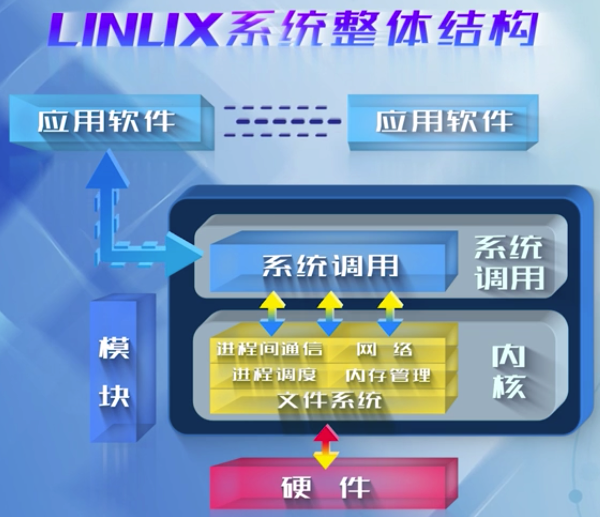

<!-- @import "[TOC]" {cmd="toc" depthFrom=1 depthTo=6 orderedList=false} -->

<!-- code_chunk_output -->

- [1. 什么是操作系统?](#1-什么是操作系统)
- [2. 为什么学 Linux 操作系统内核](#2-为什么学-linux-操作系统内核)
- [3. Linux 系统整体结构是什么](#3-linux-系统整体结构是什么)
- [4. 其内核设计遵循什么理念](#4-其内核设计遵循什么理念)
- [5. 隔离变化 - 系统调用机制](#5-隔离变化---系统调用机制)
- [6. 漫画趣解 Linux 内核构造](#6-漫画趣解-linux-内核构造)
- [7. 教材和参考文献](#7-教材和参考文献)
  - [7.1. 教材](#71-教材)
  - [7.2. 参考文献](#72-参考文献)

<!-- /code_chunk_output -->

带着问题来介绍

# 1. 什么是操作系统?

普通用户感知到的是应用程序, 比如使用微信

操作系统是藏在应用程序背后的系统软件

触摸屏是个硬件, 是被操作系统来管理的

所以说用户实际上也感知到了操作系统, 如图

一个操作系统实际上做两件事情

An operating system(os) is system software that manages computer hardware and software resources and provides common services for computer programs.

* 对整个计算机系统的软件硬件资源进行管理
* 为用户提供服务

所以操作系统的设计有两大目标

* 提高资源的利用率
* 方便用户的使用

# 2. 为什么学 Linux 操作系统内核

Linux 是一个自由、开放、普世的操作系统, 从 1991 年诞生

现在热门研究领域背后运行的都是 Linux

# 3. Linux 系统整体结构是什么

最上层是应用软件, 中间是系统调用, 最下面是操作系统的内核

那么整个系统分为两大部分, 一部分是应用软件, 一部分是操作系统内核, 接口就是系统调用.

系统调用作用: 在应用程序和操作系统中间起到接口的作用. 当应用程序发出请求, 实际是给系统调用, 系统调用是把这个请求给操作系统以后, 操作系统提供服务. 这个服务包括方方面面的, 比如文件系统的服务, 进程管理的服务, 内存管理的服务以及进程调度和网络等.

注: 图中旁边还有个模块, 后面会讲到

# 4. 其内核设计遵循什么理念

Linux/UNIX 设计理念: 机制与策略分离

* 机制: 提供什么样的功能, 相对不变的部分
* 策略: 如何使用这些功能

比如, 我们要创建一个进程, 这个事情很繁琐, 操作系统来做, 操作系统把这创建进程这件事做好以后呢, 你如何在你的进程里面来使用这些功能操作系统就不关注了, 你可以在各个不同的场合来使用创建进程这样一个功能. 学习 Linux 内核实际上学习的是机制.

# 5. 隔离变化 - 系统调用机制

下面简单介绍下系统调用机制

系统调用起着隔离变化的作用, 机制是提供什么样的功能, 那系统调用机制在应用程序和操作系统内核之间起接口的作用, 它相当于将很多的变化隔离起来, 应用程序在做开发时候, 它只需要调用系统调用的接口就可以.

举例来讲

比如, 要从磁盘读数据, 那么当我们用户发出一个请求的时候, 和系统调用来打交道, 而系统调用和文件系统打交道. 与哪个文件系统呢? Linux 支持很多文件系统, 用户不用关心和哪个文件系统打交道; 从哪里读数据呢? 从磁盘还是网盘? 用户也不用关心. 这就是机制与策略的隔离, 操作系统提供了非常健全的机制, 让用户可以很方便使用这种机制,

# 6. 漫画趣解 Linux 内核构造

图片来源: http://turnoff.us/geek/inside-the-linux-kernel/

详解可见: https://linux.cn/article-8290-1.html

# 7. 教材和参考文献

## 7.1. 教材

陈莉君 <Linux 操作系统原理与应用> 清华大学出版社 2012 年 1 月

## 7.2. 参考文献

陈向群等译 <现代操作系统> 机械工业出版社 2009 年 7 月

陈莉君等译 <深入理解 Linux 内核> 中国电力出版社 2007 年 6 月

陈莉君等译 <Linux 内核设计与实现> 机械工业出版社 2009 年 11 月

分布式操作系统: 何炎祥 <分布式操作系统> 高等教育出版社 2005 年 1 月

Andrew S.tanenbaum <Distributed Operating Systems> 机械工业出版社 2006

<Linux 内核设计与实现>可以作为入门的书; 当深入到源代码的时候, 需要看一本书<深入理解 Linux 内核>; 当阅读了源代码, 想动手实践时候, 有本书叫<Linux 设备驱动程序>, 这三本叫`"三位一体"`, 业界叫`Linux 的红宝书`

