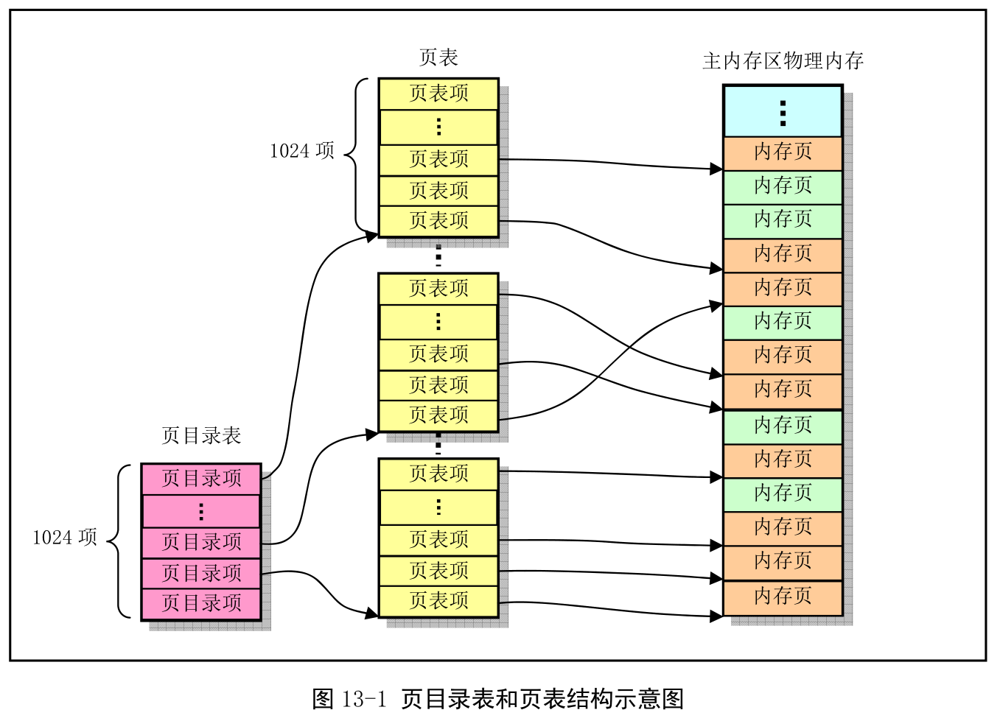
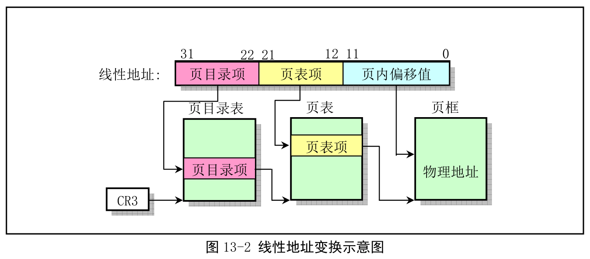
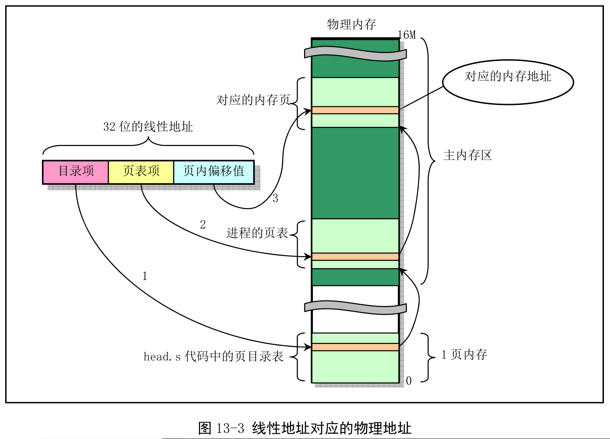
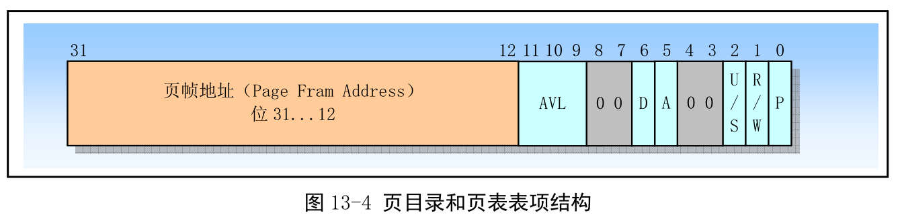
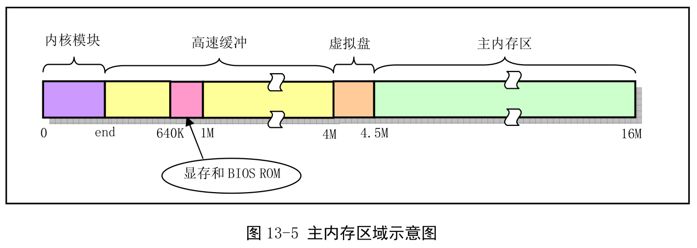
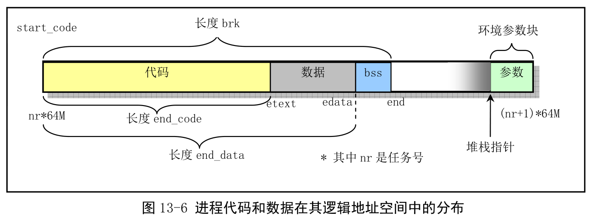

Intel 80X86 体系结构中, Linux 内核的内存管理程序采用分页管理方式. 利用页目录和页表结构处理内核中其他部分代码对内存的申请和释放操作. 内存的管理是以内存页面为单位进程的, 一个内存页面是指地址连续的 4KB 物理内存.

Linux 0.12 内存管理目录中有 4 个文件.

page.s 仅包含内存页异常的中断处理过程(int 14), 主要实现对缺页和页写保护的处理. memory.c 是内存页面管理的核心文件, 用户内存初始化、页目录和页表的管理和内核其他部分对内存的申请处理过程. swap.c 是内存页面交换管理文件, 主要包括交换映射位图管理和交换设备访问.

## 1. 内存分页管理机制

Intel 8086 中, 内存分页通过页目录项和页表所组成的二级表组成, 如图. 其中页目录项和页表结构一样, 表项结构也相同. 页目录表中每个表项(4B 字节)用来寻址一个页表, 而每个页表项(4B)用来指定一个页物理内存页. 页目录项占用一页内存, 最多可寻址 1024 个页表. 而每个页表占用一页, 因此最多可寻址 1024 个物理内存页面. 这样, 一个页目录表所寻址的所有页表共可以寻址 1024X1024X4096B=4GB 内存空间. **Linux 0.12 中, 所有进程都使用一个页目录表, 每个进程有自己的页表**. 内核代码和数据有 16MB, 使用了 4 个页表(即 4 个页目录项). 这 4 个页表直接位于页目录表后, 参见 head.s 的 109\~125 行. 经过分段, 内核代码和数据段位于线性地址空间的前 16MB 范围, 经过分页变换, 被直接一一对应到 16MB 的物理内存上. 所以对于内核段, 线性地址就是物理地址.

下图形象表示了一个给定的线性地址映射到物理内存页上的. 对于第一个进程(任务 0), 页表是在页目录表之后, 共 4 页. 对于应用程序的进程, 其页表所使用的内存是在进程创建时向内存管理程序申请的, 因此在主内存区内.

一个系统中可同时存在多个页目录项, 而某个时刻只有一个页目录项可用. 当前页目录表由 CPU 寄存器 CR3 确定, 它存储**当前页目录表的物理内存地址**. Linux 0.12 只用了一个页目录表.

当 CPU 试图使用一个页表项进行地址转换时, 若此时任意一级页表项 P=0, 则处理器就发出页异常信号. 此时缺页中断异常处理程序就可以把所请求的页加入到物理内存中, 并且导致异常的指令会被重新执行.

## 2. Linux 中物理内存的管理和分配

Linux 0.12 最多支持 16MB 物理内存. 内核只占用物理内存最前面一部分, 如图 end 标出位置. 随后是高速缓存区, 醉倒内存地址是 4MB. 高速缓冲区被显示内存和 ROM BIOS 分为两段. 剩余是主内存区. 主内存区就是本章程序进行分配管理的. 若系统还存在 RAM 虚拟盘, 主内存区前面还要扣除虚拟盘. 当需要使用主内存区时就需要向本章内存管理程序申请, 所申请基本单位是内存页.

Linux 的页目录和页表是在 head.s 中设置的. **head.s 在物理地址 0 处存放一个页目录表, 随后是 4 个页表**. 这**4 个页表**将被用于**内核所占内存区域的映射**操作. 由于任务 0 代码和数据在内核区域中, 因此任务 0 也使用这些页表. **其他派生进程将在主内存区申请内存页存放自己的页表**. 本章两个程序就是用于对这些表进行管理.

为节约物理内存, 调用 fork()生成新进程时, 新进程与原进程共享同一内存区. 只有当其中一个进程进行写操作, 系统才会为其另外分配内存页面. 这就是写时复制.

page.s 用于实现也异常中断处理过程(int 14). 该中断处理过程对由于缺页和页写保护引起的中断分别调用 memory.c 中的 do\_no\_page()和 do\_wp\_page()函数进行处理. do\_no\_page()把需要的页面从块设备中取到内存指定位置处. 在共享内存页面情况下, do\_wp\_page()会复制被写的页面(copy on write, 写时复制), 从而也取消对页面的共享.

## 3. Linux 内核对线性地址空间的使用分配

一个执行程序进程的代码和数据在其逻辑地址空间中分布情况, 如图.

每个进程在线性地址中都是从 nrX64MB(之前 16MB 是物理地址, 这里是虚拟地址)的地址位置开始(nr 是任务号), 占用逻辑地址空间范围是 64MB(当然也是线性地址空间的范围). 其中最后的环境参数数据块最长是 128KB, 其左面是起始堆栈指针. 另外, 图中 bss 是进程未初始化的数据段, 在进程创建时 bss 段的第一页会被初始化为全 0.

## 4. 页面出错异常处理

开启分页机制(PG=1)状态下, 若 CPU 在执行线性地址变换到物理地址中检测到以下条件, 就会引起页错误异常中断 int 14:

(1)地址变换过程中用到的页目录项或页表项中存在位(P)等于 0.

(2)当前执行程序没有足够的特权访问指定的页面.

此时 CPU 会向页错误异常处理程序提供以下两方面信息协助诊断和纠正错误:

(3)栈中的一个出错码(error code). **出错码格式是一个 32 位长字**. 但只有最低 3 位有用, 它们名称与页表项中最后 3 位相同(U/S、W/R、P). 它们含义和作用分别是:

- 位 0(P), 异常由于页面不存在或违反访问特权. P=0, 页不存在; P=1, 违反页级保护权限.

- 位 1(W/R), 异常由于内存读或写操作引起. W/R=0, 读操作引起; W/R=1, 写操作引起.

- 位 2(U/S), 异常时 CPU 执行的代码级别. U/S=0, CPU 正在执行超级用户代码; U/S=1, CPU 正在执行一般用户代码.

(4)在控制寄存器 CR2 中的线性地址. CPU 将引起异常的访问使用的线性地址存放在 CR2 中. 页出错异常处理程序可以使用这个地址定位相关的页目录的页表项.

page.s 就是利用以上信息区分是**缺页异常**还是**写保护异常**, 从而确定调用 memory.c 中的缺页处理函数 do\_no\_page()或写保护函数 do\_wp\_page()函数.

## 5. 写时复制机制

当进程 A 使用系统调用 fork 创建子进程 B, 子进程 B 实际上是父进程 A 的一个副本, 因此会拥有与父进程相同的物理页面. 即为了达到节约内存和加快创建进程速度的目标, fork()函数会让**子进程 B 以只读方式(！！！)共享**父进程 A 的物理页面. 同时将**父进程 A 对这些物理页面的访问权限也设为只读(！！！)**(详见 memory.c 中的 copy\_page\_tables()函数). 这样当父进程 A 或子进程 B 任何一方对共享物理内存页面写操作时, 都会产生页面出错异常(page\_fault int 14)中断, 然后会执行异常处理函数 do\_wp\_page()来试图解决这个异常. 这就是写时复制.

do\_wp\_page()会对这块导致写入异常中断的物理页面进行取消共享操作(使用 un\_wp\_page()函数), 并为写进程复制一个新的物理页面, 使父进程 A 和子进程 B 各自拥有一块内存相同的物理页面. 这时才真正进行了复制操作(只复制这一块物理页面). 并把将执行写入操作的这块物理页面标记成可写访问的. 最后, 从异常处理函数返回, CPU 会重新执行刚导致异常的写入操作指令, 使进程能继续执行.

因此, 进程在自己虚拟地址范围写操作时, 就用上面这种被动的写时复制操作, 即: 写操作 ->页面异常中断 ->处理写保护异常 ->重新执行写指令. 而系统内核代码, 当在某个进程的虚拟地址范围内执行写操作, 例如进程调用某个系统调用, 如果该系统调用会将数据复制到进程的缓冲区中, 则内核会通过 verify\_area()函数首先主动调用内存页面验证函数 write\_verify(), 来判断是否有页面共享的情况, 如果有, 进行页面的写时复制操作.

另外, Linux 0.12 中, 在内核代码地址空间(线性地址\<1MB)执行 fork()创建进程没有采用写时复制. 因此当进程 0(idle 进程)在内核空间创建进程 1(init 进程)时将使用同一段代码和数据段. 但由于进程 1 复制的页表项也是只读的, 因此当进程 1 需要执行堆栈写操作也会引发页面异常, 从而在这种情况下内存管理程序也会在主内存区中为该进程分配内存.

## 6. 需求加载机制

