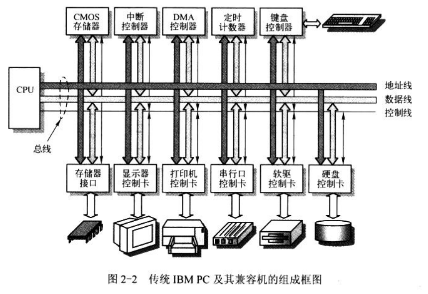
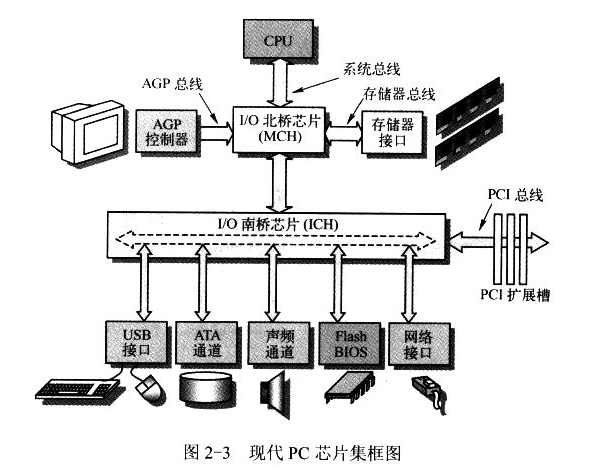
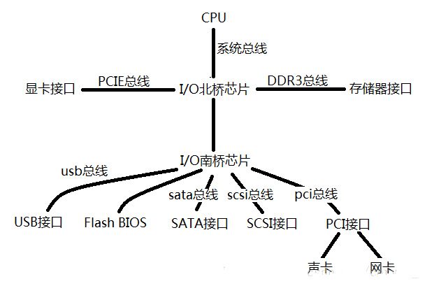

下图是 80386 或以上 CPU 的 PC 系统组成结构. 传统微型计算机硬件组成结构如下图.

其中, CPU 通过地址线、数据线和控制信号线组成的本地总线(或称内部总线)与系统其他部分进行数据通信.

- 地址线用于提供内存或 I/O 设备的地址, 即指明需要读/写数据的具体位置.

- 数据线用于在 CPU 和内存或 I/O 设备之间提供数据传输的通道.

- 控制总线则负责指挥执行的具体读/写操作.

对于 80386 CPU 的 PC, 地址线和数据线都是 32 根, 即 32 位. 因此地址寻址空间范围有 2^32B, 即 0~4G.

图上面的控制器和存储器接口通常集成在主板上. 这些控制器都是以一块大规模集成电路芯片为主组成的功能电路. 例如, 中断控制器由 Intel 8259A 或其兼容芯片构成; DMA 控制器通常采用 Intel 8237A 芯片构成; 定时计数器核心是 Intel 8253/8254 定时芯片; 键盘控制器使用 Intel 8042 芯片与键盘中的扫描电路进行通信.

图中下面控制卡(或称适配器)是通过扩展插槽与主板的系统总线连接. 总线插槽是系统地址总线、数据总线和控制线与扩展设备控制器的标准连接接口.

这些总线接口标准通常有**工业标准结构**(Industry Standard Architecture, ISA)总线、**扩展工业标准结构**(Extend ISA, EISA)总线、**外围组件互连**(Peripheral Component Interconnect, PCI)总线、**加速图形端口**(Accelerated Graphics Port, AGP)视频总线等. 还有采用串行通信点对点技术的高速**PCIE**(PCI Express)总线.

现代 PC 的组成结构如图.

除了 CPU 外, 主板主要由 2 个超大规模芯片构成的芯片组或芯片集(Chipsets)组成: 北桥(Northbridge)芯片和南桥(Southbridge)芯片. 北桥芯片主要用来与 CPU、内存和 AGP 视频接口, 具有高传输速率. 北桥芯片还起着**存储器控制**作用, 因此 Intel 标为 MCH(Memory Control Hub)芯片. 南桥芯片用于管理低、中速组件, 如 PCI 总线、IDE 硬盘接口、USB 端口等, 成为 ICH(I/O Control Hub).

与传统的 PC 结构兼容. 因为为传统 PC 硬件编写的程序仍然可以在现代 PC 上运行. Intel 开发手册也能证实.

为方便入门, 以传统 PC 为框架学习. 方法适用于现代 PC 结构
