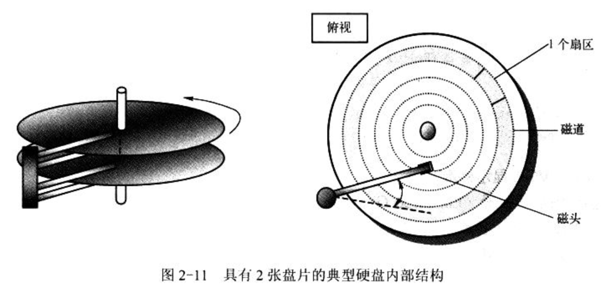

## 1. 中断控制器

IBM PC/AT 80x86 兼容机使用两片级联的 8259A 可编程中断控制芯片组成一个**中断控制**器, 用于实现 I/O 设备的中断控制数据存取方式, 并能为 15 个设备提供独立的中断控制功能, 如图 2-6.

在计算机刚开机初始化期间, **ROM BIOS**会分别对两片 8259A 芯片进行初始化, 并分别把 15 级中断优先级分配给时钟定时器、键盘、串行口、打印口、软盘控制、协处理器和硬盘等设备或控制器使用. 同时在**内存开始处** 0x000 ~ 0xFFF 区域内建立一个中断向量表. 但这些设置违背了 Intel 的要求(后续), 因此 Linux 在**内核初始化**期间又重新对 8259A 进行了设置(**在内存开始出设置中断向量表会废弃**).

刚开机上图中的不同的硬件中断请求号会被 ROM BIOS 设置为对应的中断向量号. 比如 中断请求号 IRQ0 被 BIOS ROM 设置为对应的中断向量号 0x08(8), 用途是 8253 发出的 100Hz 时钟中断. Linux 并不直接使用这些默认设置好的中断向量号.

## 2. DMA 控制器

通常由机器上的 Intel 8237 芯片或其兼容芯片实现.

在 PC/AT 中, 使用了两片 8237 芯片, 因此 DMA 控制器有 8 个独立的通道可使用. 其中后 4 个是 16 位通道. 软盘控制器被专门指定使用 DMA 通道 2. 在使用一个通道之前必须首先对其设置. 这涉及对三个端口的操作, 分别是**页面寄存器端口**、**(偏移)地址寄存器端口**和**数据计数寄存器端口**. 由于 DMA 寄存器是 8 位, 而地址和计数值是 16 位的, 因此各自需要发送两次.

## 3. 定时/计数器

Intel 8253/8254 是一个可编程定时/计数器(Programmable Interval Timer, PIT)芯片, 用于处理计算机中的精确时间延迟. 该芯片提供 3 个独立的 16 位计数器通道. 每个通道可工作在不同的工作方式下, 并且这些工作方式均可以软件设置.

在软件中进行延时的一种方法是执行循环操作语句. 但很耗 CPU 时间. 若机器采用 8253/8254 芯片, 那么程序员可以配置 8253 来满足自己的要求并使用其中一个计数器通道达到所期望的延时, 延时到后, 8253/8254 将会向 CPU 发送一个中断信号.

对于 PC/AT 及其兼容机系统采用的是 8254 芯片. 3 个定时/计数器通道分别用于时钟计时中断信号、动态内存 DRAM 刷新定时电路和主机扬声器音调合成. Linux 0.12 只对通道 0 进行了重设, 使该定时器工作在方式 3 下, 并每隔 10ms 发出一个信号以产生中断请求信号(IRQ0). 这个间隔定时产生的中断请求就是 Linux 0.12 内核工作的脉搏, 它用于定时切换当前执行的任务和统计每个任务使用的系统资源量.

## 4. 键盘控制器

现在键盘是 IBM 于 1984 年研制的 PC/AT 兼容键盘, 称为 AT-PS/2 兼容键盘并有 101 ~ 104 个键盘. 键盘上面有一个称为键盘编码器的处理器(Intel 8048 或兼容芯片)专门来扫描收集所有按下和松开的状态信息(即扫描码), 并发送到主机主板上键盘控制器中. 当按下一个键, 键盘发送的扫描码称为接通扫描码(Make Code), 简称接通码; 当被按下的键放开时发送的扫描码称为断开扫描码(Break Code), 或称断开码.

主机键盘控制器专门用来对接收到的键盘扫描码进行解码, 并把解码后的数据发送到操作系统的键盘数据队列中. 整个键盘上所有按键的接通和断开码组成一个键盘的一个扫描码集(Scan Code Set). 目前已有三套扫描码集.

现代键盘默认使用的扫描码集, AT 键盘扫描码集.

主机键盘控制器为了与 PC/XT 的软件兼容, 仍然会把所有接收到的第二套键盘扫描码转换为第一套扫描码. 如图 2-7. 因此, 为键盘控制器进行编程时候只需要了解第一套扫描码集(原始 XT 键盘扫描码)即可. 这也是后面涉及键盘编程内容时只给出 XT 键盘扫描码集的原因.

键盘控制器通常采用 Intel 8042 单片微处理器芯片或其兼容电路. 现代 PC 都已经将键盘控制器集成在主板芯片组中, 但功能兼容.

**键盘控制器接收键盘发送**(键盘控制器输入)过来的 11 位串行格式数据. 其中第 1 位是起始位, 第 2 ~ 9 位是 8 位键盘扫描码, 第 10 位是奇校验位, 第 11 位是停止位. 键盘控制器将其转换为 PC/XT 标准键盘兼容的系统扫描码, 然后通过中断控制器 IRQ1 引脚向 CPU 发送中断请求. 当 CPU 响应该中断请求后, 就会调用键盘中断处理程序来读取控制器中的 XT 键盘扫描码.

当一个键被按下, 可以**从键盘控制器端口**(键盘控制器的输出)接收到一个 XT 键盘**接通码**, 该码仅代表键盘上某个位置处的键被按下, 但还没对应到某个字符代码上. 通常接通码宽度是 1B. 对于 XT 键盘(即键盘控制器编程接口收到的扫描码), 断开码是其接通码加上 0x80, 即最高有效位(位 7)置位时的接通码. 例如, 按下"A", 接通码是 30(0x1E), 断开码是 0x1E + 0x80 = 0x9E.

但对于 PC/XT 标准**83 键**键盘以后扩展的 AT 键键盘上的按键(如右边的 Ctrl 键和右边的 Alt 键), 则其接通和断开扫描码通常有 2 ~ 4B, 并且第 1 个字节一定是 0xE0. 例如, 按下左边非扩展 Ctrl 会产生 1B 接通码 0x1D, 而按下右边扩展 Ctrl 会产生 2B 接通码 0xE0、0x1D. 对应的断开码是 0xE0、0x9D.

另外, 键盘控制器 8042 的输出端口 P2 用于其他目的. 其 P20 引脚用于实现 CPU 的复位操作, P21 引脚用于控制 A20 信号线的开启与否. 当该输出端口位 1(P21)为 1 时就开启(选通)了 A20 信号线, 0 就禁止.

现代主板已经不包含独立的 8042 芯片, 但主板上其他集成电路会为兼容而模拟 8042 芯片的功能. 因此, 现在键盘的编程仍然采用 8042 的编程方法.

## 5. 串行控制卡

### 5.1 异步串行通信原理

两台计算机/设备进行数据交换, 必须使用同一种语言, 即通信协议.

**通信协议**规定了传送一个**有效数据**长度单位的格式. 通常使用术语"帧"来描述这种格式. 为了能让通信双方确定**收/发的顺序**和进行一些**错误检查**操作, 除了必要的数据外, 在传输的 1 帧信息中还包含**起始同步**和**错误检测**作用的信息. 例如, 在开始传输数据信息之前先发送**起始同步或通信控制信息**, 并且在发送完需要的数据信息之后再传输一些**校验信息**等, 如图 2-8.

串行通信是指在线路上以位数据流一次一个进行传输的通信方式. 串行通信可分异步和同步串行通信两种类型. 两个区别在于传输时同步的通信单位或帧长度不同.

异步串行通信以**一个字符**作为一个通信单位或一帧进行传输, 而同步串行通信则以多个字符或字节组成的序列作为一帧数据进行传输. 实际上, 如果将传输单位缩小到一个位时, 那么以一个字符进行传输的异步串行通信业可以看作是一种同步传输通信方式. 所以区分主要是习惯上的划分, 不用在意.

### 5.2 异步串行传输格式

异步串行通信传输的帧格式如图 2-9. 传输一个字符由起始位、数据位、奇偶校验位和停止位构成. 其中起始位起同步作用, 值恒为 0. 数据位是传输的实际数据, 即一个字符的代码. 其长度可以是 5 ~ 8 位. 奇偶校验位可有可无, 由程序设定. 停止位恒为 1, 可由程序设定为 1、1.5 或 2 个位. 通信之前, 双方必须设置为相同的格式. 例如, 相同数量的数据位和停止位. 在异步通信规范中, 把传送 1 称为传号(MARK), 传送 0 称为空号(SPACE).

当没有数据传输时, 发送方处于传号(MARK)状态, 持续发送 1. 若需要发送数据, 则发送方需要首先发送一个位间隔时间的空号起始位. 接收方收到空号后, 就开始与发送方同步, 然后接收随后的数据. 若程序中设置了奇偶校验位, 那么数据传输完了后还需要接收奇偶校验位. 最后是停止位. 在一个字符帧发送完后可以立刻发送下一个字符帧, 也可以暂时发送传号, 等一会儿再发送字符帧.

接收到一个字符帧, 接收方可能会检测到三种错误之一:

- 奇偶校验错误. 会要求对方重新发送该字符.

- 过速错误. 取字符慢于接收速度. 应该修改程序加快取字符频率.

- 帧格式错误. 格式信息不正确.

### 5.3 串行控制器

## 6. 显示控制

IBM 最早推出的 PC 视频系统标准由单色 MDA 标准和彩色 CGA 标准以及 EGA 和 VGA 标准. 后续有高级显示卡(包括 AGP 显示卡). Linux 0.1.x 仅使用这几种标准都支持的文本显示方式.

### 6.1 MDA 显示标准

单色显示适配器(Monochrome Display Adapter, MDA)仅支持黑白.

### 6.2 CGA 显示标准

彩色图形适配器(Color Graphics Adapter, CGA)支持 7 种彩色和图形显示方式(BIOS 显示方式 0 ~ 6).

### 6.3 EGA/VGA 显示标准

增强型图形适配器(Enchanced Graphics Adapter, EGA)和视频图形阵列(Video Graphics Adapter,  VGA)除兼容或支持 MDA 和 CGA 的显示方式外, 还支持其他在图形显示方面的增强显示方式.

## 7. 软盘和硬盘控制器

PC 的软盘控制子系统由软盘片和软盘驱动器组成. 硬盘也是由盘片和驱动器组成, 但是通常硬盘的金属盘片固定在驱动器中, 不可拆卸.

硬盘中通常至少包含 2 张或更多张金属盘片, 因此有两个以上的读写磁头. 例如, 对于包含了 2 个盘片的硬盘中就具有 4 个物理磁头(见图 2-11).

磁头上分别有一个读线圈和一个写线圈.