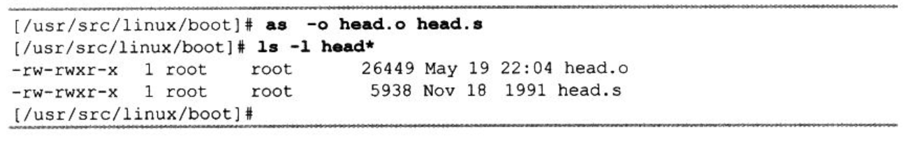
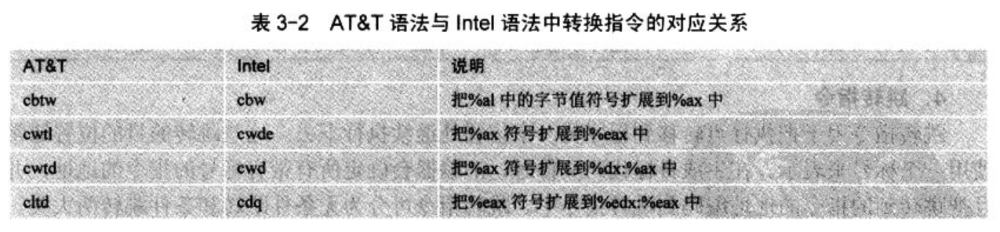

- 3.2　CNU　as 汇编

    - 3.2.1　编译 as 汇编语言程序

    - 3.2.2　as 汇编语法

    - 3.2.3　指令语句、操作数和寻址

    - 3.2.4　区与重定位

    - 3.2.5　符号

    - 3.2.6　as 汇编命令

    - 3.2.7　编写 16 位代码

    - 3.2.8　AS 汇编器命令行选项

内核中其余所有汇编语言程序(包括 C 产生的汇编程序)均使用 gas 来编译, 并与 C 语言程序编译产生的模块链接. 本文以 80x86 CPU 硬件平台为基础介绍 Linux 内核中使用汇编程序语法和 GNU as 汇编器(as 汇编器)的使用.

汇编有很高的速度和效率. Linux 中, 它的 32 位初始化代码、所有中断和异常处理过程接口程序以及很多宏定义都使用 as 汇编或扩展的嵌入汇编.

在编译 C 语言程序时, GNU gcc 编译器会首先输出一个作为中间结果的**as 汇编语言文件**, 然后 gcc 会调用 as 汇编器把这个临时汇编语言程序编译成**目标文件**. 即实际上**as 汇编器**最初是专门用于**汇编 gcc 产生的中间汇编语言程序**, 并非作为一个独立的汇编器使用. 因此, as 汇编器也支持很多 C 语言特性.

GNU as 的汇编器所属的 rpm 包: **binutils-XXX**.

## 1. 编译 as 汇编语言程序

gas、gld 的名称已经过时, 现在 GNU assembler 的名称是 as

编译命令格式如下:

```
as [] [-o objfile] [srcfile.s ...]
```

其中, objfile 时 as 编译输出的目标文件名; srcfile.s 时 as 的输入汇编语言程序名.

默认输出目标文件时 a.out.

as 的输出文件是输入的汇编语言程序编译生成的二进制数据文件, 即目标文件. 目标文件主要用于作为链接器 ld 的输入文件. 目标文件中包含已汇编过的程序代码、协助 ld 产生可执行程序的信息, 可能还包括调试符号信息.

假设要单独编译/boot/head.s 汇编程序, 可以如下:



## 2. as 汇编语法

为维持与 gcc 输出汇编程序的兼容性, as 汇编器使用 At&T 系统 V 的汇编语法. 与 Intel 很不一样, 主要区别如下:

- AT&T 语法中立即操作数前面要加字符"$;  寄存器操作数名前加"%";  绝对跳转/调用(相对于程序计数器有关的跳转/调用)操作数前加"*". Intel 汇编语法没这些限制.

- 两个源和目的操作数次序刚好相反. AT&T 的源和目的操作数是从左到右"源, 目的". 例如 Intel 语句 add eax, 4 对应 AT&T 的 addl $4, %eax.

- AT&T 语法中内存操作数的长度(宽度)由操作码最后一个字符来确定. 操作码后缀 b、w 和 l 分别指示内存引用宽度为 8 位字节(byte)、16 位字(word)和 32 位长字(long). Intel 通过在内存操作数前使用前缀 byte ptr、word ptr 和 dword ptr 来达到相同目的. 因此, Intel 中 mov al, byte ptr foo 对应于 AT&T 的 movb $foo, %al.

- AT&T 语法中立即形式的远跳转和远调用位 ljmp/lcall $section, $offset, 而 Intel 的是 jmp/call far section:offset. 同样, AT&T 语法中远返回指令 lret $stack-adjust.

- AT&T 汇编器不提供对多代码段程序的支持, UNIX 类 OS 要求所有代码在一个段中.

### 2.1 汇编程序预处理

as 汇编器具有对汇编语言程序内置的简单预处理功能.

- 该预处理功能会调整并删除多余空格和制表符;

- 删除所有注释语句并使用单个空格或一些换行符替换它们;

- 把字符常数换成对应的数值.

但预处理不会对宏定义进行处理, 也没有处理包含文件的功能. 如果需要该功能, 那么让程序使用大写后缀".S", 让 as 使用 gcc 的 CPP 预处理功能.

as 汇编语言除了 C 语言注释语句(即"/\*···\*/"), 还使用"#"作为单行注释开始字符. 所以需要预处理.

### 2.2 符号、语句和常数

符号(Symbol)是由字符组成的标识符. 字符集、数字和 3 字符"-"、"."、"$". 符号不允许用数字字符开始.

语句(Statement)以换行符或行分割字符";"作为结束. 若在一行最后使用反斜杠字符"\", 可以一条语句多行.

语句由零个或多个标号(Label)开始, 后面可以更一个确定语句类型的关键符号. 标号由符号后面跟随一个冒号(":")构成. 关键符号确定了语句余下部分的语义. 如果该关键符号以一个"."开始, 那么当前语句就是一个汇编命令(或称为伪指令、指示符). 如果关键符号以一个字母开始, 当前语句就是一条汇编语言指令语句.

一条语句通用格式:

```
标号: 汇编命令  注释部分(可选)
或
标号: 指令助记符  操作数 1, 操作数 2        注释部分(可选)
```

常数是一个数字, 分为字符常数和数字常数两类. 字符常数还分位字符串和单个字符; 数字常数可分为整数、大数和浮点数.

字符串必须用双引号括住, 并且可以使用反斜杠"\"转义.

单个字符常数可以写成在该字符前面加一个单引号, 例如"A"表示值 65. 转义码也可以用于单个字符常数, 例如"\\\\"表示反斜杠字符常数.

整数常数 4 种表示方法, 0b 或 0B 开始的二进制数(0 ~ 1)、0 开始的八进制(0 ~ 7)、非 0 开始的十进制和使用 0x 或 0X 开头的十六进制.

大数(Bignum)是位数超过 32 位二进制位数. 内核代码中几乎不用浮点数.

## 3. 指令语句、操作数和寻址

指令(Instructions)是 CPU 执行的操作, 通常也称为操作码(Opcode). 操作数(Operand)是指令操作的对象. 而地址(Address)是指定数据在内存中的位置. 指令语句是程序运行时刻执行的一条语句, 它通常四部分:

- 标号(可选)

- 操作码(指令助记符)

- 操作数(由具体指令指定)

- 注释

对于两个操作数的指令语句, 第 1 个是源操作数, 第 2 个是目的操作数, 即指令操作结果存在第二个操作数中.

操作数可以是立即数(即值是常数值得表达式)、寄存器(值在 CPU 的寄存器中)或内存中(值在内存中). 间接操作数(Indirect Operand)含有实际操作数值的地址值. AT&T 语法通过在操作数前加一个"*"字符来指定一个间接操作数. 只有调转/调用指令才能使用间接操作数.

### 3.1 指令操作码的命名

AT&T 语法中操作数的长度(宽度)由操作码最后一个字符来确定. 如果没有带字符后缀, 并且指令语句中不含内存操作数, 那 as 会根据**目的寄存器操作数**来尝试确定操作数宽度. 例如, "mov %ax, %bx"等价于"movw %ax, %bx". "mov $1, %bx"等价于"movw $1, %bx".

AT&T 与 Intel 语法几乎指令操作码相同, 但有例外. 符号扩展和零扩展指令都需要 2 个宽度来指明, 即需要为源和目的操作数指明宽度, AT&T 语法中通过使用两个操作码后缀来做到. AT&T 语法中符号扩展和零扩展的基本操作码名称分别为 movs...和 movz..., Intel 中分别是 movsx 和 movzx. 例如, "使用符号扩展从%al 移动到%edx"的 AT&T 语句是"movsbl %al, %edx", 即从 byte 到 long 是 bl, 从 byte 到 word 是 bw、从 word 到 long 是 wl. AT&T 语法与 Intel 语法中转换指令的对应关系如图 3-2.



### 3.2 指令操作码前缀


### 3.3 内存引用


### 3.4 跳转指令

## 6. as 汇编命令

汇编指令是指示汇编器操作方式的伪指令. 汇编指令用于要求汇编器为变量分配空间、确定程序开始地址、指定当前汇编的区、修改位置计数器值等. 所有汇编指令的名称都以"."开始, 其余是字符, 并且**大小写无关**. 下面常用汇编命令的说明.

- .align abs-expr1, abs-expr2, abs-expr3

存储对齐汇编命令. 用于在当前子区中把位置计数器值设置(增加)到下一个指定存储边界处.

abs-expr1 指定要求的边界对齐值. 对于使用 a.out 格式目标文件的 80x86 系统, 表示位置计数器值后其二进制值最右面 0 值的个数, 即 2 的幂值. 例如, ".align 3"表示把位置计数器增加到 8 的倍数上. 对于 ELF 格式的 80x86 系统, 该表达式值直接就是要对齐的字节数. 例如, ".align 8"表示把位置计数器增加到 8 的倍数上.

abs-expr2 表示用于对齐而填充的字节值. 默认是 0.

abs-expr3 表示用于指示对其操作允许填充跳过的最大字节数. 若对齐操作要求跳过的字节数大于这个最大值, 那么对齐操作就被取消. 若想省略第二个参数, 可以在第 1 和第 3 个参数之间使用两个逗号.

- .ascii "string"

从位置计数器所指当前位置为字符串分配空间并存储字符串, 可使用逗号分开写出多个. 例如, "ascii "hello world!", "My assembler"". 该汇编命令会让 as 把这些字符串汇编在连续的地址位置处, 每个字符串后面不会自动添加 0(NULL).

- .asciz "string"
- .byte expressions
- .comm symbol, length
- .data subsection
- .desc symbol, abs-expr
- .fill repeat, size, value
- .global symbol(或.globl symbol)

会使得链接器 ld 能看见符号 symbol. 如果在我们的目标文件中定义了符号 symbol, 那么它的值将能被链接过程中的其他目标文件使用.

- .int expressions
- .lcomm symbol, length
- .long expressions
- .octa bignums
- .org new_lc, fill
- .quad bignums

指定 0 个或多个用逗号分开的 8B 大数 bignum. 如果大数放不进 8B 中, 则取低 8B.

- .short expressions(同.word expressions)

指定某个区中 0 个或多个用逗号分开的 2 字节数. 对于每个表达式, 在运行时会产生一个 16 位值.

- .space size, fill

产生 size 个字节, 每个字节填值 fill. 如果省略了逗号和 fill, fill 默认是 0

- .string "string"

定义一个或多个用逗号分隔的字符串. 在字符串中可以使用转义字符. 每个字符串都自动附加一个 NULL 字符结尾.

- .text subsection

通知 as 将随后的语句汇编进编号位 subsection 的子区中. 如果省略了编号 subsection, 则默认使用编号 0.

- .word expressions

对于 32 位机器

## 7. 编写 16 位代码

在运行于 16 位模式的指令语句之前添加汇编命令".code16"

## 8. AS 汇编器命令行选项

- -a: 开启程序列表

- -f: 快速操作

- -o: 指定输出的目标文件名

- -R: 组合数据区和代码区

- -W: 取消警告信息