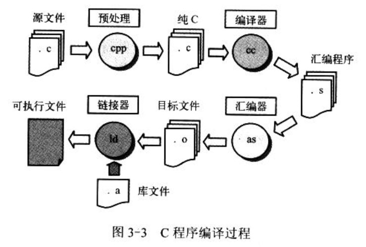

- 3.3　C 语言程序

    - 3.3.1　C 程序编译和链接

    - 3.3.2　嵌入汇编

    - 3.3.3　圆括号中的组合语句

    - 3.3.4　寄存器变量

    - 3.3.5　内联函数

## 1. C 程序编译和链接

使用 gcc 汇编器编译 C 语言程序时通常经过 4 个阶段, 即预处理阶段、编译阶段、汇编阶段和链接阶段, 如图 3-3.



- 预处理, gcc 会将 C 程序传递给 C 前处理器 cpp, 对 C 语言程序中指示符和宏进行替换处理, 输出纯 C 语言代码;

- 编译, gcc 把 C 语言程序编译生成对应的与**机器相关的 as 汇编语言代码**;

- 汇编, as 汇编器会把汇编代码转换成机器指令, 并以特定二进制格式输出在目标文件中;

- 链接, GNU ld 链接器会将程序相关目标文件组合链接在一起, 生成程序的可执行映像文件.


gcc 调用的命令格式与编译汇编语言的格式类似:

```
gcc [选项] [-o outfile] infile ...
```

其中 infile 是输入的 C 语言文件; outfile 是编译产生的输出文件.

对于某次编译过程, 并非一定要全部执行这 4 个阶段, 使用命令行选项可以令 gcc 编译过成在某个阶段停止. 例如, 使用"-S"可以让 gcc 在输出了 C 程序对应的汇编语言程序后就停止运行; 使用"-c"可以让 gcc 只生成目标文件而不执行连接.

```
gcc -o hello hello.c
gcc -S -o hello.s hello.c
gcc -c -o hello.o hello.c
```

在编译像 Linux 内核这样的包含很多源程序文件的大型程序时, 通常使用 make 工具对整个程序的编译过程进行自动管理.

## 2. 嵌入汇编

具有输入输出参数的嵌入汇编语句的基本格式为:

```
asm("汇编语句"
    : 输出寄存器
    : 输入寄存器
    : 会被修改的寄存器);
```

除了第一行外, 后面带冒号的行若不使用就可以省略. 其中, "asm"时内联汇编语句关键词;

- "汇编语句"是写汇编指令的地方;

- "输出寄存器"表示当这段嵌入汇编执行完后, 哪些寄存器用于存放输出数据. 这些寄存器会分别对应一 C 语言表达式值或一个内存地址;

- "输入寄存器"表示在开始执行汇编代码时, 这里指定的一些寄存器中应放入的输入值, 它们分别对应一 C 变量或常数值.

- "会被修改的寄存器"表示你已经对其中列出的寄存器中的值进行了改动, gcc 编译器不能再依赖于它原先对这些寄存器加载的值. 如果有必要, gcc 需要重新加载这些寄存器.

## 3. 圆括号中的组合语句

## 4. 寄存器变量

## 5. 内联函数