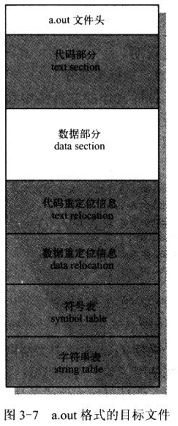

- 3.5　Linux 0.12 目标文件格式

    - 3.5.1　目标文件格式

    - 3.5.2　Linux0.12 中的目标文件格式

    - 3.5.3　链接程序输出

    - 3.5.4　链接程序预定义变量一

    - 3.5.5　System.map 文件

Linux0.12 内核使用了两种编译器.

- 第一种是汇编编译器 as86 和相应的链接程序(或称链接器)ld86. 用于编译和链接运行在实地址模式下的 16 位内核引导扇区程序 bootsect.S 和设置程序 setup.s.

- 第二种是 GNU 的汇编器 as(gas)和 C 语言编译器 gcc 以及相应的链接程序 gld. 编译器用于为源程序文件产生对应的二进制代码和数据目标文件. 链接程序用于对相关的所有目标文件进行组合处理, 形成一个可被内核加载执行的目标文件, 即可执行文件.

首先说明编译器产生的目标文件结构, 然后描述链接器如何把需要链接在一起的目标文件模块组合在一起, 以生成二进制可执行映像文件或一个大的模块文件. 最后说明 Linux0.12 内核二进制代码文件 Image 的生成原理和过程. 这里给出的是 Linux 0.12 内核支持的 a.out 目标文件格式的信息. as86 和 ld86 生成的是 MINIX 专门的目标文件格式, 后续给出. 有关目标文件和链接程序的基本工作原理可参考"Linkers & Loaders"书.

这里把编译器生成的目标文件称为目标模块文件(简称模块文件), 链接程序输出的称为可执行文件. 将它们统一称为目标文件.

## 1. 目标文件格式

Linux 0.12 中, GNU gcc 或 gas 输出的目标模块文件和可执行文件都使用了 UNIX 传统的 a.out 格式. 这是一种被称为汇编与链接输出(Assembly & linker editor output)的目标文件格式. 对于有内存分页机制的 OS 来说, 这是一种简单有效的目标文件格式. a.out 格式文件由一个文件头和随后的代码区(text section, 也称为正文段)、已初始化数据区(data section, 也称为数据段)、重定位信息区符号表以及符号名字符串构成, 如图 3-7.其中代码区和数据区通常也被分别称为正文段(代码段)和数据段.



- 执行头(exec header). 包含参数信息(exec 结构), 是有关目标文件的整体结构信息. 例如代码和数据区长度、未初始化数据区的长度、对应源程序文件名以及目标文件创建时间等. 内核使用这些参数将可执行文件加载到内存中并执行, 而链接程序(ld)使用这些参数将一些模块文件组成一个可执行文件. 这是目标文件唯一必要的组成部分.

- 代码区(text segment). 含有程序执行时被加载到内存中的指令代码和相关数据. 只读形式加载.

- 数据区(data segment). 含有已经初始化过的数据, 总是被加载到可读写内存中.

- 代码重定位部分(text relocation). 含有供链接程序使用的记录数据. 在组合目标模块文件时用于定位代码段中的指针或地址. 当链接程序需要改变目标代码的地址时就需要修正和维护这些地方.

- 数据重定位部分(data relocation). 类似上面, 但用于数据段中指针的重定位.

- 符号表部分(symbol table). 含有供链接程序使用的记录数据. 这些数据保存着模块文件中定义的全局符号以及需要从其他模块文件中输入的符号, 或由链接器定义的符号, 用于在模块文件之间对命名的变量和函数(符号)进行交叉引用.

- 字符串表部分(string table). 含有与符号名相对应的字符串, 供调试程序调试目标代码, 与链接程序无关.

由于 Linux 0.12 使用了 Intel CPU 的内存管理功能, 因此它会为每个执行程序单独分配一个 64MB 的地址空间(逻辑地址空间)使用. 在这种情况下, 因为链接器已经把执行文件处理成从一个固定地址开始运行, 所以相关的可执行文件中就不再需要重定位信息.

### 1.1 执行头部分

目标文件的文件头中含有一个长度为 32B 的 exec 数据结构, 通常称为文件头结构或执行头结构. 定义如下. 有关 a.out 结构详细信息见 include/a.out.h 文件后的介绍.

```
struct exec {
  unsigned long a_magic;    /* Use macros N_MAGIC, etc for access 执行文件魔数. 使用 N_MAGIC 等宏访问*/
  unsigned a_text;      /* length of text, in bytes 代码长度, 字节数*/
  unsigned a_data;      /* length of data, in bytes 数据长度, 字节数*/
  unsigned a_bss;       /* length of uninitialized data area for file, in bytes 文件中的未初始化数据区长度, 字节数*/
  unsigned a_syms;      /* length of symbol table data in file, in bytes 文件中的符号表长度, 字节数*/
  unsigned a_entry;     /* start address 执行开始地址*/
  unsigned a_trsize;        /* length of relocation info for text, in bytes 代码重定位信息长度, 字节数*/
  unsigned a_drsize;        /* length of relocation info for data, in bytes 数据重定位信息长度, 字节数*/
};
```

根据 a.out 文件中头结构魔数子段的值, 可将 a.out 格式的文件分为几种类型. Linux0.12 使用其中两种类型:

- 模块目标文件使用了 OMAGIC(Old Magic)类型的 a.out 格式, 它指明文件是目标文件或是不纯的可执行文件. 其魔数是 0x107(八进制 0407).

- 而执行文件则使用了 ZMAGIC 类型的 a.out 格式, 它指明文件为需求分页处理(demand-paging, 即需求加载, load on demand)的可执行文件. 魔数是 0x10b(八进制 0413).

两个区别在于对各部分的存储分配方式上. 虽然该结构的总长度只有 32B, 但是对于一个 ZMAGIC 类型的执行文件, 其文件开始部分却需要专门留出 1KB 的空间给头结构使用. 除了头结构占用 32B, 其余部分均为 0. 从 1024 字节之后才开始放置程序的正文段和数据段等信息. 而对于 OMAGIC 类型的.o 模块文件, 文件开始部分的 32 字节头结构紧接着就是代码区和数据区.

a_text 和 a_data 字段分别指明后面**只读的代码段**和**可读写的数据段**的字节长度. a_bss 字段指明内核在加载目标文件时数据段后面未初始化数据区域(bss 段)的长度. 由于 Linux 在分配内存时会自动对内存清零, 因此 bss 段不需要被包括在模块文件或执行文件中. 为形象地表示目标文件逻辑地具有一个 bss 段, 在后面图示中用虚线来表示目标文件中的 bss 段.


### 1.2

## 2. Linux0.12 中的目标文件格式

## 3. 链接程序输出

## 4. 链接程序预定义变量一

## 5. System.map 文件