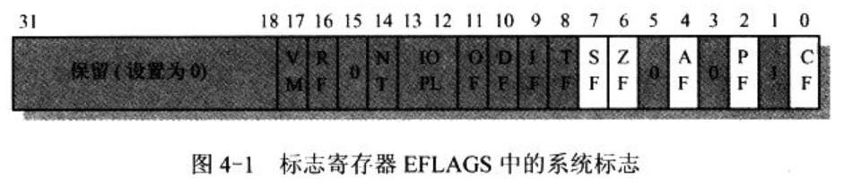
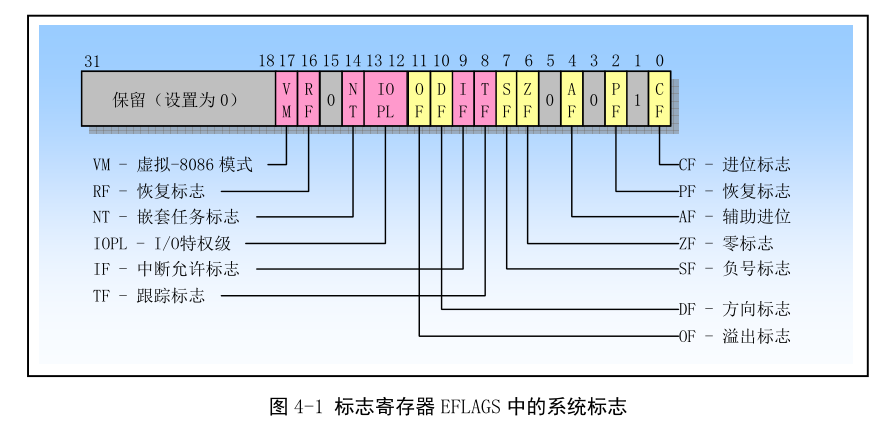
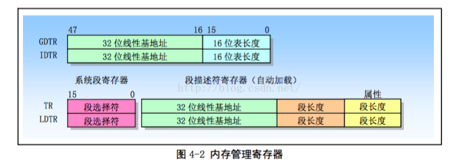
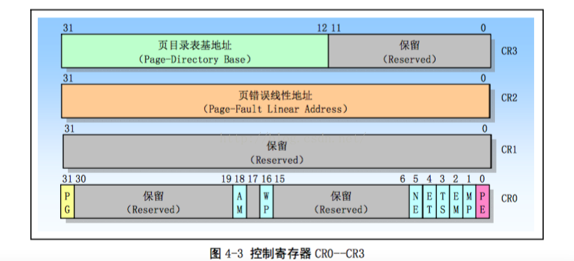
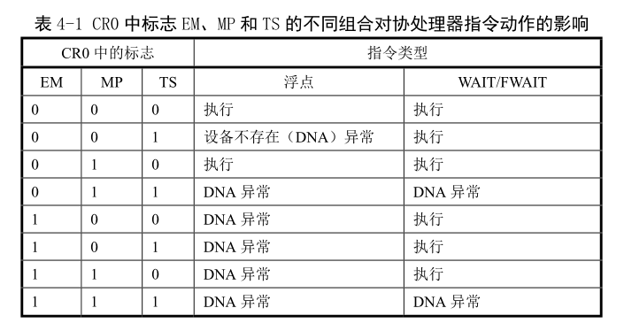
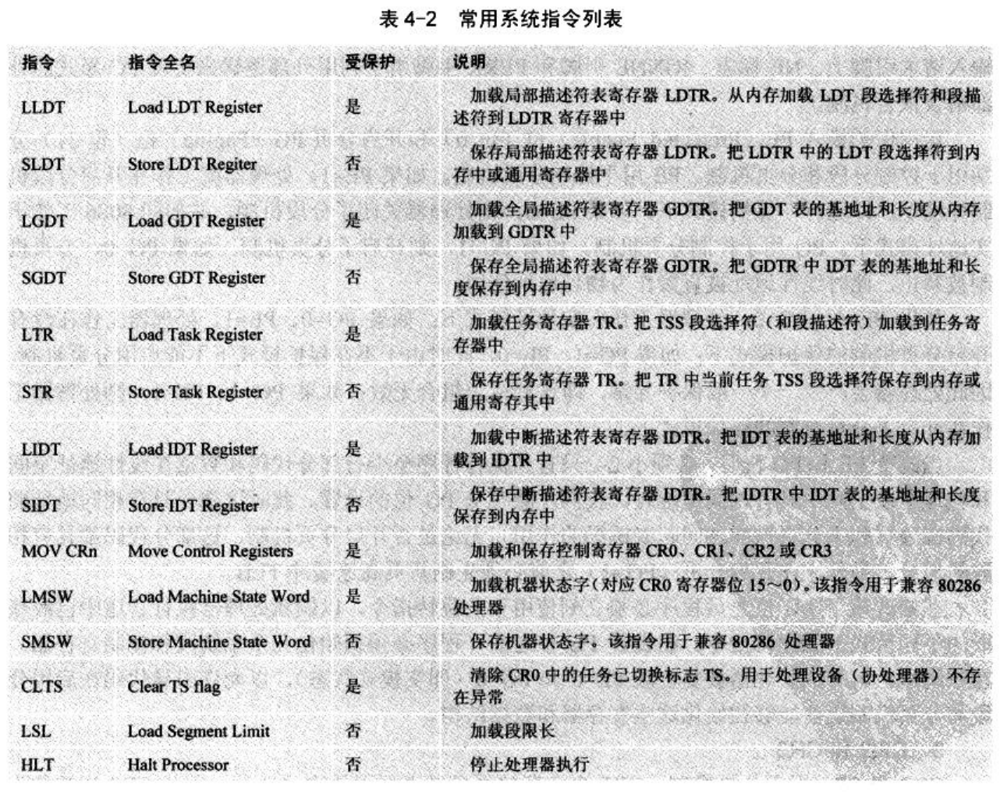

- 4.1 80x86 系统寄存器和系统指令
    - 4.1.1 标志寄存器
    - 4.1.2 内存管理寄存器
    - 4.1.3 控制寄存器
    - 4.1.4 系统指令

## 1. 标志寄存器

标志寄存器 EFLAGS 通常只允许操作系统修改. 我们仅对 EFLAGS 的**系统标志**进行说明.

(1) TF: 位 8 是跟踪标志(Trap Flag). 设置该位可用为**调试操作启动单步执行方式**; 复位则禁止单步执行. 单步执行方式中, 处理器在**每个指令执行后产生一个调试异常**, 这样就可以观察执行程序在执行每条指令后的状态. 如果程序使用**POPF**、**POPFD**或**IRET 指令**设置了 TF, 那么在随后指令之后处理器就会产生一个调试异常.

(2) IOPL: 位 12、13 是 I/O 特权级(I/O Privilege Level)字段. 该字段指明**当前运行程序或任务的 I/O 特权级 IOPL**. 当前运行程序或任务的 CPL 必须小于或等于这个 IOPL 才能访问**I/O 地址空间**. 只有当 CPL 为特权级 0 时候, 程序才能使用**POPE 或 IRET 指令**修改这个字段. IOPL 也是控制对 IF 标志修改的机制之一.

(3) NT: bit 14 是**嵌套任务标志**(Nested Task).  它控制着**被终端任务和调用任务之间的链接关系**. 在使用**CALL 指令**,  **中断**或 **异常**执行任务调用时候, CPU 会设置该 flag.  在通过使用 IRET 指令从一个任务返回时候, CPU 会检查并修改这个 NT flag.  使用**POPF/ POPFD 指令**也可以修改这个标志, 但是在应用程序中改变这个 flag 的状态会产生不可意料的异常.

(4) RF: bit 16 是恢复标志(Resume Flag).  该 flag 用于**控制 CPU 对断点指令的响应**. 当设置时, 这个 flag 会临时禁止断点指令产生的调式异常:  当该 flag 复位时候, 则断点指令将会产生异常. RF 标志的主要功能是运行在调式异常之后重新执行一条指令. 当调试团结使用 IRETD 指令返回被中断程序之前, 需要设置堆栈上 EFLAGS 内存中的 RF flag, 以防止指令断点造成另一个异常. CPU 会在返回之后自动地清除该 flag,  从而再次允许指令断点异常.

(5) VM : bit 17 是**虚拟 8086 模式**(Virtual 8086 Mode)标志. 当设置该标志时, 就开启虚拟-8086 方式:  当复位该标志时, 则回到保护模式.

## 2. 内存管理寄存器

详细内容见 Computer_Architecture/x86/cpu 下内容

处理器提供**4 个内存管理寄存器**(GDTR、LDTR、IDTR 和 TR), 用于指定**内存分段管理**所用**系统表**的基地址, 如图 4-2. 处理器为这些寄存器的加载和保存提供了特定指令. 系统表作用参见"保护模式内存管理".

GDTR,LDTR,IDTR 和 TR 都是段基址寄存器, 这些段中含有分段机制的重要信息表. GDTR, IDTR 和 LDTR 用于寻址存放描述符表的段. **TR 用于寻址一个特殊的任务状态段 TSS** (Task State Segment).  **TSS 段包含着当前执行任务的重要信息**.

(1) 全局描述表寄存器 GDTR

用于存放全局描述符表 GDT 的 32 bit 线性基地址 和 16 bit 表长度值. 基地址指定 GDT 表中字节 0 在**线性地址空间**中的地址, 表长度指明 GDT 表的字节长度值.

指令 LGDT 和 SGDT 分别用于加载和保存 GDTR 寄存器的内容.  在机器刚加电或 CPU 复位后, 基地址被默认的设置为 0, 而长度值被设置成 0xFFFF. 在保护模式初始化过程必须给 GDTR 加载一个新值.

(2) 中断描述符表寄存器 IDTR

与 GDTR 的 作用类似, IDTR 寄存器用于存放中断描述表 IDT 的 32 bit 线性基地址 和 16bit 表长度值.

指令 LIDT 和 SIDT 分别用于加载和保存 IDTR 寄存器的内容.  在机器刚加电或 CPU 复位后,  基地址被默认的设置为 0, 而长度值设置为 0xFFFF.

(3) 局部描述符寄存器 LDTR

用于存放局部描述表 LDT 的 32 bit 线性基地址.  16 bit 段限长和描述符属性值.

指令 LLDT 和 SLDT 分别用于加载和保存 LDTR 寄存器的段描述符部分. 包含 LDT 表的段必须在 GDT 表中有一个段描述符项.  当使用 LLDT 指令把还有 LDT 表段的选择符加载进 LDTR 时,  LDT 段描述符的段基地址, 段限长度以及描述符属性会被自动地加载到 LDTR 中, 当进行任务切换时候, 段选择符 和基地址被默认地设置为 0 , 而长度被设置为 0xffff.

(4) 任务寄存器 TR

用于存放当前任务 TSS 段的 16 bit 段选择符, 32 bit 基地址,  16bit 段长度和描述符属性值. 它引用 GDT 表中的一个 TSS 类型的描述符.  指令 LTR 和 STR 分别用于加载和保存 TR 寄存器的段选择符部分.  当使用 LTR 指令把选择符加载进任务寄存器时候, TSS 描述符中的段基地址, 段限长度以及描述符属性会被自动地加载到任务寄存器中. 当执行任务切换时, 处理器会把新任务 TSS 的段选择符合段描述符自动地加载进任务寄存器 TR 中.

## 3. 控制寄存器

控制寄存器(CR0,  CR1,  CR2 和 CR3)用于**控制和确定处理器的操作模式**以及**当前执行任务**的特性, 见图 4-3 所示.

CR0 中含有控制**处理器操作模式**和**状态**的系统控制状态:

CR1 保留不用;

CR2 含有**导致页错误的线性地址**.

CR3 中含有**页目标表物理内存基地址**, 因此该寄存器也被称为**页目录基地址寄存器**PDBR (Page Directory Base address Register).

### 3.1 CR0 中协处理器控制位

CR0 的 4 个 bit :  扩展类型位 ET、任务切换位 TS、仿真位 EM 和数学存在位 MP 用于控制**80x86 浮点(数学)协处理器**的操作.  有关协处理器的详细说明请参见其他资料内容.

CR0 的 ET bit (标志)用于选择与协处理器进行通信所使用的协议, 即指明系统中使用的是 80387 还是 80287 协处理器.

TS, MP 和 EM bit 用于确定**浮点指令或 WAIT 指令**是否应该产生一个设备部存在 DNA (Device Not Available) 异常. 这个异常可以用来仅仅为使用浮点运算的任务保存和恢复浮点寄存器. 对于没有使用浮点运算的任务, 这样做可以加快它们之间的切换操作.

(1) ET :  CR0 的 bit 4 是扩展类型(Extension Type) 标志. 当该标志位 1 时,  表示指明系统用 80387 协处理器存在, 并使用 32bit 协处理器协议.  ET =0 指明使用 80287 协处理器.  如果仿真位 EM =1,  则该位将被忽略.  在处理器复位操作时, ET bit 会被初始化指明系统中使用的协处理器类型.  如果系统有有 80387 , 则 ET 被设置为 1, 否则如果有一个 80287 或没有协处理器, 则 ET 被设置为 0.

(2) TS : CR0 的 bit 3 是任务已切换(Task Switched) 标志.  该标志用于推迟保存任务切换时的协处理器内容, 直到新任务开始实际执行协处理器指令. 处理器在每次任务切换时都会设置该标志, 并且在执行协处理器指令时测试该 flag. 如果这是了 TS 标志并且 CR0 的 EM 标志位 0,  那么在执行任何协处理器指令之前会产生一个设备不存在 DNA (Device Not Available)异常.

如果设置了 TS 但没有设置 CR0 的 MP 和 EM 标志, 那么在执行协处理器指令 WAIT /FWAIT 之前不会产生设备不存在异常. 如果设置了 EM 标志, 那么 TS 标志对协处理器指令的执行无影响, 见表 4-1

在任务切换时, 处理器并不自动保存协处理器的上下文, 但是会设置 TS 标志. 这个标志会使得处理器在执行新任务指令流的任何时候遇到一条协处理器指令时产生设备不存在异常. 设备不存在异常的处理程序可使**CLTS 指令**清除 TS 标志, 并且保存协处理器的上下文. 如果任务从没有使用过协处理器, 那么相应协处理器上下文就不用保存.

(3) EM :  CR0 的 bit 2 是仿真标志(EMulation).  当该 bit 设置时候, 表示**处理器没有内部或外部协处理器**, 执行协处理器指令时会引起设备不存在异常;  当清除时, 表示系统有协处理器. 设置这个 flag 可以**迫使所有浮点指令使用软件**来模拟.

(4)MP :  CR0 的 bit 1 是监控协处理器标志(Monitor ). 用于控制 WAIT /FWAIT 指令与 TS 标志的交互作用.  如果 MP=1、TS =1, 那么只需 WAIT 指令将产生一个设备不存在异常;  如果 MP =0,  则 TS 标志不会影响 WAIT 的执行.

### 3.2 CR0 中保护控制 bit

(1) PE :  CR0 的 bit 0 是启用保护(Protection Enable)模式标志. 当设置该 bit 时即**开启了保护模式**:  当复位时即进入了**实模式**. **这个标志仅仅开启段级保护, 而并没有启用分页机制**. 如果要启用分页机制, 那么 PE 和 PG 标志都要置位.

(2) PG :  CR0 的 bit 31 是**分页**(Paging)标志. 当设置该位时即开启了分页机制;  **当复位时则禁止分页机制, 此时所有线性地址等同于物理地址**.  在开启这个标志之前必须已经或者同时开启 PE 标志. 即若要启用分页机制, 那么 PE 和 PG 标志都要置位.

(3) WP : 对于 Intel 80486 或者以上的 CPU,  CR0 的位 16 是**写保护**(Write Protect)标志. 当设置该标志时, 处理器会禁止超级用户程序(例如特权级 0 -》R0 的程序)向用户级只读页面执行写操作; 当该位复位时则反之. 该标志有利于 UNIX 类操作系统在**创建进程时实现写时复制**(Copy on Write) 技术.

(4) NE :  对于 Intel 80486 或以上的 CPU, CR0 的 bit 5 是协处理器错误(Numerical Error)标志. 当设置该标志时, 就启用了 x87 协处理器错误的内部报告机制; 若复位该标志, 那么就使用 PC 机形式的 x87 协处理器错误报告机制.

启动保护模式 PE (0 bit) 和开启分页 PG(bit 31)分别用于**控制分段和分页机制**.

PE 用于控制**分段**机制.

- 如果 PE =1, 处理器就工作在开启**分段机制环境下,  即运行在保护模式**下;

- 如果 PE =0, 则处理器关闭了分段机制, 并如同 8086 工作于**实模式**下.

PG 用于控制分页机制.

- 如果 PG =1, 则开启了分页机制.

- 如果 PG =0, 分页机制被禁止, 此时**线性被直接作为物理地址**使用.

如果 PE=0, PG=0 , 处理器工作在**实地址模式**下;

如果 PE=1, PG=0, 处理器工作在没有开启分页机制的**保护模式**下;

如果 PE=0, PG=1. 此时由于**不在保护模式下不能启用分页机制**, 因此处理器会产生一个一般保护异常, 即这种**标志组合无效**;

如果 PG=1,  PE =1, 则处理器工作在开启了分页机制的保护模式下.

当改变 PE 和 PG bit 时, 必须小心.

只有当执行程序起码有部分代码和数据在**线性地址空间**和**物理地址**中具有**相同地址**时, 我们**才能改变 PG**位的设置. 此时这部分具有相同地址的代码在分页和未分页世界之间起着桥梁的作用. 无论是否开启分页机制, 这部分代码都具有相同的地址 . 另外, 在开启分页(PG=1) 之前必须先刷新 CPU 中的**页高速缓冲**(或称为转换查找缓冲区 TLB - translation Lookaside Buffers).

在修改了**PE 位**之后程序必须要**立刻使用一条跳转指令**, 以刷新处理器执行管道中已经获取的不同模式下的任何指令. 在设置**PE bit 之前**, 程序**必须初始化几个系统段和控制寄存器**. 在系统刚上电时, 处理器 被复位成 **PE =0** 、**PG = 0**(即实模式状态), **以允许引导代码在启用分段和分页机制之前能够初始化这些寄存器和数据结构**.

### 3.3 CR2 和 CR3

CR2 和 CR3 用于分页机制.

CR3 含有存放**页目录表页面的物理地址**, 因此 CR3 也被称为 PDBR.  因为页目录页面是页对齐的, 所以该寄存器只有高 20 bit 是有效的. 而低 12bit 保留提供给更高级处理器使用, 因此在往 CR3 中加载一个新值时低 12 bit 必须设置为 0.  使用 MOV 指令加载 CR3 时具有让页告诉缓冲无效的副作用. 为了减少地址转换所要求的总线周期数量, 最近访问的**页目录和页表**会被存放在**处理器**的**页高速缓冲器件**中, 该缓冲器被称为转换查找缓冲区 TLB (Translation Lookside Buffer). 只有当 TLB 中不包含要求的页表项时才会使用额外的总线**周期从内存中读取页表项**.  即使 CR0 中的 PG 位于复位状态 (PG =0), 我们也能先加载 CR3. 以允许对分页机制进行初始化. 当切换任务时, CR3 的内容也会随之改变.  但是如果**新任务的 CR3 值与原任务的一样, 处理器就无需刷新高速缓冲**. 这样共享页表的任务可以执行得更快.

CR2 用于出现**页异常报告出错信息**. 在报告异常时, 处理器会把引起异常的**线性地址**存放在 CR2 中. 因此操作系统中的**页异常处理程序**可以通过检查 CR2 的内容来确定线性地址空间中的哪一个页面引发了异常.

## 4. 系统指令

系统指令用于处理系统级别功能, 例如加载系统寄存器, 管理中断等. 多数系统指令只能由**处于特权级 0**的操作系统软件执行, 其余一些指令可以在任何特权级上执行, 因此应用程序也能使用, 表 4-2 中列出了我们将用到的一些系统指令, 其中还指出了它们是否受到保护.

