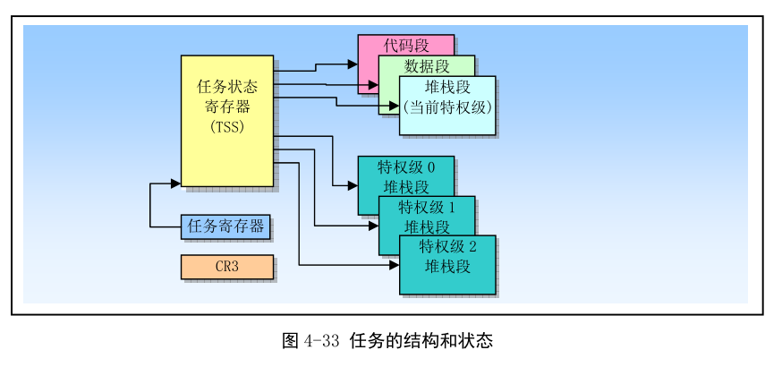
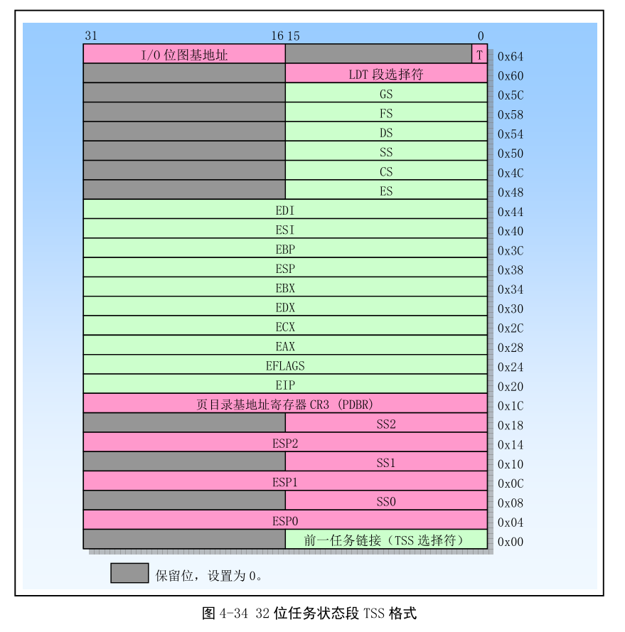
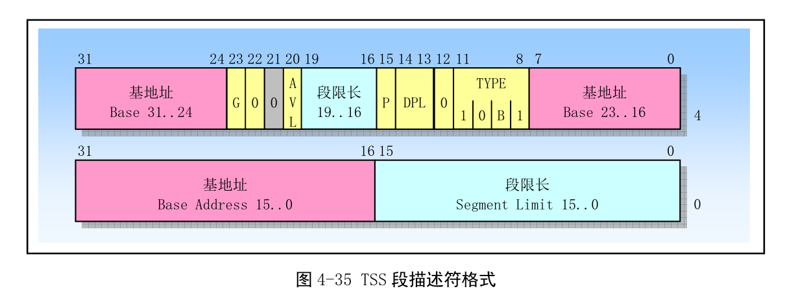
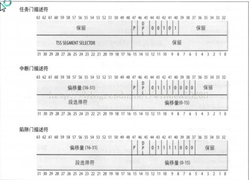
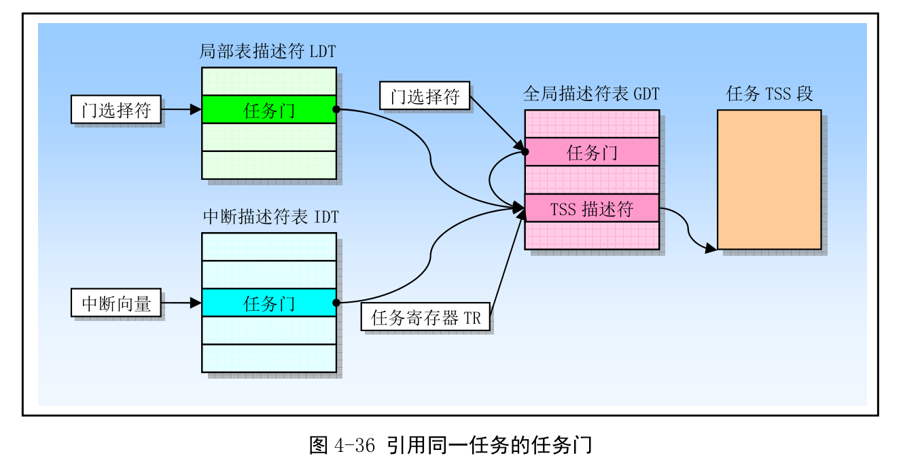
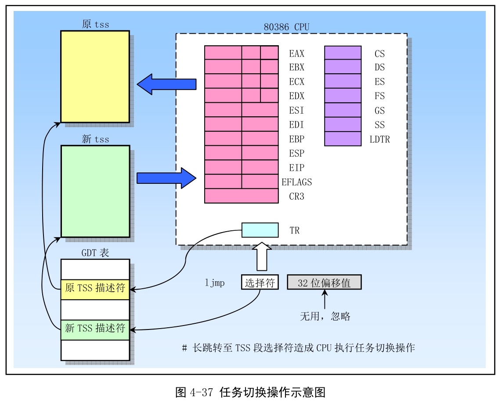
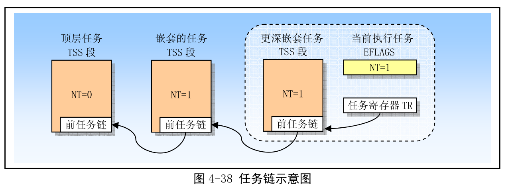
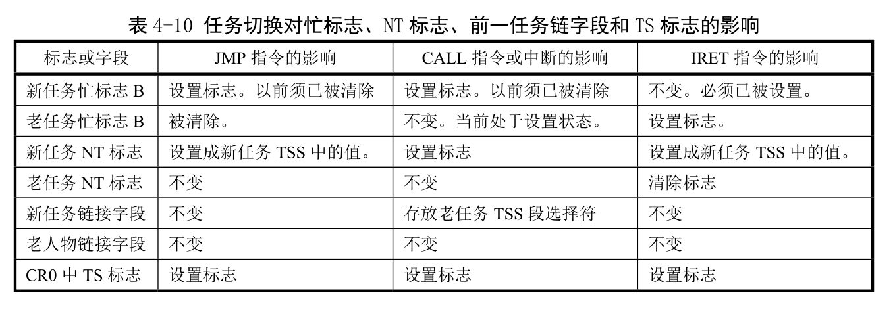

- 4.7 任务管理
    - 4.7.1 任务的结构和状态
    - 4.7.2 任务的执行
    - 4.7.3 任务管理数据结构
    - 4.7.4 任务切换
    - 4.7.5 任务链
    - 4.7.6 任务地址空间

任务(Task)是处理器可以分配、调度、执行和挂起的一个工作单元. 它可用于执行程序、任务或进程、操作系统服务、中断或异常处理过程和内核代码.

80x86 提供了一种机制, 可以用来保存任务的状态、分派任务执行以及从一个任务切换到另一个任务. 当工作在保护模式下, 处理器所有运行都在任务中. 即使简单系统也必须至少定义一个任务. 更复杂系统可以使用处理器的任务管理来支持多任务应用.

80x86 提供了多任务的硬件支持. **通过中断、异常、跳转或调用, 可以执行一个任务**. 当这些控制转移形式之一和某个描述符表中指定项的内容一起使用时, 这个描述符就是一类导致新任务开始执行的描述符. 描述符表中与任务相关的**描述符**有两类: **任务状态段描述符和任务门**. 当执行权传给这任何一类描述符时, 都会造成任务切换.

**任务切换不会把任何信息压入堆栈中, 处理器的状态信息都被保存在内存中称为任务状态段(Task State Segment)的数据结构中**.

## 1. 任务的结构和状态

一个任务由两部分组成: 任务执行空间和 TSS. 任务**执行空间包括代码段、堆栈段和一个或多个数据段**. 如图. 若 OS 使用了处理器的**特权级保护机制**, 那么任务执行空间就需要为**每个特权级**提供一个**独立的堆栈空间**. TSS 中会存放每个特权级的堆栈段的指针. TSS 指定了构成任务执行空间的各个段, 并且为任务状态信息提供存储空间. 在多任务环境中, TSS 也为任务之间的链接提供处理方法.

一个任务的使用是由其 TSS 的段选择符来指定. 当一个任务被加载进处理器中执行, 那么该任务的段选择符、基地址、段限长以及 TSS 段描述符属性就会被加载进任务寄存器 TR(Task Register)中. 如果使用了分页机制, 那么任务使用的页目录表基地址就会被加载进控制寄存器 CR3 中, 当前**执行任务的状态**由处理器的以下内容组成:

- 所有通用寄存器和段寄存器信息.

- 标志寄存器 EFLAGS、程序指针 EIP、控制寄存器 CR3、任务寄存器和 LDTR 寄存器.

- 段寄存器指定的任务当前执行空间.

- I/O 映射位图基地址和 I/O 位图信息(在 TSS 中).

- 特权级 0、1 和 2 的堆栈指针(在 TSS 中).

- 链接至前一个任务的链指针(在 TSS 中).

## 2. 任务的执行

软件或处理器可以用以下方法之一来调度一个任务:

- 使用 CALL 指令明确地调用

- 使用 JMP 指令命令跳转(Linux 使用)

- (处理器)隐含调用一个中断句柄处理任务

- 隐含地调用一个异常句柄处理任务

所有方法都会使用一个指向**任务门或任务 TSS 段**的**选择符**来确定一个任务. 当使用 CALL 或 JMP 调度时, 指令中的选择符既可以直接选择任务的 TSS, 也可选择存放有 TSS 选择符的任务门. 当调度一个任务来处理一个中断或异常, IDT 中该中断或异常表项必须是一个任务门, 并且其中含有中断或异常处理任务的 TSS 选择符.

当调度一个任务, 会自动发生任务切换. 切换期间, 当前运行任务的执行环境(任务状态或上下文)会被保存到它 TSS 中并暂停该任务执行. 新任务会被加载到处理器中, 并从加载的 EIP 指向的指令出开始执行新任务.

调用者调用了被调用者, 调用者的**TSS 段选择符**会被保存在被调用者 TSS 中, 从而提供一个返回调用者的链接. 对于所有 80x86 处理器, 任务是不可递归调用的.

**中断或异常可以通过切换到一个任务来处理**. 这时, 处理器不仅能执行任务切换来处理中断或异常, 而且也会**在中断或异常处理任务返回时自动切换回被中断的任务中**. 这种方式可以处理在中断任务执行时发生的中断.

任务切换的一部分, 处理器也会切换到另一个 LDT 和 CR3.

使用处理器的任务管理功能来处理多任务应用时可选的, 也可用软件来实现多任务.

## 3. 任务管理数据结构

处理器定义了以下支持多任务的寄存器和数据结构:

- 任务状态段 TSS、
- TSS 描述符、
- 任务寄存器 TR、
- 任务门描述符
- 标志寄存器 EFLAGS 中的 NT 标志.

使用这些数据结构, 处理器可以从一个任务切换到另一个任务, 同时保存原任务上下文, 以允许任务重新执行.

### 3.1 任务状态段

下图给出 32 位 CPU 使用的 TSS 的格式. TSS 大小最小是 104 字节(0x64 + 4 字节), 可能会更大. TSS 中各字段可分为两大类: 动态字段和静态字段.

(1) 动态字段. 当任务切换而被挂起时, 处理器会更新动态字段的内容.

- 通用寄存器字段. 保存 EAX、ECX、EDX、EBX、ESP、EBP、ESI 和 EDI 寄存器的内容.

- 段选择符字段. 用于保存 ES、CS、SS、DS、FS 和 GS 段寄存器的内容.

- 标志寄存器 RFLAGS 字段, 切换之前保存.

- 指令指针 EIP 字段. 切换之前保存 EIP 寄存器内容.

- 先前任务链接字段. 含有前一个任务 TSS 段选择符(在调用、中断或异常激活的任务切换时更新). 该字段(通常也称为后链接字段(Back link field))允许任务使用 IRET 指令切换到前一个任务.

(2) 静态字段. 处理器会读取静态字段的内容, 但通常不改变. 这些是在任务被创建时设置的.

- LDT 段选择符字段. 含有任务的 LDT 段的选择符.

- CR3 控制寄存器字段. 含有任务使用的页目录物理基地址. CR3 通常也被称为页目录基地址寄存器(Page directory base register, PDBR)

- 特权级 0、1、2 的堆栈指针字段. 这些堆栈指针由堆栈选择符(SS0、SS1 和 SS2)和栈中偏移量指针(ESP0、ESP1、ESP2)组成. 注意, 对于指定的一个任务, 这些字段值不变. 因此, 如果发生任务中发生堆栈切换, 寄存器 SS 和 ESP 内容将变化.

- 调试陷阱(Debug Trap)T 标志字段. 该字段位于字节 0x64 位 0 处. 当设置时, 处理器切换到该任务的操作会产生一个调试异常.

- I/O 位图基地址字段. 该字段含有从 TSS 段开始处到 I/O 许可位图处的 16 位偏移值.

若使用了分页机制, 那么任务切换期间应该避免处理器操作的 TSS 段(前 104 字节)中含有内存页边界. 如果 TSS 这部分包含内存页边界, 那么该边界处两边的页面都必须同时并且连续存在于内存中. 另外, 如果使用了分页机制, 那么与原任务 TSS 和新任务 TSS 相关的页面, 以及对应的描述符表项应该是可读写的.

### 3.2 TSS 描述符

与其他段一样, 任务状态段 TSS 也是使用段描述符来定义的. 下图给出 TSS 描述符的格式. **TSS 描述符只能存放在 GDT 中**.

类型字段 TYPE 中的忙标志 B 用于指明任务是否处于忙状态. 忙状态的任务是当前正在执行的任务或等待执行(被挂起)的任务. 值为 0b1001 的类型字段表明任务处于非活动状态; 而值为 0b1011 的类型字段表示任务正忙. 任务是**不可以递归执行**的, 因此处理器使用**忙标志 B 来检测**任何企图对被中断执行任务的调用.

其中基地址、段限长、描述符特权级 DPL、颗粒度 G 和存在位具有与数据段描述符中相应字段同样的功能. 当 G=0 时, 限长字段必须具有等于或大于 103(0x67)的值, 即 TSS 段的最小长度不得小于 104 字节. 若 TSS 段中还包含 I/O 许可位图, 那么 TSS 段长度需要更大一些.

若使用跳转或调用指令, 任何可以访问 TSS 描述符的程序都能造成任务切换. 可以访问 TSS 描述符的程序其 CPL 数值必须小于等于 TSS 描述符的 DPL. **多数系统, TSS 的 DPL 应该设置为小于 3. **这样, 只有具有特权级的软件才能执行任务切换. 多任务应用中, 某些 TSS 可以设为 3, 使得在用户特权级上也能任务切换.

访问一个 TSS 段描述符并没有给程序读写该描述符的能力. 若想读或修改一个 TSS 段描述符, 可使用映射到内存相同位置的数据段描述符(即别名描述符)来操作. 把 TSS 描述符加载进任何段寄存器将导致一个异常. 企图使用 TI 标志置位的选择符(即当前 LDT 中的选择符)来访问 TSS 段也将导致异常.

### 3.3 任务寄存器

任务寄存器 TR(Task Register)中存放 16 位的段选择符以及当前任务 TSS 段的整个描述符(不可见部分). 这些信息是从 GDT 中当前任务的 TSS 描述符中复制过来的. 处理器使用任务寄存器 TR 的不可见部分来缓冲 TSS 段描述符内容.

指令 LTR 和 STR 用于加载和保存任务寄存器的可见部分, 即 TSS 段的选择符. LTR 指令只能被特权级 0 的程序执行. LTR 指令通常用于系统初始化期间给 TR 寄存器加载初始值(例如, 任务 0 的 TSS 段选择符), 随后在系统运行阶段, TR 内容会在任务切换时自动地被改变.

### 3.4 任务门描述符

任务门描述符(Task gate desctiptor)提供对一个任务间接、受保护的引用, 格式见图. **任务门描述符可以被存放在 GDT、LDT 或 IDT 表中**.

任务门描述符中的 TSS 选择符字段指向**GDT 中**的一个 TSS 段描述符. 这个 TSS 选择符字段中的 RPL 域不可用. 任务门描述符中的 DPL 用于在任务切换时控制对 TSS 段的访问. 当程序通过任务门调用或跳转到一个任务时, 程序的 CPL 以及指向任务门的门选择符的 RPL 值必须小于或等于任务门描述符中的 DPL. 请注意, 当使用任务门时, 目标 TSS 段描述符的 DPL 忽略不用.

程序可以通过任务门描述符或 TSS 段描述符来访问一个任务. 下图时 LDT、GDT 和 IDT 表中的任务门如何都指向同一个任务.

## 4. 任务切换

处理器可使用下面 4 中方式之一执行任务切换操作:

1.　当前任务对 GDT 中的 TSS 描述符执行 JMP 或 CALL 指令;

2.　当前任务对 GDT 或 LDT 中的任务门描述符执行 JMP 或 CALL 指令;

3.　中断或异常向量指向 IDT 表中的任务门描述符;

4.　当 EFLAGS 中的**NT 标志置位**时当前任务执行**IRET 指令**.

**JMP、CALL 和 IRET 指令以及中断和异常都是处理器的普通机制, 可用于不发生任务切换的环境中**. 对于 TSS 描述符或任务门的引用(当调用或跳转到另一个任务), 或者 NT 标志的状态(当执行 IRET 指令时)确定了是否会发生任务切换.

为进行任务切换, JMP 或 CALL 指令能把控制转移到 TSS 描述符或任务门上. 使用这两种方式的作用相同, 都会导致处理器把控制转移到指定的任务中, 如图.

当中断或异常的**向量索引**的是 IDT 中一个任务门时, 一个中断或异常就会造成任务切换. 若向量索引的时 IDT 中的一个**中断或陷阱门**, 则不会发生任务切换.

中断服务过程总是把执行权返回到被中断的过程中, 被中断的过程可能在另一个任务中. 若 NT 标志处于复位状态, 则执行一般返回处理. 若 NT 标志是置位状态, 返回操作会产生任务切换. 切换到的新任务由中断服务过程 TSS 中的 TSS 选择符(前一任务链接字段)指定.

当切换到一个新任务时, 处理器会执行以下操作:

1): 从作为 JMP 或 CALL 指令**操作数**中, 或者从**任务门**中, 或者从当前 TSS 的前一任务链接字段(对于由**IRET**引起的任务切换)中取得新任务的 TSS 段选择符.

2): 检查当前任务是否允许切换到新任务. 把数据访问特权级规则应用到 JMP 和 CALL 指令上. 当前任务的 CPL 和**新任务段选择符**的 RPL 必须小于或等于 TSS 段描述符的 DPL,或者引用的是一个任务门. **无论目标任务门或 TSS 段描述符的 DPL 是何值, 异常、中断(除了使用 INT n 指令产生的中断)和 IRET 指令都允许执行任务切换**. 对于 INT n 指令产生的中断将检查 DPL.

3): 检查新任务的 TSS 描述符是标注为存在的(p=l),并且 TSS 段长度有效(大于 0x67). 当试图执行会产生错误的指令时, 都会恢复对处理器状态的任何改变. 这使得异常处理过程的返回地址指向出错指令, 而非出错指令随后的一条指令. 因此异常处理过程可以处理出错条件并且重新执行任务. 异常处理过程的介入处理对应用程序来说是完全透明的.

4): 如果任务切换产生自 **JMP 或 IRET 指令, 处理器就会把当前任务(老任务) TSS 描述符中的忙标志 B 复**位; 如果任务切换是由 CALL 指令、异常或中断产生, 则忙标志 B 不动.

5): 如果任务切换由 IRET 产生, 则处理器会把临时保存的 EFLAGS 映像中的 NT 标志复位: 如果任务切换由 CALL、 JMP 指令或者异常或中断产生, 则不用改动上述 NT 标志.

6): 把当前任务的状态保存到当前任务的 TSS 中. 处理器会从任务寄存器中取得当前任务 TSS 的基地址, 并且把一下寄存器内容复制到当前 TSS 中: 所有通用寄存器、段寄存器中的段选择符、标志寄存器 EFLAGS 以及指令指针 EIP

7): 如果任务切换是由 CALL 指令、异常或中断产生, 则处理器就会把从新任务中加载的 EFLAGS 中的 NT 标志置位. 如果任务切换产生自 JMP 或 IRET 指令, 就不改动新加载 EFLAGS 中的标志.

8): 如果任务切换由 CALL、 JMP 指令或者异常或中断产生, 处理器就会设置新任务 TSS 描述符中的忙标志 B. 如果任务切换由 IRET 产生, 则不去改动 B 标志.

9): 使用新任务 TSS 的段选择符和描述符加载任务寄存器 TR(包括隐藏部分). 设置 CRO 寄存器的 TS 标志.

10): 把新任务的 TSS 状态加载进处理器. 这包括 LDTR 寄存器、 PDBR(CR3)寄存器、 EFLAGS 寄存器、 EIP 寄存器以及通用寄存器和段选择符. 在此期间检测到的任何错误都将出现在新任务的上下文中.

11): 开始执行新任务(对于异常处理过程, 新任务的第一条指令显现出还没有执行).

当成功地进行了任务切换操作, 当前执行任务的状态总是会被保存起来. 当任务恢复执行时, 任务将从保存的 EIP 指向的指令处开始执行, 并且所有寄存器都恢复到任务挂起时的值.

当执行任务切换时, 新任务的特权级与原任务的特权级没有任何关系. **新任务在 CS 寄存器的 CPL 字段指定的特权级上开始运行**. 因为各个任务通过它们独立的地址空间和 TSS 段相互隔绝, 并且特权级规则己经控制对 TSS 的访问, 所以在任务切换时软件不需要再进行特权级检查.

每次任务切换都会设置控制寄存器 CRO 中的任务切换标志 TSO 该标志对系统软件非常有用. 系统软件可用 TS 标志来协调处理器和浮点协处理器之间的操作.  TS 标志表明协处理器中的上下文内容可能与当前正在执行任务的不一致.

## 5. 任务链

TSS 的前一任务链(Backlink)字段以及 EFLAGS 中的 NT 标志用于返回到前一个任务操作中. NT 标志指出了当前执行的任务是否是嵌套在另一个任务中执行, 并且当前任务的前一任务连接字段中存放着嵌套层中更高层任务的 TSS 选择符. 如图.

当 CALL 指令、中断或异常造成任务切换, 处理器把当前 TSS 段的**选择符**复制到新任务 TSS 段的前一**任务链接字段**中, 然后再 EFLAGS 中设置**NT 标志**. NT 标志指明 TSS 的前一任务链接字段中存放有保存的 TSS 段选择符. 若软件使用 IRET 指令挂起新任务, 处理器就会使用前一任务链接字段中值和 NT 标志返回到前一个任务中. 即如果 NT 标志是置位的话, 处理器会切换到前一任务链接字段指定的任务中去执行.

注意, 当任务切换是由 JMP 造成, 新任务就不是嵌套的. 即, NT 标志会被设置为 0, 并且不使用前一任务链接字段. JMP 指令用于不希望出现嵌套的任务切换中.

下表总结了任务切换期间, 忙标志 B(再 TSS 段描述符中)、NT 标志、前一任务链接字段和 TS 标志(Task Switch, CR0 中)的用法. 注意, 运行于任何特权级上的程序都可以修改 NT 标志, 因此任何程序都可以设置 NT 标志并执行 IRET 指令. 这种做法会让处理器去执行当前任务 TSS 的前一任务链接字段指定的任务. 为了避免伪造的任务切换成功, OS 应该把每个 TSS 的该字段初始化为 0.

## 6. 任务地址空间

任务地址空间由任务能够访问的段构成. 包括代码段、数据段、堆栈段、TSS 中引用的系统段以及任务代码能够访问的任何其他段. 这些段都被映射到线性空间, 随后被直接或分页机制映射到处理器的物理空间中.

TSS 中的**LDT 字段可以用于给出每个任务自己的 LDT**. 对于一个给定的任务, 通过把与任务相关的所有描述符放入 LDT 中, 任务的地址空间就可以与其他任务的隔绝开来.

几个任务也可使用同一个 LDT. 这是简单的多任务通信方式.

开启分页机制, 则 TSS 中的 CR3 寄存器字段可以让每个任务有自己的页表. 或者, 几个任务能共享相同页表集.

### 6.1 把任务映射到线性和物理地址空间

两种方法:

- 所有任务共享一个线性到物理地址空间的映射. 若没有开启分页, 就只能使用这个方法. 当开启分页, 通过让所有任务使用一个页目录. 若支持需求页虚拟存储技术, 则线性地址空间可以超过现有物理地址空间大小.

- 每个任务有自己的线性地址空间, 并映射到物理地址空间. 通过让每个任务使用不同的页目录, 我们就可使用这种映射形式. 因为每次任务切换都会加载 PDBR(CR3), 所以每个任务可以有不同的页目录.

这两种方法, 所有任务的 TSS 都必须存放在共享的物理地址空间区域中, 并且所有任务都能访问这个区域. 为了让处理器执行任务切换而不读取或更新 TSS 时, TSS 地址的映射不会改变, 就需要使用这种映射方式. GDT 所映射的线性地址空间也可以映射到共享的物理地址空间中, 否则就丧失 GDT 作用.

### 6.2 任务逻辑地址空间

为在任务间共享数据, 可使用下面方法之一为数据段建立共享的逻辑到物理地址空间的映射:

- 通过使用 GDT 中的段描述符. 所有任务必须能访问 GDT 中的段描述符. 若 GDT 中某些段描述符指向线性地址的一些段, 并且这些段映射到所有任务共享的物理地址.

- 通过共享的 LDT. 两个或多个任务可以使用同一个 LDT, 如果它们 TSS 中 LDT 字段指向同一个 LDT. 如果一个共享的 LDT 中某些段描述符指向映射到物理地址空间公共区域的段, 那么共享 LDT 的所有任务可以共享这些段中的所有代码和数据. 这种共享务式要比通过 GDT 来共享好, 因为这样做可以把共享局限于指定的一些任务中. 系统中有与此不同 LDT 的其他任务没有访阒这些共享段的权利.

- 通过映射到线性地址空间公共地址区域的不同 LDT 中的段描述符. 如果线性地址空间中的这个公共区域对每个任务都映射到物理地址空间的相同区域, 那么这些段描述符就允许任务共享这些段. 这样的段描述符通常称为别名段. 这个共享方式要比上面给出的式来更好, 因为 LDT 中的其他段描述符可以指向独立的未共享线性地址区域.