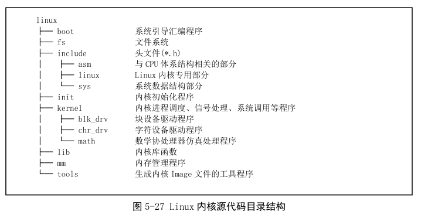
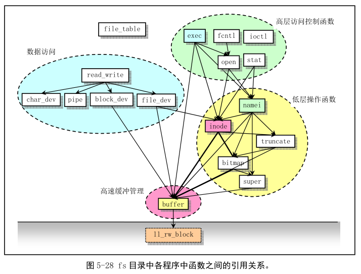
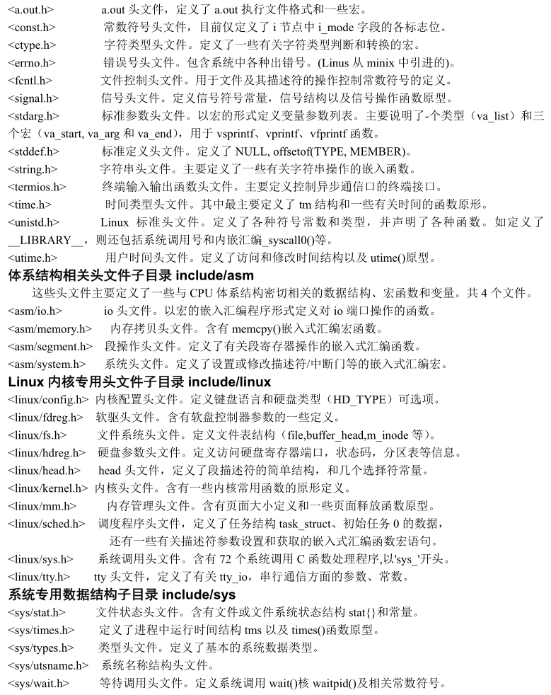
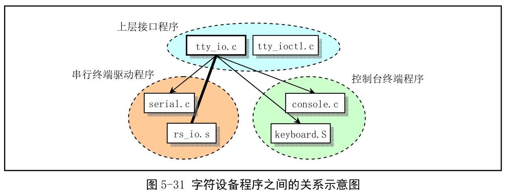

Linux 内核是一种单内核模式的系统, 所以内核中程序依赖和调用关系很密切. 所以很有必须要先熟悉下源码文件的目录结构.

目录结构见下图:

该版本目录 14 个, 102 个代码文件.

## 1. 内核主目录 linux

主目录, 除了 14 个子目录外, 还有一个 Makefile 文件. 该文件是编译辅助工具软件 make 的参数配置文件. make 工具主要是通过识别哪些文件已经被修改过, 从而自动地决定在一个含有多个源文件的程序系统中哪些文件需要被重新编译. 因此, make 工具软件是程序项目的管理软件.

这个 Makefile 还嵌套调用了所有子目录的 Makefile 文件. 这样, 当 linux 以及子目录下任何文件被修改过, make 都会对其重新编译. 因此编译整个内核所有的源文件, 只要在 linux 目录下运行一次 make 软件即可.

## 2. 引导启动程序目录 boot

有 3 个汇编语言文件, 是内核源码文件中最先被编译的程序. 其中 bootsect.S 和 setup.s 需要使用 as86 软件编译, 使用 as86 的汇编语言格式; head.s 使用 GNU as 来编译, 时 AT&T 格式的汇编.

bootsect.S 时磁盘引导块程序, 编译后在磁盘的第一个扇区中(引导扇区, 0 磁道(柱面), 0 磁头, 1 扇区). PC 加电 ROM BIOS 自检后, 将被 BIOS 加载到内存 0x7c00 运行.

setup.s 用于读取机器的硬件配置参数, 并把内核模块 system 移动到合适的内存位置.

head.s 会被编译连接在 system 模块最前部分, 主要进行硬件设备的探测设置和内存管理页面的初始设置工作.

## 3. 文件系统目录 fs

Linux 0.12 采用了 1.0 版本的 MINIX 文件系统, 但 Linux 对其处理方式与 MINIX 系统不同. 主要区别在于 MINIX 对文件系统采用单线程处理方式, 而 Linux 采用多线程方式. 由于多线程, 必须处理多线程带来的竞争条件、死锁等, 因此 Linux 文件系统要复杂得多. 为避免竞争条件的发生, Linux 对资源分配进行了严格检查, 并在**内核模式下运行时, 若任务没有主动睡眠(调用 sleep()), 就不让内核切换任务**.

fs 是文件系统实现程序的目录, 共 18 个 C 文件程序. 这些程序之间引用关系如图. 图中每个方框代表一个文件, 从上到下按基本引用关系放置. 虚线框的程序文件不属于文件系统, 带箭头的线条表示引用关系, 粗线条表示有互相引用关系.

由图可知, 该目录的程序可以划分成 4 个部分: 高速缓冲区管理、低层文件操作、文件数据访问和文件高层函数.

对于**文件系统**, 可以看做是**内存高速缓冲区的扩展部分**. 所有**对文件系统中数据的访问**, 都需要**先读取到高速缓冲区**. 管理高速缓冲区的程序是 buffer.c, 其他程序主要用于文件系统管理.

file\_table.c 文件中, 目前仅定义了一个文件句柄(描述符)结构数组. ioctl.c 引用 kernel/chr\_drv/tty.c 中函数, 实现字符设备的 I/O 控制功能. exec.c 主要包含一个执行程序函数 do\_execve(), 它是所有 exec()函数簇中的主要函数. fcntl.c 用于实现文件 I/O 控制的系统调用函数. read\_write.c 用于实现文件读写和定位的 3 个系统调用函数. stat.c 实现了两个获取文件状态的系统调用函数. open.c 主要包含实现修改文件属性和创建与关闭文件的系统调用函数.

char\_dev.c 主要包含字符设备读写函数 rw\_char(). pipe.c 中包含管道读写函数和创建管道的系统调用. file\_dev.c 中包含基于 i 节点和描述符结构的文件读写函数. namei.c 包括文件系统中目录名和文件名的操作函数和系统调用函数. block\_dev.c 包含块数据读写函数. inode.c 包含针对文件系统 i 节点操作的函数. truncate.c 用于在删除文件时释放文件所占的设备数据空间. bitmap.c 用于处理文件系统中 i 节点和逻辑数据块的位图. super.c 包含对文件系统中超级块的处理函数. buffer.c 主要对内存高速缓冲区进行处理. 虚线框中 ll\_rw\_block 时块设备的底层读函数, 不在 fs 中, 而在 kernel/blk\_drv/ll\_rw\_block.c 中的块设备读写驱动函数. 放这里只是说明, 文件系统对块设备中数据的读写, 都需要通过高速缓冲区与块设备的驱动程序(ll\_rw\_block())来操作进行, 文件系统程序本书不直接与块设备的驱动程序打交道.

## 4. 头文件主目录 include

共有 32 个.h 文件. 各自功能如下, 具体作用以及包含的信息见 14 章.

## 5. 内核初始化程序目录 init

仅有 main.c. 用于内核所有初始化工作, 然后移到用户模式创建新进程, 并在控制台设备上运行 shell 程序.

首先根据机器内存多少对缓冲区内容容量进行分配, 如果还设置了要使用虚拟盘, 则在缓冲区内存后面也为它留下空间. 之后所有硬件的初始化, 包括人工创建第一个任务(task 0), 并设置中断允许. 在执行从内核态移到用户态之后, 系统第一次调用创建进程函数 fork(), 创建出一个用于运行 init()的进程, 在该进程中, 系统将进行控制台环境设置, 并再生成一个子进程用来运行 shell 程序.

## 6. 内核程序主目录 kernel

所有处理任务的程序都保存在 kernel/目录中. 各文件大概引用关系如下.

asm.s 处理硬件异常引起的中断, 对各硬件异常的实际处理程序在 trap.c 中, 在各个中断处理过程中, 将分别调用 traps.c 中相应函数.

exit.c 处理进程终止的系统调用. 进程释放、会话(进程组)终止和程序退出处理函数以及杀死进程、终止进程、挂起等系统调用.

fork.c 给了 sys\_fork()系统调用, 其中使用了 find\_empty\_process()和 copy\_process().

mktime.c 包含一个内核使用的时间函数 mktime(), 用于计算自 1970 年 1 月 1 日 0 时起到开机当日的秒数, 作为开机秒时间. 仅在 init/main.c 被调用一次.

panic.c 包含一个显示内核出错信息并停机函数 panic().

printk.c 包含一个内核专用信息显示函数 printk().

sched.c 包含有关调度的基本函数和一些简单系统调用函数. 还有几个与定时相关的软盘操作函数.

signal.c 包含了有关信号处理的 4 个系统调用以及一个在对应的中断处理程序中处理信号的函数 do\_signal().

sys.c 包含很多系统调用函数, 有些没实现.

system\_call.s 实现 Linux 系统调用(int 0x80)的接口处理程序, 实际处理在相应处理函数中(分布在整个内核代码).

vsprintf.c 程序实现了现在已经归入标准库函数中的字符串格式化函数.

(1)块设备驱动程序子目录 kernel/blk\_drv

通常, 用户通过文件系统来访问设备的, 因此设备驱动程序为文件系统实现了调用接口. 为高效率使用块设备上数据, 用户程序与块设备之间使用了高速缓冲机制. 访问块设备上的数据时, 系统首先以数据块形式把块设备上的数据读入到高速缓冲区中, 然后提供给用户.

文件关系如图.

blk.h 中定义了 3 个程序中共用的块设备结构和数据块请求结构. hd.c 实现对硬盘数据块进行读/写的底层驱动函数; floppy.c 实现对软盘数据块的读/写驱动函数. ll\_rw\_blk.c 实现底层块设备数据读/写函数 ll\_rw\_block(), 内核中所有其他程序都是通过该函数对块设备进行数据读写. 很多地方都会调用, 尤其在高速缓冲区处理文件 fs/buffer.c 中.

(2)字符设备驱动程序子目录 kernel/chr\_drv

实现了对**串行端口 RS-232、串行终端、键盘和控制台终端设备**的驱动. 下图是文件之间的大致调用层次关系.

tty\_io.c 包含 tty 字符设备读写函数 tty\_read()、tty\_write(), 为文件系统提供上层访问接口. 另外还包括在串行中断处理过程中调用的 do\_tty\_interrupt(), 这将在中断类型为读字符处理中被调用.

console.c 包含控制台初始化程序和控制台写函数 con\_write(), 用于被 tty 设备调用. 对显示器和键盘中断的初始化设置程序 con\_init().

rs\_io.s 实现两个串行接口的中断处理程序. 该程序会根据从中断标识寄存器(端口 0x3fa 或 0x2fa)中取得 4 种中断类型分别处理, 并在类型为读字符的代码中调用 do\_tty\_interrupt().

serial.c 对异步串行通信芯片 UART 进行初始化操作, 并设置两个通信端口的中断向量. 还包括 tty 用于往串口输出的 rs\_write()函数.

tty\_ioctl.c 实现 tty 的 I/O 控制接口函数 tty\_ioctl()以及对 termio(s)终端 I/O 结构的读写, 会在实现系统调用 sys\_ioctl()的 fs/ioctl.c 程序中调用.

keyboard.S 实现了键盘中断处理过程 keyboard\_interrupt.

(3)协处理器仿真和操作程序子目录 kernel/math

math\_emulate()是中断 int7 的中断处理程序调用的. 当机器中没有数学协处理器, 而 CPU 却又执行了协处理器的指令时, 引发该中断. 因此, 使用该中断就可用软件仿真协处理器.

## 7. 内核库函数 lib

完整 C 库很大, 该目录只提供内核需要用的函数.

## 8. 内存管理程序目录 mm

主要用于管理程序对主内存区的使用, 并实现进程逻辑地址到线性地址以及线性地址到物理内存地址的映射操作, 并通过内存分页管理机制, 在进程的虚拟内存页与主内存区的物理内存页之间建立对应关系, 同时真正实现虚拟存储技术.

Linux 内核对内存使用了分页和分段. 首先将 386 的 4GB 虚拟地址空间分成 64 个段, 每段 4MB. 所有内核程序只占第一个段, 并且物理地址与该段线性地址相同. 然后每个任务分配一个段使用. 分页把指定的物理内存页面映射到段内, 检测 fork 创建的任何重复的副本, 并执行写时复制机制.

page.s 包含内存页面异常中断(int 14)处理程序, 主要用于处理程序由于缺页而引起的页异常中断和访问非法地址而引起的页保护.

memory.c 包括对内存初始化的函数 mem\_init(), 有 page.s 的内存处理中断过程调用的 do\_no\_page()和 do\_wp\_page()函数. 创建新进程而执行复制进程操作时, 即使用其中的内存处理函数来分配管理内存空间.

swap.c 管理主内存中物理页面和高速二级存储(硬盘)空间之间的页面交换. 主内存空间不够可将暂时不用的内存页面保存在硬盘中. 缺页异常就首先在硬盘中查看要求的页面是否在硬盘交换空间中.

## 9. 编译内核工具程序目录 tools

build.c 用于将 Linux 各个目录中被分别编译生成的目标代码连接合并成一个可运行的内核映像文件 image.