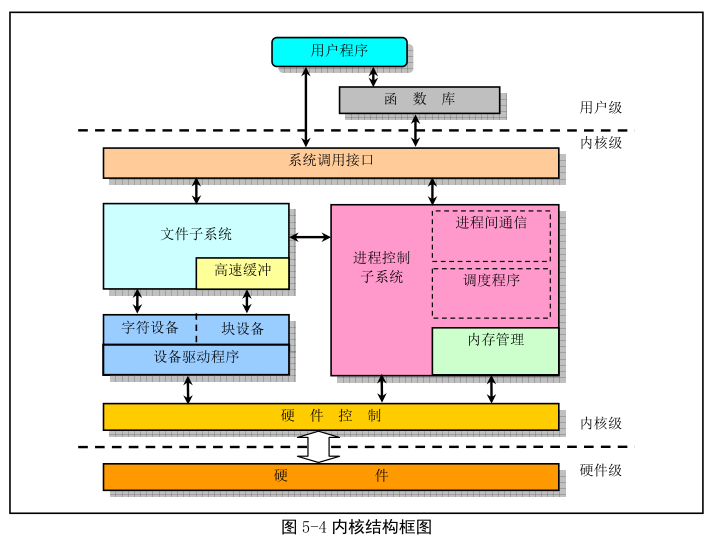

Linux 内核主要有 5 部分: 进程调度模块、内存管理模块、文件系统模块、进程间通信模块和网络接口模块.

进程调度模块负责控制进程对 CPU 的使用. 调度策略各进程能公平合理访问 CPU, 同时保证内核能及时执行硬件操作.

内存管理模块用于确保所有进程能安全共享主内存区, 同时支持虚拟内存管理方式, 使 Linux 支持进程使用比实际内存空间更多的内存容量. 并可以利用文件系统把暂时不用的内存数据交换到外部存储设备上, 当需要时再还换回来.

文件系统模块用于支持对外部设备的驱动和存储. 虚拟文件系统模块通过向所有外部存储设备提供一个通用的文件接口, 隐藏各种硬件设备的不同细节. 从而提供并支持与其他 OS 兼容的多种文件系统格式.

进程间通信模块用于支持多种进程间的信息交换方式.

网络接口模块提供对多种网络通信标准的访问并支持多种网络硬件.

所有模块和进程调度模块有依赖关系. 需要依靠进程调度程序来挂起或重新运行它们的进程.

若从单内核模式结构模型出来, 根据 Linux 0.11 源码结构绘制如下图所示的框图结构.

