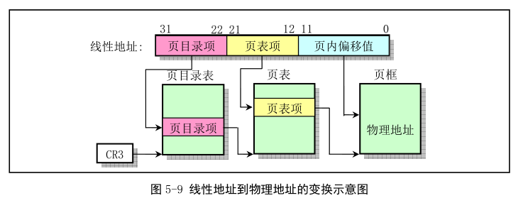
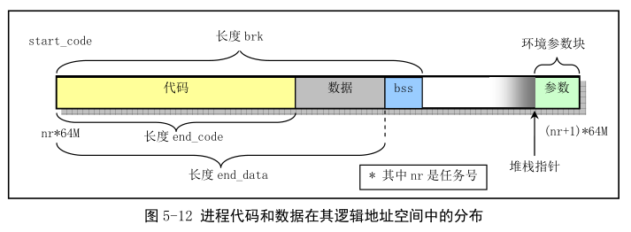

先说明 Linux 0.12 中比较直观的物理内存使用情况, 然后结合 Linux 0.12 内核中应用情况, 再分别概述内存的分段和分页机制以及 CPU 多任务操作和保护方式. 最后综合说明 Linux 0.12 中内核代码和数据以及各个任务的代码和数据在虚拟地址、线性地址和物理地址之间的对应关系.

## 1. 物理内存

Linux 0.12 中, 为有效使用机器中的物理内存, 在系统初始化阶段内存被分为几个功能区域, 见图 5-5.


其中, Linux 内核程序占据物理内存最开始部分, 接下来是硬盘或软盘等快设备使用的高速缓冲区(其中要扣除显卡内存和 ROM BIOS 占据的内存范围 640KB~1MB).

当一个进程需要读取块设备中的数据时, 系统会首先将数据读到高速缓冲区; 当有数据需要写到块设备上时, 系统也是先将数据写到高速缓冲区中, 然后由块设备驱动程序写入到相应的设备上.

对于含有 RAM 虚拟盘的系统, 主内存区头部还要划去一部分, 供虚拟盘存放数据.

最后部分是可供所有程序使用的主内存区.

Linux 同时采用了内存分段和分页管理机制.

## 2. 内存地址空间概念

Linux 0.12 内核中, 进行地址映射操作时, 需要首先分清 3 种地址以及之间的变换概念: 程序(进程)的虚拟和逻辑地址、CPU 的线性地址、实际物理内存地址.

虚拟地址(Virtual Address)由程序产生的由段选择符和段内偏移地址两部分组成. 虚拟地址空间由 GDT 映射的全局地址空间和由 LDT 映射的局部地址空间组成. 最大虚拟地址空间有 64TB.

逻辑地址(Logical Address)指由程序产生的与段相关的偏移地址部分. 保护模式下即代码段或数据段的限长内的偏移地址. 应用程序仅需与逻辑地址打交道, 而分段和分页机制对其是完全透明的. 有些资料不区分逻辑地址和虚拟地址, 统称为逻辑地址.

线性地址(Linear Address)是虚拟地址到物理地址变换中间层. 程序代码产生逻辑地址, 或者说段中的逻辑地址, 加上相应段的基地址, 构成线性地址. Intel 80386 的线性地址空间容量是 4GB.

物理地址(Physical Address)是出现在 CPU 外部地址总线桑的寻址物理内存的地址信号.

虚拟存储(虚拟内存)(Virtual Memory)是指计算机呈现出来的要比实际拥有的内存大得多的内存量. **在 Linux 0.12 内核中, 给每个程序(进程)都划分了总容量为 64MB 的虚拟内存空间**. 因此程序的逻辑地址范围是 0x0000000 到 0x4000000.

## 3. 内存分段机制

一个程序的逻辑地址通过分段机制自动地映射(变换)到中间层地 4GB(2\^32)线性地址空间中. **程序每次对内存的引用都是对内存段中内存的引用**. 整体变换过程如下:


CPU 进行地址转换主要目的是为了解决虚拟内存空间到物理内存空间的映射问题. 通常虚拟内存空间要比实际物理内存量大得多.

虚拟内存管理怎么实现的?首先, 当一个程序需要使用一块不存在的内存时(即在内存页表项中已标出相应内存页面不在内存中), CPU 就需要一种方法来得知这种情况. 通过 80386 的页错误异常中断来实现. 当一个进程引用一个不存在页面中的地址时, 就会触发 CPU 产生页出错异常中断, 并**把引起中断的线性地址放到 CR2 控制寄存器中**. 因此处理器中断的过程就知道发生页异常的确切地址, 此时可以把进程要求的页面从二级存储空间(如硬盘)加载到物理内存中. 如果此时物理内存已经被全部占用, 那么可以借助二级存储空间的一部分作为交换缓冲区(Swapper)把内存中暂时不使用的页面交换到二级缓冲区中, 然后把要求的页面调入内存中. 这就是内存管理的**缺页加载机制**, 在 Linux 0.12 内核中在 mm/memory.c 中实现.

Intel 使用段(Segment)来对程序进行寻址. 每个段定义了内存中的某个区域以及访问的优先级等信息. 见下图.


保存描述符项的描述符表有三种.

**全局描述符表 GDT**(Global Descriptor Table)可被所有程序用于引用访问一个内存段.

**中断描述符表 IDT**(Intertupt Descriptor Table)保存定义中断或异常处理过程的段描述符. IDT 表直接代替了 8086(实模式)中的中断向量表(IVT).

为了在 8086 保护模式下运行, 必须为 CPU 定义一个 GDT 表和一个 IDT 表.

**局部描述符表 LDT**(Local Descriptor Table)用于多任务系统, 通常每个任务一个 LDT 表.

为了让 CPU 能定位 GDT 表、IDT 表和当前的 LDT 表, 需要为 CPU 分别设置 GDTR、IDTR 和 LDTR 寄存器.

每个程序都可由若干个内存段组成. 程序的逻辑地址(虚拟地址)即是用于寻址这些段和段中具体地址位置. Linux 0.12 中, 程序逻辑地址到线性地址的变换使用了 GDT 和 LDT. 由 GDT 映射的地址空间称为全局地址空间, 由 LDT 映射的地址空间称为局部地址空间, 这两部分构成虚拟地址空间. 使用方法如下.


图中画出了有两个任务时候的情况.

可看出, 每个任务的 LDT 本身也是由 GDT 中描述符定义的一个内存段, 在该段中存放着对应的代码段和数据段描述符, 因此 LDT 段很短, 其段限长通常只要 24 字节即可.

同样, 每个任务的任务状态段 TSS 也是由 GDT 中描述符定义的一个内存段. 、, 其限长也只要满足能够存放一个 TSS 数据结构即可.

对于 IDT(中断描述符表), 它保存在内核代码段中.

在 Linux 0.12 中, 内核和各任务的代码段和数据段都分别被映射到线性地址空间中相同基址处, 且段限长一样, 因此内核的数据段和代码段是重叠的, 各任务的代码段和数据段也是重叠的, 参见图 5-10 或 5-11.

任务状态段 TSS(Task State Segment)用于在任务切换时 CPU 自动保存或恢复相关任务的当前执行上下文.

在 Linux 0.12 中, **每个任务的 TSS 段内容被保存在该任务的任务数据结构中**.

另外, Linux 0.12 没有使用到 GDT 中第 4 个描述符(图中 syscall 描述符项). 从 include/linux/sched.h 文件中第 201 行的注释可以猜到, Linus 本来想把系统调用的代码放在这个专门的段中.

```
200  /*
201  * Entry into gdt where to find first TSS. 0-nul, 1-cs, 2-ds, 3-syscall
202  * 4-TSS0, 5-LDT0, 6-TSS1 etc ...
203  */
```

## 4. 内存分页管理

内存分页管理机制的基本原理是将 CPU 整个**线性内存区域**(！！！线性地址是 32 位, 可寻址范围 4GB)划分成 4KB 为 1 页的内存页面, 然后与物理内存地址空间的页面映射. 为在 8086 保护模式下使用分页机制, 需要将控制寄存器 CR0 的最高位(位 31)置位.

使用内存分页管理方法, 每个执行中的进程(任务)可以使用比实际内存容量大得多的连续地址空间. 为能将线性地址映射在容量相对较小的物理内存空间上, 80386 使用了页目录表和页表. 页目录表项和页表项格式基本相同, 都占用 4 字节, 并且**每个页目录表或页表必须只能包含 1024 个项**. 一个页目录表或一个页表分别占用 1 页内存. 两个区别在于页表项有一个已写位 D(Dirty), 页目录项没有.

线性地址到物理地址变化过程如图. **一个页表 1024 项, 一个页表映射内存 1024\*4KB=4MB; 一个页目录表 1024 项, 对应 1024 个页表. 所以一个页目录表就能映射 1024\*4MB=4GB**, 即一个页目录项就可以映射整个线性地址空间范围(线性地址是 32 位).



由于 Linux 0.1x 系统中内核和所有任务都**共用一个页目录表**, 使得**任何时刻处理器线性地址空间到物理地址空间的映射函数都一样**. 因此, **为了让内核和所有任务都不互相重叠和干扰, 它们必须从虚拟地址空间映射到线性地址空间的不同位置**.

对于 Intel 80386, CPU 提供了多达 4GB 的线性地址空间(32 位线性地址). 为使用实际物理内存, 每个进程的线性地址通过二级内存页表动态映射到主内存区域的不同物理内存页上.

由于 Linux 0.12 中把**每个进程最大可用虚拟内存空间定义为 64MB**, 因此**每个进程的逻辑地址通过加上(任务号)\*64MB, 即可转换成线性地址**.

对于 Linux 0.12, 内核设置 GDT 中段描述符项数最大 256, 其中 2 项空闲, 2 项系统使用, 每个进程使用两项(TSS 和 LDT). 因此, 此时系统最多可以容纳(256-4)/2=126 个任务, 并且虚拟地址范围是((256-4)/2)\*64MB 约等于 8GB. 但 0.12 内核中人工定义最大任务数 NR_TASKS=64 个, 每个任务逻辑范围是 64MB, 并且**各个任务在线性地址空间中的起始位置是(任务号)\*64MB**. 因此所有任务**所使用的线性地址空间范围(不是全部空间范围大小, 只不过这里刚好相等了)是**64MB\*64=4GB, 如图 5-10.

图中是当系统具有 4 个任务时的情况. 内核代码段和数据段被映射到线性地址空间的开始 16MB 部分, 并且代码和数据段都映射到同一区域, 完全重叠.

第一个任务(任务 0)由内核"人工"启动运行的, 其代码和数据包含在内核代码和数据中, 因此所占的线性地址范围比较特殊. 任务 0 的代码段和数据段长度是从线性地址 0 开始的 640KB 范围, 其代码和数据段也完全重叠, 并且和内核代码段和数据段有重叠.

实际上, Linux 0.12 中所有任务的指令空间 I(Instruction)和数据空间 D(Data)都合用一块内存, 即同一个进程的所有代码、数据和堆栈都处于同一内存段中.

任务 1 的线性地址空间范围从 64MB 开始的 640KB 长度. 任务 2 和任务 3 分别被映射到线性地址 128MB 和 192MB 的地方, 并且逻辑地址范围是 64MB. 4GB 是 CPU 线性地址空间范围和可寻址的最大物理地址空间范围, 并且把任务 0 和任务 1 的逻辑地址范围看成 64MB 时, 系统中同时可有的任务的逻辑地址范围综合也是 4GB, 因此在 0.12 中容易混淆这三种概念.


下图是任务在虚拟地址空间中的示意图, 所占用的虚拟空间范围也是 4GB. 其中没有考虑内核代码和数据在虚拟空间中所占的范围. 另外, 图中对于进程 2 和进程 3 还分别给出了各自逻辑空间中的代码段和数据段(包含数据和堆栈)的位置.


注意, 进程逻辑地址空间中代码段(Code Section)和数据段(Data Section)的概念和 CPU 中分段机制中的代码段和数据段不是同一个概念. CPU 中分段机制中段确定了在线性地址空间中一个段的用途以及被执行或访问的约束和限制, 每个段可以设置在 4GB 线性地址空间中的任何地方, 可以相互独立也可以完全重叠或部分重叠. 进程在其逻辑地址空间中的代码段和数据段则是指由编译器在编译程序和操作系统在加载程序时规定的在进程逻辑空间中顺序排列的代码区域、初始化和未初始化的数据区域以及堆栈区域. 进程逻辑地址空间中代码段和数据段结构如图 5-12, 图中的 nr 是任务号. 有关逻辑地址空间说明见 13 章.



## 5. CPU 多任务和保护方式

Linux 0.12 操作系统使用了 CPU 的 0 和 3 两个保护级. 内核代码本身会由系统中所有任务共享. 而每个任务则都有自己的代码和数据区, 这两个区域保存于局部地址空间, 因此系统中其他任务不能访问. 而内核数据和代码是所有任务共享的, 因此在全局地址空间中. 图 5-13 给出这种结构示意图.


## 6. 虚拟地址、线性地址和物理地址的关系

现在以 Linux 0.12 为例, 详细说明**内核代码和数据**以及**各任务的代码和数据**在虚拟地址空间、线性地址空间和物理地址空间之间的对应关系.

### 6.1 内核代码和数据的地址

对于 Linux 0.12 内核代码和数据来说, **在 head.s 程序初始化操作中已经将内核代码段和数据段都设置为长度 16MB 的段**. 在线性地址空间中这两个段重叠, 都是**从线性地址 0 开始到地址 0xFFFFFF 共 16MB**地址范围. 在该范围内含有**内核所有代码**、**内核段表**(GDT、IDT、TSS)、**页目录表**和内核的二级**页表**、**内核局部数据**以及**内核临时堆栈**(将被用作第一个任务的用户堆栈). 其**页目录表**和**二级页表**已设置成**把 0~16MB 的线性地址空间一一对应到物理地址**上, 占用了 4 个目录项, 即 4 个二级页表. 因此对内核代码或数据的地址, 我们可以直接把它们看成物理内存中的地址. 关系如图.


因此, 默认 Linux 0.12**内核**最多可以管理 16MB 的物理内存, 共有 4096 个物理页面, 每个页面 4KB.

1)内核代码段和数据段区域在线性地址空间和物理地址空间是一样的. 这样简化内核的初始化操作.

2)GDT 和 IDT 在内核数据段中, 因此它们的线性地址等于其物理地址. 实模式下的 setup.s 初始化中, 曾设置过临时 GDT 和 IDT, 这是进保护模式必须的. 进入保护模式后, 运行第 1 个程序 head.s 中需要重新设置这两个表. 即设置 GDTR 和 IDTR 指向新的 GDT 和 IDT, 描述符也需要重新加载, 但由于分页机制时这两个表没变动, 所以不需要重新建立.

3)除了任务 0, 所有**其他任务**使用的物理页面和线性地址页面至少有部分不同, 因此**内核**需要**动态在主内存区中为它们作映射, 动态建立页目录表和页表项**.

### 6.2 任务 0 的地址对应关系

任务 0 是系统中人工启动的第 1 个任务. 代码段和数据段长度是 640KB, 都直接包含在内核代码和数据中, 从线性地址 0~640KB, 可以直接用内核代码设置好的页目录和页表. 代码段和数据段在线性地址空间重叠. 对应的**TSS0 手工预设**好的, 并且位于任务 0 数据结构信息中, 参见 include/linux/sched.h 第 156 行. TSS0 段位于内核 sched.c 程序的代码中, 长度 104 字节, 具体位置见图 5-24.


运行时所需的内核态堆栈和用户态堆栈空间也在内核代码区中(**不需要额外分配内存页**), 并且在内核初始化时(head.s)这些内核页面在**页表项中属性都被设成 0b11**, 即对应页面用户可读写并且存在, 因此用户堆栈 user_stack[]空间虽然在内核空间, 但任务 0 仍然能读写(**也就是说这个堆栈存在于内核空间, 但是页表项中有一个位 U/S, 设置为 1 表明所有特权级均可访问, 所以用户态<特权级 3>也可以访问, 所以叫做内核空间的用户态堆栈**).

### 6.3 任务 1 的地址对应关系

任务 1 也特殊. 与任务 0 不同的是, 在线性地址空间中, 系统在使用 fork()创建任务 1(init 进程)时为存放任务 1 的**二级页表**而**在主内存区申请了一页内存**来存放, 并**复制父进程**(任务 0)的**页目录和二级页表项**. 因此任务 1 有自己的页目录和页表表项, 它把任务 1 占用的线性空间范围 64MB\~64MB+640KB 同样映射到物理地址 0\~640KB. 此时任务 1 长度也是 640KB, 并且代码段和数据段重叠, 只占用**一个页目录项和一个二级页表**.

另外, 还会在主内存区中**申请一页内存**用来存放它的**任务数据结构**和用作任务 1 的**内核堆栈空间**. 任务数据结构(也称进程控制块 PCB)信息中包含任务 1 的 TSS 段结构信息, 如图.


任务 1 的用户态堆栈空间将直接共享使用处于内核代码和数据区域(线性地址 0\~640KB)中任务 0 的用户态堆栈空间 user\_stack[](kernel/sched.c, 第 82\~87 行), 因此这个堆栈需要在任务 1 实际使用前确保被复制用于任务 1 的堆栈不含无用数据. 在刚开始创建任务 1 时, 任务 0 的用户态堆栈 user\_stack[]与任务 1 共享, 但当任务 1 开始运行, 由于任务 1 映射到 user\_stack[]处的页表项被设为只读, 使得任务 1 在执行堆栈操作时会引起写页面异常, 从而由内核**另行分配主内存区页面作为堆栈空间**使用.

### 6.4 其他任务的地址对应关系

从任务 2 开始, 它们的父进程都是 init(任务 1)进程. 上面说过, Linux 0.12 中共可以有 64 个进程同时存在. 下面以任务 2 为例说明.

从任务 2 开始, 如果任务号以 nr 表示, 那么任务 nr 在线性地址空间中起始位置将被设定在 nr\*64MB. 例如任务 2 的开始位置=nr\*64MB=2\*64MB=128MB. 任务代码段和数据段最大程度被设为 64MB, 因此任务 2 占有的线性地址空间范围是 128MB\~192MB, 共占用 64MB/4MB(一个页面内存 4KB, 使用 4 字节<32 位>表示一个页面项, 一个页表<4KB,一页内存>有 4KB/4 字节=1024 个页面项, 共计 1024\*4KB=4MB 空间. 一个目录项指向一个页表)=16 个页目录项(！！！目录项, 不是目录), 一个页目录项 4 字节, 总 64 字节.

虚拟空间中任务代码段和数据段也是完全重叠.

任务 2 被创建出来后, 将在其中运行 execve()函数来执行 shell 程序. 当内核通过复制任务 1 创建任务 2 时, 除了占用线性地址空间范围不同, 其他类似. 当任务 2 的代码(init())调用 execve()系统调用开始加载并执行 shell 程序时, 该系统调用会释放从任务 1 复制的页目录和页表表项以及相应内存页面, 然后重新设置.

下图给出任务 2 中开始执行 shell 时情况, 即任务 2 原先复制 2 的代码和数据被 shell 替换后的情况. 图中显示出已经映射一页物理内存页面的情况. 这里注意, 执行 execve()函数时, 系统虽然在线性地址空间为任务 2 分配了 64MB 空间, 但内核**并不会立刻分配和映射物理内存页面**. **只有当任务 2 开始执行时由于缺页异常才会由内存管理程序为其在主内存区中分配并映射一页物理内存到线性地址空间**. 详见 13 章.


从 Linux 内核 0.99 后, 对内存空间使用方式变化很大. 每个进程可以单独享用这个 4GB 地址空间范围.

## 7. 用户申请内存的动态分配

当用户程序使用 C 函数库中内存分配函数 malloc()申请内存时, 这些**动态申请的内存容量或大小均由高层次的 C 函数 malloc()管理, 内核本身不管理**. 因为内核已经为每个进程(除了任务 0 和任务 1, 它们和内核代码一样常驻内存中)在 CPU 的 4GB**线性地址空间中分配了 64MB 的空间**, 所以只要进程执行时寻址范围在 64MB 范围内, 内核页同样会通过内存缺页管理机制自动为寻址对应的页面分配物理内存页面并进行映射.

但是内核会为进程使用的代码和数据空间维护一个当前位置值 brk, 这个值保存在每个进程的数据结构中. **它指出进程代码和数据(包括动态分配的数据空间)在进程地址空间中的末端位置**. 当 malloc 为程序分配内存时, 它会通过系统调用 brk()把程序要求新增的空间长度通知内核, 内核从而根据 malloc()提供的信息更新 brk 值, 但此时不会为新申请的空间映射物理内存页面. 只有当程序寻址到某个不存在对应物理页面的地址时, 内核才进行相关物理页面的映射操作.

**若进程代码寻址的某个数据所在的页面不存在, 并且该页面所处位置在进程堆范围, 即不属于其执行文件映像文件对应的内存范围, CPU 会产生一个缺页异常, 并在异常处理程序中为指定的页面分配并映射一页物理内存页面. 至于用户程序申请内存的字节长度数量和在对应物理页面中的具体位置, 均由 C 库中内存分配函数 malloc()负责管理. 内核以页面为单位分配和映射物理内存, 该函数则具体记录用户程序使用了一页内存的多少字节. 剩余容量将保留城程序再申请内存时使用**.

用户使用 free()动态释放已申请的内存块时, C 库中的内存管理函数就把所释放的内存块标记为空闲, 以备程序再次申请内存时使用. 这个过程中内核为该进程所分配的这个物理页面不会被释放掉. 只有当进程最终结束内核才会全面回收已分配和映射到该进程地址空间范围的所有物理内存页面.

具体代码查看 lib/malloc.c.