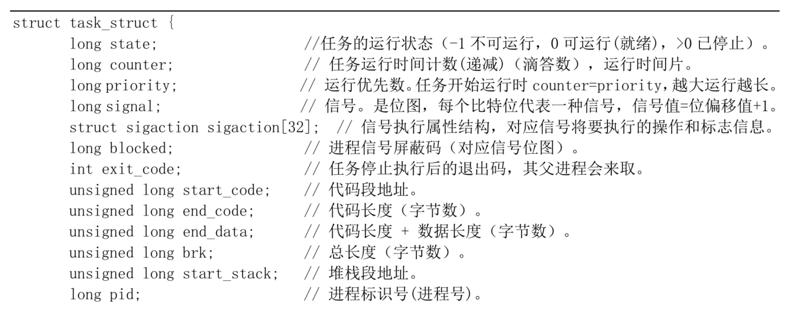
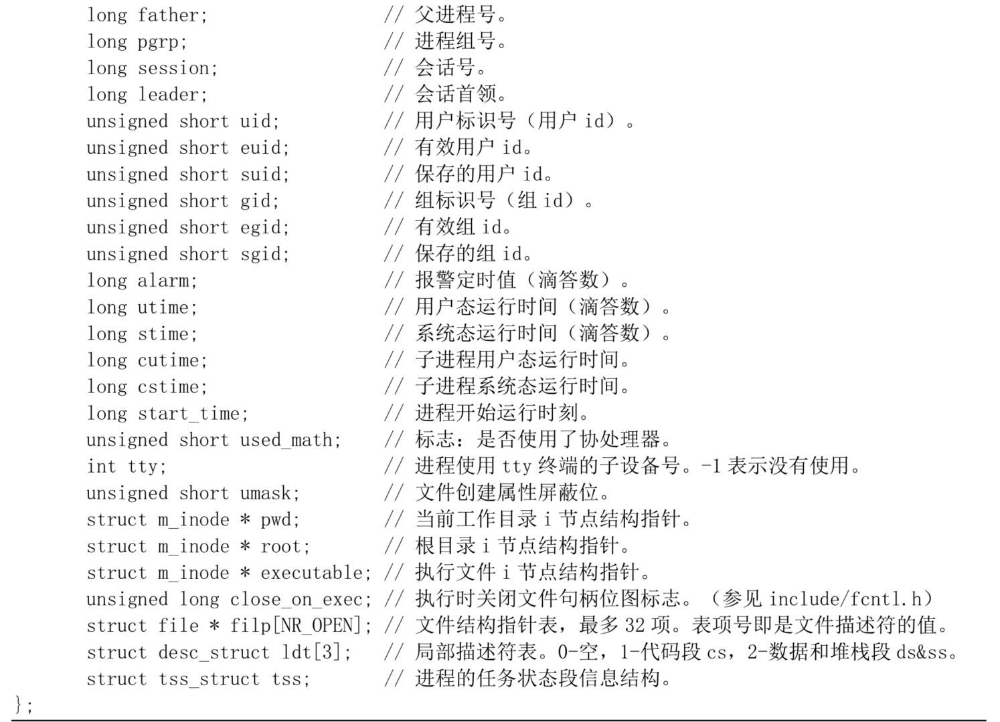
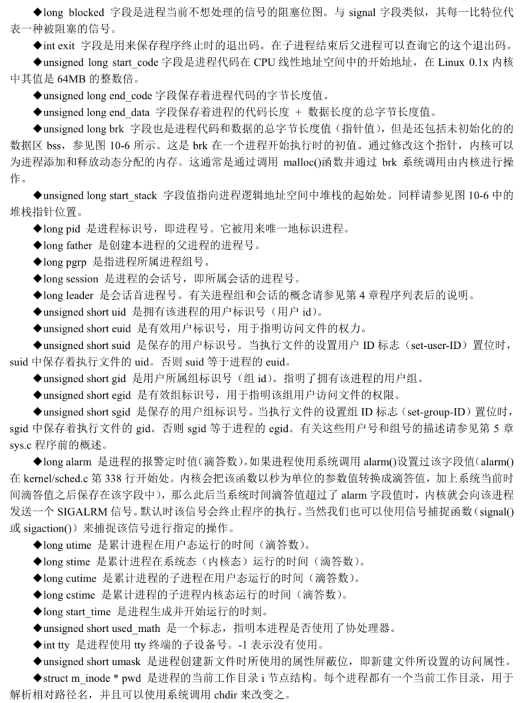
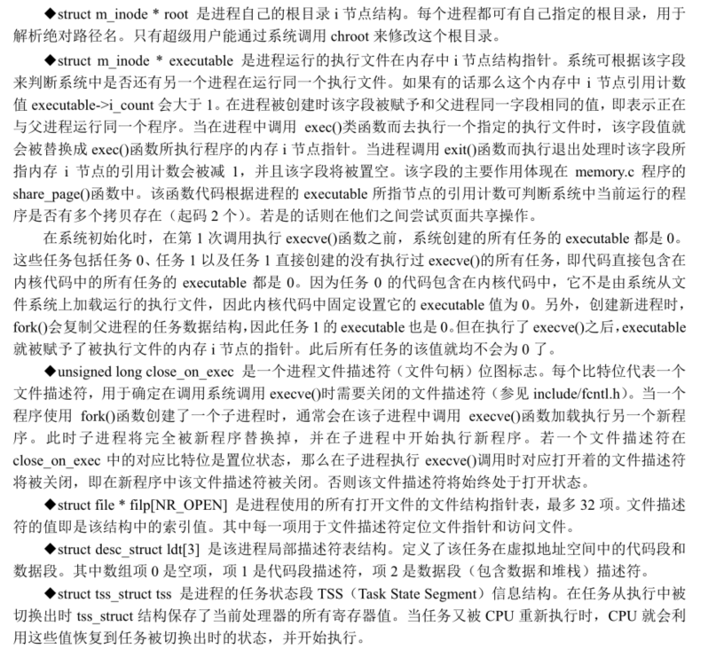
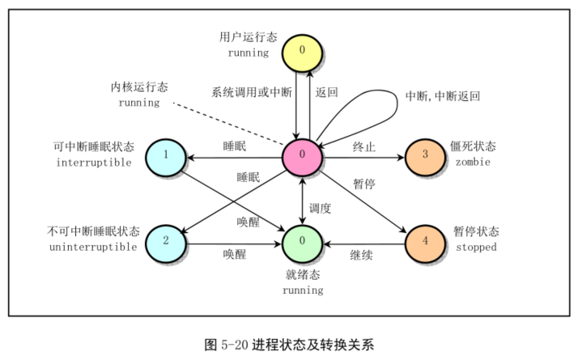
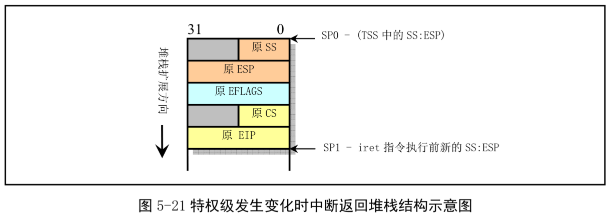
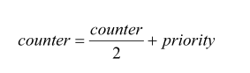
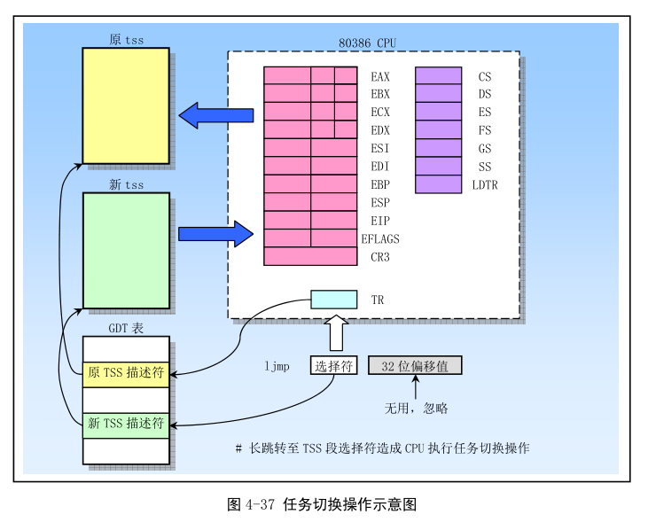

利用分时技术, 在 Linux 操作系统上同时可以运行多个进程. 分时技术的基本原理是把 CPU 的运行时间划分成一个个规定长度的时间片(time slice), 让每个进程在一个时间片内运行. 时间片用完就利用调度程序切换到另一个进程去运行.

对于 Linux 0.12 内核来讲, 系统最多可有 64 个进程同时存在. 除了第一个进程"手工"建立以外, 其余都是现有进程使用系统调用 fork 创建的新进程, 被创建的进程称为子进程(child process), 创建者是父进程(parent process).

Linux 系统中一个进程可以在内核态(kernel mode)或用户态(user mode)下执行, 并且分别使用各自独立的内核态堆栈和用户态堆栈.

## 1. 任务数据结构

内核程序通过进程表对进程管理, 每个进程在进程表中占有一项. 在 Linux 中, 进程表项是一个 task_struct 任务结构指针. 任务数据结构定义在头文件 include/linux/sched.h 中. 有些称为进程控制块(Process Control Block, PCB)或进程描述符(Processor Descriptor, PD). 其中保存着用于控制和管理进程的所有信息. 主要包括进程当前运行的状态信息、信号、进程号、父进程号、运行时间累计值、正在使用的文件和本任务的局部描述符以及任务状态段信息. 该结构每个字段如下.

(1)long state 字段含有进程的当前状态代号.

(2)long counter 保存进程在被暂时停止本次运行之前还能执行的时间滴答数, 即正常情况下还需要几个系统时钟周期才切换到另一个进程. 调度程序会根据 counter 选择下一个执行的进程. 初始值等于 priority.

(3)long prriority 用于给 counter 赋值. Linux 0.12 中为 15 个系统时钟周期时间(15 个滴答). 当然单位也是时间滴答数.

(4)long signal 进程当前所收到信号的位图, 共 32 位, 每位代表一种信号, 信号值=位偏移值+1. 因此 Linux 内核最多有 32 个信号. 每个系统调用处理最后, 系统会使用该信号位图对信号进行预处理.

(5)struct sigaction sigaction[32]结构数组用来保存处理各信号所使用的操作和属性. 数字每一项对应一个信号.

进程执行时, CPU 的所有寄存器中的值、进程状态以及堆栈中的内容被称为该进程的上下文. Linux 中, 当前进程上下文均保存在进程的任务数据结构中. 发生中断时, 内核就在被中断进程的上下文中, 在内核态下执行中断服务例程. 但同时会保留所有需要用到的资源, 以便中断服务结束时能恢复被中断进程的执行.

## 2. 进程运行状态

如图. 当进程正在等待系统中的资源而处于等待状态时, 称为睡眠等待状态. Linux 中, 睡眠等待状态分为可中断和不可中断的等待.

- 运行状态(TASK\_RUNNING). 当进程正在被 CPU 执行, 或已经准备就绪随时可由调度程序执行, 称为运行状态. 若没有被 CPU 执行, 称为就绪运行状态. 图中 3 个标号为 0 的状态. 当系统资源可用时, 进程就被唤醒而进入准备状态, 称为就绪态.

- 可中断睡眠状态(TASK\_INTERRUPTIBLE). 进程处于可中断等待(睡眠)状态, 系统不会调度该进程执行. 当系统产生一个中断或释放了进程正在等待的资源, 或者收到了一个信号, 都可以唤醒进程转换到就绪状态(可运行状态).

- 不可中断睡眠状态(TASK\_UNIBTERRUPTIBLE). 进程通常在直接或间接等待硬件条件的满足因而不接受任何信号. 只有使用 wake\_up()明确唤醒才能转换到可运行的就绪状态.

- 暂停状态(TASK\_STOPPED). 进程收到 SIGSTOP、SIGTSTP、SIGTTIN 或 SIGTTOU 便进入暂停状态. 可向其发送 SIGCONT 信号转换到可运行状态. 进程在调试期间接受任何信号都会进入该状态. Linux 0.12 中还未实现该状态的转换处理. 处于该状态的进程将被作为进程终止来处理.

- 僵死状态(TASK\_ZOMBIE). 当进程已停止运行, 但父进程没有调用 wait()询问其状态. 为了让父进程能获取其停止运行的信息, 此时子进程的任务数据结构信息还需要保留. 一旦父进程调用 wait()取得子进程的信息, 该进程的任务数据结构就会释放.

当一个进程的运行时间片用完, 系统就会使用调度程序强制切换.

另外, 如果进程在内核态执行时需要等待系统的某个资源, 此时该进程就会调用 sleep\_on()或 interruptible\_sleep\_on()自愿放弃 CPU 使用权, 而让调度程序去执行其他程序. 进程进入睡眠状态(TASK\_INTERRUPTIBLE 或 TASK\_UNIBTERRUPTIBLE).

只有当进程从"内核运行态"转移到"睡眠状态"时, 内核才会进行进程切换. 在内核态下运行的进程不能被其他进程抢占, 而且一个进程不能改变另一个进程的状态. 为避免进程切换造成内核数据错误, 内核在执行临界区代码时会禁止一切中断.

## 3. 进程初始化

boot 目录下, 引导程序将内核从磁盘加载到内存, 并让系统进入保护模式下运行后, 就开始执行系统初始化程序 init/main.c. 该程序首先确定如何分配使用系统物理内存, 然后调用内核各部分的初始化函数分别对内存管理、中断处理、块设备和字符设备、进程管理以及硬盘和软盘硬件进行初始化处理. 完成这些操作后, 系统各部分已经处于可运行状态. 此后程序将自己"手动"移动到任务 0(进程 0)中运行, 并使用 fork()调用创建进程 1. 进程 1 程序将继续初始化环境并执行 shell 登录程序. 原进程 0 则会在系统空闲时被调度执行, 此时任务 0 仅执行 pause()系统调用, 其中又会去执行调度函数.

"移动到任务 0 中执行"由宏 move\_to\_user\_mode(include/asm/system.h)完成. 它把 main.c 程序执行流从内核态(特权级 0)移动到用户态(特权级 3)的任务 0 中继续执行. 移动前, 系统在对调度程序的初始化过程(sched\_init())中, 首先对任务 0 的运行环境进行了设置. 包括人工预先设置好任务 0 数据结构各字段的值(include/linux/sched.h)、在全局描述符表中添加任务 0 的任务状态段(TSS)描述符和局部描述符表(LDT)的段描述符, 并把它们分别加载到任务寄存器 TR 和局部描述符表 LDTR 中.

内核初始化是一个特殊过程, 内核初始化代码也即是任务 0 的代码. 从任务 0 数据结构中设置的初始数据可知, 任务 0 的代码段和数据段基址为 0, 段限长 640KB. 而内核代码段和数据段基址是 0, 段限长 16MB. 内核初始化程序 main.c 是任务 0 的代码. **宏 move\_to\_user\_mode 就是把运行特权级从内核态 0 级变到用户态 3 级, 但仍执行原来的代码指令流(所以不能使用任务切换, 任务切换会使指令流变化)**.

在移动到任务 0 过程中, **宏 move\_to\_user\_mode 使用了中断返回指令造成特权级改变的方法**. 使用这种方式进行控制转移是由 CPU 保护机制造成的. CPU 允许低级别代码通过调用门或中断、陷阱门来调用或转移到高级别代码中执行(**任务内控制转移！！！并非任务切换！！！**), 反之不行. 因此内核使用了这种模拟 iret 返回低级别代码的方法. 该方法主要思想就是在堆栈中构筑中断返回指令需要的内容, 把返回地址的段选择符设置成任务 0 代码段选择符, 其特权级为 3. 此后 iret(中断返回指令, 没有 EFLAGS 中 NT)将导致系统 CPU 从特权级 0 跳到特权级 3 上运行. 下图是特权级变化时中断返回堆栈结构.

宏 move\_to\_user\_mode 首先往**内核**堆栈压入任务 0 堆栈段(即数据段)选择符和内核堆栈指针. 然后压入标志寄存器内容. 然后压入标志寄存器内容. 最后压入任务 0 代码段选择符和执行中断返回后需要执行的下一条指令的偏移位置.

执行指令 iret 时, CPU 将返回地址送入 CS:EIP 中, 同时弹出标志寄存器内容. 由于目的代码段的特权级是 3, 与当前内核态 0 级不同. 于是 CPU 把堆栈中的 SS 与 ESP 弹出来. 指令特权级变化, 段寄存器 DS、ES、FS 和 GS 的值变得无效, 此时 CPU 会把这些段寄存器清零. 因此执行了 iret 后需要重新加载这些段寄存器.

此后, 系统就开始**以特权级 3 运行在任务 0 的代码上**. 其内核态堆栈则被指定为其任务数据结构所在页面的顶端开始(PAGE\_SIZE + (long)&init\_task). 由于以后在创建新进程时, 需要复制任务 0 的任务数据结构, 因此要求任务 0 的用户态堆栈在创建任务 1 之前保持"干净".

详细见" Assembly/x86/x86 汇编语言_从实模式到保护模式/第三部分 32 位保护模式/14. 任务和特权级保护/5. 用户程序的执行(调用门转移控制以及进入 3 特权级用户程序)".

注意, **这里有个不同, 压入了标志寄存器(???)**.

## 4. 创建新进程

Linux 中创建新进程使用 fork()系统调用. 所有进程都是通过复制进程 0 得到, 都是进程 0 的子进程.

系统首先**在任务数组中找一个空项**. 若系统已经有 64 个进程在运行, 则 fork()系统调用会因为任务数组表中没有可用空项报错返回. 然后系统为新建进程**在主内存区中申请一页内存来存放其任务数据结构信息**, 并复制当前进程任务数据结构中所有内容作为新任务数据结构的模板. 为防止这个还未处理完的进程被调度执行, 此时应立即**将状态置为不可中断的等待状态(TASK\_UNINTERRUPTIBLE)**.

随后**修改任务数据结构**. 将当前进程设为新进程的父进程, 清除信号位图并复位新进程各统计值, 并设置初始运行时间片值为 15 个滴答时间数(150ms). 然后**根据当前进程设置任务状态段(TSS)中各寄存器的值**. 由于创建新进程返回值应为 0, 所以需要设置 tss.eax=0,. 新进程内核态堆栈指针 tss.esp0 设置为新进程任务数据结构所在内存页面的顶端, 而堆栈段 tss.ss0 被设为内核数据段选择符. tss.ldt 被设为局部表描述符在 GDT 中的索引值. 如果当前进程使用了协处理器, 则还需要把协处理器的完整状态保存到新进程的 tss.i387 结构中.

此后**系统设置新任务的代码和数据段基址、限长, 并复制当前进程内存分页管理的页表**. 注意, 此时系统并不为新进程分配实际的物理内存页面, 而是共享父进程的内存页面. 只有当父进程或新进程中任意一个有写内存操作时, 系统才会为执行写操作的进程分配相关的独自使用的内存页面. 这叫**写时复制(Copy On Write)**.

注意, 创建一个新进程和加载运行一个执行程序文件是两个不同的概念. 创建子进程时, 完全复制父进程的代码和数据区, 并会在其中执行子进程部分的代码. 执行一个程序文件时, 一般是在子进程中运行 exec()系统调用来操作. 进入 exec()后, 子进程原来的代码和数据区就会被清掉(释放). 待该子进程开始运行新程序时, 由于此时内核还没有从块设备上加载该程序的代码, CPU 会产生代码页面不存在的异常(Fault), 内存管理程序就会从块设备加载相应的代码页面, 然后 CPU 重新执行引起异常的指令. 到此新程序的代码才真正开始被执行.

## 5. 进程调度

这种选择机制时多任务操作系统的基础. 可以将调度程序看做在所有处于运行状态的进程之间分配 CPU 运行时间的管理代码. Linux 进程是抢占式的, **但被抢占的进程仍处于 TASK_RUNNING 状态**, 只是暂时没有 CPU 运行. **进程的抢占发生在进程处于用户态执行阶段, 内核态不能被抢占的**.

Linux 0.12 中采用了基于优先级排队的调度策略.

### 5.1 调度程序

schedule()函数首先扫描任务数组. 通过比较每个就绪态(TASK_RUNNING)任务的运行时间递减滴答数 counter 来确定哪个进程运行的时间最少. 哪个值大, 就表示运行时间还不长, 于是选中该进程, 并使用任务切换宏函数切换到该进程运行.

若此时所有处于 TASK_RUNNING 状态进程时间片已经用完, 系统根据每个进程的优先权值 priority, 对系统中进程(包括睡眠的进程)重新计算每个任务需要运行的时间片值 counter. 公式如下:

这样, 正在睡眠的进程被唤醒时就有较高的时间片 counter 值. 然后 schedule()重新扫描选择, 重复上述过程, 直到选出一个进程. 最后调用 switch\_to()执行实际进程切换操作.

如果此时没有其他进程可运行, 系统就会选择进程 0 运行. 对于 Linux 0.12, 进程 0 会调用 pause()把自己置为可中断的睡眠状态并再次调用 schedule(). 调度程序运行时, schedule()并不在意进程 0 处于什么状态. 只要系统空闲就会调度进程 0 运行.

### 5.2 进程切换

switch\_to()宏定义在 include/asm/system.h 中执行实际进程切换操作. 该宏会把 CPU 当前进程上下文替换成新进程的状态. 切换前, 首先检查**要切换的进程是否就是当前进程**, 如果是什么也不做, 直接退出; 否则, 首先将内核**全局变量 cuerrent 置为新任务的指针**, 然后长跳转到新任务的 TSS 组成的地址处, 造成 CPU 执行任务切换操作. 此时 CPU 会将所有寄存器状态保存到当前任务寄存器 TR 中 TSS 段选择符指向的当前进程任务数据结构的 TSS 结构中然后将新任务状态段选择符所指向的新任务数据结构中 TSS 结构中的寄存器信息恢复到 CPU 中, 系统就开始正式运行新切换的任务. 参见下图.

## 6. 终止进程

进程结束后, 内核就会释放该进程所占用的系统资源. 这包括运行时打开的文件、申请的内存等.

当一个用户程序调用 exit()系统调用时, 就会执行内核函数 do\_exit(). 该函数先释放进程代码段和数据段占用的内存页面, 关闭进程打开的所有文件, 对进程使用的当前工作目录、根目录和运行程序的 i 节点进行同步操作. **如果有子进程, 则让 init 进程作为其所有子进程的父进程**. 若进程是一个会话头进程并有控制终端, 则释放控制终端, 并向属于该会话的所有进程发起挂断信号 SIGHUP, 这通常会终止该会话中的所有进程. 然后把进程状态置为僵死 TASK\_ZOMBIE. 并向父进程发送 SIGCHID 信号, 通知其某个子进程已经终止. 最后 do\_exit()调用调度函数去执行其他进程. 由此可见在进程被终止时, 它的任务数据结构仍然保留着. 因为父进程还需要使用其中的信息.

子进程执行期间, 父进程通常使用 wait()或 waitpid()函数等待其某个子进程终止. 当等待的子进程被终止并处于僵死状态时, 父进程就会把子进程运行所使用的时间累加到自己的进程中, 最终释放已终止子进程任务数据结构所占用的内存页面, 并置空子进程在任务数组中占用的指针项.