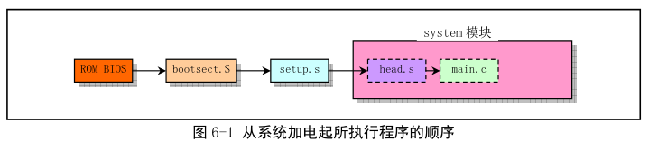
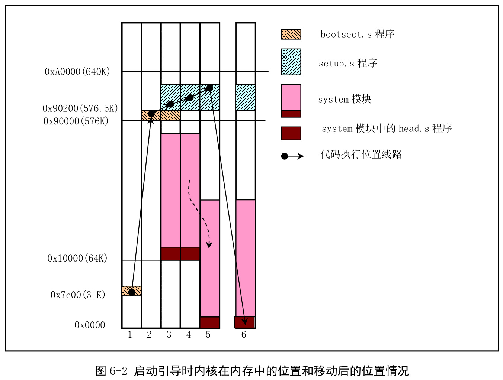

主要在 boot/目录下的汇编文件. bootsect.S 和 setup.S 是实模式下的 16 位程序, Intel 汇编语法, 使用 Intel 8086 汇编编译器和连接器 as86 和 ld86; head.s 是 GNU 汇编, 运行在保护模式下, 使用 GNU 的 as(gas)编译, 这是 AT&T 语法.

因为当时 GNU as 仅支持 i386 以及后的 CPU 代码指令, 不支持实模式 16 位代码. 2.4.x 起, bootsect.S 和 setup.S 才完全使用统一的 as 编写.

先说明 Linux 系统启动部分的主要执行流程. 主机上电, 80x86 的 CPU 进入实模式, 并从地址 0xFFF0 开始自动执行程序代码, 这儿通常是 ROM-BIOS 的地址. BIOS 进行 POST, 并在物理地址 0 处开始初始化中断向量(CPU 实模式的要求). 此后, 它将启动设备的第一个扇区(磁盘引导扇区, 512 字节)读入内存绝对地址 0x7c00, 并跳转到这儿.

Linux 最前面部分是用汇编写的(boot/bootsect.S), 它将由 BIOS 读入内存绝对地址 0x7c00(31KB)处.

当它执行时就会把自己移动到内存绝对地址 0x90000(576KB)处, 并把启动设备盘中后 2KB 代码(boot/setup.S)读入到内存 0x90200 处, 而内核其他部分(system 模块)则被读入到从内存地址 0x10000(64KB)开始处, 因此从机器加电开始顺序执行程序如下.

system 模块不会超过 0x80000 字节(512KB), 所以 bootsect 将 system 模块读入到物理地址 0x10000 开始位置并不会覆盖在 0x9000(576KB)处开始的 bootsect 和 setup 模块. 后面 setup 会将 system 模块移动到物理内存起始位置处, 这样 system 模块中代码的地址也即等于实际物理地址, 以便对内核代码和数据进行操作. 图 6-2 显示了 Linux 启动时这几个程序或模块在内存中的动态位置.

启动部分识别主机的某些特性以及 VGA 卡的类型. 需要的话, 它会要求用户为控制台选择显示模式. 然后将系统从 0x10000 移动到 0x0000 处, 进入保护模式并跳转到系统部分(0x0000 处). 此时 32 位运行的设置也完成了: IDT、GDT 以及 LDT 被加载, 处理器和协处理器也已确认, 分页工作也设置好了; 最终调用 init/main.c 的 main(). 上述操作在 boot/head.s 中, 这个可能是整个内核中最有诀窍的代码了.

bootsect 不把系统模块直接加载到物理地址 0x0000 开始处因为随后的 setup 开始部分还需要利用 ROM BIOS 的中断调用功能获取一些参数(例如显卡模式、硬盘参数表等).

仅在内存中加载了上述内核代码模块并不能让 Linux 运行起来. 还需要一个基本的文件系统支持, 即根文件系统(Root file-system). 这通常在另一个硬盘分区中. 为通知内核所需的根文件系统在什么地方, bootsect.S44 行给出了根文件系统所在的默认块设备号 ROOT\_DEV. 内核初始化时会使用编译内核时放在引导扇区第 509、510(0x1fc\~0x1fd)字节中的指定设备号. bootsect.S45 行给出了交换设备号 SWAP\_DEV, 它指出用作虚拟存储交换空间的外部设备号.