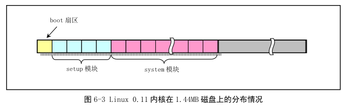
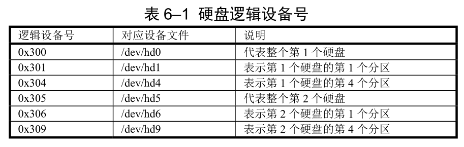

## 1. 功能描述

**磁盘引导块程序, 驻留在磁盘第一个扇区中**. BIOS 会将这个内容加载到内存地址 0x7c00 处并执行.

在 bootsect 执行期间, 它将自己移动到内存绝对地址 0x90000 开始处并继续执行.

BIOS 设置的中断 0x1E 的中断向量值是软驱参数表地址.

主要作用是首先把从磁盘第 2 个扇区开始的 4 个扇区的**setup 模块**(setup.S 编译而成)加载到内存紧接着 bootsect 后面位置(0x90200).

然后**利用 BIOS 中断 0x13 取磁盘参数表中当前启动引导盘的参数**, 接着在屏幕上显示"Loading system..."字符串.

再把磁盘上 setup 模块后面的 system 模块加载到内存 0x10000 开始的地方.

随后确定根文件系统的设备号, 若没有指定, 则根据**BIOS 所保存的引导盘的每磁道扇区数判别盘的类型和种类(如 1.44MB A 盘)并**保存其设备号于 root\_dev(508 地址)中, 最后长跳转到 setup 程序开始处(0x90200)中**执行 setup 程序**.

在磁盘上, 引导块、setup 模块和 system 模块的扇区位置和大小如图.

图中显示 Linux 0.12 内核**在 1.44MB 磁盘上所占扇区分布情况**. 1.44MB 磁盘盘片两面各有 80 个磁道(柱面), 每磁道 18 扇区, 共 2880 个扇区. 引导程序占用第 1 个扇区, setup 模块占随后 4 个, system 模块占大约随后 260 个扇区. 剩余空间可存放一个基本的根文件系统.

文件名后缀是大写的 S. 使用这样的后缀可以让 as 使用 GNU C 编译器的与处理功能. 因此可以在汇编中包括#include、#if 等.

## 2. 代码注释

root_dev 定义在引导扇区 508, 509 字节处, 指根文件系统所在设备号. 0x0306 指第 2 个硬盘第 1 个分区. 这里默认为 0x0306 是因为当时 Linus 开发 Linux 系统时是在第 2 个硬盘第 1 个分区中存放根文件系统. 这个值需要根据你自己根文件系统所在硬盘和分区进行修改. 例如, 如果你的根文件系统在第 1 个硬盘的第 1 个分区上, 那么该值应该为 0x0301, 即(0x01, 0x03). 如果根文件系统是在第 2 个 Bochs 软盘上, 那么该值应该为 0x021D, 即(0x1D,0x02). 当编译内核时, 你可以在 Makefile 文件中另行指定你自己的值, 内核映像文件 Image 的创建程序 tools/build 会使用你指定的值来设置你的根文件系统所在设备号.

## 3. 其他信息

### 3.1 Linux 0.12 硬盘设备号

0.12 中硬盘设备命令方式. 设备的主设备号分别是 1-内存, 2-磁盘, 3-硬盘, 4-ttyx, 5-tty, 6-并行口, 7-非命令管道. 由于 1 个硬盘还可以有 1\~4 个分区, 因此硬盘还根据分区不同用次设备号进行指定分区. 所以硬盘的逻辑设备号由: 设备号=主设备号 X256 + 次设备号. 两个硬盘的所有逻辑设备号如下表.

0x300 和 0x305 代表整个硬盘. Linux 0.95 后已经不适用这种命名方式了, 而是和现在的命名方法相同.

### 3.2 从硬盘启动系统

若需要从硬盘设备启动系统, 那么通常需要使用其他多操作系统引导程序来引导. 例如 LILO、GRUB 等. 此时 bootsect.S 所完成的任务由这些程序完成. **bootsect 就不会执行了(所以现在的 Linux 已经没有这个了)**. 因为如果从硬盘启动系统, 那么通常内核映像文件 Image 会存在在活动分区的根文件系统中. 因此需要知道**内核映像文件 Image 在文件系统中的位置**以及是**什么文件系统**. 即**引导扇区程序需要能够识别并访问文件系统**, 从中**读取内核映像文件**.

从硬盘启动的基本流程: 系统上电, 可启动硬盘的第一个扇区(主引导记录 MBR, Master Boot Record)会被 BIOS 加载到内存 0x7c00 处并开始执行. 该程序首先把自己下移到内存 0x600 处, 然后根据 MBR 中分区表信息所指明活动分区中的第 1 个扇区(引导扇区)加载到内存 0x7c00, 然后执行. 如果直接使用这种方式来引导系统就会碰到这样一个问题, 即文件系统不能与内核映像文件 Image 共存.

一种方法是专门设置一个小容量的活动分区来存放内核映像 Image. 而相应的根文件系统放在另一个分区中. 这样虽然浪费了硬盘的 4 个主分区之一, 但应该能在对 bootsect.S 做最少修改前提下做到从硬盘启动.

另一个办法是把内核映像文件 Image 和根文件系统组合存放在一个分区中, 即内核映像文件 Image 放在分区开始的一些扇区中, 而根文件系统则从随后某一指定扇区开始存放.