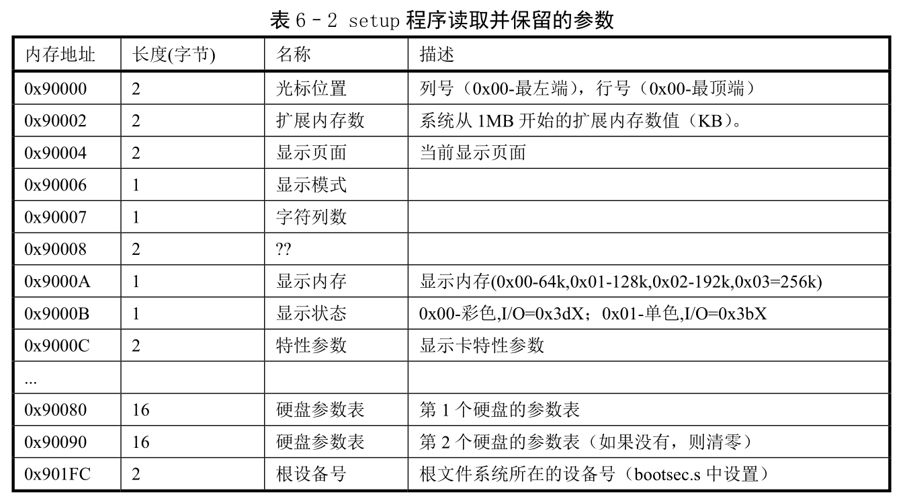
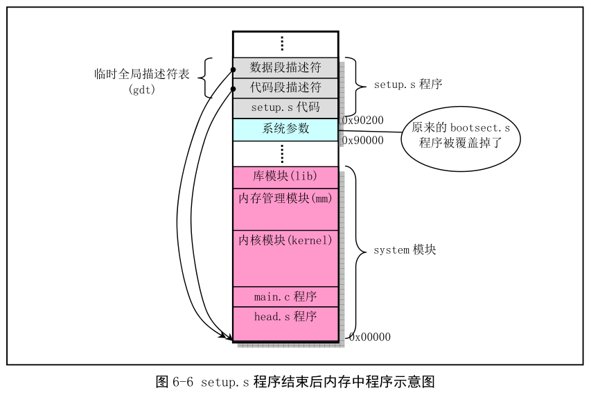
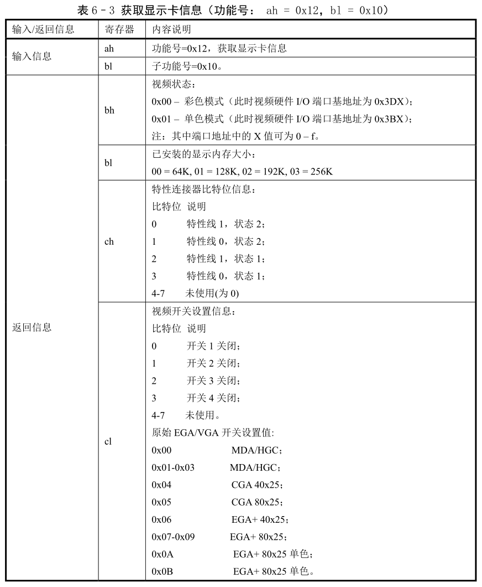
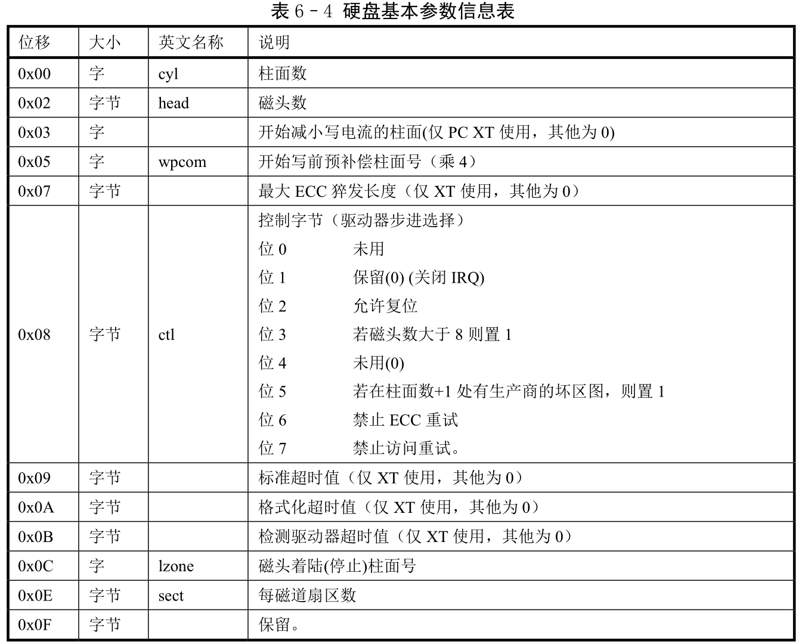
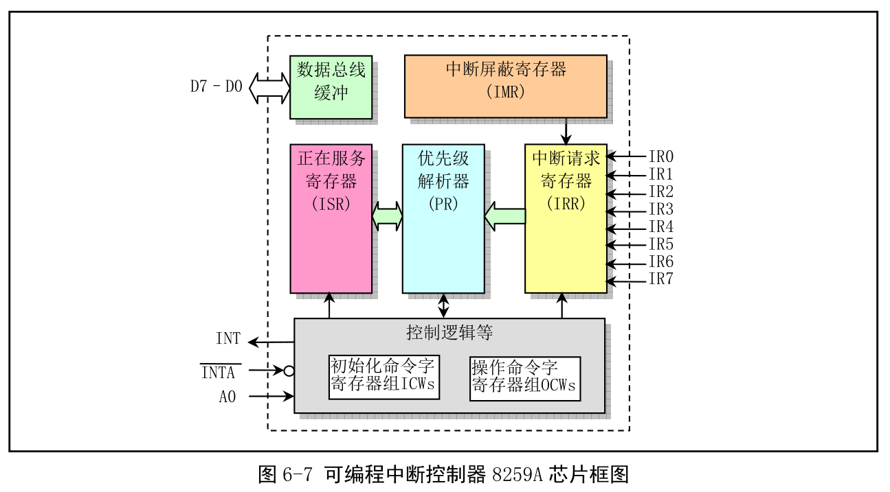

## 1. 功能描述

**操作系统加载程序, 位于磁盘引导扇区后面, 即第 2 个扇区开始, 占据 4 个扇区**. 它利用 BIOS 中断读取机器系统数据, 并将这些数据保存在 0x90000 开始的位置(覆盖掉 bootsect 所在的地方), 所取得的参数与保留的内存位置见表.

扩展内存是因为实模式只能识别 1MB(2\^20)大小内存.

然后将 system 模块从 0x10000\~0x8ffff(当时认为内核模块 system 不会超过 512KB)整块下移到内存绝对地址 0x00000 处. 然后加载 IDTR 和 GDTR(GDTR 大小 6 字节, 其中限长设置成 limit=2048, 每个描述符 8 字节, 所以可以有 256 个; IDTR 大小 6 字节, 因为 CPU 要求进入保护模式之前必须设置, 所以限长和地址都先设为 0), 开启 A20 地址线, 重新设置两个中断控制芯片 8259A, 将硬件中断号重新设置为 0x20\~0x2f. 最后设置 CR0, 进入 32 位保护模式, 并跳转到 system 最前面的 head.s 继续执行.

为了让 head.s 在 32 位保护模式中运行, 在本程序中临时设置了 IDT 和 GDT, 并在 GDT 中设置了当前内核代码段的描述符和数据段的描述符. 下面在 head.s 中会根据内核的需要重新设置.

另外, setup.S 在 215\~566 行识别机器中使用的显示卡类别. 如果使用的是 VGA 显卡, 那么检查下显卡是否支持超过 25 行 X80 列的扩展显示模式(或显示方式). 所谓显示模式是指 ROM BIOS 中断 int 0x10 的功能 0(ah=0x00)设置屏幕显示信息的方法, 其中 al 寄存器中的输入参数即是要设置的显示模式或显示方式号. 通常将 IBM PC 刚推出时所能设置的几种显示模式成为标准显示模式, 而后面添加的称为扩展显示模式. 例如 ATL 显卡除了支持标准显示模式, 还支持扩展显示模式号 0x23、0x33, 即还能使用 132 列 X25 行和 132 列 X44 行两种显示模式在屏幕上显示信息. 在 VGA、SVGA 刚出现, 这些扩展模式均由显卡上的 BIOS 支持. 若识别出一块已知类型的显示卡, 程序就会向用户提供选择分辨率的机会. 但这段程序涉及很多显示卡特有的端口信息, 所以程序比较复杂. 不过与内核运行关系不大, 可以跳过不看.

## 2. 代码注释

## 3. 其他信息

### 3.1 当前内存映像

setup.s 执行结束后, 系统模块 system 被移动到物理地址 0x0000 开始处, 从 0x90000 开始处则放置内核会使用的一些系统基本参数, 如图.

**此时临时 GDT 有三个描述符, 第一个 NULL 不用, 另外两个是代码段描述符和数据段描述符. 它们都指向系统模块起始处, 即物理地址 0x0000 处. **这样当 setup.S 中执行最后一条指令"jmp 0,8"(193 行)就会跳到 head.s 开始处继续执行. **"8"是段选择符, 指定所需使用的描述符, 此处指 GDT 中代码段描述符(1000, 刚好是代码段描述符索引位置), "0"是代码段中偏移值**.

### 3.2 BIOS 视频中断 0x10

BIOS 中视频中断调用功能如下.

### 3.3 硬盘基本参数表("INT 0x41")

中断向量表中, int 0x41 的中断向量位置(4X0x41=0x0000:0x0104)存放的并不是中断程序的地址, 而是第一个硬盘的基本参数表. 对于 100%兼容的 BIOS, 这里存放的是硬盘参数表阵列的首地址 F000h:E401h. 第二个硬盘的基本参数表入口地址存放于 int 0x46 中断向量位置处. 参数见表.

### 3.4 A20 地址线问题

为了能够访问和使用 1MB 以上的物理内存, 我们需要首先开启 A20 地址线.

### 3.5 8259A 中断控制器的编程方法

(1)8259A 工作原理

这里说明 8259A 工作原理, 然后详细说明 8259A 芯片编程方法以及 Linux 内核对其设置的工作方式.

PC/AT 使用两片 8259A 可编程控制器(PIC)芯片, 可管理 15 级中断向量. 从芯片的 INT 引脚连到主芯片的 IR2 引脚. 主芯片端口基地址 0x20, 从芯片 0xA0. 逻辑框图如下.

具体内容见书内容

