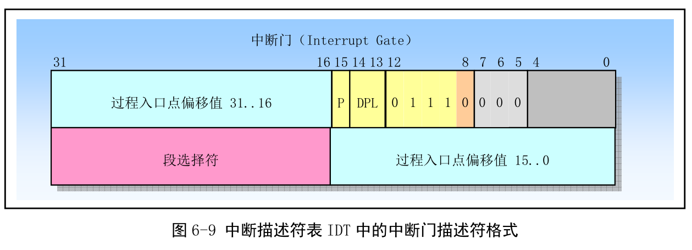
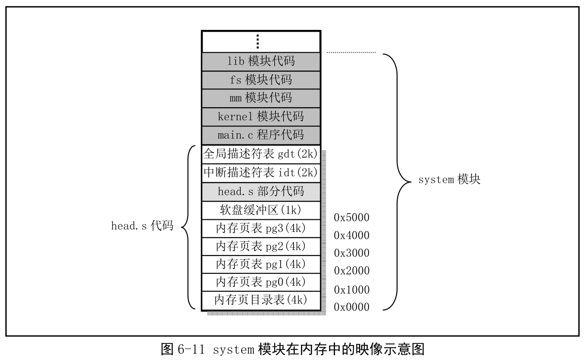

## 1. 功能描述

被编译成目标文件后会与内核其他程序一起被链接成 system 模块, 位于 system 模块的最前面开始部分. **system 模块将被放在磁盘上 setup 模块之后开始的扇区中, 即从磁盘上第 6 个扇区开始放置. 一般 Linux 0.12 内核的 system 模块大约 120KB 左右, 大约 240 个扇区**.

从这里开始, 内核完全在保护模式运行. head.s 采用 AT&T 语法格式, 并需要使用 GNU 的 gas 和 gld 编译连接, 赋值是从左到右.

这段程序实际处于内存绝对地址 0 开始地方. 程序功能比较单一. 首先加载各个数据段寄存器, **重新设置 IDT, 共 256 项**, 并使所有表项指向一个只报错误的哑中断子程序 ignore\_int. 格式如下.

**中断描述符中段选择符是 0x0008(这个会指向 GDT 或 LDT. 1000, 索引是 1, 刚好是 setup.S 设置的 GDT 中的第 1 个描述符, 是代码段描述符索引位置), 表示该哑中断处理程序在内核代码(第 1 个描述符中的基地址是 0)中**. **偏移值(在中断描述符中！！！)被**设置为 ignore\_init 中断处理程序在 head.s 程序中的偏移值. **由于 head.s 被移动到内存地址 0 开始处, 因此该偏移值也就是中断处理程序在内核代码段中的偏移值**. 由于内核代码段一直存在内存中, 且特权级为 0, 即 P=1, DPL=00. 因此中断门描述符的字节 5 和字节 4 应该是 0x8E00.

设置好 IDT 后, 又重新设置了 GDT. 新设的 GDT 表与原来的 setup.s 除了在段限长上有些区别(原 8MB, 现 16MB), 其他完全一样. 当然可以在 setup.s 就把 GDT 段限长直接设置为 16MB, 然后直接把原 GDT 移动到合适内存为止. 之前 GDT 处于内存 0x902XX 处. 这个地方将在内核初始化后用作内存高速缓冲区的一部分.

接着使用物理地址 0 与 1MB 开始处字节比较, 检测 A20 地址是否已开启. 若没开, 则访问高于 1MB 物理内存地址时 CPU 实际只会循环访问(IP MOD 1MB)地址处内容, 即与访问从 0 地址开始对应字节的内容都相同. 若发现没有开启, 进入死循环. 然后测试 PC 是否有数学协处理器(80287、80387 等), 并在控制寄存器 CR0 设置相应标志位.

接着设置分页处理机制, 将页目录表放在绝对物理地址 0 开始处(会覆盖), 然后后面放可寻址 16MB 的 4 个页表, 并分别设置表项. 页目录表项和页表项结构见其他资料.

每个表项都被设为 0x07(P=1, U/S=1, R/W=1), 表示页存在、用户可读写.

这样设置内核页表属性因为: CPU 的分段和分页都有保护方法. 分页机制中页目录表和页表项中设置的保护标志(U/S、R/W)需要和段描述符中的特权级(PL)一起组合使用. 但段描述符中的 PL 起主要作用. CPU 会首先检查段保护, 再检查页保护. 若 CPU\<3, 说明 CPU 正以超级用户(Supervisor)身份运行. 此时可以访问所有页面并随意内存读写. CPL=3, 说明以用户(user)身份运行, 只能访问 User 的页面(U/S=1)可以访问, 并且只有标记为可读写的页面(W/R=1)是可写的. 而属于超级用户的页面(U/S=0)既不可写, 也不可读.

最后, head.s 利用返回指令将预先设置在堆栈中的 init/main.c 程序入口地址弹出, 运行 main()程序.

## 2. 代码注释

## 3. 其他信息

### 3.1 程序执行结束的内存映像

执行后, 正式完成了内存页目录和页表的设置, 并重新设置了内核实际使用的 IDT 和 GDT. 另外, 为软盘驱动开辟 1KB 缓冲区. 此时 sysetm 模块在**内存中的详细映像如图**.

### 3.2 Intel 32 位保护运行机制

### 3.3 前导符(伪指令)align

