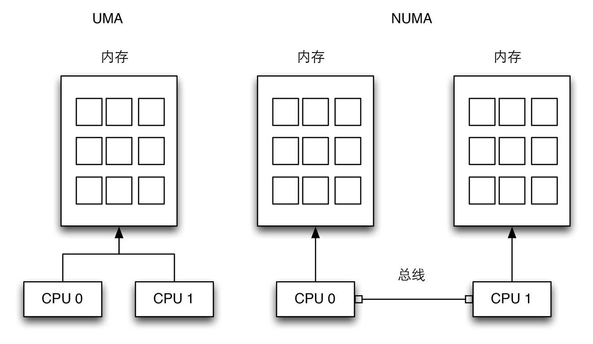
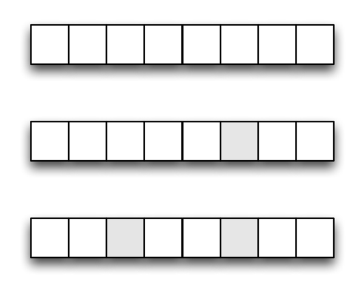

### Unix 内核概述

#### 进程/内核模式

CPU 即可运行在用户态, 也可运行在内核态. 实际上, 一些 CPU 可以有两种以上的执行状态. 例如, Intel 80X86 微处理器有四种不同的执行状态. 但是所有标准的 Unix 内核都仅仅利用了内核态和用户态.

每种 CPU 模型都为从用户态到内核态的转换提供了特殊的指令, 反之亦然.

进程是动态的实体, 在系统内通常只有有限的生存期. 创建、撤销及同步现有进程的任务都委托给内核中的一组例程来完成.

内核本身并不是一个进程, 而是一个进程的管理者. 进程/内核模式假定: 请求内核服务的进程使用所谓系统调用(system call)的特殊编程机制. 每个系统调用都设置了一组识别进程请求的参数, 然后执行与硬件相关的 CPU 指令完成从用户态到内核态的转换.

除了用户进程外, Unix 系统还包括几个所谓内核线程(kernel thread)的特权进程(被赋予特殊权限的进程), 它们特点:

- 它们以内核态运行在内核地址空间.
- 它们不与用户直接交互, 因此不需要终端设备.
- 它们通常在系统启动时创建, 然后一直处于活跃状态直到系统关闭.

单处理器系统, 任何时候只有一个进程在运行, 它要么处于用户态, 要么处于内核态. 如果进程在内核态, 处理器就执行一些内核例程. 下图说明了用户态和内核态的相互切换. 处于用户态的进程 1 发出系统调用之后, 进程切换到内核态, 系统调用才执行. 然后, 直到发生定时中断且调度程序在内核态被激活, 进程 1 才恢复在用户态下执行. 进程切换发生, 进程 2 在用户态开始执行, 直到硬件设备发出中断请求. 中断的结果是, 进程 2 切换到内核态并处理中断.

Unix 内核做的远不止处理系统调用. 实际上, 可以有几种方式激活内核例程:

- 进程调用系统调用.
- 正在执行进程的 CPU 发出一个异常(exception)信号, 异常是一种反常情况, 例如一个无效的指令. 内核代表产生异常的进程处理异常.
- 外围设备向 CPU 发出一个中断(interrupt)信号以通知一个事件的发生, 如一个要求注意的请求, 一个状态的变化或一个 I/O 操作已经完成等. 每个中断信号都是由内核中的中断处理程序(interrupt handler)来处理.
- 内核线程被执行. 因为内核线程运行在内核态, 因此必须认为其相应程序是内核的一部分.

#### 进程实现

为了让内核管理进程, 每个进程由一个进程描述符(process description)表示, 这个描述符包含有关进程当前状态的信息.

当内核暂停一个进程的执行时, 就把几个相关处理器寄存器的内容保存在进程描述符中. 这些寄存器包括:

- 程序计数器(PC)和栈指针(SP)寄存器
- 通用寄存器
- 浮点寄存器
- 包含 CPU 状态信息的处理器控制寄存器(处理器状态字, Processor Status Word)
- 用来跟踪进程对 RAM 访问的内存管理寄存器

当内核决定恢复执行一个进程时, 它用进程描述符中合适的字段来装载 CPU 寄存器. 因为程序计数器中所存的值指向下一条将要执行的指令, 所以进程从它停止的地方恢复执行.

当一个进程不在 CPU 上执行时, 它正在等待某一事件. Unix 内核可以区分很多等待状态, 这些等待状态通常由进程描述符队列实现. 每个(可能为空)队列对应一组等待特定事件的进程.

#### 可重入内核

多个进程可同时在内核态下执行. 当然, 单处理器系统上只有一个进程在真正运行, 但是有许多进程可能在等待 CPU 或某一个 I/O 操作完成时在内核态下被阻塞. 例如, 当内核代表某一个进程发出一个读磁盘请求后, 就让磁盘控制器处理这个请求并且恢复执行其他进程. 当设备满足了读者请求时, 有一个中断就会通知内核, 从而以前的进程可以恢复执行.

提供可重入的一种方式是编写函数, 以便这些函数只能修改局部变量, 而不能改变全局数据结构, 这样的函数是可重入函数. 可重入内核可以包含非重入函数, 并且利用锁机制保证一次只有一个进程执行一个非重入函数.

如果一个硬件中断发生, 可重入内核能挂起当前正在执行的进程, 即使当前进程处于内核态. 这种能力能提高发出中断的设备控制器的吞吐量. 一旦设备已发出一个中断, 它就一直等待直到 CPU 应答为止. 如果内核能快速应答, 设备控制器在 CPU 处理中断时就能执行其他任务.

内核控制路径(kernel control path)表示内核处理系统调用、异常或中断所执行的指令序列.

最简单的情况是, CPU 从第一条指令到最后一条指令顺序地执行内核控制路径. 然而, 下面事件之一发生时, CPU 交错执行内核控制路径:

- 运行在用户态的进程调用一个系统调用, 而相应的内核控制路径证实这个请求无法得到立即执行; 然后, 内核控制路径调用调度程序选择一个新的进程投入运行. 结果, 进程切换发生, 第一个内核控制路径还没完成, 而 CPU 又重新开始执行其他的内核控制路径. 在这种情况下, 两条控制路径代表两个不同的进程在执行.
- 当运行一个内核控制路径时, CPU 检测到一个异常(例如访问一个不在 RAM 中的页). 第一个控制路径被挂起, 而 CPU 开始执行合适的例程. 在我们的例子中, 这种过程能给进程分配一个新页, 并从磁盘读它的内容. 当这个过程结束时, 第一个控制路径可以恢复执行. 在这种情况下, 两个控制路径代表同一个进程在执行.
- 当 CPU 正在运行一个启用了中断的内核控制路径时, 一个硬件中断发生, 第一个内核控制路径还没有执行完, CPU 开始执行另一个内核控制路径来处理这个中断. 当这个中断处理程序终止时, 第一个内核控制路径恢复. 在这种情况下, 两个内核控制路径运行在同一个进程的可执行上下文, 所花费的系统 CPU 时间都算给这个进程. 然而, 中断处理程序无需代表这个进程执行.
- 在支持抢占式调度的内核中, CPU 正在执行, 而一个更高级的进程加入就绪队列, 则中断发生. 在这种情况下, 第一个内核控制路径还没有执行完, CPU 代表高优先级进程又开始执行另一个内核控制路径. 只有把内核编译成支持抢占式调度之后, 才可能出现这种情况.

#### 进程地址空间

每个进程运行在它的私有地址空间. 在用户态下运行的进程涉及到私有栈、数据区和代码区. 当在内核态运行时, 进程访问内核的数据区和代码区, 但使用另外的私有栈.

因为内核是可重入的, 因此几个内核控制路径(每个都与不同的进程相关)交叉的执行, 在这种情况下, 每个内核控制路径都引用自己的内核栈.

尽管看起来每个进程访问一个私有地址空间, 但有时进程之间也共享部分地址空间. 在一些情况下, 这种共享由进程显示的提出; 在另一种情况下, 由内核自动完成共享以节约内存.

如果同一个应用程序(如编辑程序)由几个用户共同使用, 则这个程序只被装入内存一次, 其指令由需要它的用户共享. 其数据不被共享, 每个用户都有自己独立的数据. 这种共享的地址空间由内核自动完成以节省内存.

进程间也可以共享部分地址空间, 以实现进程间通信, 这就是由 system V 引入并且已经被 linux 支持的"共享内存"技术.

最后, linux 支持 mmap()系统调用, 该系统调用允许存放在块设备上的文件或信息一部分映射到进程的部分地址空间. 如果一个文件由几个进程共享, 那么共享他的每个进程空间都拥有它的内存映射.

#### 同步和临界区

内核的另一个重要的保证就是一致性(consistent)状态. 实现可重入内核需要同步机制: 如果内核控制路径对某个内核数据结构进行操作时被挂起, 那么其他内核控制路径就不应该再对此数据结构操作, 除非它已经被重新设为一致性(consistent)状态. 否则, 两个控制路径交互执行将破坏所存储的信息.

例如, 假设全局变量 V 包含某个系统资源的可用项数. 第一个内核控制路径 A 读这个变量, 并且确认仅有一个可用资源项. 这时, 另外一个内核控制路径 B 被激活, 并读取同一个变量 V, V 的值仍为 1. 因此, B 对 V 减 1, 并开始用这个资源项. 然后 A 恢复执行. 因为 A 已经读到 V 的值, 于是假定它自己可以对 V 减 1 并获取 B 已经在使用的这个资源项. 结果, V 的值变为-1, 两个内核控制路径使用相同的资源项可能导致灾难性的后果.

当某个计算结果取决于如何调度两个或多个进程时, 相关代码就是不正确的, 这是一种竞争条件(race condition).

要避免这种情况, 对全局变量的安全访问通过原子操作(atomic operation). 前面例子中, 如果两个控制路径读 V 并减 1 是一个单独的、不可中断的操作. 那么, 就不可能出现数据讹误. 然而, 内核包含的许多数据结构是无法用单一操作访问的. 例如, 用单一的操作从链表中删除一个元素是不可能的, 因为内核一次至少访问两个指针. 临界区(critical region)是这样的一段代码, 进入这段代码的进程必须完成, 之后另一个进程才能进入. (同步问题已在其他著作中进行了详细描述, 可以参考有关 Unix 操作系统方面的书, 可以看参考书目)

这种问题不仅出现在内核控制路径之间, 也出现在共享公共数据的进程之间. 不过, 现在已经有几种同步技术被采用, 下面便集中讨论如何同步内核控制路径.

##### 非抢占式内核

一个最简单的解决办法就是使用非抢占式内核, 大多数传统的 Unix 内核都是非抢占式的, 当进程在内核态执行时, 它不能被任意一个程序挂起, 也不能被任意另一个进程代替. 因此, 在单处理器系统上, 中断或异常处理程序不能修改所有内核的数据结构, 内核对它们来说都是安全的. 除了内核态的进程能自愿放弃 CPU, 但是这种情况下, 它必须保证所有的数据都处于一致性状态. 此外, 当这种进程恢复执行时, 它
必须重新检查以前访问过的数据结构的值, 因为这些数据有可能被改变.

如果内核支持抢占, 那么在应用同步机制时, 确保进入临界区前禁止抢占, 退出临界区时启用抢占.

非抢占式内核在多处理器系统上是低效的, 因为多 CPU 上的两个内核控制路径可以并发的访问相同的数据结构.

##### 禁止中断

单处理器系统上的另一种同步机制是: 在进入一个临界区之前禁止所有硬件中断, 离开时再重新启用中断. 这种机制比较简单, 但远不是最佳的, 如果临界区比较大, 那么在一个相当长的时间内, 所有的硬件都将处于一个冻结状态. 特别是在多处理器系统上, 禁止本地中断是不够的. 必须使用其他的同步技术.

##### 信号量

广泛使用的一种机制是信号量, 它在单处理器系统和多处理器系统都有效, 信号量仅仅是与一个数据结构相关的计算器. 所有的内核线程在试图访问这个数据结构之前, 都要检查这个信号量. 可以把每个信号量看成一个对象, 每个信号的组成如下:

- 一个整形的变量
- 一个等待进程的链表
- 两个原子方法 down()和 up()

down 方法对信号量的值减 1, 如果小于 0, 该方法就把正在运行的进程加入到这个信号量链表, 然后阻塞该进程(即调用调度程序). up()方法对信号量值加 1, 如果信号量这个新值大于或等于 0, 则激活链表中的一个或多个进程.

每个要保护的数据结构都要有它自己的信号量, 其初始值为 1.当内核控制路径希望访问这个数据结构时, 它在相应的信号量上执行 down()方法. 如果信号量的当前值不是负值, 则允许访问这个数据结构, . 否则, 把执行内核控制路径的进程加入到这个信号量的链表并阻塞该进程. 当另一个进程在那个信号量上执行 up()方法时, 允许信号量链表上的一个进程继续执行.

##### 自旋锁

在多处理器系统上, 信号量并不是解决同步问题的最佳方案. 为了检查信号量, 内核必须把进程插入到信号量链表中, 然后挂起他. 因为这两种操作比较费时, 完成这些操作时, 其他的内核控制路径可能已经释放了信号量.

在这种情况下, 多处理器系统使用自旋锁(spin lock). 自旋锁与信号量非常相似, 但没有进程链表; 当一个进程发现锁被另一个进程锁着的时候, 他就不停的旋转, 执行一个紧凑的循环命令, 直到锁打开.

自旋锁在单处理器上是无效的. 当内核控制路径试图访问一个上锁的数据结构时, 他无休止的循环, 因此内核控制路径可能因为正在修改保护的数据结构而没有机会继续执行, 也没有机会释放自旋锁, 最后的结果可能是系统挂起.

##### 避免死锁

与其他控制路径同步的进程或内核控制路径很容易进入死锁(deadlock)状态. 死锁情形会导致受影响的进程或者内核控制路径完全处于冻结状态.

只要涉及到内核设计中, 当所用内核信号量的数量较多时, 死锁就成为一个突出的问题, 很难保证内核控制器在各种可能方式下的交错执行不出现死锁状态. 有几种操作系统(包括 Linux)通过按照规定的顺序请求信号量来避免死锁.

#### 信号和进程间通信

Unix 信号(signal)提供了把系统事件报告给进程的一种机制. 每种事件都有自己的信号编号, 通常以符号常量来表示, 比如 SIGTERM. 有两种系统事件:

- 异步通告

  当用户在中断按下中断键, 如 CTRL-C, 则向前台进程发出中断信号 SIGINT.

- 同步错误或异常

  当进程访问非法地址时, 向进程发送一个 SIGSEGV 信号.

POSIX 定义了大约 20 种不同的信号, 其中有两种是用户自定义的, 可以当作用户态下进程通信和同步的原语机制. 一般来说, 进程可以用两种方法来对待发送过来的信号:

- 忽略信号.
- 异步的执行一个指定的过程处理信号.

如果进程不指定何种方式, 内核就根据信号的标号执行一个默认的操作, 默认操作可能是:

- 中止进程.
- 将执行上下文和地址空间内容写入一个文件.
- 忽略信号.
- 挂起进程.
- 如果进程曾经被暂停, 则恢复执行.

因为 POSIX 语义允许进策划那个暂时阻塞信号, 因此内核信号的处理相当精细. 另外, SIGKILL 和 SIGSTOP 信号不能由进程直接处理, 也不能忽略.

AT&T 的 Unix System V 引入了在用户态其他种类的进程间通信机制. 很多 Unix 内核也采用了这种机制: 信号量、消息队列及共享内存, 它们被统称为 System V IPC.

内核把它们作为 IPC 资源来实现: 进程要获得一个资源, 可以调用 shmget()、semset()或 msgget()系统调用. 与文件一样, IPC 资源是恒久不变的, 进程创建者、拥有者或者超级用户进程必须显式的释放这些资源.

这里的信号量和"同步和临界区"一节中所描述的信号量是相似的, 只是它们用在用户态下的进程中. 消息队列允许进程利用 msgsnd()及 msgget()系统调用交换消息, msgsed()表示把消息插入到指定的队列中, msgget()表示从队列中提取消息.

POSIX 标准(IEEE Std 1003.1-2001)定义了一中基于消息队列的 IPC 机制, 就是所谓的 POSIX 消息队列, 与 System V IPC 消息队列相似, 但是它们对应用程序提供一个更简单的基于文件的接口.

共享内存为进程之间交换和共享数据提供了最快的方式. 通过调用 shmget()系统调用来创建一个新的共享内存, 其大小按需设置. 在获得 IPC 资源标识符后, 进程调用 shmat()系统调用, 其返回值是进程的地址空间中新区域的起始地址. 当进程希望把共享内存从其气质空间分离出去时, 就调用 shmdt()系统调用. 共享内存的实现依赖于内核对进程地址空间的实现.

#### 进程管理

Unix 在进程和它正在执行的程序之间做一个清晰的划分. fork()和_exit()系统调用分别用来创建一个新进程和终止一个进程, 而调用 exec()类系统调用则是装入一个新程序. 当这样一个系统调用执行完以后, 进程就在所装入程序的全新地址空间恢复执行.

调用 fork()的进程是父进程, 而新进程是他的子进程. 父子进程能互相找到对方, 因为每个进程的描述符都包含有两个指针, 一个指向他的父进程, 另一个指向他的子进程.

实现 fork()的一个天真形式就是将父进程的数据和代码都复制, 并且拷贝赋予子进程. 这会相当费时. 当前依赖硬件分页单元的内核采用写时复制(Copy-On-Write)技术, 即把页的复制延迟到最后一刻(也就是说, 直到父或子进程需要时才写进页). 详细可以参考"写时复制".

_exit()调用终止一个进程. 内核对这个进程的处理是通过释放进程所拥有的资源并向父进程发送 SIGCHLD 信号(默认操作忽略)来实现.

##### 僵死进程

父进程如何查询其子进程是否终止了?wait4()系统调用允许进程等待, 知道其中的一个子进程结束; 它返回已终止的子进程的进程标识符 pid.

内核在执行这个系统调用时, 检查子进程是否已经终止. 引入僵死进程的目的是为了表示终止的进程: 父进程在执行完 wait4()调用之前, 进程就一直停留在那种状态. 系统调用处理程序从进程描述符字段获取有关资源的一些数据; 一旦得到数据, 就可以释放进程描述符. 当进程执行 wait4()系统调用时如果没有子进程结束, 内核通常把该进程设为等待状态, 一直到子进程结束.

在父进程发出 wait4()调用之前, 让内核保存子进程的信息是一个良好的习惯, 但是假设父进程没有发出 wait4 系统调用呢, 这些信息一直保存在内存中, 显然这是不愿意看到的.

一个解决方法是: 使用一个名为 init 的特殊系统进程, 他在系统初始化的时候创建, 当一个进程结束时, 内核改变其所有现有子进程的进程描述符指针, 使这些子进程成为 init 的孩子, init 监控所有子进程的执行, 并且按常规发布 wait4 系统调用, 其副作用就是除掉所有的僵死的进程.

僵尸进程可以使用 ps 或者 top 工具查看, 因为残余的数据在内核中占用较少, 所以几乎不是问题.

##### 进程组和登录会话

现代 Unix 操作系统引入了进程组(process group)的概念, 以表示一种"作业(job)"的抽象. 例如, 为了执行命令行:

>
ls | sort | more

Shell 支持进程组, 例如 bash, 为三个相应的进程 ls、sort 和 more 创建一个新的组. shell 以这种方式作用于这三个进程, 就好象它们是一个单独的实体(更准确说是作业). 每个进程描述符包括一个包含进程组 ID 的字段. 每一进程组可以有一个领头进程(即其 PID 与这个进程组的 ID 相同的进程). 新创建的进程最初被插入到其父进程的进程组中.

现代 Unix 操作系统还引入了登录会话(login session). 非正常地说, 一个登录会话包含在指定终端已经开始工作会话的那个进程的所有后代进程 —— 通常情况下, 登录会话就是 shell 进程为用户创建的第一条命令. 进程组中所有进程必须在同一登录会话中, 一个登录会话可以让几个进程组同时处于活动状态, 其中, 只有一个进程组一直处于前台, 这意味着该进程组可以访问终端, 而其他活动着的进程组在后台. 当一个后台进程试图访问终端时, 它将收到 SIGTTIN 或 SIGTTOUT 信号. 在很多 shell 命令中, 用内部命令 bg 和 fg 把一个进程组放在后台或前台.

#### 内存管理

内存管理是 Unix 内核迄今为止最复杂的活动. 本节只是说明一些与内存管理相关的主要问题.

##### 虚拟内存

所有新近的 Unix 系统都提供了一种有用的抽象, 叫虚拟内存(virtual memory). 虚拟内存作为一种逻辑层, 处于应用程序的内存请求与硬件内存管理单元(memory management unit, MMU)之间.

- 若干进程可以并发地执行.
- 应用程序所需内存大于物理内存的时候也可以运行.
- 程序只有部分代码装入内存时进程可以执行它.
- 允许每个进程访问可用物理内存的子集.
- 进程可以共享函数库或程序的一个单独内存映象.
- 程序是可重定位的, 可以把程序放在物理内存的任何地方.
- 程序员可以编写机器无关代码, 无需关系物理内存的组织结构.

虚拟内存子系统的主要成分是虚拟地址空间(virtual address space)的概念, 进程所用的一组内存地址不同于物理内存地址, 当进程使用一个虚拟地址(Intel 手册叫做逻辑地址)时, 内核和 MMU 协同定位其在物理内存中的实际位置.

现在的 CPU 包含了能自动把虚拟地址转换成物理地址的硬件电路. 为了达到这个目标, 把可用 RAM 划分成长度为 4KB 或 8KB 的页框(page frame), 并且引入一组页表来指定虚拟地址与物理地址之间的对应关系. 这些电路让内存分配变得简单. 因为一块连续的虚拟地址请求可以通过分配一组非连续的物理地址页框而得到满足.

##### UMA 和 NUMA

有两种类型的计算机, 分别以不同的方法管理物理内存.

- UMA 计算机(一致内存访问, uniform memory access)将可用内存以连续方式组织起来, 系统中的每个处理器访问各个内存都是同样的块.

- NUMA 计算机(非一致内存访问, non uniform memory access)总是多处理器计算机. 系统的各个 CPU 都有本地内存, 可支持特别快的访问, 各个处理器之间通过总线连接起来.

##### 随机访问存储器(RAM)的使用

所有 Unix 操作系统都将 RAM 基本上被划分为两部分, 其中若干兆节专门用于存放内核映象, 主要是内核代码和内核静态数据结构. RAM 的其余部分通常由虚拟内存系统来处理, 可能用于:

- 满足内核对缓冲区、描述符及其他动态内核数据结构的请求.
- 满足进程对一般内存区的请求及对文件内存映射的请求.
- 借助于告诉缓存从磁盘及其他缓冲设备获得较好的性能.

每种请求类型都是重要的. 但从另一方面, 因为可用 RAM 是有限的, 所以必须在请求类型之间做出平衡, 尤其是当可用内存没剩多少时. 此外, 当可用内存达到临界阙值时, 可以调用页框回收(page-frame-reclaiming)算法释放其他内存. 后续讨论该算法.

虚拟内存另一个必须要解决的问题是内存碎片. 理想情况下, 只有当空闲页框数太少, 新请求的内存才能返回失败. 但是有很多情况内存会产生碎片, 虽然系统里有了较多的空闲内存, 但可能没有连续的地址空间, 则也没有足够可用的内存, 不能作为一个连续的大块来使用, 那么内存请求也会失败.

如上图的第一行, 有 8 字节的内存, 当申请 4 字节时, 可以申请成功. 假设产生了一个内存碎片, 继续申请, 如第二步, 还是可以有 4 字节的内存空间. 如果产生了第三步那样的内存碎片, 则申请 4 字节的内存空间会失败, 因为没有连续的内存空间.

内存碎片也是内核管理中另一个很重要的议题.

##### 内核内存分配器

内核内存分配器(Kernel Memory Allocator, KMA)是一个子系统, 尝试满足系统中所有部分对内存的请求, 其中一些请求来自内核其他子系统, 它们需要一些内核使用的内存, 还有一些请求来自于用户程序的系统调用, 用来增加用户进程的地址空间. 可以看作是一个内存操作的更高抽象. KMA 需要有以下特点:

- 性能, 速度要快.
- 必须把内存的浪费减少到最少.
- 必须努力减轻内存碎片(fragmentation)问题.
- 必须能与其他内存管理子系统合作, 以便借用和释放页框.

基于不同的算法和技术, 提出了几种 KMA, 包括:

1)资源图分配算法(allocator)

2)2 的幂次方空闲链表

3)McKusick-Karels 分配算法

4)伙伴(Buddy)系统

5)Mach 的区域(Zone)分配算法

6)Dynix 分配算法

7)Solaris 的 Slab 分配算法

最重要的是, Linux 的 KMA 在伙伴系统上采用了 Slab 分配算法.

##### 进程虚拟地址空间处理

进程的虚拟地址空间包括了进程可以引用的所有虚拟内存地址. 内核通常用一组内存区描述符描述进程虚拟地址空间. 例如, 当进程通过 exec()调用开始某个程序执行时, 内核分配给进程的虚拟地址空间由以下内存区组成:

- 程序的可执行代码(.text)
- 程序的初始化数据(.data)
- 程序的为初始化数据(.bss)
- 初始程序栈(.stack)
- 所需共享库的可执行代码和数据
- 堆(由程序动态请求的内存)(.heap)

所有现代 Unix 系统都采用了请求调页(demand paging)的内存分配策略. 有了请求调页, 进程可以在它的页还没有内存时就开始执行. 当进程访问一个不存在的页时, MMU 产生一个异常, 异常处理程序找到受影响的内存区, 分配一个空闲的页, 并用适当的数据初始化. 同理, 进程调用 malloc()或者 brk()(由 malloc()在内部调用)系统调用动态的请求内存时, 内核仅仅修改进程的堆内存区的大小. 只有试图引用进程的虚拟内存地址而发生异常时, 才给进程真正分配页框.

虚拟地址空间也采用其他更有效的策略, 如写时复制(copy on write)策略. 例如, 当一个新进程被创建时, 内核仅仅把父进程的页框赋给子进程的地址空间, 但是把这些页框标记为只读. 一旦父或子进程试图修改页中的内容时, 一个异常就会产生. 异常处理程序把新页框赋给受影响的进程, 并用原来页中的内容初始化新页框.

##### 高速缓存

物理内存的一大优势就是用作磁盘和其他设备的高速缓存, 这是因为硬盘非常慢, 磁盘的访问需要数毫秒, 和 RAM 访问相比, 太慢了. 所有 Unix 系统的策略都是, 尽可能的推迟写磁盘时间. 因此, 从磁盘读入的内存的数据即使任何进程都不再使用, 它们也继续保存在 RAM 中.

如果缓存命中, 内核就可以为进程请求提供服务而不用访问磁盘.

sync()系统调用把所有"脏"的缓冲区(即缓冲区的内容与对应磁盘块的内容不一样)写入磁盘来强制磁盘同步. 为了避免数据丢失, 所有的操作系统都会周期性地把脏缓冲区写回磁盘.

##### 设备驱动程序

内核通过设备驱动程序(device driver)与 I/O 设备交互. 设备驱动程序包含在内核中, 由控制一个或多个设备的数据结构和函数组成, 这些设备包括硬盘、键盘、鼠标、监视器、网络接口及连接到 SCSI 总线上的设备. 通过特定的接口, 每个驱动程序与内核中的其余部分相互作用, 这种方式有以下优点:

1)可以把特定设备的代码封装在特定的模块中

2)厂商可以在不了解内核源代码而只知道接口规范的情况下, 就能增加新的设备

3)内核以统一的方式对待所有的设备, 并通过相同的接口访问这些设备

4)可以把设备驱动程序写成模块, 并动态地把它们装进内核而不需要重新启动系统, 不再需要时, 也可以动态的卸载下模块, 以减少存储在 RAM 中的内核映像的大小.

下图说明了设备驱动程序和内核其他部分及进程之间的接口.

