<!-- @import "[TOC]" {cmd="toc" depthFrom=1 depthTo=6 orderedList=false} -->

<!-- code_chunk_output -->

- [1 简述精简指令集 RISC 和复杂指令集 CISC 的区别](#1-简述精简指令集-risc-和复杂指令集-cisc-的区别)
- [2 请简述数值 0x12345678 在大小端字节序处理器的存储器中的存储方式](#2-请简述数值-0x12345678-在大小端字节序处理器的存储器中的存储方式)
- [3 请简述在你所熟悉的处理器(比如双核 Cortex-A9)中一条存储读写指令的执行全过程](#3-请简述在你所熟悉的处理器比如双核-cortex-a9中一条存储读写指令的执行全过程)
- [4 请简述内存屏障(memory barrier)产生的原因](#4-请简述内存屏障memory-barrier产生的原因)
- [5 ARM 有几条 memory barrier 的指令?分别有什么区别?](#5-arm-有几条-memory-barrier-的指令分别有什么区别)
- [6 请简述 cache 的工作方式](#6-请简述-cache-的工作方式)
- [7 cache 的映射方式有 full-associative(全关联)、direct-mapping(直接映射)和 set-associative(组相联)3 种方式, 请简述它们之间的区别. 为什么现代的处理器都使用组相联的 cache 映射方式?](#7-cache-的映射方式有-full-associative全关联-direct-mapping直接映射和-set-associative组相联3-种方式-请简述它们之间的区别-为什么现代的处理器都使用组相联的-cache-映射方式)
- [8 在一个 32KB 的 4 路组相联的 cache 中, 其中 cache line 为 32Byte, 请画出这个 cache 的 cache line、way 和 set 的示意图.](#8-在一个-32kb-的-4-路组相联的-cache-中-其中-cache-line-为-32byte-请画出这个-cache-的-cache-line-way-和-set-的示意图)
- [9 ARM9 处理器的 Data Cache 组织方式使用的 VIVT, 即虚拟 Index 虚拟 Tag, 而在 Cortex-A7 处理器中使用 PIPT, 即物理 Index 物理 Tag, 请简述 PIPT 比 VIVT 有什么优势?](#9-arm9-处理器的-data-cache-组织方式使用的-vivt-即虚拟-index-虚拟-tag-而在-cortex-a7-处理器中使用-pipt-即物理-index-物理-tag-请简述-pipt-比-vivt-有什么优势)
- [10 请画出在二级页表架构中虚拟地址到物理地址查询页表的过程.](#10-请画出在二级页表架构中虚拟地址到物理地址查询页表的过程)
  - [(1)ARMv7-A 架构的页表](#1armv7-a-架构的页表)
  - [(2)ARMv8-A 架构的页表](#2armv8-a-架构的页表)
- [11 在多核处理器中, cache 的一致性是如何实现的?请简述 MESI 协议的含义.](#11-在多核处理器中-cache-的一致性是如何实现的请简述-mesi-协议的含义)
- [12 cache 在 Linux 内核中有哪些应用?](#12-cache-在-linux-内核中有哪些应用)
- [13 请简述 ARM big.LITTLE 架构, 包括总线连接和 cache 管理等.](#13-请简述-arm-biglittle-架构-包括总线连接和-cache-管理等)
- [14 cache coherency 和 memory consistency 有什么区别?](#14-cache-coherency-和-memory-consistency-有什么区别)
- [15 请简述 cache 的 write back 有哪些策略.](#15-请简述-cache-的-write-back-有哪些策略)
- [16 请简述 cache line 的替换策略.](#16-请简述-cache-line-的替换策略)
- [17 多进程间频繁切换对 TLB 有什么影响?现代的处理器是如何面对这个问题的?](#17-多进程间频繁切换对-tlb-有什么影响现代的处理器是如何面对这个问题的)
- [18 请简述 NUMA 架构的特点.](#18-请简述-numa-架构的特点)
- [19 ARM 从 Cortex 系列开始性能有了质的飞越, 比如 Cortex-A8/A15/A53/A72, 请说说 Cortex 系列在芯片设计方面做了哪些重大改进?](#19-arm-从-cortex-系列开始性能有了质的飞越-比如-cortex-a8a15a53a72-请说说-cortex-系列在芯片设计方面做了哪些重大改进)
- [20 最新近展](#20-最新近展)
- [21 推荐书籍](#21-推荐书籍)

<!-- /code_chunk_output -->

该章内容通过问题形式展开的.

1. 请简述精简指令集 RISC 和复杂指令集 CISC 的区别.

2. 请简述数值 0x12345678 在大小端字节序处理器的存储器中的存储方式.

3. 请简述在你所熟悉的处理器(比如双核 Cortex-A9)中一条存储读写指令的执行全过程.

4. 请简述内存屏障(memory barrier)产生的原因.

5. ARM 有几条 memory barrier 的指令?分别有什么区别?

6. 请简述 cache 的工作方式.

7. cache 的映射方式有 full-associative(全关联)、direct-mapping(直接映射)和 set-associative(组相联)3 种方式, 请简述它们之间的区别. 为什么现代的处理器都使用组相联的 cache 映射方式?

8. 在一个 32KB 的 4 路组相联的 cache 中, 其中 cache line 为 32Byte, 请画出这个 cache 的 cache line、way 和 set 的示意图.

9. ARM9 处理器的 Data Cache 组织方式使用的 VIVT, 即虚拟 Index 虚拟 Tag, 而在 Cortex-A7 处理器中使用 PIPT, 即物理 Index 物理 Tag, 请简述 PIPT 比 VIVT 有什么优势?

10. 请画出在二级页表架构中虚拟地址到物理地址查询页表的过程.

11. 在多核处理器中, cache 的一致性是如何实现的?请简述 MESI 协议的含义.

12. cache 在 Linux 内核中有哪些应用?

13. 请简述 ARM big.LITTLE 架构, 包括总线连接和 cache 管理等.

14. cache coherency 和 memory consistency 有什么区别?

15. 请简述 cache 的 write back 有哪些策略.

16. 请简述 cache line 的替换策略.

17. 多进程间频繁切换对 TLB 有什么影响?现代的处理器是如何面对这个问题的?

18. 请简述 NUMA 架构的特点.

19. ARM 从 Cortex 系列开始性能有了质的飞越, 比如 Cortex-A8/A15/A53/A72, 请说说 Cortex 系列在芯片设计方面做了哪些重大改进?

Linux 4.x 内核已经支持几十种的处理器体系结构, 目前市面上最流行的两种体系结构是 x86 和 ARM.

关于 ARM 体系结构, 描述 ARMv7-A 和 ARMv8-A 架构的手册包括:

- \<ARM Architecture Reference Manual, ARMv7-A and ARMv7-R edition\>
- \<ARM Architecture Reference Manual, ARMv8, for ARMv8-A architecture profile\>

ARM Coxtex 系统处理器编程技巧:

- <ARM Coxtex-A Series Programmer's Guide, version 4.0>
- <ARM Coxtex-A Series Programmer's Guide for ARMv8-A, version 1.0>

**虚拟化和安全特性**在**ARMv7**上已经实现, 但是大内存的支持显得有点捉襟见肘, 虽然可以通过 LPAE(Large Physical Address Extensions)技术支持**40 位的物理地址空间**, 但是由于**32 位的处理器最高支持 4GB 的虚拟地址空间**, 因此不适合虚拟内存需求巨大的应用.

ARM 公司设计了一个全新的指令集, 即 ARMv8-A 指令集, 支持 64 位指令集, 并且保持向前兼容 ARMv7-A 指令集.

因此**定义 AArch64 和 AArch32 两套运行环境分别来运行 64 位和 32 位指令集, 软件可以动态切换运行环境**.

# 1 简述精简指令集 RISC 和复杂指令集 CISC 的区别

20%的简单指令经常被用到, 占程序总指令数的 80%, 而指令集里其余 80%的复杂指令很少被用到, 只占程序总指令数的 20%.

# 2 请简述数值 0x12345678 在大小端字节序处理器的存储器中的存储方式

计算机中**以字节为单位**的, 每个地址单元对应一个字节, 一个字节为 8 个比特位. 但存在着**如何安排多个字节**的问题, 因此导致了**大端存储模式(Big-endian)和小端存储模式(Little-endian)**.

例如一个 16 比特的 short 型变量 X, 在内存中的**地址**为**0x0010**, X 的值为 **0x1122**, 那么 0x11 为高字节, 0x22 为低字节. 对于**大端模式**, 就将 **0x11** 放在**低地址**中; **0x22** 放在**高地址**中. 小端模式则刚好相反.

很多的 ARM 处理器默认使用小端模式, 有些 ARM 处理器还可以由硬件来选择是大端模式还是小端模式. **Cortex-A 系列的处理器可以通过软件来配置大小端模式**. 大小端模式是在**处理器**Load/Store**访问内存**时用于描述**寄存器的字节顺序**和**内存中的字节顺序**之间的关系.

大端模式: 指**数据的高字节**保存在**内存的低地址**中, 而**数据的低字节**保存在**内存的高地址**中. 例如:

```
内存视图:

0000430: 1234 5678 0100 1800 53ef 0100 0100 0000
0000440: c7b6 1100 0000 3400 0000 0000 0100 ffff
```

在大端模式下, 前 32 位(**整个作为一个数据**)应该这样读: 12 34 56 78.

因此, 大端模式下地址的增长顺序与值的增长顺序相同.

小端模式: 指数据的高字节保存在内存的高地址中, 而数据的低字节保存在内存的低
地址中. 例如:

```
内存视图:

0000430: 7856 3412 0100 1800 53ef 0100 0100 0000
0000440: c7b6 1100 0000 3400 0000 0000 0100 ffff
```

在小端模式下, 前 32 位(整个作为一个数据)应该这样读: 12 34 56 78.

因此, 小端模式下地址的增长顺序与值的增长顺序相反.

如何检查处理器是大端模式还是小端模式?**联合体 Union 的存放顺序**是**所有成员**都从**低地址开始存放**的, 利用该特性可以轻松获取 CPU 对内存采用大端模式还是小端模式读写.

```
int checkCPU(void)
{
    union w
    {
        int a;
        char b;
    } c;
    c.a = 1;
    return (c.b == 1);
}
```

如果输出结果是 true, 则是小端模式, 否则是大端模式.

# 3 请简述在你所熟悉的处理器(比如双核 Cortex-A9)中一条存储读写指令的执行全过程

经典处理器架构的流水线是五级流水线: **取指(IF)、译码(ID)、执行(EX)、数据内存访问(MEM)和写回**.

现代处理器在设计上都采用了**超标量体系结构**(Superscalar Architecture)和**乱序执行**(out-of-order)技术.

超标量技术能够**在一个时钟周期内执行多个指令**, 实现**指令级的并行**, 有效提高了 ILP(Instruction Level Parallelism)指令级的并行效率, 同时也增加了整个 cache 和 memory 层次结构的实现难度.

一条**存储读写指令**的执行全过程很难用一句话来回答. 在一个支持超标量和乱序执行技术的处理器当中, 一条**存储读写指令**的执行过程被分解为若干步骤. 指令首先进入**流水线(pipeline)的前端(Front-End)**, 包括**预取(fetch**)和**译码(decode**), 经过**分发(dispatch**)和**调度(scheduler**)后进入**执行单元**, 最后**提交执行结果**.

所有的指令采用**顺序方式**(In\-Order)通过**前端(Front-End)**, 并采用**乱序的方式(Out-of-Order, OOO)**进行发射, 然后**乱序执行**, 最后用**顺序方式提交结果**, 并将最终结果更新到**LSQ(Load-Store Queue)部件**.

**顺序预取, 乱序执行, 顺序提交**

**LSQ 部件**是**指令流水线**的一个**执行部件(！！！**), 可以理解为**存储子系统的最高层(！！！**), 其上接收来自**CPU 的存储器指令**, 其下连接着**存储器子系统**. 其主要功能是将来自**CPU 的存储器请求**发送到**存储器子系统(多数是 L1 数据缓存！！！)**, 并处理其下**存储器子系统**的**应答数据和消息**.

很多程序员对乱序执行的理解有误差. 对于一串给定的指令序列, 为了提高效率, 处理器会找出非真正数据依赖和地址依赖的指令, 让它们并行执行. 但是在提交执行结果时, 是按照指令次序的. 总的来说, **顺序提交指令, 乱序执行, 最后顺序提交结果(！！！**). 例如有两条没有数据依赖的数据指令, 后面那条指令的读数据先被返回, 它的结果也不能先写回到最终寄存器, 而是必须等到前一条指令完成之后才可以.

对于**读指令(！！！**), 当处理器在**等待数据从缓存或者内存返回**时, 它处于**什么状态呢**?是等在那不动, 还是继续执行别的指令?对于**乱序执行的处理器**, 可以**执行后面的指令**; 对于**顺序执行**的处理器, 会使**流水线停顿**, 直到**读取的数据返回**.

如图 1.1 所示, 在 x86 微处理器经典架构中, **存储指令**从**L1 指令 cache(L1 指令缓存！！！)中读取指令**, **L1 指令 cache(！！！也是 CPU 的一部分！！！**)会做**指令加载、指令预取、指令预解码, 以及分支预测**. 然后进入**Fetch&Decode**单元, 会把指令**解码成 macro\-ops 微操作指令**, 然后由 **Dispatch 部件**分发到 **Integer Unit** 或者 **FloatPoint Unit**.

**Integer Unit** 由 **Integer Scheduler** 和 **Execution Unit** 组成, **Execution Unit**包含**算术逻辑单元**(arithmetic\-logic unit, **ALU**)和**地址生成单元**(address generation unit, **AGU**), 在**ALU 计算完成**之后进入 AGU, 计算**有效地址**完毕后, 给**ROB(reorder buffer**)组件, **排队 commit**, 然后将**结果发送到 LSQ 部件**.

**LSQ 部件**首先根据处理器系统要求的**内存一致性！！！**(memory consistency)模型确定**访问时序**, 另外 LSQ 还需要处理存储器指令间的依赖关系, 最后 LSQ 需要**准备 L1 cache 使用的地址**, 包括**有效地址**的计算和**虚实地址转换**, 将地址发送到 L1 Data Cache(**L1 数据缓存, 不是指令缓存**)中.

**强烈关注这几个 cache 的位置！！！**, 注意那个图的**L3 cache**位置不对, 应该在**CPU 里面**

图 1.1 x86 微处理器经典架构图(**很重要！！！**):

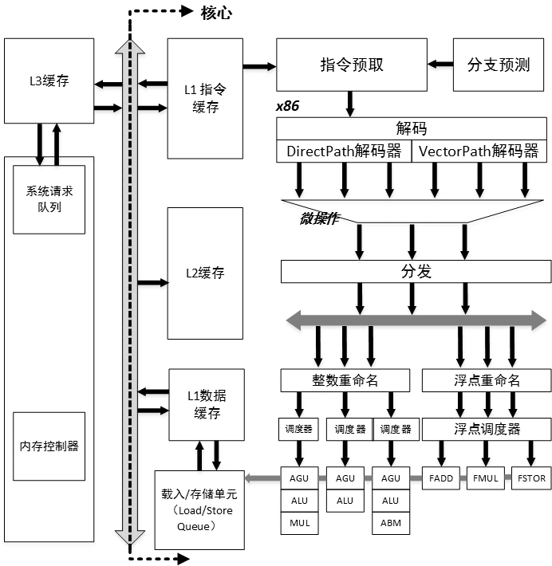

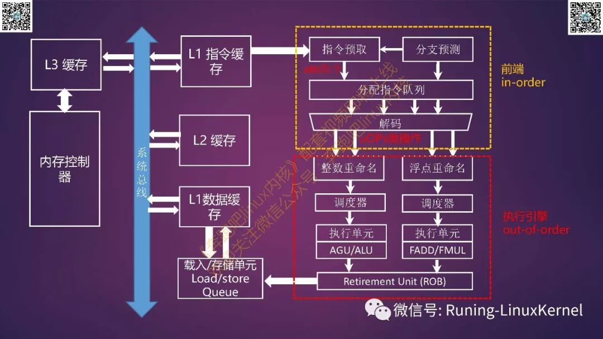

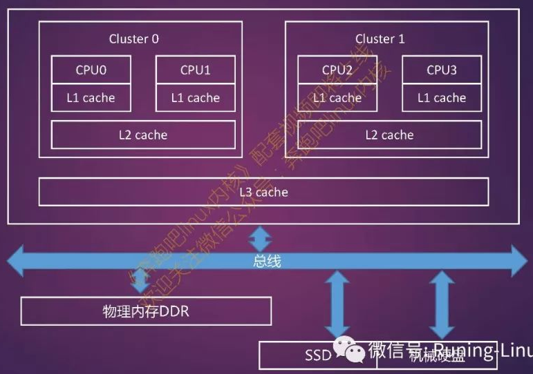

如图 1.2 所示, 在 ARM Cortex-A9 处理器中, 存储指令首先通过**主存储器**或者**L2 cache(L2 cache 中！！！)**加载到**L1 指令 cache**中. 在**指令预取**阶段(instruction prefetch stage), 主要是做**指令预取**和**分支预测**, 然后指令通过 Instruction Queue 队列被送到解码器进行指令的解码工作. 解码器(decode)支持两路解码, 可以同时解码两条指令. 在寄存器重命名阶段(Register rename stage)会做寄存器重命名, 避免机器指令不必要的顺序化操作, 提高处理器的指令级并行能力. 在指令分发阶段(Dispatch stage), 这里支持 4 路猜测发射和乱序执行(Out-of-Order Multi-Issue with Speculation), 然后在执行单元(ALU/MUL/FPU/NEON)中乱序执行. 存储指令会计算有效地址并发送到内存系统中的 LSU 部件(Load Store Unit), 最终 LSU 部件会去访问 **L1 数据 cache**. 在 ARM 中, 只有 cacheable 的内存地址才需要访问 cache.

图 1.2 Cortex-A9 结构框图:

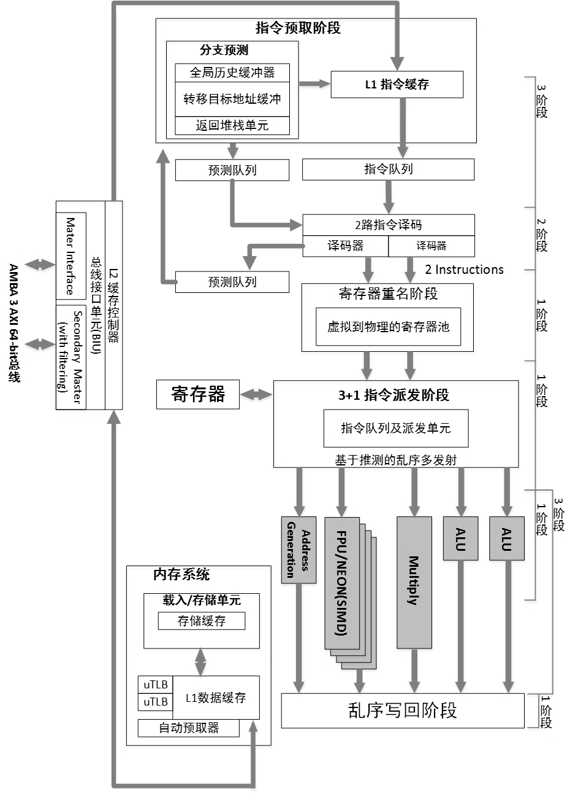

在**多处理器环境(！！！)**下, 还需要考虑 Cache 的一致性问题. **L1 和 L2 Cache 控制器需要保证 cache 的一致性**, 在 Cortex-A9 中 cache 的一致性是由**MESI 协议**来实现的. Cortex-A9 处理器内置了 L1 Cache 模块, 由**SCU(Snoop Control Unit)单元**来实现 Cache 的一致性管理. L2 Cache 需要**外接芯片**(例如 PL310). 在最糟糕情况下需要访问主存储器, 并将数据重新传递给 LSQ, 完成一次存储器读写的全过程.

- **超标量体系结构**(Superscalar Architecture): 早期的单发射结构微处理器的流水线设计目标是做到每个周期能平均执行一条指令, 但这一目标不能满足处理器性能增长的要求, 为了提高处理器的性能, 要求处理器具有**每个周期能发射执行多条指令的能力**. 因此超标量体系结构是描述一种微处理器设计理念, 它能够在**一个时钟周期执行多个指令**.
- **乱序执行**(Out-of-order Execution): 指 CPU 采用了允许将多条指令不按程序规定的顺序分开发送给各相应电路单元处理的技术, 避免处理器在计算对象不可获取时的等待, 从而导致流水线停顿.
- **寄存器重命名**(Register Rename): 现代处理器的一种技术, 用来避免机器指令或者微操作的不必要的顺序化执行, 从而提高处理器的指令级并行的能力. 它在乱序执行的流水线中有两个作用, 一是消除指令之间的寄存器读后写相关(Write-after-Read, WAR)和写后写相关(Write-after-Write, WAW); 二是当指令执行发生例外或者转移指令猜测错误而取消后面的指令时, 可用来保证现场的精确. 其思路为当一条指令写一个结果寄存器时不直接写到这个结果寄存器, 而是先写到一个中间寄存器过渡, 当这条指令提交时再写到结果寄存器中.
- **分支预测**(Branch Predictor): 当处理一个分支指令时, 有可能会产生跳转, 从而打断流水线指令的处理, 因为处理器无法确定该指令的下一条指令, 直到分支指令执行完毕. 流水线越长, 处理器等待时间便越长, 分支预测技术就是为了解决这一问题而出现的. 因此, 分支预测是处理器在程序分支指令执行前预测其结果的一种机制. 在 ARM 中, 使用全局分支预测器, 该预测器由转移目标缓冲器(Branch Target Buffer, BTB)、全局历史缓冲器(Global History Buffer, GHB)、MicroBTB, 以及 Return Stack 组成.
- **指令译码器**(Instruction Decode): 指令由操作码和地址码组成. 操作码表示要执行的操作性质, 即执行什么操作; 地址码是操作码执行时的操作对象的地址. 计算机执行一条指定的指令时, 必须首先分析这条指令的操作码是什么, 以决定操作的性质和方法, 然后才能控制计算机其他各部件协同完成指令表达的功能, 这个分析工作由译码器来完成. 例如, Cortex-A57 可以支持 3 路译码器, 即同时执行 3 条指令译码, 而 Cortex-A9 处理器只能同时译码 2 条指令.
- **调度单元**(Dispatch): 调度器负责把指令或微操作指令派发到相应的执行单元去执行, 例如, Cortex-A9 处理器的调度器单元有 4 个接口和执行单元连接, 因此每个周期可以同时派发 4 条指令.
- **ALU 算术逻辑单元**: ALU 是处理器的执行单元, 主要是进行算术运算, 逻辑运算和关系运算的部件.
- **LSQ/LSU 部件**(Load Store Queue/Unit): LSQ 部件是指令流水线的一个执行部件, 其主要功能是将来自 CPU 的存储器请求发送到存储器子系统, 并处理其下存储器子系统的应答数据和消息.

# 4 请简述内存屏障(memory barrier)产生的原因

程序在运行时的**实际内存访问顺序**和**程序代码编写的访问顺序**不一致, 会导致内存乱序访问.

**内存乱序访问**的出现是为了提高**程序运行时的性能**.

内存乱序访问主要发生在如下两个阶段.

(1)编译时, **编译器优化**导致内存乱序访问.

(2)运行时, **多 CPU 间**交互引起的内存乱序访问.

编译器了解底层 CPU 的思维逻辑, 因此它会在翻译成汇编时进行优化. 例如**内存访问指令的重新排序**, 提高指令级并行效率. 然而, 这些优化可能会违背程序员原始的代码逻辑, 导致发生一些错误. 编译时的乱序访问可以通过 barrier()函数来规避.

```
#define barrier() __asm__ __volatile__ ("" ::: "memory")
```

barrier()函数告诉编译器, 不要为了性能优化而将这些代码重排.

由于现代处理器普遍采用**超标量技术**、**乱序发射**以及**乱序执行**等技术来提高指令级并行的效率, 因此**指令的执行序列**在处理器的流水线中有可能**被打乱**, 与程序**代码编写时序列**的不一致. 另外现代处理器采用**多级存储结构**, 如何保证**处理器对存储子系统访问的正确性**也是一大挑战.

例如, 在一个系统中含有**n 个处理器**P1~Pn, 假设**每个处理器**包含**Si 个存储器操作**, 那么从全局来看可能的**存储器访问序列有多种组合**. 为了保证内存访问的一致性, 需要按照某种规则来选出**合适的组合**, 这个规则叫做**内存一致性模型**(Memory Consistency Model). 这个规则需要保证正确性的前提, 同时也要保证多处理器访问较高的并行度.

在一个**单核处理器系统**中, 访问内存的正确性比较简单. 每次存储器**读操作**所获得的结果是**最近写入的结果**, 但是在**多处理器并发访问存储器**的情况下就很难保证其正确性了. 我们很容易想到使用一个**全局时间比例部件**(Global Time Scale)来决定存储器访问时序, 从而**判断最近访问的数据**. 这种内存一致性访问模型是严格一致性(Strict Consistency)内存模型, 也称为 Atomic Consistency. 全局时间比例方法实现的代价比较大, 那么退而求其次, 采用每一个处理器的**本地时间比例部件**(Local Time Scale)的方法来**确定最新数据**的方法被称为**顺序一致性内存模型**(Sequential Consistency). 处理器一致性内存模型(Processor Consistency)是进一步弱化, 仅要求来自**同一个处理器**的**写操作**具有一致性的访问即可.

以上这些内存一致性模型是针对**存储器读写指令**展开的, 还有一类目前广泛使用的模型, 这些模型使用**内存同步指令**, 也称为**内存屏障指令**. 在这种模型下, **存储器访问指令**被分成**数据指令**和**同步指令**两大类, **弱一致性内存模型(weak consistency)就**是基于这种思想的.

1986 年, Dubois 等发表的论文描述了**弱一致性内存模型**的定义.

- 对同步变量的访问是顺序一致的.
- 在所有之前的写操作完成之前, 不能访问同步变量.
- 在所有之前同步变量的访问完成之前, 不能访问(读或者写)数据.

弱一致性内存模型要求同步访问是顺序一致的, 在一个同步访问可以被执行之前, 所有之前的数据访问必须完成. 在一个正常的数据访问可以被执行之前, 所有之前的同步访问必须完成. 这实质上**把一致性问题留给了程序员来决定**.

ARM 的 Cortex-A 系列处理器实现弱一致性内存模型, 同时也提供了 3 条内存屏障指令.

# 5 ARM 有几条 memory barrier 的指令?分别有什么区别?

从 ARMv7 指令集开始, ARM 提供 3 条内存屏障指令.

(1)**数据存储屏障**(Data Memory Barrier, DMB)

数据存储器隔离. DMB 指令保证: 仅当所有在它前面的**存储器访问操作**都执行完毕后, 才**提交**(commit)在它后面的存取访问操作指令. 当位于此指令前的所有内存访问均完成时, DMB 指令才会完成.

(2)**数据同步屏障**(Data synchronization Barrier, DSB)

数据同步隔离. 比 DMB 要严格一些, 仅当所有在它前面的**存储访问操作指令**都执行完毕后, 才会**执行**在它后面的指令, 即任何指令都要等待 DSB 前面的存储访问完成. 位于此指令前的所有缓存, 如分支预测和 TLB(Translation Look-aside Buffer)维护操作全部完成.

(3)**指令同步屏障**(Instruction synchronization Barrier, ISB)

指令同步隔离. 它最严格, 冲洗流水线(Flush Pipeline)和预取 buffers(pretcLbuffers)后, 才会从 cache 或者内存中预取 ISB 指令之后的指令. **ISB 通常用来保证上下文切换的效果**, 例如更改 ASID(Address Space Identifier)、TLB 维护操作和 C15 寄存器的修改等.

内存屏障指令的使用例子如下.

例 1: 假设有**两个 CPU 核 A 和 B**, 同时访问 Addr1 和 Addr2 地址.

```
Core A:
    STR R0, [Addr1]
    LDR R1, [Addr2]

Core B:
    STR R2, [Addr2]
    LDR R3, [Addr1]
```

对于上面代码片段, 没有任何的同步措施. 对于 Core A、寄存器 R1、Core B 和寄存器 R3, 可能得到如下 4 种不同的结果.

- A 得到旧的值, B 也得到旧的值.
- A 得到旧的值, B 得到新的值.
- A 得到新的值, B 得到旧的值.
- A 得到新的值, B 得到新的值.

例 2: 假设 Core A 写入新数据到 Msg 地址, Core B 需要判断 flag 标志后才读入新数据.

```
Core A:
    STR R0, [Msg] @ 写新数据到 Msg 地址
    STR R1, [Flag] @ Flag 标志新数据可以读

Core B:
    Poll_loop:
        LDR R1, [Flag]
        CMP R1,#0 @ 判断 flag 有没有置位
        BEQ Poll_loop
        LDR R0, [Msg] @ 读取新数据
```

在上面的代码片段中, Core B 可能读不到最新的数据, 因为 Core B 可能因为乱序执行的原因先读入 Msg, 然后读取 Flag. 在弱一致性内存模型中, 处理器不知道 Msg 和 Flag 存在数据依赖性, 所以程序员必须使用内存屏障指令来显式地告诉处理器这两个变量有数据依赖关系. Core A 需要在两个存储指令之间插入 DMB 指令来保证两个 store 存储指令的执行顺序. Core B 需要在"`LDR R0, [Msg]`"之前插入 DMB 指令来保证直到 Flag 置位才读入 Msg.

例 3: 在一个设备驱动中, **写入一个命令**到一个**外设寄存器**中, 然后等待状态的变化.

```
STR R0, [Addr] @ 写一个命令到外设寄存器
DSB
Poll_loop:
    LDR R1, [Flag]
    CMP R1,#0 @ 等待状态寄存器的变化
    BEQ Poll_loop
```

在 STR 存储指令之后插入**DSB 指令**, 强制让**写命令完成**, 然后执行**读取 Flag**的判断循环.

# 6 请简述 cache 的工作方式

处理器访问主存储器使用**地址编码方式**. **cache**也使用类似的**地址编码方式**, 因此处理器使用这些编码地址可以访问**各级 cache**. 如图 1.3 所示, 是一个经典的 cache 架构图.

图 1.3  经典 cache 架构:

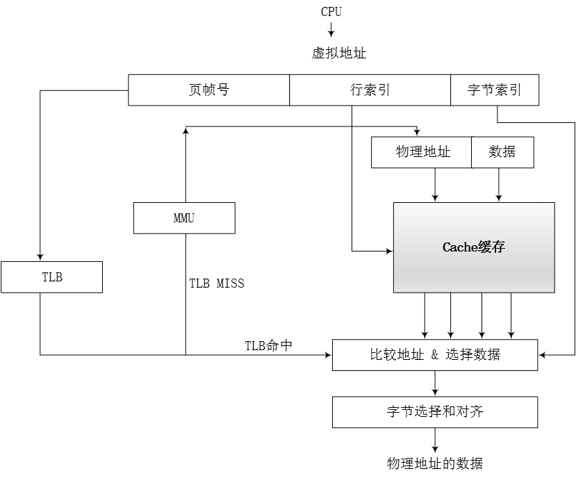

**处理器在访问存储器**时, 会把**地址(虚拟地址)同时**传递给 **TLB**(Translation Lookaside Buffer)和**cache**. **TLB**是一个用于存储**虚拟地址到物理地址转换**的小缓存, 处理器先使用 EPN(effective page number)在 TLB 中进行查找最终的 RPN(Real Page Number). 如果这期间发生**TLB miss**, 将会带来一系列严重的系统惩罚, 处理器需要**查询页表**. 假设这里 TLB Hit, 此时很快获得合适的 RPN, 并得到相应的物理地址(Physical Address, PA).

同时, 处理器通过**cache 编码地址**(**来源是什么??**)的**索引域**(Cache Line Index)可以很快找到**相应的 cache line 组**. 但是这里的 cache block 的数据不一定是处理器所需要的, 因此有必要进行一些**检查**, 将 cache line 中存放的**地址(物理地址)**和通过虚实地址转换得到的**物理地址(来自 TLB 或查询页表得到)**进行比较. 如果**相同并且状态位匹配**, 那么就会发生 cache 命中(Cache Hit), 那么处理器经过**字节选择和偏移**(Byte Select and Align)部件, 最终就可以获取**所需要的数据(不需要访问主存了)**. 如果发生 cache miss, 处理器需要用物理地址进一步访问主存储器来获得最终数据, 数据也会填充到相应的 cache line 中. 上述描述的是 **VIPT**(virtual Index physical Tag)的 cache 组织方式, 将会在问题 9 中详细介绍.


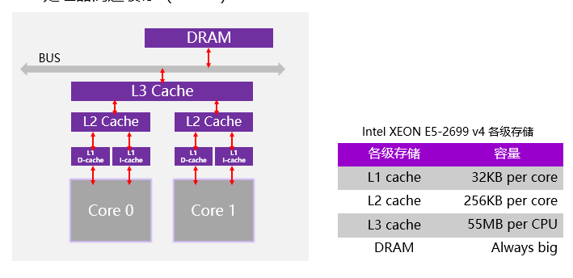


如图所示(**图中的 cluster 应该是 package, 表示物理 CPU**), 一个拥有**2 个 CPU**的系统, **每个 CPU**有**两个 Core**, **每个 Core**有**两个线程(图中没有显示)的 Cache 架构**. **每一个 Core(以 core 为单位！！！**)有**单独的 L1 cache(！！！**), 它由**其中的线程所共享**, **每一个 CPU(物理 CPU**)中的**所有 Core**共享**同一个 L2 Cache**, **同一个 cluster 的所有的 CPU**共享**同一个 L3 Cache**.

**L1 cache**最靠近处理器核心, 因此它的访问**速度也是最快**的, 当然它的容量也是最小的. CPU 访问各级的 Cache 速度和延迟是不一样的, **L1 Cache 的延迟最小**, **L2 Cache 其次**, **L3 Cache 最慢**.

**CPU**访问一块**新的内存**时, 它会首先把包含**这块内存的 Cache Line 大小的内容(！！！**)获取到**L3 Cache**, 然后是载入到**L2 Cache**, 最后载入到了**L1 Cache**. 这个过程需要**访问主存储器**, 因此**延迟会很大**, 大约需要**几十纳秒**. 当**下次再读取相同一块数据**的时候**直接从 L1 Cache 里取数据**的话, 这个延迟**大约只有 4 个时钟周期**. 当**L1 Cache 满**了并且有**新的数据**要进来, 那么根据**Cache 的置换算法**会选择**一个 Cache line**置换到**L2 Cache**里, **L3 Cache**也是同样的道理.

访问类型 | 延迟
---|---
L1 cache 命中 | 约 4 个时钟周期
L2 cache 命中 | 约 100 纳秒
L3 cache 命中 | 约 100 纳秒
访问本地 DDR | 约 100 纳秒
访问远端内存节点 DDR | 约 100 纳秒

- 处理器**首次访问主存上的某地址**时, 会将**此地址所在单位大小的内容**依次载入**L3, L2, L1 Cache**
- 短时间内, 处理器**再次访问这个地址**时, 将**直接从 L1 Cache 读取**
- **强烈关注这几个 cache 的位置！！！**, 注意上面那个图的**L3 cache**位置不对, 应该在**CPU 里面**

如图 1.4 所示, 是 cache 的基本的结构图.

图 1.4  cache 结构图:

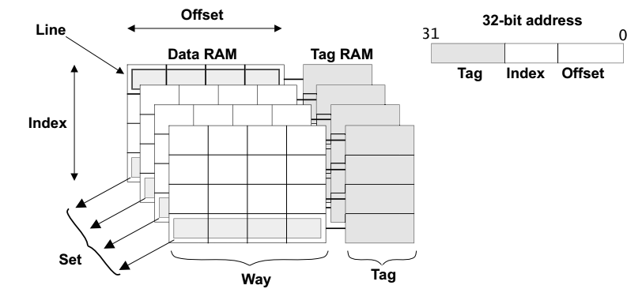

- **cache 地址编码**: 处理器访问 cache 时的地址编码, 分成 3 个部分, 分别是**偏移域(Offset)、索引域(Index)和标记域(Tag)**.
- **Cache Line**: cache 中**最小的访问单元**, 包含一小段**主存储器中的数据**, 常见的 cache line 大小是 **32Byte(字节) 或 64Byte(字节)** 等.
- 索引域(Index): cache 地址编码的一部分, 用于索引和查找是在**cache 中的哪一行**, 得到**相同 cache line 组成的组(set**), 所以又叫**组索引**.
- 组(Set): **相同索引域**的 cache line 组成一个组(**类似于磁盘的柱面<所有盘面的相同磁道>概念, 相同索引域一般在每个路中, 所以这个组分布在多个 cache 路中, 通过索引域索引出来的是组, 而不是具体的 cache line, cache line 通过 tag 得到**).
- 路(Way): 在**组相联**的 cache 中, cache 被分成**大小相同的几个块(类似于磁盘的盘面的概念)**.
- 标记(Tag): cache 地址编码的一部分, 用于判断 cache line 存放的数据是否和处理器想要的一致(**通过 tag 可以获取 set 中的特定路, 即特定的 cache line, 类似于查找具体盘面中磁道的概念**).

**组相连**中, **cache**被分为**大小相同的块**(称为**way, 即路, 类似于磁盘的盘面**), **每个 way**中有**多个 cache line**, **每个 way**中的**cache line**(cache 中**最小访问单元**, 包含一小段主存中的数据, 常见大小是**32 或 64 字节**)都有**索引**(即**index, 索引域**), **相同索引域**的**cache line**组成一个**组**(即**set**, 相同索引域一般分别存在于每个 way 中, 类似于**磁盘的柱面<所有盘面的相同磁道**>).

处理器访问 cache 时的地址编码(处理器自己内部自发行为！！！)分为 3 个部分, 分别是

- **索引域(index, 用来在整个 cache 中索引得到 cache 组, 所以又叫组索引, 类似于在整个磁盘中找柱面**)
- **标记域(tag, 用于在 cache 组中索引得到特定的 cache line, 类似于在柱面中查找磁道**)
- **偏移域(offset, 用来在 cache line 中查找数据, 类似于在磁道中查找扇区**).

处理器**自我组装 cache 地址编码**, 然后通过**索引域(index**)查找**组(set**), 然后通过**标记(tag**)查找**组中具体的 cache line**, 处理器**直接拿到所有 cache line 数据**, 然后通过**偏移(offset**)查找到**具体数据**.

# 7 cache 的映射方式有 full-associative(全关联)、direct-mapping(直接映射)和 set-associative(组相联)3 种方式, 请简述它们之间的区别. 为什么现代的处理器都使用组相联的 cache 映射方式?

(1)直接映射(Direct-mapping)

根据**每个组(set)的高速缓存行数**, cache 可以分成不同的类. 当每个组只有一行 cache line 时, 称为直接映射高速缓存.

如图 1.5 所示, 下面用一个简单的 cache 来说明, 这个 cache 只有 4 行 cache line, **每行有 4 个字**(word, 一个字是 4 个 Byte), 共 64Byte. 这个 cache 控制器可以使用**两个比特位**(bits[3:2])来**选择 cache line 中的字**, 以及使用另外**两个比特位**(bits[5:4])作为**索引**(Index), 选择**4 个 cache line 中的一个**, 其余的比特位用于存储标记值(Tag).

在这个 cache 中查询, 当索引域和标记域的值和查询的地址相等, 并且有效位显示这个 cache line 包含有效数据时, 则发生 cache 命中, 那么可以使用偏移域来寻址 cache line 中的数据. 如果 cache line 包含有效数据, 但是标记域是其他地址的值, 那么这个 cache line 需要被替换. 因此, 在这个 cache 中, 主存储器中所有 bit[5:4]相同值的地址都会映射到同一个 cache line 中, 并且同一时刻只有一个 cache line, 因为 cache line 被频繁换入换出, 会导致严重的 cache 颠簸(**cache thrashing**).

图 1.5 直接映射的 cache 和 cache 地址:

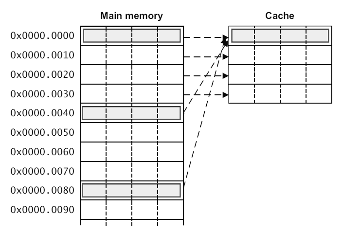

假设在下面的代码片段中, result、data1 和 data2 分别指向 0x00、0x40 和 0x80 地址, 它们都会使用同一个 cache line.

```
void add_array(int  * data1, int  * data2, int  * result, int size)
{
    int i;
    for (i=0 ; i<size ; i++) {
        result[i] = data1[i] + data2[i];
    }
}
```

- 当第一次读 data1 即 0x40 地址时, 因为不在 cache 里面, 所以读取从 0x40 到 0x4f 地址的数据填充到 cache line 中.
- 当读 data2 即 0x80 地址的数据时, 数据不在 cache line 中, 需要把从 0x80 到 0x8f 地址的数据填充到 cache line 中, 因为地址 0x80 和 0x40 映射到同一个 cache line, 所以 cache line 发生替换操作.
- result 写入到 0x00 地址时, 同样发生了 cache line 替换操作.
- 所以这个代码片段发生严重的 cache 颠簸, 性能会很糟糕.

(2)组相联(set associative)

为了解决直接映射高速缓存中的 cache 颠簸(cache thrashing)问题, 组相联的 cache 结构在现代处理器中得到广泛应用.

如图 1.6 所示, 下面以一个 2 路组相联的 cache 为例, **每个路(way)包括 4 个 cache line**, 那么**每个组(set, 相同索引域)有两个 cache line(分布在两个路中**)可以提供 cache line 替换.

图 1.6 2 路组相联的映射关系:

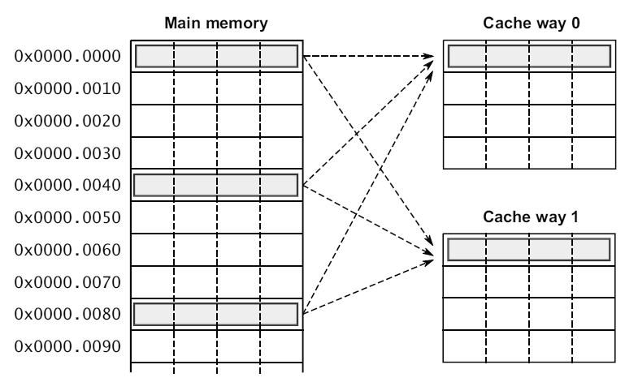

地址 0x00、0x40 或者 0x80(**四个 cache line, 所以需要以 4 为单位映射 cache line**)的数据可以映射到**同一个组中任意一个 cache line**. 当 cache line 要发生替换操作时, 就有**50%的概率可以不被替换**, 从而减小了 cache 颠簸.

# 8 在一个 32KB 的 4 路组相联的 cache 中, 其中 cache line 为 32Byte, 请画出这个 cache 的 cache line、way 和 set 的示意图.

在 Cortex-A7 和 Cortex-A9 的处理器上可以看到 32KB 大小的 4 路组相联 cache. 下面来分析这个 cache 的结构图.

cache 的总大小为 32KB, 并且是 4 路(way, **大小相同的块**), 所以**每一路的大小为 8KB**:

```
way_size = 32 / 4 = 8(KB)
```

**cache Line 的大小为 32Byte**, 所以每一路包含的 cache line 数量为:

```
num_cache_line = 8KB/32B = 256
```

所以在 cache 编码地址 Address 中,

- **bit\[4\:0**\]用于**选择 cache line 中的数据(共 5 位, offset**), 其中 bit\[4\:2\]可以用于**寻址 8 个字**, bit\[1\:0\]可以用于寻址**每个字中的字节(这里一个字 2 个字节)**.
- **bit\[12\:5**\]用于索引(**Index**)选择**每一路上 cache line**(因为每路有 256 个 cache line, 所以需要 lg256 =8 位来索引), 得到**相同 cache line 的组 set**
- 其余的**bit\[31\:13**\]用作**标记位(Tag**), 如图 1.7 所示.

图 1.7 32KB 4 路组相联 cache line32byte 的 cache 结构图

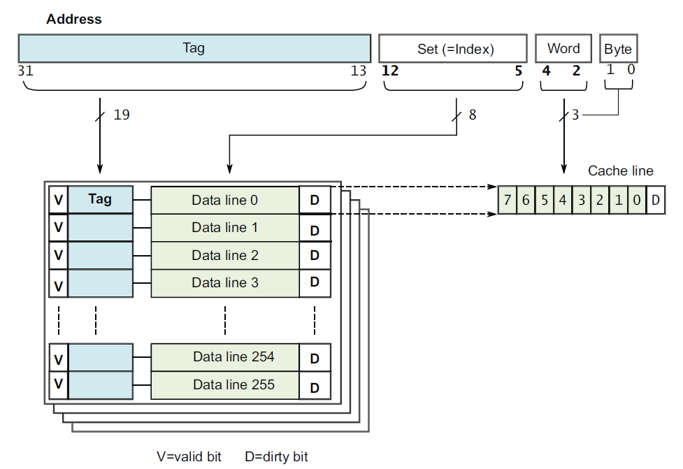

# 9 ARM9 处理器的 Data Cache 组织方式使用的 VIVT, 即虚拟 Index 虚拟 Tag, 而在 Cortex-A7 处理器中使用 PIPT, 即物理 Index 物理 Tag, 请简述 PIPT 比 VIVT 有什么优势?

处理器在进行存储器访问时, 处理器访问地址是虚拟地址(virtual address, VA), 经过 TLB 和 MMU 的映射, 最终变成了物理地址(physical address, PA). 那么**查询 cache 组**是用虚拟地址, 还是物理地址的**索引域**(Index, **通过索引域索引出来的是 set, 而不是具体 cache line**)呢?当找到 cache 组时, 我们是用虚拟地址, 还是物理地址的**标记域**(Tag)来**匹配 cache line**呢?

**cache**可以设计成通过**虚拟地址**或者**物理地址**来**访问**, 这个在处理器设计时就确定下来了, 并且对 cache 的管理有很大的影响. cache 可以分成如下 3 类.

- VIVT(Virtual Index Virtual Tag): 使用虚拟地址索引域和虚拟地址的标记域.
- VIPT(Virtual Index Physical Tag): 使用虚拟地址索引域和物理地址的标记域.
- PIPT(Physical Index Physical Tag): 使用物理地址索引域和物理地址的标记域.

图 1.7 32KB 4 路组相联 cache 结构图

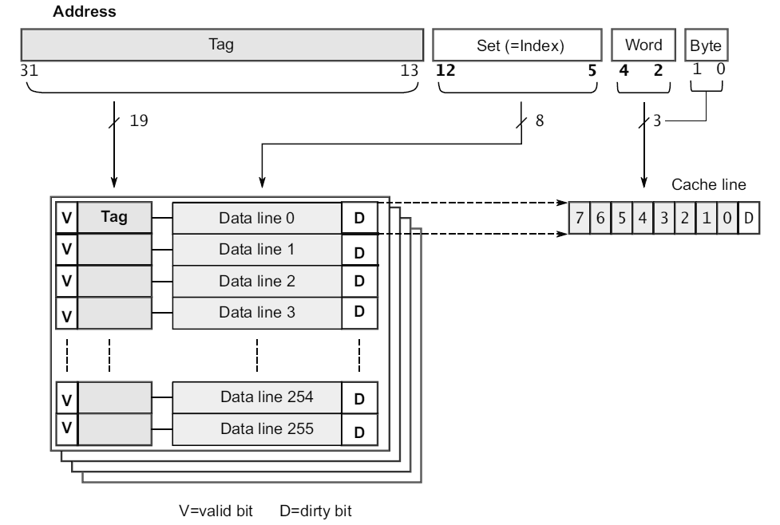

在早期的 ARM 处理器中(比如 ARM9 处理器)采用 VIVT 的方式, **不用经过 MMU 的翻译**, 直接使用虚拟地址的**索引域和标记域来查找 cache line**, 这种方式会导致**高速缓存别名**(cache alias)问题. 例如**一个物理地址的内容可以出现在多个 cache line 中**, 当系统**改变了虚拟地址到物理地址映射**时, 需要清洗(clean)和无效(invalidate)这些 cache, 导致系统性能下降.

ARM11 系列处理器采用 VIPT 方式, 即处理器输出的虚拟地址同时会发送到 TLB/MMU 单元进行地址翻译, 以及在 cache 中进行索引和查询 cache 组. 这样 cache 和 TLB/MMU 可以同时工作, 当 TLB/MMU 完成地址翻译后, 再用物理标记域来匹配 cache line. 采用 VIPT 方式的好处之一是在**多任务操作系统**中, 修改了虚拟地址到物理地址映射关系, **不需要把相应的 cache 进行无效**(invalidate)操作.

ARM Cortex-A 系列处理器的数据 cache 开始采用 PIPT 的方式. 对于 PIPT 方式, 索引域和标记域都采用物理地址, cache 中只有一个 cache 组与之对应, 不会产生高速缓存别名的问题. PIPT 的方式在芯片设计里的逻辑比 VIPT 要复杂得多.

采用**VIPT 方式**也有可能导致**高速缓存别名**的问题. 在 VIPT 中, 使用**虚拟地址的索引域**来查找**cache 组**, 这时有可能导致**多个 cache 组映射到同一个物理地址**上. 以 Linux kernel 为例, 它是以 4KB 大小为一个页面进行管理的, 那么对于一个页来说, 虚拟地址和物理地址的低 12bit(bit\[11\:0\])是一样的. 因此, **不同的虚拟地址映射到同一个物理地址, 这些虚拟页面的低 12 位是一样的**. 如果索引域位于 bit\[11\:0\]范围内, 那么就不会发生高速缓存别名. 例如, cache line 是 32Byte, 那么数据偏移域 offset 占 5bit, 有 128 个 cache 组, 那么索引域占 7bit, 这种情况下刚好不会发生别名. 另外, 对于 ARM Cortex-A 系列处理器来说, **cache 总大小**是可以在芯片集成中**配置**的. 如表 1.1 所示, 列举出了 Cortex-A 系列处理器的 cache 配置情况.

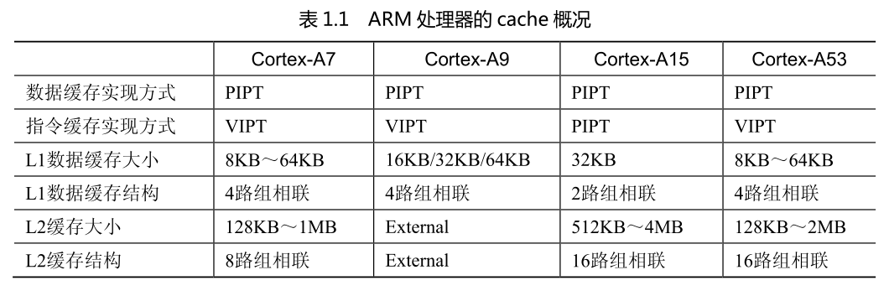

# 10 请画出在二级页表架构中虚拟地址到物理地址查询页表的过程.

**CPU 执行指令中使用的地址都是虚拟地址, 除非需要使用 MMU 才会进行物理地址转换！！！**

如图 1.8, ARM 处理器的**内存管理单元**(Memory Management Unit, MMU)包括**TLB**和**Table Walk Unit**两个部件. **TLB 是一块高速缓存**, 用于缓存**页表转换的结果**, 从而减少内存访问的时间. 一个完整的**页表翻译和查找**的过程叫作**页表查询**(Translation table walk), 页表查询的过程由硬件自动完成, 但是**页表的维护需要软件来完成**. 页表查询是一个相对耗时的过程, 理想的状态下是 TLB 里存有页表相关信息. 当**TLB Miss**时, 才会去**查询页表**, 并且开始读入页表的内容.

图 1.8 ARM 内存管理架构:

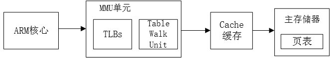

## (1)ARMv7-A 架构的页表

ARMv7-A 架构支持**安全扩展**(Security Extensions), 其中 Cortex-A15 开始支持**大物理地址扩展**(Large Physical Address Extension, LPAE)和**虚拟化扩展**, 使得 MMU 的实现比以前的 ARM 处理器要复杂得多.

如图 1.9 所示, 如果使能了**安全扩展**, ARMv7-A 处理器分成安全世界(Secure World)和非安全世界(Non-secure World, 也称为 Normal World).

如果处理器使能了**虚拟化扩展**, 那么处理器会在**非安全世界**中增加一个**Hyp 模式**.

在**非安全世界**(Non-Secure)中, 运行特权被划分为 PL0、PL1 和 PL2.

图 1.9 ARMv7-A 架构的运行模式和特权:

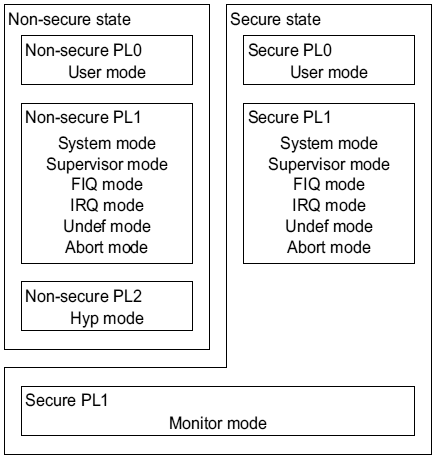

- **PL0 等级**: 这个特权等级运行在**用户模式**(User Mode), 用于运行用户程序, 它是没有系统特权的, 比如没有权限访问处理器内部的硬件资源.
- **PL1 等级**: 这个等级包括 ARMv6 架构中的 System 模式、SVC 模式、FIQ 模式、IRQ 模式、Undef 模式, 以及 Abort 模式. Linux 内核运行在 PL1 等级, 应用程序运行在 PL0 等级. 如果使能了**安全扩展**, 那么安全模式里有一个 Monitor 模式也是运行在 secure PL1 等级, **管理安全世界和非安全世界的状态转换**.
- **PL2 等级**: 如果使能了**虚拟化扩展**, 那么超级管理程序(**Hypervisor**)就运行这个等级, 它运行在 Hyp 模式, 管理 GuestOS 之间的切换.

当处理器使能了虚拟化扩展, MMU 的工作会变得更复杂. 我们这里只讨论处理器**没有使能安全扩展和虚拟化扩展**的情况. ARMv7 处理器的二级页表根据最终页的大小可以分为如下 4 种情况.

- 超级大段(SuperSection): 支持 16MB 大小的超级大块.
- 段(section): 支持 1MB 大小的段.
- 大页面(Large page): 支持 64KB 大小的大页.
- 页面(page): 4KB 的页, Linux 内核默认**使用 4KB 的页**.

如果只需要支持超级大段和段映射, 那么只需要一级页表即可. 如果要支持**4KB 页面**或**64KB 大页**映射, 那么需要用到**二级页表**. 不同大小的映射, 一级或二级页表中的页表项的内容也不一样. 如图 1.10 所示, 以 4KB 页的映射为例.

图 1.10 ARMv7-A 二级页表查询过程:

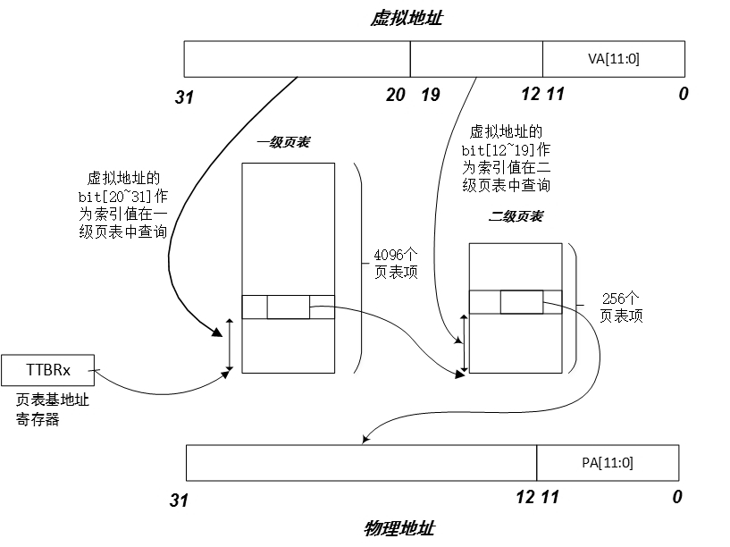

当 TLB Miss 时, 处理器查询页表的过程如下.

- 处理器根据**页表基地址控制寄存器 TTBCR**和**虚拟地址**来判断使用哪个**页表基地址寄存器**, 是**TTBR0**还是**TTBR1**. 页表基地址寄存器中存放着**一级页表**的**基地址**.
- 处理器根据虚拟地址的**bit\[31\:20\](12 位)**作为索引值, 在一级页表中找到页表项, 一级页表一共有 4096 个页表项.
- 第一级页表的表项中存放有二级页表的**物理基地址**. 处理器根据虚拟地址的 bit**\[19\:12\](8 位)**作为索引值, 在二级页表中找到相应的页表项, 二级页表有 256 个页表项.
- **二级页表**的页表项里存放有**4KB 页的物理基地址**, 因此处理器就完成了页表的查询和翻译工作. (**通过该物理基地址和虚拟地址低 12 位相加**)

如图 1.11 所示的 4KB 映射的一级页表的表项, bit\[1\:0\]表示是一个页映射的表项, bit\[31\:10\]指向二级页表的物理基地址.

图 1.11 4KB 映射的一级页表的表项:

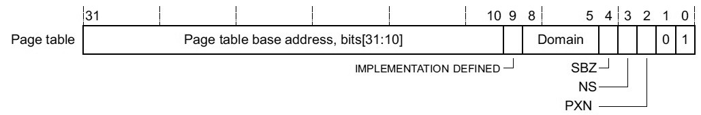

如图 1.12 所示的 4KB 映射的二级页表的表项, bit\[31\:12\]指向 4KB 大小的页面的物理基地址.

图 1.12 4KB 映射的二级页表的表项

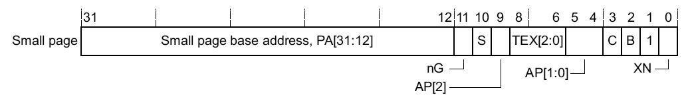

## (2)ARMv8-A 架构的页表

ARMv8-A 架构**开始支持 64bit 操作系统**. 从 ARMv8-A 架构的处理器可以同时支持 64bit 和 32bit 应用程序, 为了兼容 ARMv7-A 指令集, 从架构上定义了 AArch64 架构和 AArch32 架构.

AArch64 架构和 ARMv7-A 架构一样支持安全扩展和虚拟化扩展. 安全扩展把 ARM 的世界分成了**安全世界**和**非安全世界**. AArch64 架构的**异常等级**(Exception Levels)确定其**运行特权级别**, 类似 ARMv7 架构中特权等级, 如图 1.13 所示.

- EL0: **用户特权**, 用于运行普通用户程序.
- EL1: **系统特权**, 通常用于运行操作系统.
- EL2: 运行虚拟化扩展的 **Hypervisor**.
- EL3: 运行**安全世界**中的 **Secure Monitor**.

在 AArch64 架构中的 MMU 支持单一阶段的地址页表转换, 同样也支持虚拟化扩展中的两阶段的页表转换.

- **单一阶段页表**: 虚拟地址(VA)翻译成物理地址(PA).
- **两阶段页表**(**虚拟化扩展**):
    - 阶段 1 — 虚拟地址翻译成**中间物理地址**(Intermediate Physical Address, IPA).
    - 阶段 2 — 中间物理地址 IPA 翻译成最终物理地址 PA.

图 1.13 AArch64 架构的异常等级:

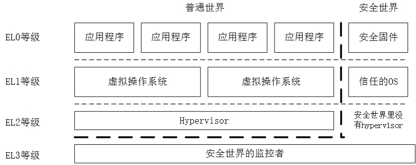

在 AArch64 架构中, 因为**地址总线带宽最多 48(看图, 64 位只使用了 48 位！！！！)位**, 所以**虚拟地址 VA 被划分为两个空间, 每个空间最大支持 256TB(不是将这 48 位分割成两部分, 而是在 64 位中使用了低 48 位有效位, 其余要么全 0 要么全 1, 所以注意下面两个的范围！！！)**.

- 低位的虚拟地址空间位于**0x0000\_0000\_0000\_0000 到 0x0000\_FFFF\_FFFF\_FFFF**(**使用低 48 位, 高位全为 0**). 如果**虚拟地址最高位 bit63**等于 0, 那么就使用这个虚拟地址空间, 并且使用 **TTBR0**(Translation Table Base Register)来存放页表的基地址.
- 高位的虚拟地址空间位于**0xFFFF\_0000\_0000\_0000 到 0xFFFF\_FFFF\_FFFF\_FFFF**(**使用低 48 位, 高位全为 1**). 如果**虚拟地址最高位 bit63 等于 1**, 那么就使用这个虚拟地址空间, 并且使用 **TTBR1**来存放页表的基地址.

如图 1.14 所示, AArch64 架构处理地址映射图, 其中页面是 4KB 的小页面. AArch64 架构中的页表支持如下特性.

图 1.14 AArch64 架构地址映射图(4KB 页):

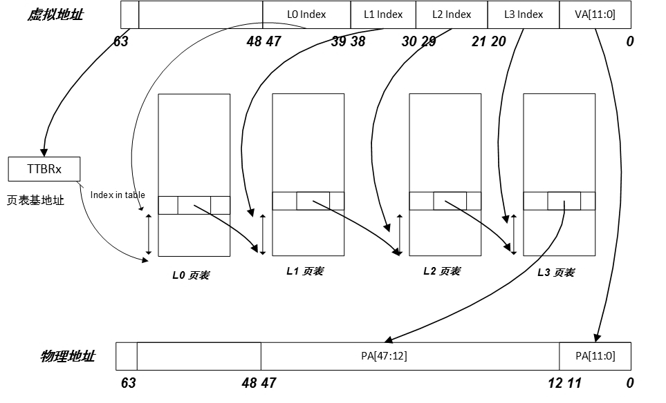

- 最多可以支持 4 级页表.
- **输入地址最大有效位宽 48bit**.
- **输出地址最大有效位宽 48bit**(**有效位宽 48 位, 也就是说物理地址可能 64 位, 但是有效位只有 48 位, 见图**).
- 翻译的最小粒度可以是 4KB、16KB 或 64KB.

# 11 在多核处理器中, cache 的一致性是如何实现的?请简述 MESI 协议的含义.

**高速缓存一致性**(cache coherency)产生的原因是在一个处理器系统中**不同 CPU 核**上的数据**cache**和**内存**可能具有同一个数据的**多个副本**, 在仅有一个 CPU 核的系统中不存在一致性问题. 维护 cache 一致性的**关键**是跟踪**每一个 cache line 的状态**, 并根据处理器的**读写操作**和**总线**上的相应传输来**更新**cache line 在**不同 CPU 核上的数据 cache**中的**状态**, 从而维护 cache 一致性.

cache 一致性有**软件**和**硬件**两种方式, 有的处理器架构提供显式操作 cache 的指令, 例如 PowerPC, 不过现在大多数处理器架构**采用硬件方式来维护**. 在处理器中通过**cache 一致性协议**来实现, 这些协议维护一个**有限状态机**(Finite State Machine, FSM), 根据存储器**读写指令或总线上的传输**, 进行**状态迁移**和相应的**cache 操作**来保证 cache 一致性, 不需要软件介入.

cache 一致性协议主要有两大类别, 一类是**监听协议**(Snooping Protocol), **每个 cache**都要**被监听**或者**监听**其他 cache 的总线活动; 另外一类是**目录协议**(Directory Protocol), **全局统一**管理 cache 状态.

1983 年, James Goodman 提出 Write-Once 总线监听协议, 后来演变成目前最流行的 MESI 协议. 总线监听协议依赖于这样的事实, 即**所有的总线传输事务对于系统内所有的其他单元是可见的**, 因为**总线是一个基于广播通信(广播通信！！！)的介质**, 因而可以由**每个处理器的 cache 来进行监听**. 这些年来人们已经提出了数十种协议, 这些协议基本上都是 write-once 协议的变种. 不同的协议需要不同的通信量, 要求太多的通信量会浪费总线带宽, 使总线争用变多, 留下来给其他部件使用的带宽就减少. 因此, 芯片设计人员尝试将保持一致性的协议**所需要的总线通信量减少到最小**, 或者尝试**优化**某些频繁执行的操作.

目前, ARM 或 x86 等处理器广泛使用类似**MESI 协议**来维护 cache 一致性. MESI 协议的**得名**源于该协议使用的**修改态(Modified)、独占态(Exclusive)、共享态(Shared)和失效态(Invalid)这 4 个状态**. cache line 中的状态**必须是**上述 4 种状态中的一种. MESI 协议还有一些变种, 例如 MOESI 协议等, 部分的 ARMv7-A 和 ARMv8-A 处理器使用该变种.

cache line 中有**两个标志**: **dirty**和**valid**. 它们很好地描述了**cache 和内存之间的数据关系**, 例如数据是否有效、数据是否被修改过. 在 MESI 协议中, 每个 cache line 有 4 个状态, 可**用 2bit 来表示**.

如表 1.2 和表 1.3 所示, 分别是 MESI 协议 4 个状态的说明和 MESI 协议各个状态的转换关系.

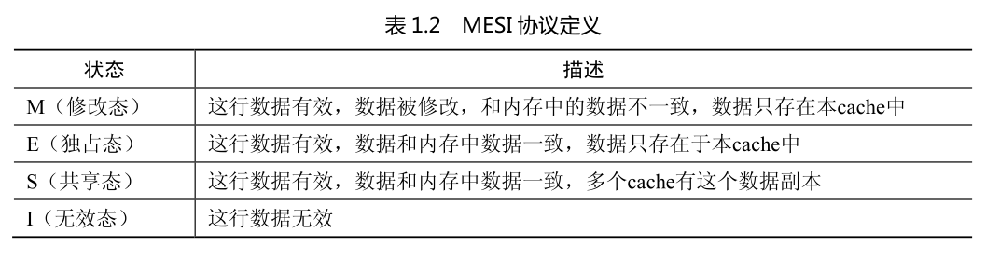

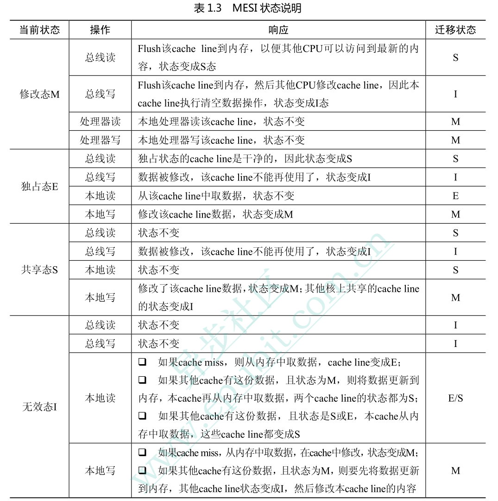

- 修改和独占状态的 cache line, 数据都是独有的, 不同点在于修改状态的数据是脏的, 和内存不一致, 而独占态的数据是干净的和内存一致. 拥有修改态的 cache line 会在某个合适的时候把该 cache line 写回内存中, 其后的状态变成共享态.
- 共享状态的 cache line, 数据和其他 cache 共享, 只有干净的数据才能被多个 cache 共享.
- I 的状态表示这个 cache line 无效.

MOESI 协议增加了一个 O(Owned)状态, 并在 MESI 协议的基础上重新定义了 S 状态, 而 E、M 和 I 状态与 MESI 协议的对应状态相同.

- O 位. O 位为 1, 表示在当前 cache 行中包含的数据是当前处理器系统最新的数据复制, 而且在其他 CPU 中可能具有该 cache 行的副本, 状态为 S. 如果主存储器的数据在多个 CPU 的 cache 中都具有副本时, 有且仅有一个 CPU 的 Cache 行状态为 O, 其他 CPU 的 cache 行状态只能为 S. 与 MESI 协议中的 S 状态不同, 状态为 O 的 cache 行中的数据与存储器中的数据并不一致.
- S 位. 在 MOESI 协议中, S 状态的定义发生了细微的变化. 当一个 cache 行状态为 S 时, 其包含的数据并不一定与存储器一致. 如果在其他 CPU 的 cache 中不存在状态为 O 的副本时, 该 cache 行中的数据与存储器一致; 如果在其他 CPU 的 cache 中存在状态为 O 的副本时, cache 行中的数据与存储器不一致.

# 12 cache 在 Linux 内核中有哪些应用?

cache line 的空间都很小, 一般也就 32Byte. CPU 的**cache 是线性排列的**, 也就是说一个 32Byte 的 cache line 与**32Byte 的地址对齐**, 另外相邻的地址会在不同的 cache line 中错开, 这里是指 32\*n 的相邻地址.

cache 在 linux 内核中有很多巧妙的应用, 总结归纳如下.

(1)内核中**常用的数据结构**通常是和**L1 cache**对齐的. 例如, mm\_struct、fs\_cache 等数据
结构使用"SLAB\_HWCACHE\_ALIGN"标志位来创建 slab 缓存描述符, 见 proc\_caches\_init()函数.

(2)一些常用的数据结构在定义时就约定数据结构以**L1 Cache 对齐**, 使用"\_\_\_\_cacheline\_internodealigned\_in\_smp"和"\_\_\_\_cacheline\_aligned\_in\_smp"等宏来定义数据结构, 例如 struct zone、struct irqaction、softirq\_vec\[ \]、irq\_stat\[ \]、struct worker\_pool 等.

**cache 和内存交换的最小单位是 cache line**, 若结构体没有和 cache line 对齐, 那么一个结构体有可能占用多个 cache line. 假设 cache line 的大小是 32Byte, 一个本身小于 32Byte 的结构体有可能横跨了两条 cache line, 在 SMP 中会对系统性能有不小的影响. 举个例子, 现在有结构体 C1 和结构体 C2, 缓存到 L1 Cache 时没有按照 cache line 对齐, 因此它们有可能**同时占用了一条 cache line**, 即 C1 的后半部和 C2 的前半部在一条 cache line 中. 根据 cache 一致性协议, **CPU0 修改结构体 C1 的时会导致 CPU1 的 cache line 失效**, 同理, CPU1 对结构体 C2 修改也会导致 CPU0 的 cache line 失效. 如果 CPU0 和 CPU1 反复修改, 那么会导致系统性能下降. 这种现象叫做"**cache line 伪共享**", **两个 CPU 原本没有共享访问, 因为要共同访问同一个 cache line, 产生了事实上的共享**. 解决上述问题的一个方法是让结构体按照 cache line 对齐, 典型地以空间换时间. include/linux/cache.h 文件定义了有关 cache 相关的操作, 其中\_\_\_\_cacheline\_aligned\_in\_smp 的定义也在这个文件中, 它和 L1\_CACHE\_BYTES 对齐.

```
[include/linux/cache.h]

#define SMP_CACHE_BYTES L1_ _CACHE_ _BYTES

#define ____cacheline_aligned __attribute__ ((__aligned__ (SMP_CACHE_BYTES)))
#define ____cacheline_ _aligned_ _in_ _smp ____cacheline_aligned

#ifndef __cacheline_aligned
#define __cacheline_aligned \
    __attribute__ ((__aligned__ (SMP_CACHE_BYTES), \
            __section__ (".data..cacheline_aligned")))
#endif / * __cacheline_aligned  * /

#define  __cacheline_ _aligned_ _in_ _smp __cacheline_aligned
#define ____cacheline_ _internodealigned_ _in_ _smp \
    __attribute__ ((__aligned__ (1 << (INTERNODE_CACHE_SHIFT))))
```

(3)数据结构中**频繁访问的成员**可以**单独占用一个 cache line**, 或者相关的成员在 cache line 中彼此错开, 以提高访问效率. 例如, **struct zone 数据结构中 zone->lock 和 zone->lru_lock 这两个频繁被访问的锁**, 可以让它们各自使用不同的 cache line, 以提高获取锁的效率.

再比如 struct worker\_pool 数据结构中的 nr\_running 成员就独占了一个 cache line, 避免多 CPU 同时读写该成员时引发其他临近的成员"颠簸"现象, 见第 5.3 节.

(4)**slab 的着色区**, 见第 2.5 节.

(5)**自旋锁的实现**. 在多 CPU 系统中, 自旋锁的激烈争用过程导致严重的 CPU cacheline bouncing 现象, 见第 4 章关于自旋锁的部分内容.

# 13 请简述 ARM big.LITTLE 架构, 包括总线连接和 cache 管理等.

ARM 提出大小核概念, 即 big.LITTLE 架构, 针对**性能优化**过的处理器内核称为**大核**, 针对**低功耗**待机优化过的处理器内核称为**小核**.

如图 1.15 所示, 在典型 big.LITTLE 架构中包含了一个**由大核组成的集群(Cortex-A57)和小核(Cortex-A53)组成的集群**, 每个集群都属于传统的同步频率架构, 工作在相同的频率和电压下. 大核为高性能核心, 工作在较高的电压和频率下, 消耗更多的能耗, 适用于计算繁重的任务. 常见的大核处理器有 Cortex-A15、Cortex-A57、Cortex-A72 和 Cortex-A73. 小核性能虽然较低, 但功耗比较低, 在一些计算负载不大的任务中, 不用开启大核, 直接用小核即可, 常见的小核处理器有 Cortex-A7 和 Cortex-A53.

图 1.15 典型的 big.LITTLE 架构:

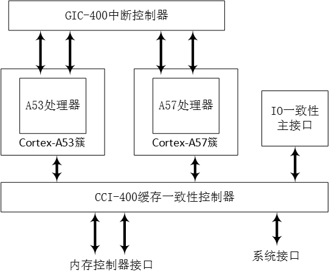

如图 1.16 所示是 4 核 Cortex-A15 和 4 核 Cortex-A7 的系统总线框图.
- Quad Cortex-A15: 大核 CPU 簇.
- Quad Cortex-A7: 小核 CPU 簇.

图 1.16 4 核 A15 和 4 核 A7 的**系统总线框**(**！！！**)图

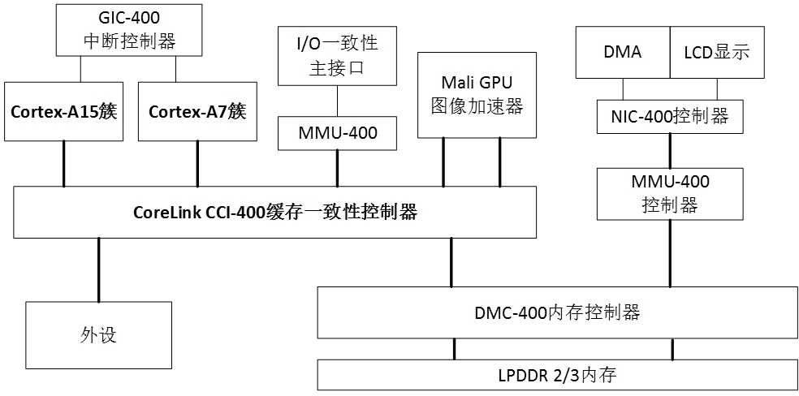

- CCI-400 模块: 用于管理大小核架构中**缓存一致性**的**互连模块**(**而处理器的 L1 cache 和 L2 cache 也都有自己的控制器??**). **CCI-400**只能支持两个 CPU 簇(cluster), 而最新款的 CCI-550 可以支持**6 个 CPU 簇**.
- DMC-400: 内存控制器.
- NIC-400: 用于 AMBA 总线协议的连接, 可以支持 AXI、AHB 和 APB 总线的连接.
- MMU-400: 系统**内存管理单元**.
- Mali-T604: 图形加速控制器.
- GIC-400: 中断控制器.

ARM CoreLink CCI-400 模块用于**维护大小核集群的数据互联**和**cache 一致性**. 大小核集群作为主设备(Master), 通过支持 ACE 协议的从设备接口(Slave)连接到 CCI-400 上, 它可以管理大小核集群中的**cache 一致性**和实现处理器间的**数据共享**. 此外, 它还支持 3 个 ACE-Lite 从设备接口(ACE-Lite Slave Interface), 可以支持一些 IO 主设备, 例如 GPUMali-T604. 通过 ACE-Lite 协议, GPU 可以监听处理器的 cache. CCI-400 还支持 3 个 ACE-Lite 主设备接口, 例如通过 DMC-400 来连接 LP-DDR2/3 或 DDR 内存设备, 以及通过 NIC-400 总线来连接一些外设, 例如 DMA 设备和 LCD 等.

ACE 协议, 全称为 AMBA AXI Coherency Extension 协议, 是 AXI4 协议的扩展协议, 增加了很多特性来支持系统级硬件一致性. 模块之间共享内存不需要软件干预, 硬件直接管理和维护各个 cache 之间的一致性, 这可以大大减少软件的负载, 最大效率地使用 cache, 减少对内存的访问, 进而降低系统功耗.

# 14 cache coherency 和 memory consistency 有什么区别?

**cache coherency 高速缓存一致性**关注的是**同一个数据**在**多个 cache**和**内存中的一致性**问题, 解决高速缓存一致性的方法主要是**总线监听协议**, 例如 MESI 协议等. 而 **memory consistency**关注的是处理器系统对**多个地址进行存储器访问序列的正确性**, 学术上对**内存访问模型**提出了很多, 例如严格一致性内存模型、处理器一致性内存模型, 以及弱一致性内存模型等. **弱内存访问模型**在现在处理器中得到广泛应用, 因此**内存屏障指令**也得到广泛应用.

# 15 请简述 cache 的 write back 有哪些策略.

在处理器内核中, 一条存储器读写指令经过**取指**、**译码**、**发射**和**执行**等一系列操作之后, 率先到达**LSU 部件**. **LSU 部件包括 Load Queue 和 Store Queue**, 是指令流水线的一个执行部件, 是处理器**存储子系统的最顶层**, **连接指令流水线和 cache 的一个支点**. 存储器读写指令通过 LSU 之后, 会到达**L1 cache 控制器**(**！！！控制器**). L1 cache 控制器首先发起**探测(Probe)操作**, 对于**读操作**发起 cache**读探测操作并将带回数据**, 写操作发起 cache**写探测操作**. 写探测操作**之前**需要**准备好待写的 cache line**, **探测工作返回时将会带回数据**. 当存储器写指令获得**最终数据并进行提交操作之后**才会将**数据写入**, 这个写入可以 Write Through 或者 Write Back.

对于**写操作**, 在上述的探测过程中, 如果没有找到相应的 cache block, 那么就是 Write Miss, 否则就是 Write Hit. 对于**Write Miss**的处理策略是 **Write-Allocate**, 即**L1 cache 控制器将分配一个新的 cache line**, 之后和**获取的数据**进行合并, 然后写入**L1 cache**中.

如果探测的过程是**Write Hit**, 那么真正写入有**两种模式**.

- **Write Through**(直写模式): 进行**写操作**时, 数据**同时**写入**当前的 cache、下一级 cache 或主存储器中**. Write Through 策略可以**降低 cache 一致性的实现难度**, 其最大的缺点是**消耗比较多的总线带宽**.
- **Write Back**(回写模式): 在进行写操作时, 数据直接**写入当前 cache**, 而**不会继续传递**, 当**该 Cache Line 被替换出去**时, 被改写的数据才会**更新到下一级 cache 或主存储器**中. 该策略**增加了 cache 一致性的实现难度**, 但是有效**降低了总线带宽需求**.

# 16 请简述 cache line 的替换策略.

由于 cache 的容量远小于主存储器, 当 Cache Miss 发生时, 不仅仅意味着处理器需要**从主存储器中获取数据**, 而且需要**将 cache 的某个 cache line 替换出去**. 在 cache 的**Tag 阵列中**, 除了具有**地址信息**之外还有**cache block(cache line)的状态信息**. **不同的 cache 一致性策略**使用的**cache 状态信息并不相同**. 在 MESI 协议中, 一个 cache block 通常含有 M、E、S 和 I 这 4 个状态位.

cache 的替换策略有**随机法**(Random policy)、**先进先出法**(FIFO)和**最近最少使用算法**(**LRU, Least Recently Used**).

- **随机法**: 随机地确定替换的 cache block, 由一个**随机数产生器**来生成随机数确定替换块, 这种方法**简单**, 易于实现, 但**命中率比较低**.
- **先进先出法**: 选择最先调入的那个 cache block 进行替换, 最先调入的块有可能被多次命中, 但是被优先替换, 因而**不符合局部性规律**.
- **最近最少使用算法**: LRU 算法根据各块使用的情况, 总是选择**最近最少使用的块**来替换, 这种算法较好地反映了**程序局部性规律**.

在 Cortex-A57 处理器中, **L1 cache 采用 LRU 算法**, 而 L2 cache 采用随机算法. 在最新的 Cortex-A72 处理器中, L2 cache 采有**伪随机算法**(pseudo-random policy)或**伪 LRU 算法**(pseudo-least-recently-used policy).

# 17 多进程间频繁切换对 TLB 有什么影响?现代的处理器是如何面对这个问题的?

在现代处理器中, **软件**使用**虚拟地址访问内存**, 而处理器的 MMU 单元负责把虚拟地址转换成物理地址, 为了完成这个映射过程, **软件和硬件**共同来维护一个**多级映射的页表**. 当处理器发现页表中无法映射到对应的物理地址时, 会触发一个**缺页异常**, **挂起出错的进程**, 操作系统软件需要**处理这个缺页异常**. 我们之前有提到过二级页表的查询过程, 为了完成虚拟地址到物理地址的转换, 查询页表需要两次访问内存, 即一级页表和二级页表都是存放在内存中的.

TLB(**Translation Look-aside Buffer**)专门用于**缓存内存中的页表项**, 一般**在 MMU 单元内部**. TLB 是一个很小的 cache, TLB 表项(TLB entry)数量比较少, **每个 TLB 表项**包含一个**页面(！！！页面的)的相关信息**, 例如**有效位、虚拟页号、修改位、物理页帧号**等. 当处理器要访问一个虚拟地址时, 首先会**在 TLB 中查询**. 如果 TLB 表项中没有相应的表项, 称为 TLB Miss, 那么就需要**访问页表**来计算出相应的**物理地址**. 如果 TLB 表项中有相应的表项, 那么直接从**TLB 表项**中获取**物理地址**, 称为 TLB 命中.

TLB 内部存放的**基本单位**是**TLB 表项**, TLB 容量越大, 所能存放的 TLB 表项就越多, TLB 命中率就越高, 但是 TLB 的容量是有限的. 目前 Linux 内核默认**采用 4KB 大小的小页面**, 如果一个程序使用 512 个小页面, 即 2MB 大小, 那么至少需要 512 个 TLB 表项才能保证不会出现 TLB Miss 的情况. 但是如果使用**2MB 大小的大页**, 那么**只需要一个 TLB 表项**就可以保证不会出现 TLB Miss 的情况. 对于消耗内存以 GB 为单位的大型应用程序, 还可以使用以 1GB 为单位的大页, 从而**减少 TLB Miss**情况.

# 18 请简述 NUMA 架构的特点.

现在绝大数 ARM 系统都采用 UMA 的内存架构(Uniform Memory Architechture), 即**内存是统一结构和统一寻址**. **对称多处理器**(Symmetric Multiple Processing, SMP)系统大部分都采用 UMA 内存架构. 因此在 UMA 架构的系统中有如下特点.

- **所有硬件资源都是共享的**, 每个处理器都能访问到系统中的内存和外设资源.
- 所有**处理器都是平等关系**.
- **统一寻址访问内存**(**所有处理器访问内存的地址是统一的**).
- **处理器和内存**通过**内部的一条总线**连接在一起.

如图 1.17 所示, SMP 系统相对比较简洁, 但是缺点也很明显. 因为**所有对等的处理器**都通过**一条总线连接**在一起, 随着处理器数量的增多, **系统总线成为系统的最大瓶颈**.

NUMA 系统是从 SMP 系统演化过来的. 如图 1.18 所示, **NUMA 系统**由**多个内存节点**组成, 整个内存体系可以作为一个整体, 任何处理器都可以访问, 只是处理器访问本地内存节点拥有更小的延迟和更大的带宽, 处理器访问远程内存节点速度要慢一些. 每个处理器除了拥有本地的内存之外, 还可以拥有本地总线, 例如 PCIE、STAT 等.

图 1.17 **SMP 架构示意图**

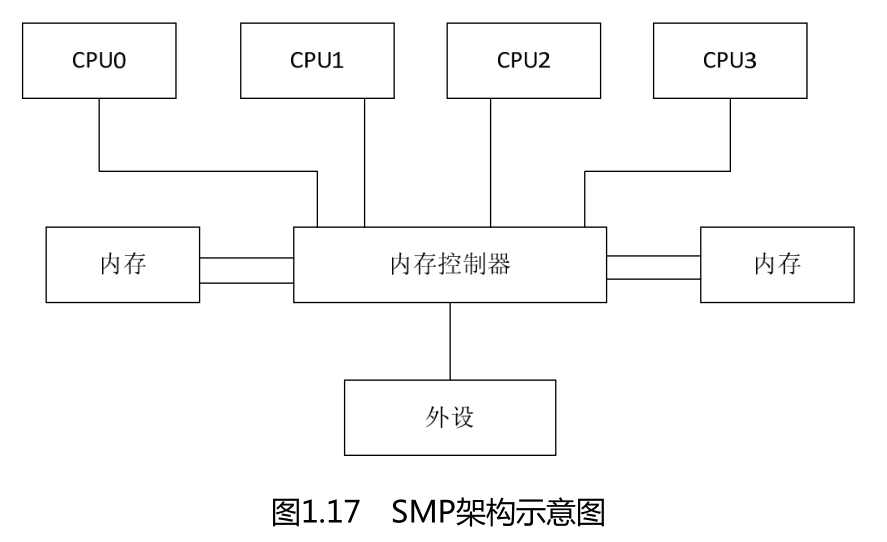

**所有处理器连接在一个统一的内存控制器上**.

图 1.18 NUMA 架构示意图

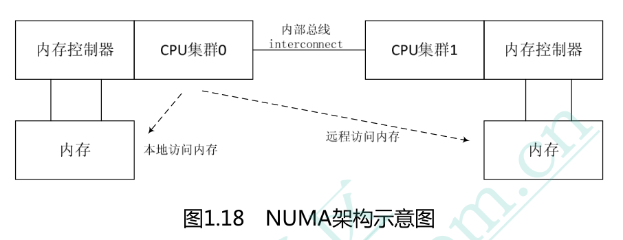

**每个 CPU 集群有自己的内存控制器和内存, 内存访问有本地内存访问和远程访问**.

现在的 x86 阵营的服务器芯片早已支持 NUMA 架构了, 例如 Intel 的至强服务器. 对于 ARM 阵营, **2016**年 Cavium 公司发布的基于 ARMv8-A 架构设计的服务器芯片"ThunderX2"也开始**支持 NUMA 架构**.

# 19 ARM 从 Cortex 系列开始性能有了质的飞越, 比如 Cortex-A8/A15/A53/A72, 请说说 Cortex 系列在芯片设计方面做了哪些重大改进?

计算机体系结构是一个权衡的艺术, 尺有所短, 寸有所长. 在处理器领域经历多年的优胜劣汰, 市面上流行的处理器内核在技术上日渐趋同.

ARM 处理器在 Cortex 系列之后, 加入了很多现代处理器的一些新技术和特性, 已经具备了和 Intel 一较高下的能力, 例如 2016 年发布的 Cortex-A73 处理器.

**2005**年发布的 Cortex-A8 内核是第一个引入**超标量技术**的 ARM 处理器, 它在**每个时钟周期内可以并行发射两条指令**, 但依然使用静态调度的流水线和顺序执行方式. Cortex-A8 内核采用 13 级整型指令流水线和 10 级 NEON 指令流水线. 分支目标缓冲器(Branch Target Buffer, BTB)使用的条目数增加到 512, 同时设置了全局历史缓冲器(Global History Buffer, GHB)和返回堆栈(Return Stack, RS)部件, 这些措施极大地提高了指令分支预测的成功率. 另外, 还加入了 way-prediction 部件.

2007 年 Cortex-A9 发布, 引入了乱序执行和猜测执行机制以及扩大 L2 cache 的容量.

2010 年 Cortex-A15 发布, 最高主频可以到 2.5GHz, 最多支持 8 个处理器核心, 单个 cluster 最多支持 4 个处理器核心, 采有超标量流水线技术, 具有 1TB 物理地址空间, 支持虚拟化技术等新技术. 指令预取总线宽度为 128bit, 一次可以预取 4~8 条指令, 和 Cortex-A9 相比, 提高了一倍. Decode 部件一次可以译码 3 条指令. Cortex-A15 引入了 Micro-Ops 概念. Micro-ops 指令和 X86 的 uops 指令想法较为类似. 在 x86 处理器中, 指令译码单元把复杂的 CISC 指令转换成等长的 upos 指令, 再进入到指令流水线中; 而 Cortex-A15, 指令译码单元把 RISC 指令进一步细化为 Micro-ops 指令, 以充分利用指令流水线中的多个并发执行单元. 指令译码单元为 3 路指令译码, 在一个时钟周期可以同时译码 3 条指令.

**2012**年发布 64 位的 Cortex-A53 和 Cortex-A57, ARM 开始进军**服务器领域**. Cortex-A57 是首款支持 64 位的 ARM 处理器内核, 采用 3 发乱序执行流水线(Out-of-Order pipeline), 并且增加数据预取功能.

2015 年发布 Cortex-A57 的升级版本 Cortex-A72, 如图 1.19 所示. A72 在 A57 架构的基础上做了大量优化工作, 包括新的分支预测单元, 改善解码流水线设计等. 在指令分发单元(Dispatch)也做了很大优化, 由原来 A57 架构的 3 发射变成了 5 发射, 同时发射 5 条指令, 并且还支持并行执行 8 条微操作指令, 从而提高解码器的吞吐量.

图 1.19 Cortex-A72 处理器架构图(http://pc.watch.impress.co.jp/img/pcw/docs/699/491/html/4jpg.html):

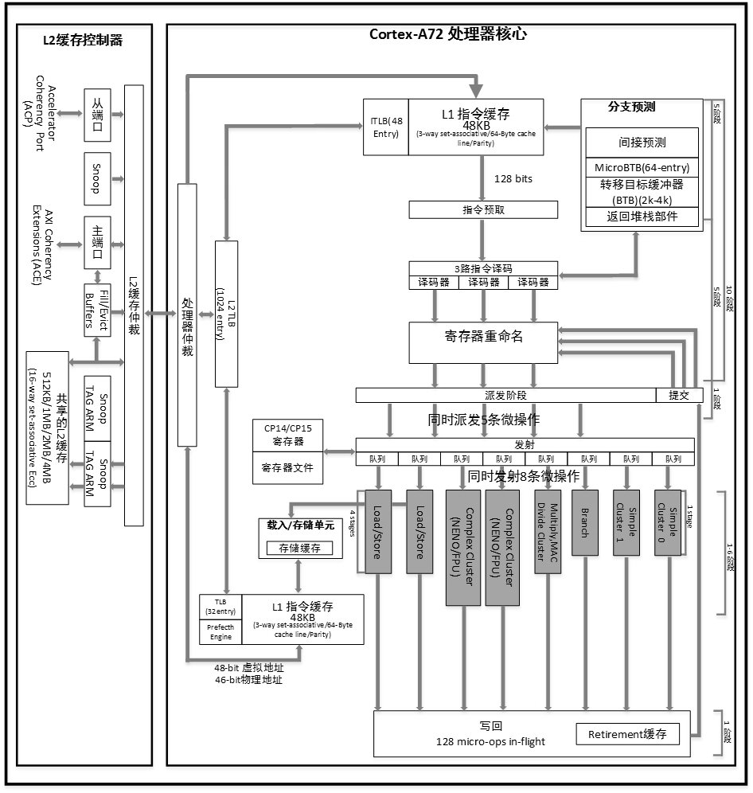

# 20 最新近展

最近几年, x86 和 ARM 阵营都在各自领域中不断创新. 异构计算是一个很热门的技术方向, 比如 Intel 公司最近发布了集成 FPGA 的至强服务器芯片. FPGA 可以在客户的关键算法中提供可编程、高性能的加速能力, 另外提供了灵活性, 关键算法的更新优化, 不需要购买大量新硬件. 在数据中心领域, 从事海量数据处理的应用中有不少关键算法需要优化, 如密钥加速、图像识别、语音转换、文本搜索等. 在安防监控领域, FPGA 可以实现对大量车牌的并行分析. 强大的至强处理器加上灵活高效的 FPGA 会给客户在云计算、人工智能等新兴领域带来新的技术创新. 对于 ARM 阵营, ARM 公司发布了最新的 Cortex-A75 处理器以及最新处理器架构 DynamIQ 等新技术. DynmaIQ 技术新增了针对机器学习和人工智能的全新处理器指令集, 并增加了多核配置的灵活性. 另外 ARM 公司也发布了一个用于数据中心应用的指令集——Scalable Vector Extensions, 最高支持 2048 bit 可伸缩的矢量计算.

除了 x86 和 ARM 两大阵营的创新外, 最近几年开源指令集(指令集架构, Instruction Set Architecture, ISA)也是很火热的新发展方向. **开源指令集**的代表作是**OpenRISC**, 并且 Open Risk 已经被 Linux 内核接受, 成为官方 Linux 内核支持的一种体系结构. 但是由于 OpenRISC 是由爱好者维护的, 因此更新缓慢. 最近几年, 伯克利大学正在尝试重新设计一个全新的开源指令集, 并且不受专利的约束和限制, 这就是**RISC-V**, 其中"V"表示变化(variation)和向量(vectors). RISC-V 包含一个非常小的基础指令集和一系列可选的扩展指令集, 最基础的指令集只包含 40 条指令, 通过扩展可以支持 64 位和 128 位运算以及变长指令.

伯克利大学对 RISC-V 指令集不断改进, 迅速得到工业界和学术届的关注. 2016 年, RISC-V 基金会成立, 成员包括谷歌、惠普、甲骨文、西部数据、华为等巨头, 未来这些大公司非常有可能会将 RISC-V 运用到云计算或者 IoT 等产品中. RISC-V 指令集类似 Linux 内核, 是一个开源的、现代的、没有专利问题和历史包袱的全新指令集, 并且以 BSD 许可证发布.

目前 RISC-V 已经进入了 GCC/Binutils 的主线, 相信很快也会被官方 Linux 内核接受. 另外目前已经有多款开源和闭源的 RISC-V CPU 的实现, 很多第三方工具和软件厂商也开始支持 RISC-V. RISC-V 是否会变成开源硬件或是开源芯片领域的 Linux 呢?让我们拭目以待吧！

# 21 推荐书籍

计算机体系结构是一门计算机科学的基础课程, 除了阅读 ARM 的芯片手册以外, 还可以阅读一些经典的书籍和文章.
- 《计算机体系结构: 量化研究方法》, 英文版是《Computer Architecture : A Quantitative》, 作者 John L. Hennessy, David A. Patterson.
- 《计算机组成与体系结构: 性能设计》, 作者 William Stallings.
- 《大话处理器: 处理器基础知识读本》, 作者万木杨.
- 《浅谈 cache memory》, 作者王齐.
- 《ARM 与 x86》, 作者王齐.
- 《现代体系结构上的 UNIX 系统: 内核程序员的对称多处理和缓存技术》, 作者 Curt Schimmel.