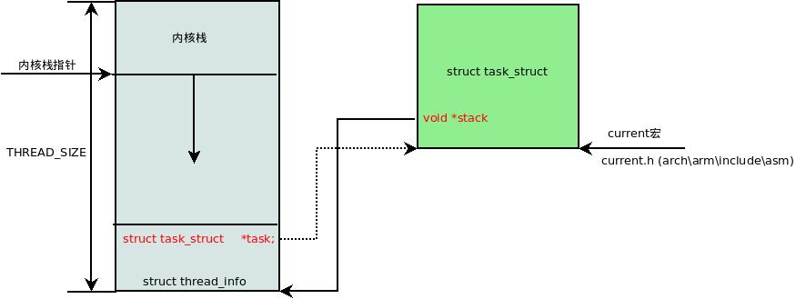

<!-- @import "[TOC]" {cmd="toc" depthFrom=1 depthTo=6 orderedList=false} -->

<!-- code_chunk_output -->

- [1 init 进程](#1-init-进程)
- [2 fork](#2-fork)
- [3 小结](#3-小结)

<!-- /code_chunk_output -->

**本节思考题**

1. 在内核中如何获取当前进程的 task\_struct 数据结构?
2. 下面程序会打印出几个"\_"?

```cpp
int main(void)
{
    int i ;
    for(i=0; i<2; i++){
        fork();
        printf("_\n");
    }
    wait(NULL);
    wait(NULL);
    return 0;
}
```

3. 用户空间进程的页表是什么时候分配的, 其中一级页表什么时候分配?二级页表呢?
4. 请简述 fork, vfork 和 clone 之间的区别?

进程并不仅局限于一段可执行代码(代码段), 它还包括进程需要的其他资源,例如打开的文件、挂起的信号量、内存管理、处理器状态、一个或者多个执行线程和数据段等. Linux 内核通常把进程叫作是任务(task), 因此进程控制块(processing control block, PCB)也被命名为 struct task_struct. 进程最开始被称为工作(job), 后来改名为进程(process).

线程被称为**轻量级进程**, 它是**操作系统调度的最小单元**, 通常**一个进程**可以拥有**多个线程**. 线程和进程的区别在于**进程拥有独立的资源空间**, 而**线程则共享进程的资源空间**. Linux 内核并**没有对线程有特别的调度算法**或**定义特别的数据结构来标识线程**, **线程和进程**都使用相同的**进程 PCB 数据结构**. 内核里使用**clone 方法来创建线程**, 其工作方式和创建进程 fork 方法类似, 但会**确定哪些资源和父进程共享**, 哪些**资源**为**线程独享**.

**进程**通常通过**fork 系统调用**来创新一个**新的进程**, 新创建的**进程**可以通过**exec**()函数创建**新的地址空间**, 并载入新的程序. 进程结束可以自愿退出或非自愿退出.

本章主要讲述 fork 系统调用的实现.fork 的实现会涉及到进程管理、内存管理、文件系统和信号处理等内容, 本章会讲述一些核心的实现过程.

# 1 init 进程

Linux 内核在**启动**时会有一个**init\_task 进程**, 它是系统**所有进程的"鼻袓**", 称为**0 号进程**(也被称为**idle 进程**或**swapper 进程**),当系统**没有进程需要调度**时, 调度器就会去执行**idle 进程**.

idle 进程在内核启动 (**start\_kernel**()函数)时**静态创建**, 所有的核心数据结构都**预先静态赋值**. init\_task 进程的**task\_struct**数据结构通过**INIT\_TASK 宏**来赋值, 定义在 include/linux/init\_task.h 文件中.

```cpp
[init/init_task.c]
struct task_struct  init_task  = INIT_TASK(init_task);
EXPORT_SYMBOL(init_task);

[include/linux/init_task.h]
#define INIT_TASK(tsk)	\
{									\
	.state		= 0,						\
	// 第 1 处
	.stack		= &init_thread_info,				\
	.usage		= ATOMIC_INIT(2),				\
	// 第 2 处
	.flags		= PF_KTHREAD,					\
	.prio		= MAX_PRIO-20,					\
	.static_prio	= MAX_PRIO-20,					\
	.normal_prio	= MAX_PRIO-20,					\
	.policy		= SCHED_NORMAL,					\
	.cpus_allowed	= CPU_MASK_ALL,					\
	.nr_cpus_allowed= NR_CPUS,					\
	.mm		= NULL,						\
	// 第 3 处
	.active_mm	= &init_mm,					\
	.restart_block = {						\
		.fn = do_no_restart_syscall,				\
	},								\
	.se		= {						\
		.group_node 	= LIST_HEAD_INIT(tsk.se.group_node),	\
	},								\
	.rt		= {						\
		.run_list	= LIST_HEAD_INIT(tsk.rt.run_list),	\
		.time_slice	= RR_TIMESLICE,				\
	},								\
	.tasks		= LIST_HEAD_INIT(tsk.tasks),			\
	INIT_PUSHABLE_TASKS(tsk)					\
	INIT_CGROUP_SCHED(tsk)						\
	.ptraced	= LIST_HEAD_INIT(tsk.ptraced),			\
	.ptrace_entry	= LIST_HEAD_INIT(tsk.ptrace_entry),		\
	.real_parent	= &tsk,						\
	.parent		= &tsk,						\
	.children	= LIST_HEAD_INIT(tsk.children),			\
	.sibling	= LIST_HEAD_INIT(tsk.sibling),			\
	.group_leader	= &tsk,						\
	RCU_POINTER_INITIALIZER(real_cred, &init_cred),			\
	RCU_POINTER_INITIALIZER(cred, &init_cred),			\
	.comm		= INIT_TASK_COMM,				\
	.thread		= INIT_THREAD,					\
	.fs		= &init_fs,					\
	.files		= &init_files,					\
	.signal		= &init_signals,				\
    ···
}

[arch/arm/include/asm/thread_info.h]
#define init_thread_info	(init_thread_union.thread_info)
```

init/init\_task.c 的头文件在 include/linux/init\_task.h

init\_task 进程的 task\_struct 数据结构中**stack**成员指向**thread\_info**数据结构.

通常**内核栈大小是 8KB**, 即两个物理页面的大小, 它存放在**内核映像文件中 data 段**中, 在**编译链接时预先分配**好, 具体见 arch/arm/kernel/vmlinux.lds.S 链接文件.

```cpp
[arch/arm/kernel/vmlinux.lds.S]
SECTIONS
{

	.data : AT(__data_loc) {
		_data = .;		/* address in memory */
		_sdata = .;

		/*
		 * first, the init task union, aligned
		 * to an 8192 byte boundary.
		 */
		// 重点位置, x86 也是
		INIT_TASK_DATA(THREAD_SIZE)
		···
		_edata = .;
	}
}

[arch/arm/include/asm/thread_info.h]
#define THREAD_SIZE_ORDER  1
#define THREAD_SIZE  {PAGE_SIZE << THREAD_SIZE_ORDER)
#define THREAD_START_SP  (THREAD_SIZE - 8)

[include/asm-generic/vmlinux.Ids.h]
#define INIT_TASK_DATA (align)  \
    . = ALIGN(align);  \
    *(.data..init_task)
```

由链接文件可以看到**data 段预留了 8KB 的空间**用于**内核栈(！！！**), 存放在 data 段**的".data..init\_task**"中.

\_**init\_task\_data**宏会直接读**取".data..init\_task**"段内存, 并且存放了一个**thread\_union 联合数据结构**, 从联合数据结构可以看出其分布情况: **开始的地方**存放了**struct thread\_info**数据结构, **顶部往下的空间用于内核栈空间**.

```cpp
[include/linux/init_task.h]
/* Attach to the init_task data structure for proper alignment */
// __init_task_data 存放在 .data..init_task 段
#define __init_task_data __attribute__((__section__(".data..init_task")))

[init/init_task.c]
/*
 * Initial thread structure. Alignment of this is handled by a special
 * linker map entry.
 */
// __init_task_data 声明为 thread_union 类型, 描述了整个内核栈 stack[]
// __init_task_data 通过 INIT_THREAD_INFO 初始化
union thread_union init_thread_union __init_task_data =
	{ INIT_THREAD_INFO(init_task) };

[include/linux/sched.h]
union thread_union {
	struct thread_info thread_info;
	unsigned long stack[THREAD_SIZE/sizeof(long)];
};

[arch/arm/include/asm/thread_info.h]
#define INIT_THREAD_INFO(tsk)						\
{									\
	.task		= &tsk,						\
	.exec_domain	= &default_exec_domain,				\
	.flags		= 0,						\
	.preempt_count	= INIT_PREEMPT_COUNT,				\
	.addr_limit	= KERNEL_DS,					\
	.cpu_domain	= domain_val(DOMAIN_USER, DOMAIN_MANAGER) |	\
			  domain_val(DOMAIN_KERNEL, DOMAIN_MANAGER) |	\
			  domain_val(DOMAIN_IO, DOMAIN_CLIENT),		\
}
```

\_\_**init\_task\_data 存放在".data..init\_task"段**中, \_\_**init\_task\_data 声明为 thread\_union 类型**, thread\_union 类型**描述了整个内核栈 stack**[], 栈的**最下面存放 struct thread_info 数据结构**, 因此\_\_**init\_task\_data**也通过**INIT\_THREAD\_INFO 宏**来**初始化**struct thread\_info 数据结构. **init 进程**的 task\_struct 数据结构通过**INIT\_TASK 宏**来初始化.

ARM32 处理器从汇编代码跳转到 C 语言的入口点在 start\_kernel()函数之前, 设置了 SP 寄存器指向**8KB 内核栈顶部**区域(要**预留 8Byte<字节>的空洞**).

```cpp
[arch/arm/kernel/head-common.S]
__mmap_switched:
    // 重点 1
	adr	r3, __mmap_switched_data

	ldmia	r3!, {r4, r5, r6, r7}
	cmp	r4, r5				@ Copy data segment if needed
1:	cmpne	r5, r6
	ldrne	fp, [r4], #4
	strne	fp, [r5], #4
	bne	1b

	mov	fp, #0				@ Clear BSS (and zero fp)
1:	cmp	r6, r7
	strcc	fp, [r6],#4
	bcc	1b

//重点 2
 ARM(	ldmia	r3, {r4, r5, r6, r7, sp})
 THUMB(	ldmia	r3, {r4, r5, r6, r7}	)
 THUMB(	ldr	sp, [r3, #16]		)
	str	r9, [r4]			@ Save processor ID
	str	r1, [r5]			@ Save machine type
	str	r2, [r6]			@ Save atags pointer
	cmp	r7, #0
	strne	r0, [r7]			@ Save control register values
	// 跳转到 start_kernel
	b	start_kernel
ENDPROC(__mmap_switched)

	.align	2
	.type	__mmap_switched_data, %object
__mmap_switched_data:
	.long	__data_loc			@ r4
	.long	_sdata				@ r5
	.long	__bss_start			@ r6
	.long	_end				@ r7
	.long	processor_id			@ r4
	.long	__machine_arch_type		@ r5
	.long	__atags_pointer			@ r6
#ifdef CONFIG_CPU_CP15
	.long	cr_alignment			@ r7
#else
	.long	0				@ r7
#endif
    //重点 3 THREAD_START_SP
	.long	init_thread_union + THREAD_START_SP @ sp
	.size	__mmap_switched_data, . - __mmap_switched_data

[arch/arm/include/asm/thread_info.h]
#define THREAD_START_SP		(THREAD_SIZE - 8)
```

汇编代码\_\_mmap\_switched 标签处设置相关 r3\~r7 以及 SP 寄存器,其中,**SP 寄存器指向 data 段预留 8KB 空间的顶部(8KB\-8**),然后**跳转到 start\_kernel**().

**x86**情况下,在 arch/x86/kernel/head\_32.S 中,然后会跳转到函数 i386\_start\_kernel(arch/x86/kernel/head32.c 中),然后里面会调用 start\_kernel(init/main.c).

\_\_mmap\_switched\_data 标签处定义了 r4\~sp 寄存器的值, 相当于一个表, 通过 adr 指令把这表读取到 r3 寄存器中, 然后再通过 ldmia 指令写入相应寄存器中.

内核有一个常用的**常量 current**用于获取**当前进程 task\_struct 数据结构**, 它利用了**内核栈**的特性. 首先通过**SP 寄存器**获取**当前内核栈的地址**, **对齐**后可以获取 struct **thread\_info 数据结构指针**, 最后通过 thread\_info->task 成员获取**task\_struct 数据结构**. 如图 3.1 所示是 Linux 内核栈的结构图.

```cpp
[include/asm-generic/current.h]
#define get_current() (current_thread_info()->task)
#define current get_current()

[arch/arm/include/asm/thread_info.h]
register unsigned long current_stack_pointer asm ("sp");
static inline struct thread_info *current_thread_info(void)
{
	return (struct thread_info *)
		(current_stack_pointer & ~(THREAD_SIZE - 1));
}
```

图 3.1 内核栈:




struct thread\_info 数据结构定义如下:

```cpp
[arch/arm/include/asm/thread_info.h]

/*
 * low level task data that entry.S needs immediate access to.
 * __switch_to() assumes cpu_context follows immediately after cpu_domain.
 */
struct thread_info {
	unsigned long		flags;		/* low level flags */
	int			preempt_count;	/* 0 => preemptable, <0 => bug */
	mm_segment_t		addr_limit;	/* address limit */
	struct task_struct	*task;		/* main task structure */
	struct exec_domain	*exec_domain;	/* execution domain */
	__u32			cpu;		/* cpu */
	__u32			cpu_domain;	/* cpu domain */
	struct cpu_context_save	cpu_context;	/* cpu context */
	__u32			syscall;	/* syscall number */
	__u8			used_cp[16];	/* thread used copro */
	unsigned long		tp_value[2];	/* TLS registers */
#ifdef CONFIG_CRUNCH
	struct crunch_state	crunchstate;
#endif
	union fp_state		fpstate __attribute__((aligned(8)));
	union vfp_state		vfpstate;
#ifdef CONFIG_ARM_THUMBEE
	unsigned long		thumbee_state;	/* ThumbEE Handler Base register */
#endif
};
```

# 2 fork

在 Linux 系统中, 进程或线程是通过**fork**、**vfork**或**clone**等**系统调用**来建立的. 在**内核中**, 这 3 个系统的调用都是**通过同一个函数来实现**, 即**do\_fork()函数**,该函数定义在 fork.c 文件中.

```cpp
[kernel/fork.c]
long do_fork(unsigned long clone_flags,
	      unsigned long stack_start,
	      unsigned long stack_size,
	      int __user *parent_tidptr,
	      int __user *child_tidptr)
```

do\_fork()函数有 5 个参数, 具体含义如下.

- clone\_flags:创建进程的标志位集合.
- stack\_start:用户态栈的起始地址.
- stack\_size:用户态栈的大小,通常设置为 0.
- parent\_tidptr 和 child\_tidptr:指向用户空间中地址的两个指针,分别指向父进程的 PID.

clone\_flags 定义在 sched.h 文件中

```cpp
[include/uapi/linux/sched.h]
/*
 * cloning flags:
 */
#define CSIGNAL		0x000000ff	/* signal mask to be sent at exit */
//父子进程之间共享内存空间
#define CLONE_VM	0x00000100	/* set if VM shared between processes */
/* 父子进程之间共享相同的文件系统 */
#define CLONE_FS	0x00000200	/* set if fs info shared between processes */
/* 父子进程共享相同的文件描述符 */
#define CLONE_FILES	0x00000400	/* set if open files shared between processes */
/* 父子进程共享相同的信号处理等相关信息 */
#define CLONE_SIGHAND	0x00000800	/* set if signal handlers and blocked signals shared */
/* 父进程被 trace,子进程也同样被 trace */
#define CLONE_PTRACE	0x00002000	/* set if we want to let tracing continue on the child too */
/* 父进程被挂起,直到子进程释放了虚拟内存资源 */
#define CLONE_VFORK	0x00004000	/* set if the parent wants the child to wake it up on mm_release */
/* 新进程和创建它的进程是兄弟关系,而不是父子关系 */
#define CLONE_PARENT	0x00008000	/* set if we want to have the same parent as the cloner */
/* 父子进程共享相同的线程群 */
#define CLONE_THREAD	0x00010000	/* Same thread group? */
```

- CLONE\_VM : 父进程和子进程运行在**同一个虚拟地址空间**, 一个进程对**全局变量改动**, 另外一个进程也可以看到.
- CLONE\_FS: 父进程和子进程共享**文件系统信息**, 例如根目录、当前工作目录等. 其中一个进程对文件系统信息进行改变, 将会影响到另外一个进程, 例如调用 chroot()或 chdir()等.
- CLONE\_FILES: 父进程和子进程共享**文件描述符表**. 文件描述符表里面保存进程**打开文件描述符的信息**, 因此一个进程打开的文件, 在另外一个进程用**同样的描述符也可以访问**. 一个进程关闭了一个文件或者使用 fcntl()改变了一个文件属性, 另外一个进程也能看到.
- CLONE\_SIGHAND: 父进程和子进程共享**信号处理器函数表**. 一个进程改变了**某个信号处理函数**, 这个改动对于另外一个进程也有效.
- CLONE\_PTRACE: 父进程被跟踪(ptrace) , 子进程也会被跟踪.
- CLONE\_VFORK : 在创建子进程时启用 Linux 内核的**完成机制**(completion). wait\_for\_completion()会使**父进程进入睡眠等待**, 直到子进程调用 execve()或 exit()释放**虚拟内存资源**.

其它标志位,可以在 man linux 手册中查看.

- fork 实现: do\_fork(SIGCHLD, 0, 0, NULL, NULL);
- vfork 实现: do\_fork(CLONE\_VFORK | CLONE\_VM | SIGCHLD, 0, 0, NULL, NULL);
- clone 实现: do\_fork(clone\_flags, newsp, 0, parent\_tidptr, child\_tidptr);
- 内核线程: do\_fork(flags|CLONE\_VM|CLONE\_UNTRACED, (unsigned long)fn, (unsigned long)arg, NULL, NULL);

四种实现都通过 do\_fork()完成,调用参数不一样.

fork 只使用了 SIGCHLD 标志位,在**子进程终止**后发送**SIGCHLD 信号**通知**父进程**.fork 是**重量级调用**, 为子进程建立了一个**基于父进程**的**完整副本**, 然后子进程基于此运行. 为了减少工作量采用写时复制技术(copy on write, COW ) , 子进程**只复制父进程的页表, 不会复制页面内容(只有页表,不复制页面!!!**). 当子进程需要**写入新内容**时才触发写时复制机制, 为子进程**创建一个副本**.

vfork 的实现比 fork**多了两个标志位**,分别是 CLONE\_VFORK 和 CLONE\_VM.**CLONE\_VFORK**表示**父进程会被挂起**, 直至**子进程释放虚拟内存资源**. **CLONE\_VM**表示父子进程运行在**相同的内存空间**中.

clone 用于**创建线程**,并且**参数通过寄存器**从用户空间传递下来, 通常会指定**新的栈地址(newsp**).

do\_fork()函数主要调用**copy\_process**()函数**创建一个新的进程**. copy\_process()函数比较长, 下面分段来阅读, 该函数的代码片段如下.

```cpp
[kernel/fork.c]
static struct task_struct *copy_process(unsigned long clone_flags,
					unsigned long stack_start,
					unsigned long stack_size,
					int __user *child_tidptr,
					struct pid *pid,
					int trace)
{
	int retval;
	struct task_struct *p;

	if ((clone_flags & (CLONE_NEWNS|CLONE_FS)) == (CLONE_NEWNS|CLONE_FS))
		return ERR_PTR(-EINVAL);

	if ((clone_flags & (CLONE_NEWUSER|CLONE_FS)) == (CLONE_NEWUSER|CLONE_FS))
		return ERR_PTR(-EINVAL);

	/*
	 * Thread groups must share signals as well, and detached threads
	 * can only be started up within the thread group.
	 */
	if ((clone_flags & CLONE_THREAD) && !(clone_flags & CLONE_SIGHAND))
		return ERR_PTR(-EINVAL);

	/*
	 * Shared signal handlers imply shared VM. By way of the above,
	 * thread groups also imply shared VM. Blocking this case allows
	 * for various simplifications in other code.
	 */
	if ((clone_flags & CLONE_SIGHAND) && !(clone_flags & CLONE_VM))
		return ERR_PTR(-EINVAL);

	/*
	 * Siblings of global init remain as zombies on exit since they are
	 * not reaped by their parent (swapper). To solve this and to avoid
	 * multi-rooted process trees, prevent global and container-inits
	 * from creating siblings.
	 */
	if ((clone_flags & CLONE_PARENT) &&
				current->signal->flags & SIGNAL_UNKILLABLE)
		return ERR_PTR(-EINVAL);

	/*
	 * If the new process will be in a different pid or user namespace
	 * do not allow it to share a thread group or signal handlers or
	 * parent with the forking task.
	 */
	if (clone_flags & CLONE_SIGHAND) {
		if ((clone_flags & (CLONE_NEWUSER | CLONE_NEWPID)) ||
		    (task_active_pid_ns(current) !=
				current->nsproxy->pid_ns_for_children))
			return ERR_PTR(-EINVAL);
	}

	retval = security_task_create(clone_flags);
	if (retval)
		goto fork_out;

	retval = -ENOMEM;
	/* 重点函数*/
	p = dup_task_struct(current);
	if (!p)
		goto fork_out;
```

首先来做标志位的检查, **CLONE\_NEWNS**表示父子进程**不共享 mount namespace**, 每个进程可以拥有属于自己的 mount namespace. **CLONE\_NEWUSER**表示子进程要创建新的 User Namespace, **User Namespace**用于**管理 User ID 和 Group ID 的映射**, 起到**隔离 User ID**的作用. **一个 User Namespace**可以形成**一个容器(Contrainer**), 容器里**第一个进程 uid 是 0,即 root 用户**. **容器**里的**root 用户**不具备**系统 root 权限**, 从系统角度看, **该 User Namespace 并非特权用户**, 而只是一个**普通用户**. CLONE\_FS 要求**父子进程共享文件系统信息**, 因此 CLONE\_NEWNS、CLONE\_NEWUSER 和 CLONE\_FS 会产生矛盾.

**CLONE\_THREAD**表示**父子进程**在**同一个线程组**里. **POSIX 协议**规定在**一个进程内部多个线程共享一个 PID**,但是**Linux 内核**为**每个线程和进程**都同等对待地**分配了 PID**. 为了**满足 POSIX 协议**, Linux 内核实现了一个**线程组**的概念(**thread group**). **sys\_getpid**()**系统调用**返回**线程组 ID(tgid, thread group id**),**sys\_gettid**()返回**线程的 PID**. CLONE\_SIGHAND 表示父子进程共享相同的**信号处理表**, 因此 CLONE\_THREAD 和 CLONE\_SIGHAND 两个标志位是最佳拍档, 还有 CLONE\_VM 也是.

CLONE\_PARENT 表示新创建的进程是**兄弟关系**, 而**不是父子关系**, 它们拥有**相同的父进程**. 对于 Linux**内核**来说, **进程**的"鼻祖"是**idle 进程, 也称为 swapper 进程**; 但对**用户空间**来说, 进程的"鼻祖"是**init 进程**, 所有用户空间进程都由 init 进程创建和派生. 只有 init 进程才会设置 SIGNAL\_UNKILLABLE 标志位. 如果 init 进程或者容器 init 进程要使用 CLONE\_PARENT 创建兄弟进程, 那么该进程无法由 init 进程回收, 父进程 idle 进程也无能为力, 因此它会变成僵尸进程(zombie).

CLONE\_NEWPID 表示创建一个**新的 PID namespace**. 在没有 PID namespace 之前, 进程唯一的标识是 PID, 在引入 PID namespace 之后, 标识一个进程需要**PID namespace 和 PID 双重认证**. CLONE\_NEWUSER、CLONE\_NEWPID 和 CLONE_SIGHAND 共享信号会有冲突.

上述标志位涉及到**命名空间技术(namespace**). 命名空间技术主要是做**访问隔离**, 其原理是**针对一类资源进行抽象**, 并将其**封装在一起提供给一个容器(container**)来使用. 每个容器都有自己的抽象, 它们**彼此之间不可见**, 因此访问是隔离的.

dup\_task\_struct()函数会分配一个 task\_struct 实例.

```cpp
[kernel/fork.c]
static struct task_struct *dup_task_struct(struct task_struct *orig)
{
	struct task_struct *tsk;
	struct thread_info *ti;
	int node = tsk_fork_get_node(orig);
	int err;

	tsk = alloc_task_struct_node(node);
	if (!tsk)
		return NULL;

	ti = alloc_thread_info_node(tsk, node);
	if (!ti)
		goto free_tsk;
    //重点 1
	err = arch_dup_task_struct(tsk, orig);
	if (err)
		goto free_ti;

	tsk->stack = ti;
    // 重点 2
	setup_thread_stack(tsk, orig);
	clear_user_return_notifier(tsk);
	// 重点 3
	clear_tsk_need_resched(tsk);
	set_task_stack_end_magic(tsk);

	atomic_set(&tsk->usage, 2);
    tsk->splice_pipe = NULL;
	tsk->task_frag.page = NULL;
	account_kernel_stack(ti, 1);
	return tsk;
}
```

首先分配一个**struct task\_struct**和**struct thread\_info**数据结构实例. struct task\_struct 是**描述进程**的核心数据结构, 计算机术语称为**进程控制块**, 主要用于描述**进程的状态信息和控制信息**. struct task\_struct 数据结构定义在 include/linux/sched.h 文件中. struct thread\_info 数据结构用于存储**进程描述符频繁访问和硬件快速访问的字段**, 它的定义**依赖于具体体系结构的实现**, 例如 ARM32 体系结构其定义在 arch/arm/include/asm/thread_info.h 头文件中.

arch\_dup\_task\_struct,把**父进程的 task\_struct**数据结构的内容**复制**到子进程的 task\_struct 结构中. struct **task\_struct**数据结构有一个成员**stack**指向 struct **thread\_info**实例, struct **thread\_info**数据结构中也有一个成员**task**指针指向**task\_struct**数据结构.

setup\_thread\_stack,把父进程的 struct **thread\_info**数据结构的内容**复制**到子进程的 thread\_info.

clear\_tsk\_need\_resched,清除 thread\_info->flags 中的 TIF\_NEED\_RESCHED 标志位, 因为新进程还没有完全诞生, 不希望现在被调度.

继续来看 copy\_process()函数

```cpp
[kernel/fork.c]
...
	retval = -EAGAIN;
	if (atomic_read(&p->real_cred->user->processes) >=
			task_rlimit(p, RLIMIT_NPROC)) {
		if (p->real_cred->user != INIT_USER &&
		    !capable(CAP_SYS_RESOURCE) && !capable(CAP_SYS_ADMIN))
			goto bad_fork_free;
	}
	current->flags &= ~PF_NPROC_EXCEEDED;
    // 重点 1
	retval = copy_creds(p, clone_flags);
	if (retval < 0)
		goto bad_fork_free;

	retval = -EAGAIN;
	// 重点 2
	if (nr_threads >= max_threads)
		goto bad_fork_cleanup_count;

	if (!try_module_get(task_thread_info(p)->exec_domain->module))
		goto bad_fork_cleanup_count;
```

copy\_creds,复制父进程的证书.

max\_threads**全局变量**表示**当前系统最多**可以拥有的进程**个数**, 这个值由系统**内存大小**来决定, 详见**fork\_init**()函数. **nr\_threads**是系统的一个**全局变量**, 如果系统己经分配了**超过系统最大进程数目**, 那么分配将失败. 上述两个全局变量都定义在 fork.c 文件中.

```cpp
[kernel/fork.c]
int nr_threads;			/* The idle threads do not count.. */
int max_threads;		/* tunable limit on nr_threads */
```

这两个值**为什么不使用 read\_mostly 来修饰呢(疑问**)?特别是 max\_threads 变量经常会被使用. **read\_mostly 修饰**的变量会放入.**data.read\_mostly 段**中, 在**内核加载**时放入**相应的 cache**中, 以便提高效率.

```cpp
[kernel/fork.c]
    delayacct_tsk_init(p);	/* Must remain after dup_task_struct() */
    // 重点 1,下面两行
	p->flags &= ~(PF_SUPERPRIV | PF_WQ_WORKER);
	p->flags |= PF_FORKNOEXEC;
	INIT_LIST_HEAD(&p->children);
	INIT_LIST_HEAD(&p->sibling);
	// 重点 2
	rcu_copy_process(p);
	p->vfork_done = NULL;
	spin_lock_init(&p->alloc_lock);

	init_sigpending(&p->pending);

	p->utime = p->stime = p->gtime = 0;
	p->utimescaled = p->stimescaled = 0;
#ifndef CONFIG_VIRT_CPU_ACCOUNTING_NATIVE
	p->prev_cputime.utime = p->prev_cputime.stime = 0;
#endif
#ifdef CONFIG_VIRT_CPU_ACCOUNTING_GEN
	seqlock_init(&p->vtime_seqlock);
	p->vtime_snap = 0;
	p->vtime_snap_whence = VTIME_SLEEPING;
#endif

#if defined(SPLIT_RSS_COUNTING)
	memset(&p->rss_stat, 0, sizeof(p->rss_stat));
#endif

	p->default_timer_slack_ns = current->timer_slack_ns;

	task_io_accounting_init(&p->ioac);
	acct_clear_integrals(p);

	posix_cpu_timers_init(p);

	p->start_time = ktime_get_ns();
	p->real_start_time = ktime_get_boot_ns();
	p->io_context = NULL;
	p->audit_context = NULL;
	if (clone_flags & CLONE_THREAD)
		threadgroup_change_begin(current);
	cgroup_fork(p);
#ifdef CONFIG_NUMA
	p->mempolicy = mpol_dup(p->mempolicy);
	if (IS_ERR(p->mempolicy)) {
		retval = PTR_ERR(p->mempolicy);
		p->mempolicy = NULL;
		goto bad_fork_cleanup_threadgroup_lock;
	}
#endif
#ifdef CONFIG_CPUSETS
	p->cpuset_mem_spread_rotor = NUMA_NO_NODE;
	p->cpuset_slab_spread_rotor = NUMA_NO_NODE;
	seqcount_init(&p->mems_allowed_seq);
#endif
#ifdef CONFIG_TRACE_IRQFLAGS
	p->irq_events = 0;
	p->hardirqs_enabled = 0;
	p->hardirq_enable_ip = 0;
	p->hardirq_enable_event = 0;
	p->hardirq_disable_ip = _THIS_IP_;
	p->hardirq_disable_event = 0;
	p->softirqs_enabled = 1;
	p->softirq_enable_ip = _THIS_IP_;
	p->softirq_enable_event = 0;
	p->softirq_disable_ip = 0;
	p->softirq_disable_event = 0;
	p->hardirq_context = 0;
	p->softirq_context = 0;
#endif
#ifdef CONFIG_LOCKDEP
	p->lockdep_depth = 0; /* no locks held yet */
	p->curr_chain_key = 0;
	p->lockdep_recursion = 0;
#endif

#ifdef CONFIG_DEBUG_MUTEXES
	p->blocked_on = NULL; /* not blocked yet */
#endif
#ifdef CONFIG_BCACHE
	p->sequential_io	= 0;
	p->sequential_io_avg	= 0;
#endif
```

如果开启了**CONFIG\_TASK\_DELAY\_ACCT**,那么进程 task\_struct 中的**delays**成员记录**等待相关的统计数据**供用户空间程序使用. 重点 1 的两行, task\_struct 数据结构中有一个成员**flags 用于存放进程重要的标志位**, 这些标志位**定义在 include/linux/sched.h**文件中. 这里首先**取消使用超级用户权限**并告诉系统这不是一个 worker 线程, **worker 线程由工作队列机制创建**, 另外设置**PF\_FORKNOEXEC**标志位, 这个进程**暂时还不能执行**.

```
[include/linux/sched.h]
/*
 * Per process flags
 */
#define PF_EXITING	0x00000004	/* getting shut down */
#define PF_EXITPIDONE	0x00000008	/* pi exit done on shut down */
#define PF_VCPU		0x00000010	/* I'm a virtual CPU */
#define PF_WQ_WORKER	0x00000020	/* I'm a workqueue worker */
#define PF_FORKNOEXEC	0x00000040	/* forked but didn't exec */
#define PF_MCE_PROCESS  0x00000080      /* process policy on mce errors */
#define PF_SUPERPRIV	0x00000100	/* used super-user privileges */
#define PF_DUMPCORE	0x00000200	/* dumped core */
#define PF_SIGNALED	0x00000400	/* killed by a signal */
#define PF_MEMALLOC	0x00000800	/* Allocating memory */
#define PF_NPROC_EXCEEDED 0x00001000	/* set_user noticed that RLIMIT_NPROC was exceeded */
#define PF_USED_MATH	0x00002000	/* if unset the fpu must be initialized before use */
#define PF_USED_ASYNC	0x00004000	/* used async_schedule*(), used by module init */
#define PF_NOFREEZE	0x00008000	/* this thread should not be frozen */
#define PF_FROZEN	0x00010000	/* frozen for system suspend */
#define PF_FSTRANS	0x00020000	/* inside a filesystem transaction */
#define PF_KSWAPD	0x00040000	/* I am kswapd */
#define PF_MEMALLOC_NOIO 0x00080000	/* Allocating memory without IO involved */
#define PF_LESS_THROTTLE 0x00100000	/* Throttle me less: I clean memory */
#define PF_KTHREAD	0x00200000	/* I am a kernel thread */
#define PF_RANDOMIZE	0x00400000	/* randomize virtual address space */
#define PF_SWAPWRITE	0x00800000	/* Allowed to write to swap */
...
```

**p\->children**链表是**新进程的子进程链表**, **p->sibling**链表是**新进程的兄弟进程链表**. 重点 2 位置, 对 PREEMPT\_RCU 和 TASKS\_RCU 进行初始化. 接下来是对进程 task\_struct 数据结构的一些成员进行初始化, 之前进程 task\_struct 数据结构的内容是从父进程复制过来的, 但是作为新进程, **有些内容还是要重新初始化**

继续看 copy\_process()函数.

```cpp
[copy_process()]
/* Perform scheduler related setup. Assign this task to a CPU. */
// 重点 1
retval = sched_fork(clone_flags, p);
if (retval)
	goto bad_fork_cleanup_policy;
...
// 重点 2
retval = copy_thread(clone_flags, stack_start, stack_size, p);
if (retval)
	goto bad_fork_cleanup_io;
```

接下来是做**内存空间、文件系统、信号系统、IO 系统**等**核心内容的复制**操作, 这是 fork 进程的核心部分, 我们分段来阅读, 首先看 sched\_fork()函数.

```cpp
[copy_process()->sched_fork()]
[kernel/sched/core.c]
int sched_fork(unsigned long clone_flags, struct task_struct *p)
{
	unsigned long flags;
	int cpu = get_cpu();
    // 重点 1
	__sched_fork(clone_flags, p);
	/*
	 * We mark the process as running here. This guarantees that
	 * nobody will actually run it, and a signal or other external
	 * event cannot wake it up and insert it on the runqueue either.
	 */
	p->state = TASK_RUNNING;

	/*
	 * Make sure we do not leak PI boosting priority to the child.
	 */
	p->prio = current->normal_prio;

	/*
	 * Revert to default priority/policy on fork if requested.
	 */
	// 恢复到默认的调度策略和优先级
	if (unlikely(p->sched_reset_on_fork)) {
		...
		p->sched_reset_on_fork = 0;
	}

	if (dl_prio(p->prio)) {
		put_cpu();
		return -EAGAIN;
	} else if (rt_prio(p->prio)) {
		p->sched_class = &rt_sched_class;
	} else {
		p->sched_class = &fair_sched_class;
	}

	if (p->sched_class->task_fork)
		p->sched_class->task_fork(p);

	raw_spin_lock_irqsave(&p->pi_lock, flags);
	// 重点 2
	set_task_cpu(p, cpu);
	raw_spin_unlock_irqrestore(&p->pi_lock, flags);

#if defined(CONFIG_SCHEDSTATS) || defined(CONFIG_TASK_DELAY_ACCT)
	if (likely(sched_info_on()))
		memset(&p->sched_info, 0, sizeof(p->sched_info));
#endif
#if defined(CONFIG_SMP)
	p->on_cpu = 0;
#endif
	init_task_preempt_count(p);
#ifdef CONFIG_SMP
	plist_node_init(&p->pushable_tasks, MAX_PRIO);
	RB_CLEAR_NODE(&p->pushable_dl_tasks);
#endif

	put_cpu();
	return 0;
}
```

\_\_sched\_fork()初始化**进程调度相关**的数据结构, **调度实体**用 struct **sched\_entity**数据结构来抽象, **每个进程或线程都是一个调度实体**, 另外也包括**组调度(sched group**).

```cpp
[kernel/sched/core.c]
static void __sched_fork(unsigned long clone_flags, struct task_struct *p)
{
	p->on_rq			= 0;

	p->se.on_rq			= 0;
	p->se.exec_start		= 0;
	p->se.sum_exec_runtime		= 0;
	p->se.prev_sum_exec_runtime	= 0;
	p->se.nr_migrations		= 0;
	p->se.vruntime			= 0;
#ifdef CONFIG_SMP
	p->se.avg.decay_count		= 0;
#endif
	INIT_LIST_HEAD(&p->se.group_node);

#ifdef CONFIG_SCHEDSTATS
	memset(&p->se.statistics, 0, sizeof(p->se.statistics));
#endif

	RB_CLEAR_NODE(&p->dl.rb_node);
	init_dl_task_timer(&p->dl);
	__dl_clear_params(p);

	INIT_LIST_HEAD(&p->rt.run_list);

#ifdef CONFIG_PREEMPT_NOTIFIERS
	INIT_HLIST_HEAD(&p->preempt_notifiers);
#endif

#ifdef CONFIG_NUMA_BALANCING
	...
#endif /* CONFIG_NUMA_BALANCING */
}
```

sched\_fork()函数,task\_struct 中 state 表示进程的运行状态.主要有 TASK\_RUNNING、TASK\_INTERRUPTIBLE、TASK\_UNINTERRUPTIBLE、\_\_TASK\_STOPPED 和 EXIT\_DEAD 等.

```cpp
[include/1inux/sched.h]
#define TASK_RUNNING		0
#define TASK_INTERRUPTIBLE	1
#define TASK_UNINTERRUPTIBLE	2
#define __TASK_STOPPED		4
#define __TASK_TRACED		8
```

这里设置为 TASK\_RUNNING,其实进程还没开始运行,因为还**没有加入就绪队列**(runqueue,或称可运行队列),外部事件或信号不能唤醒它.task\_struct 数据结构中**prio**成员表示**进程的优先级**, 这里先用**父进程的 normal\_prio 优先级**.

父进程使用**sched\_setscheduler**()**系统调用**来重新**设置进程的调度策略**时设置了**sched\_flag\_reset\_on\_fork 标志**位, 它在 fork 子进程时会让**子进程恢复到默认的调度策略和优先级**.

sched\_fork()函数接下来代码,内核中主要实现了**4 套调度策略**, 分别是 SCHED\_FAIR、SCHED\_RT、SCHED\_DEADLINE 和 SCHED\_IDLE,并且都按照 sched\_class 类来实现. **前 3 个调度类**通过如下**进程优先级**来区分.

- 普通进程的优先级: 100\~139.
- 实时进程的优先级: 0\~99.
- Deadline 进程优先级: -1.

sched\_fork()函数接下来,调用**调度类**中的 task\_fork 方法做初始化动作.

再往下重点 2 的上下三行,首先**get\_cpu**()函数获取**当前 CPU 的 ID**,然后把当前 CPU 设置到**新进程 thread\_info**结构中的**CPU 成员**中. get\_cpu()函数首先**关闭内核抢占**, 然后通过 current\_thread\_info()函数来获取当前 CPU 的 ID.

```cpp
#define raw_smp_processor_id() (current_thread_info()->cpu)
#define smp_processor_id() raw_smp_processor_id()
#define get_cpu() ({ preempt_disable(); smp_processor_id();})

[kernel/sched/sched.h]
static inline void __set_task_cpu(struct task_struct *p, unsigned int cpu)
{
	set_task_rq(p, cpu);
#ifdef CONFIG_SMP
	/*
	 * After ->cpu is set up to a new value, task_rq_lock(p, ...) can be
	 * successfuly executed on another CPU. We must ensure that updates of
	 * per-task data have been completed by this moment.
	 */
	smp_wmb();
	task_thread_info(p)->cpu = cpu;
	p->wake_cpu = cpu;
#endif
}
```

在设置`thread_info->cpu`之前, `_set_task_cpu()`函数用`smp_wmb()`写内存屏障语句来保证**之前内容写入完成**后才设置 thread\_info\->cpu, 这里与 move\_queued\_task()和 task\_rq\_lock()函数相关.

接下来,初始化 thread\_info 数据结构中的**preempt\_count 计数**, 为了**支持内核抢占**而引入该字段. 当 preempt\_count 为 0 时, 表示内核**可以被安全地抢占**, 大于 0 时, 则禁止抢占.

```cpp
[include/asm-generic/preempt.h]
#define PREEMPT_ENABLED	(0)
[include/linux/sched.h]
#ifdef CONFIG_PREEMPT_COUNT
#define PREEMPT_DISABLED	(1 + PREEMPT_ENABLED)
#else
#define PREEMPT_DISABLED	PREEMPT_ENABLED
#endif

[include/asm-generic/preempt.h]
#define init_task_preempt_count(p) do { \
	task_thread_info(p)->preempt_count = PREEMPT_DISABLED; \
} while (0)
```

preempt\_count 计数的结构如图 3.2 所示.


- PREEMPT\_MASK (OxOOOOOOff)表示抢占计数, 记录内核显式地被禁止抢占的次数. 每次调用 preempt\_disable()时该域的值会加 1, 调用 preempt\_enable()该域的值会减 1. preempt\_disable()和 preempt\_enable()成对出现, 可以嵌套的深度最大为 255.
- SOFTIRQ\_MASK (OxOOOOffOO) 表示**软中断嵌套数量或嵌套的深度**.
- HARDIRQ\_MASK (OxOOOfDOOO) 表示**硬件中断嵌套数量或嵌套的深度**.
- NMI\_MASK(0x00100000)表示**NMI 中断**.
- PREEMPT\_ACTIVE(0x00200000)表示**当前己经被抢占**或**刚刚被抢占**, 通常用于表示**抢占调度**.

以上任何一个字段的值非零, 那么内核的抢占功能都会被禁用.

内核提供**preempt\_disable**()函数来**关闭抢占**, preempt\_count**计数会加 1**. **preempt\_enable**()函数用于**打开抢占**, preempt\_count**计数会减 1**, 然后判断是否为 0 并且检查**thread\_info**中的 TIF\_NEED\_RESCHED 标志位, 如果该位被置位, 则调用**schedule**()函数完成调度抢占, 详见\_preempt\_schedule()函数, 这两个函数通常配对使用.

```cpp
[include/linux/preempt.h]
#define preempt_disable() \
do { \
	preempt_count_inc(); \
	barrier(); \
} while (0)

#define preempt_enable() \
do { \
	barrier(); \
	if (unlikely(preempt_count_dec_and_test())) \
		__preempt_schedule(); \
} while (0)
```

最后,put\_cpu()函数和 get\_cpu()函数配对使用, put\_cpu()会使能内核抢占.

回到 copy\_process()函数中, copy\_files()函数复制**父进程打开的文件等信息**, copy\_fs()函数复制**父进程 fs\_struct**结构等信息, copy\_signal()函数复制父进程的信号系统, copy\_io()函数复制父进程**IO 相关的内容**. 下面我们来看 copy\_mm()函数, 它复制父进程的**内存空间**.

```cpp
[do_fork()->copy_process()->copy_mm()]
[kernel/fork.c]

static int copy_mm(unsigned long clone_flags, struct task_struct *tsk)
{
	struct mm_struct *mm, *oldmm;
	int retval;

	tsk->min_flt = tsk->maj_flt = 0;
	tsk->nvcsw = tsk->nivcsw = 0;
#ifdef CONFIG_DETECT_HUNG_TASK
	tsk->last_switch_count = tsk->nvcsw + tsk->nivcsw;
#endif

	tsk->mm = NULL;
	tsk->active_mm = NULL;

	/*
	 * Are we cloning a kernel thread?
	 *
	 * We need to steal a active VM for that..
	 */
	oldmm = current->mm;
	if (!oldmm)
		return 0;

	/* initialize the new vmacache entries */
	vmacache_flush(tsk);

	if (clone_flags & CLONE_VM) {
		atomic_inc(&oldmm->mm_users);
		mm = oldmm;
		goto good_mm;
	}

	retval = -ENOMEM;
	// 重点
	mm = dup_mm(tsk);
	if (!mm)
		goto fail_nomem;

good_mm:
	tsk->mm = mm;
	tsk->active_mm = mm;
	return 0;

fail_nomem:
	return retval;
}
```

oldmm 指父进程内存空间指针, oldmm 为空, 则说明**父进程没有自己的运行空间**,只是一个"寄人篱下"的**线程或内核线程**. 如果要创建一个**和父进程共享内存空间**的新进程, 那么直接将**新进程的 mm 指针**指向**父进程的 mm 数据结构**即可. **dup\_mm**()函数分配一个 mm 数据结构, 然后从父进程中**复制相关内容**.

```cpp
[copy_mm()->dup_mm()]
[kernel/fork.c]
static struct mm_struct *dup_mm(struct task_struct *tsk)
{
	struct mm_struct *mm, *oldmm = current->mm;
	int err;

	mm = allocate_mm();
	if (!mm)
		goto fail_nomem;

	memcpy(mm, oldmm, sizeof(*mm));
    // 重点 1
	if (!mm_init(mm, tsk))
		goto fail_nomem;

	dup_mm_exe_file(oldmm, mm);
    // 重点 2
	err = dup_mmap(mm, oldmm);
	if (err)
		goto free_pt;

	mm->hiwater_rss = get_mm_rss(mm);
	mm->hiwater_vm = mm->total_vm;

	if (mm->binfmt && !try_module_get(mm->binfmt->module))
		goto free_pt;

	return mm;

free_pt:
	/* don't put binfmt in mmput, we haven't got module yet */
	mm->binfmt = NULL;
	mmput(mm);

fail_nomem:
	return NULL;
}
```

dup\_mm()函数首先为新进程分配一个描述内存空间的 mm\_struct 数据结构指针 mm,然后把父进程 mm 数据结构的内容复制到新进程的 mm\_struct 数据结构中.

```cpp
[copy_mm()->dup_mm()->mm_init ()]

tatic struct mm_struct *mm_init(struct mm_struct *mm, struct task_struct *p)
{
	mm->mmap = NULL;
	mm->mm_rb = RB_ROOT;
	mm->vmacache_seqnum = 0;
	atomic_set(&mm->mm_users, 1);
	atomic_set(&mm->mm_count, 1);
	init_rwsem(&mm->mmap_sem);
	INIT_LIST_HEAD(&mm->mmlist);
	mm->core_state = NULL;
	atomic_long_set(&mm->nr_ptes, 0);
	mm_nr_pmds_init(mm);
	mm->map_count = 0;
	mm->locked_vm = 0;
	mm->pinned_vm = 0;
	memset(&mm->rss_stat, 0, sizeof(mm->rss_stat));
	spin_lock_init(&mm->page_table_lock);
	mm_init_cpumask(mm);
	mm_init_aio(mm);
	mm_init_owner(mm, p);
	mmu_notifier_mm_init(mm);
	clear_tlb_flush_pending(mm);
#if defined(CONFIG_TRANSPARENT_HUGEPAGE) && !USE_SPLIT_PMD_PTLOCKS
	mm->pmd_huge_pte = NULL;
#endif

	if (current->mm) {
		mm->flags = current->mm->flags & MMF_INIT_MASK;
		mm->def_flags = current->mm->def_flags & VM_INIT_DEF_MASK;
	} else {
		mm->flags = default_dump_filter;
		mm->def_flags = 0;
	}
    // 重点
	if (mm_alloc_pgd(mm))
		goto fail_nopgd;

	if (init_new_context(p, mm))
		goto fail_nocontext;

	return mm;

fail_nocontext:
	mm_free_pgd(mm);
fail_nopgd:
	free_mm(mm);
	return NULL;
}
```

mm\_init()函数对**新进程的 struct mm\_struct**数据结构做初始化, 例如 mmap 成员是进程中 VMA 链表的头, mm\_rb 是 VMA 红黑树的根. mm\_users 和 mm\_count 引用计数都设置为 1, 它们的含义不同, **mm\_users 表示在用户空间的用户个数, mm\_count 表示内核中引用了该数据结构的个数**, 类似 page 数据结构中\_count 引用计数. mmap\_sem 用于保护进程地址空间的读写信号量, page\_table\_lock 用于保护进程页表的 spinlock 锁.

mm\_alloc\_pgd()函数为该进程分配 PGD 页表, 不同的体系结构中有不同的实现.

```cpp
[mm_init()->mm_alloc_pgd()->pgd_alloc()]
[arch/arm/mm/pgd.c]
pgd_t *pgd_alloc(struct mm_struct *mm)
{
	pgd_t *new_pgd, *init_pgd;
	pud_t *new_pud, *init_pud;
	pmd_t *new_pmd, *init_pmd;
	pte_t *new_pte, *init_pte;

	new_pgd = __pgd_alloc();
	if (!new_pgd)
		goto no_pgd;

	memset(new_pgd, 0, USER_PTRS_PER_PGD * sizeof(pgd_t));

	/*
	 * Copy over the kernel and IO PGD entries
	 */
	init_pgd = pgd_offset_k(0);
	memcpy(new_pgd + USER_PTRS_PER_PGD, init_pgd + USER_PTRS_PER_PGD,
		       (PTRS_PER_PGD - USER_PTRS_PER_PGD) * sizeof(pgd_t));

	clean_dcache_area(new_pgd, PTRS_PER_PGD * sizeof(pgd_t));

#ifdef CONFIG_ARM_LPAE
	/*
	 * Allocate PMD table for modules and pkmap mappings.
	 */
	new_pud = pud_alloc(mm, new_pgd + pgd_index(MODULES_VADDR),
			    MODULES_VADDR);
	if (!new_pud)
		goto no_pud;

	new_pmd = pmd_alloc(mm, new_pud, 0);
	if (!new_pmd)
		goto no_pmd;
#endif

	if (!vectors_high()) {
		/*
		 * On ARM, first page must always be allocated since it
		 * contains the machine vectors. The vectors are always high
		 * with LPAE.
		 */
		new_pud = pud_alloc(mm, new_pgd, 0);
		if (!new_pud)
			goto no_pud;

		new_pmd = pmd_alloc(mm, new_pud, 0);
		if (!new_pmd)
			goto no_pmd;

		new_pte = pte_alloc_map(mm, NULL, new_pmd, 0);
		if (!new_pte)
			goto no_pte;

		init_pud = pud_offset(init_pgd, 0);
		init_pmd = pmd_offset(init_pud, 0);
		init_pte = pte_offset_map(init_pmd, 0);
		// 重点 1,下面两行
		set_pte_ext(new_pte + 0, init_pte[0], 0);
		set_pte_ext(new_pte + 1, init_pte[1], 0);
		pte_unmap(init_pte);
		pte_unmap(new_pte);
	}

	return new_pgd;

no_pte:
	pmd_free(mm, new_pmd);
	mm_dec_nr_pmds(mm);
no_pmd:
	pud_free(mm, new_pud);
no_pud:
	__pgd_free(new_pgd);
no_pgd:
	return NULL;
}
```

对于 ARM32 处理器来说, 首先**分配 16KB 物理内存**作为**新进程的页表**, 然后在 memcpy 中复制 init 进程**内核空间的 PGD 页表项**到**新进程页表**中. 内核空间(3\~4GB)是内核线程和所有用户进程共享的空间. ARM 处理器的异常向量表分低端向量表和高端向量表. 如果使用低端向量表, 地址空间中第一个页面和第二页面通常包含 ARM 处理器的向量表和相应的信息, 因此新进程页表中这一部分页表项内容需要设置, 最好的办法是从 init 进程的页表中复制过来, 见重点 1 中的 init\_pte[0]和 init\_pte[1],设置之前需要为新进程分配一组 pte 页表, 详见 pte\_alloc\_map()函数.

看 dnp\_mm()函数中 dup\_mmap()函数的实现.

...

...

...

回到 do\_fork 主函数中.

```
long do_fork(unsigned long clone_flags,
	      unsigned long stack_start,
	      unsigned long stack_size,
	      int __user *parent_tidptr,
	      int __user *child_tidptr)
{
	...
	p = copy_process(clone_flags, stack_start, stack_size,
			 child_tidptr, NULL, trace);
	/*
	 * Do this prior waking up the new thread - the thread pointer
	 * might get invalid after that point, if the thread exits quickly.
	 */
	if (!IS_ERR(p)) {
		struct completion vfork;
		struct pid *pid;

		trace_sched_process_fork(current, p);

		pid = get_task_pid(p, PIDTYPE_PID);
		nr = pid_vnr(pid);

		if (clone_flags & CLONE_PARENT_SETTID)
			put_user(nr, parent_tidptr);

		if (clone_flags & CLONE_VFORK) {
			p->vfork_done = &vfork;
			init_completion(&vfork);
			get_task_struct(p);
		}

		wake_up_new_task(p);

		/* forking complete and child started to run, tell ptracer */
		if (unlikely(trace))
			ptrace_event_pid(trace, pid);

		if (clone_flags & CLONE_VFORK) {
			if (!wait_for_vfork_done(p, &vfork))
				ptrace_event_pid(PTRACE_EVENT_VFORK_DONE, pid);
		}

		put_pid(pid);
	} else {
		nr = PTR_ERR(p);
	}
	return nr;
}
```

在 do\_fork()主函数中, copy\_process()函数成功创建了一个**新的进程**. 对于**vfork 创建**的子进程, 首先要保证**子进程先运行**. 在调用 exec 或 exit 之前, 父子进程是共享数据的, 在**子进程调用 exec 或者 exit 之后**, **父进程**才可以被**调度运行**, 因此这里使用一个 vfork\_done 完成量来达到扣留父进程的作用.wake\_up\_new\_task()函数准备**唤醒新创建的进程**, 也就是**把进程加入调度器里接受调度运行**. 最后**父进程**返回用户空间时, 其返回值为**进程的 pid**, 而**子进程**返回用户空间时, 其返回值为 0.

# 3 小结

第 2 道思考题, 一共打印出来几个"\_"呢?

```cpp
int main(void)
{
    int i ;
    for(i=0; i<2; i++){
        fork();
        printf("_\n");
    }
    wait(NULL);
    wait(NULL);
    return 0;
}
```

最终打印了 6 个"\_".

