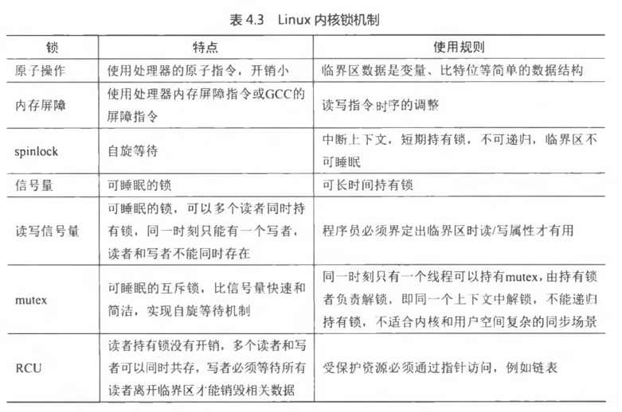

<!-- @import "[TOC]" {cmd="toc" depthFrom=1 depthTo=6 orderedList=false} -->

<!-- code_chunk_output -->

<!-- /code_chunk_output -->

- 请总结原子操作、spinlock、信号量、读写信号量、Mutex 和 RCU 等 Linux 内核常用锁的特点和使用规则.
- 在 KSM 中扫描某个 VMA 寻找有效的匿名页面, 假设此 VMA 恰巧被其他 CPU 销毁了, 会不会有问题呢?
- 请简述页锁 PG locked 的常用使用方法.
- 在 mm/rmap.c 文件中的 page\_get\_anon\_vma()函数中, 为什么要使用 rcu\_read\_lock()? 什么时候注册 RCU 回调函数呢?
- 在 mm/oom\_kill.c 的 select\_bad\_process()函数中, 为什么要使用 rcu\_read\_lock()? 什么时候注册 RCU 回调函数呢?

前面介绍了 Linux 内核中常用的锁机制, 如原子操作、spinlock 锁、信号量、读写信号量、Mutex、以及 RCU 等. 这些锁的机制都有自己的优势和劣势以及各自的应用范围.

下面归纳总结各个锁的特点和使用规则, 如表 4.3 所示.

前文中介绍内存管理时基本上忽略了锁的讨论, 其实锁在内存管理中有着很重要的作用, 下面以内存管理为例介绍锁的使用. 在 rmap.c 文件的开始, 作者列举了内存管理模块中锁的调用关系图.

