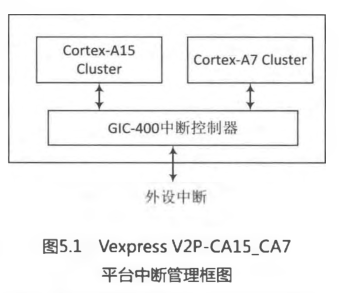
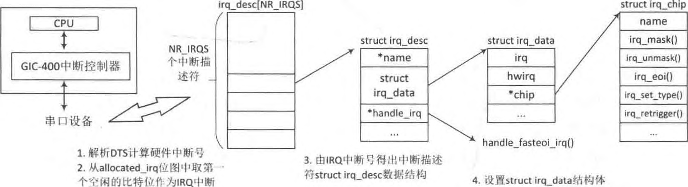
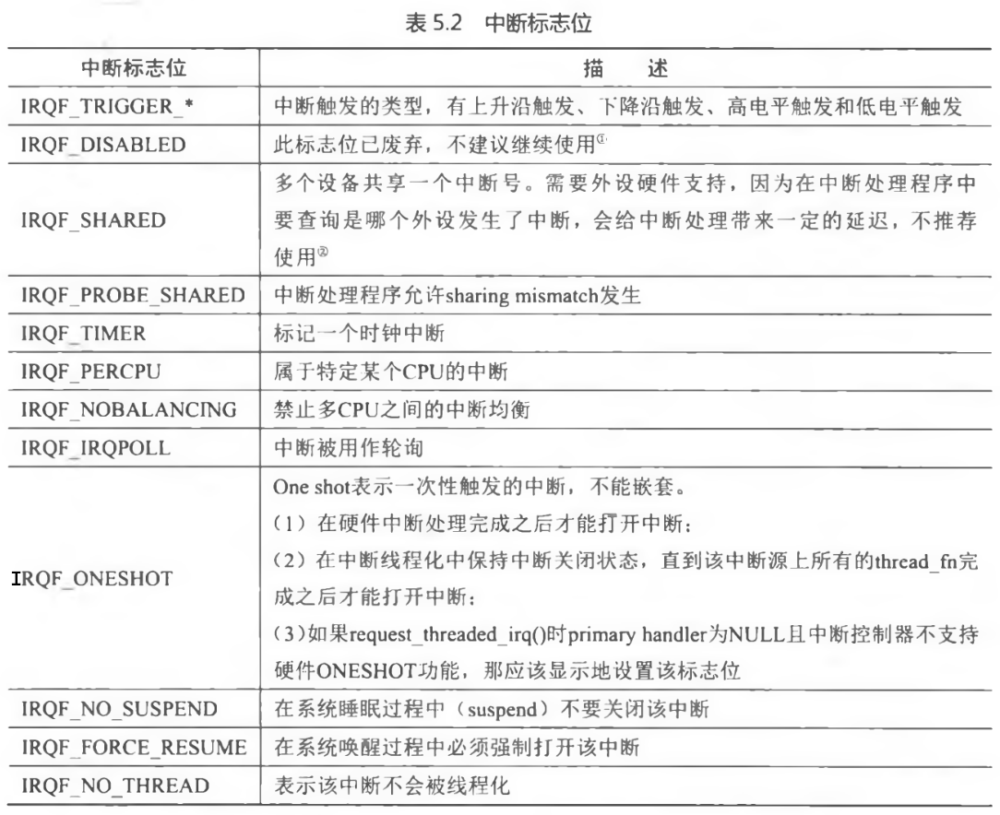
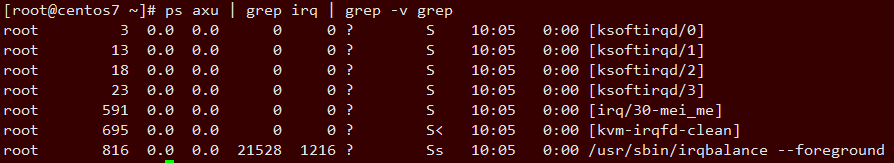
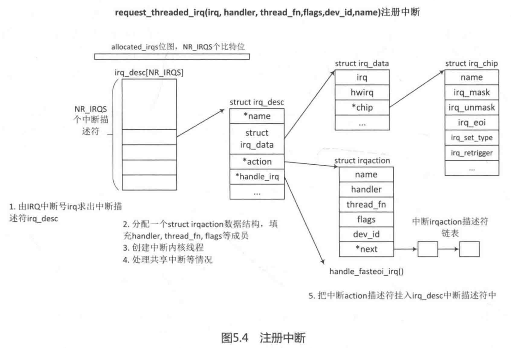
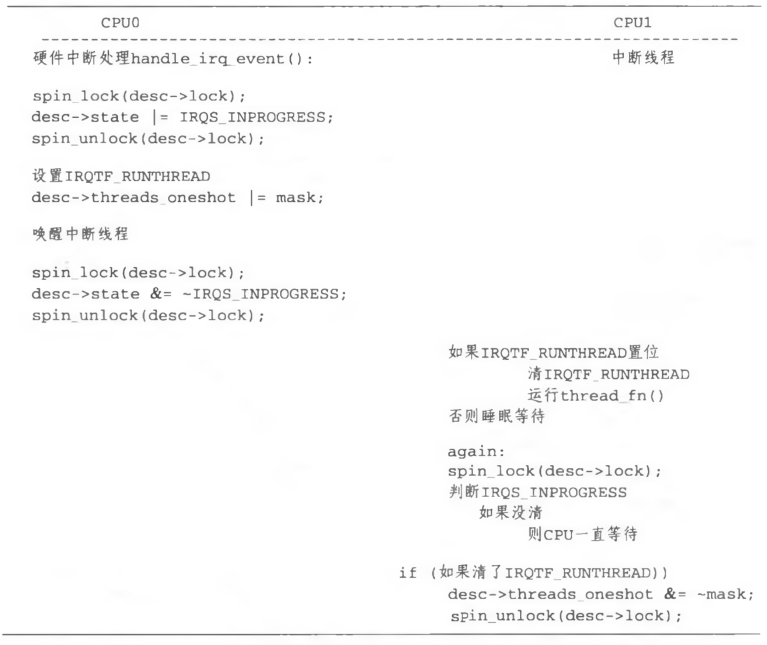
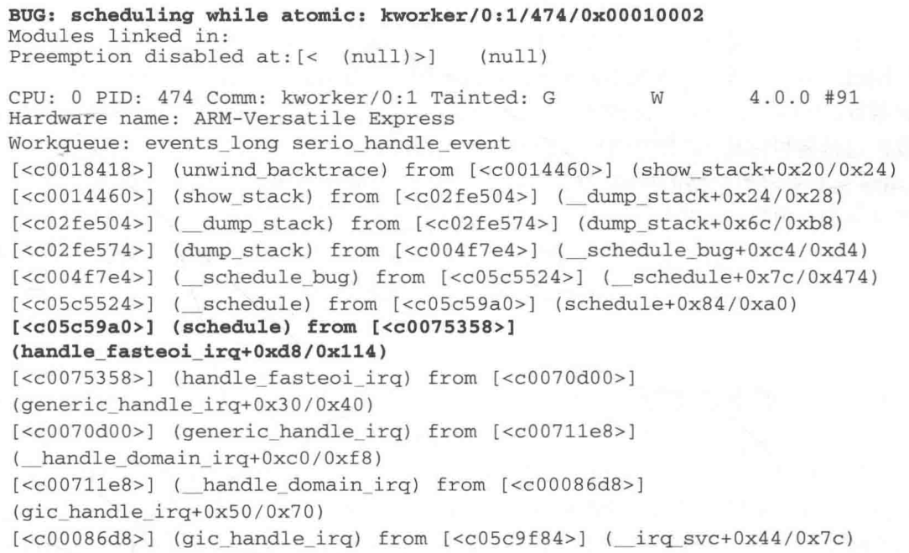

<!-- @import "[TOC]" {cmd="toc" depthFrom=1 depthTo=6 orderedList=false} -->

<!-- code_chunk_output -->

- [ARM 中断控制器](#arm-中断控制器)
- [硬件中断号和 Linux 中断号的映射](#硬件中断号和-linux-中断号的映射)
  - [DTS 中的设备描述](#dts-中的设备描述)
  - [系统初始化对 DTS 中的设备信息初始化](#系统初始化对-dts-中的设备信息初始化)
  - [系统初始化中控制器初始化时解析 DTS 文件](#系统初始化中控制器初始化时解析-dts-文件)
  - [系统初始化将所有设备的硬件中断号映射 IRQ 中断号](#系统初始化将所有设备的硬件中断号映射-irq-中断号)
- [注册中断](#注册中断)
  - [中断注册接口以及中断线程化](#中断注册接口以及中断线程化)
  - [request_threaded_irq() 注册函数](#request_threaded_irq-注册函数)
    - [__setup_irq()继续注册](#__setup_irq继续注册)
- [ARM 底层中断处理](#arm-底层中断处理)
- [高层中断处理](#高层中断处理)
  - [中断处理入口 irq\_handler 设置(GIC 初始化设置)](#中断处理入口-irq_handler-设置gic-初始化设置)
  - [读取硬件中断号并继续处理](#读取硬件中断号并继续处理)
  - [外设中断处理函数](#外设中断处理函数)
  - [中断线程执行过程](#中断线程执行过程)
- [小结](#小结)
  - [硬件中断号和软件中断号映射](#硬件中断号和软件中断号映射)
  - [注册中断](#注册中断-1)
  - [底层中断处理](#底层中断处理)
  - [高层中断处理](#高层中断处理-1)
  - [中断线程执行过程](#中断线程执行过程-1)

<!-- /code_chunk_output -->

阅读前思考:

- 发生**硬件中断后**, ARM**处理器**做了哪些事情?
- **硬件中断号**和 Linux 内核的**IRQ 中断号**是如何映射的?
- 一个**硬件中断发生**后, Linux**内核**如何响应并处理该中断?
- 为什么说**中断上下文不能执行睡眠操作**?

Linux 内核支持**众多的处理器体系结构**, 因此从**系统角度**来看, Linux 内核中断管理可以分成如下 4 层.

- **硬件层**, 例如 CPU 和中断控制器的连接.
- **处理器架构管理**, 例如 CPU 中断异常处理.
- **中断控制器管理**, 例如 IRQ 中断号的映射.
- Linux 内核**通用中断处理器层**, 例如**中断注册**和**中断处理**.

**不同的体系结构**对中断控制器有着**不同的设计理念**, 例如**ARM**公司提供了一个**通用的中断控制器 GIC** (Generic Interrupt Controller), **x86**体系架构则采用**APIC 控制器**(Advanced Programmable Interrupt Controller).

目前最新版本的**GIC**技术规范是**version 3/4**, version2 通常在 ARMv7 架构处理器中使用, 例如 CortexA7 和 CortexA9 等, 它最多可以支持 8 核; Version3 和 version4 则支持 ARMV8 架构, 例如 CortexA53 等. 本文以 ARMVexpress 平台为例来介绍中断管理的实现, 它支持**GIC Version 2**版本.

# ARM 中断控制器

ARM Vexpress V2P\-CA15\_CA7 平台支持 CortexA 15 和 Cortex A7 两个 CPU cluster, 中断控制器采用 GI04 0 0 控制器, 支持 GIC version 2 技术规范, 如图 5.1 所示, GIC-V 2 规范支持如下中断类型.

- SGI 软件触发中断(Software Generated Interrupt), 通常用于多核之间通讯. 最多支持 16 个 SGI 中断,硬件中断号从 ID0 〜 ID15. SGI 通常在 Linux 内核中被用作 IPI 中 断 (inter-process interrupts), 并会送达到系统指定的 C P U 上.
- PIH 私有外设中断(Private Peripheral Interrupt), 这是每个处理核心私有的中断. 最多支持 16 个 PPI 中断, 硬件中断号从 ID16〜ID31. PPI 通常会送达到指定的 C P U 上, 应用场景有 C P U 本地时钟(local timer).
- SPI 外设中断(Shared Peripheral Interrupt), 公用的外设中断. 最多可以支持 988 个外设中断, 硬件中断号从 ID32〜ID1019.



......................

# 硬件中断号和 Linux 中断号的映射

**注册中断**API 函数**request\_irq**()/ **request\_threaded\_irq**()是使用 Linux 内核**软件中断号**(俗称软件中断号或 IRQ 中断号), 而**不是硬件中断号(！！！**).

```c
/* include/linux/interrupt.h */
int request_threaded_irq (unsigned int irq,  irq_handler_t handler,
                irq_handler_t thread_fn, unsigned long irqflags,
                const char *devname, void *dev_id)
```

其中, **参数 irq**在 Linux 内核中称为**IRQ number 或 interrpt line**, 这是一个 Linux 内核管理的**虚拟中断号**, 并**不是指硬件的中断号**.

内核中有一个**宏 NR\_IRQS**来表示系统支持**中断数量的最大值**, NR\_IRQS 和**平台相关**.

例如 VexpressV2P\-CA15\_CA7 平台的定义.

```c++
/* [arch/arm/mach-versatile/include/mach/irqs.h] */

#define IRQ_SIC_END  95
#define NR_IRQS  (IRQ_GPI03_END + 1)
```

在 x86 平台

```c++
/* arch/x86/include/asm/irq_vectors.h */

#define NR_IRQS_LEGACY			16

#define CPU_VECTOR_LIMIT		(64 * NR_CPUS)
#define IO_APIC_VECTOR_LIMIT		(32 * MAX_IO_APICS)

#if defined(CONFIG_X86_IO_APIC) && defined(CONFIG_PCI_MSI)
#define NR_IRQS						\
	(CPU_VECTOR_LIMIT > IO_APIC_VECTOR_LIMIT ?	\
		(NR_VECTORS + CPU_VECTOR_LIMIT)  :	\
		(NR_VECTORS + IO_APIC_VECTOR_LIMIT))
#elif defined(CONFIG_X86_IO_APIC)
#define	NR_IRQS				(NR_VECTORS + IO_APIC_VECTOR_LIMIT)
#elif defined(CONFIG_PCI_MSI)
#define NR_IRQS				(NR_VECTORS + CPU_VECTOR_LIMIT)
#else
#define NR_IRQS				NR_IRQS_LEGACY
#endif
```

此外, Linux 内核定义了一个**位图(！！！无论是 R 树存储描述符还是数组存放, 这个位图可用来分配 irq！！！**)来管理这些**中断号**.

```c++
/* [kernel/irq/irqdesc.c] */

#define IRQ_BITMAP_BITS  NR_IRQS
static DECLARE_BITMAP (allocated_irqs, IRQ_BITMAP_BITS);
```

**位图变量 allocated\_irqs**分配 NR\_IRQS 比特位(！！！无论是 R 树存储描述符还是数组存放, 这个位图用来分配 irq！！！),**每个比特位**表示**一个中断号**.

另外还有一个**硬件中断号**的概念, 例如 Vexpress V2P\-CA15\_CA7 平台中的"串口 0"的硬件中断号是 37. 37 的来由是因为 GIC 把 0〜31 的硬件中断号预留给了 SGI 和 PPI, 因此外设中断号从第 32 号开始计算, "**串口 0**"设备在**主板上的序号是 5** , 因此**该设备的硬件中断号为 37**.

接下来以"**串口 0**"设备为例, 介绍**硬件中断号**是如何和**Linux 内核**的**IRQ 中断号**映射的.

## DTS 中的设备描述

**ARM 平台**的**设备描述**基本上都采用**Device Tree 的模式(简称 DTS**), 下面先看串口 0 设备 DTS 的描述:

```
[arch/arm/boot/dts/vexpress-v2m.dtsi]

motherboard {
	model = "V2M-P1";
	arm,hbi = <0x190>;
	arm,vexpress,site = <0>;
	compatible = "arm,vexpress,v2m-p1", "simple-bus";
	...
	iofpga@7,00000000 {
		compatible = "arm,amba-bus", "simple-bus";  //总线
	    ...

	    v2m_serial0: uart@09000 {
				compatible = "arm,pl011", "arm,primecell";
				reg = <0x09000 0x1000>;
				interrupts = <5>;   // 硬件中断号
				clocks = <&v2m_oscclk2>, <&smbclk>;
				clock-names = "uartclk", "apb_pclk";
			};
	};
};
```

Vexpress-v2m.dtsi 文件描述了**主板上的外设**, 其中**串口 0 设备**是一个符合"**arm,amba-bus**"总线的外设; "arm,pl011"和 "arm,primedell"是该外设的兼容字符串, 用于和驱动程序进行匹配工作; **interrupts 域**的值为 5, 表示在主板上为**第 5 号中断(硬件中断号！！！**).

## 系统初始化对 DTS 中的设备信息初始化

系统初始化, 会将**设备的相关信息**收集起来, 详细见下面节段内容.

系统**初始化(！！！**)时, **customize\_machine**()函数[**arch/arm/kernel/setup.c**]会去**枚举并初始化**"**arm,amba-bus**"和"**simple-bus**"**总线上的设备**, 最终解析 DTS 中的相关信息, 把**相关信息**添加到**struct device 数据结构(！！！**)中, 向 Linux 内核**注册一个新的外设(！！！所有外设都会注册！！！**).

我们只关注**中断相关信息的枚举**过程:

```c
[customize_machine() -> of_platform_populate() -> of_platform_bus_create() -> of_amba_device_create()]
customize_machine(): arch/arm/kernel/setup.c
of_platform_populate(): drivers/of/platform.c
of_platform_bus_create(): drivers/of/platform.c
of_amba_device_create(): drivers/of/platform.c

static int __init customize_machine(void)
{
	of_iommu_init();
	if (machine_desc->init_machine)
		machine_desc->init_machine();
#ifdef CONFIG_OF
	else
		of_platform_populate(NULL, of_default_bus_match_table,
					NULL, NULL);
#endif
	return 0;
}
arch_initcall(customize_machine);

static struct amba_device *of_amba_device_create(struct device_node *node,
						 const char *bus_id,
						 void *platform_data,
						 struct device *parent)
{
    ...
    /* Decode the IRQs and address ranges */
	for (i = 0; i < AMBA_NR_IRQS; i++)
		dev->irq[i] = irq_of_parse_and_map(node, i);

	...
}
```

注: \_\_init 这个宏是这么使用的, **start\_kernel**  -->rest\_init() -->kernel\_init()  --> do\_basic\_setup()  -->do\_initcalls(), 详见其他资料

核心函数是**irq\_of\_parse\_and\_map**(), **解析 DTS 中串口 0 设备的硬件中断号(里面调用的**), 返回**Linux 内核的 IRQ 中断号**, 并保存到**struct amba\_device 数据结构中的 irq[]数组**中.

**串口驱动程序在 pl011\_probe**()函数中直接从**dev->irq[0**]中获取**IRQ 中断号**.

```c
[drivers/tty/serial/amba-pl011.c]
static int pl011_probe(struct amba_device *dev, const struct amba_id *id)
{
    ...
    uap->port.irq = dev->irq[0];
    ...
}
```

## 系统初始化中控制器初始化时解析 DTS 文件

总结: **系统初始化(有宏\_\_init**)阶段, **控制器初始化**会**解析 DTS 文件**, 将**所有的 GIC 控制器(可能多个**)进行**注册 irq\_domain**并添加到**全局链表 irq\_domain\_list**.

接下来探讨**硬件中断号**是如何映射到**Linux IRQ 中断号**的.

有开发过 ARM7/ARM9 的 SoC 经历的读者应该知道, **那时的 SoC 内部中断管理**比较简单, 通常有一个全局的中断状态寄存器, 每个比特位管理一个外设中断, **直接简单的映射硬件中断号到 Linux IRQ 中断号即可**. 随着芯片硬件的发展, 通常**一个 SoC 内部有多个中断控制器**, 并且**每个中断控制器**管理的**中断源的数量变得越来越多**, 例如包含一个**传统的中断控制器**(如 GIC),另外还有一个**GPI0 类型的中断控制器**. 在一些复杂的 SoC 中, **多个中断控制器**还可以**级联**成一个树状结构.

面对如此复杂的硬件, 原来 Linux 内核中的中断管理机制显得捉襟见肘, 因此**Linux 3.1 内核**引入了**irq domain 的管理框架**. irq\_domain 框架可以**支持多个中断控制器**, 并且完美地**支持 Device Tree 机制**, 解决**硬件中断号映射到 Linux IRQ 中断号**的问题.

**一个中断控制器**用一个**struct irq\_domain 数据结构**来抽象描述, struct irq\_domain 数据结构定义如下:

```c
[include/linux/irqdomain.h]

struct irq_domain {
	struct list_head link;
	const char *name;
	const struct irq_domain_ops *ops;
	void *host_data;
	unsigned int flags;

	/* Optional data */
	struct device_node *of_node;
	struct fwnode_handle *fwnode;
	enum irq_domain_bus_token bus_token;
	struct irq_domain_chip_generic *gc;
#ifdef	CONFIG_IRQ_DOMAIN_HIERARCHY
	struct irq_domain *parent;
#endif

	/* reverse map data. The linear map gets appended to the irq_domain */
	irq_hw_number_t hwirq_max;
	unsigned int revmap_direct_max_irq;
	unsigned int revmap_size;
	struct radix_tree_root revmap_tree;
	unsigned int linear_revmap[];
};
```

- link: 用于将**irq domain**连接到**全局链表 irq\_domain\_list**中.
- name:  irq domain 的**名称**.
- ops: irq domain 映射**操作使用的方法集合**.
- of\_node:对应**中断控制器的 device node**.
- hwirq\_max: 该**irq domain**支持**中断数量的最大值**.
- revmap\_size: **线性映射的大小**.
- revmap\_tree: **Radix Tree 映射的根节点**.
- linear\_revmap:**线性映射用到的 lookup table**.

**GIC 中断控制器**在**初始化**时**解析 DTS 信息**中定义了**几个 GIC 控制器**, **每个 GIC 控制器**注册一个**irq\_domain 数据结构**. **Drivers/irqchip 目录**存放着**中断控制器的驱动代码**, 其中, irq\-gic.c 文件是符合 GIC\-V2 规范的驱动, irq\-gic\-v3.c 文件是符合 GIC\-V3 规范的驱动代码. 在 vexpress\-v2p\-cal5\_a7.dts 文件中定义了**GIC 中断控制器的相关 DTS 信息**.

```
[arch/arm/boot/dts/vexpress-v2p-ca15_a7.dts]
gic: interrupt-controller@2c001000 {
		compatible = "arm,cortex-a15-gic", "arm,cortex-a9-gic";
		#interrupt-cells = <3>;
		#address-cells = <0>;
		interrupt-controller;  // 表明该设备是一个中断控制器
		reg = <0 0x2c001000 0 0x1000>,
		      <0 0x2c002000 0 0x1000>,
		      <0 0x2c004000 0 0x2000>,
		      <0 0x2c006000 0 0x2000>;
		interrupts = <1 9 0xf04>;
	};
```

系统**初始化(！！！**)时会去查找 DTS 中**定义的中断控制器**, 定义"**interrupt\-controller**"属性的设备表示是一个**中断控制器**, 例如**GIC 中断控制器**的**标识符**是"**arm,cortex\-a15\-gic**"或"**arm,cortex\-a9\-gic**".

```cpp
[drivers/irqchip/irq-gic.c]
IRQCHIP_DECLARE(cortex_a15_gic, "arm,cortex-a15-gic", gic_of_init);

[gic_of_init() -> __gic_init_bases()]
static void __init __gic_init_bases(unsigned int gic_nr, int irq_start,
			   void __iomem *dist_base, void __iomem *cpu_base,
			   u32 percpu_offset, struct device_node *node)
{
	irq_hw_number_t hwirq_base;
	struct gic_chip_data *gic;
	int gic_irqs, irq_base, i;
	...
	/*
	 * Find out how many interrupts are supported.
	 * The GIC only supports up to 1020 interrupt sources.
	 */
	// 计算 GIC 控制器最多支持的中断源的个数
	gic_irqs = readl_relaxed(gic_data_dist_base(gic) + GIC_DIST_CTR) & 0x1f;
	gic_irqs = (gic_irqs + 1) * 32;
	if (gic_irqs > 1020)
		gic_irqs = 1020;
	gic->gic_irqs = gic_irqs;

	if (node) {		/* DT case */
		gic->domain = irq_domain_add_linear(node, gic_irqs,  //
						    &gic_irq_domain_hierarchy_ops,
						    gic);
```

计算 GIC 控制器**最多支持的中断源的个数**, GIC\-V2 规范中最多支持 1020 个中断源. 在 SoC 芯片设计阶段就固定下来一个 ARMSoC 可以支持多少个中断源了, 例如 Vexpress V2P-CA15\_CA7 平台支持 160 个中断源.

调用 irq\_domain\_add\_linear()函数**注册一个 irq\_domain**.

```cpp
[__gic_init_bases() -> irq_domain_add_linear() -> __irq_domain_add()]
[kernel/irq/irqdomain.c]
struct irq_domain *__irq_domain_add(struct device_node *of_node, int size,
				    irq_hw_number_t hwirq_max, int direct_max,
				    const struct irq_domain_ops *ops,
				    void *host_data)
{
	struct irq_domain *domain;

	domain = kzalloc_node(sizeof(*domain) + (sizeof(unsigned int) * size),
			      GFP_KERNEL, of_node_to_nid(of_node));

	/* Fill structure */
	INIT_RADIX_TREE(&domain->revmap_tree, GFP_KERNEL);
	domain->ops = ops;
	domain->host_data = host_data;
	domain->of_node = of_node_get(of_node);
	domain->hwirq_max = hwirq_max;
	domain->revmap_size = size;
	domain->revmap_direct_max_irq = direct_max;
	irq_domain_check_hierarchy(domain);

	mutex_lock(&irq_domain_mutex);
	list_add(&domain->link, &irq_domain_list);  // 加入全局链表
	mutex_unlock(&irq_domain_mutex);

	pr_debug("Added domain %s\n", domain->name);
	return domain;
}
EXPORT_SYMBOL_GPL(__irq_domain_add);
```

内部调用\_\_irq\_domain\_add()来初始化一个**irq\_domain 数据结构**, 注意 domain 除了指向的 irq\_domain 数据结构外, 还**多了 sizeof(unsigned int) \* size 大小的内存空间**, 用于 linear\_revmap[]成员. 最后, **irq\_domain**加入**全局的链表 irq\_domain\_list** 中.

## 系统初始化将所有设备的硬件中断号映射 IRQ 中断号

总结: 解析**DTS 文件**中**设备文件属性**, 里面会有硬件中断号, 找到该设备的中断控制器(irq\_domain), xlate 到真正的外设硬件中断号和 trigger 类型(触发类型), 通过**全局 allocated\_irqs 位图(！！！无论是 R 树存储描述符还是数组存放, 这个位图可用来分配 irq！！！**)找到一个空闲比特位(因为外设和中断控制器 irq\_domain 的 request line 有且仅有一条), 从而获得一个 IRQ, 并分配一个**中断描述符**(配置了**CONFIG\_SPARSE\_IRQ**采用**R 树存储**, 否则是**全局数组**形式), 调用**irq\_domain 的 alloc 回调函数(因为一些约束是硬件的,  比如有些 IRQ 不能用！！！**)进行硬件中断号和软件中断号的映射(其实就是将硬件中断号设置到中断描述符即可！！！)

回到**系统枚举阶段的中断号映射过程**, 在 of\_amba\_device\_create()函数中, **irq\_of\_parse\_and\_map**()负责把**硬件中断号**映射到**Linux 内核的 IRQ 中断号**中, 该函数定义如下:

```c
[customize_machine() -> of_platform_populate() -> of_platform_bus_create()
-> of_amba_device_create() -> irq_of_parse_and_map()]

[drivers/of/irq.c]
unsigned int irq_of_parse_and_map(struct device_node *dev, int index)
{
	struct of_phandle_args oirq;

	if (of_irq_parse_one(dev, index, &oirq))
		return 0;

	return irq_create_of_mapping(&oirq);
}
EXPORT_SYMBOL_GPL(irq_of_parse_and_map);
```

**of\_irq\_parse\_one**()主要用于解析**DTS 文件**中**设备定义的属性**, 例如"reg" "interrupts" 等, 最后把**DTS**中的"**interrupts**"的值存放在**oirq->args[1]中(这是硬件中断号**). 例如, 串口 0 设备的 DTS 中定义"interrupts"为 5, 那么 oirq->args[l]的值为 5.

irq\_create\_of\_mapping()函数代码片段如下:

```c
[of_amba_device_create() -> irq_of_parse_and_map() -> irq_create_of_mapping()]

[kernel/irq/irqdomain.c]
unsigned int irq_create_of_mapping(struct of_phandle_args *irq_data)
{
	struct irq_domain *domain;
	irq_hw_number_t hwirq;
	unsigned int type = IRQ_TYPE_NONE;
	int virq;

    // 位置 1 找到外设所属的中断控制器
	domain = irq_data->np ? irq_find_host(irq_data->np) : irq_default_domain;

	/* If domain has no translation, then we assume interrupt line */
	if (domain->ops->xlate == NULL)
		hwirq = irq_data->args[0];
	else {
	    // 位置 2
		if (domain->ops->xlate(domain, irq_data->np, irq_data->args,
					irq_data->args_count, &hwirq, &type))
			return 0;
	}

	if (irq_domain_is_hierarchy(domain)) {
		/*
		 * If we've already configured this interrupt,
		 * don't do it again, or hell will break loose.
		 */
		// 位置 3
		virq = irq_find_mapping(domain, hwirq);
		if (virq)
			return virq;
        // 位置 4
		virq = irq_domain_alloc_irqs(domain, 1, NUMA_NO_NODE, irq_data);
		if (virq <= 0)
			return 0;
	} else {
		/* Create mapping */
		virq = irq_create_mapping(domain, hwirq);
		if (!virq)
			return virq;
	}

	/* Set type if specified and different than the current one */
	if (type != IRQ_TYPE_NONE &&
	    type != irq_get_trigger_type(virq))
		irq_set_irq_type(virq, type);
	return virq;
}
EXPORT_SYMBOL_GPL(irq_create_of_mapping);
```

位置 1, 通过**device node**找到**外设所属**的**中断控制器的 irq\_domain**. **每个 irq\_domain**都定义了一系列的**映射相关的方法集合**, 例如**GIC\-V2**定义的方法集如下:

```c
[drivers/irqchip/irq-gic.c]

static const struct irq_domain_ops gic_irq_domain_hierarchy_ops = {
	.xlate = gic_irq_domain_xlate,
	.alloc = gic_irq_domain_alloc,
	.free = irq_domain_free_irqs_top,
};
```

其中, **xlate 方法**是**翻译(translate**) 的意思, 通过**一个 device tree 节点**和**DTS 脚本**中的**中断信息**解码出**硬件的中断号和中断触发类型**, 这些中断信息包括 DTS 脚本中描述的外设的 interrupts 域等.

位置 2, 调用 GIC\-V2 中的**xlate 方法**进行**硬件中断号的转换**. 对于**GIC\-V2**来说, 由于**第 0〜31 号硬件中断**是**预留给 SGI 和 PPI 使用**的, 外设中断不能使用这些中断号, 所以 gic\_irq\_domain\_xlate()函数会把**外设硬件中断号加上 32**. 对于串口 0 设备来说, 它的硬件中断号应该是 32+5=37. **hwirq**存储着这个**硬件中断号**, **type**是该**外设的中断触发类型**.

位置 3, 如果这个**硬件中断号己经映射过**了, 那么**irq\_find\_mapping**()可以找到**映射后的软件中断号**, 在此情景下, 该硬件中断号还没有映射.

位置 4, **irq\_domain\_alloc\_irqs**()函数是**映射的核心函数**, 内部调用\_\_irq\_domain\_alloc\_irqs()函数.

```c
[irq_create_of_mapping -> irq_domain_alloc_irqs() -> __irq_domain_alloc_irqs()]

[kernel/irq/irqdomain.c]
int __irq_domain_alloc_irqs(struct irq_domain *domain, int irq_base,
			    unsigned int nr_irqs, int node, void *arg,
			    bool realloc)
{
	int i, ret, virq;
    // 位置 1
	virq = irq_domain_alloc_descs(irq_base, nr_irqs, 0, node);
	if (virq < 0) {
		pr_debug("cannot allocate IRQ(base %d, count %d)\n",
			 irq_base, nr_irqs);
		return virq;
	}


	if (irq_domain_alloc_irq_data(domain, virq, nr_irqs)) {
		pr_debug("cannot allocate memory for IRQ%d\n", virq);
		ret = -ENOMEM;
		goto out_free_desc;
	}

	mutex_lock(&irq_domain_mutex);
	// 位置 2
	ret = irq_domain_alloc_irqs_recursive(domain, virq, nr_irqs, arg);
	if (ret < 0) {
		mutex_unlock(&irq_domain_mutex);
		goto out_free_irq_data;
	}
	for (i = 0; i < nr_irqs; i++)
	    // 位置 3
		irq_domain_insert_irq(virq + i);
	mutex_unlock(&irq_domain_mutex);

	return virq;
}
```

位置 1, irq\_domain\_alloc\_descs()函数要从**allocated\_irqs 位图**中**查找第一个空闲的比特位(request line 仅有一条**), 最终调用到\_\_irq\_alloc\_descs()函数.

```c
[kernel/irq/irqdesc.c]
int __ref
__irq_alloc_descs(int irq, unsigned int from, unsigned int cnt, int node,
		  struct module *owner)
{
	int start, ret;

	mutex_lock(&sparse_irq_lock);

	start = bitmap_find_next_zero_area(allocated_irqs, IRQ_BITMAP_BITS,
					   from, cnt, 0);

	bitmap_set(allocated_irqs, start, cnt);
	mutex_unlock(&sparse_irq_lock);
	return alloc_descs(start, cnt, node, owner);

}
EXPORT_SYMBOL_GPL(__irq_alloc_descs);
```

**bitmap\_find\_next\_zero\_area**函数在**allocated\_irqs 位图**中查找**第一个连续 cnt(此时为 1)个为 0**的比特位区域. **bitmap\_set**()函数设置这些比特位, 表示这些比特位**已经被占用**.

**alloc\_descs**()函数用于分配一个**struct irq\_desc 数据结构**, 该数据结构用于描述**中断描述符**, 后续会详细介绍.

内核中有**两种方式**来分配**struct irq\_desc 数据结构**

- 一是内核配置了**CONFIG\_SPARSE\_IRQ**选项, 那么会采用**Radix Tree**的方式来存储这些数据结构;
- 二是采用数组的方式, 这是内核在早期釆用的方法, 即定义一个**全局的数组**, **每个中断**对应一个**struct irq\_desc**.

下面以后者举例:

```c
[kernel/irq/irqdesc.c]

struct irq_desc irq_desc[NR_IRQS] __cacheline_aligned_in_smp = {
	[0 ... NR_IRQS-1] = {
		.handle_irq	= handle_bad_irq,
		.depth		= 1,
		.lock		= __RAW_SPIN_LOCK_UNLOCKED(irq_desc->lock),
	}
};
```

irq\_desc[]数组定义了 NR\_IRQS 个中断描述符, 数组下标表示 IRQ 中断号, 通过**IRQ 中断号**可以找到**相应的中断描述符**.

**struct irq\_desc**数据结构定义了很多有用的成员, **先来看和映射相关**的.

```c
[include/linux/irqdesc.h]
struct irq_desc {
	struct irq_data		irq_data;
	const char		*name;
	irq_flow_handler_t	handle_irq;
    ...
}

[include/linux/irq.h]
struct irq_data {
	u32			mask;
	unsigned int		irq;
	unsigned long		hwirq;
	struct irq_chip		*chip;
	struct irq_domain	*domain;
};
```

**struct irq\_desc 数据结构**内置了 struct irq\_data 结构体, 包含**底层 irq chip 相关的信息(！！！**), struct irq\_data 结构体成员**irq 指软件中断号**, **hwirq 指硬件中断号**. 如果把这两个成员填写完成, 即**完成了硬件中断号到软件中断号的映射(！！！**).

irq\_domain\_alloc\_descs()函数返回**allocated\_irqs 位图**中**第一个空闲的比特位**, 这是**软件中断号**.

回到上面, 位置 2, irq\_domain\_alloc\_irqs\_recursive()函数调用**irq\_domain**中的**alloc 回调函数**进行**硬件中断号和软件中断号的映射**.

```c
[irq_create_of_mapping -> irq_domain_alloc_irqs() -> __irq_domain_alloc_irqs()
-> irq_domain_alloc_irqs_recursive() -> gic_irq_domain_alloc]

[drivers/irqchip/irq-gic.c]
static int gic_irq_domain_alloc(struct irq_domain *domain, unsigned int virq,
				unsigned int nr_irqs, void *arg)
{
	int i, ret;
	irq_hw_number_t hwirq;
	unsigned int type = IRQ_TYPE_NONE;
	struct irq_fwspec *fwspec = arg;

	ret = gic_irq_domain_xlate(domain, fwspec, &hwirq, &type);
	if (ret)
		return ret;

	for (i = 0; i < nr_irqs; i++)
		gic_irq_domain_map(domain, virq + i, hwirq + i);

	return 0;
}
```

gic\_irq\_domain\_xlate()函数己在前又中介绍, 最后解析出**硬件中断号存放在 hwirq 中**, gic\_irq\_domain\_map()函数做**映射**工作.

```c
[drivers/irqchip/irq-gic.c]
static int gic_irq_domain_map(struct irq_domain *d, unsigned int irq,
				irq_hw_number_t hw)
{
	if (hw < 32) {
	    //位置 1
		irq_set_percpu_devid(irq);
		irq_domain_set_info(d, irq, hw, &gic_chip, d->host_data,
				    handle_percpu_devid_irq, NULL, NULL);
		set_irq_flags(irq, IRQF_VALID | IRQF_NOAUTOEN);
	} else {
	    // 位置 2
		irq_domain_set_info(d, irq, hw, &gic_chip, d->host_data,
				    handle_fasteoi_irq, NULL, NULL);
		set_irq_flags(irq, IRQF_VALID | IRQF_PROBE);

		gic_routable_irq_domain_ops->map(d, irq, hw);
	}
	return 0;
}
```

**参数 hw 指硬件中断号**, 位置 1 的 if 中代码是处理系统**预留给 SGI 和 PPI 中断类型**, 位置 2 的 else 中代码是处理**SPI 类型的外设中断**. irq\_domain\_set\_info()函数会设置一些很重要的参数到中断描述符中.

```c
[kernel/irq/irqdomain.c]
void irq_domain_set_info(struct irq_domain *domain, unsigned int virq,
			 irq_hw_number_t hwirq, struct irq_chip *chip,
			 void *chip_data, irq_flow_handler_t handler,
			 void *handler_data, const char *handler_name)
{
	irq_domain_set_hwirq_and_chip(domain, virq, hwirq, chip, chip_data);
	__irq_set_handler(virq, handler, 0, handler_name);
	irq_set_handler_data(virq, handler_data);
}
```

先看 irq\_domain\_set\_hwirq\_and\_chip()函数

```c
[kernel/irq/irqdomain.c]
int irq_domain_set_hwirq_and_chip(struct irq_domain *domain, unsigned int virq,
				  irq_hw_number_t hwirq, struct irq_chip *chip,
				  void *chip_data)
{
	struct irq_data *irq_data = irq_domain_get_irq_data(domain, virq);

	if (!irq_data)
		return -ENOENT;

	irq_data->hwirq = hwirq;
	irq_data->chip = chip ? chip : &no_irq_chip;
	irq_data->chip_data = chip_data;

	return 0;
}
```

通过**IRQ 中断号和 irq\_domain**获取**struct irq\_data 数据结构**, 然后把**硬件中断号 hwirq**设置到 struct irq\_data 数据结构中的**hwirq 成员**中, 这样就完成了**硬件中断号**到**软件中断号的映射(！！！**).

**参数 chip**指**硬件中断控制器**的**struct irq\_chip**中定义的**与中断控制器底层(！！！**)操作相关的**方法集合**.

```c
[include/linux/irq.h]
struct irq_chip {
	const char	*name;
	unsigned int	(*irq_startup)(struct irq_data *data);
	void		(*irq_shutdown)(struct irq_data *data);
	void		(*irq_enable)(struct irq_data *data);
	void		(*irq_disable)(struct irq_data *data);

	void		(*irq_ack)(struct irq_data *data);
	void		(*irq_mask)(struct irq_data *data);
	void		(*irq_mask_ack)(struct irq_data *data);
	void		(*irq_unmask)(struct irq_data *data);
	void		(*irq_eoi)(struct irq_data *data);

	int		(*irq_set_affinity)(struct irq_data *data, const struct cpumask *dest, bool force);
	int		(*irq_retrigger)(struct irq_data *data);
	int		(*irq_set_type)(struct irq_data *data, unsigned int flow_type);
	int		(*irq_set_wake)(struct irq_data *data, unsigned int on);

	void		(*irq_bus_lock)(struct irq_data *data);
	void		(*irq_bus_sync_unlock)(struct irq_data *data);

	void		(*irq_cpu_online)(struct irq_data *data);
	void		(*irq_cpu_offline)(struct irq_data *data);

	void		(*irq_suspend)(struct irq_data *data);
	void		(*irq_resume)(struct irq_data *data);
	void		(*irq_pm_shutdown)(struct irq_data *data);

	void		(*irq_calc_mask)(struct irq_data *data);

	void		(*irq_print_chip)(struct irq_data *data, struct seq_file *p);
	int		(*irq_request_resources)(struct irq_data *data);
	void		(*irq_release_resources)(struct irq_data *data);

	void		(*irq_compose_msi_msg)(struct irq_data *data, struct msi_msg *msg);
	void		(*irq_write_msi_msg)(struct irq_data *data, struct msi_msg *msg);

	unsigned long	flags;
};
```

其中, 比较常用的方法如下.

- irq\_startup: **初始化**一个中断.
- irq\_shutdown: **结束**一个中断.
- irq\_enable: 使能一个中断.
- irq\_disable: 关闭一个中断.
- irq\_ack: 应答一个中断.
- irq\_mask: 屏蔽一个中断源.
- irq\_mask\_ack: 应答并屏蔽该中断源.
- irq\_unmask: 解除一个中断源的屏蔽操作.
- irq\_eoi: 发送 EOI 信号给中断控制器, 表示硬件中断处理己经完成.
- irq\_set\_affinity: 绑定一个中断到某个 CPU 上.
- irq\_retrigger: 重新发送中断到 CPU 上.
- irq\_set\_type: 设置中断触发类型.
- irq\_Set\_wake: 使能/关闭该中断在电源管理中的唤醒功能.
- irq\_bus\_lock: 函数指针, 用于实现保护访问慢速设备的锁.

并**不是每个中断控制器**都需要实现 struct irq\_chip 中定义的**所有的方法集**, 对于**GIC\-V2 中断控制器**来说, 实现的方法集如下:

```c
[drivers/irqchip/irq-gic.c]
static struct irq_chip gic_chip = {
	.name			= "GIC",
	.irq_mask		= gic_mask_irq,
	.irq_unmask		= gic_unmask_irq,
	.irq_eoi		= gic_eoi_irq,
	.irq_set_type		= gic_set_type,
	.irq_retrigger		= gic_retrigger,
#ifdef CONFIG_SMP
	.irq_set_affinity	= gic_set_affinity,
#endif
	.irq_set_wake		= gic_set_wake,
};
```

回到**irq\_domain\_set\_info**()函数中, **其中\_\_irq\_set\_handler**()用于设置**中断描述符 desc->hander\_irq**的**回调函数**, 对于**SPI 类型**的外设中断来说, 回调函数是**handle\_fasteoi\_irq**().

如图 5.3 所示是**硬件中断号**和**软件中断号的整个映射过程**.



# 注册中断

## 中断注册接口以及中断线程化

当一个外设中断发生后, 内核会执行一个函数来响应该中断, 这个函数通常被称为中断处理程序(interrupt handler) 或中断服务例程. **中断处理程序**是**内核用于响应中断(内核态运行！！！中断处理程序包括硬件中断处理程序和其下半部处理机制, 包括中断线程化、软中断和 workqueue 等, 这里特指硬件中断处理程序**)的,并且它运行在**中断上下文**中(**和进程上下文不同**).

中断处理程序最基本的工作是**通知硬件设备**中断**己经被接收**, **不同的硬件设备**的**中断处理程序是不同**的, 有的常常需要做很多的处理工作, 这也是 Linux 内核把中断处理程序分成**上半部**和**下半部**的原因.

中断处理程序要求**快速完成**并且**退出中断**, 但是如果中断处理程序需要完成的**任务比较繁重**, 这两个需求就会有冲突, 因此**上下半部机制**就诞生了.

在**编写外设驱动**时通常**需要注册中断**, 注册中断的 API 如下:

```c
[include/linux/interrupt.h]
static inline int __must_check
request_irq(unsigned int irq, irq_handler_t handler, unsigned long flags,
	    const char *name, void *dev)
```

request\_irq()是比较旧的 API 接口, 在 Linux2.6.30 中新增了**线程化的中断注册函数 request\_threaded\_irq()**. 中断线程化是实时 Linux 项目开发的一个新特性, 目的是**降低中断处理对系统实时延迟的影响**. Linux 内核已经把中断处理分成了上下半部, 为什么还需要引入中断线程化机制呢?

在 Linux 内核里, **中断具有最高的优先级**, 只要有中断发生, 内核会暂停手头的工作转向中断处理, 等到**所有挂起等待(pending)的中断和软中断处理完毕后(所有中断处理完成后！！！包括软中断！！！**)才会执行**进程调度**, 因此这个过程会**造成实时任务得不到及时处理(！！！**). **中断上下文总是抢占进程上下文(！！！**), **中断上下文**不仅是**中断处理程序**,还包括**Softirq 软中断**、**tasklet 等(！！！**), **中断上下文**成了优化**Linux 实时性的最大挑战之一(！！！**).

假设一个**高优先级任务**和一个**中断同时发生**, 那么内核**首先执行中断处理程序(！！！**), 中断处理程序完成**之后有可能触发软中断(！！！在 high level -> specific handler 中定义软中断<比如 tasklet>并调度执行, 其中调用 raise\_softirq\_irqoff**), 也可能**有一些 tasklet 任务**要执行或有**新的中断发生**, 这样**高优先级任务的延迟**变得不可预测. **中断线程化**的目的是把**中断处理中**一些**繁重的任务**作为**内核线程来运行**, **实时进程**可以有**比中断线程更高的优先级(！！！**). 这样高优先级的实时进程可以得到优先处理, **实时进程的延迟**粒度变得小得多, 当然**并不是所有的中断都可以线程化(！！！**), 例如**时钟中断**.

```c
[kernel/irq/manage.c]
int request_threaded_irq(unsigned int irq, irq_handler_t handler,
			 irq_handler_t thread_fn, unsigned long irqflags,
			 const char *devname, void *dev_id)
```

- irq: IRQ 中断号, 注意这里使用的是**软件中断号**, 而**不是硬件中断号**.
- handler: 指 **primary handler**, 有些类似于旧版本 API 函数 request\_irq()的中断处理函数 handler. 中断发生时会**优先执行 primary handler**. 如果**primary handler 为 NULL**且**thread\_fn 不为 NULL**, 那么会执行系统**默认的 primary handler**: **irq\_default\_primary\_handler**()函数.
- thread\_fn: 中断**线程化的处理程序**. 如果**thread\_fn 不为 NULL**, 那么会**创建一个内核线程**. primary handler 和 thread\_fn**不能同时为 NULL**.
- irqflags: 中断**标志位**, 如表 5.2 所示.
- devname: 该**中断名称**.
- dev_id: 传递给**中断处理程序的参数**.



注: IRQF\_SHARED. 如果中断控制器可以支持足够多的中断源, 那么**不推荐使用共享中断**. 共享中断需要一些额外开销, 例如**发生中断**时需要**遍历 irqaction 链表**, 然后 irqaction 的**primary handler(最开始判断！！！**)需要判断**是否属于自己的中断(！！！**).

上述**前缀为"IRQF\_"描述**的中断标志位用于**申请中断时**描述**该中断的特性**.

前缀**为"IRQS\_"的**中断标志位是位于**struct irq\_desc**数据结构的**istate 成员(！！！**), 在 struct irq\_desc 数据结构定义中是**core\_intemal\_state\_\_do\_not\_mess\_with\_it**成员, 通过一个**宏**把它改名成 istate.

```c
[kernel/irq/internals.h]
enum {
	IRQS_AUTODETECT		= 0x00000001,
	IRQS_SPURIOUS_DISABLED	= 0x00000002,
	IRQS_POLL_INPROGRESS	= 0x00000008,
	IRQS_ONESHOT		= 0x00000020,
	IRQS_REPLAY		= 0x00000040,
	IRQS_WAITING		= 0x00000080,
	IRQS_PENDING		= 0x00000200,
	IRQS_SUSPENDED		= 0x00000800,
};
```

- IRQS\_AUTODETECT : 表示**某个 irq\_desc**处于**自动侦测状态**.
- IRQS\_WAITING: 表示某个 irq\_desc 处于**等待状态**.
- IRQS\_SPURIOUS\_DISABLED: 表示某个 irq\_desc 被视为"**伪中断"并被禁用**.
- IRQS\_POLL\_INPROGRESS: 表示某个 irq\_desc 正处于**轮询调用 action**.
- IRQS\_ONESHOT: 表示**只执行一次**.
- IRQS\_REPLAY: **重新发一次中断**.
- IRQS\_PENDING: 表示该**中断被挂起**.
- IRQS\_SUSPENDED:表示该中断**被暂停**.

本节最常用的两个标志位是**IRQS\_0NESH0T(很重要, 见图！！！**)和**IRQS\_PENDING**.

**IRQS\_0NESH0T 标志位**是在**注册中断函数\_\_setup\_irq**()中由中断标志位**IRQF\_0NESH0T**转换过来的. 在**中断线程化程序**执行完成后需要特别**小心对待**, 见 irq\_finalize\_oneshot()函数.

IRQS\_PENDING 标志位在**handle\_fasteoi\_irq**()函数中, 当**没有指定硬件中断处理函数**, 或者**irq\_data**\->state\_use\_accessors 中设置了**IRQD\_IRQ\_DISABLED**标志位, 说明该**中断被禁用**了, 这时需要**挂起该中断**.

struct **irq\_data**数据结构中的**state\_use\_accessors**成员也有**一组中断标志位**, 以前缀"IRQD\_"开头, 通常用于描述成层中断的状态, 如下:

```c
[include/linux/irq.h]
enum {
	IRQD_TRIGGER_MASK		= 0xf,      // 常用
	IRQD_SETAFFINITY_PENDING	= (1 <<  8),
	IRQD_NO_BALANCING		= (1 << 10),
	IRQD_PER_CPU			= (1 << 11),
	IRQD_AFFINITY_SET		= (1 << 12),
	IRQD_LEVEL			= (1 << 13),
	IRQD_WAKEUP_STATE		= (1 << 14),
	IRQD_MOVE_PCNTXT		= (1 << 15),
	IRQD_IRQ_DISABLED		= (1 << 16),  // 常用
	IRQD_IRQ_MASKED			= (1 << 17),
	IRQD_IRQ_INPROGRESS		= (1 << 18),  // 常用
	IRQD_WAKEUP_ARMED		= (1 << 19),
};
```

- IRQD\_TRIGGER\_MASK: 表示中断**触发的类型**, 例如上升沿触发或者下降沿触发等.
- IRQD\_IRQ\_DISABLED: 表示该中断处于**关闭状态**.
- IRQD\_IRQ\_INPROGRESS: 表示该中断**正在被处理**中.

## request_threaded_irq() 注册函数

**实际上注册的不是中断号, 而只是一个 irqaction！！！然后唤醒内核线程, 但线程会很快调用 schedule(), 换出等待, 具体查看线程执行**

总结:

(1) **共享中断的设备**, 必须传入**dev\_id**

(2) 通过**IRQ 获取中断描述符**(**系统初始化**时会为**所有外设分配 IRQ 和中断描述符**), 并对该描述符进行检查, 然后检查 primary handler 和 thread\_fn 函数**不能同时为 NULL**, **primary 为 NULL**会设为**默认的 irq\_default\_primary\_handler**()

(3) 分配一个 struct irqaction(中断描述符的**action 链表**中的**当前设备对应的 irqaction**, 里面会有**handler\<primary handler**\>和**thread\_fn**\<**中断线程 handler**函数指针\>, 注意和**中断描述符的 handler**\<**high level event handler**\>加以区分),

(4) 调用\_\_setup\_irq()继续注册

下面从 request\_threaded\_irq()来看注册中断的实现.

```
[kernel/irq/manage.c]
int request_threaded_irq(unsigned int irq, irq_handler_t handler,
			 irq_handler_t thread_fn, unsigned long irqflags,
			 const char *devname, void *dev_id)
{
    struct irqaction *action;
	struct irq_desc *desc;
	int retval;

    // 位置 1
	if (((irqflags & IRQF_SHARED) && !dev_id) ||
	    (!(irqflags & IRQF_SHARED) && (irqflags & IRQF_COND_SUSPEND)) ||
	    ((irqflags & IRQF_NO_SUSPEND) && (irqflags & IRQF_COND_SUSPEND)))
		return -EINVAL;
    // 位置 2
	desc = irq_to_desc(irq);
	if (!desc)
		return -EINVAL;
    // 位置 3
	if (!irq_settings_can_request(desc) ||
	    WARN_ON(irq_settings_is_per_cpu_devid(desc)))
		return -EINVAL;
    // 位置 4
	if (!handler) {
		if (!thread_fn)
			return -EINVAL;
		handler = irq_default_primary_handler;
	}
    // 位置 5
	action = kzalloc(sizeof(struct irqaction), GFP_KERNEL);

	action->handler = handler;
	action->thread_fn = thread_fn;
	action->flags = irqflags;
	action->name = devname;
	action->dev_id = dev_id;
    // 位置 6
	chip_bus_lock(desc);
	retval = __setup_irq(irq, desc, action);
	chip_bus_sync_unlock(desc);

	return retval;
}
```

位置 1 是一个例行的检查, 对于那些**共享中断的设备**来说, 这里**强制要求传递一个参数 dev\_id**. 如果没有额外参数, 中断处理程序**无法识别**出究竟是**哪个外设产生的中断**, 通常根据**dev\_id**查询**设备寄存器**来确定是**哪个**共享外设的中断.

位置 2, 通过**IRQ 中断号**获取**中断描述符**struct **irq\_desc**.

位置 3, **irq\_settings\_can\_request**()判断**是否设置了\_IRQ\_NOREQUEST 标志位**, 它是**系统预留**的, 外设**不可以使用**这些中断描述符. 另外设置了\_**IRQ\_PER\_CPU\_DEVID 标志位**的中断描述符是预留给**IRQF\_PERCPU 类型的中断(属于特定某个 CPU 的中断！！！**), 应该使用**request\_percpu\_irq**()函数 API**注册中断**.

位置 4, primary handler 和 thread\_fn**不能同时为 NULL**. 当 primary handler 为 NULL 时使用默认的 handler, **irq\_default\_primary\_handler**()函数直接返回**IRQ\_WAKE\_THREAD(默认的直接返回, 用于快速响应, 然后让中断线程工作！！！**), 表示要**唤醒中断线程**.

位置 5, 分配一个**struct irqaction 数据结构**, 填充相应的成员.

位置 6, 调用\_\_**setup\_irq**()函数**继续注册中断**. chip\_bus\_lock()调用 irq\_data.chip\->irq\_bus\_lock 的回调函数进行**加锁保护**. 对于 GIC\-V2 控制器来说, 并没有定义 irq\_bus\_lock 回调函数. 下面继续介绍.

**struct irqaction 数据结构**是每个中断**irqaction 的描述符**.

```c
[include/linux/interrupt.h]
struct irqaction {
	irq_handler_t		handler;
	void			*dev_id;
	struct irqaction	*next;
	irq_handler_t		thread_fn;
	struct task_struct	*thread;
	unsigned int		irq;
	unsigned int		flags;
	unsigned long		thread_flags;
	unsigned long		thread_mask;
	const char		*name;
} ____cacheline_internodealigned_in_smp;
```

- handler: **primary handler 函数指针**.
- thread\_fh: 中断**线程处理程序的函数指针**.
- dev\_id: 传递给**中断处理程序的参数**.
- irq: **软件中断号**.
- thread: **中断线程的 task\_struct**数据结构.
- flags: **注册**中断时用的**中断标志位(！！！注册时候的！！！**), 以前缀"**IRQF\_"开头**.
- thread\_flags: 中断**线程相关的标志位**.
- thread\_mask: 用于**跟踪中断线程活动的位图**.
- name: 注册**中断的名称** .

### __setup_irq()继续注册

总结:

(1) 检查该中断描述符对应的**中断控制器是否存在**, 不存在即失败

(2) **嵌套类型(中断描述符本身的, 不是传入的！！！**)的中断**必须有线程化处理函数 thread\_fn(！！！**), 并且将**primary handler**指向**irq\_nested\_primary\_handler**()

(3) **非嵌套类型**的中断**没有设置\_IRQ\_NOTHREAD**标志, 说明**可以被线程化**, 调用 irq\_setup\_forced\_threading()

(a) 系统配置了**CONFIG\_IRQ\_FORCED\_THREADING 选项**且内核**启动参数**包含"**threadirqs**"时, **全局变量 force\_irqthreads 为 true**, 表示系统支持强制中断线程化, 如果**不支持强制中断线程化**, 直接**退出该函数**

(b) irqaction 的 flags 有(IRQF\_NO\_THREAD | IRQF\_PERCPU | IRQF\_ONESHOT)这三个中一个, 就**直接退出**

(b) **强制中断线程化**的参数校验, 并**设置 IRQ\_ONESHOT 类型(！！！**)

(c) **强制中断线程化**, 如果**没有指定 thread\_fn**, \<1\>将中断描述符 action 链表中当前设备中断对应的 irqaction 的**primary handler**指定为**默认的 irq\_default\_primary\_handler**, \<2\>**thread\_fn 设为传入的 primary handler**, \<3\>给这个 irqaction 添加 IRQTF\_FORCED\_THREAD 标志, 表明已经被强制中断线程化

截止这里, **嵌套(中断描述符本身的, 不是传入的！！！**)类型的:

- primary handler 指向 irq\_**nested**\_primary\_handler()
- thread\_fn 使用**传入的**(必须传入)

**非嵌套**类型的:

- 对于支持强制线程化的
    - **没有指定 thread\_fn**, primary handler 指向 irq\_**default**\_primary\_handler, thread\_fn 指向**传入**的 primary handler(肯定是传入的, 因为不可能传入两者都为空)
    - 指定了 thread\_fn, 和不支持强制线程化的情况一样
- 不支持强制线程化的
    - **primary** handler 要么是**传入**的, 要么是 irq\_**default**\_primary\_handler
    - thread\_fn 要么为**NULL**, 要么**传入**
    - primary 为传入, thread\_fn 可以是 NULL; primary 是 default, thread\_fn 必须传入

(4) **非嵌套(！！！**)的并且**有 thread\_fn(！！！thread\_fn 为 NULL 则不创建！！！**)的**创建**一个**内核线程(还没有唤醒！！！**), 设置为**实时线程**, **FIFO 调度策略**, **优先级 50**, 设置**线程名**, 增加该线程的 usage 计数, 确保线程异常也不会释放 task\_struct, 防止中断线程化程序访问空指针, 然后将**当前设备中断的 irqaction 中的 thread**(中断线程的 task\_struct 结构)指向它.

(5) 该中断描述符的**底层 irq chip(中断控制器)如果不支持嵌套(比如 MSI 的**), 即**只支持 one shot(！！！IRQCHIP\_ONESHOT\_SAFE！！！这是中断控制器的, 对于控制器来说嵌套和 one shot 是互斥的！！！**), **清除**这个 irqaction 的**IRQF\_ONESHOT**标志(这里是不是内核代码有问题??)

(6) 如果该中断描述符对应的 action 链表不为空(也就是这个中断是**共享中断**), 每个 irqaction(中断描述符 action 链表中每个设备中断对应的的 irqaction)都有一个 thread\_mask 位图成员用来追踪中断线程活动, 每个 action 一个比特位, 这里**获取到所有的 action 的比特位信息**

(7) irqaction 的 flags 有 IRQF\_ONESHOT(MSI 类型会清除这个标志), **设置**这个 irqaction 的**thread\_mask**

(8) irqaction 没有 IRQF\_ONESHOT(没有传入, 前面也没有设置), 且 primary handler 是 default(没有传入), 底层 irq chip 不支持硬件 oneshot, 内核会报错, 所以这种情况下, 必须指定 IRQF\_ONESHOT 标志位(这句话有问题??当硬件 oneshot 不支持, 前面会清除 IRQF\_ONESHOT 标志位)

(9) 对于非共享中断, 设置中断触发类型, 清理标志等

(10) 共享中断, 将当前设备的 irqaction 加入中断描述符的 action 链表

(11) 对于当前设备的**irqaction 有 thread 的(非嵌套且有 thread\_fn**), **唤醒该内核线程**

\_\_setup\_irq()函数很长, 分段阅读.

```c
[request_threaded_irq() -> ]
[kernel/irq/manage.c]
static int
__setup_irq(unsigned int irq, struct irq_desc *desc, struct irqaction *new)
{
	struct irqaction *old, **old_ptr;
	unsigned long flags, thread_mask = 0;
	int ret, nested, shared = 0;
	cpumask_var_t mask;

	if (!desc)
		return -EINVAL;
    // 位置 1
	if (desc->irq_data.chip == &no_irq_chip)
		return -ENOSYS;

	/*
	 * Check whether the interrupt nests into another interrupt
	 * thread.
	 */
	// 位置 2
	nested = irq_settings_is_nested_thread(desc);
	if (nested) {
		if (!new->thread_fn) {
			ret = -EINVAL;
			goto out_mput;
		}
		/*
		 * Replace the primary handler which was provided from
		 * the driver for non nested interrupt handling by the
		 * dummy function which warns when called.
		 */
		new->handler = irq_nested_primary_handler;
	} else {
	    // 位置 3
		if (irq_settings_can_thread(desc))
			irq_setup_forced_threading(new);
	}
```

位置 1, 如果**desc->irq\_data.chip**指向 no\_irq\_chip, 说明**还没有正确初始化中断控制器**. 对于**GIC\-V2 中断控制器**来说, 它是在**gic\_irq\_domain\_alloc**()函数中就**指定 chip 指针**指向**该中断控制器的 struct irq\_chip \*gic\_chip**数据结构.

位置 2, 处理**中断是否嵌套**的情况. 对于设置了\_IRQ\_NESTED\_THREAD**嵌套类型的中断描述符**, 驱动程序**注册中断时**应该指定**中断线程化处理函数 thread\_fn**. 嵌套类型的中断**没有 primary handler**,但是这里**设定 handler 指向 irq\_nested\_primary\_handler**()函数, 该函数会**打印一句日志** "Primary handler called for nested irq".

位置 3, **irq\_settings\_can\_thread**()函数判断该中断**是否可以被线程化**. 如果该中断**没有设置\_IRQ\_NOTHREAD 标志**, 说明**可以被中断线程化**, 那么调用**irq\_setup\_forced\_threading**()函数.

```c
[kernel/irq/manage.c]
static void irq_setup_forced_threading(struct irqaction *new)
{
	if (!force_irqthreads)
		return;
	if (new->flags & (IRQF_NO_THREAD | IRQF_PERCPU | IRQF_ONESHOT))
		return;
    // 位置 1
	new->flags |= IRQF_ONESHOT;

	if (!new->thread_fn) {
		set_bit(IRQTF_FORCED_THREAD, &new->thread_flags);
		new->thread_fn = new->handler;
		new->handler = irq_default_primary_handler;
	}
}
```

系统**配置**了**CONFIG\_IRQ\_FORCED\_THREADING**选项且**内核启动参数**包含"**threadirqs**"时, **全局变量 force\_irqthreads(！！！**)会为**true**, 表示系统**支持强制中断线程化**. 如果**注册**的中断传入**IRQF\_NO\_THREAD | IRQF\_PERCPU | IRQF\_ONESHOT**参数, 也**不符合中断线程化要求**. **IRQF\_PERCPU**是一个**特殊的中断**, 不是一般意义上的**外设中断**, **不适合强制中断线程化**.

**强制中断线程化**是一个**过渡方案**, 目前还有很多的驱动使用**旧版本**的注册中断 API\-**request\_irq**(), 这些驱动的中断处理通常采用**上下半部的方式**.

位置 1, **上半部**通常是在**关中断的状态下进行**的, 所以中断不会嵌套, 因此这里也设置**IRQ\_ONESHOT 类型**, 保证所有的线程化后的 thread\_fn 都**执行完成**后才**打开中断源**, 稍后中断线程化部分详细介绍.

对于那些**注册中断**时**没有指定 thread\_fn**的, **强制中断线程化(！！！只有这种情况下！！！**)会把**原来的 primary handler**处理的函数弄到**中断线程中运行**, **原来的 primary handler**只执行**默认的 irq\_default\_primary\_handler**, 并且设置**IRQTF\_FORCED\_THREAD 标志位**, 表明该**中断已经被强制中断线程化**.

```c
[__setup_irq()]
...
if (new->thread_fn && !nested) {
		struct task_struct *t;
		static const struct sched_param param = {
			.sched_priority = MAX_USER_RT_PRIO/2,
		};

		t = kthread_create(irq_thread, new, "irq/%d-%s", irq,
				   new->name);

		sched_setscheduler_nocheck(t, SCHED_FIFO, &param);
		get_task_struct(t);
		new->thread = t;
		set_bit(IRQTF_AFFINITY, &new->thread_flags);
	}
...
```

接下来对于**没有嵌套的线程化中断创建一个内核线程(！！！**), 它是一个**实时线程(！！！**), **调度策略为 SCHED\_FIFO**, 优先级是**50**. 该**中断线程**以"**irq"、中断号和中断名称联合命名**.

注意, **创建的该线程**执行函数是**irq\_thread！！！**



**get\_task\_struct**()增加该线程的**task\_struct->usage 计数**, 确保即该**内核线程异常退出**了也**不会释放 task\_struct**, 防止中断线程化的处理程序访问了**空指针**.

```c
[__setup_irq()]
...
// 位置 1
if (desc->irq_data.chip->flags & IRQCHIP_ONESHOT_SAFE)
		new->flags &= ~IRQF_ONESHOT;

	/*
	 * The following block of code has to be executed atomically
	 */
	raw_spin_lock_irqsave(&desc->lock, flags);
	// 位置 2
	old_ptr = &desc->action;
	old = *old_ptr;
	if (old) {
		/* add new interrupt at end of irq queue */
		do {
		    // 位置 3
			thread_mask |= old->thread_mask;
			old_ptr = &old->next;
			old = *old_ptr;
		} while (old);
		shared = 1;
	}
    // 位置 4
	if (new->flags & IRQF_ONESHOT) {
		if (thread_mask == ~0UL) {
			ret = -EBUSY;
			goto out_mask;
		}
		new->thread_mask = 1 << ffz(thread_mask);
    // 位置 5
	} else if (new->handler == irq_default_primary_handler &&
		   !(desc->irq_data.chip->flags & IRQCHIP_ONESHOT_SAFE)) {
		pr_err("Threaded irq requested with handler=NULL and !ONESHOT for irq %d\n",
		       irq);
		ret = -EINVAL;
		goto out_mask;
	}
...
```

位置 1, **IRQCHIP\_ONESHOT\_SAFE**标志位表示该**中断控制器不支持嵌套**, 即**只支持 one shot**, 例如**MSI based interrupt**, 这是中断控制器的, 对于控制器来说嵌套和 one shot 是互斥的！！！因此 flags**可以删掉**驱动注册的 IRQF\_ONESHOT 标志位(这里内核代码是不是有问题??).

位置 2, old\_ptr 是一个**二级指针**, 指向**desc\->action 指针本身的地址**, old 指向 desc\->action 指向的**链表**. 对于**共享中断**, **多个中断 action 描述符**通过**struct irqaction**中的**next 成员连接成一个链表**. old 不为空, 说明之前已经有中断添加到中断描述符 irq\_desc 中, 换句话说, 这是一个**共享的中断**.

位置 3, **遍历到这个链表尾**, 这时**old\_ptr**指向链表**最后一个元素的 next 指针本身的地址**. **shared 变量标记**这是一个共享中断. struct irqaction 数据结构中也有一个**thread\_mask 位图成员**, 在**共享中断**中**每一个 action**有**一个比特位**来表示.

位置 4, 对于**IRQF\_ONESHOT(中断描述符 action 链表中当前注册的设备中断对应的的 irqaction 中的 flags, 用来表示注册时的中断标志, IRQF\_开头！！！**)类型的中断来说, 需要**一个位图**来管理**所有的共享中断**, 当**所有的共享中断的线程**都执行**完毕**, 并且**desc->threads\_active 等于 0(！！！**)后, 才能算**中断处理完成**, 该中断才可以**执行 unmask**操作来**解除中断源的屏蔽操作(！！！**). 变量 thread\_mask 中每一个比特位表示一个共享中断的中断 action 描述符, 当然也有 IRQF\_ONESHOT 类型的中断只有一个 irqaction 的情况.

位置 5, 对于**不是 IRQF\_ONESHOT 类型**的中断, 且中断注册时**没有指定 primary handler 的中断**来说, 默认会使用**irq\_default\_primary\_handler**(), 该函数直接返回**IRQ\_WAKE\_THREAD**让内核去**唤醒中断线程**. 在一些**电平触发(！！！**)的中断中**可能存在问题**, 因为 primary handler 仅仅是去唤醒中断线程, 但中断还处于使能状态, 也就是电平没有被改变, 例如高电平还是一直高电平, 这里导致中断一直触发, 引发中断风暴. 通常情况下, primary handler 会去做清中断的动作. 因此对于**电平触发的中断**(**IRQF\_TRIGGER\_HIGH 和 IRQF\_TRIGGER\_LOW**) , 驱动程序开发者**必须设置 primary handler**, 否则这里会报错. 有一种特殊情况, 就是**中断控制器本身支持 one shot 功能**, struct **irq\_chip**数据结构的**flags**成员会设置**IRQCHIP\_ONESHOT\_SAFE(！！！**)标志位.

在使用 request\_threaded\_irq 注册中断线程化时, 如果**没有指定 primary** handler, 并且**中断控制器不支持硬件 ONESHOT**功能, 那么必须要**显式地指定 IRQF\_ONESHOT**标志位, 否则内核会报错

```c
[__setup_irq()]

    if (!shared) {
    		ret = irq_request_resources(desc);

    		init_waitqueue_head(&desc->wait_for_threads);

    		/* Setup the type (level, edge polarity) if configured: */
    		if (new->flags & IRQF_TRIGGER_MASK) {
    			ret = __irq_set_trigger(desc, irq,
    					new->flags & IRQF_TRIGGER_MASK);
    		}

    		irqd_clear(&desc->irq_data, IRQD_IRQ_INPROGRESS);

    		if (new->flags & IRQF_PERCPU) {
    			irqd_set(&desc->irq_data, IRQD_PER_CPU);
    			irq_settings_set_per_cpu(desc);
    		}

    		/* Set default affinity mask once everything is setup */
    		setup_affinity(irq, desc, mask);

    }

    new->irq = irq;
    // 位置 1
	*old_ptr = new;

	/* Reset broken irq detection when installing new handler */
	desc->irq_count = 0;
	desc->irqs_unhandled = 0;

	raw_spin_unlock_irqrestore(&desc->lock, flags);
	// 位置 2
	if (new->thread)
		wake_up_process(new->thread);
	return 0;
```

整个!shared, 处理**不是共享中断**的情况. 设置中断类型, 清 IRQD\_IRQ\_INPROGRESS 标志位等.

位置 1, 对于共享中断, old\_prt 指向**irqaction 链表末尾**最后一个元素的 next 指针本身的地址; 对于非共享中断, old\_ptr 指向 desc\->action 指针本身的地址. 因此, 这里把**新的中断 action 描述符 new**添加到**中断描述符 desc 的链表**中.

位置 2, 如果该**中断被线程化**, 那么就**唤醒该内核线程**. 注意, 这里是**每个中断 irqaction 一个线程**, 而不是每个 CPU 核心一个线程.

如图是注册中断的流程图.



总结一下使用 request\_threaded\_irq()函数来注册中断需要注意的地方.

- 使用**IRQ 中断号**, 而**不是硬件中断号**. IRQ 中断号是进行映射过的软件中断号.
- Primary handler 和 threaded\_fn 不能同时为 NULL.
- 当**Primary handler 为 NULL**且**硬件中断控制器不支持硬件 ONESHOT 功能**时, 应该**显示地设置 IRQF\_ONESHOT 标志位**来确保不会产生中断风暴.
- 启用了**中断线程化**, 那么**Primary handler**函数应该返回**IRQ\_WAKE\_THREAD**来唤醒中断线程.

# ARM 底层中断处理

当外设有事情需要报告 SoC 时, 它会通过和 SoC 连接的中断管脚发送中断信号, 根据**中断信号类型的不同**, 发送**不同的波形**, 例如**上升沿触发**、**高电平触发**等. SoC 内部的**中断控制器**会感知到中断信号, **中断控制器**里的**仲裁单元(Distributor**) 会在**众多 CPU 核心中选择一个(！！！**), 并把该中断分发给 CPU 核心. **GIC 控制器**和**CPU 核心**之间通过一个**nIRQ(IRQ request input line)信号**来通知 CPU. CPU 核心感知到中断发生之后, **硬件会自动(！！！**)做如下一些事情.

- 保存中断发生时**CPSR 寄存器**的内容到**SPSR\_irq 寄存器**中.
- 修改 CPSR 寄存器, 让 CPU 进入处理器模式(processor mode) 中的 IRQ 模式, 即 CPSR 寄存器中的 M 域设置为 IRQ Mode.
- **硬件自动关闭中断 IRQ 或 FIQ**, 即 CPSR 中的 IRQ 位或 FIQ 位置 1.
- 保存返回地址到 LR\_irq 寄存器中.
- 硬件**自动跳转到中断向量表的 IRQ 向量**中.

当**从中断返回**时需要**软件实现(！！！**)如下两个操作.
- 从 SPSR\_irq 寄存器中恢复数据到 CPSR 中.
- 从 LR\_irq 中恢复内容到 PC 中, 从而返回到中断点的下一个指令处执行.

上述是 ARM 处理器检测到 IRQ 中断后自动做的事情, **软件**需要做的事情从**中断向量表开始**.

```assembly
[arch/arm/kernel/entry-armv.S]

	.section .vectors, "ax", %progbits
__vectors_start:
	W(b)	vector_rst
	W(b)	vector_und
	W(ldr)	pc, __vectors_start + 0x1000
	W(b)	vector_pabt
	W(b)	vector_dabt
	W(b)	vector_addrexcptn
	W(b)	vector_irq
	W(b)	vector_fiq
```

这里定义了**ARM 中的 7 种异常向量**. ARM 的异常向量表可以存放在两个地址中, 一个是低端地址 0x0 处, 称为 normal vectors; 另一个是高端地址 0xffff\_0000 处, 称为 high vectors. Linux 内核使用的是 high vectors, 因为 0x0 地址属于用户空间地址区域, 另外也可以避免空指针错误地修改了中断向量表.

**内核编译**时, **异常向量表**存放在**映像文件的 data 分区**中, 见编译链接文件**vmlinux.lds.S**文件.

```assembly
[arch/arm/kernel/vmlinux.lds.S]
    /*
	 * The vectors and stubs are relocatable code, and the
	 * only thing that matters is their relative offsets
	 */
	__vectors_start = .;
	.vectors 0 : AT(__vectors_start) {
		*(.vectors)
	}
	. = __vectors_start + SIZEOF(.vectors);
	__vectors_end = .;

	__stubs_start = .;
	.stubs 0x1000 : AT(__stubs_start) {
		*(.stubs)
	}
	. = __stubs_start + SIZEOF(.stubs);
	__stubs_end = .;
```

\_\_vectors\_start 和\_\_vectors\_end 指向向量表的开始和结束地址, 因此存放的是异常向量表. \_\_stubs\_start 和\_\_stubs\_end 存放异常向量 stub 的代码段. 需要注意, \_\_stubs\_start 地址以页面大小对齐, 也就是说, 这里用了两个页面大小的空间来存放它们.

系统在初始化时会把上述的空间复制到 high vectors 高端地址处, 即 0xffff\_0000.

```c
[start_kernel() ->setup_arch() ->paging_init() ->devicemaps_init()]
[arch/arm/mm/mmu.c]
static void __init devicemaps_init(const struct machine_desc *mdesc)
{
	struct map_desc map;
	unsigned long addr;
	void *vectors;

	/*
	 * Allocate the vector page early.
	 */
	// 位置 1
	vectors = early_alloc(PAGE_SIZE * 2);
    // 位置 2
	early_trap_init(vectors);

	/*
	 * Create a mapping for the machine vectors at the high-vectors
	 * location (0xffff0000).  If we aren't using high-vectors, also
	 * create a mapping at the low-vectors virtual address.
	 */
	// 位置 3
	map.pfn = __phys_to_pfn(virt_to_phys(vectors));
	map.virtual = 0xffff0000;
	map.length = PAGE_SIZE;
#ifdef CONFIG_KUSER_HELPERS
	map.type = MT_HIGH_VECTORS;
#else
	map.type = MT_LOW_VECTORS;
#endif
	create_mapping(&map);

	if (!vectors_high()) {
		map.virtual = 0;
		map.length = PAGE_SIZE * 2;
		map.type = MT_LOW_VECTORS;
		create_mapping(&map);
	}

	/* Now create a kernel read-only mapping */
	map.pfn += 1;
	map.virtual = 0xffff0000 + PAGE_SIZE;
	map.length = PAGE_SIZE;
	map.type = MT_LOW_VECTORS;
	create_mapping(&map);
```

位置 1, 使用 early\_alloc() API 函数分配两个页面用于映射到 high vectors 高端地址.

位置 2, early\_trap\_init()函数实现**异常向量表的复制动作**.

```c
[devicemaps_init () ->early_trap_init ()]
[arch/arm/kernel/traps.c]
void __init early_trap_init(void *vectors_base)
{
#ifndef CONFIG_CPU_V7M
	unsigned long vectors = (unsigned long)vectors_base;
	extern char __stubs_start[], __stubs_end[];
	extern char __vectors_start[], __vectors_end[];
	unsigned i;

	vectors_page = vectors_base;
    // 位置 1
	for (i = 0; i < PAGE_SIZE / sizeof(u32); i++)
		((u32 *)vectors_base)[i] = 0xe7fddef1;
    // 位置 2
	memcpy((void *)vectors, __vectors_start, __vectors_end - __vectors_start);
	// 位置 3
	memcpy((void *)vectors + 0x1000, __stubs_start, __stubs_end - __stubs_start);

	kuser_init(vectors_base);
	flush_icache_range(vectors, vectors + PAGE_SIZE * 2);
}
```

参数 vectors\_base 指刚才分配的**两个物理页面**.

位置 1, 把第一个页面, 即 vector table 的页面全部填充未定义指令(0xe7fddefl). 目的是在有些极端的情况下, 例如程序出错、跑飞了或硬件问题导致 CPU 从异常向量表以外取指令, 这样 CPU 可以捕捉到异常.

位置 2, 把异常向量表复制到 vectors\_base 的第一个物理页面中.

位置 3, 把 stubs 内容复制到 vectors\_base 的第二个物理页面.

回到 devicemaps\_init()函数中, 位置 3 往下直到上面的结束位置, 把 vectors\_base 的物理页面进行虚拟地址重新映射到 0xffff\_0000 中. create\_mapping()函数在第 2 章中己经介绍过.

回到**异常向量表**中(arch/arm/kernel/entry\-armv.S 文件中的\_\_vectors\_start), 当 CPU 检测到外设中断发生后会跳转到异常向量表的 IRQ 表项中, IRQ 表项里存^着一条跳转指令(b vector\_irq), 跳转到 vector\_irq 标签处. vector\_irq 标签也同样定义在 entry\-armv.S 汇编文件中, 只不过它使用一个宏. vector\_stub 宏定义如下:

```assembly
[arch/arm/kemel/entry-armv.S]
	.macro	vector_stub, name, mode, correction=0
	.align	5

vector_\name:
	.if \correction
	sub	lr, lr, #\correction
	.endif

	@
	@ Save r0, lr_<exception> (parent PC) and spsr_<exception>
	@ (parent CPSR)
	@
	stmia	sp, {r0, lr}		@ save r0, lr
	mrs	lr, spsr
	str	lr, [sp, #8]		@ save spsr

	@
	@ Prepare for SVC32 mode.  IRQs remain disabled.
	@
	mrs	r0, cpsr
	eor	r0, r0, #(\mode ^ SVC_MODE | PSR_ISETSTATE)
	msr	spsr_cxsf, r0

	@
	@ the branch table must immediately follow this code
	@
	and	lr, lr, #0x0f
 THUMB(	adr	r0, 1f			)
 THUMB(	ldr	lr, [r0, lr, lsl #2]	)
	mov	r0, sp
 ARM(	ldr	lr, [pc, lr, lsl #2]	)
	movs	pc, lr			@ branch to handler in SVC mode
ENDPROC(vector_\name)
```

.....................

```assembly
[arch/arm/kernel/entry-armv.S]
/*
 * Interrupt dispatcher
 */
	vector_stub	irq, IRQ_MODE, 4

	.long	__irq_usr			    @  0  (USR_26 / USR_32)
	.long	__irq_invalid			@  1  (FIQ_26 / FIQ_32)
	.long	__irq_invalid			@  2  (IRQ_26 / IRQ_32)
	.long	__irq_svc			    @  3  (SVC_26 / SVC_32)
	.long	__irq_invalid			@  4
	.long	__irq_invalid			@  5
	.long	__irq_invalid			@  6
	.long	__irq_invalid			@  7
	.long	__irq_invalid			@  8
	.long	__irq_invalid			@  9
	.long	__irq_invalid			@  a
	.long	__irq_invalid			@  b
	.long	__irq_invalid			@  c
	.long	__irq_invalid			@  d
	.long	__irq_invalid			@  e
	.long	__irq_invalid			@  f
```

在**irq vector\_stub 代码**中, **vector\_stub 宏**的最后一行代码会**根据 CPSR 寄存器的 M 域**判断**IRQ 中断点**是发生在**内核空间还是用户空间**. 如果发生在**用户空间**, 则跳转到\_\_**irq\_usr 标签处**; 如果发生在**内核空间**, 则跳转到\_\_**irq\_svc 标签处**. 这里定义了 16 个表项, 其实只有两个有效, 其他都定义\_\_irq\_invalid, 这样有利于捕捉到 CPU 的一些异常动作.

下面以发生内核空间的中断为例, 来看\_\_irq\_svc 标签处的处理情况.

```assembly
[arch/arm/kernel/entry-armv.S]
__irq_svc:
    // 重点
	svc_entry
	irq_handler

#ifdef CONFIG_PREEMPT
	get_thread_info tsk
	ldr	r8, [tsk, #TI_PREEMPT]		@ get preempt count
	ldr	r0, [tsk, #TI_FLAGS]		@ get flags
	teq	r8, #0				@ if preempt count != 0
	movne	r0, #0				@ force flags to 0
	tst	r0, #_TIF_NEED_RESCHED
	blne	svc_preempt
#endif

	svc_exit r5, irq = 1			@ return from exception
 UNWIND(.fnend		)
ENDPROC(__irq_svc)
```

**svc\_entry**将**中断现场**保存到**内核栈(中断点的**)中, 然后**irq\_handler**执行**真正的中断处理过程**. **中断处理完成**后, 如果内核打开了**CONFIG\_PREEMPT 内核抢占(一般都是打开的！！！**)功能, 那么**中断返回时**会检查**是否可以抢占发生中断时的进程**. get\_thread\_info 获取**当前进程**的 struct **thread\_info 数据结构**, 其中**preempt\_count 成员**用于判断当前**是否需要抢占**, 如果 preempt\_count 为**0**, 说明可以**抢占进程**; preempt\_count**大于 0**, 表示**不能抢占**. 因为可能有**其他的内核代码路径**调用了 **preempt\_disable**()函数**禁止抢占或处于中断上下文**中. **是否需要抢占**要看**当前进程**中 struct thread\_info 中的**flags 成员是否设定\_TIF\_NEED\_RESCHED 标志位**.

**svc\_exit** 执行**中断退出处理**.

下面重点来看 svc\_entry 保存中断现场做了哪些工作.

```assembly
[arch/arm/kernel/entry-armv.S]
	.macro	svc_entry, stack_hole=0, trace=1
	sub	sp, sp, #(S_FRAME_SIZE + \stack_hole - 4)
	stmia	sp, {r1 - r12}

	ldmia	r0, {r3 - r5}
	add	r7, sp, #S_SP - 4	@ here for interlock avoidance
	mov	r6, #-1			@  ""  ""      ""       ""
	add	r2, sp, #(S_FRAME_SIZE + \stack_hole - 4)
	str	r3, [sp, #-4]!		@ save the "real" r0 copied
					@ from the exception stack

	mov	r3, lr

	@
	@ We are now ready to fill in the remaining blanks on the stack:
	@
	@  r2 - sp_svc
	@  r3 - lr_svc
	@  r4 - lr_<exception>, already fixed up for correct return/restart
	@  r5 - spsr_<exception>
	@  r6 - orig_r0 (see pt_regs definition in ptrace.h)
	@
	stmia	r7, {r2 - r6}
	.endm
```

svc\_entry 是保存中断现场. Linux 内核中定义了一个 struct pt\_regs 的数据结构来描述内核栈上保存寄存器的排列信息.

...............

# 高层中断处理

## 中断处理入口 irq\_handler 设置(GIC 初始化设置)

**GIC\-V2 控制器初始化(即驱动初始化**)时可以设置, 也就是说**所有中断的入口处理**全部转交到**中断控制器(即驱动代码**)上

上面介绍的是**中断发生后**, ARM 处理器内部响应中断, 以及**软件做的中断现场保护工作**, 接下来是**实质的中断处理**.

```assembly
[arch/arm/kernel/entry-armv.S]

/*
 * Interrupt handling.
 */
    // 重点 1
	.macro	irq_handler
#ifdef CONFIG_MULTI_IRQ_HANDLER
    // 重点 2
	ldr	r1, =handle_arch_irq
	mov	r0, sp
	adr	lr, BSYM(9997f)
	ldr	pc, [r1]
#else
	arch_irq_handler_default
#endif
9997:
	.endm
```

**CONFIG\_MULTI\_IRQ\_HANDLER**配置允许**每个机器在运行时指定 IRQ 处理程序(！！！**). **ARM 中断处理**则直接跳转到 handle\_arch\_irq(全 CPU 共享的, 非 per CPU). 对于 ARM SoC 来说, **每一款 SoC**的芯片设计都不一样, 采用的**中断控制器**以及**中断控制器的连接方式也不同**, 有的 SoC 可能采用 GIC\-V2 的中断控制器, 有的则可能釆用 GIC-V3 的中断控制器, 也有厂商釆用自己设计的中断控制器.

以 Vexpress V2P\-CA15\_CA7 平台为例, 在**GIC\-V2 控制器初始化(！！！**)时设置了**handle\_arch\_irq**指向**gic\_handle\_irq**()函数. 所有外设中断处理程序统一入口??为了统一获取硬件中断号和继续中断处理??

```c
[drivers/irqchip/irq-gic.c]
void __init gic_init_bases(unsigned int gic_nr, int irq_start,
			   void __iomem *dist_base, void __iomem *cpu_base,
			   u32 percpu_offset, struct device_node *node)
{
    ...
    if (gic_nr == 0) {
        set_handle_irq(gic_handle_irq);
    }
    ...
}

[arch/arm/kernel/irq.c]
void __init set_handle_irq(void (*handle_irq)(struct pt_regs *))
{
	if (handle_arch_irq)
		return;

	handle_arch_irq = handle_irq;
}
```

## 读取硬件中断号并继续处理

**驱动代码(GIC 驱动**)读取**硬件中断号**, 根据范围不同处理, 外设调用**handle\_domain\_irq**()

对于 ARM SoC 来说, 通常是通过**一根 nIRQ 的信号线**连接到**CPU 核心**中, 那么**CPU**需要**判断**出是从**哪一个硬件中断发过来的中断请求**.

**gic\_handle\_irq**()函数是针对**GIC\-V2 中断控制器**的**中断处理函数**, 用于**硬件中断号的读取(！！！**)和**继续中断处理**工作.

```c
[irq_handle-> gic_handle_irq()]
[drivers/irqchip/irq-gic.c]
static void __exception_irq_entry gic_handle_irq(struct pt_regs *regs)
{
	u32 irqstat, irqnr;
	struct gic_chip_data *gic = &gic_data[0];
	void __iomem *cpu_base = gic_data_cpu_base(gic);

	do {
		irqstat = readl_relaxed(cpu_base + GIC_CPU_INTACK);
		irqnr = irqstat & GICC_IAR_INT_ID_MASK; // 硬件中断号

		if (likely(irqnr > 15 && irqnr < 1021)) {
			handle_domain_irq(gic->domain, irqnr, regs);
			continue;
		}
		if (irqnr < 16) {
			writel_relaxed(irqstat, cpu_base + GIC_CPU_EOI);
#ifdef CONFIG_SMP
			handle_IPI(irqnr, regs);
#endif
			continue;
		}
		break;
	} while (1);
}
```

CPU 通过读取**GIC\-V2 控制器 GICC\_IAR 寄存器中的 Interrupt ID 域(bit[9:0**]), 可以知道当前发生中断的是**哪个硬件中断号**, 起到了应答该中断的作用(acknowledge this interrupt). 如果**硬件中断号**是**15〜1020**之间, 说明是一个**外设中断或 SPI 或 PPI 类型中断**; 如果硬件中断号是**0〜15**,说明是一个**SGI 类型的中断**.

## 外设中断处理函数

总结:

(1) irq\_enter()显示增加**当前进程**struct thread\_info 中的**preempt\_count**成员里的**HARDIRQ 域的值**, 表明**当前进程**进入**硬件中断上下文(！！！**)

(2) **irq\_find\_mapping**()函数通过**硬件中断号 hwirq**查找**IRQ 中断号**

(3) 通过 IRQ 得到中断描述符, 调用 desc\->handle\_irq(), 即 high level event handler

(4) high level 可以详见其他文章(不同类型不同 high level handler), 这里**以 GIC 的 SPI 类型中断**来说(调用**handle\_fasteoi\_irq**()). 如果**没有指定 action**或**中断被 disable**, 设置**中断 pending**, 然后调用**中断控制器 irq\_chip**的**irq\_mask**()**屏蔽该中断**然后**退出**; **ontshot 类型**的, **不支持中断嵌套**, **屏蔽中断**, 再调用**handle\_irq\_event**()函数(核心函数), **处理完成后**, 调用**irq\_chip**()的**irq\_eoi**()发送**EOI 信号**, 并**判断是否需要解除中断源屏蔽**, 最后退出(这是**high level 完整过程**)

(5) 其中 handle\_irq\_event()函数真正处理硬件中断, 先清理 pending, 设置 INPROGRESS, 遍历中断描述符的 action 链表, 依次执行每个 action 的 primary handler(一般, action 代码最开始会通过 dev\_id 属性确认设备是否产生了中断<通过寄存器等>)

(6) primary handler 返回 IRQ\_WAKE\_THREAD, 说明需要唤醒内核线程, 调用\_\_irq\_wake\_thread; 返回 IRQ\_HANDLED, 中断已经处理. 默认的 primary handler 就是什么都不做, 直接返回 IRQ\_WAKE\_THREAD

(7) 如果返回 IRQ\_WAKE\_THREAD, 设置 action 的 flags 为 IRQTF\_RUNTHREAD(若已经置位, 表明已被唤醒了, 直接返回); 设置该 action 将被唤醒(desc\->threads\_oneshot); 增加 desc\->threads\_active 计数; 唤醒 action\->thread 中断线程

(8) 就此**硬件中断处理完成**, **irq\_exit**()减少当前进程 struct thread\_info 中的 preempt\_count 成员里的 HARDIRQ 域的值, **告诉内核完成了硬件中断处理过程**, 即**当前进程退出硬件中断上下文**.

本章**关注外设中断**, 接下来看**handle\_domain\_irq**()分支, handle\_domain\_irq()内部调用\_\_handle\_domain\_irq()函数.

```c
[irq_handle-> gic_handle_irq() ->handle_domain_irq() ->__handle_domain_irq()]
[include/linux/irqdesc.h]
[kernel/irq/irqdesc.c]
int __handle_domain_irq(struct irq_domain *domain, unsigned int hwirq,
			bool lookup, struct pt_regs *regs)
{
	struct pt_regs *old_regs = set_irq_regs(regs);
	unsigned int irq = hwirq;
	int ret = 0;
    // 位置 1
	irq_enter();

#ifdef CONFIG_IRQ_DOMAIN
	if (lookup)
	    // 位置 2
		irq = irq_find_mapping(domain, hwirq);
#endif

	/*
	 * Some hardware gives randomly wrong interrupts.  Rather
	 * than crashing, do something sensible.
	 */
	// 位置 3
	if (unlikely(!irq || irq >= nr_irqs)) {
		ack_bad_irq(irq);
		ret = -EINVAL;
	} else {
		generic_handle_irq(irq);
	}
    // 位置
	irq_exit();
	set_irq_regs(old_regs);
	return ret;
}
```

位置 1, **irq\_enter**()显式地告诉 Linux 内核现在要**进入中断上下文**了.

```c
[include/linux/hardirq.h]
#define __irq_enter()  \
    do {  \
    preempt_count_add(HARDIRQ_OFFSET); \
    } while (0)
```

\_\_irq\_enter 宏通过 preempt\_count\_add()增加**当前进程 struct thread\_info**中的**preempt\_count**成员里的**HARDIRQ 域**的值. preempt\_count 成员在**第 3.1 节中(进程管理**)介绍过, 如图 5.6 所示.


内核还提供了**几个宏**来帮助判断**当前系统的状态**. 其中, **in\_irq**()判断当前**是否正在硬件中断处理过程**中, **in\_softirq**()宏判断当前**是否处于软中断处理过程**中, **in\_interrupt**()宏判断当前**是否处于中断上下文**中.

**中断上下文(！！！**)包括**硬件中断处理过程**、**软中断处理过程(！！！**)和**NMI 中断处理过程**. 在内核代码中经常需要判断当前状态**是否处于进程上下文**中, 也就是希望确保**当前不在任何中断上下文**中, 这种情况很常见, 因为代码需要做一些睡眠之类的事情. **in\_interrupt**()宏返回**false**,则此时内核处于**进程上下文**中, 否则处于中断上下文中.

```c
[include/linux/preempt_mask.h]

#define hardirq_count()	(preempt_count() & HARDIRQ_MASK)
#define softirq_count()	(preempt_count() & SOFTIRQ_MASK)
#define irq_count()	(preempt_count() & (HARDIRQ_MASK | SOFTIRQ_MASK \
				 | NMI_MASK))

#define in_irq()		(hardirq_count())
#define in_softirq()		(softirq_count())
#define in_interrupt()		(irq_count())
```

回到\_\_handle\_domain\_irq()函数中, 位置 2, **irq\_find\_mapping**()函数通过**硬件中断号 hwirq**查找**IRQ 中断号**, 该**中断号在注册中断(应该是外设初始化时候**)时**已经映射过**.

位置 3, 对**IRQ 中断号进行检查**, 然后跳转到**generic\_handle\_irq**()函数继续中断处理.

**irq\_enter**()会**显示**地通过**增加 preempt\_count**中的**HARDIRQ 域的计数**来通知 Linux 内核现在处于**硬件中断处理过程**中.

在**硬件中断处理完成**时, **irq\_exit**()函数将配对地**递减 preempt\_count 中的 HARDIRQ 域的计数**, 以此来告诉 Linux 内核己经完成了**硬件中断处理过程**. 接着要判断**是否有等待的软中断需要处理(！！！**), 需要注意**判断条件!interrupt**(). 这里为什么要有判断条件呢?在第 5.2.1 节中会详细介绍.

```c
[kernel/softirq.c]
void irq_exit(void)
{
    ...
    preempt_count_sub(HARDIRQ_OFFSET);
	if (!in_interrupt() && local_softirq_pending())
		invoke_softirq();
    ...
}
```
接下来看**generic\_handle\_irq**()函数, 内部调用**desc\->handle\_irq**指向的回调函数, 对于**GIC 控制器的 SPI 类型中断**来说, 是调用**handle\_fasteoi\_irq**()函数.

```c
[irq_handle-> gic_handle_irq () ->hemdle_domain_irq() ->generic_handle_irq()- >
handle_fasteoi_irq()]
[kernel/irq/chip.c]
void
handle_fasteoi_irq(unsigned int irq, struct irq_desc *desc)
{
	struct irq_chip *chip = desc->irq_data.chip;

	raw_spin_lock(&desc->lock);

    if (unlikely(!desc->action || irqd_irq_disabled(&desc->irq_data))) {
		desc->istate |= IRQS_PENDING;
		mask_irq(desc);
		goto out;
	}

	if (desc->istate & IRQS_ONESHOT)
		mask_irq(desc);

	handle_irq_event(desc);

	cond_unmask_eoi_irq(desc, chip);

	raw_spin_unlock(&desc->lock);
	return;
}
EXPORT_SYMBOL_GPL(handle_fasteoi_irq);
```

如果**该中断没有指定 action 描述符**或该**中断被关闭**了**IRQD\_IRQ\_DISABLED**, 那么**设置该中断状态为 IRQS\_PENDING**, 然后调用**中断控制器**中的**struct irq\_chip**中的**irq\_mask()回调函数屏蔽该中断**.

如果该**中断类型是 IRQS\_ONESHOT**, **不支持中断嵌套**, 那么也应该调用 mask\_irq()函数来**屏蔽该中断源**.

**handle\_irq\_event**()函数是中断处理的**核心函数**.

当**中断处理完成**之后, 需要调用**中断控制器**中的 struct **irq\_chip**里的**irq\_eoi**()回调函数发送一个**EOI 信号**(End Of Interrupt), **通知中断控制器中断己经处理完毕**. 此外, 还需要判断**是否调用 unmask\_irq**()操作**解除对该中断源的屏蔽**, 见 cond\_unmask\_eoi\_irq()函数.

```c
[handle_fasteoi_irq() ->handle_irq_event()]
[kernel/irq/handle.c]
irqreturn_t handle_irq_event(struct irq_desc *desc)
{
	struct irqaction *action = desc->action;
	irqreturn_t ret;

	desc->istate &= ~IRQS_PENDING;
	irqd_set(&desc->irq_data, IRQD_IRQ_INPROGRESS);
	raw_spin_unlock(&desc->lock);
    // 重点
	ret = handle_irq_event_percpu(desc, action);

	raw_spin_lock(&desc->lock);
	irqd_clear(&desc->irq_data, IRQD_IRQ_INPROGRESS);
	return ret;
}
```

**handle\_irq\_event**()函数**真正开始处理硬件中断**了, 首先把**pending 标志位清除**, 然后设置 IRQD\_IRQ\_INPROGRESS 标志位, 表示现在正在处理硬件中断.

```c
[handle_fasteoi_irq() ->handle_irq_event () ->handle_irq_event_percpu()]
[kernel/irq/handle.c]
irqreturn_t
handle_irq_event_percpu(struct irq_desc *desc, struct irqaction *action)
{
	irqreturn_t retval = IRQ_NONE;
	unsigned int flags = 0, irq = desc->irq_data.irq;

	do {
		irqreturn_t res;
		// 重点 1
		res = action->handler(irq, action->dev_id);

		if (WARN_ONCE(!irqs_disabled(),"irq %u handler %pF enabled interrupts\n",
			      irq, action->handler))
			local_irq_disable();

		switch (res) {
		case IRQ_WAKE_THREAD:
			/*
			 * Catch drivers which return WAKE_THREAD but
			 * did not set up a thread function
			 */
			if (unlikely(!action->thread_fn)) {
				warn_no_thread(irq, action);
				break;
			}
			__irq_wake_thread(desc, action);
			/* Fall through to add to randomness */
		case IRQ_HANDLED:
			flags |= action->flags;
			break;
		default:
			break;
		}
		retval |= res;
		action = action->next;
	} while (action);
	return retval;
}
```

while 循环**遍历中断描述符**中的**action 链表**, 依次执行**每个 action 元素**中的**primary handler**回调函数 action\->handler. (一般的, **设备产生中断时, 会标记自己的状态寄存器**, action 通过检查自己设备(注册 irqaction 时候会传入设备 dev\_id, 详见 request\_threaded\_irq())的**状态寄存器**来查找产生中断的设备)

如果**返回值为 IRQ\_WAKE\_THREAD**, 说明**需要唤醒中断内核线程**; 如果返回值为**IRQ\_HANDLED**, 说明该 action 的中断处理函数己经**处理完毕**. 回想之前提到的系统有一个**默认的 primary handler**回调函数 irq\_**default**\_primary\_handler(), 它**什么都没做**, 只是返回**IRQ\_WAKE\_THREAD**, 其目的是在这里去**唤醒中断线程**.

\_\_irq\_wake\_thread()函数除了去**唤醒中断的内核线程**外, 还隐藏着一些玄机.

```c
[kernel/irq/handle.c]
void __irq_wake_thread(struct irq_desc *desc, struct irqaction *action)
{
	/*
	 * Wake up the handler thread for this action. If the
	 * RUNTHREAD bit is already set, nothing to do.
	 */
	// 位置 1
	if (test_and_set_bit(IRQTF_RUNTHREAD, &action->thread_flags))
		return;

	/*
	 * It's safe to OR the mask lockless here. We have only two
	 * places which write to threads_oneshot: This code and the
	 * irq thread.
	 *
	 * This code is the hard irq context and can never run on two
	 * cpus in parallel. If it ever does we have more serious
	 * problems than this bitmask.
	 *
	 * The irq threads of this irq which clear their "running" bit
	 * in threads_oneshot are serialized via desc->lock against
	 * each other and they are serialized against this code by
	 * IRQS_INPROGRESS.
	 *
	 * Hard irq handler:
	 *
	 *	spin_lock(desc->lock);
	 *	desc->state |= IRQS_INPROGRESS;
	 *	spin_unlock(desc->lock);
	 *	set_bit(IRQTF_RUNTHREAD, &action->thread_flags);
	 *	desc->threads_oneshot |= mask;
	 *	spin_lock(desc->lock);
	 *	desc->state &= ~IRQS_INPROGRESS;
	 *	spin_unlock(desc->lock);
	 *
	 * irq thread:
	 *
	 * again:
	 *	spin_lock(desc->lock);
	 *	if (desc->state & IRQS_INPROGRESS) {
	 *		spin_unlock(desc->lock);
	 *		while(desc->state & IRQS_INPROGRESS)
	 *			cpu_relax();
	 *		goto again;
	 *	}
	 *	if (!test_bit(IRQTF_RUNTHREAD, &action->thread_flags))
	 *		desc->threads_oneshot &= ~mask;
	 *	spin_unlock(desc->lock);
	 *
	 * So either the thread waits for us to clear IRQS_INPROGRESS
	 * or we are waiting in the flow handler for desc->lock to be
	 * released before we reach this point. The thread also checks
	 * IRQTF_RUNTHREAD under desc->lock. If set it leaves
	 * threads_oneshot untouched and runs the thread another time.
	 */
	// 位置 2
	desc->threads_oneshot |= action->thread_mask;
    // 位置 3
	atomic_inc(&desc->threads_active);

	wake_up_process(action->thread);
}
```

位置 1, 因为硬件中断处理程序返回**IRQ\_WAKE\_THREAD**, 说明需要**唤醒该中断对应的中断线程**, 因此设置该**action\->flags 标志位 IRQTF\_RUNTHREAD**. 若己经置位, 表示**已经被唤醒**过了, 该函数**直接返回**.

注释部分体现了 Linux 内核编程中无锁编程思想的又一个例子. 这里有两个内核代码路径有可能同时会**修改 threads\_oneshot 变量**, 一是**硬件中断处理**(这里指的是 handle\_fasteoi\_irq()\->handle\_irq\_event()\->handle\_irq\_event\_percpu()->\_\_**irq\_wake\_thread**()处理硬件中断的过程), 另一个是**中断线程**.

**中断描述符**struct **irq\_desc**数据结构中的**threads\_oneshot**和**threads\_active**其实都是为了**处理 oneshot 类型的中断**, 之前有提到过在**中断线程化**中, **IRQF\_ONESHOT 标志位**保证**中断线程处理的过程中不会有中断嵌套(！！！**). 其中, **threads\_oneshot**成员是一个**位图**, **每个比特位**代表**正在处理的共享 oneshot 类型中断(shared oneshot thread)的中断线程**; **threads\_active**成员表示**正在运行的中断线程个数**.

另外 struct **irqaction**数据结构中也有一个**thread\_mask**位图成员, 在**共享中断**中, 每一个 action 有一个比特位来表示. 因此位置 2, 设置该中断 action 在 desc\->threads\_oneshot 位图中相应的比特位, 表示**该中断线程将要被唤醒**.

位置 3, **增加 desc\-〉threads\_active 计数**.

最后 wake\_up\_process()唤醒**该 action 对应的中断线程**.

## 中断线程执行过程

总结:

(1) 如果 action\->thread\_flag**没有**设置**IRQTF\_RUNTHREAD**标志位, 设置当前线程为 TASK\_INTERRUPTIBLE, 调用**schedule**(), **换出 CPU, 进入睡眠等待**

(2) 设置当前线程为 TASK\_RUNNING, 执行 action\->thread\_fn()

(3) 非 oneshot 类型的直接退出

(4) oneshot 类型等待该描述符的所有 action 执行完成

中断线程被唤醒后, 我们来看**中断线程的执行函数 irq\_thread**().

```c
[handle_irq_event_percpu() ->__irq_wake_thread()->唤醒中断线程]
[kernel/irq/manage.c]
static int irq_thread(void *data)
{
	struct callback_head on_exit_work;
	struct irqaction *action = data;
	struct irq_desc *desc = irq_to_desc(action->irq);
	irqreturn_t (*handler_fn)(struct irq_desc *desc,
			struct irqaction *action);

	handler_fn = irq_thread_fn;

	init_task_work(&on_exit_work, irq_thread_dtor);
	task_work_add(current, &on_exit_work, false);
    // 位置 1
	while (!irq_wait_for_interrupt(action)) {
		irqreturn_t action_ret;
        // 位置 2
		action_ret = handler_fn(desc, action);
		if (action_ret == IRQ_HANDLED)
			atomic_inc(&desc->threads_handled);

		wake_threads_waitq(desc);
	}

	task_work_cancel(current, irq_thread_dtor);
	return 0;
}
```

位置 1, **irq\_wait\_for\_intertupt**()函数判断 **action\->thread\_flags** 有没有设置 **IRQTF\_RUNTHREAD 标志位**, 如果没有设置, 那么将会在这里**睡眠等待**.

\_\_irq\_wake\_thread()函数要**唤醒中断线程时**, 会设置 action\->thread\_flags 的 IRQTF\_RUNTHREAD 标志位. 而 request\_threaded\_irq()注册函数不会设置, 所以就直接**换出睡眠等待**

```c
[kernel/irq/manage.c]
static int irq_wait_for_interrupt(struct irqaction *action)
{
	set_current_state(TASK_INTERRUPTIBLE);

	while (!kthread_should_stop()) {

		if (test_and_clear_bit(IRQTF_RUNTHREAD,
				       &action->thread_flags)) {
			__set_current_state(TASK_RUNNING);
			return 0;
		}
		schedule(); // 换出 CPU, 睡眠等待
		set_current_state(TASK_INTERRUPTIBLE);
	}
	__set_current_state(TASK_RUNNING);
	return -1;
}
```

回到上面的 irq\_thread, **位置 2**, 调用 irq\_thread\_fn()函数执行注册中断时的 thread\_fn 函数.

```c
[handle_irq_event_percpu() ->__irq_wake_thread() -> 唤醒中断线程 ->irq_thread()]
[kernel/irq/manage.c]
static irqreturn_t irq_thread_fn(struct irq_desc *desc,
		struct irqaction *action)
{
	irqreturn_t ret;

	ret = action->thread_fn(action->irq, action->dev_id);
	irq_finalize_oneshot(desc, action);
	return ret;
}
```

在中断线程中, 终于看到了**调用 thread\_fn**()函数. 从 request\_threaded\_irq()调用一直跟踪到此很不容易.  **thread\_fn**()函数执行完成后, **irq\_finalize\_oneshot**()函数中还有值得关注的内容.

```c
[kernel/irq/manage.c]
static void irq_finalize_oneshot(struct irq_desc *desc,
				 struct irqaction *action)
{
	if (!(desc->istate & IRQS_ONESHOT))
		return;
again:
	chip_bus_lock(desc);
	raw_spin_lock_irq(&desc->lock);
    // 位置 1
	if (unlikely(irqd_irq_inprogress(&desc->irq_data))) {
		raw_spin_unlock_irq(&desc->lock);
		chip_bus_sync_unlock(desc);
		cpu_relax();
		goto again;
	}

	if (test_bit(IRQTF_RUNTHREAD, &action->thread_flags))
		goto out_unlock;

	desc->threads_oneshot &= ~action->thread_mask;
    // 位置 2
	if (!desc->threads_oneshot && !irqd_irq_disabled(&desc->irq_data) &&
	    irqd_irq_masked(&desc->irq_data))
		unmask_threaded_irq(desc);

out_unlock:
	raw_spin_unlock_irq(&desc->lock);
	chip_bus_sync_unlock(desc);
}
```

对于**不是 IRQS\_ONESHOT 类型**的中断处理要简单很多, **直接退出该函数**即可. 可是对于**IRQS\_ONESHOT 类型的中断**要注意, IRQS\_ONESHOT 在语义上, 对于中断线程必须保证**所有的 thread\_fn 执行完成**才能**重新打开中断源(unmask 操作**). 在\_\_irq\_wake\_thread()函数里有提到, 硬件中断处理程序 handle\_irq\_event()和中断线程之间可能会同时修改一些临界区数据, 因此要格外小心处理.

位置 1, 必须等待**硬件中断处理程序清除 IRQD\_IRQ\_INPROGRESS 标志位**, 因为该标志位表示**硬件中断处理程序正在处理硬件中断**, 直到**硬件中断处理完毕才会清除该标志**, 见**handle\_irq\_event**()函数的代码. 假设**硬件中断处理程序**运行在**CPU0**上, **中断线程**运行在**CPU1**上, 中断线程处理比硬件中断处理程序要快. 如果**CPU1**接下来**调用 unmask\_threaded\_irq**()函数去**销毁该中断源的屏蔽操作**, 那么该中断源有可能马上就来中断了, 但是**硬件中断处理 primary handler 还没执行完成**, 导致中断嵌套, **违背了 oneshot**的语义.

另外就是之前在\_\_irq\_wake\_thread()函数中说的实现无锁编程(lockless).



两个内核代码路径, 硬件中断上下文和中断线程都有可能同时修改 desc\->threads\_oneshot 变量. 首先, 同一个中断源的硬件中断上下文不可能同时在两个 CPU 上运行, 否则会出现严重的问题. 对于中断线程, IRQTF\_RUNTHREAD 标志位和 IRQS\_INPROGRESS 标志位的巧妙运用都保证了中断线程的串行化运行, 因此这里可以保证临界资源的正确访问.

位置 2, 当**该中断描述符**的**所有 action 都执行完毕**时, desc\->threads\_oneshot 应为 0, 这时可以**销毁该中断源的中断屏蔽**, 从而**使能该中断源**.

回到 irq\_thread()函数的**wake\_threads\_waitq**() 函数.

```c
[kernel/irq/manage.c]
static void wake_threads_waitq(struct irq_desc *desc)
{
	if (atomic_dec_and_test(&desc->threads_active))
		wake_up(&desc->wait_for_threads);
}
```
**每当执行完 action 的 thread\_fn**()函数, 会递减**desc\->threads\_active 计数**, 该成员表示**该中断描述符被唤醒的中断线程个数(被唤醒的**), 当这些**中断线程都执行完**毕, 才能**唤醒睡眠等待**在**desc\->wait\_for\_threads**的进程. 有哪些进程会睡眠在此呢?

```c
[kernel/irq/manage.c]
void synchronize_irq(unsigned int irq)
{
	struct irq_desc *desc = irq_to_desc(irq);

	if (desc) {
		__synchronize_hardirq(desc);
		// 重点
		wait_event(desc->wait_for_threads,
			   !atomic_read(&desc->threads_active));
	}
}
EXPORT_SYMBOL(synchronize_irq);
```

例如, **关闭中断 disable\_irq()函数**, 会调用**synchronize\_irq**()等待所有被唤醒的**中断线程执行完毕**, 然后才会真正关闭中断.

# 小结

当外设触发一次中断后, 一个大概的处理过程是:

1、具体 CPU architecture 相关的模块会进行现场保护, 然后调用 machine driver(！！！这是 platform driver<位于 drivers/of/platform.c>??)对应的中断处理 handler

2、machine driver 对应的中断处理 handler 中会根据硬件的信息获取 HW interrupt ID, 并且通过 irq domain 模块翻译成 IRQ number

3、调用该 IRQ number 对应的 high level irq event handler, 在这个 high level 的 handler 中, 会通过和 interupt controller 交互, 进行中断处理的 flow control(处理中断的嵌套、抢占等), 当然最终会遍历该中断描述符的 IRQ action list, 调用外设的 specific handler 来处理该中断

4、具体 CPU architecture 相关的模块会进行现场恢复.

## 硬件中断号和软件中断号映射

Linux 维护了一个位图 allocated\_irqs 用来管理软中断号,

系统初始化阶段会注册所有的中断控制器(包括虚拟的)irq\_domain(中断域), 并添加到全局链表 irq\_domain\_list(通过 irq\_domain 的 link 成员), 如果线性映射的话, 初始化线性相关数据并根据当前控制器能支持的中断源的个数分配一个数组; 树存储, 初始化一个 R 树.

```c
[include/linux/irqdomain.h]

struct irq_domain {
	struct list_head link;
	const char *name;
	const struct irq_domain_ops *ops;
	void *host_data;
	unsigned int flags;

	/* Optional data */
	struct device_node *of_node;
	struct fwnode_handle *fwnode;
	enum irq_domain_bus_token bus_token;
	struct irq_domain_chip_generic *gc;
#ifdef	CONFIG_IRQ_DOMAIN_HIERARCHY
	struct irq_domain *parent;
#endif

	/* reverse map data. The linear map gets appended to the irq_domain */
	irq_hw_number_t hwirq_max;
	unsigned int revmap_direct_max_irq;
	unsigned int revmap_size;
	struct radix_tree_root revmap_tree;
	unsigned int linear_revmap[];
};
```

- link: 用于将**irq domain**连接到**全局链表 irq\_domain\_list**中.
- name:  irq domain 的**名称**.
- ops: irq domain 映射**操作使用的方法集合**.
- of\_node:对应**中断控制器的 device node**.
- hwirq\_max: 该**irq domain**支持**中断数量的最大值**.
- revmap\_size: **线性映射的大小**.
- revmap\_tree: **Radix Tree 映射的根节点**.
- linear\_revmap:**线性映射用到的 lookup table**.

系统初始化解析设备信息, 得到外设硬件中断号和触发类型, 通过全局 allocated\_irqs 位图分配一个空闲比特位(外设和中断控制器的 request line 有且仅有一条)从而获得一个 IRQ 号, 分配一个中断描述符 irq\_desc, 配置 CONFIG\_SPARE\_IRQ 使用 R 树存储, 否则是全局数组, 将硬件中断号设置到中断描述符, 从而建立硬件中断号和软件中断号的映射关系.

## 注册中断

request\_irq()和线程化注册函数 request\_threaded\_irq()

```c
[kernel/irq/manage.c]
int request_threaded_irq(unsigned int irq, irq_handler_t handler,
			 irq_handler_t thread_fn, unsigned long irqflags,
			 const char *devname, void *dev_id)
```

- irq: IRQ 中断号, 注意这里使用的是**软件中断号**, 而**不是硬件中断号**.
- handler: 指 **primary handler**, 有些类似于旧版本 API 函数 request\_irq()的中断处理函数 handler. 中断发生时会**优先执行 primary handler**. 如果**primary handler 为 NULL**且**thread\_fn 不为 NULL**, 那么会执行系统**默认的 primary handler**: **irq\_default\_primary\_handler**()函数.
- thread\_fn: 中断**线程化的处理程序**. 如果**thread\_fn 不为 NULL**, 那么会**创建一个内核线程**. primary handler 和 thread\_fn**不能同时为 NULL**.
- irqflags: 中断**标志位**, 如表 5.2 所示.
- devname: 该**中断名称**.
- dev\_id: 传递给**中断处理程序的参数**.

注册的不是中断号, 而是一个 irqaction. 然后唤醒内核线程, 但线程会很快调用 schedule(), 换出等待,

如果启用中断线程化, 则 primary handler 应该返回 IRQ\_WAKE\_THREAD 来唤醒中断线程.

(1) 共享中断必须传入 dev\_id.

(2) 通过 IRQ 获取中断描述符(系统初始化已经分配好了).

(3) primary handler 和 thread\_fn 不能同时为 NULL. primary 为 NULL, 设为默认的 irq\_default\_primary\_handler.

(4) 分配一个 irqaction(这是中断描述符的 aciton 链表中的当前设备对应的 irqaction, 里面有 primary handler 和 thread\_fn, 注意和中断描述符的 handler\<high level event handler\>区分)

(5) 有 thread\_fn 的创建一个内核线程, 设为实时线程, SCHED\_FIFO 调度策略, 优先级 50, 线程名 irq/中断号\-中断名, 执行函数为 irq\_thread, 参数为当前 irqaction. 增加线程 usage 计数, 确保线程异常不释放 task\_struct, 防止中断线程访问空指针, 将当前设备中断的 irqaction 的 thread 指向它

(6) 将当前 irqaction 加到中断描述符的 action 链表

(7) 有 thread\_fn, 则唤醒创建的内核线程, 该线程会很快睡眠, 详见下面线程执行

## 底层中断处理

具体看体系结构

## 高层中断处理

驱动读取硬件中断号, 调用内核代码继续处理

(1) irq\_enter(): 增加当前进程 thread\_info 的 preempt\_count 中的 HARDIRQ 域值, 表明进入硬件中断上下文

(2) irq\_find\_mapping()通过硬件中断号查找 IRQ 中断号(irq domain 模块中 R 树或数组)

(3) 获得中断描述符, 调用 desc\-\>handle\_irq(), 即 high level event handler, 不同触发类型不同 high level event handler. 基本操作都是中断响应相关, 然后遍历中断描述符的 action 链表, 依次执行每个 action 的 primary handler, 一般而言, primary handler 编写最开始要通过 dev\_id 确认是否是自己的设备产生了中断

(4) primary handler 如果返回 IRQ\_WAKE\_THREAD(默认 primary 就是直接返回这个),设置 aciton 的 flags 为 IRQTF\_RUNTHREAD(已经置位说明已经唤醒, 直接退出), 唤醒 action\-\>thread 中断线程

(5) irq\_exit(): 减少当前进程 thread\_info 的 preempt\_count 中的 HARDIRQ 域值, 退出硬件中断上下文; 如果不在中断上下文, 并且本地 CPU 的\_\_softirq\_pending 有 pending 等待的软中断则处理, 详细见软中断

## 中断线程执行过程

(1) 如果 aciton 的 flags 没设置为 IRQTF\_RUNTHREAD, 设置线程为 TASK\_INTERRUPTIBLE, 调用 schedule(), 换出 CPU, 进入睡眠等待

(2) 设置线程为 TASK\_RUNNING, 执行 action\-\>thread\_fn

...........

要完整地**理解中断管理**, 要了解如下几个方面.

- 现代 SoC 芯片都集成了复杂的中断管理器, 例如 GIC-V2 或 GIC-V3 中断控制器.

读者可以阅读**中断控制器相关芯片手册**详细了解中断类型、中断优先级, 以及中断是如何管理的.

- **硬件中断号**和 Linux 内核**IRQ 中断号映射关系**. 用到**数据结构**, 例如**allocated\_irq 位图**、**irq\_desc[]数组**、**中断域 struct irq\_domain**.
- Linux 内核为了管理中断所采用的**数据结构之间的关系**, 例如**中断描述符 struct irq\_desc**、**中断 action 描述符 struct irqaction**、**struct irq\_data**、**struct irq\_chip**、struct irq\_domain.
- 对于**不同的中断类型**有不同的处理. 例如**IRQF\_ONESHOT 类型**、IRQF\_SHARED 类型等. 代码中有很多为了处理**IRQF\_ONESHOT 类型中断**而用到的变量, 例如 threads\_oneshot、threads\_active 和 thread\_mask 等.
- ARM 处理器对中断的响应, 例如 IRQ 模式下处理器做了哪些事情, 软件又需要做哪些事情, 保存中断现场需要做哪些事情.
-  中断上下文.
-  中断线程化执行.

何为**中断上下文**?为什么**中断上下文**中**不能调用含有睡眠的函数**?

当 CPU 响应一个中断并正在执行中断服务程序, 那么内核处于中断上下文(interrupt context) 中. 在 ARM 处理器中, 中断上下文是不是指 ARM 处理器模式中的 IRQ/FIQ 模式呢?答案是否定的, **中断上下文**和**IRQ/FIQ 模式**是**两个概念**. 当 ARM 处理器响应中断时, ARM 处理器会自动地保存中断点的 CPSR 寄存器和 lr 寄存器内容, 并关闭本地中断, 进入 IRQ 模式. 但在 Linux 内核中, ARM IRQ 模式很短暂, 很快就退出 IRQ 模式进入 SVC 模式了, 并且把 IRQ 模式的栈内容复制到 SVC 模式的栈中, 保存中断现场, 也就是说中断上下文运行在 SVC 模式下. 既然中断上下文运行在 SVC 模式, 并且中断现场保存在被中断打断的进程的内核栈中, 那为什么中断上下文不能睡眠呢?所谓的睡眠, 就是调用 schedule 函数让当前进程让出 CPU, 调度器选择另外一个进程继续执行, 这个过程涉及进程栈空间的切换, 如 switch\_to()函数. 虽然在中断上下文中也可以通过 current 宏来获取 struct thread\_info 数据结构, 但是该内核栈保存的内容是发生中断时该进程的栈信息, 而没有在中断上下文时调用 schedule()时的任何信息, 因此这时如果调用 schedule(), 那就再也没有机会回到该中断上下文中了, 未完成的中断处理将成为"亡命之徒". 另外该中断源会一直等待下去, 因为 GIC 中断控制器一直在等待一个 EIO 信号, 但再也等不到了.

读者可以在 handle\_fasteoi\_irq()函数结尾处添加 schedule()函数来做实验, 下面是实验的现象.



可以思考一下为什么会打印"BUG: scheduling while atomic" ?