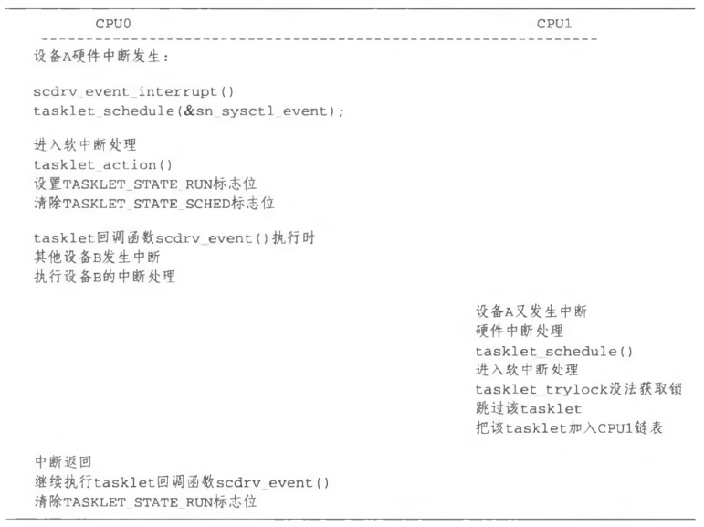
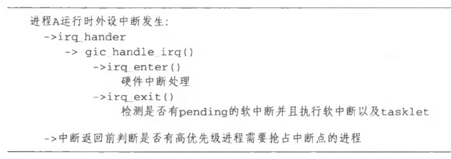
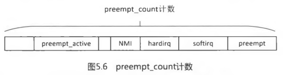

<!-- @import "[TOC]" {cmd="toc" depthFrom=1 depthTo=6 orderedList=false} -->

<!-- code_chunk_output -->

- [1. 概述](#1-概述)
- [2. SoftIRQ 软中断](#2-softirq-软中断)
  - [2.1. 软中断相关定义](#21-软中断相关定义)
    - [2.1.1. struct softirq_action](#211-struct-softirq_action)
    - [2.1.2. irq_cpustat_t](#212-irq_cpustat_t)
    - [2.1.3. 软中断的守护进程 ksoftirqd](#213-软中断的守护进程-ksoftirqd)
  - [2.2. 注册软中断](#22-注册软中断)
  - [2.3. 触发软中断](#23-触发软中断)
  - [2.4. 软中断的执行](#24-软中断的执行)
    - [2.4.1. 中断退出阶段执行软中断](#241-中断退出阶段执行软中断)
    - [2.4.2. 在 ksoftirqd 进程中执行](#242-在-ksoftirqd-进程中执行)
- [3. tasklet](#3-tasklet)
  - [3.1. tasklet_struct 结构体](#31-tasklet_struct-结构体)
  - [3.2. Per-CPU 的两个 tasklet 链表](#32-per-cpu-的两个-tasklet-链表)
  - [3.3. 初始化一个 tasklet](#33-初始化一个-tasklet)
  - [3.4. 调度 tasklet 的执行](#34-调度-tasklet-的执行)
  - [3.5. tasklet 的执行](#35-tasklet-的执行)
  - [3.6. tasklet 的使用方法](#36-tasklet-的使用方法)
- [4. local_bh_disable/local_bh\_enable](#4-local_bh_disablelocal_bh_enable)
  - [4.1. 关闭软中断的 BH 临界区](#41-关闭软中断的-bh-临界区)
  - [4.2. local_bh_disable 关闭软中断](#42-local_bh_disable-关闭软中断)
  - [4.3. local_bh_enable 打开软中断](#43-local_bh_enable-打开软中断)
- [5. 小结](#5-小结)
  - [5.1. SoftIRQ 软中断](#51-softirq-软中断)
  - [5.2. tasklet](#52-tasklet)
  - [5.3. local_bh_disable/local_bh_enable 下半部临界区](#53-local_bh_disablelocal_bh_enable-下半部临界区)
  - [5.4. 中断上下文](#54-中断上下文)

<!-- /code_chunk_output -->


在阅读本节前请思考如下小问题.

- 软中断的回调函数执行过程中是否允许响应本地中断?
- 同一类型的软中断是否允许多个 CPU 并行执行?
- 软中断上下文包括哪几种情况?
- 软中断上下文和进程上下文哪个优先级高?为什么?
- 是否允许同一个 Tasklet 在多个 CPU 上并行执行?

# 1. 概述

中断管理中有一个很重要的设计理念 — 上下半部机制(Top half and Bottom half). 第 1 节中介绍的硬件中断管理基本属于上半部的范畴, **中断线程化属于下半部的范畴(！！！**). 在**中断线程化机制**合并到 Linux 内核**之前(！！！**), 早己经有一些其他的**下半部机制**, 例如**软中断(SoftIRQ**)、**tasklet**和**工作队列(workqueue**) 等.

中断上半部有一个很重要的原则: **硬件中断处理程序**应该执行地**越快越好**. 也就是说, 希望它**尽快离开**并**从硬件中断返回**, 这么做的原因如下.

- **硬件中断处理程序**以**异步方式执行**, 它会**打断其他重要的代码**执行, 因此为了避免被打断的程序停止时间太长, 硬件中断处理程序**必须尽快执行完成**.
- **硬件中断处理程序**通常在**关中断的情况(！！！x86 下硬件会自动关！！！**)下执行. 所谓的关中断, 是指**关闭了本地 CPU 的所有中断响应(！！！**). 关中断之后, **本地 CPU 不能再响应中断**, 因此硬件中断处理程序必须尽快执行完成. 以 ARM 处理器为例, 中断发生时, ARM 处理器会自动关闭本地 CPU 的 IRQ/FIQ 中断, 直到从**中断处理程序退出(硬件中断处理程序, 即整个 irq\_handler, 对应到 ARM GIC 就是 gic\_handle\_irq**)时才打开本地中断, 这整个过程都处于关中断状态.

**上半部**通常是完成**整个中断处理任务**中的**一小部分**, 例如**响应中断**表明中断**己经被软件接收**, 简单的数据处理如**DMA 操作**, 以及硬件中断处理完成时发送 **EOI 信号**给**中断控制器**等, 这些工作**对时间比较敏感**. 此外中断处理任务还有一些**计算任务**, 例如数据复制、数据包封装和转发、计算时间比较长的数据处理等, 这些任务可以放到中断下半部来执行. Linux 内核并没有严格的规则约束究竟什么样的任务应该放到下半部来执行, 这要驱动开发者来决定. 中断任务的划分对系统性能会有比较大的影响.

那**下半部具体在什么时候执行**呢? 这个**没有确切的时间点**, 一般是从**硬件中断返回**后**某一个时间点内**会被执行. 下半部执行的关键点是允许响应所有的中断, 是一个**开中断的环境**.

# 2. SoftIRQ 软中断

软中断是 Linux 内核很早引入的机制, 最早可以追溯到 Linux 2.3 开发期间. **软中断**是预留给系统中**对时间要求最为严格和最重要的下半部(！！！**)使用的, 而且**目前驱动**中**只有块设备**和**网络子系统**使用了**软中断(！！！**).

## 2.1. 软中断相关定义

系统**静态定义**了**若干种软中断类型**, 并且 Linux 内核开发者**不希望用户再扩充新的软中断类型**, 如有需要, 建议使用 **tasklet 机制**. 己经定义好的软中断类型如下:

```cpp
// include/linux/interrupt.h
enum
{
	HI_SOFTIRQ=0,
	TIMER_SOFTIRQ,
	NET_TX_SOFTIRQ,
	NET_RX_SOFTIRQ,
	BLOCK_SOFTIRQ,
	BLOCK_IOPOLL_SOFTIRQ,
	TASKLET_SOFTIRQ,
	SCHED_SOFTIRQ,
	HRTIMER_SOFTIRQ,
	RCU_SOFTIRQ,    /* Preferable RCU should always be the last softirq */

	NR_SOFTIRQS
};
```

通过**枚举类型来静态声明软中断**, 并且每一种软中断都使用**索引**来表示一种相对的**优先级**, 索引号越小, 软中断优先级高, 并**在一轮软中断处理中**得到**优先执行**. 其中:

- `HI_SOFTIRQ`, 优先级为 0 , 是**最高优先级**的软中断类型.
- `TIMER_SOFTIRQ`, 优先级为 1, **Timer 定时器**的软中断.
- `NET_TX_SOFTIRQ`, 优先级为 2 , **发送网络数据包**的软中断.
- `NET_RX_SOFTIRQ`, 优先级为 3, **接收网络数据包**的软中断.
- `BLOCK_SOFTIRQ` 和 `BLOCK_IOPOLL_SOFTIRQ`, 优先级分别是 4 和 5, 用于**块设备的软中断**.
- TASKLET\_SOFTIRQ, 优先级为 6, 专门为 **tasklet 机制**准备的软中断.
- SCHED\_SOFTIRQ, 优先级为 7 , **进程调度**以及**负载均衡**.
- HRTIMER\_SOFTIRQ, 优先级为 8 , **高精度定时器**.
- RCU\_SOFTIRQ, 优先级为 9 , 专门为 **RCU 服务**的软中断.

### 2.1.1. struct softirq_action

此外系统还定义了一个用于**描述 softirq 软中断**的数据结构 `struct softirq_action`, 并且定义了**软中断描述符数组**`softirq_vec[]`, **类似硬件中断描述符**数据结构 `irq_desc[]`, **每个软中断类型对应一个描述符**, 其中**软中断的索引号**就是该数组的**索引**.

```cpp
// include/linux/interrupt.h
struct softirq_action
{
	void	(*action)(struct softirq_action *);
};

// kernel/softirq.c
static struct softirq_action softirq_vec[NR_SOFTIRQS] __cacheline_aligned_in_smp;
```

也就是**每个软中断类型**对应一个**描述符**, **静态定义**的. 可以将**softirq\_vec 认为是全局软中断 action 表(非 per CPU**), 而且是**系统初始化会创建好(也就是 action 会指定！！！**).

NR\_SOFTIRQS 是软中断枚举类型中表示系统**最大支持软中断类型的数量**. `__cacheline_aligned_in_smp` 用于将 softirq\_vec 数据结构和**L1 缓存行(cache line) 对齐**, 在第 1.12 节己经详细介绍过.

struct softirq\_action 数据结构比较简单, 只有一个**action 的函数指针**, 当**触发了该软中断**, 就会**调用 action 回调函数**来处理这个软中断.

### 2.1.2. irq_cpustat_t

此外还有一个**irq\_cpustat\_t**数据结构来**描述软中断状态信息**, 可以理解为"**软中断状态寄存器**", 该寄存器其实是一个**unsigned int 类型的变量\_\_softirq\_pending**.

同时也定义了一个`irq_stat[NR_CPUS]`数组**, 相当于**每个 CPU**有一个**软中断状态信息变量**, 可以理解为**每个 CPU**有一个"**软中断状态寄存器(！！！**)".

```c
[include/asm-generic/hardirq.h]
typedef struct {
	unsigned int __softirq_pending;
} ____cacheline_aligned irq_cpustat_t;

[kernel/softirq.c]
#ifndef __ARCH_IRQ_STAT
irq_cpustat_t irq_stat[NR_CPUS] ____cacheline_aligned;
EXPORT_SYMBOL(irq_stat);
#endif
```

### 2.1.3. 软中断的守护进程 ksoftirqd

在**cpu 的热插拔**阶段, 内核为**每个 cpu**创建了一个用于**执行软件中断**的**守护进程 ksoftirqd**, 同时定义了一个**per\_cpu 变量**用于**保存每个守护进程的 task\_struct**结构指针:

```c
DEFINE_PER_CPU(struct task_struct *, ksoftirqd);
```

大多数情况下, 软中断都会在`irq_exit`阶段被执行, 在**irq\_exit 阶段**没有处理完的软中断才有可能会在守护进程中执行.

## 2.2. 注册软中断

通过调用**open\_softirq**()函数接口可以**注册一个软中断**, 其中**参数 nr 是软中断的序号**.

```c
[kernel/softirq.c]
void open_softirq(int nr, void (*action)(struct softirq_action *))
{
	softirq_vec[nr].action = action;
}
```

注意, **softirq\_vec**[]是一个**多 CPU 共享的数组(！！！**), **软中断的初始化**通常是在**系统启动时完成(！！！每个软中断的 action 也是系统启动时初始化的！！！**), 系统启动时是**串行执行**的, 因此它们之间**不会产生冲突**, 所以这里没有额外的保护机制.

## 2.3. 触发软中断

总结:

(1) **raise\_softirq**()比**raise\_softirq\_irqoff**()唯一区别在于**前者主动关闭本地中断(CPU 硬件中断！！！**), 所以后者可以在进程上下文调用

(2) 设置**本地 CPU 的 irq\_stat**的第 nr 比特位

(3) 通过**in\_interrupt**判断是否在**中断上下文**, **不在的话(即在进程上下文**), 唤醒**软中断守护进程 ksoftirqd**, 在**守护进程中执行软中断**回调函数; 在**中断上下文(！！！**)的话, 软中断将在**当前中断退出阶段被执行**

raise\_softirq()函数是**主动触发一个软中断**的 API 接口函数.

```cpp
// kernel/softirq.c
void raise_softirq(unsigned int nr)
{
	unsigned long flags;

	local_irq_save(flags);
	raise_softirq_irqoff(nr);
	local_irq_restore(flags);
}
```

其实**触发软中断**有**两个 API 接口函数**, 分别是`raise_softirq()`和`raise_softirq_irqoff()`,唯一的**区别在于是否主动关闭本地中断(！！！**), 因此**raise\_softirq\_irqoff**()允许在**进程上下文(！！！)中调用**.

```cpp
// kernel/softirq.c
inline void raise_softirq_irqoff(unsigned int nr)
{
	__raise_softirq_irqoff(nr);

	if (!in_interrupt())
		wakeup_softirqd();
}
```

`__raise_softirq_irqoff()`函数实现如下:

```cpp
// include/linux/irq_cpustat.h
#define __IRQ_STAT(cpu, member)	(irq_stat[cpu].member)
#define local_softirq_pending() \
	__IRQ_STAT(smp_processor_id(), __softirq_pending)

// include/linux/interrupt.h
#define set_softirq_pending(x) (local_softirq_pending() = (x))
#define or_softirq_pending(x)  (local_softirq_pending() |= (x))

// kernel/softirq.c
void __raise_softirq_irqoff(unsigned int nr)
{
	or_softirq_pending(1UL << nr);
}
```

`__raise\_softirq\_irqoff()`函数会设置**本地 CPU 的 irq\_stat**数据结构中\_\_softirq\_pending 成员的**第 nr 个比特位**, nr 表示**软中断的序号**.

在**中断返回时(！！！**), 该 CPU 会检查\_\_**softirq\_pending 成员的比特位**, 如果\_\_**softirq\_pending 不为 0**, 说明**有 pending 的软中断需要处理**.

如果**触发点**发生在**中断上下文**, 只需要**设置本地 CPU \_\_softirq\_pending**中的**软中断对应比特位**即可. **in\_interrupt()为 0**, 说明现在运行在**进程上下文**中, 那么需要调用**wakeup\_softirqd**()唤醒**ksoftirqd 内核线程**来处理.

注意, **raise\_softirq**()函数修改的是**Per\-CPU 类型**的\_\_**softirq\_pending 变量**, 这里**不需要考虑多 CPU 并发**的情况, 因此不需要考虑使用 spinlock 等机制, **只考虑是否需要关闭本地中断(！！！**)即可. 可以根据**触发软中断场景**来考虑是使用 raise\_softirq(), 还是 raise\_softirq\_irqoff().

## 2.4. 软中断的执行

基于上面所说, **软中断的执行**既可以**守护进程**中执行, 也可以在**中断的退出阶段**执行. 实际上, 软中断**更多的是在中断的退出阶段执行**(irq\_exit), 以便达到更快的响应. 加入**守护进程机制**, 只是担心一旦有大量的软中断等待执行, 会使得内核**过长地留在中断上下文**中.

### 2.4.1. 中断退出阶段执行软中断

irq_exit()总结:

(1) 判断条件, **中断退出**时不能处于**中断上下文**(还有种情况, **中断点在软中断处理过程(不可能是硬件中断处理过程<因为硬件中断过程中 CPU 是关中断的>中**)中, **中断退出**时会返回到**软中断上下文<也是中断上下文**>, 也**不能重新调度软中断**, 因为**软中断在一个 CPU 总是串行执行！！！**); 本地 CPU 的 irq\_stat 上有**pending 等待的软中断**. 条件满足才会进行下面步骤.

(2) 调用软中断**invoke_softirq**()

(3) 获取本地 CPU 的软中断状态`irq_stat`

(4) 增加当前进程 struct thread\_info 中的 preempt\_count 成员里的 SOFTIRQ 域的值**SOFTIRQ\_OFFSET(！！！值是 2 的 8 次方, preempt\_count[8:15]表示软中断, 刚好将 bit[8]设为 1**), 表明在**软中断上下文**

(5) 清除软中断状态寄存器\_\_softirq\_pending, **清除所有**, 因为这里将**全部处理**

(6) **打开本地中断**, 允许**新的中断**以及**触发软中断**

(7) 循环处理软中断. 遍历**软中断状态 irq\_stat(每个 CPU 一个**), 每一个相当于软中断向量表 softirq\_vec\[\]的索引, 得到软中断然后执行

(8) **关闭本地中断**.

(9) 再次检查\_\_softirq\_pending, 看是否又产生软中断. 当又有软中断并且条件满足则回到步骤(5), 否则唤醒**ksoftirqd 内核线程**来处理软中断

(10) 减少当前进程 struct thread\_info 中的 preempt\_count 成员里的 SOFTIRQ 域的值, 表明离开软中断上下文

上节中在介绍**中断退出**时,  **irq\_exit**()函数会检查**当前是否有 pending 等待的软中断(！！！**).

```cpp
// 中断发生->irq_handler-> gic_handle_irq() ->handle_domain_irq() ->irq_exit()

// kernel/softirq.c
void irq_exit(void)
{
    ...
	if (!in_interrupt() && local_softirq_pending())
	    // 重要
		invoke_softirq();
    ...
}
```

`local_softirq_pending()`函数检查**本地 CPU**的 `__softirq_pending` 是否有**pending 等待的软中断**. 注意, 这里还有一个判断条件为`!in_terrupt()`, 也就是说, **中断退出**时**不能处于硬件中断上下文**(Hardirq context)和**软中断上下文(Softirq context**)中. **硬件中断处理过程**一般都是**关中断**的, **中断退出时**也就**退出了硬件中断上下文**, 因此该条件会满足. 还有一个场景, 如果**本次中断点**发生在一个**软中断处理过程**中, 那么**中断退出**时会**返回到软中断上下文<也是中断上下文**>中, 因此这种情况**不允许重新调度软中断**, 因为**软中断**在**一个 CPU**上总是**串行执行(！！！**)的.

`invoke_softirq()` 继续查看.

```cpp
// irq_exit() -> invoke_softirq() -> __do_softirq()
// kernel/softirq.c
asmlinkage __visible void __do_softirq(void)
{
	unsigned long end = jiffies + MAX_SOFTIRQ_TIME;
	unsigned long old_flags = current->flags;
	int max_restart = MAX_SOFTIRQ_RESTART;
	struct softirq_action *h;
	bool in_hardirq;
	__u32 pending;
	int softirq_bit;
    // 位置 1
	current->flags &= ~PF_MEMALLOC;
    // 位置 2
	pending = local_softirq_pending();
	// 位置 3
	__local_bh_disable_ip(_RET_IP_, SOFTIRQ_OFFSET);

restart:
	/* Reset the pending bitmask before enabling irqs */
	// 位置 4
	set_softirq_pending(0);
    // 位置 5
	local_irq_enable();

	h = softirq_vec;
    // 位置 6
	while ((softirq_bit = ffs(pending))) {
		unsigned int vec_nr;
		int prev_count;

		h += softirq_bit - 1;

		vec_nr = h - softirq_vec;
		prev_count = preempt_count();

		h->action(h);
		h++;
		pending >>= softirq_bit;
	}
    // 位置 7
	local_irq_disable();
    // 位置 8
	pending = local_softirq_pending();
	if (pending) {
		if (time_before(jiffies, end) && !need_resched() &&
		    --max_restart)
			goto restart;

		wakeup_softirqd();
	}
    // 位置 9
	__local_bh_enable(SOFTIRQ_OFFSET);
	// 位置 10
	tsk_restore_flags(current, old_flags, PF_MEMALLOC);
}
```

位置 1 和位置 10 是**配对使用**的. **PF\_MEMALLOC**目前主要用在**两个地方**, 一是**直接内存压缩(direct compaction)的内核路径**, 二是**网络子系统**在**分配 skbuff 失败**时会设置 PF\_MEMALLOC 标志位, 这是在 Linux 3.6 内核中, 社区专家 Mel Gorman 为了解决**网络磁盘设备**(network Block Device, NBD)使用**交换分区**时出现**死锁**的问题而引入的, 己经超出本章的讨论范围.

位置 2, 获取**本地 CPU(！！！**)的**软中断寄存器\_\_softirq_pending**的值到局部变量 pending.

位置 3, 增加**preempt\_count**中的**SOFTIRQ 域的计数**, 表明现在是在**软中断上下文**中, 由此禁止了软中断, 主要为了防止和软中断守护进程发生竞争; **加的值是 2 的 8 次方, preempt\_count[8:15]表示软中断, 刚好将 bit[8]设为 1**.

位置 4, 清除**软中断寄存器\_\_softirq\_pending**, 将所有都清除了.

位置 5, **打开本地中断**. 这里**先清除\_\_softirq\_pending**位图, 然后再**打开本地中断**. 需要注意这里和位置 4 之间的顺序, 读者可以思考如果在位置 4 之前打开本地中断会有什么后果.

位置 6, **while 循环依次处理软中断**. 首先**ffs**()函数会找到**pending 中第一个置位的比特位**, 然后找到**对应的软中断描述符**和**软中断的序号**, 最后**调用 action**()函数指针来**执行软中断**处理, 依次循环直到**所有软中断都处理完成**.

位置 7, **关闭本地中断**.

位置 8 到位置 9, **再次检查\_\_softirq\_pending 是否又产生了软中断**. 因为**软中断执行过程**是**开中断**的, 有可能在这个过程中又发生了中断以及触发了软中断, 即有人**调用了 raise\_softirq**(). 注意, **不是检测到有软中断**就**马上调转到 restart 标签处**进行软中断处理, 这里需要一个**系统平衡的考虑**. 需要考虑**3 个判断条件**, 一是**软中断处理时间没有超过 2 毫秒**, 二是**当前没有进程要求调度**, 即!need\_resched(),三是**这种循环不能多于 10 次**, 否则应该**唤醒 ksoftirqd 内核线程**来处理软中断.

位置 9, 代码和位置 3 代码是配对使用, 恢复软中断, 表示现在**离开软中断上下文**了.

### 2.4.2. 在 ksoftirqd 进程中执行

软中断也可能由**ksoftirqd 守护进程执行**, 这要发生在以下两种情况下:

- 在**irq\_exit 中执行软中断**, 但是在经过**MAX\_SOFTIRQ\_RESTART 次(目前设定为 10**)循环后, **软中断还未处理完**, 这种情况虽然极少发生, 但毕竟有可能;
- 内核的其它代码**主动调用 raise\_softirq**, 而这时正好**不是在中断上下文中(！！！**), 守护进程将被唤醒;

守护进程最终也会调用\_\_**do\_softirq**执行软中断的回调, 具体的代码位于**run\_ksoftirqd**函数中, 内核会**关闭抢占**的情况下执行\_\_do\_softirq, 具体的过程这里不做讨论.

# 3. tasklet

tasklet 是利用**软中断**实现的一种下半部机制, 本质上是**软中断的一个变种**, 运行在**软中断上下文(！！！**)中.

## 3.1. tasklet_struct 结构体

tasklet 由 `tasklet_struct` 数据结构来描述:

```c
[include/linux/interrupt.h]
struct tasklet_struct
{
	struct tasklet_struct *next;
	unsigned long state;
	atomic_t count;
	void (*func)(unsigned long);
	unsigned long data;
};


enum
{
	TASKLET_STATE_SCHED,	/* Tasklet is scheduled for execution */
	TASKLET_STATE_RUN	/* Tasklet is running (SMP only) */
};
```

- next: **多个 tasklet**串成一个**链表**.
- state: 该**tasklet 当前状态**. TASKLET\_STATE\_SCHED 表示 tasklet**己经被调度, 正准备运行**. TASKLET\_STATE\_RUN 表示 tasklet**正在运行**中.
- count: 为**0**表示 tasklet 处于**激活状态**; **不为 0**表示该**tasklet 被禁止**, **不允许执行**. 原子变量 count 用于 tasklet 对 tasklet\_disable 和 tasklet\_enable 的计数, count 为 0 时表示允许 tasklet 执行, 否则不允许执行, 每次 tasklet\_disable 时, 该值加 1, tasklet\_enable 时该值减 1
- func: **tasklet 处理程序**, 类似软中断中的**action 函数指针**.
- data: 传递**参数**给 tasklet 处理函数.

## 3.2. Per-CPU 的两个 tasklet 链表

**每个 CPU(实际上是每个 logical processor, 即每个 cpu thread)**维护**两个 tasklet 链表**, 一个用于**普通优先级的 tasklet\_vec**, 另一个用于**高优先级的 tasklet\_hi\_vec**, 它们都是**Per\-CPU 变量(！！！**). 链表中**每个 tasklet\_struct**代表一个**tasklet**.

```c
[kernel/softirq.c]
struct tasklet_head {
	struct tasklet_struct *head;
	struct tasklet_struct **tail;
};

static DEFINE_PER_CPU(struct tasklet_head, tasklet_vec);
static DEFINE_PER_CPU(struct tasklet_head, tasklet_hi_vec);
```

其中, **tasklet\_vec**使用**软中断**中的**TASKLET\_SOFTIRQ**类型, 它的**优先级是 6**; 而**tasklet\_hi\_vec**使用的**软中断**中的**HI\_SOFTIRQ**, **优先级是 0**, 是**所有软中断**中**优先级最高**的.

在**系统启动(！！！**)时会**初始化这两个链表**, 见**softirq\_init**()函数, 另外还会**注册 TASKLET\_SOFTIRQ**和**HI\_SOFTIRQ**这**两个软中断(！！！**), 它们的**软中断回调函数**分别为**tasklet\_action**和**tasklet\_hi\_action**. 高优先级的**tasklet\_hi**在**网络驱动**中用得比较多, 它和普通的 tasklet 实现机制相同, 本文以**普通 tasklet 为例**.

```c
[start_kernel()->softirq_init()]
[kernel/softirq.c]
void __init softirq_init(void)
{
	int cpu;

	for_each_possible_cpu(cpu) {
		per_cpu(tasklet_vec, cpu).tail =
			&per_cpu(tasklet_vec, cpu).head;
		per_cpu(tasklet_hi_vec, cpu).tail =
			&per_cpu(tasklet_hi_vec, cpu).head;
	}

	open_softirq(TASKLET_SOFTIRQ, tasklet_action);
	open_softirq(HI_SOFTIRQ, tasklet_hi_action);
}
```

## 3.3. 初始化一个 tasklet

要想在**驱动**中使用**tasklet**, 首先**定义一个 tasklet**, 可以**静态申明**,  也可以**动态初始化**.

```c
[include/linux/interrupt.h]
#define DECLARE_TASKLET(name, func, data) \
struct tasklet_struct name = { NULL, 0, ATOMIC_INIT(0), func, data }

#define DECLARE_TASKLET_DISABLED(name, func, data) \
struct tasklet_struct name = { NULL, 0, ATOMIC_INIT(1), func, data }
```

上述**两个宏**都是**静态**地申明一个**tasklet 数据结构**. 上述两个宏的**唯一区别**在于**count 成员**的初始化值不同, DECLARE\_TASKLET 宏把**count 初始化为 0**, 表示**tasklet 处于激活状态**; 而 DECLARE\_TASKLET\_DISABLED 宏把**count 成员初始化为 1** , 表示**该 tasklet 处于关闭状态**.

当然也可以在**驱动代码**中调用**tasklet\_init**()函数**动态初始化 tasklet**, 该方法**默认 tasklet 处于 enable 状态**.

```c
[kernel/softirq.c]
void tasklet_init(struct tasklet_struct *t,
		  void (*func)(unsigned long), unsigned long data)
{
	t->next = NULL;
	t->state = 0;
	atomic_set(&t->count, 0);
	t->func = func;
	t->data = data;
}
EXPORT_SYMBOL(tasklet_init);
```

## 3.4. 调度 tasklet 的执行

总结:

(1) 设置 tasklet\_struct\-\>state 成员为 TASKLET\_STATE\_SCHED 标志位

(2) tasklet 的 state 原来是 TASKLET\_STATE\_SCHED, 表明在链表, 直接退出; 否则, 那么将**tasklet**挂载到**tasklet\_vec**或者**tasklet\_hi\_vec 链表**, 然后**raise\_softirq\_irqoff**(**进程上下文**的话唤醒**ksoftirqd 守护进程**, 中断上下文什么都不做, 软中断将在中断退出阶段被执行)

在**驱动程序**中调度 tasklet 可以使用**tasklet\_schedule**()函数.

```c
[include/linux/interrupt.h]
static inline void tasklet_schedule(struct tasklet_struct *t)
{
	if (!test_and_set_bit(TASKLET_STATE_SCHED, &t->state))
		__tasklet_schedule(t);
}
```

**test\_and\_set\_bit**()函数**原子**地设置**tasklet\_struct\->state**成员为**TASKLET\_STATE\_SCHED**标志位, 然后**返回该 state 旧的值**. 返回**true**, 说明**该 tasklet 己经被挂入到 tasklet 链表**中; 返回**false**, 则**需要调用\_\_tasklet\_schedule**()把**该 tasklet 挂入链表**中.

```c
[kernel/softirq.c]
void __tasklet_schedule(struct tasklet_struct *t)
{
	unsigned long flags;

	local_irq_save(flags);
	t->next = NULL;
	*__this_cpu_read(tasklet_vec.tail) = t;
	__this_cpu_write(tasklet_vec.tail, &(t->next));
	raise_softirq_irqoff(TASKLET_SOFTIRQ);
	local_irq_restore(flags);
}
EXPORT_SYMBOL(__tasklet_schedule);
```

\_\_tasklet\_schedule()函数比较简单, 在**关闭中断**的情况下, 把**tasklet**挂入到**tasklet\_vec 链表**中, 然后再触发一个**TASKLET\_SOFTIRQ 类型的软中断**.

那**什么时候执行 tasklet**呢?是在驱动调用了 tasklet\_schedule()后马上就执行吗?

其实不是的, **tasklet 是基于软中断机制**的, 因此 tasklet\_schedule()后不会马上执行, 要**等到软中断被执行时才有机会运行 tasklet(！！！**), tasklet 挂入**哪个 CPU**的**tasklet\_vec 链表**, 那么就由**该 CPU 的软中断来执行**. 在分析 tasklet\_schedule()时己经看到, 一个 tasklet 挂入到一个 CPU 的 tasklet\_vec 链表后会**设置 TASKLET\_STATE\_SCHED 标志位**, 只要该 tasklet 还没有执行, 那么即使驱动程序多次调用 tasklet\_schedule()也不起作用. 因此一旦**该 tasklet 挂入到某个 CPU 的 tasklet\_vec 链表(！！！**)后, 它就**必须在该 CPU 的软中断上下文中执行(！！！**), 直到执行完毕并清除了 TASKLET\_STATE\_SCHED 标志位后, 才有机会到其他 CPU 上运行.

## 3.5. tasklet 的执行

总结:

(1) 基于软中断机制, 软中断执行时, 循环到**TASKLET\_SOFTIRQ 类型软中断**, 回调函数**tasklet\_action**()执行

(2) 关闭本地中断的前提下, 移出当前 cpu 的待处理 tasklet 链表到一个临时链表后, 清除当前 cpu 的 tasklet 链表, 之所以这样处理, 是为了处理当前 tasklet 链表的时候, 允许新的 tasklet 被调度进待处理链表中.

(3) 遍历临时链表, 用 tasklet_trylock 判断当前 tasklet 是否已经在其他 cpu 上运行, 而且 tasklet 没有被禁止:

- 如果没有运行, 也没有禁止, 则清除 TASKLET\_STATE\_SCHED 状态位, 执行 tasklet 的回调函数.
- 如果已经在运行, 或者被禁止, 则把该 tasklet 重新添加会当前 cpu 的待处理 tasklet 链表上, 然后触发 TASKLET_SOFTIRQ 软中断, 等待下一次软中断时再次执行.

**软中断执行时**会按照**软中断状态\_\_softirq\_pending**来依次执行**pending 状态的软中断**, 当轮到执行**TASKLET\_SOFTIRQ 类型软中断**时, 回调函数**tasklet\_action**()会被调用.

```c
[软中断执行 -> tasklet_action()]
[kernel/softirq.c]
static void tasklet_action(struct softirq_action *a)
{
	struct tasklet_struct *list;
    // 位置 1
	local_irq_disable();
	list = __this_cpu_read(tasklet_vec.head);
	__this_cpu_write(tasklet_vec.head, NULL);
	__this_cpu_write(tasklet_vec.tail, this_cpu_ptr(&tasklet_vec.head));
	// 位置 2
	local_irq_enable();
    // 位置 3
	while (list) {
		struct tasklet_struct *t = list;

		list = list->next;
        // 位置 4
		if (tasklet_trylock(t)) {
		    // 位置 5
			if (!atomic_read(&t->count)) {
			    // 位置 6
				if (!test_and_clear_bit(TASKLET_STATE_SCHED,
							&t->state))
					BUG();
				t->func(t->data);
				// 位置 7
				tasklet_unlock(t);
				continue;
			}
			tasklet_unlock(t);
		}
        // 位置 8
		local_irq_disable();
		t->next = NULL;
		*__this_cpu_read(tasklet_vec.tail) = t;
		__this_cpu_write(tasklet_vec.tail, &(t->next));
		__raise_softirq_irqoff(TASKLET_SOFTIRQ);
		local_irq_enable();
		// 位置 9
	}
}
```

位置 1 到位置 3, 在**关中断的情况下(！！！**)读取**tasklet\_vec 链表头**到临时链表 list 中, 并重新初始化 tasklet\_vec 链表. 注意, tasklet\_vec.tail 指向链表头 tasklet\_vec.head 指针本身的地址.

位置 3, **while 循环**依次执行**tasklet\_vec 链表**中**所有的 tasklet 成员**. 注意位置 2 和位置 8, **整个 tasklet 的执行过程是在开中断的**.

位置 4, tasklet\_trylock()函数设计成一个锁. 如果 tasklet 己经处于 RUNNING 状态, 即被设置了 TASKLET\_STATE\_RUN 标志位, tasklet\_trylock()函数返回 false, 表示不能成功获取该锁, 那么直接跳转到位置 8 处, 这一轮的 tasklet 将会跳过该 tasklet. 这样做的目的是为了保证同一个 tasklet 只能在一个 CPU 上运行, 稍后以 scdrv 驱动程序为例讲解这种特殊的情况.

```c
[include/linux/interrupt.h]
static inline int tasklet_trylock(struct tasklet_struct *t)
{
	return !test_and_set_bit(TASKLET_STATE_RUN, &(t)->state);
}
```

位置 5, 原子地检查 count 计数是否为 0, 为 0 则表示这个 tasklet 处于可执行状态. 注意, tasklet\_disable()可能随时会原子地增加 count 计数, count 计数大于 0, 表示 tasklet 处于禁止状态. 位置 5 原子地读完 count 计数后可能马上被另外的内核代码执行路径调用 tasklet\_disable()修改了 count 计数, 但这只会影响 tasklet 的下一次处理.

位置 6 到位置 7 之间, 注意顺序是先清 TASKLET\_STATE\_SCHED 标志位, 然后执行 t\-func(), 最后才清 TASKLET\_STATE\_RUN 标志位. 为什么不执行完 func()再清 TASKLET\_STATE\_SCHED 标志位呢?这是为了在执行 func()期间也可以响应新调度的 tasklet, 以免丢失.

位置 8 到位置 9 之间, 处理该 tasklet 己经在其他 CPU 上执行的情况, tasklet\_trylock()返回 false, 表示获取锁失败. 这种情况下会把该 tasklet 重新挂入当前 CPU 的 tasklet\_vec 链表中, 等待下一次触发 TASKLET\_SOFTIRQ 类型软中断时才会被执行. 还有一种情况是在之前调用 tasklet\_disable()增加了 tasklet\_struct\->count 计数, 那么本轮的 tasklet 处理也将会被略过.

为何会出现位置 8 到位置 9 情况呢? 即将要执行 tasklet 时发现该 tasklet 己经在别的 CPU 上运行.

以常见的一个**设备驱动**为例, 在硬件中断处理函数中调用 tasklet\_schedule()函数去触发 tasklet 来处理一些数据, 例如数据复制、数据转换等. 以 drivers/char/snsc\_event.c 驱动为例, 假设该设备为设备 A:

```c
[drivers/char/snsc_event.c]
static irqreturn_t
scdrv_event_interrupt(int irq, void *subch_data)
{
	struct subch_data_s *sd = subch_data;
	unsigned long flags;
	int status;

	spin_lock_irqsave(&sd->sd_rlock, flags);
	status = ia64_sn_irtr_intr(sd->sd_nasid, sd->sd_subch);

	if ((status > 0) && (status & SAL_IROUTER_INTR_RECV)) {
		tasklet_schedule(&sn_sysctl_event);
	}
	spin_unlock_irqrestore(&sd->sd_rlock, flags);
	return IRQ_HANDLED;
}
```

硬件中断处理程序 scdrv\_event\_interrupt()读取中断状态寄存器确认中断发生, 然后调用 tasklet\_schedule()函数执行下半部操作, 该 tasklet 回调函数是 scdrv\_event()函数. 假设 CPU0 在执行设备 A 的 tasklet 下半部操作时, 设备 B 产生了中断, 那么 CPU0 暂停 tasklet 处理, 转去执行设备 B 的硬件中断处理. 这时设备 A 又产生了中断, 中断管理器把该中断派发给 CPU1. 假设 CPU1 很快处理完硬件中断并开始处理该 tasklet, 在 tasklet\_schedule()函数中发现并没有设置 TASKLET\_STATE\_SCHED 标志位, 因为 CPUO 在执行 tasklet 回调函数之前已经把该标志位清除了, 因此该 tasklet 被加入到 CPU1 的 tasklet\_vec 链表中, 当执行到 tasklet\_action()函数的 tasklet\_trylock(t)时会发现无法获取该锁, 因为该 tasklet 己经被 CPU0 设置了 TASKLET\_STATE\_RUN 标志位, 因此 CPU1 便跳过了这次 tasklet, 等到 CPU0 中断返回把 TASKLET\_STATE\_RUN 标志位清除后, CPU1 下一轮软中断执行时才会再继续执行该 tasklet.



## 3.6. tasklet 的使用方法

**使能和禁止 tasklet**, 使用以下函数:

- tasklet\_disable() 通过给 count 字段加 1 来禁止一个 tasklet, 如果 tasklet 正在运行中, 则等待运行完毕才返回(通过 TASKLET\_STATE\_RUN 标志).
- tasklet\_disable\_nosync() tasklet\_disable 的异步版本, 它不会等待 tasklet 运行完毕.
- tasklet\_enable() 使能 tasklet, 只是简单地给 count 字段减 1.

**调度 tasklet 的执行**, 使用以下函数:

- tasklet\_schedule(struct tasklet\_struct *t) 如果 TASKLET\_STATE\_SCHED 标志为 0, 则置位 TASKLET\_STATE\_SCHED, 然后把 tasklet 挂到该 cpu 等待执行的 tasklet 链表上, 接着发出 TASKLET\_SOFTIRQ 软件中断请求.
- tasklet\_hi\_schedule(struct tasklet\_struct *t) 效果同上, 区别是它发出的是 HI\_SOFTIRQ 软件中断请求.

销毁 tasklet, 使用以下函数:

- tasklet\_kill(struct tasklet\_struct *t) 如果 tasklet 处于 TASKLET\_STATE\_SCHED 状态, 或者 tasklet 正在执行, 则会等待 tasklet 执行完毕, 然后清除 TASKLET\_STATE\_SCHED 状态.

# 4. local_bh_disable/local_bh\_enable

## 4.1. 关闭软中断的 BH 临界区

local\_bh\_disable()和 local\_bh\_enable()是内核中提供的**关闭软中断**的**锁机制**, 它们组成的临界区**禁止本地 CPU 在中断返回前夕执行软中断**, 这个临界区简称**BH 临界区(bottom half critical region**).

## 4.2. local_bh_disable 关闭软中断

总结: 将当前进程的 preempt\_count 加上 SOFTIRQ\_DISABLE\_OFFSET, 表明进入了**软中断上下文**

```c
[include/linux/bottom_half.h]
static inline void local_bh_disable(void)
{
	__local_bh_disable_ip(_THIS_IP_, SOFTIRQ_DISABLE_OFFSET);
}
static __always_inline void __local_bh_disable_ip(unsigned long ip, unsigned int cnt)
{
	preempt_count_add(cnt);
	barrier();
}

[include/linux/preempt_mask.h]
#define SOFTIRQ_BITS	8
#define PREEMPT_SHIFT	0
#define SOFTIRQ_SHIFT	(PREEMPT_SHIFT + PREEMPT_BITS)
#define SOFTIRQ_OFFSET	(1UL << SOFTIRQ_SHIFT) // 等价于 1UL <<8
#define SOFTIRQ_DISABLE_OFFSET	(2 * SOFTIRQ_OFFSET)
```

local\_bh\_disable()的实现比较简单, 就是把**当前进程的 preempt\_count**成员**加上 SOFTIRQ\_DISABLE\_OFFSET**, 那么现在**内核状态进入了软中断上下文(softirq context**). 这里有 barrier()操作以防止编译器做了优化, thread\_info\->preempt\_count 相当于 Per\-CPU 变量, 因此不需要使用内存屏障指令.

注意, **preempt\_count 成员**的**bit[8:15**]比特位都是用于表示**软中断**的, 但是**一般情况**下使用**第 8 比特位！！！**即可, **该域**还用于表示**软中断嵌套的深度**, 最多表示 255 次嵌套, 这也是 SOFTIRQ\_DISABLE\_OFFSET 会定义成(2 \* SOFTIRQ\_OFFSET)的原因. 该值为 512, 2 的 9 次方, 参考 preempt\_count 结构, bit[8:15]表示软中断, 该域还表示软中断嵌套深度, 所以 9 次方, bit[9]是 1, 在软中断这里是 2, 说明是**两层嵌套(！！！**)

这样当在**local\_bh\_disable**()和**local\_bh\_enable**()构成的**BH 临界区内发生了中断**, **中断返回前 irq\_exit**()判断当前处于**软中断上下文**, 因而**不能调用和执行 pending 状态的软中断**, 这样驱动代码构造的 BH 临界区中就**不会有新的软中断来骚扰(！！！**).

## 4.3. local_bh_enable 打开软中断

总结: 执行**软中断**, 然后打开抢占

```c
[include/linux/bottom_half.h]
static inline void local_bh_enable_ip(unsigned long ip)
{
	__local_bh_enable_ip(ip, SOFTIRQ_DISABLE_OFFSET);
}

static inline void local_bh_enable(void)
{
	__local_bh_enable_ip(_THIS_IP_, SOFTIRQ_DISABLE_OFFSET);
}

void __local_bh_enable_ip(unsigned long ip, unsigned int cnt)
{
    // 位置 1
	WARN_ON_ONCE(in_irq() || irqs_disabled());

	/*
	 * Keep preemption disabled until we are done with
	 * softirq processing:
	 */
	// 位置 2
	preempt_count_sub(cnt - 1);
    // 位置 3
	if (unlikely(!in_interrupt() && local_softirq_pending())) {
		do_softirq();
	}
    // 位置 4
	preempt_count_dec();
	// 位置 5
	preempt_check_resched();
}
EXPORT_SYMBOL(__local_bh_enable_ip);
```

位置 1 有两个警告的条件, WARN\_ON\_ONCE()是一个比较弱的警告语句. **in\_irq**()返回 true, 表示现在正在**硬件中断上下文**中. 有些不规范的驱动, 可能会在硬件中断处理函数 primary handler 中调用 local\_bh\_disable()/local\_bh\_enable(), 其实**硬件中断处理函数 primary handler 是在关中断环境(CPU 自动关闭的本地中断！！！！)下执行**的, 关中断是比关 BH 更猛烈的一种锁机制. 因此在**关中断情况**下, **没有必要在调用关 BH**相关操作. irqs\_disabled()返回 true, 说明现在处于**关中断状态**, 也**不适合调用关 BH**操作, 原理和前者一样.

位置 2, preempt\_count 计数减去(SOFTIRQ\_DISABLE\_OFFSET \- l), 这里并没有完全减去 SOFTIRQ\_DISABLE\_OFFSET, 为什么还留了 1 呢?**留 1 表示关闭本地 CPU 的抢占**, 接下来**调用 do\_softirq**()时**不希望被其他高优先级任务抢占**了或者**当前任务被迁移到其他 CPU**上.

假如**当前进程 P 运行在 CPU0**上, 在**位置 3**时发生了**中断**, **中断返回前**被**高优先级任务抢占**, 那么进程 P 再被调度时有可能会选择在其他 CPU 上唤醒(见 select\_task\_rq\_fair()函数), 例如 CPU1, "**软中断的状态寄存器**" \_\_**softirq\_pending**是 Per\-CPU 变量, 进程 P 在 CPU1 上重新运行到位置 3 代码时发现\_\_softirq\_pending 并没有软中断触发, 因此**之前的软中断会被延迟执行(！！！**).

位置 3, 在**非中断上下文(！！！**)环境下**执行软中断处理**.

位置 4, 打开抢占

位置 5, 之前执行软中断处理时可能会漏掉一些高优先级任务的抢占需求, 这里重新检查.

总之, local\_bh\_disable()/local\_bh\_enable()是关 BH 的接口 API, 运行在**进程上下文**中, 内核中**网络子系统有大量使用**该接口的例子.

# 5. 小结

中断线程化属于下半部范畴, 这个机制合并前, 已经有了下半部机制, 例如**软中断**, **tasklet**和**工作队列**.

## 5.1. SoftIRQ 软中断

对时间要求最严格和最重要的下半部, 目前驱动只有块设备和网络子系统在使用.

**软中断**是 Linux 内核中最常见的一种**下半部机制**, 适合系统对**性能和实时响应要求很高**的场合, 例如**网络子系统**、**块设备**、**高精度定时器**、**RCU**等.

- **软中断**类型是**静态定义**的, Linux 内核**不希望**驱动开发者**新增软中断类型**.
- 软中断的**回调函数**在**开中断环境下**执行.
- **同一类型的软中断**可以在**多个 CPU**上并行执行. 以**TASKLET\_SOFTIRQ**类型的软中断为例, 多个 CPU 可以同时 tasklet\_schedule, 并且多个 CPU 也可能同时从中断处理返回, 然后同时触发和执行 TASKLET\_SOFTIRQ 类型的软中断.
- 假如有驱动开发者要新增一个软中断类型, 那软中断的处理函数需要考虑同步问题.
- 软中断的**回调函数不能睡眠**.
- 软中断的**执行时间点**是在**中断返回前**, 即**退出硬中断上下文**时, 首先检查**是否有 pending 的软中断**, 然后才检查**是否需要抢占当前进程**. 因此, **软中断上下文总是抢占进程上下文(！！！**).

10 种静态定义的软中断类型, 通过枚举实现, 索引号越小, 软中断优先级越高

描述软中断 softirq\_action, 一个**全局软中断描述符数组**, 每种软中断一个

```c
[include/linux/interrupt.h]
struct softirq_action
{
	void	(*action)(struct softirq_action *);
};

[kernel/softirq.c]
static struct softirq_action softirq_vec[NR_SOFTIRQS] __cacheline_aligned_in_smp;
```

每个 CPU 定义一个软中断状态信息 irq\_cpustat\_t

```c
[include/asm-generic/hardirq.h]
typedef struct {
	unsigned int __softirq_pending;
} ____cacheline_aligned irq_cpustat_t;

[kernel/softirq.c]
#ifndef __ARCH_IRQ_STAT
irq_cpustat_t irq_stat[NR_CPUS] ____cacheline_aligned;
EXPORT_SYMBOL(irq_stat);
#endif
```

每个 CPU 有一个执行软中断的守护进程 ksoftirqd(Per\-CPU 变量)

注册软中断: 在全局的软中断描述符数组中, 指定相应软中断的 action. open\_softirq()

触发软中断: 将本地 CPU 的软中断状态信息 irq\_stat 中相应软中断位置为 1, 如果不在中断上下文, 唤醒软中断守护进程 ksoftirqd, 中断上下文, 退出. raise\_softirq()和 raise\_softirq\_irqoff(), 前面主动关闭本地中断, 所以后者允许进程上下文调用

软中断的执行:

(1) 中断退出阶段执行(irq\_exit()): 在**非中断上下文(!interrupt()**), 以及有**pending**情况下才继续.

\_\_**do\_softirq**():

获取本地 CPU 的软中断状态 irq\_stat, 增加当前进程 struct thread\_info 中的 preempt\_count 成员里的 SOFTIRQ 域的值**SOFTIRQ\_OFFSET(！！！加的值是 2 的 8 次方, preempt\_count[8:15]表示软中断, 刚好将 bit[8]设为 1**), 表明在软中断上下文; 清除本地 CPU 的所有软中断状态, 因为会一次全部处理; 循环处理软中断, 从索引小的开始, 调用 action()函数指针; 如果又有新软中断, 软中断处理时间没超过 2 毫秒并且没有进程要求调度, 则再处理一次软中断, 否则唤醒 ksoftirqd 处理 ;退出软中断上下文

中断退出**不能**处于**硬件中断上下文**和**软中断上下文**. 硬中断处理过程一般是关中断的, 中断退出也就退出了硬件中断上下文, 这里肯定会满足; 另一个场景, 本次**中断点**发生在**软中断过程中**, 那中断退出会返回到软中断上下文, 这时候不允许重新调度软中断. 因为软中断在一个 CPU 上总是串行执行.

(2) ksoftirqd(两个来源\<irq\_exit()\>和主动): 和上面动作类似

## 5.2. tasklet

**tasklet**是基于**软中断**的一种下半部机制, 所以还是运行在软中断上下文.

- tasklet 可以**静态定义**, 也可以**动态初始化**.
- tasklet 是**串行执行**的. 一个**tasklet**在**tasklet\_schedule**()时会绑定某个 CPU 的**tasklet\_vec 链表**, 它必须要在该 CPU 上**执行完 tasklet 的回调函数**才会和该 CPU**松绑**.
- **TASKLET\_STATE\_SCHED**和**TASKLET\_STATE\_RUN 标志位**巧妙地构成了**串行执行**.
- 同一个 tasklet 只能同时在一个 cpu 上执行, 但不同的 tasklet 可以同时在不同的 cpu 上执行;
- 一旦 tasklet\_schedule 被调用, 内核会保证 tasklet 一定会在某个 cpu 上执行一次;
- 如果 tasklet\_schedule 被调用时, tasklet 不是出于正在执行状态, 则它只会执行一次;
- 如果 tasklet\_schedule 被调用时, tasklet 已经正在执行, 则它会在稍后被调度再次被执行;
- 两个 tasklet 之间如果有资源冲突, 应该要用自旋锁进行同步保护;

tasklet\_struct 数据结构:

```c
[include/linux/interrupt.h]
struct tasklet_struct
{
    //多个 tasklet 串成一个链表
	struct tasklet_struct *next;
	// 该 tasklet 当前状态.
	unsigned long state;
	// 为 0 表示 tasklet 处于激活状态; 不为 0 表示该 tasklet 被禁止, 不允许执行
	atomic_t count;
	// tasklet 处理程序, 类似软中断中的 action 函数指针.
	void (*func)(unsigned long);
	// 传递参数给 tasklet 处理函数
	unsigned long data;
};


enum
{
    // 表示 tasklet 己经被调度, 正准备运行
	TASKLET_STATE_SCHED,	/* Tasklet is scheduled for execution */
	// 表示 tasklet 正在运行中
	TASKLET_STATE_RUN	/* Tasklet is running (SMP only) */
};
```

每个 CPU(实际上是每个 logical processor, 即每个 cpu thread)维护两个 tasklet 链表, 一个用于普通优先级的 tasklet\_vec, 另一个用于高优先级的 tasklet\_hi\_vec, 它们都是 Per-CPU 变量(！！！). 链表中每个 tasklet\_struct 代表一个 tasklet.

```c
[kernel/softirq.c]
struct tasklet_head {
	struct tasklet_struct *head;
	struct tasklet_struct **tail;
};

static DEFINE_PER_CPU(struct tasklet_head, tasklet_vec);
static DEFINE_PER_CPU(struct tasklet_head, tasklet_hi_vec);
```

其中, tasklet\_vec 使用软中断中的 TASKLET\_SOFTIRQ 类型, 它的优先级是 6; 而 tasklet\_hi\_vec 使用的软中断中的 HI\_SOFTIRQ, 优先级是 0, 是所有软中断中优先级最高的.

系统初始化会初始化这两个链表(softirq\_init()), 会注册 TASKLET\_SOFTIRQ 和 HI\_SOFTIRQ 这两个软中断(！！！), 回调函数分别是**tasklet\_action**和**tasklet\_hi\_action**(网络驱动用的多).

```c
[start_kernel()->softirq_init()]
[kernel/softirq.c]
void __init softirq_init(void)
{
	int cpu;

	for_each_possible_cpu(cpu) {
		per_cpu(tasklet_vec, cpu).tail =
			&per_cpu(tasklet_vec, cpu).head;
		per_cpu(tasklet_hi_vec, cpu).tail =
			&per_cpu(tasklet_hi_vec, cpu).head;
	}

	open_softirq(TASKLET_SOFTIRQ, tasklet_action);
	open_softirq(HI_SOFTIRQ, tasklet_hi_action);
}
```

以普通优先级为例.

初始化一个 tasklet: 静态(如下)或动态初始化(tasklet\_init())

```c
[include/linux/interrupt.h]
#define DECLARE_TASKLET(name, func, data) \
struct tasklet_struct name = { NULL, 0, ATOMIC_INIT(0), func, data }

#define DECLARE_TASKLET_DISABLED(name, func, data) \
struct tasklet_struct name = { NULL, 0, ATOMIC_INIT(1), func, data }
```

调度 tasklet 的执行: tasklet\_schedule(). 设置 tasklet 的 state 为 TASKLET\_STATE\_SCHED, 原来已经是 TASKLET\_STATE\_SCHED, 说明已经在链表, 退出; 否则将 tasklet 挂载到 tasklet\_vec 链表, raise\_softirq\_irqoff()触发软中断

tasklet 的执行: 基于软中断机制, 当循环到 TASKLET\_SOFTIRQ 类型软中断时, 回调函数是 tasklet\_action().

(1) 获取当前 CPU 的 tasklet 链表到一个临时链表, 然后清除当前 CPU 的, 允许新 tasklet 进入待处理链表

(2) **遍历临时链表**, tasklet\_trylock 判断**当前 tasklet**是否已经在其他 CPU 运行或被禁止

- 没有运行, 也没有禁止, 清除 TASKLET\_STATE\_SCHED, 执行回调函数
- 已经在运行或被禁止, 将该 tasklet 重新添加当当前 CPU 的待处理 tasklet 链表, 然后触发 TASKLET\_SOFTIRQ 序号(6)的软中断, 等下次软中断再执行

**软中断上下文优先级高于进程上下文**, 因此**软中断包括 tasklet 总是抢占进程(！！！**)的运行. 当**进程 A 在运行时发生中断**, 在**中断返回**时**先判断本地 CPU 上有没有 pending 的软中断**, 如果有, 那么首先**执行软中断包括 tasklet**, 然后**检查是否有高优先级任务需要抢占中断点的进程**, 即进程 A. 如果在执行软中断和 tasklet 过程时间很长, 那么高优先级任务就长时间得不到运行, 势必会影响系统的实时性, 这也是 RT Linux 社区里有专家一直**要求用 workqueue 机制来替代 tasklet 机制**的原因.



目前 Linux 内核中有大量的驱动程序使用 tasklet 机制来实现下半部操作, 任何一个 tasklet 回调函数执行时间过长, 都会影响系统实时性, 可以预见在不久的将来**tasklet 机制**有可能会被 Linux 内核社区**舍弃**.

## 5.3. local_bh_disable/local_bh_enable 下半部临界区

内核中提供的关闭软中断的锁机制, 它们组成的临界区**禁止本地 CPU**在**中断返回前(！！！**)夕**执行软中断**, 这个临界区简称 BH 临界区(bottom half critical region).

local\_bh\_disable: **关闭软中断**. 将当前进程 preempt\_count 加上 SOFTIRQ\_DISABLE\_OFFSET(该值为 512, 2 的 9 次方, 参考 preempt\_count 结构, bit[8:15]表示软中断, 该域还表示软中断嵌套深度, 所以 9 次方, bit[9]是 1, 在软中断这里是 2, 两层嵌套), 表明进入了**软中断上下文**, 这样中断返回前 irq\_exit()不能调用执行 pending 状态的软中断

local\_bh\_enable: 打开软中断. preempt\_count 先减去(SOFTIRQ\_DISABLE\_OFFSET \- 1), 表明**退出了软中断上下文(bit[8:15]已经是 0 了**), 剩 1 表示**关闭本地 CPU 抢占(参见 preempt\_count 组成**), 因为不希望被其他高优先级任务抢占当前; 在**非中断上下文**执行**软中断处理**, 走上面软中断流程

在**进程上下文调用建立临界区**, 此时来了**外部中断**后, 当*中断返回*时, 发现处于**软中断上下文**, 那么就**不执行, 延迟**了.

## 5.4. 中断上下文

**中断上下文**包括**硬中断上下文**(hardirq context)和**软中断上下文**(softirq context).

- **硬件中断上下文**表示**硬件中断处理过程**.
- **软中断上下文**包括**三部分**
    - 一是在**下半部执行的软中断处理包括 tasklet**, 调用过程是**irq\_exit()\->invoke\_softirq**();
    - 二是**ksoftirqd 内核线程执行的软中断**, 例如系统使能了**强制中断线程化**force\_irqthreads (见 invoke\_softirq()函数), 还有一种情况是**软中断执行时间太长**, 在\_do\_softirq()中**唤醒 ksoftirqd 内核线程**;
    - 三是**进程上下文(！！！**)中调用**local\_bh\_enable**()时也会去**执行软中断处理**, 调用过程是**local\_bh\_enable()-〉do\_softirq**().

软中断上下文中前者**调用在中断下半部**中, 属于传统意义上的**中断上下文**, 而**后两者(！！！)调用在进程上下文中**, 但是 Linux 内核统一把它们归纳到软中断上下文范畴里.

preempt\_count 成员在第 3.1 节中(进程管理)介绍过, 如图 5.6 所示.



**中断上下文(！！！**)包括**硬件中断处理过程**、**关 BH 临界区**、**软中断处理过程(！！！**)和**NMI 中断**处理过程. 在内核代码中经常需要判断当前状态是否处于进程上下文中, 也就是希望确保当前不在任何中断上下文中, 这种情况很常见, 因为代码需要做一些睡眠之类的事情. **in\_interrupt**()宏返回 false,则此时内核处于**进程上下文**中, 否则处于**中断上下文**中.

Linux 内核中有几个宏来描述和判断这些情况:

```c
[include/linux/preempt_mask.h]

#define hardirq_count()	(preempt_count() & HARDIRQ_MASK)
#define softirq_count()	(preempt_count() & SOFTIRQ_MASK)
#define irq_count()	(preempt_count() & (HARDIRQ_MASK | SOFTIRQ_MASK \
				 | NMI_MASK))

#define in_irq()		(hardirq_count())
#define in_softirq()		(softirq_count())
#define in_interrupt()		(irq_count())
#define in_serving_softirq()	(softirq_count() & SOFTIRQ_OFFSET)
```

- in\_irq()判断当前是否在**硬件中断上下文**中;
- in\_softirq()判断当前是否在**软中断上下文**中或者**处于关 BH 的临界区(！！！**)里;
- in\_serving\_softirq()判断当前是否正在**软中断处理(！！！**)中, 包括前文提到的**三种情况**.
- in\_interrupt()则包括所有的**硬件中断上下文**、**软中断上下文**和**关 BH 临界区**.