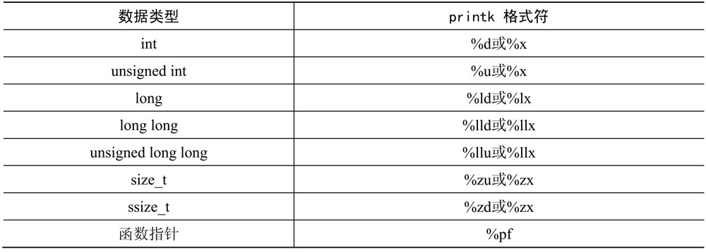

# 1. printk

很多内核开发者最喜欢的调试工具是 printk. printk 是内核提供的格式化打印函数, 它和 C 库所提供的 printf()函数类似. printk()函数和 printf()函数的一个重要区别是前者提供打印等级, 内核根据这个等级来判断是否在终端或者串口中打印输. 从多年的工程实践经验来看, printk 是最简单有效的调试方法.

```cpp
//[include/linux/kern_levels.h]

#define KERN_EMERG KERN_SOH "0"    /* system is unusable */
#define KERN_ALERT  KERN_SOH "1"    /* action must be taken immediately */
#define KERN_CRIT   KERN_SOH "2"    /* critical conditions */
#define KERN_ERR   KERN_SOH "3"    /* error conditions */
#define KERN_WARNING   KERN_SOH "4"      /* warning conditions */
#define KERN_NOTICE KERN_SOH "5"    /* normal but significant condition */
#define KERN_INFo   KERN_SOH "6"    /* informational */
#define KERN_DEBUG  KERN_SOH "7"    /* debug-level messages */
```

Linux 内核为 printk 定义了 8 个打印等级, `KERN_EMERG`等级最高, `KERN_DEBUG`等级最低. 在内核配置时, 有一个宏来设定系统默认的打印等级`\2ONFIG_MESSAGE_LOGLEVEL_DEFAULT`, 通常该值设置为 4, 那么只有打印等级高于 4 时才会打印到终端或者串口, 即只有`KERN_EMERG~KERN_ERR`. 通常在产品开发阶段, 会把系统默认等级设置到最低, 以便在开发测试阶段可以暴露更多的问题和调试信息, 在产品发布时再把打印等级设置为 0 或者 4.

```cpp
//[arch/arm/configs/vexpress_defconfig]

CONFIG_MESSAGE_LOGLEVEL_DEFAULT=8 //默认打印等级设置为 0, 即打开所有的打印信息
```

此外, 还可以通过在启动内核时传递 commandline 给内核的方法来**修改系统默认的打印等级**, 例如传递"`loglevel=8`"给内核启动参数.

```
# qemu-system-arm -M vexpress-a9  -m 1024M -kernel arch/arm/boot/zImage \
-append "rdinit=/linuxrc console=ttyAMA0 loglevel=8" -dtb \
arch/arm/boot/dts/vexpress-v2p-ca9.dtb -nographic
```

在系统运行时, 也可以修改系统的打印等级.

```
# cat /proc/sys/kernel/printk     //printk 默认 4 个等级
7     4    1     7

# echo 8 > /proc/sys/kernel/printk  //打开所有的内核打印
```

上述内容分别表示控制台打印等级、默认消息打印等级、最低打印等级和默认控制台打印等级.

在实际调试中, 把**函数名字**(`__func__`)和**代码行号**(`__LINE__`)打印出来也是一个很好的小技巧.

```cpp
printk(KERN_EMERG "figo: %s, %d", __func__, __LINE__);
```

读者需要注意 printk 打印的格式, 否则在编译时会出现很多的 WARNNING, 如表 6.1 所示.

表 6.1 printk 打印格式



内核还提供了一些在实际工程中会用到的有趣的打印.

- 打印**内存 buffer**的数据函数`print_hex_dump()`.
- 打印**堆栈函数**`dump_stack()`.

# 2. 动态打印

动态打印(Dynamic Printk Debugging)是内核子系统开发者最喜欢的打印手段之一.

在系统运行时, 动态打印可以由系统维护者**动态打开**哪些内核**子系统**的打印, 可以有选择性地打开**某些模块**的**打印**, 而**printk 是全局**的, 只能设置打印等级.

要使用动态打印, 必须在内核配置时打开`CONFIG_DYNAMIC_DEBUG`宏. 内核代码里使用了大量`pr_debug()`/`dev_dbg()`函数来打印信息, 这些就使用了**动态打印技术**, 另外还需要系统挂载 debugfs 文件系统.

动态打印在 debugfs 文件系统中有一个**control 文件节点**, 文件节点记录了系统中所有使用动态打印技术的文件名路径、打印所在的行号、模块名字和要打印的语句.

```
# cat /sys/kernel/debug/dynamic_debug/control

[...]
mm/cma.c:372 [cma]cma_alloc =_ "%s(cma %p, count %d, align %d)\012"
mm/cma.c:413 [cma]cma_alloc =_ "%s(): memory range at %p is busy, retrying\012"
mm/cma.c:418 [cma]cma_alloc =_ "%s(): returned %p\012"
mm/cma.c:439 [cma]cma_release =_ "%s(page %p)\012"
[...]
```

例如上面的 cma 模块, 代码路径是 mm/cma.c 文件, 打印语句所在行号是 372, 所在函数是`cma_alloc()`, 要打印的语句是"`%s(cma %p, count %d, align %d)\012`". 在使用动态打印技术之前, 可以先通过查询 control 文件获知系统有哪些动态打印语句, 例如"cat control| grep xxx".

下面举例来说明如何使用动态打印技术.

```
// 打开 svcsock.c 文件中所有动态打印语句
# echo 'file svcsock.c +p' > /sys/kernel/dynamic_debug/control

// 打开 usbcore 模块所有动态打印语句
# echo  'module usbcore +p' >  /sys/kernel/dynamic_debug/control

// 打开 svc_process()函数中所有的动态打印语句
# echo 'func svc_process +p' >  /sys/kernel/dynamic_debug/control

// 关闭 svc_process()函数中所有的动态打印语句
# echo 'func svc_process -p' > /sys/kernel/dynamic_debug/control

// 打开文件路径中包含 usb 的文件里所有的动态打印语句
# echo -n '*usb* +p' > /sys/kernel/dynamic_debug/control

// 打开系统所有的动态打印语句
# echo -n '+p' >  /sys/kernel/dynamic_debug/control
```

上面是打开动态打印语句的例子, 除了能打印 pr_debug()/dev_dbg()函数中定义的输出外, 还能打印一些额外信息, 例如函数名、行号、模块名字和线程 ID 等.

- p: 打开动态打印语句.
- f: 打印函数名.
- l: 打印行号.
- m: 打印模块名字.
- t: 打印线程 ID.

在调试一些系统启动方面的代码, 例如 SMP 初始化、USB 核心初始化等, 这些代码在系统进入 shell 终端时已经初始化完成, 因此无法及时打开动态打印语句. 这时可以在内核启动时传递参数给内核, 在系统初始化时动态打开它们, 这是一个实际工程中非常好用的技巧. 例如调试 SMP 初始化的代码, 查询到 ARM SMP 模块有一些动态打印语句.

```
/ # cat /sys/kernel/debug/dynamic_debug/control | grep smp
arch/arm/kernel/smp.c:354 [smp]secondary_start_kernel =pflt "CPU%u: Booted
secondary processor\012"
```

在内核 commandline 中添加"`smp.dyndbg=+plft`"字符串.

```
#qemu-system-arm -M vexpress-a9  -m 1024M -kernel arch/arm/boot/zImage
-append "rdinit=/linuxrc console=ttyAMA0 loglevel=8 smp.dyndbg=+plft" -dtb
arch/arm/boot/dts/vexpress-v2p-ca9.dtb -nographic -smp 4
[...]
/ # dmesg | grep "Booted"  //查询 SMP 模块的动态打印语句是否打开?
[0] secondary_start_kernel:354: CPU1: Booted secondary processor
[0] secondary_start_kernel:354: CPU2: Booted secondary processor
[0] secondary_start_kernel:354: CPU3: Booted secondary processor
/ #
```

还可以在各个子系统的 Makefile 中添加 ccflags 来打开动态打印.

```makefile
# [.../Makefile]
ccflags-y       := -DDEBUG
ccflags-y       += -DVERBOSE_DEBUG
```

# 3. RAM Console

上面讲述了 printk 和动态打印技术, 它们有一个明显的缺点, 都需要往串口/终端等硬件设备里输出, 因此当有大量打印时, 系统会变得很慢. 在一些对时间和时序要求比较严格的地方, 这些打印延迟会影响调试效果.

trace_printk 使用方法和 printk 一样, 它输出的信息会写入 ftrace 的循环缓存中(ring buffer), 即相当于写内存, 速度比写串口等硬件设备要快好几个数量级. 常用的一些场景有调度器、中断和时序要求严格的驱动.

内核还提供另外一种 RAM Console 的技术叫 pstore. pstore 是使用 RAM 作为存储介质的一种特殊的文件系统, 主要用于在系统宕机时将日志信息写到 pstore 中, 系统重启后再把这些日志信息写入磁盘或 eMMC 等存储介质.

# 4. OOPS 分析

在编写驱动程序或内核模块时, 常常会显式或隐藏地对指针进行**非法取值或使用不正确的指针**, 导致内核发生一个 oops 错误. 当处理器在内核空间访问一个**非法的指针**时, 因为**虚拟地址**到**物理地址**的**映射关系没有建立**, 触发一个**缺页中断**, 在缺页中断中因为**该地址是非法**的, 内核无法正确地为该地址建立映射关系, 因此内核触发了一个 oops 错误.

下面写一个简单的内核模块, 来验证如何分析一个内核 oops 错误.

```cpp
// [oops_test.c]

#include ＜linux/kernel.h>
#include ＜linux/module.h>
#include ＜linux/init.h>

static void create_oops(void)
{
    *(int *)0 = 0;  //人为制造一个空指针访问
}

static int __init my_oops_init(void)
{
    printk("oops module init\n");
    create_oops();
    return 0;
}

static void __exit my_oops_exit(void)
{
    printk("goodbye\n");
}

module_init(my_oops_init);
module_exit(my_oops_exit);
MODULE_LICENSE("GPL");
```

按照如下的 Makefile, 把 oops_test.c 文件编译成内核模块.

```makefile
BASEINCLUDE ? = /home/figo/work/test1/linux-4.0    #这里要用绝对路径
oops-objs := oops_test.o
obj-m     :=    oops.o
all :
    $(MAKE) -C $(BASEINCLUDE) SUBDIRS=$(PWD) modules;
clean:
    $(MAKE) -C $(BASEINCLUDE) SUBDIRS=$(PWD) clean;
    rm -f *.ko;
```

编译方法如下.

```
# make ARCH=arm CROSS_COMPILE=arm-linux-gnueabi-
```

编译完成后, 把**oops.ko**复制到**initramfs**文件系统的根目录, 即`_install`目录下. 重新编译内核并在 QEMU 上运行该内核, 然后使用 insmod 命令加载该内核模块, oops 错误信息如下.

```
/ # insmod oops.ko
Unable to handle kernel NULL pointer dereference at virtual address 00000000
pgd = ee198000
[00000000] *pgd=8e135831, *pte=00000000, *ppte=00000000
Internal error: Oops: 817 [#1] PREEMPT SMP ARM
Modules linked in: oops(PO+)
CPU: 0 PID: 638 Comm: insmod Tainted: P             O     4.0.0 #25
Hardware name: ARM-Versatile Express
task: eeba6590 ti: ee150000 task.ti: ee150000
PC is at create_oops+0x18/0x20 [oops]
LR is at my_oops_init+0x18/0x24 [oops]
pc : [＜bf000018>]     lr : [＜bf002018>]     psr: 60000013
sp : ee151e48  ip : ee151e58  fp : ee151e54
r10: 00000000  r9 : ee150000  r8 : bf002000
r7 : bf0000cc  r6 : 00000000  r5 : ee10a990  r4 : ee151f48
r3 : 00000000  r2 : 00000000  r1 : 00000000  r0 : 00000010
Flags: nZCv  IRQs on  FIQs on  Mode SVC_32  ISA ARM  Segment user
Control: 10c5387d  Table: 8e198059  DAC: 00000015
Process insmod (pid: 638, stack limit = 0xee150210)

Stack: (0xee151e48 to 0xee152000)
1e40:                      ee151e64 ee151e58 bf002018 bf00000c ee151ed4 ee151e68
1e60: c0008ae0 bf00200c c0e243bc 00000000 000000d0 ee800090 c0e243bc ee10a990
1e80: 000000d0 ee800090 ee151ed4 ee151e98 c0131ec4 c00c95c4 00000008 ee12aca0
1ea0: 00000000 0000000c c000f964 ee151f48 00000000 ee151f48 ee10a990 bf0000c0
1ec0: bf0000cc c000f964 ee151f04 ee151ed8 c009c3d8 c0008a88 c0126b9c c0126934
1ee0: ee151f48 ee151f48 00000000 bf0000c0 bf0000cc c000f964 ee151f3c ee151f08
1f00: c009d110 c009c378 ffff8000 00007fff c009b50c 00000080 ee151f3c 00160860
1f20: 00007a1a 0014f96d 00000080 c000f964 ee151fa4 ee151f40 c009d278 c009ceb8
1f40: ee151f5c ee151f50 f22c6000 00007a1a f22cb800 f22cb639 f22cd958 00000238
1f60: 000002a8 00000000 00000000 00000000 0000002b 0000002c 00000012 00000000
1f80: 00000016 00000000 00000000 00000000 beb07ea4 00000069 00000000 ee151fa8
1fa0: c000f7a0 c009d1ec 00000000 beb07ea4 00160860 00007a1a 0014f96d 7fffffff
1fc0: 00000000 beb07ea4 00000069 00000080 00000001 beb07ea8 0014f96d 00000000
1fe0: 00000000 beb07b38 0002b21b 0000af70 60000010 00160860 00000000 00000000
[＜bf000018>] (create_oops [oops]) from [＜bf002018>] (my_oops_init+0x18/0x24
[oops])
[＜bf002018>] (my_oops_init [oops]) from [＜c0008ae0>]
(do_one_initcall+0x64/0x110)
[＜c0008ae0>] (do_one_initcall) from [＜c009c3d8>] (do_init_module+0x6c/0x1c0)
[＜c009c3d8>] (do_init_module) from [＜c009d110>] (load_module+0x264/0x334)
[＜c009d110>] (load_module) from [＜c009d278>] (SyS_init_module+0x98/0xa8)
[＜c009d278>] (SyS_init_module) from [＜c000f7a0>] (ret_fast_syscall+0x0/0x4c)
Code: e24cb004 e92d4000 e8bd4000 e3a03000 (e5833000)
---[ end trace 2d2fed61250f46fa ]---
Segmentation fault
/ #
```

pgd=ee198000 表示出错时访问的地址对应的 PGD 页表地址, PC 指针指向出错指向的地址, 另外 stack 也展示了出错时程序的调用关系. 首先观察出错函数 create_oops+0x18/0x20, 其中, 0x18 表示指令指针在该函数第 0x18 字节处, 该函数本身共 0x20 个字节.

继续分析这个问题, 假设两种情况, 一是有出错模块的源代码, 二是没有源代码. 在某些实际工作场景中, 可能需要调试和分析没有源代码的 oops 情况.

先看有源代码的情况, 通常在编译时添加在符号信息表中, 下面用两种方法来分析.

(1)使用 objdump 工具反汇编.

```
figo$ arm-linux-gnueabi-objdump -SdCg oops.o //使用 arm 版本 objdump 工具

static void create_oops(void)
{
    0:      e1a0c00d      mov ip, sp
    4:      e92dd800      push      {fp, ip, lr, pc}
    8:      e24cb004      sub fp, ip, #4
    c:      e92d4000      push       {lr}
10:      ebfffffe      bl 0 ＜__gnu_mcount_nc>
*(int *)0 = 0;
14:      e3a03000      mov r3, #0
18:      e5833000      str r3, [r3]
}
1c:      e89da800      ldm sp, {fp, sp, pc}
```

通过反汇编工具可以看到出错函数 create_oops()的汇编情况, 这里把 C 语言和汇编语言一起显示出来了. 0x14~0x18 字节的指令是把 0 赋值到 r3 寄存器, 0x18~0x1c 字节的指令是把 r3 寄存器的值存放到 r3 寄存器指向的地址中, r3 寄存器的值为 0, 所以这里是一个写空指针错误.

(2)使用 gdb 工具.

可以简单地使用 gdb 工具, 方便快捷地定位到出错的具体地方, 使用 gbd 中的"l"指令加上出错函数和偏移量即可.

```
$ arm-linux-gnueabi-gdb oops.o

(gdb) l ＊create_oops+0x18
0x18 is in create_oops
(/home/figo/work/test1/module_test_case/oops_test/oops_test.c:7).
2    #include ＜linux/module.h>
3    #include ＜linux/init.h>
4
5    static void create_oops(void)
6    {
7         *(int *)0 = 0;
8    }
9
10    static int __init my_oops_init(void)
11    {
(gdb)
```

如果出错地方是内核函数, 那么可以使用 vmlinux 文件.

下面来看没有源代码的情况. 对于没有编译符号表的二进制文件, 可以使用 objdum 工具来 dump 出汇编代码, 例如使用"arm-linux-gnueabi-objdump -d oops.o"命令来 dump 出 oops.o 文件. 内核提供了一个非常好用的脚本, 可以帮忙快速定位问题, 该脚本位于 Linux 内核源代码目录的 scripts/decodecode, 首先把出错 log 保存到一个 txt 文件中.

```
$ ./scripts/decodecode < oops.txt
Code: e24cb004 e92d4000 e8bd4000 e3a03000 (e5833000)
All code
========
    0:    e24cb004     sub fp, ip, #4
    4:    e92d4000     push       {lr}
    8:    e8bd4000     pop {lr}
    c:    e3a03000     mov r3, #0
10:*  e5833000    str r3, [r3]       ＜-- trapping instruction

Code starting with the faulting instruction
===========================================
    0:    e5833000     str  r3, [r3]
```

decodecode 脚本把出错的 oops 日志信息转换成直观有用的汇编代码, 并且告知出错具体是在哪个汇编语句中, 这对于分析没有源代码的 oops 错误非常有用.

# 5. BUG_ON()和 WARN_ON()

在内核中经常看到 BUG_ON()和 WARN_ON()宏, 这也是内核调试常用的技巧之一.

```cpp
//[include/asm-generic/bug.h]

#define BUG_ON(condition) do { if (unlikely(condition)) BUG(); } while (0)

#define BUG() do { \
    printk("BUG: failure at %s:%d/%s()! \n", __FILE__, __LINE__, __func__); \
    panic("BUG! "); \
} while (0)
```

对于`BUG_ON()`来说, 满足条件 condition 就会触发 BUG()宏, 它会使用`panic()`函数来主动让系统宕机. 通常是一些内核的 bug 才会触发 BUG_ON(), 在实际产品中使用该宏需要小心谨慎.

`WARN_ON()`相对会好一些, 不会触发 panic()主动宕机, 但会**打印函数调用栈信息**, 提示开发者可能发生有一些不好的事情.

