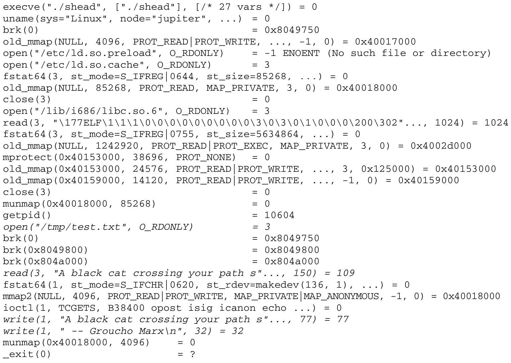

大体上, **系统程序设计**主要是利用**标准库**进行工作, 标准库提供了各种基本函数, 用于开发应用程序.

无论编写何种应用程序, 程序员都必须了解系统程序设计的基础知识. 一个简单的程序, 如经 典的 hello.c 例程, 在屏幕上显示 "Hello, world!" 或类似的文本, 也会间接使用系统例程来输出必要 的字符.

当然, 系统程序设计不一定总是用 C 语言.

标准库不仅是实现**内核系统调用的接口集合**, 其中也提供了许多其他**完全在用户空间实现**的函数.

# 追踪系统调用

下列例子展示了如何**使用标准库的包装器例程**来进行系统调用:

```cpp
#include<stdio.h>
#include<fcntl.h>
#include<unistd.h>
#include<malloc.h>

int main() {
    int handle, bytes;
    void* ptr;

    handle = open("/tmp/test.txt", O_RDONLY);

    ptr = (void*)malloc(150);

    bytes = read(handle, ptr, 150);
    printf("%s", ptr);

    close(handle);
    return 0;
}
```

示例程序打开文件/tmp/test.txt, 读取前 150 个字节, 并将其写到标准输出, 这是 UNIX head 命令的一个非常简单的版本.

这个程序使用了**多少个系统调用**呢?

能直接看到的只有**open**、**read**和**close**(其实现在第 8 章讨论过). 而**printf**函数也是通过**系统调用**在**标准库中实现**的.

当然可以**阅读标准库的代码**, 来看看具体**使用了哪个系统调用**, 但这肯定是冗长乏味的. 一个简单些的方案是使用**strace 工具**, 它可以记录应用程序发出的**所有系统调用**并将该信息提供给程序员, 在调试程序时, 这个工具是不可缺少的.

**内核**自然需要为**记录系统调用**提供**专门的支持**, 这将在 13.3.3 节讨论\[这项支持功能也是一个**系统调用(ptrace！！！**), 我们只对其输出感兴趣].

接下来使用 strace 命令将 shead(上述的例子程序)发出的所有系统调用的列表写到 log.txt 中:

```
strace -o log.txt ./shead
```

log.txt 的内容比读者的预期可能要多很多:



跟踪记录显示, 该应用程序进行了**大量**源代码中**没有明确列出的系统调用**. 因此, strace 的**输出并不容易阅读**.

为此, 上文复制的文本中, 但凡能够在例子程序的**C 源代码中找到对应系统调用的行**, 都以**斜体**显示. 其他行对应的系统调用, 是由编译时**自动添加**的一些代码生成的. **其他的系统调用**是由启动和运行应用程序所需的**框架代码生成**的, 例如, **C 标准库**是**动态映射**到**进程内存区**的. 其他调用, 如`old_mmap`和`unmap`, 负责管理应用程序使用的动态内存区域.

...

使用 strace 工具还有一个好处, **无须接触**所跟踪**应用程序的源代码**即可了解其内部结构和运作方式.

...

# 支持的标准

在所有类型的 UNIX 操作系统中, 系统调用都是特别重要的. 系统调用的作用范围、速度、高效 实现是影响系统性能的一个主要因素. LINUX 中系统调用的实现非常高效, 这一点将在 13.3 节阐述.

同样重要的是可用例程的多样性和选择权, 这使得(应用程序和标准库)程序员的生活更加轻松, 并促进了程序在各种不同 UNIX 变体之间在源代码级别上的可移植性. 在 UNIX 超过 25 年的历史中, 这促进 了标准和事实标准的出现, 从而使得**不同系统的接口**具有一致性.

POSIX 标准(这是 Portable Operating System Interface for UNIX 的首字母缩写词, 也揭示了该标准 的目的)已经成为该领域的主导标准. Linux 和 C 标准库尽力遵循 POSIX 标准, 这也是为什么值得对 POSIX 标准进行简要讨论的原因. 从 20 世纪 80 年代末 POSIX 第一个版本发布以来, 该标准涵盖的范围急速扩展(当前版本包括 4 卷), 现在许多程序员认为它已经太长也太复杂.

注: 电子版可以在 www.opengroup.org/onlinepubs/007904975/ 查看.

Linux 内核基本上与 POSIX-1003.1 标准兼容. 很自然, 标准的新发展需要一定的时间才能渗透到 内核代码中.

除了 POSIX 之外, 还有**其他标准**, 这些**不是**由**某个委员会**制定的, 而是来源于 UNIX 和类 UNIX 操作系统的**开发**. 在 UNIX 的历史中, **两条开发主线**产生了**两个独立的系统**, 一个是**System V**(直接起源于**AT&T 的原始代码**), 另一个是**BSD**(Berkeley Software Distribution, 在加州大学开发, 现在市场上的 NetBSD、FreeBSD、OpenBSD 都是基于 BSD 的, 还有基于 BSD 的商业系统, 如 BSDI 和**MacOS X**).

**Linux**提供的系统调用汲取自所有上述**3 个来源**, 当然是**独立实现**的. 其中没有使用竞争系统的代码, 这仅仅是因为法律和许可方面的问题. 例如, 下面列出的**3 个著名的系统调用**起源于**3 个不同的阵营**.

- flock 锁定一个文件, 防止这个文件被几个进程并行访问, 以确保文件的一致性. 该调用是由 **POSIX 标准**规定的.
- **BSD** UNIX 提供了**truncate**调用, 用于按指定的字节数截短一个文件. Linux 也以同样的名称实现了该函数.
- **sysfs**收集内核已知的**文件系统有关的信息**, 在**SVR4**(System V Release 4)中引入.  Linux 也采用了该系统调用. 但 Linux 开发者并不全然同意 System V 设计者对该调用实际价值的观点,  至少, 源代码的注释中写了"Whee.. Weird sysv syscall".  现在, 该信息可以通过读取/proc/filesystems 更容易地获取.

有些系统调用是**所有 3 个标准**都需要的. 例如, time、gettimeofday、settimeofday 在 System V、 POSIX、4.3BSD 中的形式是相同的, 在 Linux 内核中也是如此.

同样, 有些系统调用是**特地为 Linux 开发**的, 在其他标准/系统中或者根本不存在, 或者名称不同.  一个例子是**vm86 系统调用**, 它是在 IA-32 处理器上实现 DOS 仿真程序的基础. 更一般的调用, 诸如用于暂停进程执行很短一段时间的 nanosleep, 也是**Linux 特有**的系统调用.

有些情况下, **两个系统调用**是解决**同一问题**的**不同方法**. 主要的例子是 poll 和 select 系统调用,  前一个在 System V 中引入, 后者在 4.3BSD 中引入. 最终, 二者执行的功能是相同的.

总之, 只实现 POSIX 标准并不能建立一个完整的 UNIX 系统, 除了名称之外, 这种做法一文不值.

POSIX 无非是一组接口的集合, 其具体实现并不是强制性的, 也不一定要归入到内核来实现. 因而,  虽然有些操作系统本身的设计是非 UNIX 的, 但它们却以普通的函数库完全实现了 POSIX 标准, 以促 进 UNIX 应用程序的移植.

注: 新的 Windows 版本就包含了一个这种类型的库

# 重启系统调用

在**系统调用**与**信号冲突**时, 会发生一个有趣的问题.

如果在**一个进程执行系统调用**时, 向该进程发送**一个信号**, 那么在处理时, **二者的优先级**如何分配呢?

应该等到**系统调用结束再处理信号**, 还是中断系统调用, 以便**尽快将信号**投递到该进程?第一种方案导致的问题显然比较少, 也是比较简单的方案. 遗憾的是, **只有**在**所有系统调用**都**能够快速结束**、不会让**进程等待太长时间**的情况下, 这个方案才能正确运作(在第 5 章提到过, **信号投递的时机**, 总是在**进程处理完一个系统调用**、**返回到用户态**的时候). 情况不总是这样. **系统调用**不仅需要一定的执行时间, 而且在最坏情况下, 很**可能使进程睡眠**(例如, 没有数据可供读取时). 对同时**发生的信号**而言, 这意味着**信号投递的严重延迟**. 因而, 必须不惜任何代价防止这种情况.

如果一个**正在执行的系统调用**被**中断**, **内核**应该向应用程序**返回什么样的值**? 在通常的场景下, 只有**两种情况**: **调用成功**或者**失败**. 在**出错的情况**下, 将返回一个**错误码**, 使用户进程能够确定错误的原因, 并适当地做出反应. 倘若**系统调用被中断**, 则发生了**第三种情况**: **必须通知应用程序**, 如果系统调用在执行期间没有被信号中断, 那么系统调用已经成功结束. 在这种情况下, Linux(和其他 System V 变体)下将使用-EINTR 常数.

该过程的负面效应是很明显的. 尽管该方案易于实现, 但它迫使**用户空间应用程序**的程序员必须明确**检查所有系统调用的返回值**, 并在返回值为`-EINTR`的情况下, **重新启动**被中断的**系统调用**, 直至该调用不再被信号中断. 用**这种方法重启的系统调用**称作**可重启系统调用(restartable system call**),  该技术则称为重启(restarting).

该行为第一次引入是在**System V UNIX**中. 该方案将新信号的快速投递和系统调用的中断组合起来, 但它并非是唯一的组合方式, BSD 所采用的方法即可证实这一点.

我们来考察**BSD 内核**在系统调用被信号中断时, 会做出何种反应.

BSD 内核将**中断系统调用的执行**并**切换到用户态**执行**信号处理程序**. 在发生这种情况时, 该**系统调用不会有返回值**, **内核**在信号处理程序结束后将**自动重启该调用**. 因为该行为对用户应用程序是透明的, 也不再需要重复实现对-EINTR 返回值的检查和调用的重启, 所以与 System V 方法相比, 这种方案**更受程序员的欢迎**.

Linux 通过`SA_RESTART`**标志**支持 BSD 方案, 可以在**安装信号处理例程**时按需对具体信号指定该标志. **System V**提议的机制用作**默认方案**, 因为 BSD 机制偶尔会导致一些困难, 如下列例子所示(取自 \[ME02]第 229 页).