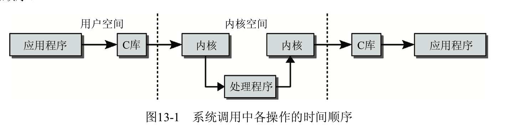
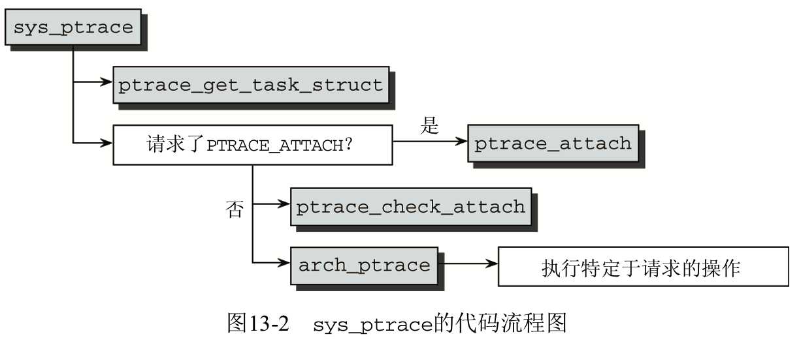

在系统调用的实现中, 不仅需要讨论提供所需函数的**内核源代码**, 还需要阐述**调用这些函数的方式**. 这些函数的调用方式**与普通的 C 函数不同**, 因为需要**跨越用户态和核心态的边界**. 这引发了各种问题, 这些问题需要由平台相关的汇编语言代码处理. 该代码尽可能快速地建立了一个独立于处理器的状态, 使得系统调用的实现能够独立于底层体系结构. 参数如何在用户空间和内核空间之间传递的 问题也必须考虑.

# 系统调用的结构

用于实现系统调用的**内核代码**划分为**两个颇为不同的部分**.

- **系统调用**执行的**实际任务**实现为一个**C 例程**, 与其余内核代码几乎没有差别.

- 用于**调用该例程的机制**则充满了**平台相关**的特性, 必须考虑大量细节, 因而最终实现使用**汇编语言**代码是必然的.

## 处理程序函数的实现

我们首先仔细观察一下, 在实际处理程序函数的 C 语言实现之后有哪些东西. 这些函数散布在内核中各处, 因为这些函数都嵌入到了与其目的关系最密切的代码中. 例如, 所有文件相关的系统调用 都在 `fs/` 内核子目录下, 因为它们与虚拟文件系统直接交互. 同样地, 所有的内存管理调用都在 `mm/` 子目录的文件中.

用于**实现系统调用**的**处理程序函数**, 在形式上有如下几个共同的特性.

- 每个函数的**名称前缀**都是 `sys_`, 将该函数唯一地标识为**一个系统调用**, 更精确地说, 标识为一个**系统调用**的**处理程序函数**. 通常, **不必区分**系统调用和处理程序函数. 在以下各节中, 仅当有必要之处才进行区分.
- 所有的处理程序函数都**最多接受 5 个参数**. 这些参数在参数列表中指定, 与普通的 C 函数相同(提供参数值的方式与传统方法稍有不同, 读者稍后会看到).
- **所有的系统调用**都在**核心态**执行. 因而, 第 2 章讨论的限制是适用的, 主要是**不允许直接访问用户态的内存**. 回想 `copy_from_user`、`copy_to_user` 或其他同类函数, 都必须确保在进行实际读写操作之前**目标内存区**对**内核**必须是**可用**的.

在**内核**将**控制权**转移给**处理程序例程**后, 控制流就进入了**平台中立的代码**, 即**不依赖**于**特定的 CPU 或体系结构**. 但因为各种原因, 也有一些例外. 有少量处理程序函数是针对各个平台分别实现的.  在返回结果时, **处理程序函数**无须进行特别的操作, 简单的一个**return 后接返回值**即可. 在**核心态**和**用户态**之间的**切换**, 由**特定于平台的内核代码**执行, 这与中断处理程序是无关的.

图 13-1 说明了相关的时间顺序.



上述方法极大简化了程序员的工作, 因为**处理程序函数的实现**实际上与普通内核代码的实现是相同的. 有些系统调用非常简单, 只用一行 C 语言代码实现. 例如, **返回当前进程 UID**的 getuid 系统调 用实现如下:

```cpp
// kernel/timer.c
asmlinkage long sys_getuid(void)
{
        /* 我们只改变这个, 使之变为 SMP 安全的 */
        return current->uid;
}
```

current 是一个指针, 指向当前进程的`task_struct`实例, 由内核自动设置. 上述代码返回`task_struct`的**uid 成员**(当前用户 ID).

还有复杂得多的系统调用, 其中一些已经在前面几章讨论过. 处理程序函数的实现总是简短而紧凑的. 它通常会尽快将控制权传递给一个更通用的内核辅助函数, 以 read 为例.

第三种"类型"系统调用充当**多路分解器**. 多路分解器使用**常数**, 将**系统调用**委派给执行**不同任务的函数**. 一个典型的例子是 socketcall(在第 12 章讨论), 其中聚集了所有网络相关的调用.

# 调用分派和参数传递

系统调用由内核分配的一个编号唯一标识. 这样做有其实际原因, 在考虑触发系统调用的过程时,  该原因会逐渐明朗化. 所有的系统调用都由一处中枢代码处理, 根据调用编号和一个静态表, 将调用 分派到具体的函数. 传递的参数也由中枢代码处理, 这样参数的传递独立于实际的系统调用.

...

## 参数传递

不同的平台使用不同的汇编语言方法来执行系统调用.

注: 细节很容易在 GNU 标准库的源代码中找到, 可参考`sysdeps/unix/sysv/linux/arch/syscall.S`文件. **特定平台**所需的**汇编语言**代码可以在 syscall 标号下找到, 这些代码为库其余部分提供了一个**通用接口**, 可用于调用系统调用.

在**所有平台**上, 系统调用**参数**都是通过**寄存器**直接传递的, 对具体的**处理程序函数**而言, **参数**与**寄存器**之间的**映射是精确定义**的. 还需要**一个寄存器**来定义系统调用**编号**, 将系统调用分派给匹配的处理程序函数.

下面概述了一些流行的体系结构上进行系统调用的方法.

### IA-32 系统

在**IA\-32**系统上, 使用汇编语言指令`int $0x80`来引发软件中断 128. 这是一个**调用门(call gate**), 为此指派了**一个特定的函数**来继续进行系统调用的处理. 系统**调用编号**通过**寄存器 eax**传递,  而**参数**通过寄存器**ebx**、**ecx**、**edx**、**esi**和**edi**传递.

注: 除了 0x80 调用门, 内核在`IA-32`处理器上的实现提供了**其他两种**进入核心态执行系统调用的方法, 分别是`lcall7` 和`lcall27`调用门. 这些用于执行对**BSD**和**Solaris**的**二进制仿真**, 因为这些系统分别以本机方式进行系统调用.

在`IA-32`系列中, 更为现代的处理器(Pentium II 和后续处理器)采用了**两个汇编语言指令**(**sysenter**和**sysexit**)来快速进入和退出核心态. 其中仍然采用**同样的方法传递参数**, 但在特权级别之间切换的**速度更快**.

为使 sysenter 调用更快, 而又不失去与旧处理器的**向下兼容性**, 内核将**一个内存页面**映射到**地址空间的顶端**(`0xffffe000`). 根据处理机类型的不同, 该页上的系统调用代码可能包含 `int 0x80`或者`sysenter`.

**调用**存储在该地址(`0xffffe000`)的代码使得**标准库**可以**自动选择**与使用的处理器相匹配的方法.

### Alpha 处理器

### PowerPC

### AMD64

AMD64 体系结构在实现系统调用时, 也提供了自身的汇编语言指令, 其名称为**syscall**. 系统调用**编号**保存在**rax 寄存器**中, 而**参数**保存在**rdi**、**rsi**、**rdx**、**r10**、**r8**和**r9**中.

### 内核任务

在应用程序借助于标准库切换到**核心态**后, 内核面临的任务是查找与该系统调用匹配的处理程序函数, 并向该处理函数提供传递的参数.

`sys_call_table`表中保存了一组指向处理程序例程的函数指针, 可用于查找处理程序(在**所有平台**上). 因为该表是用**汇编语言指令**在内核的**数据段中产生**的, 其内容**因平台而不同**. 但原理总是同样的: 内核根据**系统调用编号**找到表中**适当的位置**, 由此获得指向**目标处理程序函数的指针**.

## 系统调用表

### Sparch64

Sparc64 系统上的 sys_call_table, 定义在 arch/sparc/kernel/systlbs.S 中(其他系统的系统调用表, 通常可以在与处理器类型对应的目录下的 entry.S 文件中找到).

### IA-32

```assembly
" arch/x86/kernel/syscall_table_32.S
ENTRY(sys_call_table)
        .long    sys_restart_syscall /* 0 - old "setup()" system call, used for restarting */
        .long    sys_exit
        .long    sys_fork
        .long sys_read
        .long sys_write
        .long sys_open /* 5 */
        .long sys_close
...
        .long sys_utimensat /* 320 */
        .long sys_signalfd
        .long sys_timerfd
        .long sys_eventfd
        .long sys_fallocate
```

`.long`语句的作用是在**内存中对齐各个表项**.

用这种方法定义的表, 与**C 数组类似**, 也可以用**指针运算处理**. `sys_call_table`是**基指针**, 指向**数组的起始处**, 即(按 C 语言的术语)指向**索引为 0**的**数组项**.

如果一个用户空间程序调用**open 系统调用**, 传递的系统调用**编号是 5**. **分配器例程**将**编号 5**加到`sys_call_table`的基地址, 得到该数组的**第 6 项**, 其中保存了`sys_open`的地址, 这是独立于处理器的处理程序函数. 在将保存在**寄存器**中的**参数**值复制到**栈上**之后, 内核调用处理程序例程, 并切换到系统调用处理中独立于处理器的部分.

>因为核心态和用户态使用两个不同的栈, 如第 3 章所述, 系统调用参数不能像通常那样在栈上传递. 在两个栈之间的切换, 或者由进入核心态时调用的体系结构相关的汇编语言代码进行, 或者在特权级别从用户态切换到核心态时由处理器自动进行.

## 返回用户态

# 访问用户空间

尽管内核尽可能保持**内核空间和用户空间的独立**, 有些情况下, **内核**代码必须访问**用户应用程序**的**虚拟内存**. 当然, 这**只**在内核执行由用户应用程序发起的**同步操作**时才有意义, 而不适用于任意进程进行的读或写访问, 否则不仅不能解决问题, 还会导致当前执行的代码产生危险的后果.

当然, 对系统调用的处理就是此类情况的一个典型的例子, 内核忙于同步执行应用程序指派的任务. 因为如下两种原因, **内核必须访问应用程序的地址空间**.

- 如果一个系统调用需要**超过 6 个不同的参数**, 它们只能借助进程内存空间中的 C 结构实例来传递. 系统调用将借助寄存器, 将**指向该结构实例**的一个**指针**传递给内核.
- 由系统调用的副效应产生的**大量数据**, 不能通过**返回值机制**传递给**用户进程**. 相反, 必须通过**指定的内存区**交换该数据. 当然, 该内存区**必须在用户空间**中, 使得用户应用程序能够访问.

在**内核**访问**自身的内存区！！！** 时, **虚拟地址**和**物理内存页**之间的**映射**总是**存在！！！**的. 但**用户空间**中的情况有所不同, 如第 3 章所述. 这里, **页可能被换出**, 甚至可能**尚未分配物理内存页**.

因而, 内核**不能**简单地**反引用用户空间的指针**, 而必须采用**特定的函数**, 确保**目标内存区**已经在**物理内存**中. 为确保内核遵守了这种约定, **用户空间指针**通过`__user`属性标记, 以支持 C check tools 对源代码的自动化检查 .

注: Linus Torvalds 设计了该工具, 用于发现内核源代码中直接反引用用户空间指针之处.

第 3 章讨论了用于在用户空间和内核空间之间复制数据的函数. 大多数情况下, 是`copy_to_user`和`copy_from_user`, 但还有更多的变体可用.

# 追踪系统调用

**strace 工具**用来追踪进程的系统调用, 它使用了 13.1.1 节描述的**ptrace 系统调用**.

`sys_ptrace`**处理程序例程**的实现是**体系结构相关**的, 定义在`arch/arch/kernel/ptrace.c`中.  各个体系结构的对应版本之间, 代码只有微小的差别.

在详细考察该系统调用的流程之前, 应该注意到**ptrace**本质上是一个用于**读取和修改进程地址空间中的值的工具**, **不能！！！** 用于**直接跟踪系统调用**. 只有从正确的位置提取出所需的信息, 才能跟踪进程并就进行的系统调用得出结论. 即使**调试器如 gdb**的实现也完全**依赖于 ptrace**.

ptrace 不仅能用于跟踪系统调用, 还提供了更多的选项.

ptrace 在内核源代码中的定义需要 4 个参数:

```cpp
// <syscalls.h>
asmlinkage long sys_ptrace(long request, long pid, long addr, long data);
```

注: `<syscalls.h>`包含了所有**独立于体系结构**的**系统调用的原型**, 这些调用的参数在所有体系结构上都是相同的.

- **pid**标识了**目标进程**. 进程标识符根据调用者的命名空间来解释. 尽管**strace**的处理方式暗示**必须从开始就启用进程追踪**, 但这**不是真实的**. 跟踪者程序必须通过**ptrace**将自身**连接到目标进程**, 而且这可以在**进程已经运行后进行！！！** (不仅能在进程开始时进行).

**strace**负责**连接到进程**, 通常是用**fork**和**exec**启动**目标程序**后立即进行.

- **addr**和**data**向内核传递一个**内存地址**和**附加信息**. 其语义因选择的操作而不同.
- 借助于符号常数, **request**用于选择一个**操作**, 由 ptrace 执行. 手册页 ptrace(2)、内核源代码中的`<ptrace.h>`列出了所有可能值. 可用的选项如下.
    - `PTRACE_ATTACH`发出一个请求, **连接到一个进程**并**开始跟踪**. `TRACE_DETACH`从该进程**断开并结束跟踪**. 当**被跟踪的进程有待决信号**时, **进程总是会被终止**. 该选项使得**被跟踪进程**在**系统调用后**或**一条汇编语言指令之后暂停**.  在被跟踪的进程**暂停时**, 跟踪者程序通过**SIGCHLD 信号**得到一个通知: 在被跟踪进程暂停前, 跟踪者可用第 2 章讨论的 wait 函数等待.  在设置了跟踪之后, 将 SIGSTOP 信号发送给被跟踪进程, 这导致跟踪者进程第一次被中断.  在跟踪系统调用时, 这是必要的, 如下面的例子所示.

    注: 因为在调用**ptrace 系统调用**时, 执行的进程显然不是被跟踪进程, **CPU 物理寄存器**自然保存的是**跟踪者进程的值**,  而不是被跟踪进程. 这也是使用第 14 章讨论的 pt_regs 实例的数据的原因. 这些数据在进程经过进程切换后重新激活时, 将被复制到寄存器集合中. 操作该结构的数据, 相当于操作寄存器本身.

    - PEEKTEXT、PEEKDATA 和 PEEKUSR 从进程地址空间读取数据. PEEKUSR 读取普通的 CPU 寄存 器和使用的任何其他调试寄存器 1(当然, 会根据标识符只读取一个寄存器的内容, 而不是 读取整个寄存器集合的内容). PEEKEXT 和 PEEKDATA 从进程的代码段和数据段读取任意字.
    - POKETEXT、POKEDATA 和 PEEKUSR 向被监控进程的三个指定区域写入值, 因而可以操作进程 地址空间的内容. 这在交互式调试程序时是非常重要的.  因为 PTRACE_POKEUSR 操作 CPU 的调试寄存器, 该选项支持对高级调试技术的使用. 例如可 监控此类事件:在一定的条件满足时, 在特定位置暂停程序的执行.
    - PTRACE_SETREGS 和 PTRACE_GETREGS 设置和读取 CPU 的特权寄存器集合的值.
    - PTRACE_SETFPREGS 和 PTRACE_GETFPREGS 设置和读取用于浮点计算的寄存器. 这些操作在测试和交互式调试应用程序时也非常有用.
    - 系统调用追踪是基于 PTRACE_SYSCALL 的. 如果用该选项激活 ptrace, 那么内核将开始执行进程, 直至调用一个系统调用. 在被追踪进程停止后, wait 通知跟踪者进程, 跟踪者接下 来可以使用上述的 ptrace 选项, 来分析被跟踪进程的地址空间, 以收集有关系统调用的信息.  在完成系统调用之后, 被跟踪的进程第二次暂停, 使得跟踪者进程可以检查调用是否成功.  因为系统调用机制因平台而不同, 跟踪程序如 strace 必须针对每个体系结构分别实现数据 的读取;这是一个乏味的任务, 很快会致使可移植程序的源代码变得不可读(strace 的源 代码中有大量预处理器条件, 阅读其代码非常痛苦).
    - PTRACE_SINGLESTEP 将处理器在执行被追踪进程期间, 置于单步执行模式. 在这种模式下,  跟踪者进程在每个汇编语言指令之后, 可以访问被跟踪进程. 这仍然是一种非常流行的应 用程序调试技术, 特别是在试图跟踪编译器错误或其他比较微秒的问题时.  单步功能的实现非常强烈地依赖于所使用的 CPU, 毕竟, 内核此时是在一个面向机器的层 8 次上运作的. 尽管如此, 在所有平台上都可以向跟踪者进程提供一个一致的接口. 在汇编 指令执行之后, 向跟踪者发送一个 SIGCHLD 信号, 跟踪者接下来会使用其他的 ptrace 选项, 收集被跟踪进程状态相关的详细信息. 该循环不断重复, 在用 PTRACE_SINGLESTEP 参数调 用 ptrace 之后将执行下一条汇编指令, 被跟踪进程进入睡眠, 通过 SIGCHLD 信号通知跟踪 者, 等等.
    - PTRACE_KILL 发送 KILL 信号, 关闭被追踪进程.
    - PTRACE_TRACEME 开始对当前进程的跟踪. 当前进程的父进程自动承担跟踪者的角色, 必须准备好从子进程接收信息.
   - PTRACE_CONT 恢复被跟踪进程的执行, 但不自动暂停该进程的具体条件, 被跟踪的进程将在接收到信号时暂停.

## 系统调用追踪

下列简短示例程序说明了**ptrace 的使用**. ptrace 将**当前进程**连接到**一个进程**, 并检测系统调用的使用. 就这点而论, 它是最简版本的 strace.

```cpp
/* strace(1)的简单替换 */

#include<stdio.h>
#include<stdlib.h>
#include<signal.h>
#include<unistd.h>
#include<sys/ptrace.h>
#include<sys/wait.h>
#include<asm/ptrace.h>      /*用于 ORIG_EAX */

static long pid;

int upeek(int pid, long off, long *res) {
    long val;

    val = ptrace(PTRACE_PEEKUSER, pid, off, 0);
        if (val == -1) {
            return -1;
        }

        *res = val;
        return 0;
    }

void trace_syscall() {
    long res;

    res = ptrace(PTRACE_SYSCALL, pid, (char*) 1, 0);
    if (res < 0) {
        printf("Failed to execute until next syscall: %d\n", res);
    }
}

void sigchld_handler (int signum) {
    long scno;
    int res;

    /* 查明系统调用(系统相关的)......*/
    if (upeek(pid, 4*ORIG_EAX, &scno) < 0) {
        return;
    }

    /* ......并输出信息 */
    if (scno != 0) {
        printf("System call: %u\n", scno);
    }

    /* 激活追踪直至下一个系统调用 */
    trace_syscall();
}

int main(int argc, char** argv) {
    int res;

    /* 检查参数数目 */
    if (argc != 2) {
        printf("Usage: ptrace <pid>\n");
        exit(-1);
    }

    /* 从命令行参数读取目标 pid */
    pid = strtol(argv[1], NULL, 10);
    if (pid <= 0) {
        printf("No valid pid specified\n");
        exit(-1);
    } else {
        printf("Tracing requested for PID %u\n", pid);
    }

    /* 安装 SIGCHLD 的处理程序 */
    struct sigaction sigact;
    sigact.sa_handler = sigchld_handler;
    sigaction(SIGCHLD, &sigact, NULL);

    /* 连接到目标进程 */
    res = ptrace(PTRACE_ATTACH, pid, 0, 0);
    if (res < 0) {
        printf("Failed to attach: %d\n", res);
        exit(-1);
    } else {
        printf("Attached to %u\n", pid);
    } for (;;) {
        wait(&res);
        if (res == 0) {
            exit(1);
        }
    }
}
```

程序结构大体上如下.

- 从命令行读取被跟踪程序的 pid, 并进行通常的检查.
- 安装 CHLD 信号的**一个处理程序**, 因为每次**被跟踪程序中断时**, 内核都会向跟踪者进程**发送该信号**.
- 跟踪者进程通过 ptrace 请求`PTRACE_ATTACH`, 将自身连接到目标应用程序.
- 跟踪者程序的主体由一个简单的无限循环组成, 其中**重复调用 wait 目录**, 等待新的 CHLD 信号的到达.

该程序的结构并**不依赖于特定的处理器类型**, 可以用于 Linux 支持的所有系统. 但用于确定所调用**系统调用编号**的方法, 却是与**体系结构非常相关**的. 该程序给出的方法**只适用于 IA-32 系统**, 该平台将系统调用编号放置在所保存的寄存器集合中一个特定的偏移量处.  该偏移量保存在 `asm/ptrace.h`定义的`ORIG_EAX`常数中. 其值可以使用`PTRACE_PEEKUSER`读取, 必须乘以 4, 因为此体系结构上**寄存器**的**字长**是**4 字节**.

当然, 在其他体系结构上的实现会是不同的. 详细情况, 请参见内核源代码中与系统调用相关的 部分, 以及标准的**strace 工具的源代码**.

我们主要的目标是说明如何用 ptrace 检查被监控的进程. 在通过`PTRACE_ATTACH`开始跟踪进程之后, 大部分工作都委托给**CHLD 信号**的**处理程序函数**, 其**实现**在`sigchld_handler`中. 该函数负责执行下列任务.

- 使用**平台相关**的方法, 帮助查找所调用**系统调用的编号**.  如果结果是一个不等于 0 的系统调用编号, 则输出该信息. 检测 0 是必要的, 因为只要求记录系统调用, 而不是发送给被跟踪进程的信号.
- 帮助恢复**被跟踪进程的控制流**. 当然, **必须通知内核**, 该进程的执行将在下一个系统调用时暂停. 这是使用 ptrace 请求 PTRACE_SYSCALL 完成的.

在开始运转之后, 程序的控制流是很明显的. **被跟踪进程**请求的**系统调用**会触发内核中的**ptrace 机制**, 进而**向跟踪者进程发送 CHLD 信号**. 跟踪者进程的**信号处理程序**会读取所需信息, 即**系统调用的编号**, 并**输出它**, 然后再次使用 ptrace 机制. 被跟踪进程的执行将恢复, 并在再次调用系统调用时中断.

但整个过程是**如何开始运转**的? 无论如何, 为**启用对系统调用的跟踪**, 都需要第一次调用 CHLD 的处理程序. 如上所述, 在**一个信号**发送到**被追踪进程**时, 内核也会向**跟踪者**发送一个**SIGCHLD**信号,  则会调用对应的处理程序, 与系统调用发生时相同. 事实上, 在**发起跟踪时**, 内核会**自动！！！** 向**被跟踪进程**发送一个**STOP 信号**, 以确保在**跟踪开始时**调用**处理程序**(即使跟踪者没有收到其他信号). 这使得跟踪过程运转起来.

## 内核端实现

不出所料, **ptrace 系统调用**的处理程序函数称作`sys_ptrace`. 除少数例外, 所有体系结构都使用了该实现中**体系结构无关的部分**, 这可以在`kernel/ptrace.c`中找到. 而体系结构相关的部分即函数`arch_ptrace`, 位于`arch/arch/kernel/ptrace.c`中. 图 13-2 给出了其代码流程图.



ptrace 系统调用的语义由 request 参数控制, 从其代码的结构可以很清楚地看到这一点. 首先进行预备工作, 主要是使用`ptrace_get_task_struct`确定所传递**PID 对应**的`task_struct`结构实例. 这在本质上使用了`find_task_by_vpid`, 来查找所需的`task_struct`实例, 还**防止了对 init 进程的跟踪** ——如果对**pid 参数**传递**值 1**, 则**放弃 ptrace 操作**.

### 开始跟踪

进程的`task_struct`中包含了几个与 ptrace 相关的成员

```cpp
//<sched.h>
struct task_struct {
...
    unsigned int ptrace;
...
    /* ptrace_list/ptrace_children 是 ptrace 能够看到的当前进程的子进程列表. */
    struct list_head ptrace_children;
    struct list_head ptrace_list;
...
    struct task_struct *real_parent; /* 真正的父进程(在被调试的情况下) */
...
};
```

如果设置了`PTRACE_ATTACH`, 则用`ptrace_attach`建立**跟踪者进程**与**目标进程**之间的关联. 在完成后, 将进行如下几步.

- **目标进程**的**ptrace**成员设置为`PT_TRACED`.
- **跟踪者进程**变为**目标进程**的**父进程**(**真正的父进程**保存在`real_parent`).
- **被跟踪进程**添加到**跟踪者**的`ptrace_children`链表, 使用`task_struct`的`ptrace_list`成员作为**链表元素**.
- 向**被跟踪的进程**发送一个**STOP 信号**.