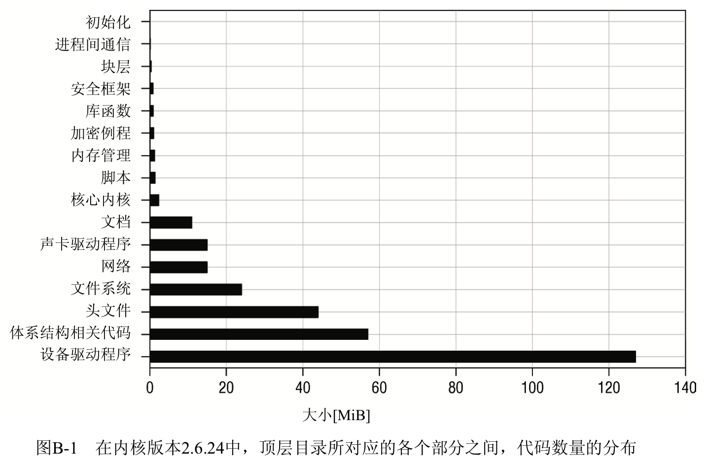

内核源代码的主目录包含了若干子目录, 对源代码的内容进行了粗略的分类. 关键的内核组件位于下列目录中.

- kernel 目录包含了内核的**核心组件的代码**. 其中只包含大约 120 个文件, 总共大约 80 000 行代 17 码. 对 Linux 这种规模的项目来说, 这个数字小到令人惊讶. 开发者强调, 有一点非常重要: 除非绝对必要, 否则不要向该目录添加内容;凡修改该目录中文件的补丁, 都会被极端谨慎 地处理, 而且在最后接受之前, 通常会进行长期的讨论.
- 高层的**内存管理**代码位于**mm**/目录. 内存管理子系统由大约 45 000 行代码组成, 几乎与内核本身的规模相同.
- 用于**初始化内核的代码**位于**init**/目录. 附录 D 将讨论相关内容.
- **System V IPC 机制**的实现位于**ipc**/目录, 已经在第 5 章讨论过.
- sound/包含了**声卡的驱动程序**. 因为有许多**针对各种不同总线的设备**, 该目录包含了一些总线相关的子目录, 其中包含了对应的驱动程序的源代码. 尽管声卡驱动程序有自身的目录,  但它们与其他设备驱动程序没什么不同.
- **fs**/ 保存了所有文件系统实现的源代码, 在内核源代码中大约占 25 MiB 的空间.
- **net**/ 包含了网络实现的代码, 其中分为两部分, 一个核心部分, 另一部分用于实现各种协议. 网络子系统大约有 15 MiB, 它是最大的内核组件之一.
- lib/包含了通用库例程, 可用于内核的所有部分, 包括用于实现各种树的数据结构和数据压缩的例程.
- `drivers/`在源代码中所占的空间最大, 大约 130 MiB. 但其中只有少量成员会出现在编译后的内核中, 因为尽管 Linux 现在支持大量的驱动程序, 但对每个具体的系统而言, 仅需要少量驱 动程序. 该目录根据不同的策略进一步进行细分. 其中包括总线相关的子目录(如 `drivers/pci/`), 其中包括特定总线类型的扩展卡的所有驱动程序, 总线自身的驱动程序也在 相应目录中. 还有一些特定于类别的子目录, 如`media/`和`isdn/`. 其中包含了同一类的扩展卡的驱动程序, 但这些可能是使用不同总线的.
- include/包含了所有具备公开导出函数的头文件. 如果函数仅由一个子系统私下使用, 或仅用于一个文件, 内核就将在使用该函数的 C 源代码文件的同一目录下插入一个头文件. 这里会区分两种类型的包含文件:特定于处理器的信息在子目录`include/arch-arch/`中给出, 而通 用的体系结构无关定义则在 include/linux/中提供. 在配置内核时, 会创建一个符号链接(include/asm)指向适当的体系结构目录. 在编译内核源代码时, 会适当地设置 C 编译器的头 文件搜索路径, 使得可以通过`#include<file.h>`将`include/linux`目录下的文件包含进来,  而这种做法通常只适用于/usr/include/下的标准包含文件.
- `crypto/`包含了加密层的文件(在本书没有讨论). 其中包含了各种密码算法的实现, 主要用于支持 IPSec(加密的 IP 连接).
- `security/`目录下的文件主要用于安全框架和密钥管理. 对内核版本 2.6.24 来说, 其中仅包含 SELinux 安全框架, 但对内核版本 2.6.25 来说, 其中还将包含 SMACK 框架(在本书撰写时内核 版本 2.6.25 仍然处于开发中.
- `Documentation/`包含了大量文本文件, 给出了内核各方面相关的文档, 但其中一些文档非常旧(对内核开发者来说, 为软件写文档可不是他们乐于干的).
- `arch/`保存了所有体系结构相关的文件, 既包括包含文件, 也包括 C 语言和汇编语言源文件.  对内核支持的每种处理器体系结构, 都有一个独立的子目录. 各个特定于体系结构的目录只是稍有不同, 其结构类似于内核的顶层目录, 其下包含了诸如`arch/mm/`、`arch/kernel`等子目录.
- `scripts/`包含了编译内核或进行其他任务所需的所有的脚本和实用程序.

内核各部分之间源代码大小的分布, 如图 B-1 所示.

注: SELinux 扩展了内核的经典的自主访问控制(DAC, discretionary access control)权限模型, 加入了基于角色的 访问控制方案、强制访问控制(MAC, mandatory access control)和多级安全性(MLS, multilevel security).  这里不讨论这些专门的主题, 因为其实现比较冗长、底层的概念也比较复杂, 相关的选项只在少量 Linux 发行版上 可用.