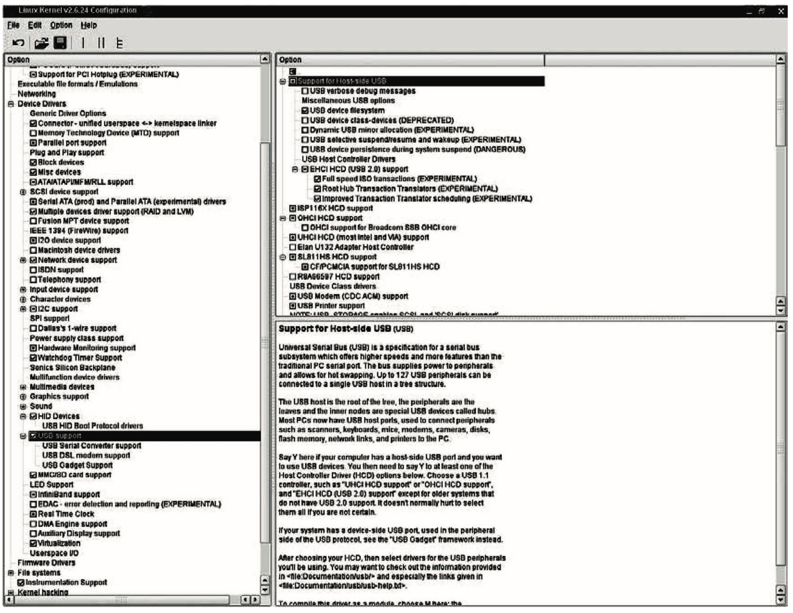
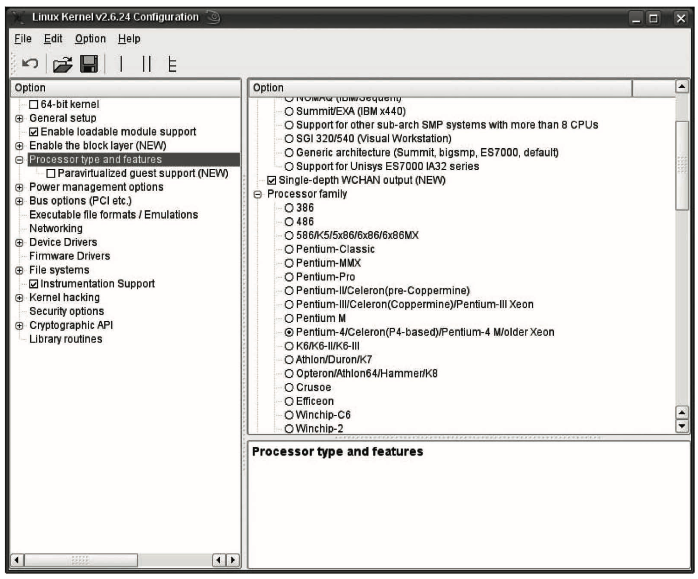

内核在编译之前必须进行配置.

根据一系列选项, 用户可以决定将**哪些函数**包含在**内核**中、**哪些函数**编译为**模块**、哪些函数**排除掉**.

为此, 开发者必须提供一个**表明哪些特性可用**的系统.

所以, 内核采用了一种称之为**Kconfig 的配置语言**, 将在本节后面部分讨论.

该配置语言必须解决下列问题.

- 各组件可以**持久编译到内核**中、可以**编译为组件**或直接**忽略掉**(在某些环境下, 可能无法将某些组件编译为模块).
- 在配置选项之间, 可能存在**相互依赖关系**. 换言之, 某些选项只能与一个或多个其他选项连同使用.
- 必须能够给出一个**可用选项列表**, 供用户从中选择. 有些情形, 需要提示用户输入编号(或类似的值).
- 必须能够**层次化**地编排各种配置选项(在一个**树型结构**中).
- 配置选项可能依体系结构而不同.
- 配置语言不应该过于复杂, 因为编写配置脚本并非大多数内核程序员喜欢做的事情.

**配置信息**应该**散布在整个源代码树**中, 使得**没必要**维护一个**巨型的中枢配置文件**, 这种巨型配置文件将难于打补丁. 在代码包含了可配置选项的**每个子目录**中, 都必须有一个配置文件.

# 配置文件示例

配置文件的语法并不特别复杂, 如以下取自 USB 子系统的例子所示(稍作修改):

```Kconfig
// drivers/usb/Kconfig
#
# USB device configuration
#

menuconfig "USB support"
        bool "USB support"
        depends on HAS_IOMEM
        default y
        ---help---
         This option adds core support for Universal Serial Bus (USB).
         You will also need drivers from the following menu to make use of it.
if USB_SUPPORT

config USB_ARCH_HAS_HCD
        boolean
        default y if USB_ARCH_HAS_OHCI
        ...
        default PCI

config USB_ARCH_HAS_OHCI
        boolean
        # ARM:
        default y if SA1111
        default y if ARCH_OMAP
        # PPC:
        default y if STB03xxx
        default y if PPC_MPC52xx
        # MIPS:
        default y if SOC_AU1X00
        # more:
        default PCI

config USB
        tristate "Support for USB"
        depends on USB_ARCH_HAS_HCD
        ---help---
          Universal Serial Bus (USB) is a specification for a serial bus
          subsystem which offers higher speeds and more features than the
          traditional PC serial port. The bus supplies power to peripherals
          ...

source "drivers/usb/core/Kconfig"
source "drivers/usb/host/Kconfig"
...
source "drivers/usb/net/Kconfig"

comment "USB port drivers"
        depends on USB

config USB_USS720
        tristate "USS720 parport driver"
        depends on USB && PARPORT
        ---help---
          This driver is for USB parallel port adapters that use the Lucent
          Technologies USS-720 chip. These cables are plugged into your USB
          port and provide USB compatibility to peripherals designed with
          parallel port interfaces.
          ...

source "drivers/usb/gadget/Kconfig"

endif # USB_SUPPORT
```

图 B\-2 说明了如何在屏幕上显示定义的树型结构, 使得用户可以选择想要的选项.

图 B-2 USB 子系统配置结构的屏幕显示:



menuconfig 产生一个菜单项, 其标题是一个字符串, 在这里是 USB support. 在用户用 make menuconfig 或图形化的 make xconfig 或 make gconfig 配置内核时, 该菜单项会作为一个新子树的根出现. 所做的选择保存在一个变量中, 这里是`USB_SUPPORT`, 有两个可能的值, 因为这是一个布尔型变量, 由 bool 标明. 如果取消对`USB_SUPPORT`的选择, 那么配置树中不会出现与 USB 相关的其他配置信息, 这可以由 if 字句保证.

通过`source`, 可以将更多的配置文件**关联进来**(按照惯例, 它们都名为 Kconfig). 这些配置文件的文本内容, 将直接包含到嵌入的配置文件中进行解释.

comment 在**配置选项列表中创建一个注释**. 注释的文本会显示, 但用户**不能进行选择**.

实际的配置选项通过 config 指定. 对每个选项来说, 只有一个 config 类型的数据项. config 之后的字符串称之为配置符号(configuration symbol), 可接受用户选择. 每个选项都需要一个类型, 来定义用户可以进行什么样类型的选择. 在本例中, 选择的类型是三态的, 即可以选择下面的一个: "compiled in"、"modular"或"do not compile". 根据所做的选择, 配置符号会分布赋值 y、m、n. 除了三态之外, 内核还提供了其他的选择类型, 将在本节稍后讨论.

配置选项的依赖关系通过 depends on 指定. 其他的配置符号传递到该语句作为参数, 它们可用使用 C 语言中的逻辑运算符连接起来(&&、||、!, 分别是与、或、非). 除非所指定的前提条件满足,  否则菜单项是不显示的.

`--help--`表示其后的文字是帮助文本, 如果用户不确认配置项的语义, 就可以显示帮助文本.

缩进的改变表示帮助文本结束, 内核就知道又需要处理通常的配置语句了.  例子中给出了两个配置选项. 第一个定义了 USB 配置符号, 所有其他配置项都依赖该选项. 但除非存在一个 USB 宿主机控制器, 否则该选项是不显示的. 显示与否, 取决于 USB_ARCH_HAS_HCD 配置 选项为 true 还是 false. 为该选项指定 true 值有不同的方式, 例子中给出了以下两种方式:

- 直接支持某种宿主机控制器芯片组(例子中的 OHCI);
- 支持 PCI 总线(即配置符号 PCI 为 true).

如果设置了 USB_ARCH_HAS_OHCI, 那么 OHCI 芯片组支持是可用的. 在支持 PCI 总线时, 总是这样. 但有些系统可能在没有 PCI 支持的情况下使用该芯片组. 这些系统将显式列出并包括进来, 例如基于 ARM 的机器和一些基于 PPC 的型号.

第二个配置选项(USS720)依赖两件事情. 系统不仅要支持 USB, 还需要支持并行端口. 否则,  驱动选项根本不会显示.

如例子所示, 在注释之间以及配置选项之间, 可能存在依赖关系. 除非选中了 USB 支持, 否则 USB Port drivers 项不会显示.

配置树的生成从`arch/arch/Kconfig`开始, 它首先由配置文件读取. 所有其他 Kconfig 文件都通 过 source 递归地包含进来.

# Kconfig 的语言要素

前一个例子并没有完全使用 Kconfig 语言的所有选项. 本节根据内核源代码中的文档, 对其所有语言特性给出一个系统化的概述.

注: 该文档在`Documentation/kbuild/kconfig-language.txt`中.

## 菜单

菜单使用以下命令指定:

```
menu "string"
    <attributes>

<configuration options>

endmenu
```

其中 string 是菜单的名称. menu 和 endmenu 之间所有项都解释为该菜单的菜单项, 自动地从菜单继承了依赖关系(将添加到菜单项现存的依赖关系中).

关键字 menuconfig 用于定义一个配置符号和一个子菜单. 那么下述写法可以进行调整:

```
menu "Bit bucket compression support"

    config BIT_BUCKET_ZLIB
        tristate "Bit bucket compression support
```

可以调整为下述更简短的格式:

```
menuconfig BIT_BUCKET_ZLIB
        tristate "Bit bucket compression support"
```

另一个关键字 mainmenu, 只能出现在配置层次结构的顶部(且只能出现一次), 用于为整个层次 结构指定一个标题. 因而该项只用于 arch/arch/Kconfig 中, 因为这些文件表示配置层次结构的起始 点. 例如, 用于 Sparc64 处理器的版本包含以下项:

```
mainmenu "Linux/UltraSPARC Kernel Configuration"
```

## 配置选项

配置选项由关键字 config 开头, 必须后接一个配置符号.

```
config <symbol>
    <type-name> "Description"
    <attributes>
```

类型名(`<type-name>`)表示选项的类型. 如前所述, tristate 类型的值为以下一种状态:y、 n 或 m. 其他的选项类型如下所示:

- bool 用于返回 y 或者 n 的布尔查询, 即是否选中该项.   string 查询一个字符串.
- hex 和 integer 分别读取十六进制和十进制数.

还可以使用下列语法:

```
config <symbol>
    <type-name>
    prompt "Description
```

从功能上讲, 它与前者是等价的, 但较为简短.

如果要求用户从一组选项中选择一个, 则必须使用 choice, 其语法如下:

```
choice
    <attributes>

config <symbol_1>
    <type-name>
    <attributes>

...

config <symbol_n>
    <type-name>
    <attributes>

endchoice
```

每个配置选项都有自身的配置符号, 如果选中对应的选项, 则其值是 y, 否则为 n. choice 通常 表示为配置前端界面上的一组单选按钮, 如图 B\-3 所示.

图 B\-3 用 choice 在 IA\-32 平台上选择 CPU



图 B-3 中 CPU 选择部分的源代码如下所示(为提高可读性, 已经省去了帮助文本):

```
choice
        prompt "Processor family"
        default M686 if X86_32

config M386
        bool "386"
        depends on X86_32 && !UML
        ---help---
        这里用于为用户的 CPU 选择处理器类型. 该信息用于优化. 为编译在所有 x86 CPU 类型上都能运行的
        内核(可能不是最快), 可以在这里指定"386"类型.
        ...

config M486
        bool "486"

config M586
        bool "586/K5/5x86/6x86/6x86MX"

config M586TSC
        bool "Pentium-Classic"

config M586MMX
        bool "Pentium-MMX"

config M686
        bool "Pentium-Pro"

config MPENTIUMII
        bool "Pentium-II/Celeron(pre-Coppermine)"

...

config MGEODE_LX
        bool "Geode GX/LX"

config MCYRIXIII
        bool "CyrixIII/VIA-C3"

config MVIAC3_2
        bool "VIA C3-2 (Nehemiah)"

...
endchoice
```

## 属性

属性用于更准确地指定配置选项的效果. 内核源代码的下列片段使用了属性:

```
config SWAP
        bool "Support for paging of anonymous memory (swap)"
        depends on MMU & BLOCK
        default y
```

depends on 指定, 仅当为带有 MMU 的系统编译内核时, 而且在块层编译到内核值时, 才能选中 SWAP. default 表示默认情况下选择 y, 如果用户不修改设置, 该值将自动地指派给 SWAP 符号.

在我们讲解如何指定依赖关系(在下一小节讲述)之前, 先来了解下列属性.
 
- default 指定了配置项的默认设置. 对于 bool 查询, 可能的默认值是 y 或 n. 对于 tristate 类型来说, m 是第三种可能性. 对于其他类型的选项, 必须指定默认值. string 需要指定字符串, 而 integer 和 hex 需要指定数值.
- range 限制了数值选项的可能范围. 第一个参数指定下限, 第二个参数指定上限.
- 在使用 select 语句选中配置项的情况下, select 用于自动地选择其他的配置选项. 这种逆向依赖机制只能用于 tristate 和 bool 类型的选项.
- help 和--help--用于加入帮助文本, 如前文所示.

所有这些属性都可能后接 if 子句, 其中指定了应用该属性的条件. 类似 depends on, 这里也会将该属性依赖的符号通过逻辑运算符连接起来进行判断, 如下例(虚构的)所示:

```
config ENABLE_ACCEL
  bool "Enable device acceleration"
  default n

...

config HYPERCARD_SPEEDUP
  integer "HyperCard Speedup"
  default 20 if ENABLE_ACCEL
  range 1 20
```

## 依赖关系

前文解释过, 配置项的依赖关系可以通过逻辑子句指定, 其语法类似于 C 语言. 依赖关系的规范结构如下所示:

```
depends [on] <expr>
<expr> ::= <Symbol>
           <Symbol> '=' <Symbol>
           <Symbol> ''=' <Symbol>
        '  (' <expr> ')'
        '! ' <expr>
        <expr> '&&' <expr>
        <expr> '||' <expr>
```

可能的表达式按其解释次序依次列出. 换言之, 排在前面的表达式, 其优先级高于排在后面的.

操作的语义与 C 语言语法中对应的操作相同: y = 2, n = 0, 而 m = 1. 除非依赖关系计算的结果非 0, 否则菜单项是不可见的.

一种特定的依赖关系通过"EXPERIMENTAL"指定. 仍然处于试验阶段的驱动程序必须用该依赖关 系标记(如果该驱动程序自身还有其他依赖关系, 则需要用&&逻辑操作连接). 因为内核在 init/Kconfig 中提供了一个配置选项, 允许用户将该符号设置为 y 或 n(提示用户处于开发阶段和/或 不完整的代码/驱动程序), 对渴求稳定性的用户来说, 很容易从配置选项中删除此类驱动程序. 字符串"(Experimental)"应该出现在末尾, 表明该驱动程序的代码实际上是试验性的.

# 处理配置信息

按下列步骤处理配置信息.

(1) 内核**首先由用户配置**. 这预先假定已经准备好所有可能选项的一个列表, 并以文本或图形方式呈现出来(可用的配置已经根据所选的体系结构进行了限制, 这一点无须用户干涉).

(2) 接下来将**用户的选择**保存到一个**独立的文件**中, 一直保持到下一次(重新)配置之前, 并保证所用的工具能够访问该文件.

(3)**所选的配置符号必须存在**, 对于由一系列**Makefile 实现的联编系统**和**内核源代码中的预处理器语句**来说, 都要求如此.

在发起内核配置时, 有各种 make 目标(make destconfig). 各自都有不同的用途.

- menuconfig 提供了一个控制台驱动的前端, 而 xconfig 和 gconfig 则提供了基于各种 X11 工具包(Qt 或 GTK)的图形用户界面.
- `oldconfig`分析**已经保存**在`.config`中的配置选项, 对可能在内核更新之后添加、但尚未进行选择的选项作出提示.
- defconfig 应用由体系结构维护者定义的默认配置(相关信息保存在 arch/arch/defconfigk 中).
- allyesconfig 创建一个新的配置文件, 其中所有选择都设置为 y(在支持 y 值的选项处). allmodconfig 也将所有选项都设置为 y, 但在可能的情况下会使用 m. allnoconfig 产生一个最低限度的配置, 其中删除了编译关键内核组件不需要的其他选项.

这三种目标在建立新的内核发布版时, 用于进行测试. 通常, 最终用户在使用它们时都存在问题. **所有配置选项**都必须分析**各个 Kconfig 文件**中的配置信息, 还必须保存结果配置. **内核源代码**为此提供了**libkconfig 库**. 它提供了例程来执行适当的任务. 本附录不讨论解析器的实现, 其中采用了 Bison 和 Flex 这两个解析器和词法分析器的生成工具. 相关的源代码可参见`scripts/kconfig/zconf.y`和`zconf.l`.

用户定义的配置选项保存在`.config`中, 如下所示:

```config
wolfgang@meitner> cat .config
#
# Automatically generated make config: don't edit # Linux kernel version: 2.6.24
# Thu Mar 20 00:09:15 2008
#
CONFIG_64BIT=y
# CONFIG_X86_32 is not set
CONFIG_X86_64=y
CONFIG_X86=y
CONFIG_GENERIC_TIME=y
...
#
# General setup
#
CONFIG_EXPERIMENTAL=y
CONFIG_LOCK_KERNEL=y
CONFIG_INIT_ENV_ARG_LIMIT=32 CONFIG_LOCALVERSION="-default" CONFIG_LOCALVERSION_AUTO is not set
...
CONFIG_PLIST=y
CONFIG_HAS_IOMEM=y
CONFIG_HAS_IOPORT=y
CONFIG_HAS_DMA=y
CONFIG_CHECK_SIGNATURE=y
```

所有配置符号的前缀都是`CONFIG_`字符串. 如果设置了相关配置项, 则在其后附加`=y`或`=n`. 未设置的选项使用`#`号注释掉.

为使**内核源代码**能够看到所选的配置, 必须包含`<config.h>`文件. 该文件又将`<autoconf.h>`包含到源代码中. 后者包含了**预处理器可以提取的配置信息**, 如下所示:

```
<autoconf.h>
/*
* Automatically generated C config: don't edit
* Linux kernel version: 2.6.24
* Thu Mar 20 00:09:26 2008
*/
#define AUTOCONF_INCLUDED
#define CONFIG_USB_SISUSBVGA_MODULE 1
#define CONFIG_USB_PHIDGETMOTORCONTROL_MODULE 1
#define CONFIG_VIDEO_V4L1_COMPAT 1
#define CONFIG_PCMCIA_FMVJ18X_MODULE 1
...
#define CONFIG_USB_SERIAL_SIERRAWIRELESS_MODULE 1
#define CONFIG_VIDEO_SAA711X_MODULE 1
#define CONFIG_SATA_INIC162X_MODULE 1
#define CONFIG_AIC79XX_RESET_DELAY_MS 15000
#define CONFIG_NET_ACT_GACT_MODULE 1
...
#define CONFIG_USB_BELKIN 1
#define CONFIG_NF_CT_NETLINK_MODULE 1
#define CONFIG_NCPFS_PACKET_SIGNING 1
#define CONFIG_SND_USB_AUDIO_MODULE 1
#define CONFIG_I2C_I810_MODULE 1
#define CONFIG_I2C_I801_MODULE 1
```

配置符号的前缀仍然是`CONFIG_`. 每个**选中的选项**都定义为`1`. 模块选项同样定义为 1, 但预处理器符号末尾附加了`_MODULE`字符串. 未选择的配置项用 undef 明确地标记为未定义. 数值和字符串都替换为用户选择的值.

这使得可以向源代码中插入对配置信息的查询. 例如:

```
#ifdef CONFIG_SYMBOL
/* 设置 SYMBOL 情况下的代码 */
#else
/* 未设置 SYMBOL 情况下的代码 */
#endif
```