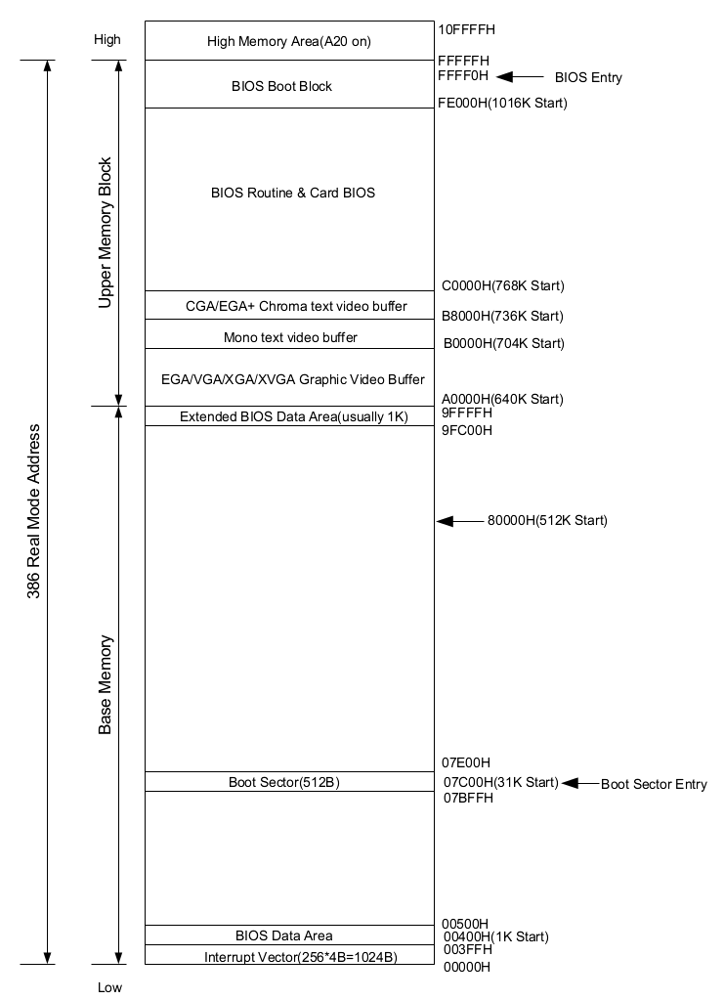
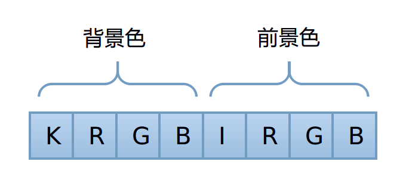
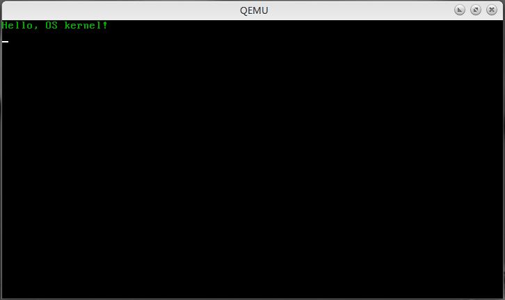

本章将开始描述内核对屏幕输出的控制.

# 1MB 以下的地址空间分布

在第二章我们简单的谈过地址空间的概念, 并提到 4G 的地址空间并非全部指向主存储器, 而是有部分的地址分给了其他外设.

特别地, 在**地址空间的最低 1MB 处**, 有很多地址是属于**外部设备**的, 下图描绘了该处地址映射的分布情况:



在 PC 上要**显示文字**, 通常需要**显示器**和**显卡**这两个硬件设备.

- 一般来说**显卡负责提供显示内容**, 并控制具体的**显示模块**和**状态**.

- **显示器**的职责是负责将**显卡呈递的内容**可视化的**显示**出来.

既然**显卡**需要控制显示的数据, 自然就需要**存储这些待显示的内容**, 所以显卡就有自己的**存储区域**. 这个存储区域叫做**显示存储器**(`Video RAM, VRAM`), 简称显存. 当然, 访问显存就需要地址. `CGA/EGA+ Chroma text video buffer` 这个区域映射的就是工作在**文本模式的显存**.

同时显卡还有另外一个工作模式叫做**图形模式**, 这个模式是目前最最常用的模式.

# 显卡在文本模式下的显示规则

我们知道, 对于**一个字符的编码**通常有**输入码**、**内码**和**字模码**三种.

## 字模码

其中**字模码**定义了**一个字符**在屏幕上显示的**点阵坐标**.

通常显卡内置一套关于**基本英文字符**的显示是很容易做到的, 而**内置汉字的显示**就较为麻烦.

在这篇文档中我们**只使用**显卡的**文本模式**, 不会涉及到图形模式的内容. 因为一旦使用了图形模式的内容, 我们就需要**自行定义字符的字模码**了, 这很繁琐而且对我们理解操作系统原理的意义不是很大. 所以我们只使用显卡的文本模式进行屏幕显示控制.

所有**在 PC 上工作的显卡**, 在**加电初始化之后**都会自动初始化到`80\*25`的**文本模式**. 在这个模式下, 屏幕被划分为**25 行**, 每行可以显示**80 个字符**, 所以一屏可以显示**2000 个字符**. 上图中的`0xB8000~0xBFFFF`这个地址段便是映射到**文本模式的显存**的.

当**访问这些地址**的时候, 实际上读写的是**显存区域**, 而**显卡**会**周期性**的**读取这里的数据**, 并且把它们按顺序显示在屏幕上.

## 内码

那么, 按照**什么规则显示**呢?这就要谈到**内码**了.

**内码**定义了**字符在内存！！！** 中**存储的形式！！！**, 而英文编码就是大家所熟知的**ASCII**(`American Standard Code for Information Interchange, 美国信息交换标准代码`)码了.

对应的关系很简单, 从`0xB8000`这个地址开始, **每 2 个字节**表示屏幕上显示的**一个字符**.

从屏幕的第一行开始对应, 一行接着一行的对应下去. 而这两个字节的**前一个**是显示字符的**ASCII 码**, **后一个**是控制这个字符**颜色和属性**的控制信息, 这个字节的 8 个 bit 位表示不同的含义. 每一位的含义如图所示:



这些位的组合效果如下图所示:


这两张图可以帮助我们在**显卡的字符模式**显示**彩色的文本**了, 懂得这些原理对于探索性质的显示也就足够了.

理解了显卡文本模式的原理之后接下来就是对屏幕显示控制编码了. 不过显卡除了显示内容的存储单元之外, 还有部分的显示控制单元需要了解. 这些**显示控制单元**被编制在了**独立的 I/O 空间**里, 需要用特殊的`in/out`指令去读写. 这里相关的控制寄存器多达 300 多个, 显然无法一一映射到 I/O 端口的地址空间. 对此工程师们解决方案是, 将一个端口作为内部寄存器的索引: `0x3D4`, 再通过`0x3D5`端口来设置相应寄存器的值.

# 端口读写函数的实现

在具体的设置之前, 我们首先需要几个**端口读写函数**的实现.

因为 C 语言并没有直接操作端口的方法, 而且频繁的内联汇编麻烦又容易出错. 所以好的做法就是定义几个端口读写函数. 代码如下:

```cpp
#include "common.h"

// 端口写一个字节
inline void outb(uint16_t port, uint8_t value)
{
    asm volatile ("outb %1, %0" : : "dN" (port), "a" (value));
}

// 端口读一个字节
inline uint8_t inb(uint16_t port)
{
    uint8_t ret;

    asm volatile("inb %1, %0" : "=a" (ret) : "dN" (port));

    return ret;
}

// 端口读一个字
inline uint16_t inw(uint16_t port)
{
    uint16_t ret;

    asm volatile ("inw %1, %0" : "=a" (ret) : "dN" (port));

    return ret;
}
```

对应的头文件如下:

```cpp
#ifndef INCLUDE_COMMON_H_
#define INCLUDE_COMMON_H_

#include "types.h"

// 端口写一个字节
void outb(uint16_t port, uint8_t value);

// 端口读一个字节
uint8_t inb(uint16_t port);

// 端口读一个字
uint16_t inw(uint16_t port);

#endif // INCLUDE_COMMON_H_
```

细心的读者想必已经发现了函数定义之前的 inline 关键字了吧?这是 GNU 对 ANSI
C 的扩展, 它和 C++语言里的 inline 的作用是一样的. 函数前面加上 inline 之后, 编译器会尝试[^3]在该函数的调用点进行直接进行代码展开, 而不是传统的函数调用. 这么做的既有传统函数的好处, 即避免了重复性的编码, 减少了出错的几率. 又减少了函数的调用, 提高了代码的执行效率. 另外, 你可能见过宏函数这种用法, 但是宏函数是没有参数类型的检查的, 相比 inline 还是逊了一筹.

# 颜色的枚举定义和屏幕操作函数的实现

接下来是颜色定义的枚举和一些屏幕控制函数的声明. 代码如下:

```cpp
#ifndef INCLUDE_CONSOLE_H_
#define INCLUDE_CONSOLE_H_

#include "types.h"

typedef
enum real_color {
    rc_black = 0,
    rc_blue = 1,
    rc_green = 2,
    rc_cyan = 3,
    rc_red = 4,
    rc_magenta = 5,
    rc_brown = 6,
    rc_light_grey = 7,
    rc_dark_grey = 8,
    rc_light_blue = 9,
    rc_light_green = 10,
    rc_light_cyan = 11,
    rc_light_red = 12,
    rc_light_magenta = 13,
    rc_light_brown  = 14,   // yellow
    rc_white = 15
} real_color_t;

// 清屏操作
void console_clear();

// 屏幕输出一个字符  带颜色
void console_putc_color(char c, real_color_t back, real_color_t fore);

// 屏幕打印一个以 \0 结尾的字符串  默认黑底白字
void console_write(char *cstr);

// 屏幕打印一个以 \0 结尾的字符串  带颜色
void console_write_color(char *cstr, real_color_t back, real_color_t fore);

// 屏幕输出一个十六进制的整型数
void console_write_hex(uint32_t n, real_color_t back, real_color_t fore);

// 屏幕输出一个十进制的整型数
void console_write_dec(uint32_t n, real_color_t back, real_color_t fore);

#endif  // INCLUDE_CONSOLE_H_
```

参照着前面的表格, 理解颜色的枚举类型并不困难. 接下来是显存起始位置和当前输出的屏幕位置的变量定义. 同时, 我们将屏幕抽象为一个 80\*25 的二维数组, 每个数组成员都是 2 个字节, 表示屏幕上显示的一个字符.

```
    // VGA 的显示缓冲的起点是 0xB8000
    static uint16_t *video_memory = (uint16_t *)0xB8000;

    // 屏幕"光标"的坐标
    static uint8_t cursor_x = 0;
    static uint8_t cursor_y = 0;
```

请大家留意这里变量定义时候的 static
限定符, 当一个全局变量或者函数只在本模块文件内被使用时, 最好限定其作用域. 每个模块应当尽可能的向外部暴露较少的接口.

### 屏幕输入光标的移动

在本模块内, cursor\_x 和 cursor\_y
这两个变量指明了逻辑上的当前输出位置, 但是并没有实际上移动硬件的显示"光标", 下面的函数实现了根据这两个变量的值移动光标的功能.

    static void move_cursor()
    {
        // 屏幕是 80 字节宽
        uint16_t cursorLocation = cursor_y * 80 + cursor_x;

        // 在这里用到的两个内部寄存器的编号为 14 与 15, 分别表示光标位置
        // 的高 8 位与低 8 位.

        outb(0x3D4, 14);                    // 告诉 VGA 我们要设置光标的高字节
        outb(0x3D5, cursorLocation >> 8);   // 发送高 8 位
        outb(0x3D4, 15);                    // 告诉 VGA 我们要设置光标的低字节
        outb(0x3D5, cursorLocation);        // 发送低 8 位
    }

这里的端口和设置值都是固定的, 也没有什么道理可讲. 虽然显卡的各项技术发展的很快, 但是这个原始的 VGA 标准被所有显卡完整的保存了下来.

### 清屏操作

然后是清屏操作, 其实这里的"清屏"很简单, 其实就是用白底黑字的"空格符"覆盖整个屏幕的显示区域罢了. 这么做自然就实现了我们想要的"清屏"操作了. 代码很简单:

    void console_clear()
    {
        uint8_t attribute_byte = (0 << 4) | (15 & 0x0F);
        uint16_t blank = 0x20 | (attribute_byte << 8);

        int i;
        for (i = 0; i < 80 * 25; i++) {
              video_memory[i] = blank;
        }

        cursor_x = 0;
        cursor_y = 0;
        move_cursor();
    }

### 屏幕滚动显示

那么屏幕滚动呢?用 C 语言来描述实际上就是将后 24 行的数据全部向上挪动一行, 最后一行清空罢了, 就是这么简单.

    static void scroll()
    {
        // attribute_byte 被构造出一个黑底白字的描述格式
        uint8_t attribute_byte = (0 << 4) | (15 & 0x0F);
        uint16_t blank = 0x20 | (attribute_byte << 8);  // space 是 0x20

        // cursor_y 到 25 的时候, 就该换行了
        if (cursor_y >= 25) {
            // 将所有行的显示数据复制到上一行, 第一行永远消失了...
            int i;

            for (i = 0 * 80; i < 24 * 80; i++) {
                  video_memory[i] = video_memory[i+80];
            }

            // 最后的一行数据现在填充空格, 不显示任何字符
            for (i = 24 * 80; i < 25 * 80; i++) {
                  video_memory[i] = blank;
            }

            // 向上移动了一行, 所以 cursor_y 现在是 24
            cursor_y = 24;
        }
    }

### 显示字符串

那么屏幕显示字符串呢?我们可以先实现屏幕显示一个字符的函数, 那么屏幕显示一个字符串不就可以了么. 这几个函数的实现如下:

    void console_putc_color(char c, real_color_t back, real_color_t fore)
    {
        uint8_t back_color = (uint8_t)back;
        uint8_t fore_color = (uint8_t)fore;

        uint8_t attribute_byte = (back_color << 4) | (fore_color & 0x0F);
        uint16_t attribute = attribute_byte << 8;

        // 0x08 是退格键的 ASCII 码
        // 0x09 是 tab 键的 ASCII 码
        if (c == 0x08 && cursor_x) {
              cursor_x--;
        } else if (c == 0x09) {
              cursor_x = (cursor_x+8) & ~(8-1);
        } else if (c == '\r') {
              cursor_x = 0;
        } else if (c == '\n') {
            cursor_x = 0;
            cursor_y++;
        } else if (c >= ' ') {
            video_memory[cursor_y*80 + cursor_x] = c | attribute;
            cursor_x++;
        }

        // 每 80 个字符一行, 满 80 就必须换行了
        if (cursor_x >= 80) {
            cursor_x = 0;
            cursor_y ++;
        }

        // 如果需要的话滚动屏幕显示
        scroll();

        // 移动硬件的输入光标
        move_cursor();
    }

    void console_write(char *cstr)
    {
        while (*cstr) {
              console_putc_color(*cstr++, rc_black, rc_white);
        }
    }

    void console_write_color(char *cstr, real_color_t back, real_color_t fore)
    {
        while (*cstr) {
              console_putc_color(*cstr++, back, fore);
        }
    }

代码里唯一需要注意的便是输出后要检查当前的位置和判断一些特殊的符号表示的操作, 例如换行之类的实现. 同时一定要注意修改存储当前位置的两个变量和移动屏幕上的光标, 而且屏幕输出满了以后要上滚. 我们暂时不考虑诸如屏幕翻页之类的功能. 至于屏幕输出十六进制数字和十进制数字的函数请大家自己实现, 相信这并不困难.

测试屏幕操作函数
----------------

屏幕的操作到这里就告一段落了, 我们修改下初始化函数, 感受一下今天的成果吧.

    #include "console.h"

    int kern_entry(multiboot_t *mboot_ptr)
    {
        console_clear();

        console_write_color("Hello, OS kernel!\n", rc_black, rc_green);

        return 0;
    }

编译运行, 干净的屏幕上出现了我们绿色的文字, 还有下一行闪烁着的输入光标.



本章的内容到这里就结束了, 下一章我们缓缓脚步, 来完成一些更重要的模块.

[^1]: 曾经有类似于"汉卡"之类的硬件出现, 后来随着计算机处理速度的发展, 这些工作一般由软件来负责了.

[^2]: 显卡还有其它分辨率的图形工作模式, 但本文档不涉及.

[^3]: 没错, 是尝试. 内联对编译来说只是一个建议, 编译器有权利根据实际情况自由处理.

