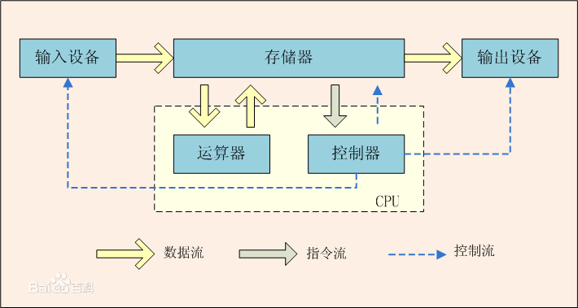
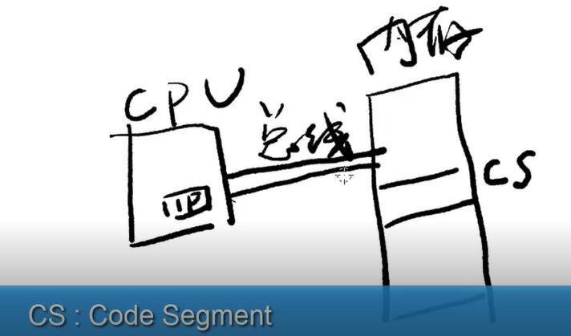
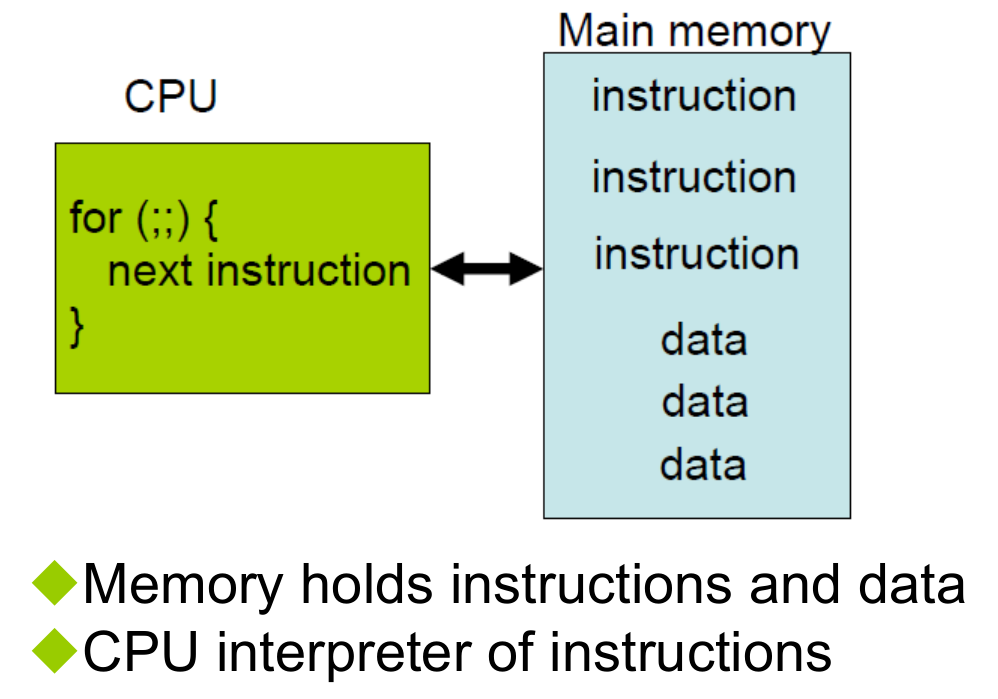
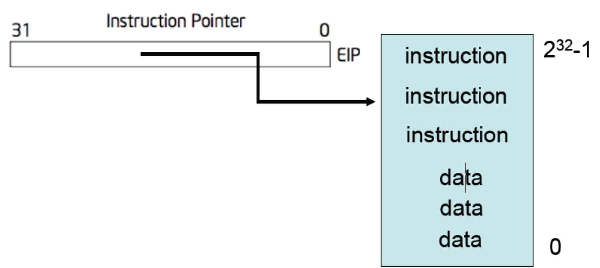

1. 冯诺依曼体系结构

冯·诺依曼开创性的提出了"存储程序"的概念, 把指令和数据同时存放在存储器中, 奠定了现代计算机的结构理论.

概括来说, 主要有如下三点:

- 计算机主要由运算器、存储器、控制器、输入和输出设备组成, 以运算器为中心, I/O 设备与存储器之间的数据流都必须经过运算器;
- 计算机内部使用二进制表示指令和数据, 每一条指令由表示运算类型的操作码和存储器位置的地址码组成;
- 计算机的运行过程, 是不断的把程序和数据读入主存储器, 然后, 按照顺序自动逐条取出指令并执行的的过程.

即存储程序计算机

IP 寄存器 Instruction Pointer 指令指针寄存器. 用于指出当前正在执行的指令在 CS 指明的内存段中的偏移量. 在 32/64 位的处理器中也被称为 EIP/RIP.

CPU 从 IP 指向的内存地址取指令执行, 执行后 IP 就自加一, 取下一条指令.

从程序员角度来看, 存储程序计算机如下图.

- 内存用来保存指令和数据
- CPU 用来解释和执行指令, 通过总线和内存相连

2. API: 程序员和计算机的接口界面

ABI: Application Binary Interface, 程序与 CPU 的接口界面, 二进制的接口

包含下面的信息

-  Instructions encoding: 指令的编码, 这里主要指汇编指令编码成二进制的机器指令
- Registers convention in Instructions: 指令中使用到的寄存器
- Most instructions can take a Memory
address: 大多数指令可以直接访问内存

3. X86 的实现

- EIP 指向内存的某一条指令.
- X86 中的指令占的空间不一定一致, EIP 是可以自加一会自动加到下一条指令
- IP 寄存器的值通常不能直接被访问, 需要使用 CALL,RET,RETF,IRET,JMP,J?? 等指令来改变.